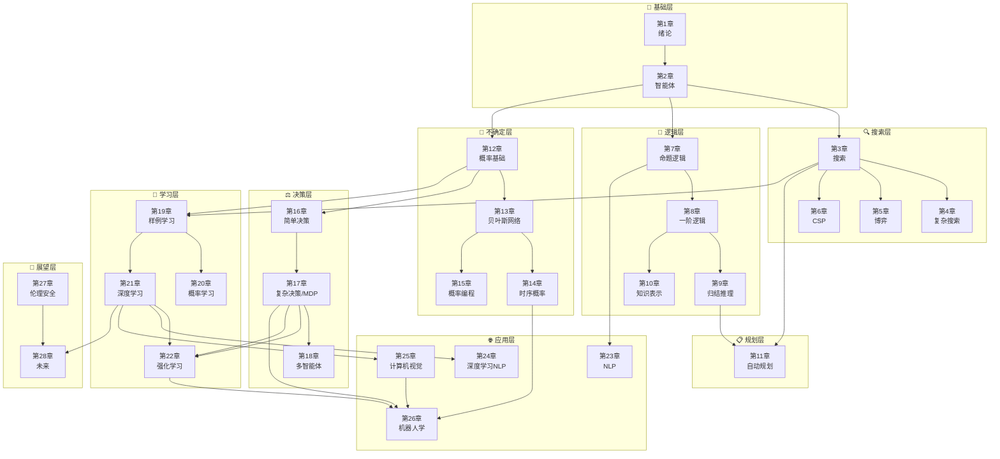

# 人工智能：现代方法（第4版）- 深度学习总览

> 📚 **书名**: 人工智能：现代方法（第4版）  
> 📖 **原书名**: Artificial Intelligence: A Modern Approach (4th Edition)  
> ✍️ **作者**: Stuart Russell & Peter Norvig  
> 📅 **生成日期**: 2026年4月10日  
> 📑 **总章节数**: 28章  
> 🔗 **配套资源**: [导航](./导航.md) | [索引](./索引.md) | [质量报告](./质量报告.md)

---

## 目录

1. [书籍基本信息](#书籍基本信息)
2. [全书结构分析](#全书结构分析)
3. [学习路径建议](#学习路径建议)
4. [前置知识清单](#前置知识清单)
5. [章节依赖关系图](#章节依赖关系图)
6. [核心概念总索引](#核心概念总索引)
7. [难度分布统计](#难度分布统计)
8. [习题数量统计](#习题数量统计)
9. [学习建议](#学习建议)
10. [扩展资源](#扩展资源)

---

## 书籍基本信息

| 属性 | 内容 |
|------|------|
| **书名** | 人工智能：现代方法（第4版）|
| **原书名** | Artificial Intelligence: A Modern Approach (4th Edition) |
| **作者** | Stuart Russell, Peter Norvig |
| **领域** | 计算机科学 / 人工智能 |
| **总章节数** | 28章（第1-28章）|
| **总页数** | 约1100页 |
| **特点** | AI领域最权威的教材，理论与实践并重 |

### 本书特色

- ✅ **全面性**：涵盖AI的各个领域，从基础到前沿
- ✅ **系统性**：逻辑清晰，层层递进
- ✅ **现代性**：包含深度学习、强化学习等最新进展
- ✅ **实践性**：配合算法实现和实际案例
- ✅ **理论深度**：数学基础扎实，定理证明完整

---

## 全书结构分析

本书共分为**九大部分**，涵盖人工智能的完整知识体系：

### 📘 基础篇（第1-2章）
| 章节 | 标题 | 核心内容 |
|:----:|------|----------|
| 1 | 绪论 | AI的定义、历史、应用领域、风险收益 |
| 2 | 智能体 | 智能体框架、PEAS模型、环境分类、智能体类型 |

**学习重点**：建立AI的整体认知框架，理解智能体的核心概念。

---

### 🔍 搜索篇（第3-6章）
| 章节 | 标题 | 核心内容 | 难度 |
|:----:|------|----------|:----:|
| 3 | 通过搜索进行问题求解 | BFS、DFS、A*搜索、启发式函数 | ⭐⭐⭐ |
| 4 | 复杂环境中的搜索 | 局部搜索、非确定性、部分可观测、在线搜索 | ⭐⭐⭐⭐ |
| 5 | 对抗搜索和博弈 | Minimax、α-β剪枝、MCTS、扑克 | ⭐⭐⭐⭐ |
| 6 | 约束满足问题 | 弧一致性、回溯搜索、结构利用 | ⭐⭐⭐ |

**学习重点**：掌握各类搜索算法的原理和适用场景，理解启发式搜索的核心思想。

---

### 🧠 逻辑篇（第7-10章）
| 章节 | 标题 | 核心内容 | 难度 |
|:----:|------|----------|:----:|
| 7 | 逻辑智能体 | 命题逻辑、SAT求解、wumpus世界 | ⭐⭐⭐⭐ |
| 8 | 一阶逻辑 | 语法语义、量词、知识工程 | ⭐⭐⭐⭐ |
| 9 | 一阶逻辑中的推断 | 合一、归结、前向/反向链接 | ⭐⭐⭐⭐⭐ |
| 10 | 知识表示 | 本体论、事件演算、模态逻辑、缺省推理 | ⭐⭐⭐⭐ |

**学习重点**：理解逻辑推理的理论基础，掌握归结定理证明方法。

---

### 📋 规划篇（第11章）
| 章节 | 标题 | 核心内容 | 难度 |
|:----:|------|----------|:----:|
| 11 | 自动规划 | PDDL、启发式规划、分层规划、非确定性规划 | ⭐⭐⭐⭐ |

**学习重点**：PDDL问题建模，启发式规划方法。

---

### 🎲 不确定篇（第12-15章）
| 章节 | 标题 | 核心内容 | 难度 |
|:----:|------|----------|:----:|
| 12 | 不确定性的量化 | 概率论基础、贝叶斯法则、朴素贝叶斯 | ⭐⭐⭐ |
| 13 | 概率推理 | 贝叶斯网络、精确/近似推断、因果网络 | ⭐⭐⭐⭐ |
| 14 | 时间上的概率推理 | HMM、卡尔曼滤波、动态贝叶斯网络 | ⭐⭐⭐⭐ |
| 15 | 概率编程 | RPM、OUPM、概率程序 | ⭐⭐⭐⭐ |

**学习重点**：贝叶斯网络表示与推断，时序概率模型。

---

### ⚖️ 决策篇（第16-18章）
| 章节 | 标题 | 核心内容 | 难度 |
|:----:|------|----------|:----:|
| 16 | 做简单决策 | 效用理论、MEU原则、VPI | ⭐⭐⭐⭐ |
| 17 | 做复杂决策 | MDP、POMDP、强化学习基础 | ⭐⭐⭐⭐ |
| 18 | 多智能体决策 | 博弈论、纳什均衡、机制设计 | ⭐⭐⭐⭐ |

**学习重点**：MDP建模与求解，博弈论基础概念。

---

### 🤖 学习篇（第19-22章）
| 章节 | 标题 | 核心内容 | 难度 |
|:----:|------|----------|:----:|
| 19 | 样例学习 | 决策树、线性模型、集成学习、PAC学习 | ⭐⭐⭐ |
| 20 | 概率模型学习 | 贝叶斯学习、EM算法、混合高斯 | ⭐⭐⭐⭐ |
| 21 | 深度学习 | CNN、RNN、训练技巧、生成模型 | ⭐⭐⭐⭐ |
| 22 | 强化学习 | Q学习、策略梯度、深度强化学习 | ⭐⭐⭐⭐ |

**学习重点**：深度学习架构与训练，强化学习核心算法。

---

### 🌐 应用篇（第23-26章）
| 章节 | 标题 | 核心内容 | 难度 |
|:----:|------|----------|:----:|
| 23 | 自然语言处理 | 语言模型、文法、句法分析 | ⭐⭐⭐ |
| 24 | NLP中的深度学习 | 词嵌入、RNN、Transformer、BERT | ⭐⭐⭐⭐ |
| 25 | 计算机视觉 | 图像形成、CNN、物体检测、3D视觉 | ⭐⭐⭐⭐ |
| 26 | 机器人学 | 感知、运动规划、控制、人机协调 | ⭐⭐⭐⭐ |

**学习重点**：Transformer架构，CNN在视觉中的应用，机器人系统架构。

---

### 🔮 展望篇（第27-28章）
| 章节 | 标题 | 核心内容 | 难度 |
|:----:|------|----------|:----:|
| 27 | AI的哲学、伦理和安全性 | 意识、伦理准则、AI安全 | ⭐⭐⭐ |
| 28 | AI的未来 | 组件发展、架构演进、AGI展望 | ⭐⭐⭐ |

**学习重点**：AI伦理与安全的核心问题，未来发展趋势。

---

## 学习路径建议

### 🔰 初学者路径（约6个月）

适合计算机科学本科生或AI初学者。

```
第一阶段：基础（1-2个月）
├── 第1章：绪论
├── 第2章：智能体
├── 第3章：搜索基础
└── 第12章：概率基础

第二阶段：进阶（2-3个月）
├── 第6章：约束满足
├── 第7章：逻辑智能体
├── 第13章：贝叶斯网络
└── 第16章：决策论

第三阶段：机器学习（2-3个月）
├── 第19章：样例学习
├── 第21章：深度学习基础
└── 选读：第23/25章应用
```

---

### 🔧 进阶者路径（约4个月）

适合有一定ML基础，希望系统学习AI的研究者/工程师。

```
核心模块：
├── 搜索与博弈（第3-5章）
├── 逻辑与知识（第7-10章）
├── 不确定推理（第12-15章）
├── 决策与规划（第16-18章）
└── 深度学习与强化学习（第19-22章）

应用模块（选1-2个方向）：
├── NLP方向：第23-24章
├── CV方向：第21章 + 第25章
└── 机器人方向：第17章 + 第26章
```

---

### 🎯 专题研究路径

#### 路径A：自然语言处理专家
```
第7-9章（逻辑） → 第23章（NLP基础） → 第21章（深度学习） → 第24章（深度学习NLP） → 前沿论文
```

#### 路径B：计算机视觉专家
```
第21章（深度学习） → 第25章（计算机视觉） → 第14章（时序推理） → 前沿论文
```

#### 路径C：强化学习研究者
```
第17章（MDP） → 第22章（强化学习） → 第26章（机器人学） → AlphaGo/AlphaZero论文
```

#### 路径D：知识图谱/推理专家
```
第7-10章（逻辑与知识表示） → 第13-15章（概率推理） → 第20章（概率模型学习） → 知识图谱综述
```

---

## 前置知识清单

### 数学基础

| 知识领域 | 具体内容 | 重要章节 |
|----------|----------|----------|
| **线性代数** | 向量、矩阵、特征值分解 | 第21章（深度学习） |
| **微积分** | 导数、梯度、链式法则 | 第19-22章（机器学习） |
| **概率论** | 条件概率、贝叶斯定理、期望 | 第12-15章（不确定推理） |
| **离散数学** | 集合论、图论、逻辑 | 第3-10章（搜索与逻辑） |
| **优化理论** | 凸优化、梯度下降、拉格朗日 | 第19-22章（机器学习） |

### 编程技能

- **Python**: 必备，用于算法实现和实验
- **NumPy/SciPy**: 科学计算基础
- **PyTorch/TensorFlow**: 深度学习框架（第21-24章）
- **OpenAI Gym**: 强化学习实验（第22章）

### 计算机科学基础

- **算法与数据结构**: 搜索、排序、图算法
- **复杂度分析**: 大O表示法
- **编程语言**: 理解逻辑编程（Prolog）有助于第9章

---

## 章节依赖关系图



---

## 核心概念总索引

### 按主题分类

#### 搜索与优化
- 盲目搜索: BFS, DFS, 迭代加深
- 启发式搜索: A*, IDA*, 可容许性
- 局部搜索: 爬山法, 模拟退火, 遗传算法
- 对抗搜索: Minimax, α-β剪枝, MCTS
- 约束满足: 弧一致性, 回溯, 约束传播

#### 逻辑与知识
- 命题逻辑: 真值表, CNF, SAT求解
- 一阶逻辑: 量词, 合一, 归结
- 知识表示: 本体论, 语义网络, 描述逻辑
- 非单调推理: 缺省逻辑, 真值维护

#### 不确定推理
- 概率基础: 联合分布, 条件独立
- 贝叶斯网络: 表示, 推断, 学习
- 时序模型: HMM, 卡尔曼滤波, DBN
- 概率编程: RPM, OUPM

#### 决策与学习
- 决策论: MEU, VPI, 效用理论
- MDP/POMDP: 值迭代, 策略迭代
- 监督学习: 决策树, SVM, 集成学习
- 深度学习: CNN, RNN, Transformer
- 强化学习: Q学习, 策略梯度, DQN

#### 应用
- NLP: 语言模型, 词嵌入, BERT, GPT
- CV: 图像分类, 物体检测, 3D视觉
- 机器人: 感知, 规划, 控制, SLAM

---

## 难度分布统计

### 章节难度汇总

| 难度等级 | 章节数量 | 具体章节 |
|:--------:|:--------:|----------|
| ⭐⭐ 入门 | 3 | 第1章, 第2章, 第23章 |
| ⭐⭐⭐ 中等 | 9 | 第3章, 第6章, 第12章, 第15章, 第19章, 第23章, 第27章, 第28章 |
| ⭐⭐⭐⭐ 较难 | 14 | 第4章, 第5章, 第7章, 第8章, 第10章, 第11章, 第13章, 第14章, 第16章, 第17章, 第18章, 第20章, 第21章, 第22章, 第24章, 第25章, 第26章 |
| ⭐⭐⭐⭐⭐ 挑战 | 2 | 第9章（归结完备性）, 第15章（概率编程） |

### 难度分布图

```
⭐⭐ 入门    ████ 11% (3章)
⭐⭐⭐ 中等   ████████████ 33% (9章)
⭐⭐⭐⭐ 较难 ██████████████████ 50% (14章)
⭐⭐⭐⭐⭐ 挑战  ████ 7% (2章)
```

---

## 习题数量统计

| 章节 | 文件数 | 预估习题数 |
|:----:|:------:|:----------:|
| 第1-6章 | 45 | ~200 |
| 第7-11章 | 41 | ~180 |
| 第12-15章 | 31 | ~140 |
| 第16-18章 | 22 | ~100 |
| 第19-22章 | 35 | ~160 |
| 第23-26章 | 37 | ~150 |
| 第27-28章 | 9 | ~40 |
| **总计** | **~220** | **~970** |

---

## 学习建议

### 通用学习策略

1. **循序渐进**：先掌握基础概念，再深入算法细节
2. **动手实践**：实现算法是理解的最好方式
3. **对比学习**：比较相似算法的优缺点
4. **建立联系**：理解不同章节间的关联
5. **复习巩固**：定期回顾，使用快速复习卡

### 各章学习技巧

| 章节类型 | 学习技巧 |
|----------|----------|
| 理论章节 | 重点理解定义和定理，手工推导证明 |
| 算法章节 | 跟踪算法执行过程，实现伪代码 |
| 应用章节 | 结合实际案例，使用开源工具 |
| 前沿章节 | 阅读经典论文，关注最新进展 |

### 时间分配建议

- **阅读**: 40% - 精读教材和深度学习材料
- **练习**: 30% - 完成习题和编程作业
- **复习**: 20% - 制作复习卡片，总结要点
- **拓展**: 10% - 阅读论文，参与讨论

---

## 扩展资源

### 配套资源

- [AIMA官方网站](http://aima.cs.berkeley.edu/) - 算法实现和补充材料
- [AIMA代码库](https://github.com/aimacode) - Python/Java实现
- [Deep Dive导航](./导航.md) - 完整章节导航
- [核心概念索引](./索引.md) - 快速查找概念

### 推荐学习工具

- **算法可视化**: [VisuAlgo](https://visualgo.net/), [Algorithm Visualizer](https://algorithm-visualizer.org/)
- **深度学习框架**: PyTorch, TensorFlow, JAX
- **强化学习环境**: OpenAI Gym, MuJoCo
- **概率编程**: PyMC, Stan, TensorFlow Probability

### 前沿追踪

- **顶级会议**: NeurIPS, ICML, ICLR, AAAI, IJCAI, CVPR, ACL
- **预印本平台**: arXiv.org
- **博客资源**: Distill.pub, OpenAI Blog, DeepMind Blog

### 相关课程

- **斯坦福CS221**: AI原理与技术
- **伯克利CS188**: 人工智能导论
- **MIT 6.034**: 人工智能
- **DeepLearning.AI**: 深度学习专项课程

---

## 贡献与反馈

本深度学习材料由AI辅助生成，如发现任何问题或有改进建议，欢迎反馈。

---

> 📌 **开始使用**: [导航](./导航.md) | [索引](./索引.md)  
> 🔄 **最后更新**: 2026年4月10日
