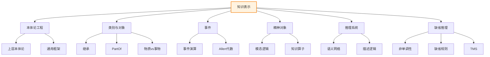

# 第10章 知识表示 - 概览与总结

> 📚 本章 Deep Dive 概览 | 预计总学习时间: 320 分钟

---

## 1. 学习目标

### 1.1 本章核心目标

完成本章学习后，你应该能够：

1. **理解本体论工程的基本思想**
   - 解释上层本体论与领域本体论的区别
   - 描述本体论构建的四条路径
   - 分析通用本体论的适用性条件

2. **掌握类别与对象的表示方法**
   - 使用谓词和物化两种方式表示类别
   - 定义子类关系和继承机制
   - 区分物质（Stuff）和事物（Thing）

3. **应用事件演算表示动态知识**
   - 定义事件、流和时间点
   - 使用Initiates和Terminates表示事件效果
   - 应用Allen代数进行时间推理

4. **理解模态逻辑和心智状态表示**
   - 解释可能世界语义
   - 使用知识算子进行推理
   - 分析指代不透明性问题

5. **应用类别推理系统进行高效推理**
   - 构建语义网络表示知识
   - 使用描述逻辑定义概念
   - 理解表达性与复杂性的权衡

6. **处理缺省信息和例外情况**
   - 解释非单调推理的概念
   - 应用缺省规则进行推理
   - 理解真值维护系统的作用

### 1.2 前置知识要求

| 知识领域 | 具体要求 | 重要程度 |
|----------|----------|:--------:|
| 一阶逻辑 | 谓词、量词、推理规则 | ⭐⭐⭐⭐⭐ |
| 集合论 | 子集、划分、关系 | ⭐⭐⭐⭐ |
| 复杂性理论 | P、NP、可判定性 | ⭐⭐⭐ |
| 面向对象编程 | 类、继承、多态 | ⭐⭐⭐ |

---

## 2. 本章速览

### 2.1 章节结构图

```
第10章 知识表示
│
├── 10.1 本体论工程
│   ├── 上层本体论概念
│   ├── 通用本体论的特征
│   └── 四条构建路径
│
├── 10.2 类别与对象
│   ├── 类别表示（谓词vs物化）
│   ├── 子类与继承
│   ├── 10.2.1 物理组成（PartOf）
│   ├── 10.2.2 量度
│   └── 10.2.3 物质与事物
│
├── 10.3 事件
│   ├── 事件演算框架
│   ├── 事件、流、时间点
│   ├── 10.3.1 时间（Allen代数）
│   └── 10.3.2 流和对象
│
├── 10.4 精神对象和模态逻辑
│   ├── 模态逻辑基础
│   ├── 可能世界语义
│   ├── 知识算子
│   └── 其他模态逻辑
│
├── 10.5 类别的推理系统
│   ├── 10.5.1 语义网络
│   └── 10.5.2 描述逻辑
│
└── 10.6 用缺省信息推理
    ├── 10.6.1 限定与缺省逻辑
    └── 10.6.2 真值维护系统
```

### 2.2 核心概念图谱



---

## 3. 难度预警

### 3.1 难度分级

| 小节 | 难度 | 主要挑战 | 建议时间 |
|------|:----:|----------|:--------:|
| 10.1 本体论工程 | ⭐⭐ | 概念抽象 | 45分钟 |
| 10.2 类别与对象 | ⭐⭐⭐ | 区分物质/事物 | 60分钟 |
| 10.3 事件 | ⭐⭐⭐⭐ | 时间推理 | 55分钟 |
| 10.4 精神对象和模态逻辑 | ⭐⭐⭐⭐ | 可能世界语义 | 50分钟 |
| 10.5 类别的推理系统 | ⭐⭐⭐ | 描述逻辑语法 | 55分钟 |
| 10.6 用缺省信息推理 | ⭐⭐⭐⭐ | 非单调性理解 | 55分钟 |

### 3.2 常见难点

1. **物质与事物的区分**: 理解为什么黄油切了还是黄油，但食蚁兽切了不再是食蚁兽
2. **事件演算的惯性公理**: 理解为什么流会持续直到被明确终止
3. **可能世界语义**: 理解知识为什么定义为"在所有可达世界中都为真"
4. **非单调性**: 理解为什么添加信息可能导致收回结论

---

## 4. 核心逻辑线索

### 4.1 知识表示的发展脉络

```
静态知识 → 动态知识 → 心智知识 → 不确定知识
    │          │          │           │
    ▼          ▼          ▼           ▼
 类别与对象  事件演算   模态逻辑    缺省推理
  (10.2)     (10.3)     (10.4)      (10.6)
    │          │          │           │
    └──────────┴──────────┴───────────┘
                    │
                    ▼
            本体论工程 (10.1)
            提供统一框架
                    │
                    ▼
            类别推理系统 (10.5)
            实现高效推理
```

### 4.2 关键问题与解决方案

| 问题 | 解决方案 | 所在节 |
|------|----------|--------|
| 如何组织跨领域知识？ | 上层本体论 | 10.1 |
| 如何表示对象和类别？ | 谓词/物化、继承 | 10.2 |
| 如何表示变化？ | 事件演算 | 10.3 |
| 如何表示知识和信念？ | 模态逻辑 | 10.4 |
| 如何实现高效类别推理？ | 语义网络、描述逻辑 | 10.5 |
| 如何处理例外？ | 缺省逻辑、TMS | 10.6 |

---

## 5. 定理与公式清单

### 5.1 核心公式速查

| 公式 | 名称 | 所在节 |
|------|------|--------|
| $O = (C, P, A, H, R)$ | 本体论五元组 | 10.1 |
| $x \in C$ / $C_1 \subseteq C_2$ | 成员/子类关系 | 10.2 |
| $PartOf(x, y)$ | 部分关系 | 10.2.1 |
| $BunchOf(s)$ | 束 | 10.2.1 |
| $Happens(e, t_1, t_2)$ | 事件发生 | 10.3 |
| $T(f, t_1, t_2)$ | 流为真 | 10.3 |
| $Initiates/Terminates$ | 事件效果 | 10.3 |
| $K_a P$ | 知识算子 | 10.4 |
| $M, w \models K_a P \Leftrightarrow \forall w': w R_a w' \Rightarrow M, w' \models P$ | 知识语义 | 10.4 |
| $C \sqsubseteq D$ | 包容 | 10.5.2 |
| $P: J/C$ | 缺省规则 | 10.6 |

### 5.2 重要定理

| 定理 | 内容 | 所在节 |
|------|------|--------|
| 继承传递性 | 子类继承超类属性 | 10.2 |
| 事件效果持续性 | 流持续直到被终止 | 10.3 |
| 知识真实性 | $K_a P \Rightarrow P$ | 10.4 |
| 包容可判定性 | 描述逻辑包容可判定 | 10.5.2 |
| 扩展存在性 | 缺省理论至少有一个扩展 | 10.6 |

---

## 6. 概念对比表

### 6.1 核心概念对比

| 概念A | 概念B | 区别 | 联系 |
|-------|-------|------|------|
| 上层本体论 | 领域本体论 | 上层更通用 | 领域基于上层构建 |
| 谓词表示 | 物化表示 | 谓词更简洁，物化更灵活 | 逻辑等价 |
| 事物(Thing) | 物质(Stuff) | 事物可个体化，物质任意分割 | 都是对象类别 |
| 事件 | 流 | 事件是发生，流是状态 | 事件改变流 |
| 知识 | 信念 | 知识必真，信念可假 | 都是命题态度 |
| 语义网络 | 描述逻辑 | 网络更直观，逻辑更精确 | 逻辑形式化网络 |
| 单调推理 | 非单调推理 | 单调不收回结论 | 非单调是推广 |

### 6.2 易混淆概念辨析

| 概念对 | 关键区别 |
|--------|----------|
| PartOf vs SubsetOf | PartOf是组成关系，SubsetOf是分类关系 |
| 束(Bunch) vs 集合 | 束有物理属性，集合是抽象数学对象 |
| 时间点 vs 时间间隔 | 时间点持续为0，间隔有正持续时间 |
| de dicto vs de re | 前者是语句层面的知识，后者是对象层面的知识 |
| JTMS vs ATMS | JTMS维护论证，ATMS管理假设 |

---

## 7. 常见误解澄清

| 误解 | 正确理解 |
|------|----------|
| 本体论只是分类学 | 本体论还包括属性、关系和公理 |
| 所有类别都能严格定义 | 自然类别往往只有典型特征 |
| 事件就是动作 | 事件包括动作，但也包括外因事件 |
| 模态逻辑是多值逻辑 | 模态逻辑扩展了真值模式，不是多值 |
| 描述逻辑可以表达一切 | 描述逻辑是受限语言，牺牲表达性换取效率 |
| 非单调逻辑是不一致的 | 非单调逻辑是一致的，只是允许收回结论 |

---

## 8. 本章测验

### 8.1 快速自测题

1. 本体论的五元组表示是什么？
2. 如何区分物质和事物？
3. 事件演算中，流为什么会持续？
4. 知识算子的可能世界语义是什么？
5. 描述逻辑的核心推理任务有哪些？
6. 什么是非单调性？

<details>
<summary>点击查看答案</summary>

1. $O = (C, P, A, H, R)$：概念、属性、公理、层次、关系
2. 物质任意部分仍是同种物质，事物分割后失去个体性
3. 惯性公理：流持续直到被明确终止
4. $K_a P$为真当且仅当在所有可达世界中$P$为真
5. 包容检测、分类、一致性检查
6. 添加新信息可能导致收回已有结论

</details>

### 8.2 综合应用题

**题目**: 设计一个简单的医疗诊断知识库

**要求**:
1. 定义疾病类别层次（如：疾病→传染病→病毒感染→流感）
2. 定义症状和治疗方法属性
3. 使用缺省规则表示"流感通常伴有发烧"
4. 处理例外情况（如无症状流感）

<details>
<summary>点击查看提示</summary>

1. 使用描述逻辑定义疾病类别
2. 使用继承机制传递症状和治疗方法
3. 使用缺省规则表示典型症状
4. 使用缺省逻辑的例外处理机制

</details>

---

## 9. 快速复习卡

### 9.1 核心概念卡

```
┌─────────────────────────────────────┐
│ 本体论工程                          │
├─────────────────────────────────────┤
│ • 五元组: (C, P, A, H, R)          │
│ • 上层本体论: 通用概念框架          │
│ • 四条路径: 专家、导入、提取、众包  │
└─────────────────────────────────────┘

┌─────────────────────────────────────┐
│ 类别与对象                          │
├─────────────────────────────────────┤
│ • 两种表示: 谓词 vs 物化            │
│ • 子类关系: ⊆                       │
│ • PartOf: 自反、传递                │
│ • 物质 vs 事物: 可分割性            │
└─────────────────────────────────────┘

┌─────────────────────────────────────┐
│ 事件演算                            │
├─────────────────────────────────────┤
│ • Happens(e, t₁, t₂): 事件发生      │
│ • T(f, t₁, t₂): 流为真              │
│ • Initiates/Terminates: 事件效果    │
│ • Allen代数: 13种时间关系           │
└─────────────────────────────────────┘

┌─────────────────────────────────────┐
│ 模态逻辑                            │
├─────────────────────────────────────┤
│ • 可能世界语义                      │
│ • KₐP: a知道P                       │
│ • K, T, 4, 5公理                    │
│ • 指代不透明性                      │
└─────────────────────────────────────┘

┌─────────────────────────────────────┐
│ 缺省推理                            │
├─────────────────────────────────────┤
│ • 非单调性                          │
│ • P:J/C: 缺省规则                   │
│ • 扩展: 最大一致集合                │
│ • TMS: 信念修正                     │
└─────────────────────────────────────┘
```

---

## 10. 扩展阅读

### 10.1 经典论文

1. **本体论工程**
   - Gruber, T.R. (1993). "A translation approach to portable ontology specifications"

2. **类别与对象**
   - Quine, W.V. (1953). "Two Dogmas of Empiricism"

3. **事件演算**
   - Kowalski, R. and Sergot, M. (1986). "A logic-based calculus of events"

4. **模态逻辑**
   - Hintikka, J. (1962). "Knowledge and Belief"

5. **描述逻辑**
   - Baader, F. et al. (2007). "The Description Logic Handbook"

6. **非单调逻辑**
   - McCarthy, J. (1980). "Circumscription"
   - Reiter, R. (1980). "A Logic for Default Reasoning"

### 10.2 相关章节

- 第7章：逻辑智能体
- 第8章：一阶逻辑
- 第9章：逻辑编程
- 第12章：不确定性推理
- 第13章：概率推理

### 10.3 实践资源

- **Protégé**: 本体编辑工具
- **OWL**: Web本体语言标准
- **Answer Set Programming**: 实现非单调推理

---

## 11. 总结与展望

### 11.1 本章核心收获

本章系统地介绍了知识表示的理论和方法：

1. **本体论工程**提供了知识组织的通用框架
2. **类别与对象**是静态知识表示的基础
3. **事件演算**扩展表示到动态变化
4. **模态逻辑**支持心智状态的表示
5. **类别推理系统**实现高效推理
6. **缺省推理**处理不确定性和例外

### 11.2 与后续章节的联系

- **第11章（规划）**: 使用事件表示进行动作规划
- **第12-14章（不确定性）**: 概率方法补充逻辑表示
- **第17章（时序推理）**: 扩展事件表示到随机过程
- **第21章（深度学习）**: 神经网络表示与逻辑表示的结合

### 11.3 研究前沿

- **神经符号AI**: 结合神经网络和符号表示
- **知识图谱**: 大规模知识表示的工业应用
- **可解释AI**: 知识表示支持推理解释
- **常识推理**: 大规模常识知识获取和推理

---

> 📌 **开始学习**: [10.1 本体论工程](10.1_本体论工程.md)
