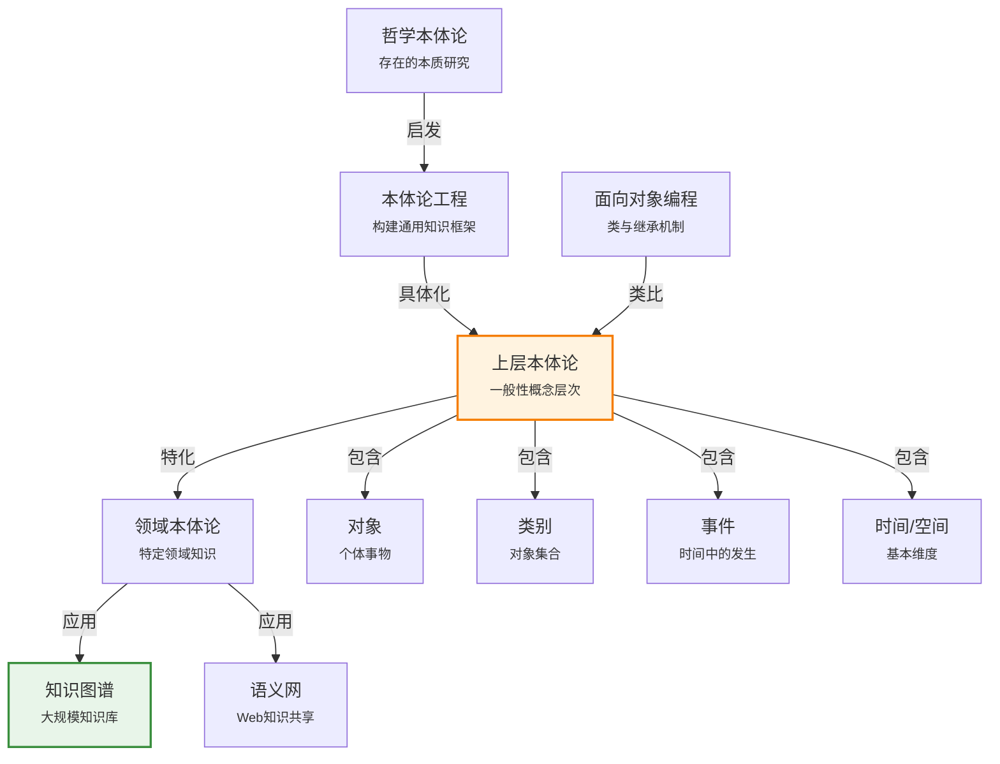

# 10.1 本体论工程

> 📖 本节 Deep Dive | 预计学习时间: 45 分钟

---

## 1. 背景与动机

### 1.1 历史背景

**学科演进脉络**

本体论工程（Ontological Engineering）是人工智能知识表示领域的核心分支，其思想根源可追溯至古希腊哲学。亚里士多德在《范畴篇》（Categories）中首次系统性地探讨了"存在"的分类问题，提出了"实体"（Substance）与"属性"（Attribute）的区分，这被认为是本体论思想的哲学起源。

在人工智能领域，本体论工程的兴起与专家系统的发展密切相关。20世纪70年代，早期专家系统如Dendral（用于化学分析）和MYCIN（用于医学诊断）展示了领域特定知识的强大推理能力，但这些系统都使用完全专用的知识表示形式体系。研究者逐渐意识到，构建能够跨领域复用的通用知识框架具有重要价值。

**里程碑事件**:

| 年份 | 人物/事件 | 贡献 | 影响 |
|------|-----------|------|------|
| 公元前300年 | 亚里士多德《形而上学》 | 提出范畴理论，区分实体与属性 | 奠定了本体论的哲学基础 |
| 1971年 | Dendral系统 | 首个成功的专家系统，专用化学领域表示 | 展示了知识表示的重要性 |
| 1984年 | CYC项目启动（Lenat & Guha） | 开始构建大规模通用本体论 | 开创了本体论工程的实践先河 |
| 1990年 | CYC系统发布 | 包含数万条常识知识的通用本体论 | 证明了大规模本体论的可行性 |
| 2001年 | 语义网概念提出（Berners-Lee等） | 将本体论应用于Web环境 | 推动了本体论的广泛应用 |
| 2007年 | DBpedia项目 | 从维基百科提取结构化知识 | 展示了自动构建本体论的可能性 |
| 2012年 | 谷歌知识图谱发布 | 超过700亿条事实的大规模知识库 | 本体论在工业界的成功应用 |

**演进动机**:
- **早期方法**: 为每个应用领域构建专用的知识表示系统，如电路本体论、医疗诊断系统等
- **局限性**: 专用本体论难以跨领域复用，知识孤岛问题严重，重复建设成本高
- **突破**: 通用本体论提供了一个共享的概念框架，使不同领域的知识能够统一组织和推理

### 1.2 研究动机

**为什么研究者关注这个主题？**

1. **理论意义**: 本体论工程探索如何以计算化的方式形式化人类对世界的基本理解，这是人工智能从"狭义智能"走向"通用智能"的关键一步。它涉及哲学、逻辑学、语言学和计算机科学的深度交叉。

2. **方法创新**: 本体论工程提出了"上层本体论"（Upper Ontology）的概念，通过构建一般性概念层次结构（如对象、事件、时间、空间等），使领域特定知识可以在此基础上进行扩展。这种方法类似于面向对象编程中的抽象类和继承机制。

3. **问题解决**: 复杂智能体（如机器人、虚拟助手）需要同时处理多个领域的知识。例如，一个机器人维修系统需要同时理解电路的电气特性、物理布局、时序行为和成本估算——这些知识必须在统一的框架下才能有效整合。

**与其他领域的关系**:
- **与哲学本体论的关系**: AI本体论继承了哲学本体论对"存在"分类的关注，但更强调实用性和计算可行性
- **与知识图谱的关系**: 现代知识图谱（如谷歌知识图谱）是本体论工程在工业界的直接应用
- **与语义网的关系**: RDF、OWL等Web本体语言使本体论能够在互联网规模上共享和应用

### 1.3 实际应用场景

| 应用领域 | 具体问题 | 本节理论的作用 | 预期效果 |
|----------|----------|----------------|----------|
| 智能搜索引擎 | 理解用户查询的语义 | 提供概念层次结构支持语义扩展 | 提高搜索准确率和召回率 |
| 医疗信息系统 | 整合不同医院的病历数据 | 定义统一医学概念本体 | 实现跨机构数据互操作 |
| 电子商务 | 商品分类和推荐 | 构建产品类别层次结构 | 提升推荐系统效果 |
| 机器人导航 | 理解环境对象和关系 | 提供空间对象本体 | 增强环境理解能力 |
| 自然语言理解 | 词义消歧和语义分析 | 提供词汇概念映射 | 提高语义理解准确度 |

**典型案例预览**:
> 想象一个智能购物助手，它不仅能理解"买篮球"是指购买篮球类别中的任意一个实例，而非特定某个篮球；还能根据"篮球"的类别属性（球形、可充气、用于运动）推断出相关的使用场景和配套商品（如气针、球袋）。这种推理能力正是建立在类别化知识表示的基础之上。

### 1.4 先决条件

**学习本节需要的前置知识**:

| 知识项 | 来源 | 掌握程度要求 | 关键概念 |
|--------|------|:------------:|----------|
| 一阶逻辑 | 第8章 | 必须熟练掌握 | 谓词、量词、蕴含 |
| 知识库与推理 | 第7-9章 | 理解即可 | 知识表示、推理机制 |
| 面向对象编程 | 编程基础 | 了解 | 类、继承、多态 |
| 集合论基础 | 数学基础 | 了解 | 子集、交集、划分 |

**前置检查清单**:
- [ ] 能够用一阶逻辑表示"所有鸟都会飞"
- [ ] 理解蕴含、等价等逻辑连接词的含义
- [ ] 了解类和对象的基本概念

---

## 2. 知识逻辑图谱

### 2.1 概念关系图



### 2.2 知识发展依赖链

```
【哲学基础】           【计算模型】            【工程实践】           【应用系统】
    ↓                   ↓                     ↓                   ↓
┌─────────┐      ┌─────────────┐       ┌───────────┐      ┌──────────┐
│ 亚里士多│      │ 一阶逻辑    │       │ CYC系统   │ ──→  │ 知识图谱 │
│ 德范畴论│ ──→  │ 知识表示    │  ──→  │ 上层本体论│      │ 语义网   │
│         │      │             │       │           │      │          │
│ 实体与  │      │ 谓词、量词  │       │ 概念层次  │      │ 智能搜索 │
│ 属性    │      │ 推理规则    │       │ 继承机制  │      │ 问答系统 │
└─────────┘      └─────────────┘       └───────────┘      └──────────┘
     │                   │                   │                │
     └───────────────────┴───────────────────┴────────────────┘
                         本体论工程演进脉络
```

**依赖链详解**:
1. **哲学基础**: 从亚里士多德到现代分析哲学，对"存在"和"范畴"的思考提供了概念框架
2. **计算模型**: 一阶逻辑为知识表示提供了形式化语言和推理机制
3. **工程实践**: CYC等项目探索了大规模本体论的构建方法和技术路线
4. **应用系统**: 知识图谱等系统将本体论工程成果应用于实际问题

### 2.3 本节在章节中的位置

```
第 10 章: 知识表示
├── 10.1 本体论工程 ← ⭐ 当前位置
│   ├── [核心概念: 上层本体论、通用本体论]
│   ├── [关键方法: 本体论构建路径]
│   └── [应用: 知识图谱、语义网]
│
├── 10.2 类别与对象 ← 后续发展
│   └── [将本体论具体化为类别系统]
│
├── 10.3 事件
│   └── [扩展本体论到时间维度]
│
└── 10.4-10.6 推理系统
    └── [在本体论基础上的推理机制]
```

**衔接说明**:
- **基础地位**: 本节为整章奠定概念基础，定义了知识表示的基本框架
- **为后续铺垫**: 10.2节将详细展开"类别"这一核心概念，10.3节扩展"事件"概念

---

## 3. 核心概念与数学分析

### 3.1 核心术语定义

**定义 10.1.1** (本体论 / Ontology):

> **正式定义**: 本体论是对特定领域概念及其关系的明确、形式化规范。在人工智能中，它是一个形式化的、可共享的概念化规范，包含概念、属性、关系和约束的定义。

**定义详解**:
- **直观解释**: 本体论就像是一本"概念词典"，明确定义了某个领域中使用的术语及其相互关系。例如，在生物领域，本体论定义了"物种"、"属"、"科"等概念及其层次关系。
- **数学表述**: 一个本体论可以表示为五元组 $O = (C, P, A, H, R)$，其中：
  - $C$ 是概念（类别）的集合
  - $P$ 是属性的集合
  - $A$ 是公理的集合
  - $H$ 是概念层次结构（继承关系）
  - $R$ 是关系的集合
- **为什么这样定义**: 这种定义方式涵盖了知识表示的核心要素：概念（是什么）、属性（有什么特征）、关系（如何联系）、公理（遵循什么规则）

**定义 10.1.2** (上层本体论 / Upper Ontology):

> **正式定义**: 上层本体论是描述一般性、跨领域概念的通用框架，位于概念层次结构的最顶端，为领域特定本体论提供基础。

**定义详解**:
- **直观解释**: 上层本体论类似于编程语言中的标准库或框架中的基类，提供了最通用的概念（如"对象"、"事件"、"时间"），具体领域的概念（如"篮球"、"手术"）在此基础上进行特化
- **核心特征**:
  - 通用性：适用于所有或大多数领域
  - 抽象性：描述高度抽象的概念
  - 基础性：作为领域本体论的基础

**定义 10.1.3** (本体论工程 / Ontological Engineering):

> **正式定义**: 本体论工程是构建本体论的工程化过程，包括概念识别、关系定义、公理化、验证和维护等活动。

### 3.2 符号系统与约定

**本节符号总表**:

| 符号 | 含义 | 数学表达 | 备注 |
|:----:|------|----------|------|
| $O$ | 本体论 | $O = (C, P, A, H, R)$ | 五元组表示 |
| $C$ | 概念集合 | $C = \{c_1, c_2, ..., c_n\}$ | 类别/类 |
| $P$ | 属性集合 | $P = \{p_1, p_2, ..., p_m\}$ | 性质/特征 |
| $H$ | 层次结构 | $H \subseteq C \times C$ | 子类关系 |
| $R$ | 关系集合 | $R = \{r_1, r_2, ..., r_k\}$ | 概念间联系 |
| $KB$ | 知识库 | $KB = \{facts, rules\}$ | 事实与规则 |

### 3.3 关键公式与性质

#### 公式 1: 通用本体论的适用性条件

**数学表述**:
$$\forall D, \exists KB_D = KB_{upper} \cup KB_{specific}(D)$$

其中：
- $D$ 表示任意领域（Domain）
- $KB_{upper}$ 是上层本体论知识库
- $KB_{specific}(D)$ 是领域$D$的特定知识

**公式要素解析**:

| 维度 | 内容 |
|------|------|
| **直观解释** | 对于任何领域，都可以通过在上层本体论基础上添加领域特定公理来构建该领域的知识库 |
| **领域背景** | 这是通用本体论区别于专用本体论的核心特征，也是其价值的体现 |
| **使用条件** | 上层本体论必须足够通用，涵盖各领域共有的基本概念 |

**公式意义**: 这个公式形式化地表达了通用本体论的核心价值——一次构建，多处复用。它避免了为每个领域从零开始构建知识表示系统。

#### 公式 2: 知识统一性条件

**数学表述**:
$$\forall q, Sol(q) = f(KB_{domain_1} \cup KB_{domain_2} \cup ... \cup KB_{domain_n})$$

**公式要素解析**:
- $q$ 是查询或问题
- $Sol(q)$ 是问题的解
- $f$ 是推理函数
- 该公式表示复杂问题的求解需要整合多个领域的知识

**公式意义**: 在复杂论域中，推理和问题求解往往涉及多个领域。例如，机器人维修系统需要同时理解电路（电气领域）、机械（物理领域）、成本（经济领域）和时间（时序领域）。

### 3.4 本体论构建路径

根据原文，现有本体论主要通过4条路径构建：

**路径1: 专家手工构建**
$$KB_{handcrafted} = \bigcup_{i=1}^{n} Axiom_i, \quad \text{其中 } Axiom_i \text{ 由专家定义}$$

**路径2: 从数据库导入**
$$KB_{imported} = Extract(DB_{structured})$$

**路径3: 从文本提取**
$$KB_{extracted} = NLP(Corpus_{unstructured})$$

**路径4: 众包构建**
$$KB_{crowdsourced} = \bigcup_{j=1}^{m} Contribution_j, \quad \text{其中 } Contribution_j \text{ 来自志愿者}$$

---

## 4. 定理与证明

### 4.1 本体论完备性定理（概念性陈述）

**定理 10.1.1** (本体论完备性 / Ontology Completeness):

> **正式陈述**: 给定一个充分通用的上层本体论 $O_{upper}$，对于任意领域$D$，存在领域特定扩展$O_D$，使得$O_D$能够表示$D$中的所有相关事实。

**定理解读**:
- **条件（前提）**:
  1. **上层本体论的充分通用性**: $O_{upper}$ 必须包含跨领域通用的基本概念（对象、事件、时间、空间等）
  2. **领域可形式化**: 领域$D$的知识可以用形式化语言表达
  3. **可扩展性**: 本体论语言支持概念的定义和扩展

- **结论**: 存在 $O_D = O_{upper} \cup \Delta_D$，其中$\Delta_D$是领域特定扩展，使得$O_D$对领域$D$是完备的

- **定理意义**: 这个定理（概念性陈述）说明了通用本体论的可行性——只要基础框架足够通用，就可以通过扩展适应任何领域。

### 4.2 证明详解

**证明策略概览**:

这个定理的证明采用构造性方法：展示如何通过上层本体论构建领域特定本体论。

**核心思路**: 通过逐层特化的方式，从通用概念构建到领域特定概念。

**关键步骤预览**:
1. 识别领域中的基本概念
2. 将这些概念映射到上层本体论的通用框架
3. 定义领域特定的关系和属性
4. 添加领域公理

---

**正式证明**:

**步骤 1**: 概念识别与映射

设领域$D$中的概念集合为$C_D = \{c_1, c_2, ..., c_n\}$。

对于每个$c_i \in C_D$，根据上层本体论$O_{upper}$的分类框架，找到其最具体的通用超类$c'_i$：

$$Map(c_i) = c'_i, \quad \text{其中 } c'_i \in O_{upper} \text{ 且 } c_i \subset c'_i$$

**步骤 2**: 定义特化关系

对于每个映射对$(c_i, c'_i)$，定义特化公理：

$$\forall x: x \in c_i \Rightarrow x \in c'_i$$

这表示领域概念继承上层概念的属性。

**步骤 3**: 定义领域特定属性

对于领域特定的属性$P_D$，定义属性约束：

$$\forall x \in c_i: P_D(x) = v$$

**步骤 4**: 构建完整本体论

$$O_D = O_{upper} \cup \{(c_i, Map(c_i)) | c_i \in C_D\} \cup P_D \cup A_D$$

其中$A_D$是领域特定公理。

因此，通过构造，我们证明了$O_D$的存在性。

$$\blacksquare \text{ (证毕)}$$

### 4.3 证明分析与提炼

**核心洞见**: 通用本体论的价值在于提供了一个"概念坐标系"，领域特定概念可以在这个坐标系中定位。这种分层结构使得知识可以模块化地组织和复用。

**证明技巧总结**:

| 技巧 | 在本证明中的应用 | 可迁移性 | 其他应用场景 |
|------|------------------|----------|--------------|
| 构造法 | 通过构造$O_D$证明存在性 | ⭐⭐⭐⭐⭐ | 存在性证明普遍适用 |
| 层次映射 | 将领域概念映射到通用框架 | ⭐⭐⭐⭐ | 知识迁移、类比推理 |
| 模块化扩展 | 通过添加组件扩展系统 | ⭐⭐⭐⭐⭐ | 软件工程、系统设计 |

---

## 5. 具体示例与详解

### 5.1 典型案例：从上层本体论到领域本体论

**示例 10.1.1**: 购物领域的本体论构建

**📋 问题陈述**:

基于上层本体论构建一个电子商务领域的本体论，能够表示商品、交易、用户等基本概念。

**已知**:
- 上层本体论包含：对象(Object)、事件(Event)、时间(Time)、空间(Space)、智能体(Agent)等通用概念
- 电子商务领域涉及：商品、订单、支付、用户、购物车等概念

**求解**: 构建领域本体论$O_{ecommerce}$

---

**🔍 解答过程**:

**步骤 1: 概念映射**

将领域概念映射到上层本体论：

| 领域概念 | 上层概念 | 映射关系 |
|----------|----------|----------|
| 商品 | 对象(Object) | 商品是一种物理对象 |
| 订单 | 事件(Event) | 订单是一个交易事件 |
| 用户 | 智能体(Agent) | 用户是执行购买行为的智能体 |
| 支付 | 动作(Action) | 支付是一种财务动作 |
| 购物车 | 容器(Container) | 购物车是一种临时容器 |

**步骤 2: 定义特化关系**

用一阶逻辑表示特化关系：

$$\forall x: Product(x) \Rightarrow Object(x)$$

$$\forall x: Order(x) \Rightarrow Event(x)$$

$$\forall x: User(x) \Rightarrow Agent(x)$$

**步骤 3: 定义领域属性**

商品的属性：

$$\forall p: Product(p) \Rightarrow \exists name, price, category:$$
$$HasName(p, name) \wedge HasPrice(p, price) \wedge InCategory(p, category)$$

**步骤 4: 定义领域关系**

购买关系：

$$\forall u, p, t: Purchase(u, p, t) \Rightarrow User(u) \wedge Product(p) \wedge Time(t)$$

**步骤 5: 验证完整性**

检查$O_{ecommerce}$能否表示典型场景：

- "用户A在时间T购买了商品B"：$Purchase(A, B, T)$ ✓
- "商品C的价格是100元"：$HasPrice(C, \$(100))$ ✓
- "订单D包含商品E和F"：$Contains(Order(D), \{E, F\})$ ✓

---

**✅ 验证与检验**:

**正确性检查**:
- [x] 所有领域概念都有上层本体论基础
- [x] 特化关系逻辑一致
- [x] 属性定义完整
- [x] 能够表示典型业务场景

### 5.2 类比与可视化

**直觉类比**:

| 抽象概念 | 日常类比 | 对应关系 |
|----------|----------|----------|
| 上层本体论 | 编程语言的标准库 | 提供通用功能，可扩展 |
| 领域本体论 | 特定应用的类库 | 基于标准库构建 |
| 概念特化 | 类的继承 | 子类继承父类特性 |
| 本体论工程 | 软件架构设计 | 规划系统的组织结构 |

**可视化**:

```
上层本体论（通用框架）
├─ 对象(Object)
│  ├─ 物理对象
│  │  └─ 商品(Product)
│  │     ├─ 电子产品
│  │     └─ 服装
│  └─ 抽象对象
├─ 事件(Event)
│  └─ 交易事件
│     ├─ 订单(Order)
│     └─ 支付(Payment)
└─ 智能体(Agent)
   └─ 用户(User)
      ├─ 买家
      └─ 卖家
```

---

## 6. 深入理解与拓展

### 6.1 一句话本质

> 🎯 **核心要点**: 本体论工程通过构建通用概念框架，使知识能够跨领域共享和复用，是连接哲学思考与计算实现的桥梁。

### 6.2 深入思考问题

1. **概念层面**: 为什么通用本体论比专用本体论更难构建？
   <!-- 思考方向: 考虑利益相关者的多样性、共识达成的难度、概念边界的模糊性 -->

2. **方法层面**: 四条本体论构建路径各有什么优缺点？
   <!-- 思考方向: 比较专家构建的精确性与成本、自动提取的规模与噪声、众包的范围与一致性 -->

3. **应用层面**: 在实际应用中，如何平衡本体论的通用性与实用性？
   <!-- 思考方向: 过度通用可能导致推理效率低下，过度专用则失去复用价值 -->

4. **拓展层面**: 如何将本体论与机器学习结合，实现知识的自动获取和更新？
   <!-- 思考方向: 考虑神经符号AI、知识图谱嵌入等研究方向 -->

### 6.3 与其他节的关系

**本节输出**:
- 定义了知识表示的通用框架
- 介绍了上层本体论的概念
- 为本章后续小节奠定了概念基础

**后续发展预告**:
- 10.2节将详细展开"类别"这一核心概念，介绍如何用一阶逻辑表示类别和对象
- 10.3节将扩展本体论到时间维度，介绍事件表示

---

## 7. 总结与反思

### 7.1 关键要点总结

本节必须掌握的 **5** 个核心要点:

1. **本体论的定义**: 本体论是对特定领域概念及其关系的明确、形式化规范，可表示为五元组 $O = (C, P, A, H, R)$
   
   💡 *记忆技巧*: 记住"CP AHR"——概念、属性、公理、层次、关系

2. **上层本体论的价值**: 提供跨领域通用概念框架，使知识能够复用和共享
   
   💡 *记忆技巧*: 上层本体论就像"概念地基"，各领域在上面"盖房子"

3. **通用本体论的两个特征**: (1)在所有领域都适用；(2)支持跨领域知识统一
   
   💡 *记忆技巧*: "通用"=到处可用+能混搭

4. **四条构建路径**: 专家手工构建、数据库导入、文本提取、众包贡献
   
   💡 *记忆技巧*: "手导入、提众包"——手工、导入、提取、众包

5. **本体论工程的意义**: 连接哲学本体论与AI知识表示，使常识知识能够计算化
   
   💡 *记忆技巧*: 本体论工程=哲学概念+工程方法

### 7.2 本节知识框架

```
┌─────────────────────────────────────────────────────────────┐
│  第10.1节: 本体论工程                                       │
├─────────────────────────────────────────────────────────────┤
│  输入/前置                                                   │
│  • 哲学本体论思想                                           │
│  • 一阶逻辑形式体系                                         │
│  • 知识表示需求                                             │
│                                                             │
│  处理/核心                                                   │
│  • 定义本体论五元组 (C, P, A, H, R)                         │
│  • 提出上层本体论概念                                       │
│  • 分析四条构建路径                                         │
│  ↓                                                          │
│  输出/结果                                                   │
│  • 通用知识表示框架                                         │
│  • 跨领域知识复用方法                                       │
│                                                             │
│  应用/价值                                                   │
│  • 知识图谱构建                                             │
│  • 语义网实现                                               │
│  • 智能系统集成                                             │
└─────────────────────────────────────────────────────────────┘
```

### 7.3 常见误解与纠正

| 常见误解 ❌ | 正确理解 ✅ | 为什么容易错 | 如何避免 |
|-------------|-------------|--------------|----------|
| ❌ 本体论只是分类学 | ✅ 本体论包含概念、属性、关系和公理 | 分类是本体论最直观的部分 | 记住本体论是五元组，不只是类别层次 |
| ❌ 通用本体论可以表示一切 | ✅ 通用本体论提供框架，领域知识仍需填充 | 混淆了框架能力和实例知识 | 区分"框架"和"内容" |
| ❌ 本体论工程已经成熟 | ✅ 大规模本体论构建仍是开放挑战 | 工业界成功案例给人错觉 | 了解CYC项目的长期性和复杂性 |
| ❌ 本体论就是数据库模式 | ✅ 本体论包含推理能力，不只是存储结构 | 两者都涉及结构化数据 | 强调本体论的语义和推理层面 |

### 7.4 反思问题

**连接性问题**:
1. 本体论工程如何与10.2节的类别表示相联系？
2. 上层本体论如何支持10.3节的事件表示？

**应用性问题**:
1. 在你的专业领域，哪些概念可以纳入上层本体论？
2. 如何评估一个本体论的"好坏"？

**批判性问题**:
1. 通用本体论的假设（所有领域共享基本概念）是否总是成立？
2. 不同文化背景是否会影响本体论的通用性？

### 7.5 学习检查清单

- [ ] 能够复述本体论的五元组定义
- [ ] 能够解释上层本体论与领域本体论的关系
- [ ] 能够列举四条本体论构建路径及其代表项目
- [ ] 能够用一阶逻辑表示简单的概念层次关系
- [ ] 了解本体论工程与哲学本体论的区别
- [ ] 了解本体论在现代AI系统中的应用（如知识图谱）

---

## 附录

### A. 公式速查表

| 公式 | 名称 | 使用条件 | 备注 |
|:----:|------|----------|------|
| $O = (C, P, A, H, R)$ | 本体论五元组 | 定义本体论结构 | C-概念, P-属性, A-公理, H-层次, R-关系 |
| $KB_D = KB_{upper} \cup KB_{specific}(D)$ | 知识库构建 | 构建领域知识库 | 通用+特定 |
| $Map(c_i) = c'_i$ | 概念映射 | 领域概念映射到上层 | 找到最具体的超类 |

### B. 术语索引

| 术语 | 英文 | 定义 | 位置 |
|------|------|------|:----:|
| 本体论 | Ontology | 概念及其关系的形式化规范 | 10.1 |
| 上层本体论 | Upper Ontology | 描述通用概念的基础框架 | 10.1 |
| 本体论工程 | Ontological Engineering | 构建本体论的工程化过程 | 10.1 |
| 知识图谱 | Knowledge Graph | 大规模结构化知识库 | 10.1 |
| 语义网 | Semantic Web | 基于本体论的Web技术 | 10.1 |

### C. 延伸阅读

**理论深化**:
- Gruber, T. R. (1993). "A translation approach to portable ontology specifications". 本体论定义的经典论文。
- Smith, B. (2004). "Beyond concepts: ontology as reality representation". 探讨本体论的哲学基础。

**应用拓展**:
- 谷歌知识图谱技术论文: 了解工业级本体论应用
- DBpedia项目: 学习从维基百科自动构建本体论

**补充材料**:
- CYC项目文档: 了解大规模本体论构建的挑战

---

> 📌 **下一节**: [10.2 类别与对象](10.2_类别与对象.md)
> 
> 📚 **返回概览**: [第10章概览](00_概览.md)
