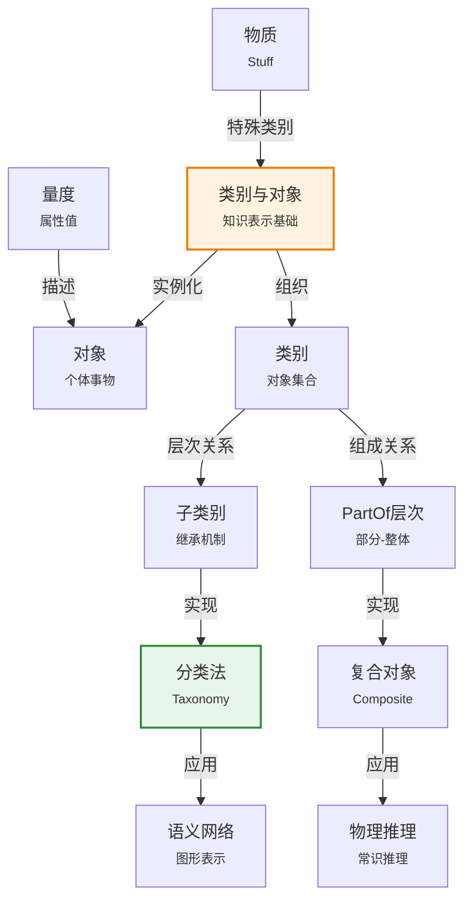

# 10.2 类别与对象

> 📖 本节 Deep Dive | 预计学习时间: 60 分钟

---

## 1. 背景与动机

### 1.1 历史背景

**学科演进脉络**

类别（Categories）与对象（Objects）的表示是知识表示中最基础也最重要的问题之一。这一问题的研究可以追溯到亚里士多德的《工具论》，其中他首次系统地提出了"属"（genus）与"种"（species）的概念区分，奠定了分类学的基础。

在现代人工智能中，类别表示的研究与面向对象编程（OOP）的发展密切相关。20世纪60年代，Simula语言首次引入了类和对象的概念；70年代，Smalltalk完善了面向对象范式；这些编程概念反过来又影响了AI中的知识表示研究。

**里程碑事件**:

| 年份 | 人物/事件 | 贡献 | 影响 |
|------|-----------|------|------|
| 公元前300年 | 亚里士多德《工具论》 | 提出属-种分类法 | 奠定了分类学的哲学基础 |
| 1700年代 | 林奈生物分类系统 | 建立层次化物种分类 | 展示了分类法的实用价值 |
| 1967年 | Simula语言 | 首个面向对象编程语言 | 将类别概念引入计算 |
| 1970年代 | Smalltalk | 完善面向对象范式 | 影响了AI知识表示 |
| 1980年代 | 语义网络兴起 | 图形化表示类别关系 | 提供了直观的类别表示方法 |
| 1985年 | KL-ONE系统 | 描述逻辑的早期形式 | 为类别推理提供形式基础 |
| 2000年代 | OWL标准发布 | Web本体语言标准化 | 推动了类别表示的广泛应用 |

**演进动机**:
- **早期方法**: 将每个对象作为独立个体表示，存储其所有属性
- **局限性**: 知识冗余、难以维护、无法利用共性进行推理
- **突破**: 通过类别组织对象，利用继承机制实现知识复用和高效推理

### 1.2 研究动机

**为什么研究者关注这个主题？**

1. **认知科学基础**: 人类认知大量依赖类别化——我们将世界中的事物归类，并基于类别进行预测。研究类别表示有助于构建更符合人类认知方式的AI系统。

2. **知识压缩**: 类别允许我们陈述关于对象集合的一般性事实，而非逐个对象陈述。例如，"所有篮球都是圆的"这一陈述适用于无限多个篮球实例。

3. **推理效率**: 通过继承机制，智能体可以从对象的类别归属推导出其属性，无需显式存储每个对象的所有信息。

**与其他领域的关系**:
- **与面向对象编程的关系**: 类别类似于类（Class），对象类似于实例（Instance），继承机制在两者中都有核心作用
- **与集合论的关系**: 类别可以用集合论形式化，成员关系对应于集合的元素关系
- **与语义学的关系**: 自然语言中的名词通常对应于类别，研究类别表示有助于自然语言理解

### 1.3 实际应用场景

| 应用领域 | 具体问题 | 本节理论的作用 | 预期效果 |
|----------|----------|----------------|----------|
| 电子商务 | 商品分类和属性继承 | 构建产品类别层次 | 自动推断商品属性 |
| 生物信息学 | 物种分类和特征推理 | 表示生物分类学 | 预测未知物种特征 |
| 医疗诊断 | 疾病分类和症状关联 | 构建医学本体 | 支持诊断推理 |
| 智能推荐 | 用户兴趣建模 | 表示用户类别 | 精准推荐内容 |
| 图像识别 | 物体分类 | 构建视觉概念层次 | 提高识别准确率 |

**典型案例预览**:
> 想象一个智能购物场景：当顾客拿起一个"黄色圆形、直径约30厘米、有条纹果皮、红色果肉"的水果时，系统能够识别这是"西瓜"类别，进而自动推断它可以"用于水果沙拉"、"适合夏季食用"、"需要冷藏保存"——即使系统从未见过这个具体的西瓜。这种推理能力正是基于类别化知识表示。

### 1.4 先决条件

**学习本节需要的前置知识**:

| 知识项 | 来源 | 掌握程度要求 | 关键概念 |
|--------|------|:------------:|----------|
| 一阶逻辑 | 第8章 | 必须熟练掌握 | 谓词、量词、蕴含 |
| 集合论基础 | 数学基础 | 理解即可 | 子集、交集、划分 |
| 面向对象概念 | 编程基础 | 了解 | 类、继承、多态 |
| 本体论工程 | 10.1节 | 理解即可 | 上层本体论概念 |

**前置检查清单**:
- [ ] 能够用谓词逻辑表示"所有A都是B"
- [ ] 理解子集和划分的概念
- [ ] 了解类的继承机制

---

## 2. 知识逻辑图谱

### 2.1 概念关系图



### 2.2 知识发展依赖链

```
【逻辑基础】           【类别理论】            【组成理论】           【应用系统】
    ↓                   ↓                     ↓                   ↓
┌─────────┐      ┌─────────────┐       ┌───────────┐      ┌──────────┐
│ 一阶逻辑│      │ 类别定义    │       │ PartOf    │ ──→  │ 语义网络 │
│ 谓词    │ ──→  │ 成员关系    │  ──→  │ 关系      │      │ 描述逻辑 │
│ 量词    │      │ 子类关系    │       │ 束(Bunch) │      │ 知识图谱 │
└─────────┘      │ 继承机制    │       │ 量度      │      └──────────┘
                 └─────────────┘       └───────────┘
                      │                      │
                      └──────────────────────┘
                              类别与对象知识体系
```

**依赖链详解**:
1. **逻辑基础**: 一阶逻辑提供了表示类别和对象的形式语言
2. **类别理论**: 定义了成员关系、子类关系和继承机制
3. **组成理论**: 扩展类别理论到部分-整体关系和物质表示
4. **应用系统**: 语义网络、描述逻辑等系统实现了类别推理

### 2.3 本节在章节中的位置

```
第 10 章: 知识表示
├── 10.1 本体论工程
│   └── [上层本体论框架]
│
├── 10.2 类别与对象 ← ⭐ 当前位置
│   ├── [核心概念: 类别、对象、继承]
│   ├── [10.2.1: 物理组成]
│   ├── [10.2.2: 量度]
│   └── [10.2.3: 物质与事物]
│
├── 10.3 事件
│   └── [时间维度扩展]
│
└── 10.4-10.6 推理系统
    └── [基于类别的推理]
```

**衔接说明**:
- **从前一节继承**: 10.1节的上层本体论提供了概念框架，本节具体化"类别"和"对象"概念
- **为后一节铺垫**: 10.3节将扩展类别表示到时间维度，处理事件和变化

---

## 3. 核心概念与数学分析

### 3.1 核心术语定义

**定义 10.2.1** (类别 / Category):

> **正式定义**: 类别是对象的集合，这些对象共享某些共同属性。在一阶逻辑中，类别可以表示为谓词或物化为对象。

**定义详解**:
- **直观解释**: 类别是对相似对象的抽象分组。例如，"篮球"类别包含所有篮球对象，它们共享"球形"、"可充气"、"用于篮球运动"等属性。
- **数学表述**: 
  - 谓词表示: $Basketballs(x)$ 表示"$x$是篮球"
  - 物化表示: $x \in Basketballs$ 表示"$x$是篮球类别的成员"
- **为什么这样定义**: 两种表示各有优势——谓词表示简洁，物化表示允许对类别本身进行陈述

**定义 10.2.2** (成员关系 / Membership):

> **正式定义**: 成员关系表示对象属于某个类别。记作 $x \in C$，读作"$x$是类别$C$的成员"。

**数学表述**:
$$BB_9 \in Basketballs$$

表示"$BB_9$是篮球类别中的成员"。

**定义 10.2.3** (子类关系 / Subclass):

> **正式定义**: 如果类别$C_1$的所有成员都是类别$C_2$的成员，则$C_1$是$C_2$的子类。记作 $C_1 \subseteq C_2$。

**数学表述**:
$$Basketballs \subset Balls$$

表示"篮球是球的子类"。

**定义 10.2.4** (继承 / Inheritance):

> **正式定义**: 继承是一种推理机制，子类自动获得其超类的属性。如果类别$C$具有属性$P$，且$C' \subseteq C$，则$C'$的所有成员也具有属性$P$。

**数学表述**:
$$\forall x: (x \in Basketballs) \Rightarrow Spherical(x)$$

表示"所有篮球都是球形的"。

### 3.2 符号系统与约定

**本节符号总表**:

| 符号 | 含义 | 数学表达 | 备注 |
|:----:|------|----------|------|
| $x \in C$ | 成员关系 | $Member(x, C)$ | $x$是类别$C$的成员 |
| $C_1 \subseteq C_2$ | 子类关系 | $Subset(C_1, C_2)$ | $C_1$是$C_2$的子类 |
| $PartOf(x, y)$ | 部分关系 | $x$是$y$的部分 | 物理组成 |
| $BunchOf(S)$ | 束 | 由集合$S$构成的复合对象 | 物质的表示 |
| $Disjoint(S)$ | 不相交 | 集合$S$中类别无共同成员 | 类别划分 |
| $Partition(S, C)$ | 划分 | $S$是$C$的完全分解 | 互斥且完备 |

### 3.3 关键公式与性质

#### 公式 1: 类别成员性质的继承

**数学表述**:
$$\forall x: (x \in C) \Rightarrow P(x)$$

**公式要素解析**:

| 维度 | 内容 |
|------|------|
| **直观解释** | 类别$C$的所有成员都具有性质$P$ |
| **几何意义** | 在概念空间中，类别定义了一个区域，该区域内所有点都具有某些特征 |
| **领域背景** | 这是类别化推理的基础，允许从类别归属推断对象属性 |

**使用条件**: 该公式在严格逻辑中成立，但需注意自然类别存在例外（如"鸟会飞"不适用于企鹅）。

#### 公式 2: 子类关系的传递性

**数学表述**:
$$C_1 \subseteq C_2 \wedge C_2 \subseteq C_3 \Rightarrow C_1 \subseteq C_3$$

**公式要素解析**:
- 这是子类关系的基本性质
- 允许构建多层次的分类体系
- 是继承推理的基础

#### 公式 3: PartOf关系的性质

**自反性**:
$$PartOf(x, x)$$

**传递性**:
$$PartOf(x, y) \wedge PartOf(y, z) \Rightarrow PartOf(x, z)$$

**公式意义**: PartOf关系构成一个偏序，支持部分-整体层次推理。

#### 公式 4: 不相交集合的定义

**数学表述**:
$$Disjoint(s) \Leftrightarrow (\forall c_1, c_2: c_1 \in s \wedge c_2 \in s \wedge c_1 \neq c_2 \Rightarrow Intersection(c_1, c_2) = \emptyset)$$

**公式意义**: 不相交集合中的类别没有共同成员，用于定义互斥分类。

#### 公式 5: 划分的定义

**数学表述**:
$$Partition(s, c) \Leftrightarrow Disjoint(s) \wedge ExhaustiveDecomposition(s, c)$$

其中：
$$ExhaustiveDecomposition(s, c) \Leftrightarrow (\forall i: i \in c \Leftrightarrow \exists c_2: c_2 \in s \wedge i \in c_2)$$

**公式意义**: 划分是一种特殊的分类，既互斥（不相交）又完备（完全分解）。

#### 公式 6: 束的定义（BunchOf）

**数学表述**:
$$\forall x: x \in s \Rightarrow PartOf(x, BunchOf(s))$$

$$\forall y: [\forall x: x \in s \Rightarrow PartOf(x, y)] \Rightarrow PartOf(BunchOf(s), y)$$

**公式意义**: 
- 第一条：$s$中的每个元素都是$BunchOf(s)$的部分
- 第二条：$BunchOf(s)$是满足第一条的最小对象

这是逻辑最小化技术的应用，用于定义无结构复合对象。

### 3.4 重要性质与推论

**性质 10.2.1** (类别推理的完备性):

> **陈述**: 给定一个分类层次结构和类别属性定义，可以推导出任意对象的继承属性。

**证明概要**: 通过递归遍历分类层次，收集所有超类的属性。

**性质 10.2.2** (划分的唯一性):

> **陈述**: 如果$Partition(s_1, c)$和$Partition(s_2, c)$，且$s_1$和$s_2$基于相同的分类标准，则$s_1 = s_2$。

---

## 4. 定理与证明

### 4.1 类别继承定理

**定理 10.2.1** (继承传递性 / Inheritance Transitivity):

> **正式陈述**: 设$C_1 \subseteq C_2 \subseteq C_3$，且$P$是$C_3$的性质，即$\forall x: (x \in C_3) \Rightarrow P(x)$。则$\forall x: (x \in C_1) \Rightarrow P(x)$。

**定理解读**:
- **条件（前提）**:
  1. $C_1$是$C_2$的子类，$C_2$是$C_3$的子类
  2. $P$是$C_3$的普遍性质

- **结论**: $P$也是$C_1$的普遍性质

- **定理意义**: 这是继承机制的形式化保证，确保属性可以沿分类层次向下传递。

### 4.2 证明详解

**证明策略概览**:

使用谓词逻辑的演绎推理，结合子类关系的定义。

**核心思路**: 通过子类关系的传递性和蕴含的传递性证明结论。

---

**正式证明**:

**步骤 1**: 展开子类关系的定义

由$C_1 \subseteq C_2$，根据子类定义：
$$\forall x: (x \in C_1) \Rightarrow (x \in C_2) \quad ...(1)$$

由$C_2 \subseteq C_3$，根据子类定义：
$$\forall x: (x \in C_2) \Rightarrow (x \in C_3) \quad ...(2)$$

**步骤 2**: 结合传递性

由(1)和(2)，根据蕴含的传递性：
$$\forall x: (x \in C_1) \Rightarrow (x \in C_3) \quad ...(3)$$

**步骤 3**: 应用性质定义

由定理条件，$P$是$C_3$的性质：
$$\forall x: (x \in C_3) \Rightarrow P(x) \quad ...(4)$$

**步骤 4**: 得出结论

由(3)和(4)，再次应用蕴含的传递性：
$$\forall x: (x \in C_1) \Rightarrow P(x)$$

因此，定理得证。

$$\blacksquare \text{ (证毕)}$$

### 4.3 PartOf传递性定理

**定理 10.2.2** (PartOf传递性):

> **正式陈述**: $PartOf(x, y) \wedge PartOf(y, z) \Rightarrow PartOf(x, z)$

**证明**:

这是PartOf关系的基本公理，反映了部分-整体关系的直观性质：如果$x$是$y$的部分，$y$是$z$的部分，则$x$是$z$的部分。

例如：布加勒斯特是罗马尼亚的一部分，罗马尼亚是欧洲的一部分，因此布加勒斯特是欧洲的一部分。

$$\blacksquare \text{ (证毕)}$$

### 4.4 证明分析与提炼

**核心洞见**: 类别继承的本质是逻辑蕴含的传递性。子类关系是蕴含关系的一种特殊形式，因此继承了蕴含关系的传递性。

**证明技巧总结**:

| 技巧 | 在本证明中的应用 | 可迁移性 | 其他应用场景 |
|------|------------------|----------|--------------|
| 定义展开 | 将子类关系展开为蕴含式 | ⭐⭐⭐⭐⭐ | 所有基于定义证明的场景 |
| 传递性链 | 连接多个蕴含关系 | ⭐⭐⭐⭐⭐ | 不等式证明、序关系证明 |
| 全称实例化 | 对任意对象应用性质 | ⭐⭐⭐⭐ | 全称量词相关的证明 |

---

## 5. 具体示例与详解

### 5.1 典型数值示例：分类层次推理

**示例 10.2.1**: 水果分类与属性继承

**📋 问题陈述**:

给定以下分类层次和属性定义：
- $Fruits$（水果）类别：所有成员都可食用
- $Citrus$（柑橘类）$\subset Fruits$：所有成员都含有维生素C
- $Oranges$（橙子）$\subset Citrus$：所有成员都是橙色的
- 对象$O_1 \in Oranges$

**求解**: 推断$O_1$的所有属性

---

**🔍 解答过程**:

**步骤 1: 建立分类层次**

```
Fruits (可食用)
└── Citrus (含维生素C)
    └── Oranges (橙色)
        └── O₁
```

**步骤 2: 应用继承推理**

由$O_1 \in Oranges$和$Oranges \subset Citrus$：
$$O_1 \in Citrus$$

由$O_1 \in Citrus$和$Citrus \subset Fruits$：
$$O_1 \in Fruits$$

**步骤 3: 收集继承属性**

从$Oranges$：
$$Orange(O_1)$$

从$Citrus$（通过继承）：
$$ContainsVitaminC(O_1)$$

从$Fruits$（通过继承）：
$$Edible(O_1)$$

**步骤 4: 综合结果**

$O_1$具有以下属性：
- 是橙色的
- 含有维生素C
- 可食用

---

**✅ 验证与检验**:

**正确性检查**:
- [x] 所有属性都通过有效的继承链获得
- [x] 分类层次关系正确
- [x] 结果符合常识

### 5.2 概念辨析示例：物质与事物

**示例 10.2.2**: 黄油与食蚁兽的本体论区别

**场景**: 比较"黄油"和"食蚁兽"在本体论表示上的差异。

**分析**:

| 特征 | 食蚁兽（事物） | 黄油（物质） |
|------|----------------|--------------|
| 可数性 | 可数名词（一只食蚁兽） | 不可数名词（一块黄油） |
| 分割行为 | 分割后不再是食蚁兽 | 分割后仍是黄油 |
| 属性继承 | 个体继承类别属性 | 部分继承物质属性 |
| 表示方式 | 个体对象 | 物化类别 + 束 |

**关键区别**: 
- 食蚁兽是**事物**（Thing/Individual）：有明确边界，分割破坏个体性
- 黄油是**物质**（Stuff）：无明确边界，任意部分仍是同种物质

**形式化表示**:

食蚁兽：
$$Anteater_1 \in Anteaters$$

黄油：
$$\forall b: b \in Butter \wedge PartOf(p, b) \Rightarrow p \in Butter$$

### 5.3 量度表示示例

**示例 10.2.3**: 长度单位转换

**问题**: 表示篮球的直径，并进行单位转换。

**表示**:
$$Diameter(Basketball_{12}) = Inches(9.5) = Centimeters(24.13)$$

**单位转换公理**:
$$Centimeters(2.54 \times d) = Inches(d)$$

**验证**:
$$Inches(9.5) = Centimeters(2.54 \times 9.5) = Centimeters(24.13)$$

### 5.4 类比与可视化

**直觉类比**:

| 抽象概念 | 日常类比 | 对应关系 |
|----------|----------|----------|
| 类别 | 文件夹 | 包含多个文件（对象） |
| 子类 | 子文件夹 | 继承父文件夹属性 |
| 继承 | 遗传 | 子代获得亲代特征 |
| PartOf | 俄罗斯套娃 | 小娃娃是大娃娃的部分 |
| 物质 | 水 | 任意部分仍是水 |
| 事物 | 冰块 | 分割后不再是原冰块 |

**可视化**:

```
分类层次（继承树）
        Object
          │
      ┌───┴───┐
      │       │
    Fruit   Animal
      │       │
   ┌──┴──┐    │
   │     │    │
Citrus  Berry Dog
   │
Orange
   │
  O₁

PartOf层次（组成树）
       Earth
         │
     ┌───┴───┐
     │       │
  Europe    Asia
     │
  ┌──┴──┐
  │     │
Romania France
  │
Bucharest
```

---

## 6. 深入理解与拓展

### 6.1 一句话本质

> 🎯 **核心要点**: 类别与对象表示通过层次化组织和继承机制，实现了知识的高效压缩和推理，是连接抽象概念与具体实例的桥梁。

### 6.2 深入思考问题

1. **概念层面**: 为什么自然类别（如"番茄"）难以用充要条件精确定义？
   <!-- 思考方向: 考虑边界模糊性、原型理论、家族相似性 -->

2. **方法层面**: 谓词表示和物化表示各有什么优缺点？
   <!-- 思考方向: 考虑表达能力、推理效率、元推理需求 -->

3. **应用层面**: 如何在实际系统中处理类别属性的例外情况？
   <!-- 思考方向: 考虑缺省逻辑、典型性表示、概率方法 -->

4. **拓展层面**: 物质和事物的区分在自然语言中是否总是清晰的？
   <!-- 思考方向: 考虑"一张纸"vs"纸"，"一杯水"vs"水" -->

### 6.3 与其他节的关系

**本节输出**:
- 定义了类别和对象的基本表示方法
- 介绍了继承推理机制
- 区分了物质和事物的表示

**后续发展预告**:
- 10.3节将扩展类别表示到时间维度，处理事件和变化
- 10.5节将介绍专门用于类别推理的系统（语义网络、描述逻辑）
- 10.6节将讨论如何处理类别属性的例外和缺省情况

---

## 7. 总结与反思

### 7.1 关键要点总结

本节必须掌握的 **6** 个核心要点:

1. **两种表示方式**: 类别可以用谓词（$Basketballs(x)$）或物化（$x \in Basketballs$）表示
   
   💡 *记忆技巧*: 谓词像形容词，物化像名词

2. **子类与继承**: 子类关系$\subseteq$支持属性继承，是知识复用的基础
   
   💡 *记忆技巧*: 子类像孩子继承父母财产

3. **PartOf关系**: 具有自反性和传递性，支持部分-整体推理
   
   💡 *记忆技巧*: 部分-整体就像俄罗斯套娃

4. **划分（Partition）**: 既不相交又完全分解的分类，是理想的分类结构
   
   💡 *记忆技巧*: 划分就像切蛋糕，每块都不重叠且合起来是整个蛋糕

5. **物质与事物**: 物质（Stuff）任意部分仍是同种物质，事物（Thing）分割后失去个体性
   
   💡 *记忆技巧*: 黄油切了还是黄油，食蚁兽切了不再是食蚁兽

6. **束（BunchOf）**: 用于表示无结构复合对象，解决集合没有物理属性的问题
   
   💡 *记忆技巧*: 束就是"一把"、"一堆"的形式化

### 7.2 本节知识框架

```
┌─────────────────────────────────────────────────────────────┐
│  第10.2节: 类别与对象                                       │
├─────────────────────────────────────────────────────────────┤
│  输入/前置                                                   │
│  • 一阶逻辑基础                                             │
│  • 本体论工程框架                                           │
│                                                             │
│  处理/核心                                                   │
│  • 类别表示（谓词vs物化）                                   │
│  • 子类关系与继承                                           │
│  • PartOf层次与复合对象                                     │
│  • 量度表示                                                 │
│  • 物质与事物区分                                           │
│  ↓                                                          │
│  输出/结果                                                   │
│  • 完整的对象表示框架                                       │
│  • 分类层次推理能力                                         │
│                                                             │
│  应用/价值                                                   │
│  • 语义网络                                                 │
│  • 知识图谱                                                 │
│  • 常识推理                                                 │
└─────────────────────────────────────────────────────────────┘
```

### 7.3 常见误解与纠正

| 常见误解 ❌ | 正确理解 ✅ | 为什么容易错 | 如何避免 |
|-------------|-------------|--------------|----------|
| ❌ 类别就是集合 | ✅ 类别可以用集合论理解，但还包含推理机制 | 集合论是形式基础 | 强调继承、缺省等类别特有机制 |
| ❌ 子类就是子集 | ✅ 子类对应子集，但还包含语义关系 | 数学上确实对应 | 注意子类关系的语义约束 |
| ❌ 物质可以任意细分 | ✅ 物质细分有物理极限 | 忽略了微观尺度 | 明确物质的适用范围 |
| ❌ 所有类别都能严格定义 | ✅ 自然类别往往只有典型特征 | 受经典范畴观影响 | 了解原型理论和家族相似性 |
| ❌ PartOf和子类一样 | ✅ PartOf是组成关系，子类是分类关系 | 都是层次关系 | 明确区分分类层次和组成层次 |

### 7.4 反思问题

**连接性问题**:
1. 类别表示如何支持10.3节的事件表示？
2. 物质和事物的区分对事件表示有什么影响？

**应用性问题**:
1. 在你的专业领域，如何设计一个合理的分类层次？
2. 如何处理类别属性的大量例外情况？

**批判性问题**:
1. 类别表示的局限性是什么？
2. 在什么情况下应该使用其他表示方法（如神经网络）？

### 7.5 学习检查清单

- [ ] 能够用谓词和物化两种方式表示类别
- [ ] 能够定义子类关系并解释继承机制
- [ ] 能够使用PartOf关系表示部分-整体层次
- [ ] 能够定义划分并验证其性质
- [ ] 能够区分物质和事物并给出形式化表示
- [ ] 能够使用束（BunchOf）表示无结构复合对象
- [ ] 了解量度的表示和单位转换

---

## 附录

### A. 公式速查表

| 公式 | 名称 | 使用条件 | 备注 |
|:----:|------|----------|------|
| $x \in C$ | 成员关系 | 表示对象属于类别 | 可缩写为$Member(x, C)$ |
| $C_1 \subseteq C_2$ | 子类关系 | 表示类别包含关系 | 对应集合的子集 |
| $\forall x: (x \in C) \Rightarrow P(x)$ | 类别性质 | 定义类别普遍属性 | 支持继承 |
| $PartOf(x, y)$ | 部分关系 | 表示组成关系 | 自反、传递 |
| $BunchOf(s)$ | 束 | 由集合$s$构成的复合对象 | 逻辑最小化 |
| $Partition(s, c)$ | 划分 | 完全分解 | 不相交+完备 |

### B. 术语索引

| 术语 | 英文 | 定义 | 位置 |
|------|------|------|:----:|
| 类别 | Category | 对象的集合，共享共同属性 | 10.2 |
| 对象 | Object | 类别中的个体成员 | 10.2 |
| 子类 | Subclass | 一个类别的所有成员都是另一个类别的成员 | 10.2 |
| 继承 | Inheritance | 子类自动获得超类属性的机制 | 10.2 |
| PartOf | PartOf | 部分-整体关系 | 10.2.1 |
| 束 | Bunch | 无结构复合对象 | 10.2.1 |
| 量度 | Measure | 属性的数值表示 | 10.2.2 |
| 物质 | Stuff | 不可分割的基本物质类别 | 10.2.3 |
| 事物 | Thing | 可个体化的对象 | 10.2.3 |
| 划分 | Partition | 互斥且完备的分类 | 10.2 |

### C. 延伸阅读

**理论深化**:
- Lakoff, G. (1987). "Women, Fire, and Dangerous Things". 关于自然类别和原型理论的经典著作。
- Quine, W.V. (1953). "Two Dogmas of Empiricism". 讨论分析性概念和定义问题。

**应用拓展**:
- 语义网络综述: 了解图形化类别表示
- OWL规范: 学习Web本体语言的标准表示

**补充材料**:
- 面向对象编程设计模式: 类比类别设计的工程实践

---

> 📌 **下一节**: [10.3 事件](10.3_事件.md)
> 
> 📚 **返回概览**: [第10章概览](00_概览.md)
