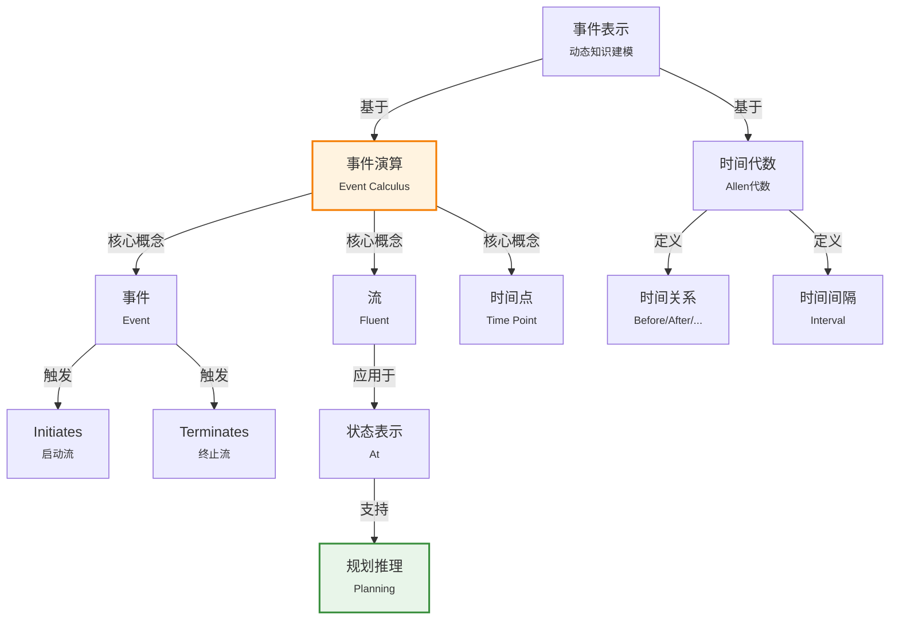

# 10.3 事件

> 📖 本节 Deep Dive | 预计学习时间: 55 分钟

---

## 1. 背景与动机

### 1.1 历史背景

**学科演进脉络**

事件表示是知识表示中处理时间维度和动态变化的核心问题。与静态的对象和类别不同，事件涉及时间、变化和因果关系，是描述世界动态性的关键概念。

事件表示的研究可以追溯到20世纪60年代的人工智能规划研究。早期的规划系统（如STRIPS）使用动作（Action）的概念来表示状态变化，但动作被建模为瞬时发生的离散事件。随着研究的深入，学者们认识到需要更精细的事件表示来处理连续动作、并发事件和复杂时序关系。

**里程碑事件**:

| 年份 | 人物/事件 | 贡献 | 影响 |
|------|-----------|------|------|
| 1969年 | STRIPS规划系统 | 引入动作和状态变化表示 | 奠定了动作表示的基础 |
| 1970年代 | 情景演算(Situation Calculus) | 形式化动作和状态变化 | 提供了事件表示的逻辑基础 |
| 1983年 | James Allen的时间间隔代数 | 系统研究时间关系 | 为时序推理提供了形式工具 |
| 1986年 | 事件演算(Event Calculus) | Kowalski和Sergot提出 | 提供了连续时间的事件表示框架 |
| 1980年 | Davidson的事件语义学 | 哲学层面对事件的分析 | 影响了AI事件表示的理论基础 |
| 1990年代 | 时序逻辑发展 | 线性时序逻辑、分支时序逻辑 | 提供了事件推理的逻辑工具 |

**演进动机**:
- **早期方法**: 情景演算将世界建模为离散的情景序列，动作是瞬时发生的
- **局限性**: 无法表示连续动作、并发事件、事件持续时间
- **突破**: 事件演算引入时间点和时间间隔，能够表示复杂的时间结构和事件关系

### 1.2 研究动机

**为什么研究者关注这个主题？**

1. **动态世界的表示**: 真实世界是动态变化的，智能体需要能够表示和推理关于变化的知识。事件表示使智能体能够回答"发生了什么"、"什么时候发生"、"导致什么结果"等问题。

2. **规划与推理**: 智能体的核心能力之一是规划——通过推理动作的效果来选择行动序列。事件表示是规划系统的基础。

3. **自然语言理解**: 自然语言中大量语句描述事件（"约翰在昨天开车去纽约"）。理解这些语句需要丰富的事件表示能力。

**与其他领域的关系**:
- **与情景演算的关系**: 事件演算是情景演算的扩展，增加了对连续时间和并发事件的支持
- **与时序逻辑的关系**: 时序逻辑提供了事件推理的形式工具，两者可以结合使用
- **与过程代数的关系**: 计算机科学中的过程代数（如CSP、CCS）也研究并发事件，与事件演算相互启发

### 1.3 实际应用场景

| 应用领域 | 具体问题 | 本节理论的作用 | 预期效果 |
|----------|----------|----------------|----------|
| 智能规划 | 动作序列生成 | 表示动作效果和时序约束 | 生成可行计划 |
| 自然语言理解 | 事件抽取和时序分析 | 提供事件表示框架 | 理解叙事文本 |
| 视频监控 | 行为识别和异常检测 | 表示复杂事件模式 | 自动识别异常行为 |
| 医疗记录 | 病程发展和治疗过程 | 表示医疗事件序列 | 支持临床决策 |
| 金融分析 | 市场事件和因果关系 | 表示经济事件网络 | 预测市场趋势 |

**典型案例预览**:
> 想象一个智能日程助手，它需要理解"Shankar从旧金山飞往华盛顿特区"这一事件：这是一个飞行事件，开始于时间t₁，结束于时间t₂，导致Shankar的位置从旧金山变为华盛顿。更进一步，它还需要处理"在等飞机时喝咖啡"这样的并发事件，以及"航班延误导致错过会议"这样的因果链。

### 1.4 先决条件

**学习本节需要的前置知识**:

| 知识项 | 来源 | 掌握程度要求 | 关键概念 |
|--------|------|:------------:|----------|
| 一阶逻辑 | 第8章 | 必须熟练掌握 | 谓词、量词、推理 |
| 情景演算 | 第7章 | 理解即可 | 动作、状态、后继状态公理 |
| 类别与对象 | 10.2节 | 理解即可 | 物化、属性继承 |
| 集合论基础 | 数学基础 | 了解 | 区间、关系 |

**前置检查清单**:
- [ ] 理解情景演算的基本概念
- [ ] 能够用一阶逻辑表示简单动作
- [ ] 了解时间点和时间间隔的区别

---

## 2. 知识逻辑图谱

### 2.1 概念关系图



### 2.2 知识发展依赖链

```
【情景演算】           【事件演算】            【时序逻辑】           【应用系统】
    ↓                   ↓                     ↓                   ↓
┌─────────┐      ┌─────────────┐       ┌───────────┐      ┌──────────┐
│ 离散动作│      │ 连续时间    │       │ 模态算子  │ ──→  │ 规划系统 │
│ 瞬时变化│ ──→  │ 事件物化    │  ──→  │ 时序推理  │      │ 自然语言 │
│ 后继状态│      │ 并发事件    │       │ 模型检验  │      │ 监控系统 │
└─────────┘      │ 事件效果    │       └───────────┘      └──────────┘
                 └─────────────┘
                      │
                 ┌────┴────┐
                 ↓         ↓
            Allen代数   流演算
            时间关系    状态物化
```

**依赖链详解**:
1. **情景演算**: 提供了动作和状态变化的基本框架，但局限于离散时间和瞬时动作
2. **事件演算**: 扩展情景演算，引入连续时间和事件物化，支持更丰富的时序结构
3. **时序逻辑**: 提供了推理事件和时序关系的形式工具
4. **应用系统**: 规划系统、自然语言理解等应用事件表示理论

### 2.3 本节在章节中的位置

```
第 10 章: 知识表示
├── 10.1 本体论工程
│   └── [通用框架]
│
├── 10.2 类别与对象
│   └── [静态知识表示]
│
├── 10.3 事件 ← ⭐ 当前位置
│   ├── [核心概念: 事件、流、时间]
│   ├── [10.3.1: 时间表示]
│   └── [10.3.2: 流和对象]
│
├── 10.4 精神对象
│   └── [模态逻辑扩展]
│
└── 10.5-10.6 推理系统
    └── [事件推理机制]
```

**衔接说明**:
- **从前一节继承**: 10.2节的物化概念用于事件的表示（将事件作为对象）
- **为后一节铺垫**: 事件表示为10.4节的模态逻辑提供了时间基础

---

## 3. 核心概念与数学分析

### 3.1 核心术语定义

**定义 10.3.1** (事件 / Event):

> **正式定义**: 事件是在时间中发生的、具有开始和结束的事情。在事件演算中，事件被物化为对象，可以具有属性并参与关系。

**定义详解**:
- **直观解释**: 事件是"发生的事情"，如"飞行"、"会议"、"地震"。与动作不同，事件可以是外因的、非确定性的。
- **数学表述**: $E_1 \in Flyings$ 表示"$E_1$是一个飞行事件"
- **物化优势**: 通过将事件物化为对象，可以对其添加任意属性，如$Bumpy(E_1)$表示"$E_1$是一次颠簸的飞行"

**定义 10.3.2** (流 / Fluent):

> **正式定义**: 流是随时间变化的世界属性，表示为取时间参数的函数。流在特定时间区间内可能为真或为假。

**定义详解**:
- **直观解释**: 流是"变化的部分"，如"位置"、"温度"、"所有权"。例如，$At(Shankar, Berkeley)$是一个流，表示Shankar在伯克利。
- **数学表述**: $T(f, t_1, t_2)$ 表示"流$f$在$t_1$和$t_2$之间的所有时刻为真"
- **与事件的关系**: 事件启动（Initiates）或终止（Terminates）流

**定义 10.3.3** (时间点和时间间隔 / Time Points and Intervals):

> **正式定义**: 时间点是时间尺度上的位置，持续时间为0；时间间隔是两个时间点之间的时段，具有正持续时间。

**数学表述**:
$$Partition(\{Moments, ExtendedIntervals\}, Intervals)$$

$$i \in Moments \Leftrightarrow Duration(i) = Seconds(0)$$

### 3.2 符号系统与约定

**本节符号总表**:

| 符号 | 含义 | 数学表达 | 备注 |
|:----:|------|----------|------|
| $Happens(e, t_1, t_2)$ | 事件发生 | 事件$e$从$t_1$开始到$t_2$结束 | 时间区间 |
| $T(f, t_1, t_2)$ | 流为真 | 流$f$在$[t_1, t_2]$为真 | 持续性 |
| $Initiates(e, f, t)$ | 启动 | 事件$e$在$t$启动流$f$ | 效果 |
| $Terminates(e, f, t)$ | 终止 | 事件$e$在$t$终止流$f$ | 效果 |
| $Initiated(f, t_1, t_2)$ | 被启动 | 流$f$在$[t_1, t_2]$某时刻被启动 | 变化检测 |
| $Terminated(f, t_1, t_2)$ | 被终止 | 流$f$在$[t_1, t_2]$某时刻被终止 | 变化检测 |
| $t_1 < t_2$ | 时间顺序 | 时刻$t_1$在$t_2$之前 | 时序关系 |

### 3.3 关键公式与性质

#### 公式 1: 事件演算的基本框架公理

**数学表述**:
$$Happens(e, t_1, t_3) \wedge Initiates(e, f, t_2) \wedge \neg Terminated(f, t_2, t_4) \wedge t_1 \leq t_2 \leq t_3 \leq t_4 \Rightarrow T(f, t_2, t_4)$$

**公式要素解析**:

| 维度 | 内容 |
|------|------|
| **直观解释** | 如果事件$e$在$t_2$启动了流$f$，且$f$在$t_2$到$t_4$之间没有被终止，则$f$在$[t_2, t_4]$为真 |
| **几何意义** | 流为真的时间区间由启动事件开始，直到被终止事件结束 |
| **领域背景** | 这是事件演算的核心公理，定义了事件如何影响世界状态 |

**对称公理（终止版本）**:
$$Happens(e, t_1, t_3) \wedge Terminates(e, f, t_2) \wedge \neg Initiated(f, t_2, t_4) \wedge t_1 \leq t_2 \leq t_3 \leq t_4 \Rightarrow \neg T(f, t_2, t_4)$$

#### 公式 2: 启动和终止的检测定义

**Initiated定义**:
$$Initiated(f, t_1, t_5) \Leftrightarrow \exists e, t_2, t_3, t_4: Happens(e, t_2, t_4) \wedge Initiates(e, f, t_3) \wedge t_1 \leq t_2 \leq t_3 \leq t_4 \leq t_5$$

**Terminated定义**:
$$Terminated(f, t_1, t_5) \Leftrightarrow \exists e, t_2, t_3, t_4: Happens(e, t_2, t_4) \wedge Terminates(e, f, t_3) \wedge t_1 \leq t_2 \leq t_3 \leq t_4 \leq t_5$$

**公式意义**: 这两个定义形式化了"流在某个时间区间内被启动/终止"的概念。

#### 公式 3: 时间间隔的基本关系（Allen代数）

**基本关系集合**:

| 关系 | 定义 | 图示 |
|------|------|------|
| $Meet(i, j)$ | $End(i) = Begin(j)$ | [i][j] |
| $Before(i, j)$ | $End(i) < Begin(j)$ | [i]...[j] |
| $After(j, i)$ | $Before(i, j)$ | [j]...[i] |
| $During(i, j)$ | $Begin(j) < Begin(i) < End(i) < End(j)$ | [[i]] |
| $Overlap(i, j)$ | $Begin(i) < Begin(j) < End(i) < End(j)$ | [i[i]j] |
| $Starts(i, j)$ | $Begin(i) = Begin(j)$ | [i[j]] |
| $Finishes(i, j)$ | $End(i) = End(j)$ | [[i]j] |
| $Equals(i, j)$ | $Begin(i) = Begin(j) \wedge End(i) = End(j)$ | [i=j] |

**公式意义**: Allen代数提供了13种基本时间关系（7种及其逆关系），可以表示任意两个时间间隔之间的时序关系。

#### 公式 4: 飞行事件的效果公理

**数学表述**:
$$E = Flyings(a, here, there) \wedge Happens(E, t_1, t_2) \Rightarrow$$
$$Terminates(E, At(a, here), t_1) \wedge Initiates(E, At(a, there), t_2)$$

**公式意义**: 飞行事件终止了"在出发地"的流，启动了"在目的地"的流。

### 3.4 重要性质与推论

**性质 10.3.1** (流的持续性):

> **陈述**: 如果没有事件终止流$f$，则$f$一旦启动就会持续为真。

**形式化**:
$$Initiated(f, t_1) \wedge \neg \exists e, t_2: Terminates(e, f, t_2) \wedge t_1 < t_2 < t_3 \Rightarrow T(f, t_1, t_3)$$

**性质 10.3.2** (时间关系的完备性):

> **陈述**: Allen代数的13种基本关系完备地覆盖了任意两个时间间隔之间可能的关系。

---

## 4. 定理与证明

### 4.1 事件效果传递定理

**定理 10.3.1** (事件效果的持续性):

> **正式陈述**: 设事件$e$在$t_2$启动流$f$，且$f$在$[t_2, t_4]$内没有被终止，则$f$在整个区间内为真。

**定理解读**:
- **条件（前提）**:
  1. $Happens(e, t_1, t_3)$（事件$e$发生）
  2. $Initiates(e, f, t_2)$（$e$在$t_2$启动$f$）
  3. $\neg Terminated(f, t_2, t_4)$（$f$在$[t_2, t_4]$未被终止）
  4. $t_1 \leq t_2 \leq t_3 \leq t_4$（时间顺序）

- **结论**: $T(f, t_2, t_4)$（$f$在$[t_2, t_4]$为真）

- **定理意义**: 这是事件演算的核心定理，保证了流状态的持续性，直到被明确终止。

### 4.2 证明详解

**证明策略概览**:

直接应用事件演算的基本框架公理。

**核心思路**: 验证定理条件与公理前提的匹配。

---

**正式证明**:

**步骤 1**: 识别已知条件

根据定理前提，我们有：
- $Happens(e, t_1, t_3)$ ... (1)
- $Initiates(e, f, t_2)$ ... (2)
- $\neg Terminated(f, t_2, t_4)$ ... (3)
- $t_1 \leq t_2 \leq t_3 \leq t_4$ ... (4)

**步骤 2**: 应用基本框架公理

事件演算的基本框架公理为：
$$Happens(e, t_1, t_3) \wedge Initiates(e, f, t_2) \wedge \neg Terminated(f, t_2, t_4) \wedge t_1 \leq t_2 \leq t_3 \leq t_4 \Rightarrow T(f, t_2, t_4)$$

**步骤 3**: 验证前提匹配

对比定理条件(1)-(4)与公理前提：
- (1) 匹配 $Happens(e, t_1, t_3)$ ✓
- (2) 匹配 $Initiates(e, f, t_2)$ ✓
- (3) 匹配 $\neg Terminated(f, t_2, t_4)$ ✓
- (4) 匹配 $t_1 \leq t_2 \leq t_3 \leq t_4$ ✓

**步骤 4**: 得出结论

由于所有前提都满足，根据基本框架公理：
$$T(f, t_2, t_4)$$

因此，定理得证。

$$\blacksquare \text{ (证毕)}$$

### 4.3 时间关系推理定理

**定理 10.3.2** (时间关系的传递性):

> **正式陈述**: 如果$Before(i, j)$且$Before(j, k)$，则$Before(i, k)$。

**证明**:

由$Before(i, j)$: $End(i) < Begin(j)$ ... (1)

由$Before(j, k)$: $End(j) < Begin(k)$ ... (2)

由时间顺序的传递性: $End(i) < Begin(j) \leq End(j) < Begin(k)$

因此: $End(i) < Begin(k)$

即$Before(i, k)$成立。

$$\blacksquare \text{ (证毕)}$$

### 4.4 证明分析与提炼

**核心洞见**: 事件演算的推理基于两个核心机制：(1) 事件明确启动或终止流；(2) 流状态在没有相反事件时持续。这种"惯性"假设是常识推理的基础。

**证明技巧总结**:

| 技巧 | 在本证明中的应用 | 可迁移性 | 其他应用场景 |
|------|------------------|----------|--------------|
| 公理应用 | 直接应用事件演算公理 | ⭐⭐⭐⭐⭐ | 所有基于公理系统的推理 |
| 条件匹配 | 验证定理条件与公理前提 | ⭐⭐⭐⭐ | 规则匹配、模式识别 |
| 传递性链 | 时间关系的传递推理 | ⭐⭐⭐⭐⭐ | 序关系、因果链 |

---

## 5. 具体示例与详解

### 5.1 典型数值示例：飞行事件推理

**示例 10.3.1**: Shankar的飞行

**📋 问题陈述**:

表示以下场景并进行推理：
- Shankar乘坐航班从旧金山(SF)飞往华盛顿特区(DC)
- 航班$E_1$从$t_1$开始，到$t_2$结束
- 初始状态：Shankar在SF
- 推理：确定Shankar在$t_2$之后的位置

**已知**:
- $E_1 \in Flyings$
- $Flyer(E_1, Shankar)$
- $Origin(E_1, SF)$
- $Destination(E_1, DC)$
- $Happens(E_1, t_1, t_2)$
- $T(At(Shankar, SF), t_0, t_1)$（初始状态）

**求解**: Shankar在$t_2$之后的位置

---

**🔍 解答过程**:

**步骤 1: 定义飞行事件的效果**

根据飞行事件的通用效果公理：
$$\forall e, a, o, d, t_1, t_2: e \in Flyings \wedge Flyer(e, a) \wedge Origin(e, o) \wedge Destination(e, d) \wedge Happens(e, t_1, t_2) \Rightarrow$$
$$Terminates(e, At(a, o), t_1) \wedge Initiates(e, At(a, d), t_2)$$

**步骤 2: 应用到具体事件**

代入$E_1$的具体信息：
$$Terminates(E_1, At(Shankar, SF), t_1)$$
$$Initiates(E_1, At(Shankar, DC), t_2)$$

**步骤 3: 应用基本框架公理**

对于终止：
$$Happens(E_1, t_1, t_2) \wedge Terminates(E_1, At(Shankar, SF), t_1) \Rightarrow$$
$$\neg T(At(Shankar, SF), t_1, t_2)$$

对于启动：
$$Happens(E_1, t_1, t_2) \wedge Initiates(E_1, At(Shankar, DC), t_2) \wedge \neg Terminated(At(Shankar, DC), t_2, t_3) \Rightarrow$$
$$T(At(Shankar, DC), t_2, t_3)$$

**步骤 4: 得出结论**

在$t_2$之后（假设没有后续改变位置的事件）：
$$T(At(Shankar, DC), t_2, Now)$$

即Shankar在DC。

---

**✅ 验证与检验**:

**正确性检查**:
- [x] 初始状态正确表示
- [x] 事件效果正确应用
- [x] 流的启动和终止逻辑正确
- [x] 结果符合常识

### 5.2 时间关系推理示例

**示例 10.3.2**: 历史事件的时间关系

**场景**: 表示以下历史事实：
- 乔治六世的统治紧接着伊丽莎白二世的统治
- 猫王主宰乐坛的时间与20世纪50年代重叠

**表示**:
$$Meets(ReignOf(GeorgeVI), ReignOf(ElizabethII))$$

$$Overlap(Fifties, ReignOf(Elvis))$$

$$Begin(Fifties) = Begin(AD1950)$$

$$End(Fifties) = End(AD1959)$$

**推理**: 可以推断伊丽莎白二世的统治开始于1952年左右（乔治六世去世），猫王的事业高峰期在1950年代。

### 5.3 流与对象的统一视角

**示例 10.3.3**: 美国总统作为流

**场景**: 表示"美国总统"这一随时间变化的概念。

**分析**:

$President(USA)$不能表示为随时间变化指代不同人的项，因为在标准一阶逻辑中，一个项在给定模型中只能指代一个对象。

**解决方案**: 将$President(USA)$视为一个对象，这个对象在不同时间由不同的人组成：
- 1789-1797年：由乔治·华盛顿组成
- 1797-1801年：由约翰·亚当斯组成
- ...

**表示**:
$$T(Equals(President(USA), GeorgeWashington), Begin(AD1790), End(AD1790))$$

这表示在1790年，美国总统这个对象与乔治·华盛顿具有等同关系。

### 5.4 类比与可视化

**直觉类比**:

| 抽象概念 | 日常类比 | 对应关系 |
|----------|----------|----------|
| 事件 | 电影场景 | 有开始、结束和效果 |
| 流 | 视频中的属性 | 随时间变化的状态 |
| Initiates | 开关"开" | 启动某个状态 |
| Terminates | 开关"关" | 结束某个状态 |
| 时间间隔 | 时间段 | 有起点和终点 |
| Allen关系 | 日程安排 | 会议之间的时间关系 |

**可视化**:

```
事件和流的时间线

t₀    t₁      t₂      t₃      t₄
│     │       │       │       │
├─────┼───────┼───────┼───────┤
│     │ 事件E │       │       │
│     │[═════]│       │       │
│     │       │       │       │
│ 在SF│ 在SF  │ 在DC  │ 在DC  │
│[═══]│[═════]│[══════│══════]│
│     │↑终止  │↑启动  │       │
└─────┴───────┴───────┴───────┘

Allen关系图示

Meet:    [A][B]        Before:  [A]  [B]
During:  [  [A]  ]     Overlap: [A[ ]B]
Starts:  [A[  B  ]     Finishes:[[  A  ]B]
```

---

## 6. 深入理解与拓展

### 6.1 一句话本质

> 🎯 **核心要点**: 事件演算通过物化事件、区分流与事件、建立时间代数，为动态世界的表示和推理提供了形式化框架。

### 6.2 深入思考问题

1. **概念层面**: 为什么需要将事件物化为对象，而不是用谓词表示？
   <!-- 思考方向: 考虑属性添加、事件关系、元推理的需求 -->

2. **方法层面**: 事件演算与情景演算相比，优势和劣势各是什么？
   <!-- 思考方向: 考虑表达能力、推理复杂度、实现难度 -->

3. **应用层面**: 如何处理并发事件之间的交互效果？
   <!-- 思考方向: 考虑累积效果、冲突解决、优先级 -->

4. **拓展层面**: 事件演算如何扩展到概率和不确定性场景？
   <!-- 思考方向: 考虑概率事件演算、模糊时间、不确定性效果 -->

### 6.3 与其他节的关系

**本节输出**:
- 定义了事件、流、时间的形式化表示
- 提供了事件效果的推理机制
- 建立了时间关系的代数系统

**后续发展预告**:
- 10.4节将扩展事件表示到模态逻辑，处理关于事件的信念和知识
- 10.5节将介绍用于事件和类别推理的专用系统

---

## 7. 总结与反思

### 7.1 关键要点总结

本节必须掌握的 **6** 个核心要点:

1. **事件物化**: 将事件表示为对象，允许添加属性和关系
   
   💡 *记忆技巧*: 事件物化后就像"名词"，可以被描述

2. **流（Fluent）**: 随时间变化的世界属性，是事件作用的对象
   
   💡 *记忆技巧*: 流像"状态变量"，事件改变它的值

3. **事件效果**: 事件通过$Initiates$和$Terminates$影响流
   
   💡 *记忆技巧*: 事件是"开关"，控制流的"开"和"关"

4. **基本框架公理**: 定义了流状态如何随事件变化而持续
   
   💡 *记忆技巧*: "惯性原理"——状态持续直到被改变

5. **Allen时间代数**: 13种基本关系完备描述时间间隔关系
   
   💡 *记忆技巧*: 记住Meet、Before、During、Overlap四个核心关系

6. **流与对象的统一**: 对象可以看作一般化的事件（时空片）
   
   💡 *记忆技巧*: 美国既是国家（对象），也是历史事件

### 7.2 本节知识框架

```
┌─────────────────────────────────────────────────────────────┐
│  第10.3节: 事件                                             │
├─────────────────────────────────────────────────────────────┤
│  输入/前置                                                   │
│  • 一阶逻辑基础                                             │
│  • 物化概念（10.2节）                                       │
│  • 情景演算基础                                             │
│                                                             │
│  处理/核心                                                   │
│  • 事件物化表示                                             │
│  • 流（Fluent）定义                                         │
│  • Initiates/Terminates                                     │
│  • 基本框架公理                                             │
│  • Allen时间代数                                            │
│  ↓                                                          │
│  输出/结果                                                   │
│  • 动态世界表示框架                                         │
│  • 时序推理能力                                             │
│                                                             │
│  应用/价值                                                   │
│  • 规划系统                                                 │
│  • 自然语言理解                                             │
│  • 时序数据库                                               │
└─────────────────────────────────────────────────────────────┘
```

### 7.3 常见误解与纠正

| 常见误解 ❌ | 正确理解 ✅ | 为什么容易错 | 如何避免 |
|-------------|-------------|--------------|----------|
| ❌ 事件就是动作 | ✅ 事件包括动作，但也包括外因事件 | 动作是事件的子集 | 明确事件的广义性 |
| ❌ 流就是谓词 | ✅ 流是随时间变化的函数 | 流和谓词有相似性 | 强调流的时间依赖性 |
| ❌ 事件演算只能处理离散事件 | ✅ 可以扩展处理连续事件 | 受情景演算影响 | 了解事件演算的扩展形式 |
| ❌ Allen关系只有7种 | ✅ 有13种（7种及其逆） | 常见介绍只提7种 | 记住逆关系 |
| ❌ 流的持续性是绝对的 | ✅ 持续性可以被后续事件打破 | 误解惯性假设 | 明确持续的条件 |

### 7.4 反思问题

**连接性问题**:
1. 事件表示如何与10.2节的物质表示结合？
2. 事件演算如何支持10.4节关于信念的推理？

**应用性问题**:
1. 在实际应用中，如何处理事件时间的不确定性？
2. 如何表示和推理周期性事件（如"每天跑步"）？

**批判性问题**:
1. 事件演算的局限性是什么？
2. 在什么情况下应该使用时序逻辑而非事件演算？

### 7.5 学习检查清单

- [ ] 能够用事件演算表示简单场景
- [ ] 能够定义事件的效果（Initiates/Terminates）
- [ ] 能够应用基本框架公理进行推理
- [ ] 能够使用Allen关系表示时间关系
- [ ] 理解流与对象的关系
- [ ] 了解事件演算与情景演算的区别

---

## 附录

### A. 公式速查表

| 公式 | 名称 | 使用条件 | 备注 |
|:----:|------|----------|------|
| $Happens(e, t_1, t_2)$ | 事件发生 | 表示事件的时间区间 | 核心谓词 |
| $T(f, t_1, t_2)$ | 流为真 | 流在时间段内为真 | 持续性 |
| $Initiates(e, f, t)$ | 启动 | 事件启动流 | 效果 |
| $Terminates(e, f, t)$ | 终止 | 事件终止流 | 效果 |
| $Before(i, j)$ | 在之前 | 时间间隔关系 | Allen关系 |
| $Meet(i, j)$ | 相接 | 结束=开始 | Allen关系 |
| $During(i, j)$ | 在期间 | 包含关系 | Allen关系 |

### B. 术语索引

| 术语 | 英文 | 定义 | 位置 |
|------|------|------|:----:|
| 事件 | Event | 时间中发生的事情 | 10.3 |
| 流 | Fluent | 随时间变化的属性 | 10.3 |
| 事件演算 | Event Calculus | 事件表示的形式框架 | 10.3 |
| Initiates | Initiates | 启动流的关系 | 10.3 |
| Terminates | Terminates | 终止流的关系 | 10.3 |
| Allen代数 | Allen's Algebra | 时间关系代数 | 10.3.1 |
| 时间间隔 | Interval | 两个时间点之间的时段 | 10.3.1 |

### C. 延伸阅读

**理论深化**:
- Kowalski, R. and Sergot, M. (1986). "A logic-based calculus of events". 事件演算的经典论文。
- Allen, J.F. (1983). "Maintaining knowledge about temporal intervals". Allen代数的经典论文。

**应用拓展**:
- Shanahan, M. (1999). "The Event Calculus explained". 事件演算的综述。
- Mueller, E.T. (2006). "Commonsense Reasoning". 包含事件演算的详细讨论。

**补充材料**:
- Davidson, D. (1980). "Essays on Actions and Events". 从哲学角度分析事件。

---

> 📌 **下一节**: [10.4 精神对象和模态逻辑](10.4_精神对象和模态逻辑.md)
> 
> 📚 **返回概览**: [第10章概览](00_概览.md)
