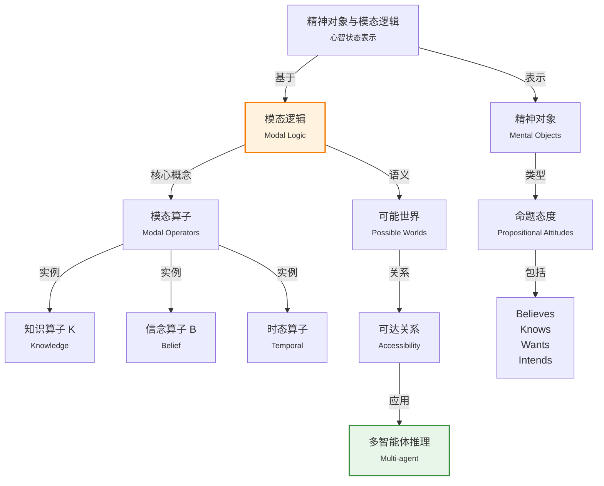

# 10.4 精神对象和模态逻辑

> 📖 本节 Deep Dive | 预计学习时间: 50 分钟

---

## 1. 背景与动机

### 1.1 历史背景

**学科演进脉络**

精神对象（Mental Objects）和模态逻辑（Modal Logic）的研究源于对人类心智状态和推理能力的形式化需求。与描述外部世界的"物理对象"不同，精神对象涉及信念、知识、意图等心智状态，是构建具有自我意识和社交能力的智能体的关键。

模态逻辑的历史可以追溯到亚里士多德，他研究了"必然性"和"可能性"的概念。现代模态逻辑由C.I. Lewis在20世纪初系统发展，而认知模态逻辑（关于知识和信念的模态逻辑）则在20世纪60年代由Hintikka等人开创。

**里程碑事件**:

| 年份 | 人物/事件 | 贡献 | 影响 |
|------|-----------|------|------|
| 公元前300年 | 亚里士多德 | 研究模态概念（必然/可能） | 奠定了模态逻辑的哲学基础 |
| 1910-1930s | C.I. Lewis | 现代模态逻辑的创立 | 建立了模态逻辑的形式系统 |
| 1962年 | Hintikka | 知识逻辑的语义学 | 开创了认知模态逻辑 |
| 1963年 | Kripke | 可能世界语义学 | 为模态逻辑提供了模型论语义 |
| 1980s | 多智能体系统研究 | 知识推理在多智能体中的应用 | 推动了认知逻辑的实用化 |
| 1995年 | Fagin等《Reasoning about Knowledge》 | 认知逻辑的系统化 | 成为认知逻辑的标准参考书 |

**演进动机**:
- **早期方法**: 一阶逻辑只能表示关于世界的陈述，无法表示关于这些陈述的知识或信念
- **局限性**: 无法处理"知道"、"相信"等命题态度，无法表达"知道什么"和"知道不知道"
- **突破**: 模态逻辑引入模态算子，能够形式化知识、信念、必然性、可能性等概念

### 1.2 研究动机

**为什么研究者关注这个主题？**

1. **元认知能力**: 智能体需要能够推理自己的知识和推理过程。例如，当一个问题无法回答时，智能体应该知道是因为知识不足还是问题本身无法回答。

2. **多智能体协作**: 在多智能体系统中，智能体需要推理其他智能体的知识和信念。例如，在协作任务中，智能体需要知道"其他智能体知道什么"。

3. **自然语言理解**: 自然语言中大量涉及知识、信念和意图的表达（"他知道我知道..."）。理解这些表达需要模态逻辑的工具。

**与其他领域的关系**:
- **与认识论的关系**: 认识论（Epistemology）是哲学中研究知识的学科，为知识逻辑提供了理论基础
- **与博弈论的关系**: 博弈论中的共同知识概念与认知逻辑密切相关
- **与分布式系统的关系**: 分布式系统中的知识推理用于分析协议和一致性

### 1.3 实际应用场景

| 应用领域 | 具体问题 | 本节理论的作用 | 预期效果 |
|----------|----------|----------------|----------|
| 多智能体系统 | 协调和协作 | 推理其他智能体的知识 | 实现有效协作 |
| 自然语言理解 | 语义分析 | 处理知识、信念表达 | 理解复杂语句 |
| 游戏AI | 对手建模 | 推理对手的知识和意图 | 制定最优策略 |
| 安全协议分析 | 信息泄露检测 | 分析知识传递 | 验证协议安全性 |
| 人机交互 | 用户建模 | 推理用户的知识和目标 | 提供个性化服务 |

**典型案例预览**:
> 考虑经典的"泥孩子谜题"：父亲告诉一群孩子"你们中至少有一个人额头上有泥"。每个孩子都能看到其他孩子的额头但看不到自己的。经过k轮"我不知道我是否有泥"的回答后，所有有泥的孩子都知道自己有泥。这个谜题的解答需要嵌套知识推理：我知道、我知道你知道、我知道你知道我知道...

### 1.4 先决条件

**学习本节需要的前置知识**:

| 知识项 | 来源 | 掌握程度要求 | 关键概念 |
|--------|------|:------------:|----------|
| 一阶逻辑 | 第8章 | 必须熟练掌握 | 语义、模型论 |
| 可能世界概念 | 哲学基础 | 了解 | 模态、必然性 |
| 知识表示 | 10.1-10.3节 | 理解即可 | 物化、推理 |

**前置检查清单**:
- [ ] 理解一阶逻辑的模型论语义
- [ ] 了解"必然"和"可能"的直观含义
- [ ] 理解物化的概念

---

## 2. 知识逻辑图谱

### 2.1 概念关系图



### 2.2 知识发展依赖链

```
【哲学逻辑】           【模态逻辑】            【认知逻辑】           【应用系统】
    ↓                   ↓                     ↓                   ↓
┌─────────┐      ┌─────────────┐       ┌───────────┐      ┌──────────┐
│ 亚里士多│      │ Lewis       │       │ Hintikka  │ ──→  │ 多智能体 │
│ 德模态  │ ──→  │ 模态算子    │  ──→  │ 知识逻辑  │      │ 系统     │
│ 概念    │      │ Kripke语义  │       │ 公共知识  │      │ 协议验证 │
└─────────┘      └─────────────┘       └───────────┘      └──────────┘
                      │                      │
                      └──────────────────────┘
                              精神对象表示体系
```

**依赖链详解**:
1. **哲学逻辑**: 亚里士多德等哲学家对必然性和可能性的思考
2. **模态逻辑**: Lewis和Kripke建立了模态逻辑的形式系统和语义学
3. **认知逻辑**: Hintikka等将模态逻辑应用于知识和信念
4. **应用系统**: 多智能体系统、协议验证等应用认知逻辑

### 2.3 本节在章节中的位置

```
第 10 章: 知识表示
├── 10.1-10.3 基础表示
│   └── [对象、类别、事件]
│
├── 10.4 精神对象和模态逻辑 ← ⭐ 当前位置
│   ├── [核心概念: 模态算子、可能世界]
│   ├── [知识逻辑]
│   └── [其他模态逻辑]
│
├── 10.5 类别的推理系统
│   └── [基于本体的推理]
│
└── 10.6 缺省推理
    └── [非单调推理]
```

**衔接说明**:
- **从前一节继承**: 10.1-10.3节提供了知识表示的基础，本节扩展这些表示到心智状态
- **为后一节铺垫**: 模态逻辑为10.6节的缺省推理提供了理论基础

---

## 3. 核心概念与数学分析

### 3.1 核心术语定义

**定义 10.4.1** (模态逻辑 / Modal Logic):

> **正式定义**: 模态逻辑是在经典逻辑基础上添加模态算子的逻辑系统，用于表示必然性、可能性、知识、信念等模态概念。

**定义详解**:
- **直观解释**: 模态逻辑扩展了"真/假"的二值判断，增加了"必然真"、"可能真"、"知道为真"、"相信为真"等模态
- **数学表述**: 模态逻辑的语言包含模态算子，如 $\Box$（必然）、$\Diamond$（可能）、$K_a$（智能体$a$知道）
- **为什么这样定义**: 经典逻辑只能表达"是什么"，模态逻辑还能表达"知道是什么"、"必然是什么"

**定义 10.4.2** (可能世界 / Possible World):

> **正式定义**: 可能世界是模态逻辑的语义基础，表示一种可能的情形或状态。一个命题在某个世界为真，在其他世界可能为假。

**定义详解**:
- **直观解释**: 想象多个"平行宇宙"，每个宇宙代表一种可能的世界状态。在有些宇宙中"正在下雨"为真，在其他宇宙中为假
- **数学表述**: 模态逻辑的模型是一个三元组 $M = (W, R, V)$，其中$W$是世界集合，$R$是可达关系，$V$是赋值函数
- **为什么这样定义**: 可能世界提供了模态算子的语义解释基础

**定义 10.4.3** (可达关系 / Accessibility Relation):

> **正式定义**: 可达关系$R$是世界之间的一种二元关系。$w_1 R w_2$表示从世界$w_1$可以"到达"世界$w_2$。

**定义详解**:
- **直观解释**: 对于知识模态，可达关系表示"与当前知识一致"。如果$w_1 R w_2$，则在$w_1$中智能体认为$w_2$是可能的
- **数学表述**: $R \subseteq W \times W$
- **为什么这样定义**: 不同模态对应不同的可达关系性质（自反、传递、对称等）

**定义 10.4.4** (知识算子 / Knowledge Operator):

> **正式定义**: 知识算子$K_a$表示"智能体$a$知道"。$K_a P$表示"智能体$a$知道$P$为真"。

**定义详解**:
- **直观解释**: $K_a P$表示智能体$a$确信$P$为真，且这种确信是有根据的
- **数学表述**: $K_a P$在世界$w$为真，当且仅当在所有从$w$可达的世界中$P$都为真
- **为什么这样定义**: 知识被定义为"在所有可能世界中都为真"，确保了知识的可靠性

### 3.2 符号系统与约定

**本节符号总表**:

| 符号 | 含义 | 数学表达 | 备注 |
|:----:|------|----------|------|
| $\Box P$ | 必然P | $P$在所有可能世界为真 |  alethic模态 |
| $\Diamond P$ | 可能P | $P$在某个可能世界为真 |  alethic模态 |
| $K_a P$ | $a$知道$P$ | 知识算子 | 认知模态 |
| $B_a P$ | $a$相信$P$ | 信念算子 | 认知模态 |
| $M = (W, R, V)$ | 模态模型 | $W$-世界集，$R$-可达关系，$V$-赋值 | Kripke模型 |
| $w \models P$ | $P$在$w$为真 | 满足关系 | 语义 |
| $R_a$ | 智能体$a$的可达关系 | $R_a \subseteq W \times W$ | 多智能体 |

### 3.3 关键公式与性质

#### 公式 1: 知识算子的语义定义

**数学表述**:
$$M, w \models K_a P \Leftrightarrow \forall w': w R_a w' \Rightarrow M, w' \models P$$

**公式要素解析**:

| 维度 | 内容 |
|------|------|
| **直观解释** | 智能体$a$知道$P$，当且仅当在所有与$a$当前知识一致的可能世界中，$P$都为真 |
| **几何意义** | 知识对应于可达世界集合的交集——在所有可达世界中都为真的命题才是已知的 |
| **领域背景** | 这是认知逻辑的核心定义，由Hintikka提出 |

**公式意义**: 这个定义确保了知识的可靠性——如果$K_a P$为真，则$P$必然为真。

#### 公式 2: 知识的公理（K公理）

**数学表述**:
$$K_a P \wedge K_a (P \Rightarrow Q) \Rightarrow K_a Q$$

**公式要素解析**:
- 这表示智能体能够进行逻辑推理
- 如果$a$知道$P$，且知道$P$蕴涵$Q$，则$a$知道$Q$
- 这是知识逻辑的基本公理之一

#### 公式 3: 知识的真实性（T公理）

**数学表述**:
$$K_a P \Rightarrow P$$

**公式要素解析**:
- 知识必须是真实的
- 如果$a$知道$P$，则$P$必然为真
- 这区分了知识和信念（信念可以为假）

#### 公式 4: 正内省（4公理）

**数学表述**:
$$K_a P \Rightarrow K_a K_a P$$

**公式要素解析**:
- 如果$a$知道$P$，则$a$知道自己知道$P$
- 这是关于知识的元知识
- 对应可达关系的传递性

#### 公式 5: 负内省（5公理）

**数学表述**:
$$\neg K_a P \Rightarrow K_a \neg K_a P$$

**公式要素解析**:
- 如果$a$不知道$P$，则$a$知道自己不知道$P$
- 这是更强的内省能力
- 对应可达关系的欧几里得性

### 3.4 模态逻辑系统

**不同模态逻辑系统的公理**:

| 系统 | 公理 | 可达关系性质 | 适用场景 |
|------|------|--------------|----------|
| K | K公理 | 无 | 最弱系统 |
| T | K + T | 自反 | 知识 |
| S4 | K + T + 4 | 自反+传递 | 知识（正内省） |
| S5 | K + T + 4 + 5 | 等价关系 | 知识（完全内省） |
| KD45 | K + D + 4 + 5 | 序列+传递+欧几里得 | 信念 |

其中D公理：$\neg K_a \bot$（知识是一致的，不知道矛盾）

---

## 4. 定理与证明

### 4.1 知识推理定理

**定理 10.4.1** (知识蕴含真实):

> **正式陈述**: 如果$K_a P$为真，则$P$为真。即$K_a P \Rightarrow P$。

**定理解读**:
- **条件（前提）**: 智能体$a$知道$P$
- **结论**: $P$为真
- **定理意义**: 这是知识的基本性质——知识必须是真实的（与信念不同）

### 4.2 证明详解

**证明策略概览**:

使用知识算子的语义定义和可达关系的自反性。

**核心思路**: 证明在所有满足T公理（自反可达关系）的模型中，$K_a P \Rightarrow P$成立。

---

**正式证明**:

**步骤 1**: 假设$K_a P$在世界$w$为真

$$M, w \models K_a P$$

**步骤 2**: 应用知识算子的语义定义

根据定义：
$$M, w \models K_a P \Leftrightarrow \forall w': w R_a w' \Rightarrow M, w' \models P$$

因此：
$$\forall w': w R_a w' \Rightarrow M, w' \models P \quad ...(1)$$

**步骤 3**: 应用可达关系的自反性

对于知识模态，可达关系$R_a$是自反的：
$$\forall w: w R_a w \quad ...(2)$$

**步骤 4**: 得出结论

由(2)，$w R_a w$成立。

由(1)和$w R_a w$：
$$M, w \models P$$

因此，$K_a P \Rightarrow P$得证。

$$\blacksquare \text{ (证毕)}$$

### 4.3 模态逻辑的可靠性和完备性

**定理 10.4.2** (S5系统的可靠性和完备性):

> **正式陈述**: S5系统（包含K、T、4、5公理）对于具有等价可达关系的Kripke模型类是可靠且完备的。

**定理意义**: 
- **可靠性**: 所有可证明的公式在所有模型中都有效
- **完备性**: 所有有效的公式都可证明
- 这为S5作为知识逻辑提供了理论基础

### 4.4 证明分析与提炼

**核心洞见**: 知识算子的语义将知识定义为"在所有可达世界中都为真"。这一定义自动保证了知识的真实性和内省性质。

**证明技巧总结**:

| 技巧 | 在本证明中的应用 | 可迁移性 | 其他应用场景 |
|------|------------------|----------|--------------|
| 语义证明 | 使用Kripke语义 | ⭐⭐⭐⭐⭐ | 所有模态逻辑证明 |
| 关系性质 | 使用自反性 | ⭐⭐⭐⭐ | 序关系、等价关系 |
| 全称实例化 | 对特定世界应用全称命题 | ⭐⭐⭐⭐⭐ | 全称量词推理 |

---

## 5. 具体示例与详解

### 5.1 典型示例：超人的秘密身份

**示例 10.4.1**: 指代透明性问题

**📋 问题陈述**:

考虑以下场景：
- 超人会飞：$CanFly(Superman)$
- 超人就是克拉克·肯特：$Superman = Clark$
- 露易丝知道超人会飞：$K_{Lois}(CanFly(Superman))$

**问题**: 能否推出$K_{Lois}(CanFly(Clark))$？

---

**🔍 解答过程**:

**步骤 1: 分析问题**

在经典一阶逻辑中，由$CanFly(Superman)$和$Superman = Clark$，可以推出$CanFly(Clark)$（指代透明性）。

但在知识语境中，露易丝可能不知道$Superman = Clark$。

**步骤 2: 分析可达世界**

考虑露易丝的可达世界：
- 在露易丝的所有可达世界中，$CanFly(Superman)$为真
- 但可能存在可达世界，其中$Superman \neq Clark$

**步骤 3: 得出结论**

在这些世界中，$CanFly(Clark)$可能不为真（因为克拉克在那个世界中不会飞）。

因此，不能推出$K_{Lois}(CanFly(Clark))$。

---

**✅ 验证与检验**:

**正确性检查**:
- [x] 分析符合故事设定
- [x] 模态逻辑推理正确
- [x] 说明了指代不透明性

**教训**: 模态语境（如知识、信念）中，指代不透明性成立——使用的项很重要。

### 5.2 嵌套知识示例

**示例 10.4.2**: 泥孩子谜题

**场景**: 两个孩子，A和B，每人额头可能有泥。父亲宣布"你们中至少有一个人有泥"。两个孩子都能看到对方但看不到自己。

**第一轮**: A说"我不知道我是否有泥"

**分析**:
- 如果B没有泥，A会立即知道自己有泥（因为至少一个有）
- A说不知道，意味着B看到了泥（即B有泥）
- 因此，B现在知道自己有泥

**形式化**:
$$K_A(\neg K_B(\neg Mud_B) \Rightarrow Mud_B)$$

**第二轮**: B说"我知道我有泥"

这验证了上述推理。

### 5.3 量词与知识的相互作用

**示例 10.4.3**: 邦德知道有间谍

**歧义语句**: "Bond knows that someone is a spy"

**解读1**（de dicto）: 邦德知道某个特定的人是间谍
$$\exists x: K_{Bond}(Spy(x))$$

**解读2**（de re）: 邦德只知道存在间谍，不知道是谁
$$K_{Bond}(\exists x: Spy(x))$$

**区别**:
- 解读1：存在一个$x$，在所有可达世界中邦德都知道这个$x$是间谍
- 解读2：在所有可达世界中，都存在间谍（但可能是不同的人）

### 5.4 类比与可视化

**直觉类比**:

| 抽象概念 | 日常类比 | 对应关系 |
|----------|----------|----------|
| 可能世界 | 平行宇宙 | 不同的可能性 |
| 可达关系 | 认知边界 | 智能体能想象的情形 |
| 知识 | 照亮区域 | 在可达世界中都为真 |
| 无知 | 黑暗区域 | 存在可达世界为假 |
| 模态算子 | 透镜 | 改变观察世界的方式 |

**可视化**:

```
可能世界模型（Kripke模型）

世界w₀（实际世界）
    ├── w₁（可达）── P为真
    ├── w₂（可达）── P为真
    └── w₃（不可达）── P为假

在w₀中：K_a P为真（所有可达世界P为真）
        K_a ¬P为假（不是所有可达世界P为假）
        ¬K_a P为假（知道P）
        ¬K_a ¬P为真（不知道¬P）

知识随可达关系变化

情况1（自反）：w → w
    K_a P ⇒ P 成立

情况2（传递）：w → w' → w''
    K_a P ⇒ K_a K_a P 成立
```

---

## 6. 深入理解与拓展

### 6.1 一句话本质

> 🎯 **核心要点**: 模态逻辑通过可能世界语义和模态算子，为知识、信念等心智状态提供了形式化表示和推理框架。

### 6.2 深入思考问题

1. **概念层面**: 为什么知识必须是真实的，而信念可以不是？
   <!-- 思考方向: 考虑知识的定义、认识论基础、实用性 -->

2. **方法层面**: S5系统（完全内省）是否适用于真实智能体？
   <!-- 思考方向: 考虑计算限制、认知限制、资源限制 -->

3. **应用层面**: 如何在实际系统中实现模态逻辑推理？
   <!-- 思考方向: 考虑模型检验、定理证明、计算复杂度 -->

4. **拓展层面**: 模态逻辑如何与概率推理结合？
   <!-- 思考方向: 考虑概率模态逻辑、认知概率模型 -->

### 6.3 与其他节的关系

**本节输出**:
- 定义了知识和信念的形式化表示
- 提供了心智状态推理的逻辑工具
- 介绍了可能世界语义学

**后续发展预告**:
- 10.6节的缺省推理涉及关于知识的非单调推理
- 第17章的时序推理将使用时序模态逻辑

---

## 7. 总结与反思

### 7.1 关键要点总结

本节必须掌握的 **6** 个核心要点:

1. **模态逻辑**: 扩展经典逻辑，添加模态算子（$\Box$、$\Diamond$、$K_a$等）
   
   💡 *记忆技巧*: 模态=模式+态度，表示不同的"模式"（必然/可能）和"态度"（知道/相信）

2. **可能世界语义**: 模态逻辑的语义基于可能世界和可达关系
   
   💡 *记忆技巧*: 想象多个"平行宇宙"，模态算子在这些宇宙间"跳跃"

3. **知识算子**: $K_a P$表示"$a$知道$P$"，定义为在所有可达世界中$P$为真
   
   💡 *记忆技巧*: 知识=在所有可能情形中都成立

4. **知识公理**: K（推理）、T（真实）、4（正内省）、5（负内省）
   
   💡 *记忆技巧*: KT45=S5，是知识的标准逻辑系统

5. **指代不透明性**: 在模态语境中，等值替换不成立
   
   💡 *记忆技巧*: "知道超人会飞"≠"知道克拉克会飞"（如果不知道超人是克拉克）

6. **量词作用域**: $\exists x K_a P(x)$ vs $K_a \exists x P(x)$ 有本质区别
   
   💡 *记忆技巧*: 前者知道"谁"，后者只知道"存在"

### 7.2 本节知识框架

```
┌─────────────────────────────────────────────────────────────┐
│  第10.4节: 精神对象和模态逻辑                               │
├─────────────────────────────────────────────────────────────┤
│  输入/前置                                                   │
│  • 一阶逻辑基础                                             │
│  • 模型论语义                                               │
│  • 知识表示基础                                             │
│                                                             │
│  处理/核心                                                   │
│  • 模态算子定义                                             │
│  • 可能世界语义                                             │
│  • 可达关系                                                 │
│  • 知识逻辑公理                                             │
│  • 多智能体推理                                             │
│  ↓                                                          │
│  输出/结果                                                   │
│  • 心智状态形式化                                           │
│  • 知识推理能力                                             │
│                                                             │
│  应用/价值                                                   │
│  • 多智能体系统                                             │
│  • 自然语言理解                                             │
│  • 协议验证                                                 │
└─────────────────────────────────────────────────────────────┘
```

### 7.3 常见误解与纠正

| 常见误解 ❌ | 正确理解 ✅ | 为什么容易错 | 如何避免 |
|-------------|-------------|--------------|----------|
| ❌ 模态逻辑只是多值逻辑 | ✅ 模态逻辑是经典逻辑的扩展，添加模态算子 | 都涉及"扩展" | 明确模态算子的语义 |
| ❌ 知识和信念一样 | ✅ 知识必须为真，信念可以假 | 日常语言混用 | 强调T公理（K_a P ⇒ P） |
| ❌ 可能世界是科幻概念 | ✅ 可能世界是形式语义工具 | "可能世界"的字面含义 | 理解其数学定义 |
| ❌ S5适用于所有场景 | ✅ S5假设完全内省，真实智能体可能不满足 | S5是最常用的知识逻辑 | 了解不同系统的假设 |
| ❌ 模态逻辑计算效率高 | ✅ 模态逻辑推理通常是PSPACE完全 | 模态逻辑"看起来"简单 | 了解计算复杂性 |

### 7.4 反思问题

**连接性问题**:
1. 模态逻辑如何与10.3节的事件表示结合？
2. 知识推理如何处理10.6节的缺省信息？

**应用性问题**:
1. 在多智能体系统中，如何高效计算公共知识？
2. 如何表示和推理关于他人信念的信念？

**批判性问题**:
1. 模态逻辑的逻辑全知假设是否现实？
2. 如何表示和推理知识的不确定性？

### 7.5 学习检查清单

- [ ] 能够解释模态逻辑与经典逻辑的区别
- [ ] 能够定义Kripke模型（W, R, V）
- [ ] 能够解释知识算子的语义
- [ ] 能够陈述知识逻辑的K、T、4、5公理
- [ ] 理解指代不透明性的含义
- [ ] 能够区分de dicto和de re解读
- [ ] 了解S5系统的性质

---

## 附录

### A. 公式速查表

| 公式 | 名称 | 使用条件 | 备注 |
|:----:|------|----------|------|
| $M, w \models K_a P \Leftrightarrow \forall w': w R_a w' \Rightarrow M, w' \models P$ | 知识语义 | 知识算子定义 | 核心定义 |
| $K_a P \wedge K_a (P \Rightarrow Q) \Rightarrow K_a Q$ | K公理 | 推理能力 | 基本公理 |
| $K_a P \Rightarrow P$ | T公理 | 知识真实性 | 区分知识与信念 |
| $K_a P \Rightarrow K_a K_a P$ | 4公理 | 正内省 | S4和S5 |
| $\neg K_a P \Rightarrow K_a \neg K_a P$ | 5公理 | 负内省 | S5 |
| $\Box P \Leftrightarrow \neg \Diamond \neg P$ | 对偶性 | 必然与可能 | 模态对偶 |

### B. 术语索引

| 术语 | 英文 | 定义 | 位置 |
|------|------|------|:----:|
| 模态逻辑 | Modal Logic | 包含模态算子的逻辑系统 | 10.4 |
| 可能世界 | Possible World | 模态逻辑的语义基础 | 10.4 |
| 可达关系 | Accessibility Relation | 世界之间的二元关系 | 10.4 |
| 知识算子 | Knowledge Operator | $K_a$表示"$a$知道" | 10.4 |
| 信念算子 | Belief Operator | $B_a$表示"$a$相信" | 10.4 |
| Kripke模型 | Kripke Model | $(W, R, V)$三元组 | 10.4 |
| 指代透明性 | Referential Transparency | 等值可替换 | 10.4 |
| 指代不透明性 | Referential Opacity | 模态语境中等值不可替换 | 10.4 |
| 公共知识 | Common Knowledge | 所有人知道，且知道所有人知道... | 10.4 |

### C. 延伸阅读

**理论深化**:
- Hintikka, J. (1962). "Knowledge and Belief". 认知逻辑的经典著作。
- Fagin, R. et al. (1995). "Reasoning about Knowledge". 认知逻辑的系统化介绍。

**应用拓展**:
- 多智能体系统教材: 了解知识推理在多智能体中的应用
- 协议验证: 了解模态逻辑在安全分析中的应用

**补充材料**:
- Kripke, S. (1963). "Semantical Analysis of Modal Logic". 可能世界语义学的经典论文。

---

> 📌 **下一节**: [10.5 类别的推理系统](10.5_类别的推理系统.md)
> 
> 📚 **返回概览**: [第10章概览](00_概览.md)
