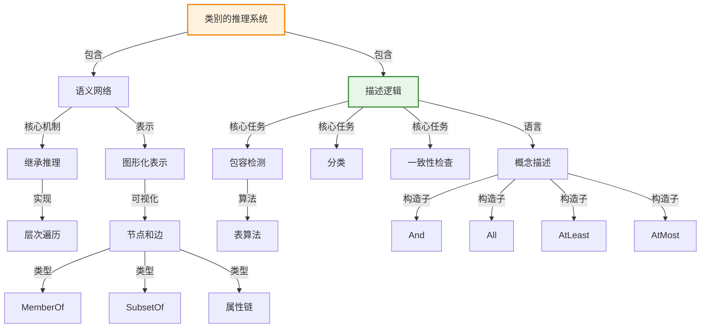

# 10.5 类别的推理系统

> 📖 本节 Deep Dive | 预计学习时间: 55 分钟

---

## 1. 背景与动机

### 1.1 历史背景

**学科演进脉络**

类别推理系统的研究源于对高效知识推理的需求。虽然一阶逻辑提供了通用的推理框架，但在处理大规模类别层次结构时效率较低。研究者开发了专门的表示系统和推理算法，以支持高效的类别继承和分类推理。

语义网络的历史可以追溯到1909年Charles S. Peirce的存在图（Existential Graphs），他称之为"未来的逻辑"。20世纪60年代，Ross Quillian将语义网络引入人工智能，用于模拟人类记忆和语言处理。1975年，Marvin Minsky提出了框架（Frame）理论，进一步发展了结构化知识表示。

描述逻辑（Description Logic）源于对语义网络形式化的需求。1980年代，KL-ONE系统的开发标志着描述逻辑的诞生。描述逻辑旨在提供语义网络的逻辑基础，同时保证推理的可判定性和效率。

**里程碑事件**:

| 年份 | 人物/事件 | 贡献 | 影响 |
|------|-----------|------|------|
| 1909年 | Charles S. Peirce | 存在图（Existential Graphs） | 语义网络的先驱 |
| 1961年 | Ross Quillian | 将语义网络引入AI | 开创了网络式知识表示 |
| 1975年 | Marvin Minsky | 框架（Frame）理论 | 结构化知识表示的重要发展 |
| 1979年 | Bill Woods | "What's In a Link" | 强调了知识表示需要精确语义 |
| 1985年 | KL-ONE系统 | 描述逻辑的早期形式 | 提供了类别推理的形式基础 |
| 1987年 | Levesque & Brachman | 表达性与复杂性权衡研究 | 揭示了描述逻辑的设计原则 |
| 2004年 | OWL标准发布 | Web本体语言 | 推动了描述逻辑的广泛应用 |

**演进动机**:
- **早期方法**: 使用通用的一阶逻辑定理证明器进行类别推理
- **局限性**: 半可判定性导致推理效率低下，无法预测求解时间
- **突破**: 开发专门的类别推理系统，提供多项式时间的推理算法

### 1.2 研究动机

**为什么研究者关注这个主题？**

1. **推理效率**: 类别层次结构是知识库的核心组织方式。专用推理系统能够利用层次结构的特点，实现高效的继承推理和分类。

2. **可预测性**: 通用定理证明器的时间复杂度难以预测，而专用系统提供可保证的推理时间，这对实际应用至关重要。

3. **用户友好**: 图形化的语义网络表示直观易懂，便于知识工程师构建和维护知识库。

**与其他领域的关系**:
- **与面向对象编程的关系**: 类别层次和继承机制与OOP中的类和继承相似，相互影响
- **与数据库的关系**: 类别推理系统的查询优化与数据库的查询优化有相似之处
- **与类型系统的关系**: 描述逻辑的类型检查与编程语言的类型系统有理论联系

### 1.3 实际应用场景

| 应用领域 | 具体问题 | 本节理论的作用 | 预期效果 |
|----------|----------|----------------|----------|
| 生物医学 | 疾病分类和药物相互作用 | 构建医学本体 | 支持临床决策支持系统 |
| 电子商务 | 产品分类和属性继承 | 构建产品目录 | 提高搜索和推荐效果 |
| 企业知识管理 | 文档分类和知识组织 | 构建企业本体 | 改善知识检索 |
| 语义网 | Web数据集成 | OWL本体推理 | 实现数据互操作 |
| 配置系统 | 产品配置和约束检查 | 描述逻辑推理 | 自动化配置验证 |

**典型案例预览**:
> 想象一个医学诊断系统，它需要处理复杂的疾病分类层次：传染病是疾病的子类，病毒感染是传染病的子类，流感是病毒感染的子类。每个层次都有特定的症状和治疗方法。通过语义网络，系统可以高效地推断"流感具有传染性"（继承自传染病），而无需显式存储这一事实。

### 1.4 先决条件

**学习本节需要的前置知识**:

| 知识项 | 来源 | 掌握程度要求 | 关键概念 |
|--------|------|:------------:|----------|
| 类别与对象 | 10.2节 | 必须熟练掌握 | 继承、子类 |
| 一阶逻辑 | 第8章 | 理解即可 | 可满足性、复杂性 |
| 图论基础 | 数学基础 | 了解 | 图遍历、层次结构 |
| 复杂性理论 | 算法基础 | 了解 | P、NP、可判定性 |

**前置检查清单**:
- [ ] 理解类别继承的概念
- [ ] 了解可满足性问题的复杂性
- [ ] 了解图遍历算法

---

## 2. 知识逻辑图谱

### 2.1 概念关系图



### 2.2 知识发展依赖链

```
【语义网络】           【形式化需求】          【描述逻辑】           【标准化】
    ↓                   ↓                     ↓                   ↓
┌─────────┐      ┌─────────────┐       ┌───────────┐      ┌──────────┐
│ Quillian│      │ Woods批评   │       │ KL-ONE    │ ──→  │ OWL      │
│ 图形表示│ ──→  │ 需要精确语义│  ──→  │ 形式化    │      │ 标准     │
│         │      │             │       │ 推理算法  │      │ 广泛应用 │
└─────────┘      └─────────────┘       └───────────┘      └──────────┘
     │                   │                   │                │
     └───────────────────┴───────────────────┴────────────────┘
                         类别推理系统演进
```

**依赖链详解**:
1. **语义网络**: 提供了直观的图形化表示，但缺乏精确语义
2. **形式化需求**: Woods等人的批评推动了形式化研究
3. **描述逻辑**: 提供了语义网络的逻辑基础和高效推理算法
4. **标准化**: OWL等标准推动了描述逻辑的广泛应用

### 2.3 本节在章节中的位置

```
第 10 章: 知识表示
├── 10.1-10.4 基础理论
│   └── [本体论、类别、事件、模态逻辑]
│
├── 10.5 类别的推理系统 ← ⭐ 当前位置
│   ├── [核心概念: 语义网络、描述逻辑]
│   ├── [10.5.1: 语义网络]
│   └── [10.5.2: 描述逻辑]
│
└── 10.6 缺省推理
    └── [处理例外情况]
```

**衔接说明**:
- **从前一节继承**: 10.2节的类别理论为本节提供了理论基础
- **为后一节铺垫**: 本节的高效推理系统为10.6节的缺省推理提供了实现基础

---

## 3. 核心概念与数学分析

### 3.1 核心术语定义

**定义 10.5.1** (语义网络 / Semantic Network):

> **正式定义**: 语义网络是一种图形化知识表示方法，使用节点表示对象和类别，使用带标签的边表示它们之间的关系。

**定义详解**:
- **直观解释**: 语义网络就像一张概念地图，概念是节点，关系是连线。例如，"玛丽是女性"表示为Mary节点到FemalePersons节点的MemberOf边
- **数学表述**: 语义网络可以形式化为带标签的有向图 $G = (V, E, L)$，其中$V$是节点集，$E$是边集，$L$是标签函数
- **为什么这样定义**: 图形化表示直观易懂，便于人类理解和维护

**定义 10.5.2** (继承推理 / Inheritance Reasoning):

> **正式定义**: 继承推理是一种基于类别层次结构的推理机制，子类自动获得其超类的属性。

**定义详解**:
- **直观解释**: 就像子女继承父母的特征一样，子类别继承父类别的属性
- **数学表述**: 如果$C_1 \subseteq C_2$且$\forall x: x \in C_2 \Rightarrow P(x)$，则$\forall x: x \in C_1 \Rightarrow P(x)$
- **算法实现**: 通过遍历类别层次，从特定类别向上收集属性

**定义 10.5.3** (描述逻辑 / Description Logic):

> **正式定义**: 描述逻辑是一族知识表示形式化语言，为定义类别（概念）及其关系提供了构造子，并支持可判定的推理任务。

**定义详解**:
- **直观解释**: 描述逻辑是"一阶逻辑的实用子集"，在表达能力和推理复杂性之间取得平衡
- **核心任务**: 包容检测（subsumption）、分类（classification）、一致性检查（consistency）
- **为什么这样定义**: 保证推理的可判定性和效率（通常是多项式时间）

### 3.2 符号系统与约定

**本节符号总表**:

| 符号 | 含义 | 数学表达 | 备注 |
|:----:|------|----------|------|
| $C, D$ | 概念 | 类别描述 | 描述逻辑 |
| $R$ | 角色 | 二元关系 | 属性/关系 |
| $a, b$ | 个体 | 对象实例 | 个体名 |
| $C \sqsubseteq D$ | 包容 | $C$是$D$的子概念 | 概念包含 |
| $C \equiv D$ | 等价 | $C$等于$D$ | 概念等价 |
| $C \sqcap D$ | 交集 | And构造子 | 概念合取 |
| $\forall R.C$ | 全称限制 | All构造子 | 值限制 |
| $\exists R.C$ | 存在限制 | 存在量词 | 存在约束 |
| $\geq n R$ | 基数限制 | AtLeast构造子 | 最小基数 |
| $\leq n R$ | 基数限制 | AtMost构造子 | 最大基数 |

### 3.3 关键公式与性质

#### 公式 1: 语义网络的逻辑对应

**MemberOf关系**:
$$\text{Mary} \xrightarrow{\text{MemberOf}} \text{FemalePersons} \Leftrightarrow Mary \in FemalePersons$$

**SubsetOf关系**:
$$\text{FemalePersons} \xrightarrow{\text{SubsetOf}} \text{Persons} \Leftrightarrow FemalePersons \subseteq Persons$$

**属性断言**:
$$\text{Mary} \xrightarrow{\text{Age}} 25 \Leftrightarrow Age(Mary, 25)$$

**公式意义**: 语义网络的每种构造都可以映射到一阶逻辑的语句。

#### 公式 2: 描述逻辑的包容定义

**数学表述**:
$$C \sqsubseteq D \Leftrightarrow \forall x: x^I \in C^I \Rightarrow x^I \in D^I$$

其中$I$是解释（模型）。

**公式要素解析**:

| 维度 | 内容 |
|------|------|
| **直观解释** | 概念$C$被包容于概念$D$，当且仅当$C$的所有实例都是$D$的实例 |
| **几何意义** | 在概念空间中，$C$的区域完全包含于$D$的区域 |
| **领域背景** | 这是描述逻辑的核心推理任务 |

#### 公式 3: 描述逻辑的构造子语义

**And构造子**:
$$(And(C, D))^I = C^I \cap D^I$$

**All构造子**:
$$(All(R, C))^I = \{x \in \Delta^I | \forall y: (x, y) \in R^I \Rightarrow y \in C^I\}$$

**AtLeast构造子**:
$$(AtLeast(n, R))^I = \{x \in \Delta^I | |\{y: (x, y) \in R^I\}| \geq n\}$$

**AtMost构造子**:
$$(AtMost(n, R))^I = \{x \in \Delta^I | |\{y: (x, y) \in R^I\}| \leq n\}$$

#### 公式 4: 单身汉的定义（示例）

**描述逻辑表示**:
$$bachelor = And(Unmarried, Adult, Male)$$

**一阶逻辑等价**:
$$Bachelor(x) \Leftrightarrow Unmarried(x) \wedge Adult(x) \wedge Male(x)$$

#### 公式 5: 复杂概念描述示例

**描述逻辑**:
$$And(Man, AtLeast(3, Son), AtMost(2, Daughter),$$
$$All(Son, And(Unemployed, Married, All(Spouse, Doctor))),$$
$$All(Daughter, And(Professor, Fills(Department, Physics, Math))))$$

**直观解释**: "一个男人，至少有3个儿子（都无业且娶了医生），至多有2个女儿（都是物理或数学系教授）"

### 3.4 重要性质与推论

**性质 10.5.1** (包容检测的可判定性):

> **陈述**: 在大多数描述逻辑系统中，包容检测是可判定的。

**意义**: 这是描述逻辑相对于一阶逻辑的优势——一阶逻辑的包容检测是不可判定的。

**性质 10.5.2** (推理复杂性):

> **陈述**: 描述逻辑的推理复杂性取决于其表达性。通常，表达性越强，推理越复杂。

**权衡原则**: 
- 缺乏否定和析取的描述逻辑通常具有多项式时间复杂性
- 添加否定和析取可能导致指数级复杂性

---

## 4. 定理与证明

### 4.1 继承推理的正确性

**定理 10.5.1** (继承推理的正确性):

> **正式陈述**: 设$G$是一个语义网络，$C_1$和$C_2$是类别节点，$C_1 \xrightarrow{SubsetOf^*} C_2$表示存在从$C_1$到$C_2$的SubsetOf路径。如果属性$P$通过继承算法从$C_2$获得，则$\forall x: x \in C_1 \Rightarrow P(x)$在逻辑上有效。

**定理解读**:
- **条件（前提）**:
  1. 存在从$C_1$到$C_2$的SubsetOf路径（$C_1$是$C_2$的子类）
  2. $P$是$C_2$的属性

- **结论**: $P$也是$C_1$的属性

- **定理意义**: 证明了继承算法的逻辑正确性

### 4.2 证明详解

**证明策略概览**:

使用子类关系的传递性和蕴含的传递性。

**核心思路**: 继承路径对应于子类关系的传递链。

---

**正式证明**:

**步骤 1**: 展开SubsetOf路径

设从$C_1$到$C_2$的路径为：
$$C_1 \xrightarrow{SubsetOf} C_{i_1} \xrightarrow{SubsetOf} C_{i_2} \xrightarrow{SubsetOf} ... \xrightarrow{SubsetOf} C_2$$

**步骤 2**: 应用子类关系的传递性

由每条SubsetOf边的定义：
$$C_1 \subseteq C_{i_1} \subseteq C_{i_2} \subseteq ... \subseteq C_2$$

由传递性：
$$C_1 \subseteq C_2$$

**步骤 3**: 应用属性继承

由$C_2$具有属性$P$：
$$\forall x: x \in C_2 \Rightarrow P(x)$$

由$C_1 \subseteq C_2$：
$$\forall x: x \in C_1 \Rightarrow x \in C_2$$

**步骤 4**: 得出结论

由蕴含的传递性：
$$\forall x: x \in C_1 \Rightarrow P(x)$$

因此，定理得证。

$$\blacksquare \text{ (证毕)}$$

### 4.3 描述逻辑复杂性定理

**定理 10.5.2** (表达性与复杂性权衡):

> **正式陈述**: 设$\mathcal{L}$是一个描述逻辑系统。如果$\mathcal{L}$包含否定（$\neg$）和析取（$\vee$），则包容检测是coNP难的。

**定理意义**: 
- 解释了为什么描述逻辑通常限制否定和析取的使用
- 说明了表达性和推理效率之间的基本权衡

### 4.4 证明分析与提炼

**核心洞见**: 继承推理的正确性基于子类关系的偏序性质。描述逻辑的设计需要在表达性和计算复杂性之间取得平衡。

**证明技巧总结**:

| 技巧 | 在本证明中的应用 | 可迁移性 | 其他应用场景 |
|------|------------------|----------|--------------|
| 路径展开 | 将图形路径展开为关系链 | ⭐⭐⭐⭐⭐ | 图算法、网络分析 |
| 传递性应用 | 使用子类关系的传递性 | ⭐⭐⭐⭐⭐ | 序关系推理 |
| 蕴含链 | 连接多个逻辑蕴含 | ⭐⭐⭐⭐ | 逻辑推导 |

---

## 5. 具体示例与详解

### 5.1 典型示例：语义网络表示

**示例 10.5.1**: 家庭关系语义网络

**📋 问题陈述**:

构建一个语义网络表示以下知识：
- Mary是女性，John是男性
- Mary是John的姐妹
- 人都有两条腿
- 人的母亲是女性

**🔍 解答过程**:

**步骤 1: 绘制语义网络**

```
[Mary] ---MemberOf---> [FemalePersons]
   |
   | SisterOf
   v
[John] ---MemberOf---> [MalePersons]
   |
   | MemberOf
   v
[Persons] ---Legs---> [2]
   |
   | HasMother (双方框)
   v
[FemalePersons]
```

**步骤 2: 转换为一阶逻辑**

MemberOf关系：
$$Mary \in FemalePersons$$
$$John \in MalePersons$$
$$John \in Persons$$

SisterOf关系：
$$SisterOf(Mary, John)$$

属性（单方框）：
$$\forall x: x \in Persons \Rightarrow Legs(x, 2)$$

属性（双方框）：
$$\forall x: x \in Persons \Rightarrow \forall y: HasMother(x, y) \Rightarrow y \in FemalePersons$$

**步骤 3: 继承推理**

由$John \in Persons$和$\forall x: x \in Persons \Rightarrow Legs(x, 2)$：
$$Legs(John, 2)$$

---

**✅ 验证与检验**:

**正确性检查**:
- [x] 所有关系正确映射到逻辑
- [x] 单方框和双方框的区别正确处理
- [x] 继承推理结果正确

### 5.2 描述逻辑示例

**示例 10.5.2**: 使用Classic描述逻辑

**场景**: 定义"有至少3个儿子、至多2个女儿的男人，儿子都无业且娶了医生，女儿都是物理或数学系教授"。

**描述逻辑表示**:
```
And(Man, 
    AtLeast(3, Son), 
    AtMost(2, Daughter),
    All(Son, And(Unemployed, Married, All(Spouse, Doctor))),
    All(Daughter, And(Professor, Fills(Department, Physics, Math))))
```

**转换为一阶逻辑**:

$$\forall x: Man(x) \wedge$$
$$(\exists^{\geq 3} y: Son(x, y)) \wedge$$
$$(\exists^{\leq 2} y: Daughter(x, y)) \wedge$$
$$(\forall y: Son(x, y) \Rightarrow Unemployed(y) \wedge Married(y) \wedge \forall z: Spouse(y, z) \Rightarrow Doctor(z)) \wedge$$
$$(\forall y: Daughter(x, y) \Rightarrow Professor(y) \wedge (Department(y, Physics) \vee Department(y, Math)))$$

### 5.3 多重继承示例

**示例 10.5.3**: 尼克松菱形

**场景**: Richard Nixon既是共和党人（缺省非和平主义者），又是贵格会教徒（缺省和平主义者）。

**语义网络**:
```
[Republicans] ---Pacifist---> [No] (缺省)
     ^
     | SubsetOf
[Nixon] ---SubsetOf---> [Quakers] ---Pacifist---> [Yes] (缺省)
```

**问题**: Nixon是否是和平主义者？

**分析**: 多重继承导致冲突。需要缺省推理机制解决（见10.6节）。

### 5.4 类比与可视化

**直觉类比**:

| 抽象概念 | 日常类比 | 对应关系 |
|----------|----------|----------|
| 语义网络 | 思维导图 | 节点和连线表示概念关系 |
| 继承 | 家族遗传 | 子女继承父母特征 |
| 描述逻辑 | 精确的分类系统 | 形式化定义类别 |
| 包容检测 | 子集判断 | 检查一个类别是否包含于另一个 |
| 分类 | 自动归档 | 确定对象属于哪个类别 |

**可视化**:

```
语义网络结构

    [Mary]
       |
       | MemberOf
       v
[FemalePersons] ---SubsetOf---> [Persons]
       |                            |
       |                            | Legs(2)
       |                            v
       |------------------------> [2]

描述逻辑层次

Thing
  |
  +-- Person
  |     |
  |     +-- Man
  |     |     |
  |     |     +-- Bachelor (= Unmarried ⊓ Adult ⊓ Male)
  |     |
  |     +-- Woman
  |
  +-- Concept
        |
        +-- Defined Concept
        +-- Primitive Concept
```

---

## 6. 深入理解与拓展

### 6.1 一句话本质

> 🎯 **核心要点**: 类别的推理系统通过专门的表示语言和算法，在保持逻辑正确性的同时实现高效的类别层次推理。

### 6.2 深入思考问题

1. **概念层面**: 为什么语义网络需要形式化为描述逻辑？
   
   <!-- 思考方向: 考虑精确性、推理正确性、消除歧义 -->

2. **方法层面**: 描述逻辑如何在表达性和复杂性之间取得平衡？
   
   <!-- 思考方向: 考虑构造子的选择、复杂性结果、实际应用需求 -->

3. **应用层面**: 在实际知识库中，如何处理大规模类别层次？
   
   <!-- 思考方向: 考虑分区、模块化、增量推理 -->

4. **拓展层面**: 描述逻辑如何与概率推理结合？
   
   <!-- 思考方向: 考虑概率描述逻辑、贝叶斯本体论 -->

### 6.3 与其他节的关系

**本节输出**:
- 定义了语义网络和描述逻辑
- 提供了高效的类别推理算法
- 介绍了表达性与复杂性的权衡

**后续发展预告**:
- 10.6节将讨论如何处理类别推理中的缺省信息和例外

---

## 7. 总结与反思

### 7.1 关键要点总结

本节必须掌握的 **6** 个核心要点:

1. **语义网络**: 图形化知识表示，节点表示概念，边表示关系
   
   💡 *记忆技巧*: 语义网络就像"概念地图"

2. **继承推理**: 基于类别层次的推理，子类自动获得超类属性
   
   💡 *记忆技巧*: 继承就像"遗传"

3. **描述逻辑**: 一阶逻辑的实用子集，平衡表达性和推理效率
   
   💡 *记忆技巧*: 描述逻辑=描述+逻辑

4. **核心推理任务**: 包容检测、分类、一致性检查
   
   💡 *记忆技巧*: "包容分类一致性"

5. **构造子**: And、All、AtLeast、AtMost、Fills、SameAs、OneOf
   
   💡 *记忆技巧*: 记住Classic的构造子集合

6. **表达性与复杂性权衡**: 更强的表达性通常意味着更高的推理复杂性
   
   💡 *记忆技巧*: "能力越大，责任越大"——表达性越强，计算越复杂

### 7.2 本节知识框架

```
┌─────────────────────────────────────────────────────────────┐
│  第10.5节: 类别的推理系统                                   │
├─────────────────────────────────────────────────────────────┤
│  输入/前置                                                   │
│  • 类别与对象理论                                           │
│  • 一阶逻辑基础                                             │
│  • 复杂性理论                                               │
│                                                             │
│  处理/核心                                                   │
│  • 语义网络表示                                             │
│  • 继承推理算法                                             │
│  • 描述逻辑语言                                             │
│  • 包容检测算法                                             │
│  ↓                                                          │
│  输出/结果                                                   │
│  • 高效类别推理能力                                         │
│  • 可判定的推理任务                                         │
│                                                             │
│  应用/价值                                                   │
│  • 知识图谱                                                 │
│  • 本体工程                                                 │
│  • 语义网                                                   │
└─────────────────────────────────────────────────────────────┘
```

### 7.3 常见误解与纠正

| 常见误解 ❌ | 正确理解 ✅ | 为什么容易错 | 如何避免 |
|-------------|-------------|--------------|----------|
| ❌ 语义网络就是描述逻辑 | ✅ 语义网络是图形表示，描述逻辑是形式语言 | 两者密切相关 | 明确区分表示和形式化 |
| ❌ 描述逻辑可以表达一切 | ✅ 描述逻辑是受限语言，牺牲表达性换取效率 | 描述逻辑"看起来"像一阶逻辑 | 了解描述逻辑的局限性 |
| ❌ 继承总是正确的 | ✅ 继承可以被缺省信息覆盖 | 忽略例外情况 | 了解缺省推理（10.6节） |
| ❌ 包容检测总是多项式时间 | ✅ 复杂性取决于描述逻辑方言 | 混淆不同描述逻辑 | 了解复杂性结果 |
| ❌ 语义网络只能表示二元关系 | ✅ 可以通过物化表示n元关系 | 网络结构的限制 | 了解物化技术 |

### 7.4 反思问题

**连接性问题**:
1. 语义网络如何处理10.2节的PartOf关系？
2. 描述逻辑如何支持10.3节的事件表示？

**应用性问题**:
1. 在实际应用中，如何选择合适的描述逻辑方言？
2. 如何评估一个语义网络或描述逻辑知识库的质量？

**批判性问题**:
1. 描述逻辑的局限性是什么？
2. 在什么情况下应该使用通用一阶逻辑而非描述逻辑？

### 7.5 学习检查清单

- [ ] 能够绘制简单的语义网络
- [ ] 能够将语义网络转换为一阶逻辑
- [ ] 能够解释继承推理的机制
- [ ] 能够使用描述逻辑构造子定义概念
- [ ] 理解包容检测的概念
- [ ] 了解表达性与复杂性的权衡
- [ ] 了解OWL与描述逻辑的关系

---

## 附录

### A. 公式速查表

| 公式 | 名称 | 使用条件 | 备注 |
|:----:|------|----------|------|
| $C \sqsubseteq D$ | 包容 | 概念包含 | 核心关系 |
| $C \equiv D$ | 等价 | 概念相等 | 定义 |
| $C \sqcap D$ | 交集 | And构造子 | 合取 |
| $\forall R.C$ | 全称限制 | All构造子 | 值限制 |
| $\exists R.C$ | 存在限制 | 存在量词 | 存在约束 |
| $\geq n R$ | 最小基数 | AtLeast | 数量限制 |
| $\leq n R$ | 最大基数 | AtMost | 数量限制 |

### B. 术语索引

| 术语 | 英文 | 定义 | 位置 |
|------|------|------|:----:|
| 语义网络 | Semantic Network | 图形化知识表示 | 10.5.1 |
| 继承推理 | Inheritance Reasoning | 基于层次的属性传递 | 10.5.1 |
| 描述逻辑 | Description Logic | 类别定义的形式语言 | 10.5.2 |
| 包容检测 | Subsumption | 检查概念包含关系 | 10.5.2 |
| 分类 | Classification | 确定对象所属类别 | 10.5.2 |
| 一致性检查 | Consistency | 检查概念是否可满足 | 10.5.2 |
| 多重继承 | Multiple Inheritance | 一个类别多个超类 | 10.5.1 |
| 构造子 | Constructor | 构建复杂概念的算子 | 10.5.2 |

### C. 延伸阅读

**理论深化**:
- Baader, F. et al. (2007). "The Description Logic Handbook". 描述逻辑的权威参考书。
- Brachman, R.J. and Levesque, H.J. (1985). "Readings in Knowledge Representation". 知识表示经典论文集。

**应用拓展**:
- OWL 2规范: 了解Web本体语言的标准
- Protégé工具: 实践本体编辑和推理

**补充材料**:
- Woods, W.A. (1975). "What's in a Link". 关于语义网络精确语义的经典论文。

---

> 📌 **下一节**: [10.6 用缺省信息推理](10.6_用缺省信息推理.md)
> 
> 📚 **返回概览**: [第10章概览](00_概览.md)
