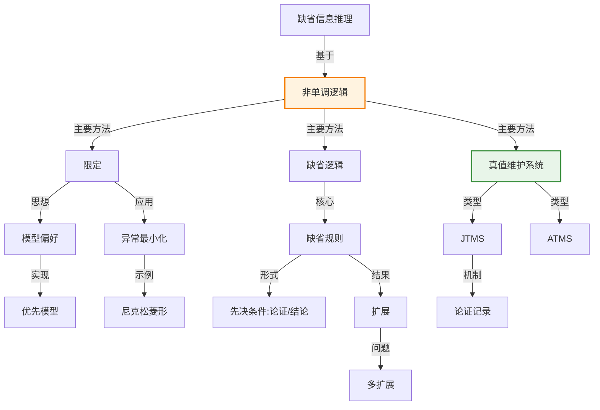

# 10.6 用缺省信息推理

> 📖 本节 Deep Dive | 预计学习时间: 55 分钟

---

## 1. 背景与动机

### 1.1 历史背景

**学科演进脉络**

缺省推理（Default Reasoning）的研究源于对常识推理的形式化需求。人类在日常生活中大量使用缺省规则——"鸟会飞"、"汽车有4个轮子"——这些规则在大多数情况下成立，但存在例外。

经典逻辑是单调的：添加新信息不会使已有结论失效。但常识推理显然是非单调的：新信息可能导致我们收回之前的结论。例如，看到"这是一只企鹅"后，我们收回"它会飞"的结论。

非单调逻辑的研究始于1980年，McCarthy的限定（Circumscription）、Reiter的缺省逻辑（Default Logic）和McDermott & Doyle的模态非单调逻辑在同一期AI Journal上发表，标志着这一领域的正式诞生。

**里程碑事件**:

| 年份 | 人物/事件 | 贡献 | 影响 |
|------|-----------|------|------|
| 1960s | 哲学研究 | 研究自然语言的非单调性 | 为非单调逻辑提供哲学基础 |
| 1978年 | Clark | 失败即否定（Negation as Failure） | 逻辑编程中的非单调推理 |
| 1980年 | McCarthy | 限定（Circumscription） | 首个主要的非单调逻辑 |
| 1980年 | Reiter | 缺省逻辑（Default Logic） | 形式化缺省规则 |
| 1980年 | McDermott & Doyle | 模态非单调逻辑 | 另一种非单调方法 |
| 1988年 | Gelfond & Lifschitz | 稳定模型语义 | 回答集编程的理论基础 |
| 1979年 | Doyle | 真值维护系统（TMS） | 实现非单调推理的计算机制 |

**演进动机**:
- **早期方法**: 经典逻辑和封闭世界假设
- **局限性**: 无法处理例外、无法表达"通常"、无法收回结论
- **突破**: 非单调逻辑提供了形式化的缺省推理框架

### 1.2 研究动机

**为什么研究者关注这个主题？**

1. **常识推理**: 人类大量使用缺省规则进行推理。形式化这些规则是构建具有常识的AI系统的关键。

2. **知识不完全性**: 智能体不可能知道所有事实。缺省推理允许在信息不完全时做出合理假设。

3. **效率考虑**: 显式陈述所有例外是不现实的。缺省推理通过"除非有相反证据"的方式压缩知识。

**与其他领域的关系**:
- **与概率论的关系**: 缺省推理可以看作"阈值概率"的定性版本
- **与机器学习的关系**: 机器学习从数据中学习缺省规则
- **与认知科学的关系**: 研究人类如何处理缺省信息和例外

### 1.3 实际应用场景

| 应用领域 | 具体问题 | 本节理论的作用 | 预期效果 |
|----------|----------|----------------|----------|
| 专家系统 | 诊断推理 | 处理典型症状和例外 | 提高诊断准确率 |
| 自然语言理解 | 词义消歧 | 处理典型含义和例外 | 提高理解准确率 |
| 规划系统 | 动作效果预测 | 处理典型效果和失败情况 | 提高规划鲁棒性 |
| 法律推理 | 规则应用 | 处理一般规则和特殊情况 | 支持法律分析 |
| 配置系统 | 缺省配置 | 提供缺省值和覆盖机制 | 简化配置过程 |

**典型案例预览**:
> 想象一个汽车诊断系统："如果发动机无法启动且电池有电，则可能是启动器故障"。这是一个缺省规则——在大多数情况下成立，但可能存在例外（如点火系统故障）。系统需要能够在新证据出现时收回或修正结论。

### 1.4 先决条件

**学习本节需要的前置知识**:

| 知识项 | 来源 | 掌握程度要求 | 关键概念 |
|--------|------|:------------:|----------|
| 一阶逻辑 | 第8章 | 必须熟练掌握 | 可满足性、模型 |
| 逻辑编程 | 第9章 | 理解即可 | 封闭世界假设 |
| 类别推理 | 10.5节 | 理解即可 | 继承、缺省值 |
| 模态逻辑 | 10.4节 | 了解 | 可能世界 |

**前置检查清单**:
- [ ] 理解逻辑单调性的概念
- [ ] 了解封闭世界假设
- [ ] 理解类别继承中的缺省值

---

## 2. 知识逻辑图谱

### 2.1 概念关系图



### 2.2 知识发展依赖链

```
【经典逻辑】           【封闭世界假设】        【非单调逻辑】         【实现系统】
    ↓                   ↓                     ↓                   ↓
┌─────────┐      ┌─────────────┐       ┌───────────┐      ┌──────────┐
│ 单调性  │      │ 否定即失败  │       │ 限定      │ ──→  │ TMS      │
│ 可满足性│ ──→  │ 数据库假设  │  ──→  │ 缺省逻辑  │      │ 回答集   │
│         │      │             │       │ 自认知逻辑│      │ 编程     │
└─────────┘      └─────────────┘       └───────────┘      └──────────┘
     │                   │                   │                │
     └───────────────────┴───────────────────┴────────────────┘
                         缺省推理演进脉络
```

**依赖链详解**:
1. **经典逻辑**: 提供了基础的推理框架，但具有单调性
2. **封闭世界假设**: 早期的非单调方法，但过于简单
3. **非单调逻辑**: 形式化的缺省推理理论
4. **实现系统**: TMS、回答集编程等实现非单调推理

### 2.3 本节在章节中的位置

```
第 10 章: 知识表示
├── 10.1-10.5 基础理论
│   └── [本体论、类别、事件、模态、推理系统]
│
├── 10.6 用缺省信息推理 ← ⭐ 当前位置
│   ├── [核心概念: 非单调性、缺省规则]
│   ├── [10.6.1: 限定与缺省逻辑]
│   └── [10.6.2: 真值维护系统]
│
└── 小结
    └── [本章总结]
```

**衔接说明**:
- **从前一节继承**: 10.5节的类别继承中的缺省值是本节的动机之一
- **本章收尾**: 本节讨论了知识表示中的核心难题——例外和不确定性

---

## 3. 核心概念与数学分析

### 3.1 核心术语定义

**定义 10.6.1** (单调性 / Monotonicity):

> **正式定义**: 一个推理系统是单调的，如果对于任意知识库$KB$和公式$\alpha$、$\beta$，如果$KB \models \alpha$，则$KB \wedge \beta \models \alpha$。

**定义详解**:
- **直观解释**: 添加新信息不会使已有结论失效
- **经典逻辑**: 一阶逻辑是单调的
- **非单调性**: 常识推理是非单调的——新信息可能导致收回结论

**定义 10.6.2** (非单调逻辑 / Nonmonotonic Logic):

> **正式定义**: 非单调逻辑是一种形式系统，其中添加新信息可能导致先前可证明的公式不再可证明。

**定义详解**:
- **直观解释**: 允许"在缺乏相反证据时假设..."，并在新证据出现时收回假设
- **数学表述**: $KB \models_{nonmono} \alpha$不保证$KB \wedge \beta \models_{nonmono} \alpha$

**定义 10.6.3** (限定 / Circumscription):

> **正式定义**: 限定是一种模型偏好逻辑，通过最小化某些谓词的扩展来实现非单调推理。

**定义详解**:
- **直观解释**: "除非已知为真，否则假设为假"——最小化异常
- **数学表述**: 如果模型$M_1$的异常对象比$M_2$少，则$M_1$比$M_2$更受偏好
- **为什么这样定义**: 这是封闭世界假设的精确化和推广

**定义 10.6.4** (缺省规则 / Default Rule):

> **正式定义**: 缺省规则是一种推理规则，形式为$P: J_1, ..., J_n / C$，表示"如果$P$为真，且$J_1, ..., J_n$与知识库一致，则得出$C$"。

**定义详解**:
- **直观解释**: "鸟会飞，除非有相反证据"
- **组成部分**:
  - $P$: 先决条件（Prerequisite）
  - $J_i$: 论证（Justification）
  - $C$: 结论（Consequent）
- **为什么这样定义**: 形式化"典型情况"和"除非有例外"

**定义 10.6.5** (扩展 / Extension):

> **正式定义**: 缺省理论的扩展是包含原始事实和缺省结论的最大一致集合。

**定义详解**:
- **直观解释**: 扩展是一种"信念集"，包含所有可以合理得出的结论
- **多扩展问题**: 一个缺省理论可能有多个扩展（如尼克松菱形）

### 3.2 符号系统与约定

**本节符号总表**:

| 符号 | 含义 | 数学表达 | 备注 |
|:----:|------|----------|------|
| $P: J/C$ | 缺省规则 | $P$先决条件，$J$论证，$C$结论 | 缺省逻辑 |
| $Ab(x)$ | 异常谓词 | $x$是异常的 | 限定 |
| $Circ(T; P)$ | 限定 | 理论$T$关于$P$的限定 | 最小化$P$ |
| $Th(S)$ | 理论闭包 | $S$的逻辑闭包 | 扩展定义 |
| $\Gamma(S)$ | 缺省算子 | 从$S$可得的结论 | 扩展计算 |
| $E$ | 扩展 | 缺省理论的结果 | 最大不动点 |
| $in$/$out$ | TMS标记 | 语句在/不在知识库中 | JTMS |
| $label(s)$ | 标签 | ATMS中语句的假设集 | ATMS |

### 3.3 关键公式与性质

#### 公式 1: 缺省规则的形式

**数学表述**:
$$P: J_1, ..., J_n / C$$

**公式要素解析**:

| 维度 | 内容 |
|------|------|
| **直观解释** | 如果$P$为真，且$J_1, ..., J_n$与知识库一致，则得出$C$ |
| **使用条件** | 先决条件为真，论证未被反驳 |
| **领域背景** | 这是缺省逻辑的基本推理单元 |

**特例**: $Bird(x): Flies(x) / Flies(x)$

表示"如果$x$是鸟，且$Flies(x)$与知识库一致，则得出$Flies(x)$"。

#### 公式 2: 限定的形式化

**数学表述**:
$$Circ(T; Ab) \models \forall x: \neg Ab(x)$$

除非$T \models Ab(c)$对某些常量$c$。

**公式要素解析**:
- $T$是原始理论
- $Ab$是异常谓词
- 限定最小化$Ab$的扩展

#### 公式 3: 扩展的定义

**数学表述**:
$$E = Th(W \cup \{C | P: J_1, ..., J_n / C \in D, P \in E, \neg J_1 \notin E, ..., \neg J_n \notin E\})$$

**公式要素解析**:
- $W$是事实集合
- $D$是缺省规则集合
- $E$是包含$W$和可应用缺省结论的最大集合

#### 公式 4: 尼克松菱形

**数学表述**:
$$Republican(Nixon) \wedge Quaker(Nixon)$$

$$Republican(x): \neg Pacifist(x) / \neg Pacifist(x)$$

$$Quaker(x): Pacifist(x) / Pacifist(x)$$

**公式要素解析**:
- 尼克松既是共和党人（缺省非和平主义者），又是贵格会教徒（缺省和平主义者）
- 导致两个扩展：一个中尼克松是和平主义者，另一个中不是

### 3.4 真值维护系统

**JTMS（基于论证的TMS）**:
- 每条语句都有一个论证集合
- 论证是支持该语句的语句集合
- 当语句失去所有论证时，被标记为$out$

**ATMS（基于假设的TMS）**:
- 每条语句有一个标签（假设集合）
- 语句在标签中所有假设为真时为真
- 支持在假设世界间高效切换

---

## 4. 定理与证明

### 4.1 非单调性定理

**定理 10.6.1** (缺省逻辑的非单调性):

> **正式陈述**: 存在缺省理论$(W, D)$和公式$\alpha$，使得$\alpha$在某个扩展中，但在添加新事实后的扩展中不再成立。

**定理解读**:
- **构造**: 考虑$W = \{Bird(Tweety)\}$，$D = \{Bird(x): Flies(x) / Flies(x)\}$
- **初始扩展**: 包含$Flies(Tweety)$
- **添加**: $W' = W \cup \{\neg Flies(Tweety)\}$
- **新扩展**: 不包含$Flies(Tweety)$

- **定理意义**: 证明了缺省逻辑的非单调性

### 4.2 证明详解

**证明策略概览**:

通过具体例子展示非单调性。

**核心思路**: 构造一个缺省理论，展示添加新事实如何改变扩展。

---

**正式证明**:

**步骤 1**: 构造初始理论

设：
- $W = \{Bird(Tweety)\}$
- $D = \{Bird(x): Flies(x) / Flies(x)\}$

**步骤 2**: 计算初始扩展

缺省规则$Bird(x): Flies(x) / Flies(x)$可应用，因为：
- $Bird(Tweety) \in W$（先决条件满足）
- $\neg Flies(Tweety) \notin W$（论证一致）

因此，$Flies(Tweety)$在扩展中。

**步骤 3**: 添加新事实

设$W' = W \cup \{\neg Flies(Tweety)\}$。

**步骤 4**: 计算新扩展

现在缺省规则不可应用，因为：
- $\neg Flies(Tweety) \in W'$（论证不一致）

因此，$Flies(Tweety)$不在新扩展中。

**步骤 5**: 得出结论

$Flies(Tweety)$从扩展中被移除，证明了非单调性。

$$\blacksquare \text{ (证毕)}$$

### 4.3 扩展存在性定理

**定理 10.6.2** (扩展的存在性):

> **正式陈述**: 每个缺省理论至少有一个扩展。

**定理意义**: 保证了缺省逻辑的一致性——总有某种方式解释缺省规则。

### 4.4 证明分析与提炼

**核心洞见**: 非单调性的本质是"假设的收回"。缺省推理允许在信息不完全时做出假设，并在新信息出现时收回这些假设。

**证明技巧总结**:

| 技巧 | 在本证明中的应用 | 可迁移性 | 其他应用场景 |
|------|------------------|----------|--------------|
| 构造性证明 | 构造具体例子 | ⭐⭐⭐⭐⭐ | 存在性、非存在性证明 |
| 不动点计算 | 扩展作为不动点 | ⭐⭐⭐⭐ | 递归定义、迭代算法 |
| 一致性检查 | 验证论证与知识库一致 | ⭐⭐⭐⭐⭐ | 约束满足、定理证明 |

---

## 5. 具体示例与详解

### 5.1 典型示例：鸟会飞

**示例 10.6.1**: 缺省推理的经典例子

**📋 问题陈述**:

表示以下知识：
- 鸟通常会飞
- Tweety是鸟
- 企鹅是鸟，但不会飞
- Joe是企鹅

**🔍 解答过程**:

**步骤 1: 定义缺省规则**

$$Bird(x): Flies(x) / Flies(x)$$

**步骤 2: 定义事实**

$$Bird(Tweety)$$
$$Bird(Joe) \wedge Penguin(Joe)$$
$$\forall x: Penguin(x) \Rightarrow \neg Flies(x)$$

**步骤 3: 推理Tweety**

- $Bird(Tweety)$为真
- $\neg Flies(Tweety)$不在知识库中
- 缺省规则可应用
- 结论：$Flies(Tweety)$

**步骤 4: 推理Joe**

- $Bird(Joe)$为真
- 但$\neg Flies(Joe)$在知识库中（由$Penguin(Joe)$）
- 缺省规则不可应用
- 结论：$\neg Flies(Joe)$

---

**✅ 验证与检验**:

**正确性检查**:
- [x] Tweety会飞（缺省结论）
- [x] Joe不会飞（例外处理）
- [x] 符合常识

### 5.2 尼克松菱形示例

**示例 10.6.2**: 冲突缺省规则

**场景**: Richard Nixon既是共和党人（缺省非和平主义者），又是贵格会教徒（缺省和平主义者）。

**缺省理论**:
$$W = \{Republican(Nixon), Quaker(Nixon)\}$$

$$D = \{Republican(x): \neg Pacifist(x) / \neg Pacifist(x),$$
$$Quaker(x): Pacifist(x) / Pacifist(x)\}$$

**扩展分析**:

**扩展1**:
- 应用第一条规则：$\neg Pacifist(Nixon)$
- 第二条规则不可应用（论证$Pacifist(Nixon)$与扩展不一致）

**扩展2**:
- 应用第二条规则：$Pacifist(Nixon)$
- 第一条规则不可应用（论证$\neg Pacifist(Nixon)$与扩展不一致）

**结果**: 两个扩展，系统对Nixon是否是和平主义者不可知。

### 5.3 真值维护系统示例

**示例 10.6.3**: JTMS的论证管理

**场景**: 知识库包含：
- $P$
- $P \Rightarrow Q$
- $R \Rightarrow Q$

**论证**:
- $Q$的论证1：$\{P, P \Rightarrow Q\}$
- $Q$的论证2：$\{R, R \Rightarrow Q\}$

**操作**: 收回$P$

**结果**: $Q$仍保留（通过论证2）

**操作**: 收回$R$

**结果**: $Q$被标记为$out$

### 5.4 类比与可视化

**直觉类比**:

| 抽象概念 | 日常类比 | 对应关系 |
|----------|----------|----------|
| 缺省规则 | "通常..." | 典型情况的陈述 |
| 论证 | 支持理由 | 结论的依据 |
| 扩展 | 信念集 | 一致的结论集合 |
| 非单调性 | 改变主意 | 新信息导致收回结论 |
| TMS | 记账本 | 记录结论的依据 |

**可视化**:

```
缺省推理过程

初始知识库: {Bird(Tweety)}
                |
                v
        缺省规则可应用
        Bird(x):Flies(x)/Flies(x)
                |
                v
        添加结论: Flies(Tweety)
                |
                v
    新信息: Penguin(Tweety)
                |
                v
    收回结论: Flies(Tweety)
    添加结论: ¬Flies(Tweety)

尼克松菱形的两个扩展

扩展1:              扩展2:
Republican(Nixon)   Republican(Nixon)
Quaker(Nixon)       Quaker(Nixon)
¬Pacifist(Nixon)    Pacifist(Nixon)
    |                   |
    v                   v
第一条规则应用      第二条规则应用
第二条规则阻塞      第一条规则阻塞
```

---

## 6. 深入理解与拓展

### 6.1 一句话本质

> 🎯 **核心要点**: 缺省推理通过形式化的"除非有相反证据"机制，实现了常识推理的非单调性，使智能体能够在信息不完全时做出合理假设并在新信息出现时修正结论。

### 6.2 深入思考问题

1. **概念层面**: 非单调性是人类推理的本质特征还是计算限制的结果？
   
   <!-- 思考方向: 考虑认知科学、资源限制、演化优势 -->

2. **方法层面**: 限定、缺省逻辑、自认知逻辑各有什么优缺点？
   
   <!-- 思考方向: 考虑表达能力、计算复杂性、直观性 -->

3. **应用层面**: 如何在实际系统中处理多扩展问题？
   
   <!-- 思考方向: 考虑偏好、概率、决策 -->

4. **拓展层面**: 缺省推理如何与概率推理结合？
   
   <!-- 思考方向: 考虑概率缺省逻辑、贝叶斯网络 -->

### 6.3 与其他节的关系

**本节输出**:
- 定义了非单调推理的形式框架
- 介绍了限定、缺省逻辑和TMS
- 讨论了缺省推理的计算实现

**本章总结**:
- 本章从本体论工程开始，经过类别、事件、模态逻辑，到类别推理系统，最后以缺省推理结束
- 缺省推理是知识表示中的核心难题，涉及例外、不确定性和信念修正

---

## 7. 总结与反思

### 7.1 关键要点总结

本节必须掌握的 **6** 个核心要点:

1. **非单调性**: 添加新信息可能导致收回已有结论
   
   💡 *记忆技巧*: "改变主意"——新信息让我们改变想法

2. **限定（Circumscription）**: 最小化异常谓词，实现"尽可能假"
   
   💡 *记忆技巧*: 限定=最小化异常

3. **缺省规则**: $P: J/C$形式，表示"如果$P$且$J$一致，则$C$"
   
   💡 *记忆技巧*: 先决条件:论证/结论

4. **扩展**: 缺省理论的结果，包含事实和可应用的缺省结论
   
   💡 *记忆技巧*: 扩展=最大一致的信念集

5. **多扩展问题**: 冲突缺省规则可能导致多个扩展（如尼克松菱形）
   
   💡 *记忆技巧*: 冲突导致不确定性

6. **真值维护系统**: JTMS记录论证，ATMS管理假设，支持信念修正
   
   💡 *记忆技巧*: TMS=记账本，记录为什么相信

### 7.2 本节知识框架

```
┌─────────────────────────────────────────────────────────────┐
│  第10.6节: 用缺省信息推理                                   │
├─────────────────────────────────────────────────────────────┤
│  输入/前置                                                   │
│  • 一阶逻辑基础                                             │
│  • 封闭世界假设                                             │
│  • 类别继承中的缺省值                                       │
│                                                             │
│  处理/核心                                                   │
│  • 非单调推理定义                                           │
│  • 限定方法                                                 │
│  • 缺省逻辑                                                 │
│  • 真值维护系统                                             │
│  ↓                                                          │
│  输出/结果                                                   │
│  • 常识推理形式化                                           │
│  • 信念修正机制                                             │
│                                                             │
│  应用/价值                                                   │
│  • 专家系统                                                 │
│  • 诊断推理                                                 │
│  • 规划系统                                                 │
└─────────────────────────────────────────────────────────────┘
```

### 7.3 常见误解与纠正

| 常见误解 ❌ | 正确理解 ✅ | 为什么容易错 | 如何避免 |
|-------------|-------------|--------------|----------|
| ❌ 非单调逻辑是不一致的 | ✅ 非单调逻辑是一致的，只是允许收回结论 | 混淆"收回"和"矛盾" | 理解非单调性的定义 |
| ❌ 缺省规则就是概率规则 | ✅ 缺省规则是定性的，概率规则是定量的 | 两者都处理不确定性 | 明确区分定性和定量 |
| ❌ 限定就是封闭世界假设 | ✅ 限定是封闭世界假设的精确化和推广 | 两者思想相似 | 了解限定的形式化 |
| ❌ 所有缺省理论都有唯一扩展 | ✅ 可能有多个扩展或没有扩展 | 忽略冲突情况 | 了解多扩展问题 |
| ❌ TMS是独立的推理系统 | ✅ TMS是推理系统的维护机制 | TMS常与推理结合使用 | 了解TMS的作用 |

### 7.4 反思问题

**连接性问题**:
1. 缺省推理如何与10.5节的描述逻辑结合？
2. 非单调性对10.4节的知识推理有什么影响？

**应用性问题**:
1. 在实际系统中，如何选择非单调逻辑方法？
2. 如何处理缺省推理中的优先级问题？

**批判性问题**:
1. 非单调逻辑的局限性是什么？
2. 概率方法能否完全替代缺省推理？

### 7.5 学习检查清单

- [ ] 能够解释单调性和非单调性的区别
- [ ] 能够定义缺省规则并解释其组成部分
- [ ] 能够计算简单缺省理论的扩展
- [ ] 理解限定的基本思想
- [ ] 了解尼克松菱形及其含义
- [ ] 了解JTMS和ATMS的基本原理
- [ ] 了解非单调逻辑与概率推理的关系

---

## 附录

### A. 公式速查表

| 公式 | 名称 | 使用条件 | 备注 |
|:----:|------|----------|------|
| $P: J/C$ | 缺省规则 | 缺省逻辑 | 先决条件:论证/结论 |
| $Circ(T; P)$ | 限定 | 最小化谓词$P$ | 模型偏好 |
| $Th(S)$ | 理论闭包 | $S$的逻辑结论 | 扩展定义 |
| $E = \Gamma(E)$ | 扩展 | 缺省算子的不动点 | 最大不动点 |

### B. 术语索引

| 术语 | 英文 | 定义 | 位置 |
|------|------|------|:----:|
| 单调性 | Monotonicity | 添加信息不收回结论 | 10.6 |
| 非单调逻辑 | Nonmonotonic Logic | 添加信息可能收回结论 | 10.6 |
| 限定 | Circumscription | 最小化谓词的模型偏好逻辑 | 10.6.1 |
| 缺省逻辑 | Default Logic | 基于缺省规则的推理 | 10.6.1 |
| 缺省规则 | Default Rule | $P:J/C$形式的推理规则 | 10.6.1 |
| 扩展 | Extension | 缺省理论的结果 | 10.6.1 |
| 真值维护系统 | Truth Maintenance System | 支持信念修正的系统 | 10.6.2 |
| JTMS | Justification-based TMS | 基于论证的TMS | 10.6.2 |
| ATMS | Assumption-based TMS | 基于假设的TMS | 10.6.2 |

### C. 延伸阅读

**理论深化**:
- McCarthy, J. (1980). "Circumscription - A Form of Non-Monotonic Reasoning". 限定的经典论文。
- Reiter, R. (1980). "A Logic for Default Reasoning". 缺省逻辑的经典论文。

**应用拓展**:
- Gelfond, M. and Lifschitz, V. (1988). "The Stable Model Semantics for Logic Programming". 回答集编程的基础。
- Brewka, G. et al. (1997). "Nonmonotonic Reasoning: An Overview". 非单调逻辑综述。

**补充材料**:
- Doyle, J. (1979). "A Truth Maintenance System". TMS的经典论文。

---

> 📌 **返回**: [第10章概览](00_概览.md)
