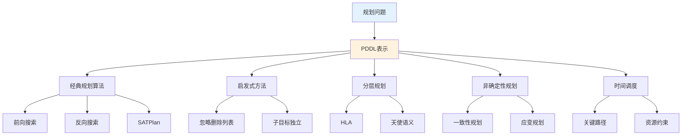

# 第11章 自动规划 - 概览与总结

> 📚 本章 Deep Dive 概览 | 预计总学习时间: 6-8 小时

---

## 1. 学习目标

### 1.1 知识目标

完成本章学习后，你将能够：

- [ ] **理解**经典规划问题的PDDL表示方法
- [ ] **掌握**前向搜索、反向搜索和SATPlan等规划算法
- [ ] **应用**领域无关启发式方法求解规划问题
- [ ] **理解**分层规划中的高层动作和天使语义
- [ ] **分析**非确定性环境下的规划策略（一致性规划、应变规划、在线规划）
- [ ] **应用**关键路径方法解决时间约束调度问题
- [ ] **比较**各种规划方法的适用场景和复杂性

### 1.2 技能目标

- 能够编写PDDL问题描述
- 能够计算状态转移和动作回归
- 能够推导和应用启发式函数
- 能够分析规划问题的复杂性
- 能够选择合适的规划方法解决实际问题

### 1.3 态度目标

- 理解规划问题从理论到实践的演进
- 欣赏因子化表示和领域无关启发式的优雅
- 认识不确定性在真实世界规划中的重要性

---

## 2. 本章速览

### 2.1 章节结构

```
第11章 自动规划
│
├── 11.1 经典规划的定义
│   ├── PDDL语言
│   ├── 状态表示（基本原子流的合取）
│   ├── 动作模式（前提+效果）
│   └── 三个范例领域（货物运输、备用轮胎、积木世界）
│
├── 11.2 经典规划的算法
│   ├── 前向状态空间搜索
│   ├── 反向状态空间搜索（回归）
│   ├── SATPlan（编码为SAT问题）
│   └── 其他方法（Graphplan、偏序规划等）
│
├── 11.3 规划的启发式方法
│   ├── 松弛问题
│   ├── 忽略前提启发式
│   ├── 忽略删除列表启发式
│   ├── 子目标独立假设
│   └── 对称约简等剪枝技术
│
├── 11.4 分层规划
│   ├── 高层动作（HLA）
│   ├── 细化和实现
│   ├── 天使语义和可达集
│   └── Angelic-Search算法
│
├── 11.5 非确定性域的规划和行动
│   ├── 信念状态表示
│   ├── 一致性规划（无传感器）
│   ├── 应变规划（条件分支）
│   └── 在线规划（执行监视和重规划）
│
├── 11.6 时间、调度和资源
│   ├── 作业车间调度问题
│   ├── 关键路径方法（CPM）
│   ├── 资源约束调度
│   └── 先规划后调度方法
│
└── 11.7 规划方法分析
    ├── 复杂性分析（PSPACE完全性）
    ├── 方法比较
    └── 组合规划系统
```

### 2.2 核心概念图谱



---

## 3. 难度预警

### 3.1 难度等级评估

| 小节 | 理论难度 | 实践难度 | 前置知识要求 |
|:----:|:--------:|:--------:|:------------:|
| 11.1 | ⭐⭐ | ⭐⭐ | PDDL基础 |
| 11.2 | ⭐⭐⭐ | ⭐⭐⭐ | 搜索算法 |
| 11.3 | ⭐⭐⭐ | ⭐⭐⭐ | 启发式搜索 |
| 11.4 | ⭐⭐⭐⭐ | ⭐⭐⭐⭐ | 递归、集合论 |
| 11.5 | ⭐⭐⭐⭐ | ⭐⭐⭐⭐ | 信念状态 |
| 11.6 | ⭐⭐⭐ | ⭐⭐⭐ | 约束满足 |
| 11.7 | ⭐⭐⭐ | ⭐⭐ | 复杂性理论 |

### 3.2 常见困难点

1. **动作回归的理解**: 反向搜索中的回归计算容易混淆
   - *建议*: 多做具体例子，理解"去效果，加前提"

2. **天使语义的直觉**: 天使选择与恶魔选择的区别
   - *建议*: 对比Go(Home, SFO)的例子

3. **信念状态更新**: 条件效果导致非1-CNF
   - *建议*: 理解保守近似和懒惰方法

4. **资源约束的复杂性**: 从P到NP困难的转变
   - *建议*: 理解析取约束的影响

---

## 4. 前置知识

### 4.1 必需前置知识

| 知识领域 | 具体内容 | 重要性 |
|----------|----------|:------:|
| 搜索算法 | A*搜索、启发式函数 | ⭐⭐⭐⭐⭐ |
| 命题逻辑 | 可满足性、CNF | ⭐⭐⭐⭐ |
| 一阶逻辑 | 谓词、合一 | ⭐⭐⭐⭐ |
| 状态空间 | 状态、动作、转移 | ⭐⭐⭐⭐⭐ |

### 4.2 有帮助的前置知识

| 知识领域 | 具体内容 | 帮助程度 |
|----------|----------|:--------:|
| 约束满足 | CSP求解 | 高 |
| 复杂性理论 | P、NP、PSPACE | 中 |
| 动态规划 | 最优子结构 | 中 |
| 集合论 | 基本运算 | 高 |

---

## 5. 节依赖图

```
11.1 经典规划的定义
    ↓
11.2 经典规划的算法 ←──→ 11.3 规划的启发式方法
    ↓                      ↓
11.4 分层规划 ←──────────┘
    ↓
11.5 非确定性域的规划和行动
    ↓
11.6 时间、调度和资源
    ↓
11.7 规划方法分析
```

**学习路径建议**:
- **标准路径**: 按顺序学习11.1 → 11.2 → 11.3 → 11.4 → 11.5 → 11.6 → 11.7
- **快速路径**: 11.1 → 11.2 → 11.3 → 11.7（了解概貌）
- **深度路径**: 全部深入学习，特别关注11.4和11.5

---

## 6. 定理清单

### 6.1 核心定理

| 定理 | 内容 | 重要性 | 位置 |
|------|------|:------:|:----:|
| 定理11.1 | PDDL表示的完备性 | ⭐⭐⭐ | 11.1 |
| 定理11.2 | SATPlan的完备性 | ⭐⭐⭐ | 11.2 |
| 定理11.3 | 忽略删除列表启发式的可容许性 | ⭐⭐⭐⭐ | 11.3 |
| 定理11.4 | 分层搜索的复杂度降低 | ⭐⭐⭐⭐ | 11.4 |
| 定理11.5 | 一致性规划的完备性 | ⭐⭐⭐ | 11.5 |
| 定理11.6 | 关键路径方法的正确性 | ⭐⭐⭐⭐ | 11.6 |
| 定理11.7 | 经典规划的PSPACE完全性 | ⭐⭐⭐⭐ | 11.7 |

### 6.2 定理依赖图

```
定理11.1 (PDDL完备性)
    ↓
定理11.2 (SATPlan完备性)
    ↓
定理11.3 (启发式可容许性) ←── 松弛问题理论
    ↓
定理11.4 (分层复杂度降低)
    ↓
定理11.5 (一致性规划完备性)
    
定理11.6 (CPM正确性) ←── 动态规划理论
    
定理11.7 (PSPACE完全性) ←── 复杂性理论
```

---

## 7. 核心逻辑线索

### 7.1 从经典到扩展的演进

```
【经典规划】                    【扩展规划】
离散、确定、静态、完全可观测 → 连续、随机、动态、部分可观测
    ↓                              ↓
PDDL表示                    信念状态、条件效果
    ↓                              ↓
前向/反向/SAT搜索            一致性/应变/在线规划
    ↓                              ↓
启发式方法                  分层、时间、资源
```

### 7.2 表示与算法的互动

```
表示能力增强 ←────────────────────→ 算法复杂度增加

原子表示 ──→ 因子化(PDDL) ──→ 信念状态 ──→ 时间/资源
    │            │              │            │
    ↓            ↓              ↓            ↓
简单搜索    启发式搜索    不确定性规划    调度算法
```

---

## 8. 核心要点速查

### 8.1 每节一句话总结

| 小节 | 核心要点 |
|------|----------|
| 11.1 | PDDL使用因子化表示，通过动作模式简洁描述状态转移 |
| 11.2 | 规划算法包括前向搜索、反向搜索和SAT编码三种范式 |
| 11.3 | 松弛问题启发式（忽略删除列表）使大规模问题可解 |
| 11.4 | 分层规划通过HLA和天使语义处理复杂问题 |
| 11.5 | 非确定性规划使用信念状态和条件分支处理不确定性 |
| 11.6 | 关键路径方法和资源调度解决时间约束问题 |
| 11.7 | 规划问题是PSPACE完全的，组合系统实现智能算法选择 |

### 8.2 关键公式速查

| 公式 | 名称 | 位置 |
|------|------|:----:|
| $Result(s, a) = (s - Del(a)) \cup Add(a)$ | 状态转移 | 11.1 |
| $Pos(g') = (Pos(g) - Add(a)) \cup Pos(Precond(a))$ | 动作回归 | 11.2 |
| $F^{t+1} \Leftrightarrow ActionCausesF^t \lor (F^t \land \neg ActionCausesNotF^t)$ | 后继状态公理 | 11.2 |
| $REACH(s, [h_1, h_2]) = \bigcup_{s' \in REACH(s, h_1)} REACH(s', h_2)$ | 序列可达集 | 11.4 |
| $b' = (b - Del(a)) \cup Add(a)$ | 信念状态更新 | 11.5 |
| $ES(B) = \max_{A \prec B} ES(A) + Duration(A)$ | 最早开始时间 | 11.6 |

---

## 9. 概念对比表

### 9.1 规划方法对比

| 方法 | 搜索方向 | 状态表示 | 启发式 | 适用场景 |
|------|----------|----------|--------|----------|
| 前向搜索 | 初始→目标 | 基本状态 | 容易设计 | 有良好启发式 |
| 反向搜索 | 目标→初始 | 含变量 | 难以设计 | 目标明确 |
| SATPlan | - | 命题化 | SAT求解器 | NP困难领域 |
| HTN | 分层 | HLA | 分层启发式 | 大规模问题 |

### 9.2 启发式方法对比

| 启发式 | 松弛方式 | 可容许性 | 计算复杂度 | 质量 |
|--------|----------|----------|------------|------|
| 忽略前提 | 移除前提 | 是 | 低 | 较松 |
| 忽略删除列表 | 移除负效果 | 是 | 中 | 较紧 |
| 子目标独立 | 分解目标 | 可能否 | 中 | 中等 |

### 9.3 规划类型对比

| 类型 | 观测 | 确定性 | 策略 | 适用场景 |
|------|------|--------|------|----------|
| 经典规划 | 完全 | 是 | 开环 | 理想环境 |
| 一致性规划 | 无 | 是 | 开环 | 无传感器 |
| 应变规划 | 部分 | 否 | 条件 | 部分可观测 |
| 在线规划 | 部分 | 否 | 重规划 | 动态环境 |

---

## 10. 常见误解澄清

| 误解 | 澄清 |
|------|------|
| PDDL可以表示任何规划问题 | PDDL只能表示经典规划问题（有限、确定性等） |
| 反向搜索总是优于前向搜索 | 取决于启发式可用性和问题特性 |
| 分层规划总是优于非分层 | 取决于HLA库的质量 |
| PSPACE完全意味着不可解 | 实际问题往往有结构，可以有效求解 |
| 有一种 universally 最好的算法 | 不同问题适合不同算法，组合系统更优 |

---

## 11. 本章测验

### 11.1 选择题

1. PDDL中的封闭世界假设意味着：
   - A. 所有流必须为真或假
   - B. 未提及的流为假 ✓
   - C. 状态必须完整描述
   - D. 动作必须有确定效果

2. 忽略删除列表启发式的核心思想是：
   - A. 忽略动作前提
   - B. 移除负效果，使搜索单调前进 ✓
   - C. 只考虑添加效果
   - D. 忽略状态约束

3. 天使语义与恶魔语义的根本区别是：
   - A. 动作效果的不同
   - B. 选择权的归属（智能体vs对手）✓
   - C. 可达集的计算方式
   - D. 细化的数量

### 11.2 计算题

1. 给定状态$s = \{At(A, Table), On(B, A), Clear(B)\}$和动作$Move(B, A, Table)$，其效果为$\{On(B, Table), Clear(A), \neg On(B, A), \neg Clear(B)\}$，计算$Result(s, a)$。

2. 对于目标$g = At(C, JFK)$和动作$Unload(C, p, JFK)$，计算回归后的目标$g'$。

### 11.3 简答题

1. 解释为什么分层搜索可以降低复杂度。

2. 比较一致性规划和应变规划的优缺点。

3. 说明关键路径方法如何计算最早和最晚开始时间。

---

## 12. 快速复习卡

### 12.1 术语卡

| 术语 | 定义 | 例子 |
|------|------|------|
| PDDL | 规划领域定义语言 | 描述航空货物运输问题 |
| HLA | 高层动作 | Go(Home, SFO) |
| 可达集 | HLA可到达的状态集合 | REACH(s, h) |
| 信念状态 | 可能世界集合 | b = At(x, C(x)) |
| 关键路径 | 总持续时间最长的路径 | 决定makespan |

### 12.2 公式卡

```
状态转移: Result(s, a) = (s - Del(a)) ∪ Add(a)

动作回归: Pos(g') = (Pos(g) - Add(a)) ∪ Pos(Precond(a))

HLA可达集: REACH(s, [h1, h2]) = ∪ REACH(s', h2) for s' ∈ REACH(s, h1)

ES计算: ES(B) = max_{A ≺ B} ES(A) + Duration(A)

LS计算: LS(A) = min_{B ≻ A} LS(B) - Duration(A)
```

---

## 13. 扩展阅读

### 13.1 理论深化

- Ghallab, M., Nau, D., & Traverso, P. (2016). *Automated Planning and Acting*. Cambridge University Press.
- LaValle, S. M. (2006). *Planning Algorithms*. Cambridge University Press.

### 13.2 应用拓展

- 国际规划竞赛(IPC): https://ipc.icaps-conference.org/
- FastDownward规划器: http://www.fast-downward.org/

### 13.3 相关章节

- 第3章：搜索算法基础
- 第4章：不确定性搜索
- 第6章：约束满足问题
- 第7章：命题逻辑
- 第17章：随机规划（MDP/POMDP）

---

## 14. 学习建议

### 14.1 时间分配建议

| 活动 | 建议时间 | 优先级 |
|------|----------|:------:|
| 阅读教材 | 3-4小时 | 高 |
| 完成Deep Dive小节 | 6-8小时 | 高 |
| 做练习题 | 2-3小时 | 中 |
| 实现简单规划器 | 4-6小时 | 中 |
| 复习总结 | 1-2小时 | 高 |

### 14.2 学习策略

1. **先理解概念，再深入细节**: PDDL表示是基础，务必掌握
2. **多做例子**: 状态转移、动作回归等通过例子更容易理解
3. **对比学习**: 比较不同方法的优缺点
4. **实践结合**: 尝试用规划器解决实际问题

---

> 📌 **开始学习**: [11.1 经典规划的定义](11.1_经典规划的定义.md)
