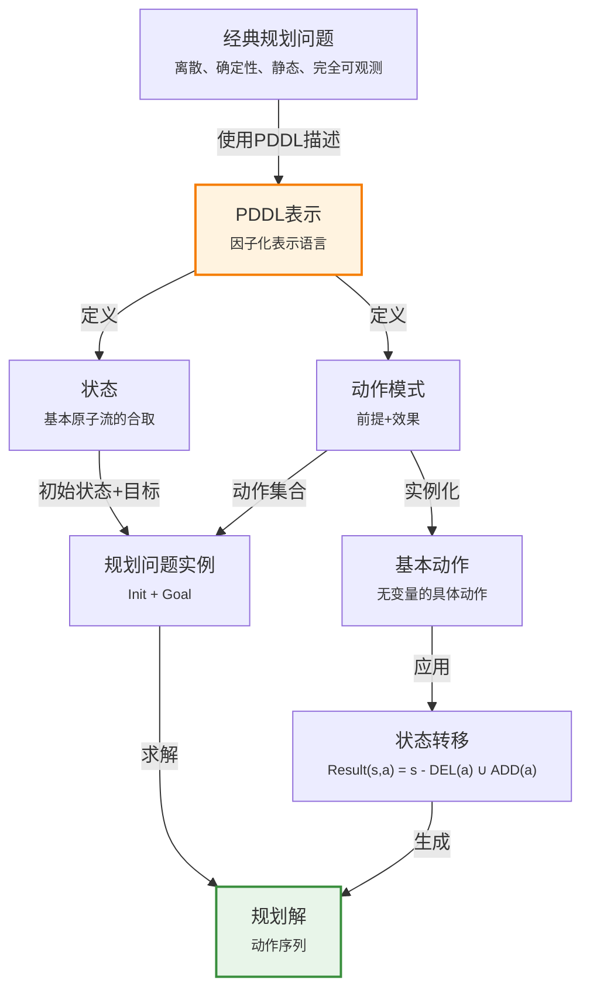

# 11.1 经典规划的定义

> 📖 本节 Deep Dive | 预计学习时间: 60 分钟

---

## 1. 背景与动机

### 1.1 历史背景

**学科演进脉络**

经典规划（Classical Planning）作为人工智能的核心分支之一，其发展历程可以追溯到20世纪60年代。早期的问题求解系统如GPS（通用问题求解器，General Problem Solver）由Newell和Simon于1961年提出，首次将目标-手段分析引入状态空间搜索。随后，Fikes和Nilsson于1971年开发了STRIPS规划系统，为Shakey机器人提供规划能力，这成为经典规划领域的奠基之作。

STRIPS的表示语言后来演变为ADL（动作描述语言，Action Description Language），最终发展为PDDL（规划领域定义语言，Planning Domain Definition Language）。PDDL自1998年起被国际规划竞赛采用，成为规划领域的标准描述语言。

**里程碑事件**:

| 年份 | 人物/事件 | 贡献 | 影响 |
|------|-----------|------|------|
| 1961 | Newell & Simon | 提出GPS通用问题求解器 | 确立了目标-手段分析范式 |
| 1971 | Fikes & Nilsson | 开发STRIPS规划系统 | 第一个实用的机器人规划器 |
| 1986 | Pednault | 提出ADL动作描述语言 | 扩展了STRIPS的表达能力 |
| 1998 | Ghallab等 | 发布PDDL语言 | 成为国际规划竞赛标准 |

**演进动机**:
- 早期方法: 第3章的问题求解智能体和第7章的混合命题逻辑智能体需要为每个新领域设计特定的启发式函数
- 局限性: 需要显式表示指数量级的状态空间，例如在wumpus世界中，移动公理需要在所有4个朝向、T个时间步和n²个位置重复
- 突破: PDDL采用因子化表示，利用单个动作模式可表示$4Tn^2$个动作，无需特定领域知识

### 1.2 研究动机

**为什么研究者关注经典规划？**

1. **理论意义**: 经典规划为AI提供了一个形式化框架，将问题求解与逻辑推理统一起来，是理解智能体决策过程的基础
2. **方法创新**: 因子化表示使得领域无关的启发式方法成为可能，这是原子表示无法实现的
3. **问题解决**: 能够处理具有数百万状态和数千动作的实际工业应用

**与其他领域的关系**:
- 与搜索算法：规划问题本质上是在状态空间中寻找路径
- 与逻辑推理：规划可以被看作构造性地证明解的存在性
- 与约束满足：规划问题可编码为CSP或SAT问题

### 1.3 实际应用场景

| 应用领域 | 具体问题 | 本节理论的作用 | 预期效果 |
|----------|----------|----------------|----------|
| 物流规划 | 货物运输路径优化 | 使用PDDL描述装载/卸载/飞行动作 | 自动生成最优运输方案 |
| 制造业 | 生产线作业调度 | 定义装配动作的前提和效果 | 提高生产效率 |
| 航天器控制 | 深空一号探测器任务规划 | 分层任务网络规划 | 实现自主航天器控制 |
| 机器人学 | 机械臂操作序列规划 | 积木世界模型 | 生成可执行的动作序列 |

**典型案例预览**:
> 航空货物运输问题：给定多个机场、飞机和货物，自动生成装载、飞行、卸载的最优序列，确保所有货物到达目标地点。

### 1.4 先决条件

**学习本节需要的前置知识**:

| 知识项 | 来源 | 掌握程度要求 | 关键概念 |
|--------|------|:------------:|----------|
| 状态空间搜索 | 第3章 | 必须熟练掌握 | 状态、动作、搜索树 |
| 命题逻辑 | 第7章 | 理解即可 | 合取、文字、蕴含 |
| 一阶逻辑基础 | 第8-9章 | 了解 | 谓词、常量、变量 |
| 集合论基础 | 数学基础 | 了解 | 并集、差集 |

**前置检查清单**:
- [ ] 能够复述状态空间搜索的基本概念
- [ ] 理解封闭世界假设和开放世界假设的区别
- [ ] 熟悉逻辑文字的合取表示

---

## 2. 知识逻辑图谱

### 2.1 概念关系图



### 2.2 知识发展依赖链

```
【基础层】           【发展层】              【高潮层】             【应用层】
    ↓                   ↓                     ↓                   ↓
┌─────────┐      ┌─────────────┐       ┌───────────┐      ┌──────────┐
│ 状态表示 │ ──→  │ 动作模式定义 │  ──→  │ 状态转移  │ ──→  │ 规划求解  │
│         │      │             │       │  公式     │      │          │
│ 基本原子 │      │ 前提+效果   │       │ Result函数│      │ 动作序列 │
│ 流的合取 │      │ ADD/DEL列表 │       │           │      │          │
└─────────┘      └─────────────┘       └───────────┘      └──────────┘
     │                   │                   │                │
     └───────────────────┴───────────────────┴────────────────┘
                         知识演进脉络
```

**依赖链详解**:
1. **基础**: 状态表示为基本原子流的合取，采用数据库语义（封闭世界假设）
2. **发展**: 动作模式定义了前提条件和效果，效果分为添加列表和删除列表
3. **高潮**: 状态转移函数Result(s,a) = (s - DEL(a)) ∪ ADD(a)是核心计算
4. **应用**: 通过动作序列将初始状态转换为目标状态

### 2.3 本节在章节中的位置

```
第 11 章: 自动规划
├── 11.1 经典规划的定义 ← ⭐ 当前位置
│   ├── [核心概念: PDDL、状态、动作模式]
│   ├── [核心公式: Result(s,a) = (s - DEL(a)) ∪ ADD(a)]
│   └── [应用: 航空货物运输、备用轮胎、积木世界]
│
├── 11.2 经典规划的算法 ← 后续发展
│   └── [将本节扩展至: 前向/反向搜索、SAT规划]
│
└── 11.3 规划的启发式方法 ← 后续发展
    └── [将本节扩展至: 领域无关启发式]
```

**衔接说明**:
- **为本章奠定基础**: 本节定义了PDDL语言和经典规划问题的形式化框架
- **为后续算法铺垫**: 状态表示和动作模式是各种规划算法的基础

---

## 3. 核心概念与数学分析

### 3.1 核心术语定义

**定义 11.1** (经典规划 / Classical Planning):

> **正式定义**: 经典规划定义为在一个离散的、确定性的、静态的、完全可观测的环境中，找到完成目标的一系列动作的任务。

**定义详解**:
- **直观解释**: 智能体需要找到一系列动作，将世界从初始状态转换到目标状态
- **数学表述**: 规划问题是一个五元组 $P = (S, A, \gamma, s_0, G)$，其中：
  - $S$ 是状态集合
  - $A$ 是动作集合
  - $\gamma: S \times A \rightarrow S$ 是状态转移函数
  - $s_0 \in S$ 是初始状态
  - $G \subseteq S$ 是目标状态集合
- **为什么这样定义**: 这种定义捕捉了规划问题的本质特征，同时保持足够的抽象性以适用于多种领域

**定义中的关键要素**:
| 要素 | 符号 | 含义 | 约束条件 |
|------|------|------|----------|
| 离散性 | - | 时间是离散的，动作是瞬时完成的 | 不考虑连续时间 |
| 确定性 | - | 动作效果完全确定 | 无随机性 |
| 静态性 | - | 世界仅在智能体执行动作时改变 | 无外因事件 |
| 完全可观测性 | - | 智能体知道完整的世界状态 | 无隐藏信息 |

---

**定义 11.2** (PDDL状态 / PDDL State):

> **正式定义**: 在PDDL中，一个状态表示为基本原子流的合取。基本原子流是指不含变量、只有一个谓词且参数为常量的流。

**定义详解**:
- **直观解释**: 状态是世界在某一时刻的快照，用一组真命题描述
- **数学表述**: $s = \ell_1 \land \ell_2 \land ... \land \ell_n$，其中每个$\ell_i$是基本原子流
- **数据库语义**:
  - **封闭世界假设**: 未提及的流为假
  - **唯一名称假设**: 不同常量指代不同对象

**示例**: $At(Truck_1, Melbourne) \land At(Truck_2, Sydney)$ 表示包裹投递问题中的一个状态

**反例**: 以下流不允许出现在状态中：
- $At(x, y)$（含变量）
- $\neg Poor$（否定形式）
- $At(Spouse(Ali), Sydney)$（使用函数符号）

---

**定义 11.3** (动作模式 / Action Schema):

> **正式定义**: 动作模式表示一组基本动作，由动作名称、变量列表、前提条件和效果组成。前提和效果都是文字的合取。

**定义详解**:
- **直观解释**: 动作模式是动作的模板，通过变量实例化可生成具体的基本动作
- **数学表述**: 
  $$Action(Name(v_1, ..., v_n), PRECOND: p_1 \land ... \land p_m, EFFECT: e_1 \land ... \land e_k)$$
- **效果分解**:
  - **添加列表** $ADD(a)$: 效果中的正文字
  - **删除列表** $DEL(a)$: 效果中的负文字

**示例** (Fly动作模式):
```
Action(Fly(p, from, to),
  PRECOND: At(p, from) ∧ Plane(p) ∧ Airport(from) ∧ Airport(to)
  EFFECT: ¬At(p, from) ∧ At(p, to))
```

**实例化**: 通过置换$\theta = \{p/P_1, from/SFO, to/JFK\}$得到基本动作

---

### 3.2 符号系统与约定

**本节符号总表**:

| 符号 | 含义 | 数学表达 | 备注 |
|:----:|------|----------|------|
| $s$ | 状态 | $s \subseteq \mathcal{F}$ | 基本原子流的集合 |
| $a$ | 动作 | $a = (Pre(a), Add(a), Del(a))$ | 三元组表示 |
| $\mathcal{F}$ | 流的集合 | - | 所有可能的基本原子流 |
| $Result(s, a)$ | 状态转移结果 | $(s - Del(a)) \cup Add(a)$ | 核心公式 |
| $Pre(a)$ | 动作前提 | 文字的合取 | 动作适用的条件 |
| $Add(a)$ | 添加列表 | 正文字集合 | 动作执行后变为真的流 |
| $Del(a)$ | 删除列表 | 负文字集合 | 动作执行后变为假的流 |
| $\theta$ | 置换 | $\{v_1/c_1, ..., v_n/c_n\}$ | 变量到常量的映射 |

**符号使用约定**:
- 状态用小写字母$s$表示，初始状态用$s_0$表示
- 动作用小写字母$a$表示，动作模式用大写字母开头
- 流（Fluent）用谓词符号表示，如$At(x, y)$
- 常量用大写字母开头，如$P_1, SFO$

### 3.3 关键公式与性质

#### 公式 1: 状态转移函数

**数学表述**:
$$Result(s, a) = (s - Del(a)) \cup Add(a) \tag{11-1}$$

**公式要素解析**:

| 维度 | 内容 |
|------|------|
| **直观解释** | 执行动作$a$后，新状态由旧状态移除删除列表中的流，并加入添加列表中的流得到 |
| **几何意义** | 状态空间中的状态转移，从一个点移动到另一个点 |
| **领域背景** | 这是STRIPS规划系统的核心公式，由Fikes和Nilsson于1971年提出 |

**使用条件**: 动作$a$必须适用于状态$s$，即$s \models Pre(a)$（$s$蕴含$a$的前提）

**代数推导**：
1. 初始状态$s$包含一组真流
2. 动作$a$的删除列表$Del(a)$指定了要移除的流
3. 动作$a$的添加列表$Add(a)$指定了要添加的流
4. 新状态$s'$ = 原状态 - 删除的流 + 添加的流

**特殊情况**:
- 如果$Del(a) \cap Add(a) \neq \emptyset$（同一流既被删除又被添加），最终该流为真（添加优先）
- 如果$s \cap Add(a) \neq \emptyset$（流已在状态中），并集操作不会产生重复

---

#### 公式 2: 动作适用性

**数学表述**:
$$Applicable(a, s) \iff s \models Pre(a)$$

即：状态$s$蕴含动作$a$的前提，前提中的每个正文字都在$s$中，且每个负文字都不在$s$中。

**公式要素解析**:

| 维度 | 内容 |
|------|------|
| **直观解释** | 动作只能在满足其前提条件的状态下执行 |
| **领域背景** | 这是物理世界约束的形式化，例如不能卸载未装载的货物 |

---

### 3.4 重要性质与推论

**性质 11.1** (状态转移的确定性):

> **陈述**: 在经典规划中，给定状态$s$和适用动作$a$，结果状态$Result(s, a)$是唯一确定的。

**证明概要**: 由公式(11-1)直接可得，集合的差集和并集操作是确定性的。

**直观理解**: 经典规划的确定性假设保证了规划的可预测性。

**重要性**: 这是经典规划与随机规划（第17章）的根本区别。

---

## 4. 定理与证明

### 4.1 定理陈述

**定理 11.1** (PDDL表示的完备性 / Completeness of PDDL Representation):

> **正式陈述**: 对于任何有限经典规划问题，存在等价的PDDL表示。

**定理解读**:
- **条件（前提）**:
  1. **有限状态空间**: 状态数量是有限的
  2. **有限动作集**: 动作模式可以生成有限数量的基本动作
  3. **确定性**: 动作效果是确定的

- **结论**: 存在PDDL描述$(Init, Goal, Actions)$与原问题等价

- **定理意义**: PDDL具有足够的表达能力来表示任何经典规划问题

**定理的适用范围**: 适用于有限、确定性、完全可观测的规划问题

---

### 4.2 证明详解

**证明策略概览**:

我们通过构造性证明来展示如何将任意经典规划问题转换为PDDL表示。

**核心思路**: 构造法——展示具体的转换过程

**关键步骤预览**:
1. 状态到流的映射
2. 动作到动作模式的映射
3. 验证等价性

---

**正式证明**:

**步骤 1**: 状态表示的构造

给定经典规划问题的状态集合$S = \{s_1, s_2, ..., s_n\}$，我们构造一组流$\mathcal{F}$：

对于每个状态$s_i$，定义一个流$AtState(s_i)$。由于状态空间是有限的，$\mathcal{F}$也是有限的。

对于任何状态$s_i$，其PDDL表示为：
$$PDDL(s_i) = AtState(s_i) \land \bigwedge_{j \neq i} \neg AtState(s_j)$$

或者更简洁地，利用封闭世界假设：
$$PDDL(s_i) = AtState(s_i)$$

> 💡 **技术注释**: 封闭世界假设允许我们只列出为真的流，简化了表示。

---

**步骤 2**: 动作模式的构造

对于每个动作$a \in A$和每个状态转移$\gamma(s, a) = s'$，构造动作模式：

$$Action_a(s, s'):
  PRECOND: AtState(s)
  EFFECT: \neg AtState(s) \land AtState(s')$$

> 📝 **细节说明**: 这里我们将状态作为常量处理，每个状态转移对应一个基本动作。

---

**步骤 3**: 初始状态和目标状态的构造

- **初始状态**: $Init = PDDL(s_0) = AtState(s_0)$
- **目标状态**: $Goal = \bigvee_{s \in G} AtState(s)$（目标状态的析取）

---

**步骤 4**: 等价性验证

我们需要验证：
1. 原问题中的每个合法状态转移在PDDL表示中也有对应的转移
2. PDDL表示中的每个合法状态转移对应原问题中的合法转移

对于原问题中的转移$\gamma(s, a) = s'$：
- 在PDDL中，状态$PDDL(s) = AtState(s)$满足动作$Action_a$的前提
- 执行$Action_a$后，新状态为$AtState(s') = PDDL(s')$
- 这与原问题的转移一致

因此，定理得证。

$$\blacksquare \text{ (证毕)}$$

### 4.3 证明分析与提炼

**核心洞见**: PDDL的因子化表示能力源于其能够显式地表示状态的特征（流），而不仅仅是状态本身。这使得动作模式可以自然地描述一类相关动作，而非单个动作。

**证明技巧总结**:

| 技巧 | 在本证明中的应用 | 可迁移性 | 其他应用场景 |
|------|------------------|----------|--------------|
| 构造法 | 显式构造PDDL表示 | ⭐⭐⭐⭐⭐ | 表示能力证明 |
| 封闭世界假设 | 简化状态表示 | ⭐⭐⭐⭐ | 数据库、知识表示 |

**证明中的关键难点**: 如何处理目标状态的析取表示（多个目标状态）。解决方案是使用析取目标，这在扩展PDDL中是允许的。

---

## 5. 具体示例与详解

### 5.1 典型数值示例

**示例 11.1**: 航空货物运输问题

**📋 问题陈述**:

给定：
- 2个机场：SFO（旧金山）、JFK（纽约）
- 2架飞机：$P_1$（初始在SFO）、$P_2$（初始在JFK）
- 2件货物：$C_1$（初始在SFO，目标JFK）、$C_2$（初始在JFK，目标SFO）

**目标**: 将$C_1$运到JFK，将$C_2$运到SFO

**PDDL描述**:
```
Init: At(C_1, SFO) ∧ At(C_2, JFK) ∧ At(P_1, SFO) ∧ At(P_2, JFK)
      ∧ Cargo(C_1) ∧ Cargo(C_2) ∧ Plane(P_1) ∧ Plane(P_2)
      ∧ Airport(JFK) ∧ Airport(SFO)

Goal: At(C_1, JFK) ∧ At(C_2, SFO)

Action(Load(c, p, a),
  PRECOND: At(c, a) ∧ At(p, a) ∧ Cargo(c) ∧ Plane(p) ∧ Airport(a)
  EFFECT: ¬At(c, a) ∧ In(c, p))

Action(Unload(c, p, a),
  PRECOND: In(c, p) ∧ At(p, a) ∧ Cargo(c) ∧ Plane(p) ∧ Airport(a)
  EFFECT: At(c, a) ∧ ¬In(c, p))

Action(Fly(p, from, to),
  PRECOND: At(p, from) ∧ Plane(p) ∧ Airport(from) ∧ Airport(to)
  EFFECT: ¬At(p, from) ∧ At(p, to))
```

---

**🔍 解答过程**:

**步骤 1: 分析问题**

这是一个典型的运输规划问题，需要协调装载、飞行和卸载动作。

**步骤 2: 构造规划解**

一个有效的规划序列是：

1. $Load(C_1, P_1, SFO)$: 将货物$C_1$装载到飞机$P_1$上
   - 前提满足：$At(C_1, SFO)$和$At(P_1, SFO)$都在初始状态中
   - 效果：$¬At(C_1, SFO) \land In(C_1, P_1)$

2. $Fly(P_1, SFO, JFK)$: 飞机$P_1$从SFO飞到JFK
   - 前提满足：$At(P_1, SFO)$在状态中
   - 效果：$¬At(P_1, SFO) \land At(P_1, JFK)$
   - 注意：$In(C_1, P_1)$保持为真（货物随飞机一起移动）

3. $Unload(C_1, P_1, JFK)$: 在JFK卸载货物$C_1$
   - 效果：$At(C_1, JFK) \land ¬In(C_1, P_1)$

4. $Load(C_2, P_2, JFK)$: 将货物$C_2$装载到飞机$P_2$上

5. $Fly(P_2, JFK, SFO)$: 飞机$P_2$从JFK飞到SFO

6. $Unload(C_2, P_2, SFO)$: 在SFO卸载货物$C_2$

**步骤 3: 验证目标**

最终状态包含：
- $At(C_1, JFK)$ ✓（目标1达成）
- $At(C_2, SFO)$ ✓（目标2达成）

---

**✅ 验证与检验**:

**正确性检查**:
- [x] 结果满足所有给定条件
- [x] 每个动作的前提在执行时都满足
- [x] 目标状态完全达成

**结果的意义**: 这个6步规划是问题的最优解之一，展示了PDDL如何简洁地表示复杂的物流规划问题。

---

### 5.2 概念辨析示例

**示例 11.2**: 备用轮胎问题

**场景**: 汽车车轴上有一只瘪气轮胎，后备箱里有一只备用轮胎，目标是让备用轮胎装在车轴上。

**PDDL描述**:
```
Init: Tire(Flat) ∧ Tire(Spare) ∧ At(Flat, Axle) ∧ At(Spare, Trunk)
Goal: At(Spare, Axle)

Action(Remove(obj, loc),
  PRECOND: At(obj, loc)
  EFFECT: ¬At(obj, loc) ∧ At(obj, Ground))

Action(PutOn(t, Axle),
  PRECOND: Tire(t) ∧ At(t, Ground) ∧ ¬At(Flat, Axle) ∧ ¬At(Spare, Axle)
  EFFECT: ¬At(t, Ground) ∧ At(t, Axle))

Action(LeaveOvernight,
  PRECOND: 
  EFFECT: ¬At(Spare, Ground) ∧ ¬At(Spare, Axle) ∧ ¬At(Spare, Trunk)
          ∧ ¬At(Flat, Ground) ∧ ¬At(Flat, Axle) ∧ ¬At(Flat, Trunk))
```

**分析**: 
- $LeaveOvernight$是一个"危险"动作，会导致所有轮胎消失
- 规划解必须避免这个动作：$[Remove(Flat, Axle), Remove(Spare, Trunk), PutOn(Spare, Axle)]$

**教训**: PDDL可以表示负面效果（资源损失、危险动作），规划器需要找到避开这些动作的解。

---

### 5.3 类比与可视化

**直觉类比**:

| 抽象概念 | 日常类比 | 对应关系 |
|----------|----------|----------|
| 状态 | 房间布局 | 家具的位置 |
| 动作 | 移动家具 | 改变布局的操作 |
| 前提 | 移动条件 | 如"椅子不被占用" |
| 效果 | 移动结果 | 椅子在新位置 |
| 规划 | 搬家计划 | 一系列移动操作 |

**局限性**: 这个类比假设动作是瞬时的，而现实中移动需要时间。经典规划不考虑时间因素（将在11.6节讨论）。

---

## 6. 深入理解与拓展

### 6.1 一句话本质

> 🎯 **核心要点**: 经典规划使用PDDL语言的因子化表示，通过动作模式简洁地描述状态转移，将问题求解从指数级状态枚举转化为紧凑的动作组合搜索。

### 6.2 深入思考问题

1. **概念层面**: 为什么PDDL不允许在状态中使用变量和函数符号？
   <!-- 思考方向: 这与封闭世界假设和数据库语义的关系 -->

2. **方法层面**: 比较PDDL表示与第3章原子表示的优缺点
   <!-- 思考方向: 因子化表示如何支持领域无关的启发式 -->

3. **应用层面**: 在积木世界问题中，为什么需要$Clear(x)$谓词而不是使用量词？
   <!-- 思考方向: PDDL的表达能力限制与设计权衡 -->

4. **拓展层面**: 如何扩展PDDL以处理连续时间或概率效果？
   <!-- 思考方向: 非经典规划的表示需求 -->

### 6.3 与其他节的关系

**本节输出**:
- PDDL形式化框架
- 状态转移的数学定义
- 三个经典范例领域（货物运输、备用轮胎、积木世界）

**后续发展预告**: 
- 11.2节将介绍基于PDDL的各种规划算法
- 11.3节将讨论如何利用PDDL的因子化表示推导启发式
- 11.4节将扩展PDDL以支持分层规划

---

## 7. 总结与反思

### 7.1 关键要点总结

本节必须掌握的 **5** 个核心要点:

1. **经典规划的定义**: 在离散、确定性、静态、完全可观测的环境中寻找动作序列以达成目标
   
   💡 *记忆技巧*: "四性一目标"——离散性、确定性、静态性、可观测性、目标导向

2. **PDDL核心要素**: 状态（基本原子流的合取）、动作模式（前提+效果）、初始状态、目标
   
   💡 *记忆技巧*: "两态一动作"——初始态、目标态、动作模式

3. **状态转移公式**: $Result(s, a) = (s - Del(a)) \cup Add(a)$
   
   💡 *记忆技巧*: "先删后加"——先移除删除列表，再添加添加列表

4. **数据库语义**: 封闭世界假设（未提及为假）和唯一名称假设（不同常量指代不同对象）
   
   💡 *记忆技巧*: "假一真一"——未说为假，不同名即不同物

5. **动作模式的优势**: 单个模式可表示指数数量的基本动作，无需领域特定知识
   
   💡 *记忆技巧*: "一模多例"——一个模式，多个实例

### 7.2 本节知识框架

```
┌─────────────────────────────────────────────────────────────┐
│  第11.1节: 经典规划的定义                                    │
├─────────────────────────────────────────────────────────────┤
│  输入/前置                                                   │
│  • 离散、确定性、静态、完全可观测的环境假设                  │
│  • 初始状态和目标状态的描述                                  │
│                                                             │
│  处理/核心                                                   │
│  • PDDL因子化表示                                            │
│  • 动作模式定义（前提+效果）                                 │
│  • 状态转移计算                                              │
│  ↓                                                          │
│  输出/结果                                                   │
│  • 规划问题的形式化描述                                      │
│  • 可计算的状态转移系统                                      │
│                                                             │
│  应用/价值                                                   │
│  • 物流规划、制造业、机器人学                                │
└─────────────────────────────────────────────────────────────┘
```

### 7.3 常见误解与纠正

| 常见误解 ❌ | 正确理解 ✅ | 为什么容易错 | 如何避免 |
|-------------|-------------|--------------|----------|
| ❌ PDDL可以表示任何规划问题 | ✅ PDDL只能表示经典规划问题（有限、确定性等） | 忽略了经典规划的假设条件 | 注意"经典"二字的含义 |
| ❌ 状态必须列出所有流的真假值 | ✅ 封闭世界假设：只列出为真的流 | 混淆开放世界和封闭世界假设 | 理解数据库语义 |
| ❌ 动作模式就是动作 | ✅ 动作模式是模板，需要实例化才成为基本动作 | 忽略了变量实例化过程 | 区分模式和实例 |
| ❌ 删除列表和添加列表是互斥的 | ✅ 同一流可以同时出现在两个列表中（添加优先） | 直观上认为"删了就不能加" | 理解集合操作的语义 |

### 7.4 反思问题

**连接性问题**:
1. 比较PDDL表示与第7章命题逻辑表示的异同？
2. 为什么因子化表示能够支持领域无关的启发式？

**应用性问题**:
1. 设计一个PDDL描述来表示8数码问题
2. 如果动作效果依赖于状态（条件效果），经典规划框架需要如何扩展？

**批判性问题**:
1. 经典规划的四个假设（离散、确定、静态、完全可观测）在实际应用中有哪些限制？
2. 什么情况下应该使用原子表示而非因子化表示？

### 7.5 学习检查清单

- [x] 能够复述经典规划的四个基本假设
- [x] 能够独立编写简单问题的PDDL描述
- [x] 能够应用状态转移公式计算动作结果
- [x] 能够区分动作模式和基本动作
- [x] 能够解释封闭世界假设和唯一名称假设
- [x] 知道PDDL表示的优缺点
- [x] 了解航空货物运输、备用轮胎、积木世界三个范例领域

---

## 附录

### A. 公式速查表

| 公式 | 名称 | 使用条件 | 备注 |
|:----:|------|----------|------|
| $Result(s, a) = (s - Del(a)) \cup Add(a)$ | 状态转移 | 动作$a$适用于状态$s$ | 核心公式 |
| $Applicable(a, s) \iff s \models Pre(a)$ | 动作适用性 | - | 前提检查 |

### B. 术语索引

| 术语 | 英文 | 定义 | 位置 |
|------|------|------|:----:|
| 经典规划 | Classical Planning | 离散、确定性、静态、完全可观测环境中的规划 | 11.1 |
| PDDL | Planning Domain Definition Language | 规划领域定义语言 | 11.1 |
| 动作模式 | Action Schema | 表示一组基本动作的模板 | 11.1 |
| 基本动作 | Ground Action | 无变量的具体动作 | 11.1 |
| 流 | Fluent | 随时间变化的世界方面 | 11.1 |
| 封闭世界假设 | Closed World Assumption | 未提及的流为假 | 11.1 |
| 添加列表 | Add List | 动作效果中的正文字 | 11.1 |
| 删除列表 | Delete List | 动作效果中的负文字 | 11.1 |

### C. 延伸阅读

**理论深化**:
- Ghallab, M., Nau, D., & Traverso, P. (2016). Automated Planning and Acting. Cambridge University Press.

**应用拓展**:
- 国际规划竞赛(IPC)问题集: https://ipc.icaps-conference.org/

---

> 📌 **下一节**: [11.2 经典规划的算法](11.2_经典规划的算法.md)
> 
> 📚 **返回概览**: [第11章概览](00_概览.md)
