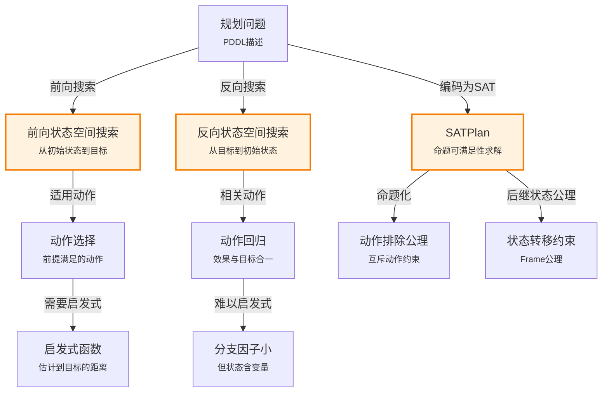

# 11.2 经典规划的算法

> 📖 本节 Deep Dive | 预计学习时间: 70 分钟

---

## 1. 背景与动机

### 1.1 历史背景

**学科演进脉络**

经典规划算法的发展经历了从简单到复杂、从专用到通用的演进过程。20世纪70年代，STRIPS系统首次实现了基于状态空间搜索的规划。随后，研究者发现了偏序规划（Partial-Order Planning）的优势，这种方法在20世纪80-90年代主导了规划研究。进入21世纪，随着启发式搜索技术的发展，前向状态空间搜索重新成为主流。

**里程碑事件**:

| 年份 | 人物/事件 | 贡献 | 影响 |
|------|-----------|------|------|
| 1971 | Fikes & Nilsson | STRIPS规划系统 | 首个实用的状态空间规划器 |
| 1975 | Sacerdoti | 提出NOAH偏序规划器 | 开创了偏序规划方向 |
| 1997 | Blum & Furst | Graphplan系统 | 比当时偏序规划快数个数量级 |
| 1998 | Kautz & Selman | Blackbox/SATPlan | 将规划编码为SAT问题 |
| 2001 | Hoffmann & Nebel | FF规划器 | 使用忽略删除列表启发式，赢得IPC |

**演进动机**:
- 早期方法: 简单的状态空间搜索面临组合爆炸问题
- 局限性: 偏序规划虽然能减少搜索空间，但实现复杂且难以找到好的启发式
- 突破: SAT求解技术的进步和领域无关启发式的发现使前向搜索重新可行

### 1.2 研究动机

**为什么研究者关注规划算法？**

1. **理论意义**: 规划算法是AI中搜索与逻辑推理的结合点，具有重要的理论价值
2. **方法创新**: 不同的算法范式（搜索、SAT、CSP）在规划问题上的应用推动了交叉研究
3. **问题解决**: 高效的规划算法使实际工业应用成为可能

**与其他领域的关系**:
- 与搜索算法：规划算法本质上是状态空间搜索的特化
- 与逻辑推理：SATPlan将规划转化为逻辑可满足性问题
- 与约束满足：规划可编码为CSP问题

### 1.3 实际应用场景

| 应用领域 | 具体问题 | 本节理论的作用 | 预期效果 |
|----------|----------|----------------|----------|
| 物流调度 | 大规模货物运输 | 前向搜索+启发式 | 处理数百万状态的规划问题 |
| 芯片设计 | 电路验证 | SATPlan | 利用高效SAT求解器 |
| 航天器控制 | 深空一号任务规划 | 偏序规划 | 生成人类可理解的规划 |
| 制造业 | 生产线调度 | 分层搜索 | 处理复杂约束 |

**典型案例预览**:
> 考虑一个有10个机场、50架飞机、200件货物的航空货物运输问题。前向搜索的分支因子约为2000，深度为41，搜索空间约为$2000^{41}$。通过合适的启发式方法，现代规划器可以高效求解此类问题。

### 1.4 先决条件

**学习本节需要的前置知识**:

| 知识项 | 来源 | 掌握程度要求 | 关键概念 |
|--------|------|:------------:|----------|
| PDDL表示 | 11.1节 | 必须熟练掌握 | 状态、动作模式、前提、效果 |
| 启发式搜索 | 第3章 | 必须熟练掌握 | A*搜索、可容许启发式 |
| 命题逻辑 | 第7章 | 理解即可 | 可满足性、CNF |
| 合一与置换 | 第9章 | 了解 | 变量绑定、最一般合一 |

**前置检查清单**:
- [ ] 能够编写PDDL问题描述
- [ ] 理解A*搜索算法及其最优性条件
- [ ] 熟悉状态空间搜索的基本概念

---

## 2. 知识逻辑图谱

### 2.1 概念关系图



### 2.2 知识发展依赖链

```
【基础层】           【发展层】              【高潮层】             【应用层】
    ↓                   ↓                     ↓                   ↓
┌─────────┐      ┌─────────────┐       ┌───────────┐      ┌──────────┐
│ PDDL描述 │ ──→  │ 搜索策略选择 │  ──→  │ 算法实现  │ ──→  │ 实际应用  │
│         │      │             │       │           │      │          │
│ 状态+   │      │ 前向/反向/  │       │ 启发式    │      │ 大规模    │
│ 动作    │      │ SAT/CSP     │       │ 优化      │      │ 问题求解  │
└─────────┘      └─────────────┘       └───────────┘      └──────────┘
     │                   │                   │                │
     └───────────────────┴───────────────────┴────────────────┘
                         知识演进脉络
```

**依赖链详解**:
1. **基础**: PDDL提供了问题的形式化描述
2. **发展**: 选择不同的搜索策略（前向、反向、SAT）
3. **高潮**: 通过启发式和优化技术实现高效算法
4. **应用**: 求解实际的大规模规划问题

### 2.3 本节在章节中的位置

```
第 11 章: 自动规划
├── 11.1 经典规划的定义 ← 前置知识
│   └── [核心概念: PDDL、状态、动作模式]
│
├── 11.2 经典规划的算法 ← ⭐ 当前位置
│   ├── [核心概念: 前向搜索、反向搜索、SATPlan]
│   ├── [核心公式: 回归公式、后继状态公理]
│   └── [应用: 各种规划算法实现]
│
└── 11.3 规划的启发式方法 ← 后续发展
    └── [将本节扩展至: 领域无关启发式]
```

**衔接说明**:
- **从前一节继承**: PDDL表示是各种规划算法的基础
- **为后一节铺垫**: 前向搜索的启发式方法将在11.3节详细讨论

---

## 3. 核心概念与数学分析

### 3.1 核心术语定义

**定义 11.4** (前向状态空间搜索 / Forward State-Space Search):

> **正式定义**: 从初始状态出发，反复应用适用动作，向前搜索直到达到目标状态的搜索方法。

**定义详解**:
- **直观解释**: 模拟智能体实际执行动作的过程，从当前状态探索可能的未来
- **关键操作**: 
  - 确定适用动作：$Applicable(s) = \{a : s \models Pre(a)\}$
  - 状态转移：$s' = Result(s, a)$
- **搜索空间**: 状态空间中的路径搜索

**特点**:
- 状态为基本状态（无变量的流集合）
- 分支因子通常很大（所有适用动作）
- 需要好的启发式函数

---

**定义 11.5** (反向状态空间搜索 / Backward State-Space Search):

> **正式定义**: 从目标状态出发，反向应用动作（回归），向后搜索直到达到初始状态的搜索方法。也称为回归搜索（Regression Search）。

**定义详解**:
- **直观解释**: 从目标倒推，找出达成目标所需的前提条件
- **关键操作**: 动作回归
- **相关动作**: 效果能与目标中某文字合一的动作

**回归公式**:
$$Pos(g') = (Pos(g) - Add(a)) \cup Pos(Precond(a))$$
$$Neg(g') = (Neg(g) - Del(a)) \cup Neg(Precond(a))$$

**特点**:
- 状态描述可含变量
- 分支因子通常较小（只考虑相关动作）
- 难以找到好的启发式

---

**定义 11.6** (SATPlan):

> **正式定义**: 将规划问题编码为布尔可满足性问题（SAT），利用高效SAT求解器求解的规划方法。

**定义详解**:
- **直观解释**: 将规划问题转化为逻辑公式的可满足性判断
- **编码步骤**:
  1. 动作命题化
  2. 添加动作排除公理
  3. 添加前提公理
  4. 定义初始状态
  5. 将目标命题化
  6. 添加后继状态公理

---

### 3.2 符号系统与约定

**本节符号总表**:

| 符号 | 含义 | 数学表达 | 备注 |
|:----:|------|----------|------|
| $Applicable(s)$ | 适用动作集 | $\{a : s \models Pre(a)\}$ | 前向搜索使用 |
| $Relevant(g)$ | 相关动作集 | $\{a : \exists e \in Add(a), \exists g_i \in g, e\theta = g_i\theta\}$ | 反向搜索使用 |
| $Pos(g)$ | 目标中的正文字 | - | 回归计算 |
| $Neg(g)$ | 目标中的负文字 | - | 回归计算 |
| $A^t$ | 时间$t$的动作 | - | SATPlan使用 |
| $F^t$ | 时间$t$的流 | - | SATPlan使用 |

### 3.3 关键公式与性质

#### 公式 1: 动作回归公式

**数学表述**:
$$Pos(g') = (Pos(g) - Add(a)) \cup Pos(Precond(a))$$
$$Neg(g') = (Neg(g) - Del(a)) \cup Neg(Precond(a))$$

**公式要素解析**:

| 维度 | 内容 |
|------|------|
| **直观解释** | 反向应用动作时，新目标由原目标移除动作添加的效果，并加入动作的前提条件 |
| **几何意义** | 在目标空间中"倒退"一步 |
| **领域背景** | 这是反向搜索的核心计算，由Waldinger于1970年代提出 |

**使用条件**: 动作$a$必须是相关动作，即其效果与目标中的某文字合一

**示例**: 
- 目标：$g = At(C_2, SFO)$
- 动作：$Unload(C_2, p, SFO)$，效果为$At(C_2, SFO) \land \neg In(C_2, p)$
- 回归后：$g' = In(C_2, p) \land At(p, SFO) \land Cargo(C_2) \land Plane(p) \land Airport(SFO)$

---

#### 公式 2: 后继状态公理

**数学表述**:
$$F^{t+1} \Leftrightarrow ActionCausesF^t \lor (F^t \land \neg ActionCausesNotF^t)$$

其中：
- $ActionCausesF$：所有添加$F$的基本动作的析取
- $ActionCausesNotF$：所有删除$F$的基本动作的析取

**公式要素解析**:

| 维度 | 内容 |
|------|------|
| **直观解释** | 流$F$在$t+1$时刻为真，当且仅当：某动作在$t$时刻添加了$F$，或者$F$在$t$时刻已为真且没有被删除 |
| **领域背景** | 这是解决框架问题（Frame Problem）的标准方法，由Reiter提出 |

---

### 3.4 重要性质与推论

**性质 11.2** (前向搜索与反向搜索的比较):

> **陈述**: 对于大多数问题域，反向搜索的分支因子小于前向搜索，但反向搜索使用的状态含变量，难以找到好的启发式。

| 特性 | 前向搜索 | 反向搜索 |
|------|----------|----------|
| 搜索方向 | 初始状态→目标 | 目标→初始状态 |
| 状态表示 | 基本状态（无变量） | 可含变量的状态描述 |
| 动作选择 | 适用动作（通常很多） | 相关动作（通常较少） |
| 启发式 | 容易设计 | 难以设计 |
| 主要优势 | 启发式效果好 | 分支因子小 |

**应用提示**: 现代规划器多采用前向搜索，因为领域无关启发式的效果优于分支因子的减少。

---

## 4. 定理与证明

### 4.1 定理陈述

**定理 11.2** (SATPlan的完备性 / Completeness of SATPlan):

> **正式陈述**: 对于任何有限经典规划问题，SATPlan在有限时间内能找到解（如果解存在）。

**定理解读**:
- **条件（前提）**:
  1. **有限状态空间**: 问题有有限个状态
  2. **有限动作集**: 动作模式可实例化为有限个基本动作
  3. **有界规划长度**: 考虑长度不超过$k$的规划

- **结论**: 如果存在长度$\leq k$的解，SATPlan能找到；否则可判定为无解

- **定理意义**: SATPlan是一种完备的规划方法

---

### 4.2 证明详解

**证明策略概览**:

我们通过证明PDDL到SAT的正确编码来建立SATPlan的完备性。

**核心思路**: 编码正确性——证明PDDL规划的解与SAT公式的模型一一对应

**关键步骤预览**:
1. 证明任何PDDL规划的解对应SAT公式的满足赋值
2. 证明任何SAT公式的满足赋值对应有效的PDDL规划

---

**正式证明**:

**步骤 1**: PDDL解到SAT赋值的映射

给定一个长度为$k$的PDDL规划解$[a_1, a_2, ..., a_k]$，构造SAT赋值：

- 对于每个时间步$t$和每个基本动作$A$，设$A^t = \top$当且仅当$a_t = A$
- 对于每个时间步$t$和每个流$F$，设$F^t = \top$当且仅当$F$在$t$时刻的状态中为真

验证该赋值满足所有SAT公理：
- **动作排除公理**: 每个时间步只有一个动作为真，满足
- **前提公理**: 规划解中每个动作的前提都满足，因此$A^t \Rightarrow Pre(A)^t$成立
- **后继状态公理**: 由PDDL状态转移的定义，公式成立
- **初始状态和目标**: 由规划解的定义，满足

---

**步骤 2**: SAT赋值到PDDL规划的映射

给定SAT公式的满足赋值，构造PDDL规划：

- 对于每个时间步$t$，选择使$A^t = \top$的动作$A$作为$a_t$
- 由前提公理，$Pre(a_t)$在$t$时刻为真
- 由后继状态公理，状态转移与PDDL定义一致
- 由目标公理，最终状态满足目标

因此，$[a_1, ..., a_k]$是有效的PDDL规划解。

---

**步骤 3**: 完备性结论

由于PDDL解与SAT赋值一一对应：
- 如果存在长度$\leq k$的PDDL解，则SAT公式可满足
- 如果SAT公式可满足，则存在对应的PDDL解

因此，SATPlan是完备的。

$$\blacksquare \text{ (证毕)}$$

### 4.3 证明分析与提炼

**核心洞见**: SATPlan的完备性依赖于PDDL到SAT的正确编码。编码的关键是解决框架问题（Frame Problem），即如何表示"未被动作改变的流保持原值"。后继状态公理提供了优雅的解决方案。

**证明技巧总结**:

| 技巧 | 在本证明中的应用 | 可迁移性 | 其他应用场景 |
|------|------------------|----------|--------------|
| 双向映射 | 建立PDDL解与SAT赋值的对应 | ⭐⭐⭐⭐⭐ | 归约证明 |
| 构造法 | 显式构造映射 | ⭐⭐⭐⭐ | 存在性证明 |

---

## 5. 具体示例与详解

### 5.1 典型数值示例

**示例 11.3**: 航空货物运输问题的前向搜索

**📋 问题陈述**:

简化版：2个机场(SFO, JFK)，1架飞机$P_1$，1件货物$C_1$
- 初始：$At(C_1, SFO) \land At(P_1, SFO)$
- 目标：$At(C_1, JFK)$

**🔍 解答过程**:

**步骤 1: 初始状态分析**

$s_0 = \{At(C_1, SFO), At(P_1, SFO), Cargo(C_1), Plane(P_1), Airport(SFO), Airport(JFK)\}$

**步骤 2: 确定适用动作**

从$s_0$出发，适用动作：
- $Load(C_1, P_1, SFO)$：前提$At(C_1, SFO) \land At(P_1, SFO)$满足
- $Fly(P_1, SFO, JFK)$：前提$At(P_1, SFO)$满足

**步骤 3: 状态转移**

选择$Load(C_1, P_1, SFO)$：
- $Del = \{At(C_1, SFO)\}$
- $Add = \{In(C_1, P_1)\}$
- $s_1 = (s_0 - Del) \cup Add = \{In(C_1, P_1), At(P_1, SFO), ...\}$

**步骤 4: 继续搜索**

从$s_1$出发：
- $Fly(P_1, SFO, JFK)$适用
- 执行后：$s_2 = \{In(C_1, P_1), At(P_1, JFK), ...\}$

从$s_2$出发：
- $Unload(C_1, P_1, JFK)$适用
- 执行后：$s_3 = \{At(C_1, JFK), At(P_1, JFK), ...\}$

**步骤 5: 验证目标**

$s_3 \models At(C_1, JFK)$，目标达成！

**规划解**: $[Load(C_1, P_1, SFO), Fly(P_1, SFO, JFK), Unload(C_1, P_1, JFK)]$

---

**✅ 验证与检验**:

**正确性检查**:
- [x] 每个动作的前提在执行时都满足
- [x] 状态转移计算正确
- [x] 最终状态满足目标

**复杂度分析**:
- 搜索深度：3
- 分支因子：最多2（Load和Fly）
- 搜索空间：较小

---

### 5.2 概念辨析示例

**示例 11.4**: 反向搜索的回归计算

**场景**: 目标$g = At(C_1, JFK)$，考虑$Unload$动作

**分析**:

动作模式：
```
Unload(c, p, a):
  PRECOND: In(c, p) ∧ At(p, a) ∧ Cargo(c) ∧ Plane(p) ∧ Airport(a)
  EFFECT: At(c, a) ∧ ¬In(c, p)
```

将目标$At(C_1, JFK)$与效果$At(c, a)$合一：
- 置换：$\theta = \{c/C_1, a/JFK\}$
- 标准化分离：用新变量$p'$替换$p$

回归计算：
- $Pos(g) = \{At(C_1, JFK)\}$
- $Add(a) = \{At(c, a)\}$
- $Pos(Precond(a)) = \{In(c, p), At(p, a), Cargo(c), Plane(p), Airport(a)\}$

$$Pos(g') = (\{At(C_1, JFK)\} - \{At(C_1, JFK)\}) \cup \{In(C_1, p'), At(p', JFK), Cargo(C_1), Plane(p'), Airport(JFK)\}$$

$$= \{In(C_1, p'), At(p', JFK), Cargo(C_1), Plane(p'), Airport(JFK)\}$$

**教训**: 反向搜索通过回归将目标分解为子目标，减少了搜索空间。

---

### 5.3 类比与可视化

**直觉类比**:

| 抽象概念 | 日常类比 | 对应关系 |
|----------|----------|----------|
| 前向搜索 | 从起点出发找路 | 实际探索路径 |
| 反向搜索 | 从目的地倒推 | 看地图规划路线 |
| SATPlan | 解谜游戏 | 将问题转化为逻辑约束 |
| 适用动作 | 当前可行的选择 | 路口可走的方向 |
| 相关动作 | 有助于达成目标的选择 | 指向目的地的路 |

**可视化**:

```
前向搜索视角：

    初始状态
        ↓
    [适用动作选择]
        ↓
    状态1 ──→ 状态2
        ↓         ↓
      ...       ...
        ↓         ↓
    目标状态 ←──┘

反向搜索视角：

    目标状态
        ↑
    [相关动作回归]
        ↑
    子目标1 ←── 子目标2
        ↑         ↑
      ...       ...
        ↑         ↑
    初始状态 ────┘
```

---

## 6. 深入理解与拓展

### 6.1 一句话本质

> 🎯 **核心要点**: 经典规划算法通过前向搜索（状态空间探索）、反向搜索（目标回归）或SAT编码（逻辑可满足性）三种范式，在PDDL描述的规划问题中寻找从初始状态到目标状态的动作序列。

### 6.2 深入思考问题

1. **概念层面**: 为什么反向搜索难以设计好的启发式函数？
   <!-- 思考方向: 变量状态与启发式估计的关系 -->

2. **方法层面**: 比较SATPlan与前向搜索的优缺点
   <!-- 思考方向: 空间复杂度、时间复杂度、实际性能 -->

3. **应用层面**: 在什么情况下应该选择反向搜索而非前向搜索？
   <!-- 思考方向: 目标明确但初始状态复杂的问题 -->

4. **拓展层面**: 如何将规划问题编码为CSP而非SAT？
   <!-- 思考方向: CSP变量和约束的设计 -->

### 6.3 与其他节的关系

**本节输出**:
- 三种规划算法范式（前向、反向、SAT）
- 动作回归的数学公式
- 后继状态公理

**后续发展预告**: 
- 11.3节将讨论如何为前向搜索设计领域无关的启发式
- 11.4节将介绍分层规划算法
- 11.5节将扩展到非确定性环境的规划

---

## 7. 总结与反思

### 7.1 关键要点总结

本节必须掌握的 **5** 个核心要点:

1. **前向状态空间搜索**: 从初始状态出发，应用适用动作，向前搜索目标
   
   💡 *记忆技巧*: "从起点出发，步步为营"

2. **反向状态空间搜索**: 从目标出发，反向应用相关动作，向后搜索初始状态
   
   💡 *记忆技巧*: "从终点倒推，化整为零"

3. **动作回归公式**: $Pos(g') = (Pos(g) - Add(a)) \cup Pos(Precond(a))$
   
   💡 *记忆技巧*: "去效果，加前提"

4. **SATPlan**: 将规划编码为SAT问题，利用高效求解器
   
   💡 *记忆技巧*: "规划变逻辑，求解用SAT"

5. **算法选择**: 前向搜索易启发式但分支因子大，反向搜索分支因子小但难启发式
   
   💡 *记忆技巧*: "前向易启发，反向少分支"

### 7.2 本节知识框架

```
┌─────────────────────────────────────────────────────────────┐
│  第11.2节: 经典规划的算法                                    │
├─────────────────────────────────────────────────────────────┤
│  输入/前置                                                   │
│  • PDDL问题描述                                              │
│  • 搜索算法基础                                              │
│                                                             │
│  处理/核心                                                   │
│  • 前向搜索（适用动作）                                      │
│  • 反向搜索（动作回归）                                      │
│  • SATPlan（逻辑编码）                                       │
│  ↓                                                          │
│  输出/结果                                                   │
│  • 规划解（动作序列）                                        │
│  • 算法复杂度分析                                            │
│                                                             │
│  应用/价值                                                   │
│  • 大规模规划问题求解                                        │
│  • 不同问题域的算法选择                                      │
└─────────────────────────────────────────────────────────────┘
```

### 7.3 常见误解与纠正

| 常见误解 ❌ | 正确理解 ✅ | 为什么容易错 | 如何避免 |
|-------------|-------------|--------------|----------|
| ❌ 反向搜索状态不含变量 | ✅ 反向搜索状态可含变量 | 混淆了前向搜索的基本状态 | 理解回归的本质 |
| ❌ SATPlan只能找到最优解 | ✅ SATPlan可以找到任意解，迭代可找最优 | 误解SAT求解器的性质 | 理解有界规划的概念 |
| ❌ 前向搜索总是比反向搜索好 | ✅ 取决于问题特性和启发式可用性 | 现代规划器多用前向搜索 | 理解两种方法的权衡 |
| ❌ 后继状态公理是唯一的Frame问题解决方案 | ✅ 还有Frame公理等其他方案 | 教材只介绍了后继状态公理 | 了解Frame问题的多种解决方案 |

### 7.4 反思问题

**连接性问题**:
1. 如何将第3章的A*搜索应用于前向规划搜索？
2. 比较SATPlan与第7章的命题逻辑推理方法。

**应用性问题**:
1. 设计一个具体问题，反向搜索明显优于前向搜索。
2. 估算一个有100个动作、规划长度20的问题的SAT编码规模。

**批判性问题**:
1. 为什么偏序规划在2000年后失去了竞争力？
2. Graphplan的规划图结构有什么优缺点？

### 7.5 学习检查清单

- [x] 能够解释前向搜索和反向搜索的区别
- [x] 能够计算动作回归
- [x] 理解SATPlan的编码步骤
- [x] 知道后继状态公理的作用
- [x] 能够比较不同规划算法的优缺点
- [x] 了解偏序规划、Graphplan等其他经典规划方法

---

## 附录

### A. 公式速查表

| 公式 | 名称 | 使用条件 | 备注 |
|:----:|------|----------|------|
| $Pos(g') = (Pos(g) - Add(a)) \cup Pos(Precond(a))$ | 正文字回归 | 反向搜索 | 核心公式 |
| $Neg(g') = (Neg(g) - Del(a)) \cup Neg(Precond(a))$ | 负文字回归 | 反向搜索 | 核心公式 |
| $F^{t+1} \Leftrightarrow ActionCausesF^t \lor (F^t \land \neg ActionCausesNotF^t)$ | 后继状态公理 | SATPlan | Frame问题解决方案 |

### B. 术语索引

| 术语 | 英文 | 定义 | 位置 |
|------|------|------|:----:|
| 前向搜索 | Forward Search | 从初始状态向目标搜索 | 11.2 |
| 反向搜索 | Backward Search/Regression | 从目标向初始状态搜索 | 11.2 |
| 适用动作 | Applicable Action | 前提被当前状态满足的动作 | 11.2 |
| 相关动作 | Relevant Action | 效果与目标合一的动作 | 11.2 |
| 动作回归 | Action Regression | 反向应用动作计算前置目标 | 11.2 |
| SATPlan | - | 基于SAT求解的规划方法 | 11.2 |
| 后继状态公理 | Successor-State Axiom | 描述流如何随时间变化的逻辑公式 | 11.2 |

### C. 延伸阅读

**理论深化**:
- Kautz, H., & Selman, B. (1998). Blackbox: A new approach to the application of theorem proving to problem solving. AIPS.

**应用拓展**:
- 国际规划竞赛(IPC): https://ipc.icaps-conference.org/

---

> 📌 **下一节**: [11.3 规划的启发式方法](11.3_规划的启发式方法.md)
> 
> 📚 **返回概览**: [第11章概览](00_概览.md)
