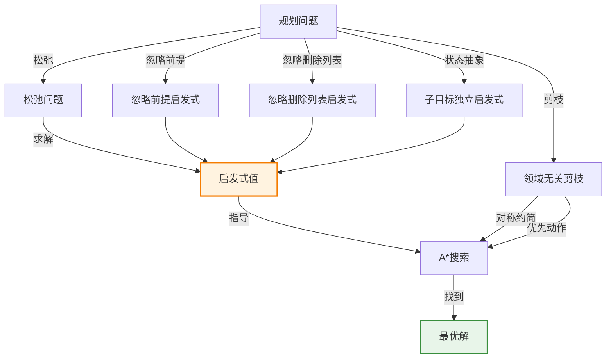

# 11.3 规划的启发式方法

> 📖 本节 Deep Dive | 预计学习时间: 60 分钟

---

## 1. 背景与动机

### 1.1 历史背景

**学科演进脉络**

启发式方法在规划领域的发展经历了从领域特定到领域无关的转变。早期规划系统（如STRIPS）依赖于人工设计的启发式函数。20世纪90年代末，研究者发现PDDL的因子化表示使得自动推导领域无关启发式成为可能。Hoffmann和Nebel于2001年提出的FF规划器（FastForward）使用忽略删除列表启发式，在规划竞赛中取得了突破性成果。

**里程碑事件**:

| 年份 | 人物/事件 | 贡献 | 影响 |
|------|-----------|------|------|
| 1996 | McDermott | UnPOP规划器 | 首次使用忽略删除列表启发式 |
| 1999 | Bonet & Geffner | HSP规划器 | 启发式搜索规划器 |
| 2001 | Hoffmann & Nebel | FF规划器 | 赢得IPC，启发式规划成为主流 |
| 2005 | Hoffmann | 分析忽略删除列表启发式 | 理论解释其有效性 |
| 2006 | Helmert | FastDownward | 基于因果图启发式 |

**演进动机**:
- 早期方法: 需要人工为每个领域设计启发式函数
- 局限性: 领域特定启发式难以扩展到新领域
- 突破: PDDL的因子化表示使得自动推导领域无关启发式成为可能

### 1.2 研究动机

**为什么研究者关注启发式方法？**

1. **理论意义**: 松弛问题与启发式函数的关系是搜索理论的核心问题
2. **方法创新**: 从PDDL描述自动推导启发式是AI的重要成就
3. **问题解决**: 好的启发式使大规模规划问题可解

**与其他领域的关系**:
- 与搜索算法：启发式函数是A*等算法的核心
- 与松弛问题：启发式通过求解松弛问题获得
- 与抽象：状态抽象是另一种松弛方法

### 1.3 实际应用场景

| 应用领域 | 具体问题 | 本节理论的作用 | 预期效果 |
|----------|----------|----------------|----------|
| 物流规划 | 大规模货物运输 | 忽略删除列表启发式 | 处理数百万状态 |
| 滑块问题 | 8数码/15数码 | 忽略前提启发式 | 自动推导曼哈顿距离 |
| 航天器控制 | 深空一号规划 | 可序列化子目标 | 消除大部分搜索 |
| 制造业 | 生产线调度 | 子目标独立启发式 | 快速估计规划代价 |

**典型案例预览**:
> 考虑一个有10个机场、50架飞机、200件货物的航空货物运输问题。使用忽略删除列表启发式，搜索空间从$2000^{41}$大幅缩减，使问题可解。

### 1.4 先决条件

**学习本节需要的前置知识**:

| 知识项 | 来源 | 掌握程度要求 | 关键概念 |
|--------|------|:------------:|----------|
| A*搜索 | 第3章 | 必须熟练掌握 | 可容许启发式、最优性 |
| PDDL表示 | 11.1节 | 必须熟练掌握 | 状态、动作模式 |
| 松弛问题 | 第3章 | 理解即可 | 松弛问题的启发式 |
| 集合覆盖 | 算法基础 | 了解 | NP困难、贪心算法 |

**前置检查清单**:
- [ ] 理解A*搜索的可容许性条件
- [ ] 能够编写PDDL动作模式
- [ ] 理解松弛问题的概念

---

## 2. 知识逻辑图谱

### 2.1 概念关系图



### 2.2 知识发展依赖链

```
【基础层】           【发展层】              【高潮层】             【应用层】
    ↓                   ↓                     ↓                   ↓
┌─────────┐      ┌─────────────┐       ┌───────────┐      ┌──────────┐
│ 松弛问题 │ ──→  │ 启发式推导  │  ──→  │ A*搜索    │ ──→  │ 最优规划  │
│         │      │             │       │           │      │          │
│ 忽略前提│      │ 自动推导    │       │ 可容许    │      │ 大规模    │
│ 忽略删除│      │ 领域无关    │       │ 启发式    │      │ 问题求解  │
└─────────┘      └─────────────┘       └───────────┘      └──────────┘
     │                   │                   │                │
     └───────────────────┴───────────────────┴────────────────┘
                         知识演进脉络
```

### 2.3 本节在章节中的位置

```
第 11 章: 自动规划
├── 11.2 经典规划的算法 ← 前置知识
│   └── [核心概念: 前向搜索、A*算法]
│
├── 11.3 规划的启发式方法 ← ⭐ 当前位置
│   ├── [核心概念: 忽略前提、忽略删除列表、状态抽象]
│   ├── [核心公式: 松弛问题启发式]
│   └── [应用: FF规划器、FastDownward]
│
└── 11.4 分层规划 ← 后续发展
    └── [将本节扩展至: 分层启发式]
```

---

## 3. 核心概念与数学分析

### 3.1 核心术语定义

**定义 11.7** (忽略前提启发式 / Ignore-Preconditions Heuristic):

> **正式定义**: 从所有动作中去掉所有前提条件，使得每个动作都适用于所有状态，此时求解松弛问题所需的步骤数作为启发式值。

**定义详解**:
- **直观解释**: 假设动作可以随时执行，不受前提限制
- **计算**: 松弛问题中，任何单个目标流都可以在一步内完成（如果存在添加该流的动作）
- **启发式值**: 约等于未满足的目标数量

**修正因素**:
1. 一些动作可能实现多个目标
2. 一些动作可能抵消其他动作的效果

---

**定义 11.8** (忽略删除列表启发式 / Ignore-Delete-Lists Heuristic):

> **正式定义**: 从所有动作中移除删除列表（即移除所有负文字效果），使得动作不会撤销已取得的进展，此时求解松弛问题所需的步骤数作为启发式值。

**定义详解**:
- **直观解释**: 假设动作只有添加效果，没有删除效果
- **性质**: 向目标单调前进，无局部极小值
- **求解**: 可用爬山搜索在多项式时间内找到近似解

**优势**:
- 无死路，无需回溯
- 简单的爬山搜索即可求解

---

**定义 11.9** (子目标独立假设 / Subgoal Independence):

> **正式定义**: 假设求解一系列子目标的代价近似于独立求解每个子目标的代价之和。

**定义详解**:
- **乐观情况**: 当子规划之间存在负相互作用时（一个子规划删除另一个子规划的目标）
- **悲观情况**: 当子规划包含冗余动作时
- **可容许性**: 如果子目标独立，$\sum Cost(P_i)$是可容许的

---

**定义 11.10** (对称约简 / Symmetry Reduction):

> **正式定义**: 识别并剪枝搜索树中的对称分支，只保留其中一个代表。

**定义详解**:
- **直观解释**: 如果多个状态在本质上是相同的（对称的），只探索其中一个
- **应用**: 积木世界中，选择哪块积木作为中间支撑是对称的
- **效果**: 可能将问题从难以求解变为高效求解

---

### 3.2 符号系统与约定

**本节符号总表**:

| 符号 | 含义 | 数学表达 | 备注 |
|:----:|------|----------|------|
| $h(s)$ | 启发式函数 | $h: S \rightarrow \mathbb{R}^+$ | 估计到目标的代价 |
| $h^*(s)$ | 真实最优代价 | - | 启发式的目标 |
| $h_{add}(s)$ | 忽略删除列表启发式 | - | 常用启发式 |
| $h_{max}(s)$ | 最大启发式 | $\max_i Cost(P_i)$ | 可容许但可能低估 |
| $h_{sum}(s)$ | 求和启发式 | $\sum_i Cost(P_i)$ | 可能不可容许 |
| $G$ | 目标流集合 | $\{g_1, g_2, ..., g_n\}$ | 可分解为子目标 |

### 3.3 关键公式与性质

#### 公式 1: 忽略删除列表启发式

**数学表述**:
$$h_{add}(s) = \text{求解松弛问题的步数}$$

其中松弛问题通过从所有动作中移除删除列表得到。

**公式要素解析**:

| 维度 | 内容 |
|------|------|
| **直观解释** | 假设动作只有添加效果，计算从当前状态到目标需要多少步 |
| **几何意义** | 在松弛状态空间中，搜索目标变得简单直接，无局部极小值 |
| **领域背景** | 由McDermott于1996年提出，Hoffmann于2001年系统分析 |

**可容许性**: $h_{add}(s) \leq h^*(s)$，因为松弛问题比原问题更容易求解。

**计算复杂度**: 虽然找到松弛问题的最优解仍是NP困难的，但可用爬山搜索在多项式时间内找到近似解。

---

#### 公式 2: 子目标独立启发式

**数学表述**:
$$h_{max}(s) = \max_i Cost(P_i)$$
$$h_{sum}(s) = \sum_i Cost(P_i)$$

其中$P_i$是子目标$G_i$的最优解。

**公式要素解析**:

| 维度 | 内容 |
|------|------|
| **直观解释** | 将目标分解为子目标，独立求解后组合启发式估计 |
| **可容许性** | $h_{max}$总是可容许的；$h_{sum}$在子目标独立时可容许 |
| **准确性** | $h_{sum}$通常比$h_{max}$更准确 |

---

### 3.4 重要性质与推论

**性质 11.3** (松弛问题的启发式可容许性):

> **陈述**: 通过求解松弛问题得到的启发式函数是可容许的（不会高估真实代价）。

**证明概要**: 松弛问题比原问题更容易求解（约束更少），因此松弛问题的最优解代价不大于原问题的最优解代价。

**直观理解**: 松弛问题提供了到目标距离的下界估计。

---

## 4. 定理与证明

### 4.1 定理陈述

**定理 11.3** (忽略删除列表启发式的可容许性 / Admissibility of Ignore-Delete-Lists Heuristic):

> **正式陈述**: 对于任何状态$s$，忽略删除列表启发式$h_{add}(s)$是可容许的，即$h_{add}(s) \leq h^*(s)$。

**定理解读**:
- **条件（前提）**:
  1. 规划问题是经典规划问题（确定性、完全可观测等）
  2. 启发式通过求解忽略删除列表的松弛问题获得

- **结论**: $h_{add}(s) \leq h^*(s)$对所有状态$s$成立

- **定理意义**: 保证使用$h_{add}$的A*搜索能找到最优解

---

### 4.2 证明详解

**证明策略概览**:

通过证明松弛问题是原问题的松弛（约束更少），因此松弛问题的最优解代价是原问题最优解代价的下界。

**核心思路**: 松弛问题的解也是原问题的解

**关键步骤预览**:
1. 定义松弛问题
2. 证明松弛问题的任何解对应原问题的解
3. 得出代价关系

---

**正式证明**:

**步骤 1**: 松弛问题的定义

给定原问题$P = (S, A, \gamma, s_0, G)$，定义松弛问题$P' = (S, A', \gamma', s_0, G)$，其中：
- $A'$是通过从$A$中每个动作的删除列表中移除所有负文字得到的动作集
- $\gamma'$是相应的转移函数

**步骤 2**: 松弛问题解到原问题解的映射

设$\pi' = [a'_1, a'_2, ..., a'_k]$是松弛问题$P'$的解，其中$a'_i$是松弛动作。

对于每个松弛动作$a'_i$，存在原问题中的对应动作$a_i$（$a_i$的效果包含$a'_i$的所有正文字，以及可能的负文字）。

我们声称$\pi = [a_1, a_2, ..., a_k]$是原问题$P$的解。

**证明**: 
- 在松弛问题中，$a'_i$适用于状态$s'_{i-1}$
- 由于$a'_i$没有负效果，$s'_{i-1}$包含所有之前添加的流
- 在原问题中，$a_i$的前提与$a'_i$相同或更弱（因为$a_i$可能有额外的前提来满足其负效果）
- 因此，如果$a'_i$适用，$a_i$也适用（可能需要额外的流，但这些流可以通过规划的其他部分获得）
- 执行$a_i$后，所有$a'_i$添加的流也被添加（$a_i$可能还删除一些流，但这不影响最终目标，因为松弛问题的解已经到达目标）

**步骤 3**: 代价关系

由于松弛问题的任何解都对应原问题的解（可能通过添加一些修复动作），松弛问题的最优解代价$h_{add}(s)$不大于原问题的最优解代价$h^*(s)$。

因此，$h_{add}(s) \leq h^*(s)$。

$$\blacksquare \text{ (证毕)}$$

### 4.3 证明分析与提炼

**核心洞见**: 忽略删除列表使问题更容易求解，因为动作不会撤销已取得的进展。这消除了搜索中的回溯需求。

**证明技巧总结**:

| 技巧 | 在本证明中的应用 | 可迁移性 | 其他应用场景 |
|------|------------------|----------|--------------|
| 松弛论证 | 证明松弛问题更容易求解 | ⭐⭐⭐⭐⭐ | 各种松弛启发式 |
| 解的映射 | 建立松弛解与原问题解的关系 | ⭐⭐⭐⭐ | 近似算法分析 |

---

## 5. 具体示例与详解

### 5.1 典型数值示例

**示例 11.5**: 滑块问题的启发式推导

**📋 问题陈述**:

8数码问题：3×3网格，8个滑块和1个空白。

PDDL动作模式：
```
Action(Slide(t, s1, s2),
  PRECOND: On(t, s1) ∧ Tile(t) ∧ Blank(s2) ∧ Adjacent(s1, s2)
  EFFECT: On(t, s2) ∧ Blank(s1) ∧ ¬On(t, s1) ∧ ¬Blank(s2))
```

**🔍 解答过程**:

**步骤 1: 忽略前提启发式**

移除所有前提：
```
Action(Slide(t, s1, s2),
  PRECOND: 
  EFFECT: On(t, s2) ∧ Blank(s1) ∧ ¬On(t, s1) ∧ ¬Blank(s2))
```

现在任何滑块都可以移动到任何位置（一步）。

启发式 = 错放的滑块数量

**步骤 2: 忽略部分前提启发式**

只移除前提$Blank(s2)$：
```
Action(Slide(t, s1, s2),
  PRECOND: On(t, s1) ∧ Tile(t) ∧ Adjacent(s1, s2)
  EFFECT: ...)
```

滑块可以移动到相邻位置，不考虑空白。

启发式 = 曼哈顿距离之和

**步骤 3: 比较**

| 启发式 | 计算方式 | 质量 |
|--------|----------|------|
| 错放滑块 | 统计不在目标位置的滑块数 | 较松 |
| 曼哈顿距离 | 各滑块到目标位置的曼哈顿距离之和 | 较紧 |

---

**✅ 验证与检验**:

**正确性检查**:
- [x] 两种启发式都是可容许的
- [x] 曼哈顿距离启发式更精确（更接近真实代价）
- [x] 启发式可从PDDL描述自动推导

**结果的意义**: 这展示了因子化表示的优势——启发式可以从动作模式的描述中自动推导，无需人工设计。

---

### 5.2 概念辨析示例

**示例 11.6**: 子目标独立性的乐观与悲观情况

**场景**: 积木世界，目标为建造塔$A$在$B$上，$B$在$C$上。

**乐观情况（负相互作用）**:

如果子目标是$On(A, B)$和$On(B, C)$，且当前状态是$A$、$B$、$C$都在桌子上。

独立求解：
- 求解$On(A, B)$：$Move(A, Table, B)$，代价1
- 求解$On(B, C)$：$Move(B, Table, C)$，代价1
- 求和启发式：$h_{sum} = 2$

但实际最优解：
- 先$Move(B, Table, C)$，再$Move(A, Table, B)$，代价2
- 或者发现无法同时满足（如果$A$在$B$上时不能移动$B$）

实际上，如果先移动$B$，就无法再移动$A$到$B$上（因为$B$不再在桌子上）。

因此，$h_{sum} = 2$可能低估了真实代价（如果存在额外步骤来重新配置）。

**悲观情况（冗余动作）**:

如果两个子目标可以通过同一个动作序列达成，独立求解会重复计算。

**教训**: 子目标独立假设是一个近似，可能乐观也可能悲观。

---

### 5.3 类比与可视化

**直觉类比**:

| 抽象概念 | 日常类比 | 对应关系 |
|----------|----------|----------|
| 松弛问题 | 简化版谜题 | 去掉一些规则 |
| 忽略删除列表 | 只能添加不能删除 | 只能前进不能后退 |
| 启发式 | 距离估计 | 到目的地的预计时间 |
| 可容许启发式 | 保守估计 | 预计时间≤实际时间 |
| 对称约简 | 识别等价路径 | 多条路其实一样 |

**可视化**:

```
原问题状态空间：
    S0 → S1 → S2
    ↓    ↓    ↓
    S3 → S4 → S5
    ↓    ↓    ↓
    Goal

忽略删除列表的松弛状态空间：
    S0 → S1 → S2
    ↓ ↘  ↓ ↘  ↓
    S3 → S4 → S5
    ↓    ↓    ↓
    Goal
    
（更多边，无回溯，单调前进）
```

---

## 6. 深入理解与拓展

### 6.1 一句话本质

> 🎯 **核心要点**: 规划的启发式方法通过求解松弛问题（忽略前提或删除列表）或状态抽象，自动推导领域无关的可容许启发式，使大规模规划问题的有效求解成为可能。

### 6.2 深入思考问题

1. **概念层面**: 为什么忽略删除列表启发式通常比忽略前提启发式更精确？
   <!-- 思考方向: 删除列表对搜索空间的影响 -->

2. **方法层面**: 如何设计一个既可容许又尽可能精确的启发式？
   <!-- 思考方向: 可容许性与精确性的权衡 -->

3. **应用层面**: 在什么情况下对称约简最有效？
   <!-- 思考方向: 问题结构中的对称性 -->

4. **拓展层面**: 如何将启发式方法扩展到分层规划？
   <!-- 思考方向: 高层动作的启发式估计 -->

### 6.3 与其他节的关系

**本节输出**:
- 领域无关启发式的推导方法
- 忽略前提和忽略删除列表启发式
- 子目标独立假设
- 对称约简等剪枝技术

**后续发展预告**: 
- 11.4节将讨论分层规划中的启发式
- 11.5节将讨论信念状态空间的启发式

---

## 7. 总结与反思

### 7.1 关键要点总结

本节必须掌握的 **5** 个核心要点:

1. **松弛问题**: 通过放松约束（忽略前提或删除列表）创建更容易求解的问题
   
   💡 *记忆技巧*: "放松约束，简化问题"

2. **忽略删除列表启发式**: 移除动作的负效果，使搜索单调前进，无局部极小值
   
   💡 *记忆技巧*: "只加不减，一路向前"

3. **可容许性**: 松弛问题的最优解代价是原问题最优解代价的下界
   
   💡 *记忆技巧*: "松弛易求解，代价是下界"

4. **子目标独立**: 将目标分解为子目标，独立求解后组合启发式
   
   💡 *记忆技巧*: "化整为零，分而治之"

5. **对称约简**: 识别并剪枝对称的搜索分支
   
   💡 *记忆技巧*: "等价状态，只探其一"

### 7.2 本节知识框架

```
┌─────────────────────────────────────────────────────────────┐
│  第11.3节: 规划的启发式方法                                  │
├─────────────────────────────────────────────────────────────┤
│  输入/前置                                                   │
│  • PDDL问题描述                                              │
│  • 搜索算法基础                                              │
│                                                             │
│  处理/核心                                                   │
│  • 松弛问题构造（忽略前提/删除列表）                         │
│  • 启发式计算                                                │
│  • 剪枝技术（对称约简、优先动作）                            │
│  ↓                                                          │
│  输出/结果                                                   │
│  • 可容许启发式函数                                          │
│  • 高效搜索                                                  │
│                                                             │
│  应用/价值                                                   │
│  • 大规模规划问题求解                                        │
│  • 实际工业应用                                              │
└─────────────────────────────────────────────────────────────┘
```

### 7.3 常见误解与纠正

| 常见误解 ❌ | 正确理解 ✅ | 为什么容易错 | 如何避免 |
|-------------|-------------|--------------|----------|
| ❌ 所有松弛启发式都是可容许的 | ✅ 只有正确构造的松弛启发式才是可容许的 | 忽略了松弛的精确定义 | 理解松弛问题的构造 |
| ❌ 忽略删除列表启发式总是最优的 | ✅ 它是可容许的，但可能低估 | 混淆可容许性和精确性 | 理解启发式的质量差异 |
| ❌ 子目标独立假设总是成立 | ✅ 它是一个近似假设 | 理想化假设 | 理解其乐观和悲观情况 |
| ❌ 对称约简会丢失最优解 | ✅ 正确的对称约简保持最优性 | 误解剪枝的含义 | 理解对称状态的等价性 |

### 7.4 反思问题

**连接性问题**:
1. 如何将第3章的模式数据库技术应用于规划启发式？
2. 比较规划启发式与博弈搜索中的评估函数。

**应用性问题**:
1. 设计一个问题，忽略删除列表启发式明显优于忽略前提启发式。
2. 如何在实际规划器中实现对称检测？

**批判性问题**:
1. 为什么领域无关启发式有时不如简单的领域特定启发式？
2. 在什么情况下应该使用不可容许启发式？

### 7.5 学习检查清单

- [x] 理解松弛问题的概念
- [x] 能够解释忽略前提和忽略删除列表启发式
- [x] 理解可容许性的含义和重要性
- [x] 知道子目标独立假设的优缺点
- [x] 了解对称约简等剪枝技术
- [x] 了解FF规划器和FastDownward等现代规划器

---

## 附录

### A. 公式速查表

| 公式 | 名称 | 使用条件 | 备注 |
|:----:|------|----------|------|
| $h_{add}(s)$ | 忽略删除列表启发式 | 前向搜索 | 常用启发式 |
| $h_{max}(s) = \max_i Cost(P_i)$ | 最大启发式 | 子目标分解 | 可容许 |
| $h_{sum}(s) = \sum_i Cost(P_i)$ | 求和启发式 | 子目标独立 | 可能不可容许 |

### B. 术语索引

| 术语 | 英文 | 定义 | 位置 |
|------|------|------|:----:|
| 忽略前提启发式 | Ignore-Preconditions Heuristic | 移除动作前提的松弛启发式 | 11.3 |
| 忽略删除列表启发式 | Ignore-Delete-Lists Heuristic | 移除动作负效果的松弛启发式 | 11.3 |
| 子目标独立 | Subgoal Independence | 子目标求解代价可加的假设 | 11.3 |
| 对称约简 | Symmetry Reduction | 剪枝对称搜索分支 | 11.3 |
| 可序列化子目标 | Serializable Subgoals | 可按顺序完成而不相互干扰的子目标 | 11.3 |

### C. 延伸阅读

**理论深化**:
- Hoffmann, J. (2005). Where "ignoring delete lists" works: Local search topology in planning benchmarks. JAIR.

**应用拓展**:
- Helmert, M. (2006). The Fast Downward planning system. JAIR.

---

> 📌 **下一节**: [11.4 分层规划](11.4_分层规划.md)
> 
> 📚 **返回概览**: [第11章概览](00_概览.md)
