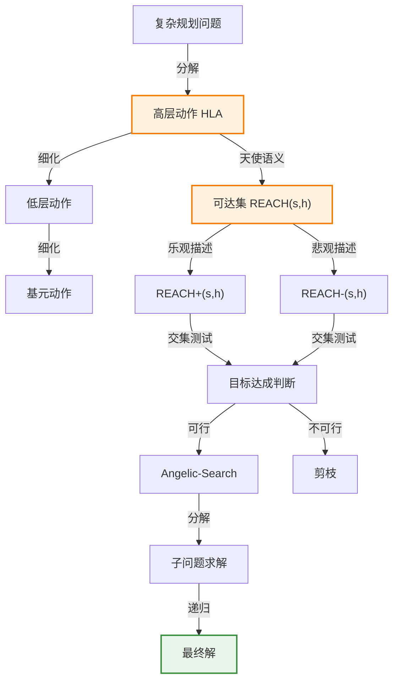

# 11.4 分层规划

> 📖 本节 Deep Dive | 预计学习时间: 75 分钟

---

## 1. 背景与动机

### 1.1 历史背景

**学科演进脉络**

分层规划的思想源于对人类问题求解方式的观察：人们通常先在抽象层次上规划，然后逐步细化。20世纪70年代，Sacerdoti的NOAH系统首次实现了分层任务网络（HTN）规划。随后，Erol、Hendler和Nau于1994年提出了完备的HTN规划器，并分析了其复杂性。21世纪初，Marthi等人发展了天使语义，使得可以在不考虑低层实现的情况下证明高层规划的正确性。

**里程碑事件**:

| 年份 | 人物/事件 | 贡献 | 影响 |
|------|-----------|------|------|
| 1974 | Sacerdoti | Abstrip系统 | 引入抽象层次概念 |
| 1975 | Tate | 博士论文/Nonlin | 发展HTN规划基本思想 |
| 1994 | Erol, Hendler, Nau | 完备HTN规划器 | 理论基础和复杂性分析 |
| 2007 | Marthi等 | 天使语义 | 可证明正确的高层规划 |

**演进动机**:
- 早期方法: 原子动作规划难以处理复杂问题
- 局限性: 纯基元动作规划面临指数级搜索空间
- 突破: 高层动作（HLA）和分层分解使复杂问题可解

### 1.2 研究动机

**为什么研究者关注分层规划？**

1. **理论意义**: 分层结构是控制复杂性的通用原则，存在于软件工程、军事组织、企业管理等领域
2. **方法创新**: 天使语义提供了在不考虑实现的情况下推理高层动作的能力
3. **问题解决**: 能够处理需要数千甚至数百万步动作的实际问题

**与其他领域的关系**:
- 与软件工程: 子程序和类的层次结构
- 与组织管理: 军队、政府和企业的层次化组织
- 与认知科学: 人类的问题求解方式

### 1.3 实际应用场景

| 应用领域 | 具体问题 | 本节理论的作用 | 预期效果 |
|----------|----------|----------------|----------|
| 制造业 | 日立生产规划 | HTN规划+调度 | 350种产品、35台机器、30天计划 |
| 航天器控制 | 深空一号任务规划 | 天使语义 | 生成可证明正确的规划 |
| 假期规划 | 夏威夷度假规划 | 分层细化 | 抽象与详细规划的平衡 |
| 机器人学 | 火星车作业规划 | 偏序规划 | 人类可理解的规划 |

**典型案例预览**:
> 日立生产规划问题：一条制造350种产品、有35台装配机和2000多种不同操作的生产线，规划器生成了一个30天的进度计划，每天进行3次8小时换班，涉及数千万个步骤。

### 1.4 先决条件

**学习本节需要的前置知识**:

| 知识项 | 来源 | 掌握程度要求 | 关键概念 |
|--------|------|:------------:|----------|
| PDDL表示 | 11.1节 | 必须熟练掌握 | 状态、动作模式 |
| 规划搜索算法 | 11.2节 | 必须熟练掌握 | 前向搜索、启发式 |
| 递归与分解 | 算法基础 | 理解即可 | 递归定义、分治 |
| 集合论 | 数学基础 | 了解 | 可达集、并集 |

**前置检查清单**:
- [ ] 能够编写PDDL动作模式
- [ ] 理解前向搜索的基本原理
- [ ] 熟悉递归的概念

---

## 2. 知识逻辑图谱

### 2.1 概念关系图



### 2.2 知识发展依赖链

```
【基础层】           【发展层】              【高潮层】             【应用层】
    ↓                   ↓                     ↓                   ↓
┌─────────┐      ┌─────────────┐       ┌───────────┐      ┌──────────┐
│ 基元动作 │ ──→  │ 高层动作HLA │  ──→  │ 天使语义  │ ──→  │ 可证明   │
│         │      │             │       │           │      │ 正确规划 │
│ 标准PDDL│      │ 细化/实现   │       │ 可达集    │      │          │
│         │      │             │       │ 近似描述  │      │ 大规模   │
│         │      │             │       │           │      │ 问题求解 │
└─────────┘      └─────────────┘       └───────────┘      └──────────┘
     │                   │                   │                │
     └───────────────────┴───────────────────┴────────────────┘
                         知识演进脉络
```

### 2.3 本节在章节中的位置

```
第 11 章: 自动规划
├── 11.2 经典规划的算法 ← 前置知识
│   └── [核心概念: 前向搜索、状态空间]
│
├── 11.3 规划的启发式方法 ← 前置知识
│   └── [核心概念: 启发式函数、松弛问题]
│
├── 11.4 分层规划 ← ⭐ 当前位置
│   ├── [核心概念: HLA、细化、天使语义]
│   ├── [核心公式: 可达集计算]
│   └── [应用: HTN规划、Angelic-Search]
│
└── 11.5 非确定性域的规划和行动 ← 后续发展
    └── [将本节扩展至: 不确定性环境]
```

---

## 3. 核心概念与数学分析

### 3.1 核心术语定义

**定义 11.11** (高层动作 / High-Level Action, HLA):

> **正式定义**: 高层动作是一个抽象动作，它有一个或多个细化（refinement），每个细化是一个动作序列（其中的动作可以是HLA或基元动作）。

**定义详解**:
- **直观解释**: HLA表示"如何做某事"的知识，而不指定具体步骤
- **示例**: "前往旧金山机场"是一个HLA，可以细化为"开车到机场"或"打车到机场"
- **实现**: 只包含基元动作的细化称为该HLA的一个实现

**细化示例**:
```
Refinement(Go(Home, SFO), 
  STEPS: [Drive(Home, SFOLongTermParking), Shuttle(SFOLongTermParking, SFO)])
  
Refinement(Go(Home, SFO), 
  STEPS: [Taxi(Home, SFO)])
```

---

**定义 11.12** (可达集 / Reachable Set):

> **正式定义**: 给定状态$s$和HLA $h$，$h$的可达集$REACH(s, h)$是所有HLA实现都可以到达的状态集合。

**定义详解**:
- **直观解释**: 从状态$s$执行HLA $h$可能到达的所有状态
- **关键性质**: 智能体可以选择到达可达集中的哪个元素（天使选择）
- **HLA序列的可达集**:
  $$REACH(s, [h_1, h_2]) = \bigcup_{s' \in REACH(s, h_1)} REACH(s', h_2)$$

---

**定义 11.13** (天使语义 / Angelic Semantics):

> **正式定义**: 天使语义下，HLA序列达成目标当且仅当其可达集与目标状态集相交。智能体可以选择实现来达成目标。

**定义详解**:
- **与恶魔非确定性的对比**: 恶魔非确定性假设对手选择结果，天使非确定性假设智能体选择结果
- **向下细化性质**: 如果高层规划声称能达成目标（根据步骤描述），则它确实能达成目标
- **近似描述**:
  - 乐观描述$REACH^+(s, h)$: 可能夸大可达集
  - 悲观描述$REACH^-(s, h)$: 可能低估可达集

**关系**:
$$REACH^-(s, h) \subseteq REACH(s, h) \subseteq REACH^+(s, h)$$

---

**定义 11.14** (HLA效果描述):

> **正式定义**: HLA可以对每个流产生9种不同的效果：如果变量一开始为真，它可以始终保持为真、始终设为假或者有选择权；如果流一开始为假，它可以一直保持为假、一直设为真或者有选择权。

**记号**:
- $\tilde{+}A$: 可能添加$A$（保持或设为真）
- $\tilde{-}A$: 可能删除$A$（保持或设为假）
- $\tilde{\pm}A$: 可能添加或删除$A$（完全控制）

---

### 3.2 符号系统与约定

**本节符号总表**:

| 符号 | 含义 | 数学表达 | 备注 |
|:----:|------|----------|------|
| $h$ | 高层动作 | HLA | 抽象动作 |
| $REACH(s, h)$ | 可达集 | $\{s' : \exists \text{实现} \pi, Result(s, \pi) = s'\}$ | 天使语义核心 |
| $REACH^+(s, h)$ | 乐观可达集 | $\supseteq REACH(s, h)$ | 上近似 |
| $REACH^-(s, h)$ | 悲观可达集 | $\subseteq REACH(s, h)$ | 下近似 |
| $Refinement(h)$ | 细化集 | $\{[a_1, ..., a_n]\}$ | HLA的实现方式 |
| $k$ | 每个细化的动作数 | - | 复杂度分析 |
| $r$ | 细化数量 | - | 复杂度分析 |

### 3.3 关键公式与性质

#### 公式 1: HLA序列的可达集

**数学表述**:
$$REACH(s, [h_1, h_2]) = \bigcup_{s' \in REACH(s, h_1)} REACH(s', h_2)$$

**公式要素解析**:

| 维度 | 内容 |
|------|------|
| **直观解释** | 序列的可达集是在第一个HLA可达集的每个状态下应用第二个HLA所得到的所有可达集的并集 |
| **几何意义** | 状态空间中的"管道"：从$s$出发，经过$h_1$可能到达的状态，再从每个状态经过$h_2$ |
| **领域背景** | 这是天使语义的核心公式，由Marthi等人于2007年提出 |

**使用条件**: 用于计算HLA序列的可达集，判断规划是否可行

---

#### 公式 2: 分层搜索复杂度

**数学表述**:
对于非分层搜索：$O(b^d)$

对于HTN分层搜索（每个非基元动作有$r$个细化，每个细化到下一层次有$k$个动作）：
$$\text{细化树数量} = r^{(d-1)/(k-1)}$$

**公式要素解析**:

| 维度 | 内容 |
|------|------|
| **直观解释** | 分层结构将指数级复杂度$O(b^d)$降低到$O(r^{(d-1)/(k-1)})$ |
| **关键洞察** | 使$r$较小而$k$较大会显著减少搜索空间 |
| **实际意义** | 解释了为什么HTN规划能处理大规模问题 |

---

### 3.4 重要性质与推论

**性质 11.4** (天使语义的规划可行性判断):

> **陈述**: 使用近似描述时，规划的 feasibility 可以通过以下方式判断：
> - 如果乐观可达集与目标不相交，则规划不可行
> - 如果悲观可达集与目标相交，则规划可行
> - 如果乐观相交但悲观不相交，则无法判断，需要进一步细化

**证明概要**: 由$REACH^-(s, h) \subseteq REACH(s, h) \subseteq REACH^+(s, h)$直接可得。

**直观理解**: 乐观描述提供上界，悲观描述提供下界，真实可达集介于两者之间。

---

## 4. 定理与证明

### 4.1 定理陈述

**定理 11.4** (分层搜索的复杂度降低 / Complexity Reduction of Hierarchical Search):

> **正式陈述**: 对于解深度为$d$、分支因子为$b$的规划问题，如果存在规则的HTN结构（每个非基元动作有$r$个细化，每个细化有$k$个动作），则分层搜索需要探索的细化树数量为$r^{(d-1)/(k-1)}$，而非分层搜索需要探索$O(b^d)$个节点。

**定理解读**:
- **条件（前提）**:
  1. 规划问题有解深度$d$
  2. 非分层搜索分支因子为$b$
  3. HTN结构规则：每个非基元动作有$r$个细化
  4. 每个细化在下一层次展开为$k$个动作

- **结论**: 当$r$与$b$相当且$k > 1$时，分层搜索显著减少搜索空间

- **定理意义**: 解释了分层规划为什么能处理大规模问题

---

### 4.2 证明详解

**证明策略概览**:

通过分析分层结构中的细化节点数量和每个节点的选择数来计算总的细化树数量。

**核心思路**: 计数论证

**关键步骤预览**:
1. 计算基元层的层次数量
2. 计算内部细化节点数量
3. 计算可能的细化树数量

---

**正式证明**:

**步骤 1**: 基元层的层次数量

如果在基元层有$d$个动作，每个细化展开为$k$个动作，则根节点下面的层次数量为：
$$\text{层次数} = \log_k d$$

**步骤 2**: 内部细化节点数量

内部细化节点形成一个几何级数：
$$1 + k + k^2 + ... + k^{\log_k d - 1} = \frac{d - 1}{k - 1}$$

**步骤 3**: 可能的细化树数量

每个内部节点有$r$个可能的细化选择，因此可能的细化树数量为：
$$r^{(d-1)/(k-1)}$$

**步骤 4**: 与非分层搜索的比较

非分层搜索的复杂度为$O(b^d)$。

如果$r$与$b$相当（即$r \approx b$），则分层搜索的复杂度为：
$$r^{(d-1)/(k-1)} \approx b^{(d-1)/(k-1)} = (b^d)^{1/(k-1)}$$

这相当于非分层代价的$(k-1)$次方根。

**结论**: 当$k > 1$时，分层搜索显著减少搜索空间。

$$\blacksquare \text{ (证毕)}$$

### 4.3 证明分析与提炼

**核心洞见**: 分层结构通过将长动作序列封装为高层动作，将指数级搜索转化为层次化选择，从而实现复杂度的多项式级降低。

**证明技巧总结**:

| 技巧 | 在本证明中的应用 | 可迁移性 | 其他应用场景 |
|------|------------------|----------|--------------|
| 几何级数求和 | 计算内部节点数量 | ⭐⭐⭐⭐⭐ | 树结构分析 |
| 复杂度比较 | 对比分层与非分层 | ⭐⭐⭐⭐⭐ | 算法分析 |

---

## 5. 具体示例与详解

### 5.1 典型数值示例

**示例 11.7**: Go(Home, SFO)的天使语义分析

**📋 问题陈述**:

HLA: $Go(Home, SFO)$

两个细化：
1. $[Drive(Home, SFOLongTermParking), Shuttle(SFOLongTermParking, SFO)]$
2. $[Taxi(Home, SFO)]$

假设：
- 打车需要$Cash$作为前提
- 开车不需要$Cash$

**🔍 解答过程**:

**步骤 1: 恶魔语义分析**

恶魔语义要求效果对所有实现都成立：
- 实现1: 到达$SFO$，不消耗$Cash$
- 实现2: 到达$SFO$，消耗$Cash$

由于实现2消耗$Cash$，恶魔语义下不能断言$At(Agent, SFO)$为效果（当$Cash$为假时）。

**步骤 2: 天使语义分析**

天使语义下，智能体可以选择实现：
- 如果有$Cash$，可以选择打车或开车
- 如果没有$Cash$，可以选择开车

因此，$At(Agent, SFO)$是可达的（只要至少有一个实现能达成）。

效果描述：
- 添加$At(Agent, SFO)$
- 可能删除$Cash$（记为$\tilde{-}Cash$）

**步骤 3: 可达集计算**

从状态$s = \{At(Agent, Home)\}$：
- $REACH(s, Go(Home, SFO)) = \{s' : s' \models At(Agent, SFO)\}$

**步骤 4: 规划可行性**

目标：$At(Agent, SFO)$

乐观可达集：$\{s' : s' \models At(Agent, SFO)\}$
悲观可达集：$\{s' : s' \models At(Agent, SFO)\}$

两者都与目标相交，因此规划可行。

---

**✅ 验证与检验**:

**正确性检查**:
- [x] 天使语义允许智能体选择实现
- [x] 可达集计算正确
- [x] 规划可行性判断正确

**结果的意义**: 天使语义更准确地反映了HLA的"能力"，避免了恶魔语义的过度保守。

---

### 5.2 概念辨析示例

**示例 11.8**: 真空吸尘器世界的分层规划

**场景**: 打扫多个房间的真空吸尘器世界

**HLA设计**:
```
Refinement(Navigate([a,b], [x,y]), 
  PRECOND: a = x ∧ b = y
  STEPS: [])
  
Refinement(Navigate([a,b], [x,y]),
  PRECOND: Connected([a,b], [a-1,b])
  STEPS: [Left, Navigate([a-1,b], [x,y])])
  
Refinement(Navigate([a,b], [x,y]),
  PRECOND: Connected([a,b], [a+1,b])
  STEPS: [Right, Navigate([a+1,b], [x,y])])
```

**分析**:
- $Navigate$是递归定义的HLA
- 基例：已在目标位置，无需动作
- 递归例：向目标方向移动一步，然后继续导航

**计算优势**:
- 非分层搜索：$5^d$（5个基元动作，解深度$d$）
- 分层搜索：$r^{(d-1)/(k-1)}$，其中$r$小，$k$大
- 对于两个$3 \times 3$房间，非分层搜索无法处理，分层搜索可线性扩展

**教训**: 分层结构通过封装长动作序列，将指数级复杂度转化为可管理的搜索。

---

### 5.3 类比与可视化

**直觉类比**:

| 抽象概念 | 日常类比 | 对应关系 |
|----------|----------|----------|
| HLA | 旅行计划中的"前往机场" | 抽象步骤 |
| 细化 | 具体的交通方式 | 实现方式 |
| 可达集 | 可能到达的位置 | 所有可能结果 |
| 天使语义 | 自己选择路线 | 智能体选择 |
| 恶魔语义 | 对手选择路线 | 最坏情况 |
| 分层搜索 | 先规划大纲再填充细节 | 抽象到具体 |

**可视化**:

```
分层规划结构：

Level 0 (顶层):
  [Go(Home, SFO), Fly(SFO, HNL), Vacation]
  
Level 1:
  Go(Home, SFO) -> [Drive, Shuttle] 或 [Taxi]
  Fly(SFO, HNL) -> [Board, Fly, Deplane]
  Vacation -> [Hotel, Activities, ...]
  
Level 2 (基元):
  Drive -> [StartCar, DriveToParking, Park]
  Shuttle -> [Wait, Board, Ride, Exit]
  ...

可达集可视化：

状态s --h1--> REACH(s,h1)
  |              |
  |              --h2--> REACH(REACH(s,h1),h2)
  |                         |
  |                         ∩ Goal?
  |                         |
  +---- 目标达成判断 --------+
```

---

## 6. 深入理解与拓展

### 6.1 一句话本质

> 🎯 **核心要点**: 分层规划通过高层动作（HLA）和天使语义，将复杂问题的指数级搜索转化为层次化抽象规划，使智能体能够在不考虑低层实现细节的情况下证明高层规划的正确性。

### 6.2 深入思考问题

1. **概念层面**: 天使语义与恶魔语义的根本区别是什么？
   <!-- 思考方向: 选择权的归属（智能体vs对手） -->

2. **方法层面**: 如何设计一个好的HLA库？
   <!-- 思考方向: $r$小$k$大的原则 -->

3. **应用层面**: 在什么情况下近似可达集描述是必要的？
   <!-- 思考方向: 无限实现或复杂依赖关系 -->

4. **拓展层面**: 如何将分层规划与在线规划结合？
   <!-- 思考方向: 执行时的动态细化 -->

### 6.3 与其他节的关系

**本节输出**:
- 高层动作（HLA）的概念和细化机制
- 天使语义和可达集理论
- Angelic-Search算法
- 分层搜索的复杂度分析

**后续发展预告**: 
- 11.5节将讨论非确定性环境下的规划
- 11.6节将讨论时间和资源约束

---

## 7. 总结与反思

### 7.1 关键要点总结

本节必须掌握的 **5** 个核心要点:

1. **高层动作（HLA）**: 抽象动作，通过细化实现，可包含其他HLA或基元动作
   
   💡 *记忆技巧*: "抽象步骤，多种实现"

2. **天使语义**: 智能体可以选择HLA的实现来达成目标，与恶魔语义（对手选择）相对
   
   💡 *记忆技巧*: "天使帮我选，恶魔害我选"

3. **可达集**: HLA从某状态出发可能到达的所有状态集合
   
   💡 *记忆技巧*: "从这儿出发，能到哪儿"

4. **近似描述**: 乐观描述$REACH^+$（上界）和悲观描述$REACH^-$（下界）用于可行性判断
   
   💡 *记忆技巧*: "乐观看多，悲观看少"

5. **分层搜索复杂度**: $r^{(d-1)/(k-1)}$ vs $b^d$，分层显著降低搜索空间
   
   💡 *记忆技巧*: "分层降复杂度，$r$小$k$大效果好"

### 7.2 本节知识框架

```
┌─────────────────────────────────────────────────────────────┐
│  第11.4节: 分层规划                                          │
├─────────────────────────────────────────────────────────────┤
│  输入/前置                                                   │
│  • 复杂规划问题                                              │
│  • HLA库（领域知识）                                         │
│                                                             │
│  处理/核心                                                   │
│  • 高层动作细化                                              │
│  • 天使语义推理                                              │
│  • 可达集计算                                                │
│  ↓                                                          │
│  输出/结果                                                   │
│  • 可证明正确的高层规划                                      │
│  • 层次化解结构                                              │
│                                                             │
│  应用/价值                                                   │
│  • 大规模问题求解                                            │
│  • 人类可理解的规划                                          │
└─────────────────────────────────────────────────────────────┘
```

### 7.3 常见误解与纠正

| 常见误解 ❌ | 正确理解 ✅ | 为什么容易错 | 如何避免 |
|-------------|-------------|--------------|----------|
| ❌ HLA就是宏操作 | ✅ HLA有多个可能的实现，宏操作是固定的 | 混淆了实现的多重性 | 理解细化的概念 |
| ❌ 天使语义假设所有实现都成功 | ✅ 天使语义假设智能体可以选择成功的实现 | 误解"天使"的含义 | 理解选择权的归属 |
| ❌ 分层规划总是优于非分层 | ✅ 取决于HLA库的质量 | 理想化分层的好处 | 理解HLA设计的重要性 |
| ❌ 可达集必须精确计算 | ✅ 可以使用近似描述 | 忽略了计算复杂性 | 理解近似描述的用途 |

### 7.4 反思问题

**连接性问题**:
1. 如何将11.3节的启发式方法应用于分层规划？
2. 比较HTN规划与11.2节的偏序规划。

**应用性问题**:
1. 设计一个实际问题的HLA库。
2. 分析Angelic-Search与Hierarchical-Search的性能差异。

**批判性问题**:
1. HLA库的设计瓶颈是什么？
2. 如何从经验中学习新的HLA？

### 7.5 学习检查清单

- [x] 理解高层动作（HLA）的概念
- [x] 能够解释细化和实现的关系
- [x] 理解天使语义与恶魔语义的区别
- [x] 能够计算和推理可达集
- [x] 了解近似描述的用途
- [x] 理解分层搜索的复杂度优势
- [x] 了解Angelic-Search算法

---

## 附录

### A. 公式速查表

| 公式 | 名称 | 使用条件 | 备注 |
|:----:|------|----------|------|
| $REACH(s, [h_1, h_2]) = \bigcup_{s' \in REACH(s, h_1)} REACH(s', h_2)$ | 序列可达集 | 天使语义 | 核心公式 |
| $r^{(d-1)/(k-1)}$ | 分层搜索复杂度 | 规则HTN结构 | 对比$O(b^d)$ |
| $REACH^-(s, h) \subseteq REACH(s, h) \subseteq REACH^+(s, h)$ | 近似描述关系 | 近似推理 | 可行性判断 |

### B. 术语索引

| 术语 | 英文 | 定义 | 位置 |
|------|------|------|:----:|
| 高层动作 | HLA (High-Level Action) | 有多个细化的抽象动作 | 11.4 |
| 细化 | Refinement | HLA的实现方式（动作序列） | 11.4 |
| 实现 | Implementation | 只含基元动作的细化 | 11.4 |
| 可达集 | Reachable Set | HLA可到达的所有状态 | 11.4 |
| 天使语义 | Angelic Semantics | 智能体选择实现的语义 | 11.4 |
| 恶魔非确定性 | Demonic Nondeterminism | 对手选择结果 | 11.4 |
| HTN | Hierarchical Task Network | 分层任务网络规划 | 11.4 |

### C. 延伸阅读

**理论深化**:
- Marthi, B., Russell, S., & Wolfe, J. (2008). Angelic semantics for high-level actions. ICAPS.

**应用拓展**:
- Erol, K., Hendler, J., & Nau, D. (1994). HTN planning: Complexity and expressivity. AAAI.

---

> 📌 **下一节**: [11.5 非确定性域的规划和行动](11.5_非确定性域的规划和行动.md)
> 
> 📚 **返回概览**: [第11章概览](00_概览.md)
