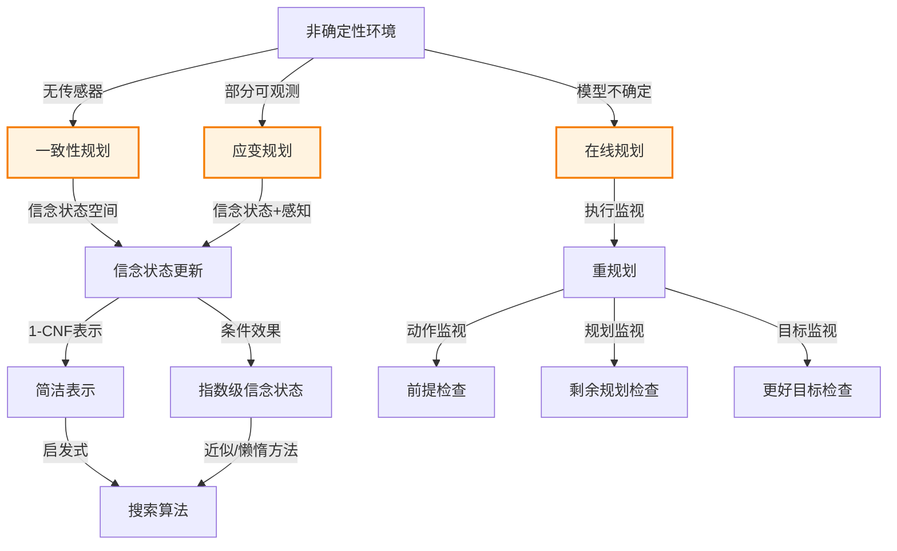

> 📖 本节 Deep Dive | 预计学习时间: 80 分钟

---

## 1. 背景与动机

### 1.1 历史背景

**学科演进脉络**

非确定性规划的研究源于对真实世界复杂性的认识。20世纪90年代，研究者开始关注部分可观测和非确定性环境下的规划问题。Goldman和Boddy于1996年引入了一致性规划（conformant planning）的概念。Smith和Weld于1998年开发了CGP（一致性图规划）系统。进入21世纪，Hoffmann和Brafman等人在信念状态空间搜索方面取得了重要进展。

**里程碑事件**:

| 年份 | 人物/事件 | 贡献 | 影响 |
|------|-----------|------|------|
| 1996 | Goldman & Boddy | 引入一致性规划概念 | 无传感器规划的理论基础 |
| 1998 | Smith & Weld | CGP一致性图规划 | 第一个较高效的一致性规划器 |
| 2000 | Bonet & Geffner | 信念空间启发式搜索 | 将启发式方法扩展到信念空间 |
| 2005 | Hoffmann & Brafman | 应变规划方法 | 处理部分可观测和非确定性 |
| 2007 | Palacios & Geffner | $T_0$规划器 | 2006年IPC一致性规划冠军 |

**演进动机**:
- 早期方法: 经典规划假设完全可观测和确定性
- 局限性: 真实世界存在不确定性、部分可观测性
- 突破: 信念状态表示和搜索使不确定性规划成为可能

### 1.2 研究动机

**为什么研究者关注非确定性规划？**

1. **理论意义**: 不确定性规划连接了经典规划与随机规划（MDP/POMDP）
2. **方法创新**: 信念状态空间的搜索和启发式是AI的重要进展
3. **问题解决**: 使规划系统能够处理真实世界的复杂性

**与其他领域的关系**:
- 与第4章：不确定性搜索
- 与第17章：MDP和POMDP
- 与概率推理：信念更新

### 1.3 实际应用场景

| 应用领域 | 具体问题 | 本节理论的作用 | 预期效果 |
|----------|----------|----------------|----------|
| 机器人学 | 无传感器操作 | 一致性规划 | 无需感知即可完成任务 |
| 制造业 | 故障恢复 | 应变规划 | 根据观测选择行动 |
| 航天器控制 | 在线规划 | 执行监视和重规划 | 处理意外情况 |
| 自动驾驶 | 动态环境 | 在线规划+重规划 | 实时响应变化 |

**典型案例预览**:
> 刷漆问题：给定一把椅子和一张桌子，目标是让它们颜色匹配。智能体不知道油漆颜色，可以通过打开油漆罐并同时刷两件家具来强制达成目标（一致性规划），或者先观察再决定如何刷漆（应变规划）。

### 1.4 先决条件

**学习本节需要的前置知识**:

| 知识项 | 来源 | 掌握程度要求 | 关键概念 |
|--------|------|:------------:|----------|
| 经典规划 | 11.1-11.2节 | 必须熟练掌握 | PDDL、状态转移 |
| 信念状态 | 第4章 | 必须熟练掌握 | 信念状态更新 |
| 与或搜索 | 第4章 | 理解即可 | 条件规划 |
| 逻辑推理 | 第7-9章 | 理解即可 | 蕴含、可满足性 |

**前置检查清单**:
- [ ] 理解PDDL的状态转移
- [ ] 熟悉信念状态的概念
- [ ] 了解与或搜索的基本原理

---

## 2. 知识逻辑图谱

### 2.1 概念关系图



### 2.2 知识发展依赖链

```
【基础层】           【发展层】              【高潮层】             【应用层】
    ↓                   ↓                     ↓                   ↓
┌─────────┐      ┌─────────────┐       ┌───────────┐      ┌──────────┐
│ 经典规划 │ ──→  │ 不确定性扩展 │  ──→  │ 信念状态  │ ──→  │ 实际应用  │
│         │      │             │       │ 搜索      │      │          │
│ 确定性  │      │ 部分可观测  │       │ 启发式    │      │ 机器人   │
│ 完全    │      │ 非确定性    │       │ 近似方法  │      │ 航天器   │
│ 可观测  │      │             │       │           │      │ 自动驾驶 │
└─────────┘      └─────────────┘       └───────────┘      └──────────┘
     │                   │                   │                │
     └───────────────────┴───────────────────┴────────────────┘
                         知识演进脉络
```

### 2.3 本节在章节中的位置

```
第 11 章: 自动规划
├── 11.1-11.4 经典规划 ← 前置知识
│   └── [核心概念: PDDL、状态空间、分层]
│
├── 11.5 非确定性域的规划和行动 ← ⭐ 当前位置
│   ├── [核心概念: 一致性规划、应变规划、在线规划]
│   ├── [核心公式: 信念状态更新]
│   └── [应用: 刷漆问题、真空吸尘器世界]
│
└── 11.6 时间、调度和资源 ← 后续发展
    └── [将本节扩展至: 时间约束]
```

---

## 3. 核心概念与数学分析

### 3.1 核心术语定义

**定义 11.15** (一致性规划 / Conformant Planning):

> **正式定义**: 在没有任何感知的情况下，找到一个能够达成目标的动作序列的规划方法。也称为无传感器规划（sensorless planning）。

**定义详解**:
- **直观解释**: 智能体"盲"执行规划，通过动作效果强制达成目标
- **关键思想**: 使用动作消除不确定性
- **示例**: 打开油漆罐并同时刷两件家具，强制颜色匹配

---

**定义 11.16** (应变规划 / Contingency Planning):

> **正式定义**: 生成包含条件分支的规划，智能体在执行过程中根据感知决定遵循哪个分支。

**定义详解**:
- **直观解释**: "如果-那么-否则"形式的规划
- **适用场景**: 部分可观测、非确定性环境
- **与一致性规划的区别**: 利用感知来指导行动选择

---

**定义 11.17** (信念状态 / Belief State):

> **正式定义**: 智能体可能处于的具体状态集合。在确定性世界中，信念状态用逻辑公式表示。

**定义详解**:
- **表示**: 文字的合取（1-CNF）
- **更新**: $b' = (b - Del(a)) \cup Add(a)$
- **开放世界假设**: 未出现的流值未知

---

**定义 11.18** (条件效果 / Conditional Effect):

> **正式定义**: 效果依赖于当前状态的动作效果，形式为"when condition: effect"。

**定义详解**:
- **语法**: `EFFECT: when condition: effect`
- **语义**: 如果条件满足，则应用效果；否则不改变
- **与前提的区别**: 前提不满足时动作不适用，条件不满足时只是效果不应用

---

**定义 11.19** (执行监视 / Execution Monitoring):

> **正式定义**: 在执行规划时监视环境，检测是否需要重规划的过程。

**类型**:
- **动作监视**: 执行动作前验证前提
- **规划监视**: 验证剩余规划是否仍会成功
- **目标监视**: 检查是否有更好的目标

---

### 3.2 符号系统与约定

**本节符号总表**:

| 符号 | 含义 | 数学表达 | 备注 |
|:----:|------|----------|------|
| $b$ | 信念状态 | 逻辑公式 | 可能世界集合 |
| $Result(b, a)$ | 信念状态更新 | $(b - Del(a)) \cup Add(a)$ | 确定性世界 |
| $\hat{b}$ | 动作后信念状态 | $Result(b, a)$ | 应变规划 |
| $Percept$ | 感知模式 | 感知前提和效果 | 获取信息 |
| $b \models \phi$ | 信念状态蕴含 | - | 公式在所有可能世界为真 |

### 3.3 关键公式与性质

#### 公式 1: 信念状态更新

**数学表述**:
$$b' = Result(b, a) = (b - Del(a)) \cup Add(a)$$

**公式要素解析**:

| 维度 | 内容 |
|------|------|
| **直观解释** | 确定性世界中，信念状态更新与经典规划的状态更新类似，只是操作的是公式而非状态集合 |
| **关键性质** | 1-CNF信念状态在无条件动作下保持1-CNF |
| **问题** | 条件效果可能导致非1-CNF信念状态 |

**使用条件**: 确定性世界，动作前提被信念状态满足

---

#### 公式 2: 应变规划信念更新

**数学表述**:
$$\hat{b} = (b - Del(a)) \cup Add(a)$$
$$b' = \hat{b} \cup PerceptInfo$$

**公式要素解析**:

| 维度 | 内容 |
|------|------|
| **直观解释** | 先计算动作后的信念状态，然后加入感知信息 |
| **感知信息** | 感知前提的析取（如果有多个感知模式可能） |
| **复杂性** | 感知可能导致非1-CNF信念状态 |

---

### 3.4 重要性质与推论

**性质 11.5** (1-CNF信念状态的封闭性):

> **陈述**: 以文字合取定义的信念状态族在PDDL无条件动作模式定义的更新下是封闭的。

**证明概要**: 无条件动作的更新只是添加和删除文字，不会引入新的逻辑连接词。

**推论**: 在有$n$个流的世界里，任何信念状态都可以用规模为$O(n)$的合取来表示，而非显式枚举$2^n$个状态。

---

## 4. 定理与证明

### 4.1 定理陈述

**定理 11.5** (一致性规划的完备性 / Completeness of Conformant Planning):

> **正式陈述**: 对于任何有限确定性无传感器规划问题，如果存在解，则一致性规划算法能在有限时间内找到解。

**定理解读**:
- **条件（前提）**:
  1. 有限状态空间
  2. 确定性动作
  3. 无传感器（无感知）

- **结论**: 存在完备的一致性规划算法

- **定理意义**: 理论上保证了一致性规划的可解性

---

### 4.2 证明详解

**证明策略概览**:

通过证明信念状态空间搜索的完备性来建立一致性规划的完备性。

**核心思路**: 信念状态空间有限，搜索必然终止

**关键步骤预览**:
1. 证明信念状态空间有限
2. 证明搜索算法完备
3. 得出结论

---

**正式证明**:

**步骤 1**: 信念状态空间有限性

在有$n$个流的世界里，可能的信念状态数量为$3^n$（每个流可以为真、为假、或未知）。

因此，信念状态空间是有限的。

**步骤 2**: 搜索算法完备性

在有限状态空间中进行系统搜索（如广度优先搜索），如果存在解，必然能在有限时间内找到。

**步骤 3**: 结论

由于：
- 信念状态空间有限
- 动作集合有限
- 搜索算法完备

因此，一致性规划是完备的。

$$\blacksquare \text{ (证毕)}$$

### 4.3 证明分析与提炼

**核心洞见**: 虽然信念状态空间是指数级的，但1-CNF表示使其紧凑可处理。

**证明技巧总结**:

| 技巧 | 在本证明中的应用 | 可迁移性 | 其他应用场景 |
|------|------------------|----------|--------------|
| 有限性论证 | 证明搜索完备性 | ⭐⭐⭐⭐⭐ | 各种搜索问题 |

---

## 5. 具体示例与详解

### 5.1 典型数值示例

**示例 11.9**: 刷漆问题的一致性规划

**📋 问题陈述**:

- 对象：Table, Chair
- 油漆罐：$Can_1$, $Can_2$
- 初始：不知道油漆颜色，不知道罐子是否打开
- 目标：$Color(Chair, c) \land Color(Table, c)$（颜色相同）

**PDDL描述**:
```
Init: Object(Table) ∧ Object(Chair) ∧ Can(Can_1) ∧ Can(Can_2) ∧ InView(Table)
Goal: Color(Chair, c) ∧ Color(Table, c)

Action(RemoveLid(can),
  PRECOND: Can(can)
  EFFECT: Open(can))

Action(Paint(x, can),
  PRECOND: Object(x) ∧ Can(can) ∧ Color(can, c) ∧ Open(can)
  EFFECT: Color(x, c))
```

**🔍 解答过程**:

**步骤 1: 初始信念状态**

斯科伦化后：
$$b_0 = Color(x, C(x))$$

表示每个对象和罐子都有某种颜色，但不知道具体是什么。

**步骤 2: 执行RemoveLid(Can_1)**

$$b_1 = Color(x, C(x)) \land Open(Can_1)$$

**步骤 3: 执行Paint(Chair, Can_1)**

前提被满足（使用绑定$\{x/Can_1, c/C(Can_1)\}$）

$$b_2 = Color(x, C(x)) \land Open(Can_1) \land Color(Chair, C(Can_1))$$

**步骤 4: 执行Paint(Table, Can_1)**

$$b_3 = Color(x, C(x)) \land Open(Can_1) \land Color(Chair, C(Can_1)) \land Color(Table, C(Can_1))$$

**步骤 5: 验证目标**

通过将变量$c$绑定到$C(Can_1)$，$b_3$满足目标$Color(Chair, c) \land Color(Table, c)$。

**规划解**: $[RemoveLid(Can_1), Paint(Chair, Can_1), Paint(Table, Can_1)]$

---

**✅ 验证与检验**:

**正确性检查**:
- [x] 每个动作的前提在执行时都满足
- [x] 最终信念状态蕴含目标
- [x] 两件家具被刷成相同颜色（同一罐油漆）

**结果的意义**: 展示了无传感器规划的核心思想——通过动作强制达成目标，无需感知。

---

### 5.2 概念辨析示例

**示例 11.10**: 真空吸尘器世界的条件效果

**场景**: 简单真空吸尘器世界，两个方格L和R

**动作模式**:
```
Action(Suck,
  EFFECT: when AtL: CleanL ∧ when AtR: CleanR)
```

**分析**:

初始信念状态：$True$（完全不确定）

应用$Suck$：
- 如果$AtL$为真，则$CleanL$为真
- 如果$AtR$为真，则$CleanR$为真

结果信念状态：
$$b' = (AtL \Rightarrow CleanL) \land (AtR \Rightarrow CleanR)$$

这不是1-CNF！它引入了流之间的依赖关系。

**解决方案**:
1. **保守近似**: 只保留确定为真的文字
2. **寻找简单序列**: 如$[Right, Suck, Left, Suck]$保持1-CNF
3. **懒惰方法**: 不计算完整信念状态，用SAT求解器按需检查

**教训**: 条件效果使信念状态表示复杂化，需要近似方法或特殊处理。

---

### 5.3 类比与可视化

**直觉类比**:

| 抽象概念 | 日常类比 | 对应关系 |
|----------|----------|----------|
| 一致性规划 | 蒙眼走迷宫 | 不感知，靠动作强制 |
| 应变规划 | 根据路标选择方向 | 感知指导决策 |
| 信念状态 | 可能位置的集合 | 我在哪儿的不确定性 |
| 条件效果 | 条件语句 | 如果...那么... |
| 执行监视 | GPS导航重新计算路线 | 偏离计划时重规划 |

**可视化**:

```
一致性规划（无传感器）:

初始信念: {状态1, 状态2, 状态3, 状态4}
    ↓ 动作a
信念1: {状态1', 状态2'}
    ↓ 动作b
信念2: {状态1''}  ← 目标达成！

应变规划（有感知）:

初始信念: {状态1, 状态2, 状态3, 状态4}
    ↓ 动作a
信念1: {状态1', 状态2'}
    ↓ 感知p
    ├─ 如果p=真 → 信念1a: {状态1'}
    └─ 如果p=假 → 信念1b: {状态2'}
    ↓
  根据感知选择不同动作
```

---

## 6. 深入理解与拓展

### 6.1 一句话本质

> 🎯 **核心要点**: 非确定性域的规划通过信念状态表示不确定性，使用一致性规划（无传感器）、应变规划（条件分支）或在线规划（执行监视和重规划）来处理部分可观测性、非确定性和模型不确定性。

### 6.2 深入思考问题

1. **概念层面**: 为什么一致性规划比应变规划更难？
   <!-- 思考方向: 信息获取的缺失 -->

2. **方法层面**: 如何设计好的执行监视策略？
   <!-- 思考方向: 监视粒度与计算代价的权衡 -->

3. **应用层面**: 在什么情况下应该选择在线规划而非预计算应变规划？
   <!-- 思考方向: 环境动态性和计算资源 -->

4. **拓展层面**: 如何将本节方法与第17章的MDP/POMDP方法结合？
   <!-- 思考方向: 概率与非概率不确定性的统一 -->

### 6.3 与其他节的关系

**本节输出**:
- 信念状态表示和更新
- 一致性规划、应变规划、在线规划三种方法
- 执行监视和重规划机制

**后续发展预告**: 
- 11.6节将讨论时间和资源约束
- 第17章将讨论随机环境下的规划（MDP/POMDP）

---

## 7. 总结与反思

### 7.1 关键要点总结

本节必须掌握的 **5** 个核心要点:

1. **一致性规划**: 在无传感器情况下，通过动作强制达成目标
   
   💡 *记忆技巧*: "盲执行，强制达成"

2. **应变规划**: 利用感知进行条件分支选择
   
   💡 *记忆技巧*: "感知引导，条件执行"

3. **信念状态**: 可能世界集合的紧凑表示（1-CNF）
   
   💡 *记忆技巧*: "可能状态的逻辑描述"

4. **条件效果**: 效果依赖于当前状态，使信念状态复杂化
   
   💡 *记忆技巧*: "条件触发，效果可变"

5. **在线规划**: 执行监视和重规划处理意外情况
   
   💡 *记忆技巧*: "边执行，边调整"

### 7.2 本节知识框架

```
┌─────────────────────────────────────────────────────────────┐
│  第11.5节: 非确定性域的规划和行动                            │
├─────────────────────────────────────────────────────────────┤
│  输入/前置                                                   │
│  • 部分可观测环境                                            │
│  • 非确定性动作                                              │
│  • 模型不确定性                                              │
│                                                             │
│  处理/核心                                                   │
│  • 信念状态表示和更新                                        │
│  • 一致性规划（无传感器）                                    │
│  • 应变规划（条件分支）                                      │
│  • 在线规划（执行监视）                                      │
│  ↓                                                          │
│  输出/结果                                                   │
│  • 适应不确定性的规划                                        │
│  • 鲁棒的执行策略                                            │
│                                                             │
│  应用/价值                                                   │
│  • 真实世界机器人应用                                        │
│  • 动态环境适应                                              │
└─────────────────────────────────────────────────────────────┘
```

### 7.3 常见误解与纠正

| 常见误解 ❌ | 正确理解 ✅ | 为什么容易错 | 如何避免 |
|-------------|-------------|--------------|----------|
| ❌ 一致性规划不需要任何信息 | ✅ 一致性规划利用动作效果获取信息 | 混淆感知和动作效果 | 理解动作的信息性 |
| ❌ 应变规划总是优于一致性规划 | ✅ 取决于感知成本和可靠性 | 感知似乎总是好的 | 理解感知代价 |
| ❌ 信念状态必须显式枚举 | ✅ 可以用逻辑公式紧凑表示 | 忽略了1-CNF表示 | 理解因子化表示 |
| ❌ 在线规划不需要预规划 | ✅ 在线规划通常基于预规划框架 | 误解"在线"的含义 | 理解预规划与重规划的结合 |

### 7.4 反思问题

**连接性问题**:
1. 比较本节方法与第4章的不确定性搜索。
2. 如何将11.3节的启发式方法应用于信念状态空间？

**应用性问题**:
1. 设计一个需要一致性规划的实际问题。
2. 分析动作监视、规划监视和目标监视的适用场景。

**批判性问题**:
1. 一致性规划与贝叶斯方法的关系是什么？
2. 在什么情况下在线规划会失败？

### 7.5 学习检查清单

- [x] 理解信念状态的概念和表示
- [x] 能够解释一致性规划的原理
- [x] 理解应变规划的条件分支结构
- [x] 了解在线规划的执行监视机制
- [x] 理解条件效果对信念状态的影响
- [x] 了解1-CNF表示及其局限性

---

## 附录

### A. 公式速查表

| 公式 | 名称 | 使用条件 | 备注 |
|:----:|------|----------|------|
| $b' = (b - Del(a)) \cup Add(a)$ | 信念状态更新 | 确定性世界 | 核心公式 |
| $\hat{b} = Result(b, a)$ | 动作后信念 | 应变规划 | 中间步骤 |
| $b_1 \subseteq b_2 \Rightarrow h^*(b_1) \leq h^*(b_2)$ | 启发式单调性 | 信念状态启发式 | 可容许性基础 |

### B. 术语索引

| 术语 | 英文 | 定义 | 位置 |
|------|------|------|:----:|
| 一致性规划 | Conformant Planning | 无传感器规划 | 11.5 |
| 应变规划 | Contingency Planning | 基于感知的条件规划 | 11.5 |
| 信念状态 | Belief State | 可能世界集合 | 11.5 |
| 条件效果 | Conditional Effect | 依赖于状态的效果 | 11.5 |
| 执行监视 | Execution Monitoring | 执行时的规划监视 | 11.5 |
| 重规划 | Replanning | 偏离计划时重新规划 | 11.5 |

### C. 延伸阅读

**理论深化**:
- Hoffmann, J., & Brafman, R. (2006). Conformant planning via heuristic forward search: A new approach. Artificial Intelligence.

**应用拓展**:
- 第17章：MDP和POMDP

---

> 📌 **下一节**: [11.6 时间、调度和资源](11.6_时间_调度和资源.md)
> 
> 📚 **返回概览**: [第11章概览](00_概览.md)
