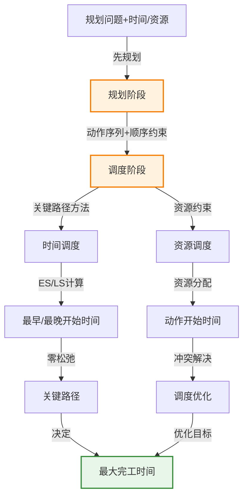

# 11.6 时间、调度和资源

> 📖 本节 Deep Dive | 预计学习时间: 65 分钟

---

## 1. 背景与动机

### 1.1 历史背景

**学科演进脉络**

时间、调度和资源约束的规划研究源于制造业和物流业的实际需求。20世纪80年代，Dean等人解决了规划中的时间表示问题，Tate和Whiter的Nonlin+系统可以处理资源分配。90年代，Sapa和T4规划器使用前向状态空间搜索和启发式处理持续时间和资源。21世纪初，O-Plan等系统将HTN规划与调度结合，应用于实际生产规划。

**里程碑事件**:

| 年份 | 人物/事件 | 贡献 | 影响 |
|------|-----------|------|------|
| 1983 | Vere | Deviser系统 | 率先解决有时间约束的规划 |
| 1984 | Allen | Forbin系统 | 时间表示问题 |
| 1985 | Bell & Tate | O-Plan系统 | HTN规划与调度结合 |
| 1990 | Dean等 | 时间推理 | 规划中的时间约束 |
| 2001 | Do & Kambhampati | Sapa规划器 | 前向搜索+启发式处理资源 |

**演进动机**:
- 早期方法: 经典规划只关注动作顺序，不考虑时间和资源
- 局限性: 真实世界有持续时间、截止时间和资源限制
- 突破: 关键路径方法、资源约束满足、调度算法

### 1.2 研究动机

**为什么研究者关注时间、调度和资源？**

1. **理论意义**: 时间推理和资源分配是约束满足的重要子领域
2. **方法创新**: 将规划与调度结合需要新的算法和技术
3. **问题解决**: 使规划系统能够处理实际工业应用

**与其他领域的关系**:
- 与运筹学: 作业车间调度问题
- 与约束满足: 时间约束和资源约束
- 与项目管理: 关键路径方法（CPM）

### 1.3 实际应用场景

| 应用领域 | 具体问题 | 本节理论的作用 | 预期效果 |
|----------|----------|----------------|----------|
| 制造业 | 汽车装配线调度 | 关键路径方法+资源约束 | 最小化最大完工时间 |
| 航天器 | 深空一号任务调度 | 时间约束+资源分配 | 实时自主控制 |
| 建筑业 | 多层建筑施工规划 | 作业车间调度 | 优化工期和资源使用 |
| 物流 | 航空货运调度 | 先规划后调度 | 高效运输计划 |

**典型案例预览**:
> 两辆汽车装配问题：每个作业包括AddEngine、AddWheels、Inspect三个动作，有发动机吊车、车轮安装站、检查员、凸耳螺母等资源约束。使用关键路径方法和资源调度找到最优调度方案。

### 1.4 先决条件

**学习本节需要的前置知识**:

| 知识项 | 来源 | 掌握程度要求 | 关键概念 |
|--------|------|:------------:|----------|
| 经典规划 | 11.1-11.2节 | 必须熟练掌握 | PDDL、动作序列 |
| 约束满足 | 第6章 | 理解即可 | 约束传播 |
| 动态规划 | 算法基础 | 理解即可 | 最优子结构 |
| 图论 | 数学基础 | 了解 | 有向图、路径 |

**前置检查清单**:
- [ ] 理解PDDL动作序列
- [ ] 熟悉约束满足的基本概念
- [ ] 了解有向图和路径

---

## 2. 知识逻辑图谱

### 2.1 概念关系图



### 2.2 知识发展依赖链

```
【基础层】           【发展层】              【高潮层】             【应用层】
    ↓                   ↓                     ↓                   ↓
┌─────────┐      ┌─────────────┐       ┌───────────┐      ┌──────────┐
│ 动作顺序│ ──→  │ 时间约束    │  ──→  │ 关键路径  │ ──→  │ 最优调度  │
│         │      │             │       │ 方法      │      │          │
│ 经典    │      │ 持续时间    │       │           │      │ 最小化    │
│ 规划    │      │ 截止时间    │       │ 资源约束  │      │ 最大完工  │
│         │      │             │       │ 调度      │      │ 时间      │
└─────────┘      └─────────────┘       └───────────┘      └──────────┘
     │                   │                   │                │
     └───────────────────┴───────────────────┴────────────────┘
                         知识演进脉络
```

### 2.3 本节在章节中的位置

```
第 11 章: 自动规划
├── 11.1-11.5 基础规划 ← 前置知识
│   └── [核心概念: PDDL、搜索、不确定性]
│
├── 11.6 时间、调度和资源 ← ⭐ 当前位置
│   ├── [核心概念: 关键路径、资源约束、调度]
│   ├── [核心公式: ES/LS计算]
│   └── [应用: 作业车间调度]
│
└── 11.7 规划方法分析 ← 后续发展
    └── [总结各种方法]
```

---

## 3. 核心概念与数学分析

### 3.1 核心术语定义

**定义 11.20** (作业车间调度问题 / Job-Shop Scheduling Problem):

> **正式定义**: 由一组作业组成，每个作业有一组动作，这些动作之间有顺序约束。每个动作都有一个持续时间和一组资源约束。

**定义详解**:
- **作业（Job）**: 一组相关动作的集合
- **动作（Action）**: 有持续时间、资源需求和前序约束
- **资源约束**: 资源类型、数量、消耗型/可复用型
- **目标**: 通常是最小化最大完工时间（makespan）

---

**定义 11.21** (关键路径 / Critical Path):

> **正式定义**: 有向图中总持续时间最长的路径，决定了整体规划的持续时间。

**定义详解**:
- **关键性**: 延迟关键路径上的任何动作都会延迟整体规划
- **非关键路径**: 缩短不会缩短整体规划，但提供松弛时间
- **计算**: 使用动态规划计算最早开始时间（ES）和最晚开始时间（LS）

---

**定义 11.22** (松弛时间 / Slack):

> **正式定义**: 动作可以延迟而不影响整体规划的时间量，$Slack = LS - ES$。

**定义详解**:
- **零松弛**: 动作在关键路径上
- **正松弛**: 动作有执行时间窗口
- **用途**: 资源调度和优化

---

**定义 11.23** (资源聚合 / Aggregation):

> **正式定义**: 当对象无法区分时，将单个对象分组为数量表示，而非有名实体。

**定义详解**:
- **目的**: 降低复杂性
- **示例**: 用$Inspectors(2)$而非$Inspector(I_1) \land Inspector(I_2)$
- **优势**: 快速检测资源冲突，避免组合爆炸

---

### 3.2 符号系统与约定

**本节符号总表**:

| 符号 | 含义 | 数学表达 | 备注 |
|:----:|------|----------|------|
| $ES(A)$ | 最早开始时间 | - | 动态规划计算 |
| $LS(A)$ | 最晚开始时间 | - | 动态规划计算 |
| $Duration(A)$ | 动作持续时间 | - | 问题给定 |
| $Slack(A)$ | 松弛时间 | $LS(A) - ES(A)$ | 调度灵活性 |
| $Makespan$ | 最大完工时间 | $ES(Finish)$ | 优化目标 |
| $A \prec B$ | 顺序约束 | $A$在$B$之前 | 偏序关系 |

### 3.3 关键公式与性质

#### 公式 1: 最早开始时间（ES）计算

**数学表述**:
$$ES(Start) = 0$$
$$ES(B) = \max_{A \prec B} ES(A) + Duration(A)$$

**公式要素解析**:

| 维度 | 内容 |
|------|------|
| **直观解释** | 动作的最早开始时间是其所有前序动作最早完成时间的最大值 |
| **计算方向** | 从Start向前计算（正向动态规划） |
| **复杂度** | $O(Nb)$，其中$N$为动作数，$b$为最大分支因子 |

---

#### 公式 2: 最晚开始时间（LS）计算

**数学表述**:
$$LS(Finish) = ES(Finish)$$
$$LS(A) = \min_{B \succ A} LS(B) - Duration(A)$$

**公式要素解析**:

| 维度 | 内容 |
|------|------|
| **直观解释** | 动作的最晚开始时间是不能延迟其后继动作的时间 |
| **计算方向** | 从Finish向后计算（反向动态规划） |
| **用途** | 计算松弛时间和识别关键路径 |

---

### 3.4 重要性质与推论

**性质 11.6** (关键路径的单调性):

> **陈述**: 缩短非关键路径上的动作不会缩短整体规划的持续时间。

**证明概要**: 由关键路径定义，整体持续时间由关键路径决定，非关键路径有松弛时间。

**推论**: 优化应聚焦于关键路径上的动作。

---

## 4. 定理与证明

### 4.1 定理陈述

**定理 11.6** (关键路径方法的正确性 / Correctness of Critical Path Method):

> **正式陈述**: 关键路径方法计算出的ES和LS时间给出了满足所有顺序约束的最小持续时间调度。

**定理解读**:
- **条件（前提）**:
  1. 动作持续时间是确定的
  2. 只有顺序约束，无资源约束

- **结论**: CPM计算出最优调度（最小makespan）

- **定理意义**: 提供了无资源约束时的高效最优算法

---

### 4.2 证明详解

**证明策略概览**:

通过动态规划的最优子结构证明ES和LS计算的正确性。

**核心思路**: 动态规划最优性

**关键步骤预览**:
1. 证明ES计算的正确性
2. 证明LS计算的正确性
3. 证明最优性

---

**正式证明**:

**步骤 1**: ES计算的正确性

对于任意动作$B$，其最早开始时间必须满足：
- 不小于Start时间（0）
- 不小于任何前序动作$A$的最早完成时间$ES(A) + Duration(A)$

因此，$ES(B) = \max_{A \prec B} ES(A) + Duration(A)$是正确的。

**步骤 2**: LS计算的正确性

对于任意动作$A$，其最晚开始时间必须满足：
- 不延迟Finish时间（即$ES(Finish)$）
- 不延迟任何后继动作$B$的最晚开始时间$LS(B)$

因此，$LS(A) = \min_{B \succ A} LS(B) - Duration(A)$是正确的。

**步骤 3**: 最优性

由ES的定义，$ES(Finish)$是满足所有顺序约束的最早完成时间，因此是最小makespan。

$$\blacksquare \text{ (证毕)}$$

### 4.3 证明分析与提炼

**核心洞见**: 关键路径方法利用了问题的最优子结构，通过动态规划高效求解。

**证明技巧总结**:

| 技巧 | 在本证明中的应用 | 可迁移性 | 其他应用场景 |
|------|------------------|----------|--------------|
| 动态规划 | 利用最优子结构 | ⭐⭐⭐⭐⭐ | 各种优化问题 |
| 正向/反向计算 | 分别计算ES和LS | ⭐⭐⭐⭐ | 网络流等问题 |

---

## 5. 具体示例与详解

### 5.1 典型数值示例

**示例 11.11**: 两辆汽车装配调度

**📋 问题陈述**:

两个作业：
- 作业1: $[AddEngine_1 \prec AddWheels_1 \prec Inspect_1]$
- 作业2: $[AddEngine_2 \prec AddWheels_2 \prec Inspect_2]$

资源：
- $EngineHoists(1)$
- $WheelStations(1)$
- $Inspectors(2)$
- $LugNuts(500)$

动作持续时间：
- $AddEngine_1$: 30分钟
- $AddEngine_2$: 60分钟
- $AddWheels_1$: 30分钟
- $AddWheels_2$: 15分钟
- $Inspect$: 10分钟

**🔍 解答过程**:

**步骤 1: 无资源约束的关键路径分析**

计算ES（正向）：
- $ES(Start) = 0$
- $ES(AddEngine_1) = 0$
- $ES(AddEngine_2) = 0$
- $ES(AddWheels_1) = ES(AddEngine_1) + 30 = 30$
- $ES(AddWheels_2) = ES(AddEngine_2) + 60 = 60$
- $ES(Inspect_1) = ES(AddWheels_1) + 30 = 60$
- $ES(Inspect_2) = ES(AddWheels_2) + 15 = 75$
- $ES(Finish) = \max(60+10, 75+10) = 85$

计算LS（反向）：
- $LS(Finish) = 85$
- $LS(Inspect_1) = 85 - 10 = 75$
- $LS(Inspect_2) = 85 - 10 = 75$
- $LS(AddWheels_1) = 75 - 30 = 45$
- $LS(AddWheels_2) = 75 - 15 = 60$
- $LS(AddEngine_1) = 45 - 30 = 15$
- $LS(AddEngine_2) = 60 - 60 = 0$

**步骤 2: 关键路径识别**

零松弛动作：$AddEngine_2, AddWheels_2, Inspect_2$

关键路径：$Start \rightarrow AddEngine_2 \rightarrow AddWheels_2 \rightarrow Inspect_2 \rightarrow Finish$

关键路径长度：85分钟

**步骤 3: 资源约束调度**

考虑资源冲突：
- $AddEngine_1$和$AddEngine_2$都需要$EngineHoists(1)$
- 不能同时进行

解决方案：
- 先调度$AddEngine_2$（关键路径上）
- $AddEngine_1$在$AddEngine_2$完成后开始（时间60）
- 这会导致$AddEngine_1$在60开始，90完成
- 整体完成时间变为$\max(90+30+10, 60+15+10) = 130$？

优化：
- 先调度$AddEngine_1$（0-30）
- 再调度$AddEngine_2$（30-90）
- $AddWheels_2$在90开始，105完成
- $Inspect_2$在105开始，115完成

最优调度：115分钟

---

**✅ 验证与检验**:

**正确性检查**:
- [x] 所有顺序约束满足
- [x] 资源约束满足（无冲突）
- [x] 目标是最小化makespan

**结果的意义**: 资源约束使完工时间从85分钟增加到115分钟，展示了资源约束的重要性。

---

### 5.2 概念辨析示例

**示例 11.12**: 最小松弛启发式

**场景**: 资源约束调度问题

**启发式**: 在每次迭代中，在尚未被调度的动作中调度尽可能早开始的动作，这个动作的前驱动作均已被调度并且有最小的松弛时间。

**分析**:

与约束满足中的最小剩余值（MRV）启发式类似。

**优点**:
- 优先调度关键路径上的动作（零松弛）
- 减少资源冲突对关键路径的影响

**缺点**:
- 对于装配问题，给出了130分钟的解，而非最优的115分钟
- 贪心策略可能陷入局部最优

**教训**: 启发式方法实用但不保证最优，需要权衡计算时间和解质量。

---

### 5.3 类比与可视化

**直觉类比**:

| 抽象概念 | 日常类比 | 对应关系 |
|----------|----------|----------|
| 关键路径 | 项目的关键任务链 | 任何延迟都会延迟项目 |
| 松弛时间 | 缓冲时间 | 可以延迟而不影响整体 |
| 资源约束 | 共享设备 | 不能同时使用 |
| 调度 | 时间表 | 每个动作的开始时间 |
| makespan | 项目总工期 | 从开始到结束的时间 |

**可视化**:

```
时间线图（无资源约束）：

时间:  0    30   60   75   85
       |----|----|----|----|
Job1:  [AddE1][AddW1][Insp1]
Job2:  [AddE2    ][AddW2][Insp2]
              关键路径

时间线图（有资源约束）：

时间:  0    30   60   90  105  115
       |----|----|----|----|----|
Job1:  [AddE1][AddW1      ][Insp1]
Job2:       [AddE2    ][AddW2][Insp2]
       资源冲突解决
```

---

## 6. 深入理解与拓展

### 6.1 一句话本质

> 🎯 **核心要点**: 时间、调度和资源规划通过关键路径方法处理时间约束，通过资源分配算法解决资源冲突，将"先规划后调度"或"整合规划调度"方法应用于实际工业问题。

### 6.2 深入思考问题

1. **概念层面**: 为什么资源约束使调度问题变为NP困难？
   <!-- 思考方向: 析取约束的复杂性 -->

2. **方法层面**: 比较"先规划后调度"与"整合规划调度"的优缺点？
   <!-- 思考方向: 计算复杂性与解质量 -->

3. **应用层面**: 在什么情况下资源聚合特别有效？
   <!-- 思考方向: 可区分性与计算复杂性 -->

4. **拓展层面**: 如何将概率持续时间引入调度？
   <!-- 思考方向: 随机调度问题 -->

### 6.3 与其他节的关系

**本节输出**:
- 时间约束表示和处理
- 关键路径方法
- 资源约束调度
- 作业车间调度问题

**后续发展预告**: 
- 11.7节将分析各种规划方法的有效性

---

## 7. 总结与反思

### 7.1 关键要点总结

本节必须掌握的 **5** 个核心要点:

1. **作业车间调度**: 动作有持续时间和资源约束的调度问题
   
   💡 *记忆技巧*: "时间+资源，双重约束"

2. **关键路径方法**: 计算ES和LS，识别关键路径
   
   💡 *记忆技巧*: "正向算最早，反向算最晚"

3. **松弛时间**: $Slack = LS - ES$，零松弛动作在关键路径上
   
   💡 *记忆技巧*: "松弛为零，关键路径"

4. **资源约束**: 使调度问题变为NP困难，需要启发式方法
   
   💡 *记忆技巧*: "资源冲突，难度陡增"

5. **先规划后调度**: 分离规划和调度阶段，实际工业常用
   
   💡 *记忆技巧*: "先定顺序，再排时间"

### 7.2 本节知识框架

```
┌─────────────────────────────────────────────────────────────┐
│  第11.6节: 时间、调度和资源                                  │
├─────────────────────────────────────────────────────────────┤
│  输入/前置                                                   │
│  • 动作持续时间                                              │
│  • 顺序约束                                                  │
│  • 资源约束                                                  │
│                                                             │
│  处理/核心                                                   │
│  • 关键路径方法（CPM）                                       │
│  • 资源约束调度                                              │
│  • 启发式方法（最小松弛）                                    │
│  ↓                                                          │
│  输出/结果                                                   │
│  • 动作开始时间安排                                          │
│  • 最小化最大完工时间                                        │
│                                                             │
│  应用/价值                                                   │
│  • 制造业生产调度                                            │
│  • 项目管理                                                  │
│  • 航天器任务规划                                            │
└─────────────────────────────────────────────────────────────┘
```

### 7.3 常见误解与纠正

| 常见误解 ❌ | 正确理解 ✅ | 为什么容易错 | 如何避免 |
|-------------|-------------|--------------|----------|
| ❌ 关键路径方法可以处理资源约束 | ✅ CPM只处理时间约束，资源约束需要额外算法 | 混淆时间约束和资源约束 | 理解CPM的适用范围 |
| ❌ 松弛时间可以任意使用 | ✅ 使用松弛时间可能影响其他动作的调度 | 忽略了资源约束 | 理解松弛的真正含义 |
| ❌ 先规划后调度总是最优 | ✅ 分离规划和调度可能导致次优解 | 简化方法的误导 | 理解整合调度的必要性 |
| ❌ 资源聚合总是好的 | ✅ 聚合会丢失个体信息 | 过度简化 | 理解聚合的适用条件 |

### 7.4 反思问题

**连接性问题**:
1. 如何将11.3节的启发式方法应用于资源约束调度？
2. 比较本节方法与运筹学中的调度方法。

**应用性问题**:
1. 设计一个实际的生产调度问题并求解。
2. 分析关键路径方法在项目管理的应用。

**批判性问题**:
1. 在什么情况下应该使用整合规划调度而非先规划后调度？
2. 如何处理不确定的持续时间？

### 7.5 学习检查清单

- [x] 理解作业车间调度问题的定义
- [x] 能够计算ES和LS时间
- [x] 能够识别关键路径
- [x] 理解资源约束的影响
- [x] 了解最小松弛启发式
- [x] 理解先规划后调度的方法

---

## 附录

### A. 公式速查表

| 公式 | 名称 | 使用条件 | 备注 |
|:----:|------|----------|------|
| $ES(B) = \max_{A \prec B} ES(A) + Duration(A)$ | 最早开始时间 | 无资源约束 | 正向DP |
| $LS(A) = \min_{B \succ A} LS(B) - Duration(A)$ | 最晚开始时间 | 无资源约束 | 反向DP |
| $Slack(A) = LS(A) - ES(A)$ | 松弛时间 | - | 关键路径识别 |

### B. 术语索引

| 术语 | 英文 | 定义 | 位置 |
|------|------|------|:----:|
| 作业车间调度 | Job-Shop Scheduling | 有时间和资源约束的调度问题 | 11.6 |
| 关键路径 | Critical Path | 总持续时间最长的路径 | 11.6 |
| 松弛时间 | Slack | $LS - ES$ | 11.6 |
| 最大完工时间 | Makespan | 规划总持续时间 | 11.6 |
| 资源聚合 | Aggregation | 将个体分组为数量 | 11.6 |

### C. 延伸阅读

**理论深化**:
- Lawler, E. L., et al. (1993). Sequencing and scheduling: Algorithms and complexity. Handbooks in OR & MS.

**应用拓展**:
- Pinedo, M. (2008). Scheduling: Theory, Algorithms, and Systems. Springer.

---

> 📌 **下一节**: [11.7 规划方法分析](11.7_规划方法分析.md)
> 
> 📚 **返回概览**: [第11章概览](00_概览.md)
