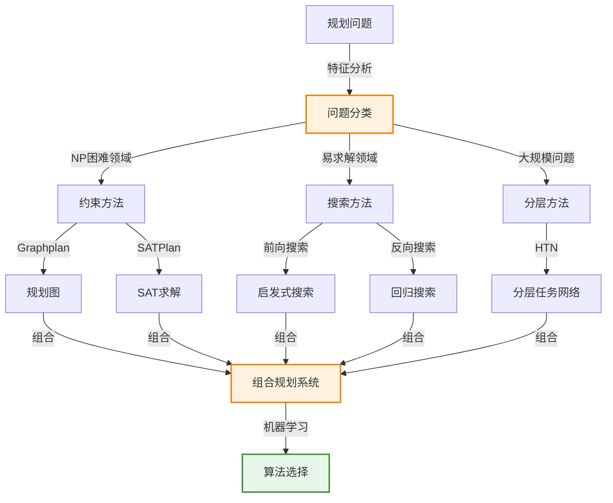

# 11.7 规划方法分析

> 📖 本节 Deep Dive | 预计学习时间: 50 分钟

---

## 1. 背景与动机

### 1.1 历史背景

**学科演进脉络**

规划方法的分析和比较是规划研究的重要组成部分。20世纪90年代，Bylander等人分析了规划问题的计算复杂性，证明了经典规划的PSPACE完全性。21世纪初，Helmert对不同规划方法进行了系统比较，发现基于约束的方法（如Graphplan和SATPlan）适合NP困难领域，而基于搜索的方法在无需回溯的领域表现更好。近年来，组合规划系统（如FDSS）通过机器学习选择最佳算法。

**里程碑事件**:

| 年份 | 人物/事件 | 贡献 | 影响 |
|------|-----------|------|------|
| 1994 | Bylander | 规划复杂性分析 | PlanSAT和Bounded PlanSAT的PSPACE完全性 |
| 2001 | Helmert | 规划方法比较 | 约束方法vs搜索方法的适用性 |
| 2011 | Helmert等 | FDSS组合规划系统 | 机器学习选择算法 |
| 2015 | Seipp等 | 算法组合学习 | 自动学习算法组合 |
| 2018 | Seipp & Röger | FDSS赢得IPC | 组合规划系统的成功 |

**演进动机**:
- 早期方法: 单一算法试图解决所有问题
- 局限性: 不同问题类型适合不同算法
- 突破: 组合规划系统根据问题特征选择最佳算法

### 1.2 研究动机

**为什么研究者关注规划方法分析？**

1. **理论意义**: 理解不同方法的适用边界和复杂性
2. **方法创新**: 组合规划系统代表了AI系统设计的范式转变
3. **问题解决**: 为实际应用选择合适的方法提供指导

**与其他领域的关系**:
- 与复杂性理论: 计算复杂性分析
- 与机器学习: 算法选择和学习
- 与系统科学: 组合优化

### 1.3 实际应用场景

| 应用领域 | 具体问题 | 本节理论的作用 | 预期效果 |
|----------|----------|----------------|----------|
| 规划竞赛 | IPC问题求解 | 算法组合选择 | 最佳整体性能 |
| 工业应用 | 实际规划问题 | 方法选择指导 | 高效求解 |
| 研究指导 | 新算法设计 | 理解现有方法 | 针对性改进 |
| 教学 | 规划课程 | 方法比较框架 | 系统理解 |

**典型案例预览**:
> FDSS（Fast Downward Stone Soup）系统：维护一组训练问题，记录每个问题和每个算法的运行时间和解质量。遇到新问题时，使用过去经验决定尝试哪种算法，并采取代价最小的解决方案。FDSS赢得了2018年国际规划竞赛。

### 1.4 先决条件

**学习本节需要的前置知识**:

| 知识项 | 来源 | 掌握程度要求 | 关键概念 |
|--------|------|:------------:|----------|
| 各种规划方法 | 11.1-11.6节 | 必须熟练掌握 | 搜索、SAT、HTN等 |
| 计算复杂性 | 算法基础 | 理解即可 | PSPACE、NP |
| 机器学习 | 第19-21章 | 了解 | 算法选择 |

**前置检查清单**:
- [ ] 了解各种规划算法的基本原理
- [ ] 理解计算复杂性的基本概念
- [ ] 熟悉机器学习的基本思想

---

## 2. 知识逻辑图谱

### 2.1 概念关系图



### 2.2 知识发展依赖链

```
【基础层】           【发展层】              【高潮层】             【应用层】
    ↓                   ↓                     ↓                   ↓
┌─────────┐      ┌─────────────┐       ┌───────────┐      ┌──────────┐
│ 单一算法 │ ──→  │ 方法比较    │  ──→  │ 组合系统  │ ──→  │ 智能选择  │
│         │      │             │       │           │      │          │
│ 通用    │      │ 适用性分析  │       │ 多算法    │      │ 机器学习  │
│ 求解器  │      │ 复杂性分析  │       │ 集成      │      │ 自动选择  │
└─────────┘      └─────────────┘       └───────────┘      └──────────┘
     │                   │                   │                │
     └───────────────────┴───────────────────┴────────────────┘
                         知识演进脉络
```

### 2.3 本节在章节中的位置

```
第 11 章: 自动规划
├── 11.1-11.6 各种规划方法 ← 前置知识
│   └── [核心概念: PDDL、搜索、HTN、调度等]
│
└── 11.7 规划方法分析 ← ⭐ 当前位置
    ├── [核心概念: 复杂性分析、方法比较、组合系统]
    ├── [核心公式: 复杂性类关系]
    └── [应用: 算法选择、FDSS系统]
```

---

## 3. 核心概念与数学分析

### 3.1 核心术语定义

**定义 11.24** (PlanSAT):

> **正式定义**: 判定是否存在能解决给定规划问题的规划的问题。

**定义详解**:
- **复杂性类**: PSPACE完全
- **与Bounded PlanSAT的区别**: Bounded PlanSAT要求解长度$\leq k$
- **可判定性**: 对于有限状态空间是可判定的

---

**定义 11.25** (PSPACE):

> **正式定义**: 可以用多项式空间的确定性图灵机解决的问题类。

**定义详解**:
- **与NP的关系**: PSPACE $\supseteq$ NP
- **含义**: 比NP更大（更困难）
- **实际意义**: 理论上困难，但实际问题往往可解

---

**定义 11.26** (组合规划系统 / Portfolio Planner):

> **正式定义**: 维护一组算法，根据问题特征选择或并行运行多个算法的规划系统。

**定义详解**:
- **选择性**: 对每个新问题分类选择最佳算法
- **并行性**: 同时在多个CPU上运行所有算法
- **调度性**: 根据调度轮流运行算法

---

**定义 11.27** (算法选择 / Algorithm Selection):

> **正式定义**: 使用机器学习方法对给定新问题自动学习或选择好的算法组合。

**定义详解**:
- **训练阶段**: 记录每个问题和每个算法的运行时间和解质量
- **预测阶段**: 使用过去经验决定尝试哪种算法
- **目标**: 最小化总体求解时间或最大化解质量

---

### 3.2 符号系统与约定

**本节符号总表**:

| 符号 | 含义 | 备注 |
|:----:|------|------|
| PlanSAT | 规划存在性问题 | PSPACE完全 |
| Bounded PlanSAT | 有界规划存在性问题 | PSPACE完全 |
| PSPACE | 多项式空间复杂性类 | 包含NP |
| FDSS | Fast Downward Stone Soup | 组合规划系统 |

### 3.3 关键公式与性质

#### 公式 1: 复杂性类关系

**数学表述**:
$$NP \subseteq PSPACE$$
$$PlanSAT \in PSPACE\text{-complete}$$

**公式要素解析**:

| 维度 | 内容 |
|------|------|
| **直观解释** | 规划问题是PSPACE完全的，比NP问题更困难 |
| **实际意义** | 理论上困难，但实际问题往往有结构可利用 |
| **应对策略** | 领域无关启发式、问题分解、近似算法 |

---

### 3.4 重要性质与推论

**性质 11.7** (方法适用性):

> **陈述**: 
> - 基于约束的方法（Graphplan、SATPlan）最适合NP困难领域
> - 基于搜索的方法在无需回溯就能找到可行解的领域表现更好
> - Graphplan和SATPlan在包含许多对象的领域中面临问题（需要创建许多动作）

**推论**: 没有 universally 最好的方法，需要根据问题特征选择。

---

## 4. 定理与证明

### 4.1 定理陈述

**定理 11.7** (经典规划的PSPACE完全性 / PSPACE-Completeness of Classical Planning):

> **正式陈述**: PlanSAT（判定是否存在能解决规划问题的规划）和Bounded PlanSAT（判定是否存在长度$\leq k$的解）对于经典规划都是PSPACE完全的。

**定理解读**:
- **条件（前提）**:
  1. 命题化规划问题（有限状态空间）
  2. 经典规划假设（确定性、完全可观测等）

- **结论**: PlanSAT和Bounded PlanSAT都是PSPACE完全的

- **定理意义**: 确立了经典规划问题的理论复杂性边界

---

### 4.2 证明详解

**证明策略概览**:

通过将已知PSPACE完全问题（如TQBF）归约到PlanSAT来证明PSPACE困难性，然后证明PlanSAT在PSPACE中。

**核心思路**: 复杂性归约

**关键步骤预览**:
1. 证明PlanSAT在PSPACE中
2. 证明PlanSAT是PSPACE困难的
3. 得出PSPACE完全性

---

**正式证明**:

**步骤 1**: PlanSAT在PSPACE中

对于有限状态空间，状态数量有限。使用非确定性图灵机：
- 猜测一个动作序列
- 验证该序列是否从初始状态到达目标状态

这只需要多项式空间（存储当前状态和计数器）。

因此，PlanSAT $\in$ NPSPACE = PSPACE（由Savitch定理）。

**步骤 2**: PlanSAT是PSPACE困难的

通过将TQBF（真量化布尔公式）问题归约到PlanSAT来证明。

TQBF是PSPACE完全的。构造从TQBF实例到规划问题的映射：
- 布尔变量对应规划中的流
- 量词对应非确定性选择
- 公式满足性对应目标达成

详细构造见Bylander (1994)。

**步骤 3**: 结论

PlanSAT既在PSPACE中，又是PSPACE困难的，因此是PSPACE完全的。

Bounded PlanSAT的PSPACE完全性类似可证。

$$\blacksquare \text{ (证毕)}$$

### 4.3 证明分析与提炼

**核心洞见**: 虽然规划问题是PSPACE完全的，但领域无关启发式的发展使实际问题可解。

**证明技巧总结**:

| 技巧 | 在本证明中的应用 | 可迁移性 | 其他应用场景 |
|------|------------------|----------|--------------|
| 复杂性归约 | 从TQBF归约 | ⭐⭐⭐⭐⭐ | 复杂性证明 |
| Savitch定理 | NPSPACE = PSPACE | ⭐⭐⭐⭐ | 空间复杂性 |

---

## 5. 具体示例与详解

### 5.1 典型数值示例

**示例 11.13**: FDSS系统的工作原理

**📋 问题陈述**:

FDSS（Fast Downward Stone Soup）系统如何工作？

**🔍 解答过程**:

**步骤 1: 训练阶段**

维护一组训练问题，对于每个问题和每个算法，记录：
- 运行时间
- 产生的解规划的代价

**步骤 2: 预测阶段**

遇到新问题时：
1. 提取问题特征
2. 使用过去经验预测每个算法的性能
3. 决定尝试哪种或哪些算法
4. 决定在什么时间限制下运行

**步骤 3: 执行**

- 选择性: 运行预测的 best 算法
- 并行性: 同时在多个CPU上运行多个算法
- 调度性: 轮流运行算法

**步骤 4: 结果选择**

采取代价最小的解决方案（考虑运行时间和解质量）。

---

**✅ 验证与检验**:

**正确性检查**:
- [x] 训练数据收集完整
- [x] 预测模型有效
- [x] 执行策略合理

**结果的意义**: FDSS赢得了2018年国际规划竞赛，证明了组合规划系统的有效性。

---

### 5.2 概念辨析示例

**示例 11.14**: 不同规划方法的适用场景

**场景分析**:

| 问题特征 | 推荐方法 | 原因 |
|----------|----------|------|
| 许多对象，复杂约束 | SATPlan/Graphplan | 约束传播有效 |
| 易求解，无需回溯 | 前向搜索+启发式 | 搜索效率高 |
| 大规模，层次结构 | HTN规划 | 分层降低复杂度 |
| 部分可观测 | 信念状态搜索 | 处理不确定性 |
| 时间和资源约束 | 调度算法 | 专门优化 |

**教训**: 方法选择应基于问题特征，而非盲目追求单一最佳方法。

---

### 5.3 类比与可视化

**直觉类比**:

| 抽象概念 | 日常类比 | 对应关系 |
|----------|----------|----------|
| 组合规划系统 | 工具箱 | 根据任务选择工具 |
| 算法选择 | 医生诊断 | 根据症状选择治疗方案 |
| 复杂性类 | 难度等级 | 问题解决的难易程度 |
| PSPACE | 高难度 | 需要大量记忆空间 |
| NP | 中等难度 | 验证容易求解难 |

**可视化**:

```
复杂性类层次：

    PSPACE
    /    \
   NP    co-NP
   / \
  P   NPC

规划问题位置：
  PlanSAT ∈ PSPACE-complete

方法选择决策树：

问题特征分析
    |
    ├─ 许多对象？
    │   ├─ 是 → SATPlan/Graphplan
    │   └─ 否 → 继续
    |
    ├─ 层次结构？
    │   ├─ 是 → HTN规划
    │   └─ 否 → 继续
    |
    ├─ 部分可观测？
    │   ├─ 是 → 信念状态搜索
    │   └─ 否 → 继续
    |
    └─ 前向搜索+启发式
```

---

## 6. 深入理解与拓展

### 6.1 一句话本质

> 🎯 **核心要点**: 规划方法分析通过计算复杂性理论确立问题的理论边界，通过方法比较理解不同算法的适用场景，通过组合规划系统实现智能算法选择，从而在实际应用中高效求解各种规划问题。

### 6.2 深入思考问题

1. **概念层面**: 为什么PSPACE完全性不意味着规划问题在实际中不可解？
   <!-- 思考方向: 最坏情况vs平均情况，问题结构 -->

2. **方法层面**: 如何设计好的问题特征用于算法选择？
   <!-- 思考方向: 特征工程与预测性能 -->

3. **应用层面**: 在什么情况下并行运行多个算法优于选择性运行？
   <!-- 思考方向: 计算资源与时间的权衡 -->

4. **拓展层面**: 如何将组合规划思想扩展到其他AI问题？
   <!-- 思考方向: 算法组合的一般框架 -->

### 6.3 与其他节的关系

**本节输出**:
- 规划问题的复杂性分析
- 各种规划方法的适用性比较
- 组合规划系统的概念和实现

**后续发展**:
- 第17章将讨论随机规划（MDP/POMDP）
- 第22章将讨论强化学习

---

## 7. 总结与反思

### 7.1 关键要点总结

本节必须掌握的 **5** 个核心要点:

1. **复杂性**: PlanSAT是PSPACE完全的，比NP更困难
   
   💡 *记忆技巧*: "规划难，PSPACE"

2. **方法适用性**: 约束方法适合NP困难领域，搜索方法适合易求解领域
   
   💡 *记忆技巧*: "难用约束，易用搜索"

3. **组合规划**: 维护多种算法，根据问题特征选择
   
   💡 *记忆技巧*: "多算法，智能选"

4. **算法选择**: 使用机器学习预测算法性能
   
   💡 *记忆技巧*: "学习预测，自动选择"

5. **实际可解性**: 理论困难不意味着实际不可解，领域无关启发式使实际问题可解
   
   💡 *记忆技巧*: "理论难，实际可"

### 7.2 本节知识框架

```
┌─────────────────────────────────────────────────────────────┐
│  第11.7节: 规划方法分析                                      │
├─────────────────────────────────────────────────────────────┤
│  输入/前置                                                   │
│  • 各种规划方法                                              │
│  • 规划问题实例                                              │
│                                                             │
│  处理/核心                                                   │
│  • 复杂性分析                                                │
│  • 方法比较                                                  │
│  • 组合规划                                                  │
│  ↓                                                          │
│  输出/结果                                                   │
│  • 理论边界理解                                              │
│  • 方法选择指导                                              │
│                                                             │
│  应用/价值                                                   │
│  • 实际系统构建                                              │
│  • 算法设计指导                                              │
└─────────────────────────────────────────────────────────────┘
```

### 7.3 常见误解与纠正

| 常见误解 ❌ | 正确理解 ✅ | 为什么容易错 | 如何避免 |
|-------------|-------------|--------------|----------|
| ❌ PSPACE完全意味着规划问题不可解 | ✅ 实际问题往往有结构，可以有效求解 | 混淆理论最坏情况和实际情况 | 理解启发式的作用 |
| ❌ 有一种 universally 最好的规划算法 | ✅ 不同问题适合不同算法 | 追求通用解决方案 | 理解问题特征的重要性 |
| ❌ 组合规划系统总是优于单一算法 | ✅ 有额外开销，需要权衡 | 理想化组合方法 | 理解组合的成本 |
| ❌ 复杂性分析对实践没有价值 | ✅ 指导算法设计和预期管理 | 过于关注理论负面结果 | 理解理论指导作用 |

### 7.4 反思问题

**连接性问题**:
1. 如何将本节分析与第3章的搜索复杂性分析联系？
2. 比较组合规划系统与集成学习方法。

**应用性问题**:
1. 设计一个简单的问题特征集用于算法选择。
2. 分析FDSS的训练数据需求。

**批判性问题**:
1. 算法选择本身有多困难？
2. 在什么情况下组合规划系统会失败？

### 7.5 学习检查清单

- [x] 理解PlanSAT和Bounded PlanSAT的PSPACE完全性
- [x] 理解PSPACE与NP的关系
- [x] 了解不同规划方法的适用场景
- [x] 理解组合规划系统的概念
- [x] 了解算法选择的基本思想
- [x] 了解FDSS系统的工作原理

---

## 附录

### A. 公式速查表

| 公式/关系 | 名称 | 备注 |
|:----:|------|------|
| $NP \subseteq PSPACE$ | 复杂性类包含 | PSPACE更大 |
| PlanSAT $\in$ PSPACE-complete | 规划复杂性 | 理论边界 |

### B. 术语索引

| 术语 | 英文 | 定义 | 位置 |
|------|------|------|:----:|
| PlanSAT | - | 规划存在性问题 | 11.7 |
| Bounded PlanSAT | - | 有界规划存在性问题 | 11.7 |
| PSPACE | - | 多项式空间复杂性类 | 11.7 |
| 组合规划系统 | Portfolio Planner | 多算法集成系统 | 11.7 |
| 算法选择 | Algorithm Selection | 自动选择最佳算法 | 11.7 |
| FDSS | Fast Downward Stone Soup | 具体组合规划系统 | 11.7 |

### C. 延伸阅读

**理论深化**:
- Bylander, T. (1994). The computational complexity of propositional STRIPS planning. Artificial Intelligence.
- Helmert, M. (2001). On the complexity of planning in transportation domains. ECP.

**应用拓展**:
- Seipp, J., et al. (2015). Automatic algorithm configuration for planning based on learned classifier. ICAPS.

---

> 📌 **本章结束**> 
> 📚 **返回概览**: [第11章概览](00_概览.md)
