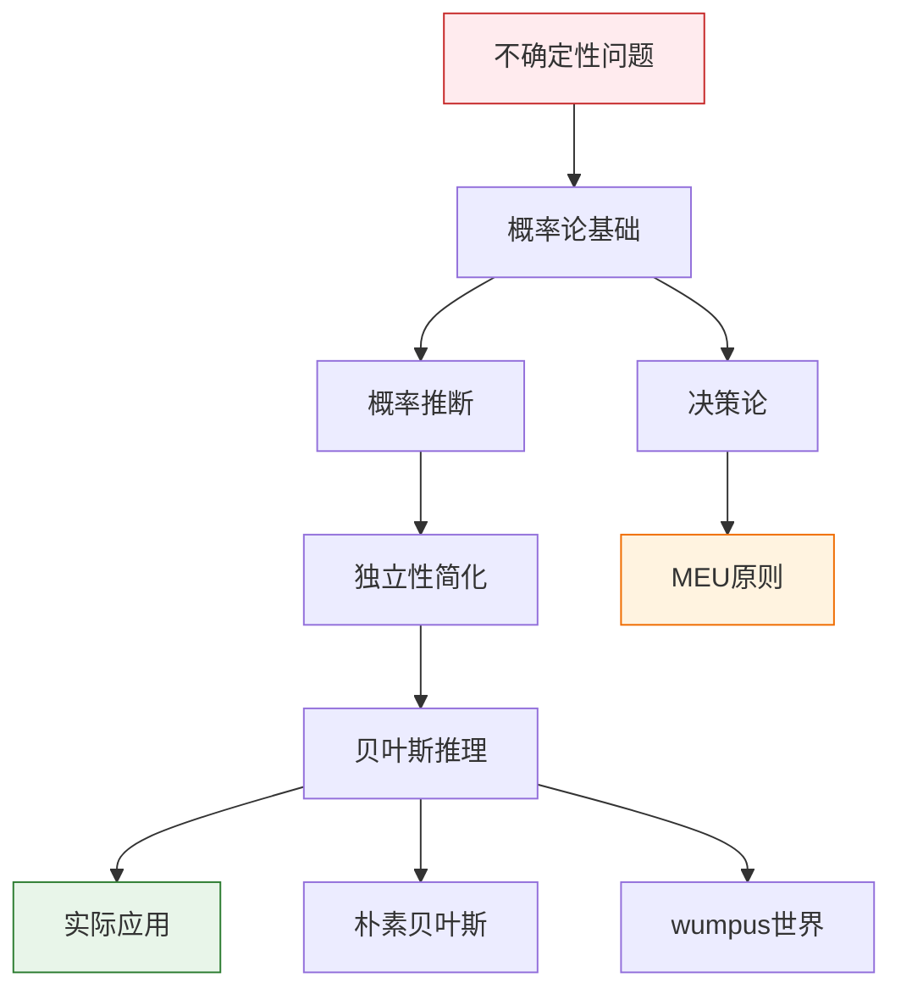
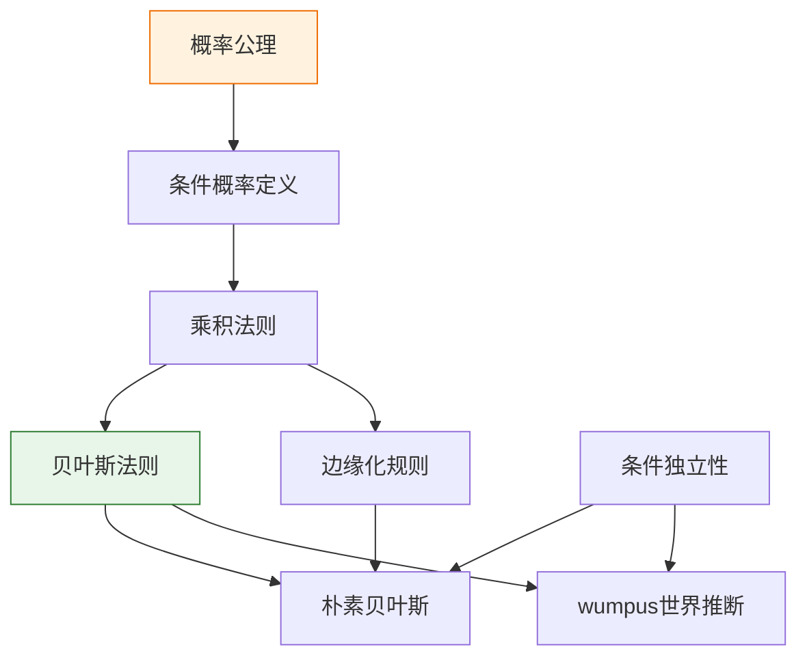

# 第12章 不确定性的量化 - 概览与总结

> 📚 本章 Deep Dive | 预计总学习时间: 360 分钟（6 小时）

---

## 1. 学习目标

完成本章学习后，你将能够：

1. **理解不确定性处理的必要性**：解释为什么AI系统需要处理不确定性，以及逻辑方法的局限性
2. **掌握概率论基础**：理解概率公理、条件概率、联合分布等核心概念
3. **应用概率推断方法**：使用边缘化、条件化进行概率推理
4. **利用独立性简化问题**：应用绝对独立性和条件独立性降低复杂度
5. **使用贝叶斯法则**：从因果知识推导诊断概率，整合多条证据
6. **构建朴素贝叶斯分类器**：实现简单的概率分类系统
7. **解决实际问题**：将概率推理应用于wumpus世界等场景

---

## 2. 本章速览

### 2.1 核心主题

```
第12章: 不确定性的量化
│
├── 12.1 不确定性下的动作
│   └── 决策论 = 概率论 + 效用理论
│   └── 最大期望效用（MEU）原则
│
├── 12.2 基本概率记号
│   └── 样本空间、概率公理
│   └── 随机变量、条件概率、乘积法则
│   └── 荷兰赌定理（概率公理的合理性）
│
├── 12.3 使用完全联合分布进行推断
│   └── 边缘化（求和消元）
│   └── 条件化、归一化
│   └── 指数复杂度问题
│
├── 12.4 独立性
│   └── 绝对独立性
│   └── 条件独立性
│   └── 复杂度降低：O(2^n) → O(n)
│
├── 12.5 贝叶斯法则及其应用
│   └── 贝叶斯法则：P(H|E) = P(E|H)P(H)/P(E)
│   └── 先验、似然、后验、证据概率
│   └── 多条证据的合并
│
├── 12.6 朴素贝叶斯模型
│   └── 条件独立性假设
│   └── 文本分类应用
│   └── 拉普拉斯平滑
│
└── 12.7 重游wumpus世界
    └── 概率模型构建
    └── 条件独立性简化
    └── 概率 vs 逻辑的优势
```

### 2.2 知识地图



---

## 3. 难度预警

### 3.1 难度分级

| 小节 | 难度 | 关键挑战 | 建议时间 |
|------|:----:|----------|:--------:|
| 12.1 | ⭐⭐ | 理解概率vs逻辑的区别 | 45分钟 |
| 12.2 | ⭐⭐⭐ | 概率公理、条件概率计算 | 60分钟 |
| 12.3 | ⭐⭐⭐ | 边缘化、归一化技巧 | 50分钟 |
| 12.4 | ⭐⭐⭐ | 条件独立性的理解 | 45分钟 |
| 12.5 | ⭐⭐⭐⭐ | 贝叶斯法则的应用 | 55分钟 |
| 12.6 | ⭐⭐⭐ | 朴素贝叶斯实现 | 50分钟 |
| 12.7 | ⭐⭐⭐⭐ | 综合应用 | 50分钟 |

### 3.2 常见困难点

1. **概率的解释**：区分频率主义和贝叶斯观点
2. **条件概率的方向**：理解P(A|B) ≠ P(B|A)
3. **归一化常数**：理解为什么可以暂时忽略分母
4. **条件独立性**：理解给定条件下的独立性
5. **贝叶斯更新**：理解先验如何更新为后验

---

## 4. 前置知识

### 4.1 必备知识

| 知识项 | 来源 | 重要性 | 复习建议 |
|--------|------|:------:|----------|
| 命题逻辑 | 第7章 | ⭐⭐⭐⭐⭐ | 复习逻辑推理的基本概念 |
| 集合论 | 数学基础 | ⭐⭐⭐⭐ | 理解集合运算 |
| 基本概率 | 高中数学 | ⭐⭐⭐⭐ | 复习概率的基本概念 |
| 求和符号 | 数学基础 | ⭐⭐⭐⭐ | 理解多重求和 |

### 4.2 有帮助的知识

- 微积分基础（连续概率）
- 线性代数（概率向量表示）
- 编程基础（实现概率算法）

---

## 5. 节依赖图

```
                    ┌─────────────┐
                    │   第12章    │
                    │  不确定性的  │
                    │   量化      │
                    └──────┬──────┘
                           │
        ┌──────────────────┼──────────────────┐
        │                  │                  │
        ▼                  ▼                  ▼
┌───────────────┐  ┌───────────────┐  ┌───────────────┐
│    12.1       │  │    12.2       │  │    12.3       │
│ 不确定性下的  │  │  基本概率记号  │  │  使用完全联合  │
│    动作       │  │               │  │  分布进行推断  │
└───────┬───────┘  └───────┬───────┘  └───────┬───────┘
        │                  │                  │
        │                  └────────┬─────────┘
        │                           │
        │                           ▼
        │                  ┌───────────────┐
        │                  │    12.4       │
        │                  │    独立性     │
        │                  └───────┬───────┘
        │                          │
        └────────────┬─────────────┘
                     │
                     ▼
            ┌───────────────┐
            │    12.5       │
            │  贝叶斯法则    │
            │   及其应用     │
            └───────┬───────┘
                    │
        ┌───────────┴───────────┐
        │                       │
        ▼                       ▼
┌───────────────┐      ┌───────────────┐
│    12.6       │      │    12.7       │
│  朴素贝叶斯   │      │  重游wumpus   │
│    模型       │      │    世界       │
└───────────────┘      └───────────────┘
```

---

## 6. 定理清单

| 定理 | 内容 | 位置 | 重要性 |
|------|------|:----:|:------:|
| 理性决策定理 | 理性智能体选择MEU动作 | 12.1 | ⭐⭐⭐⭐ |
| 荷兰赌定理 | 违反概率公理导致必然损失 | 12.2 | ⭐⭐⭐⭐ |
| 推断正确性定理 | 边缘化和条件化保持概率公理 | 12.3 | ⭐⭐⭐ |
| 独立性等价定理 | 独立性的三种等价表述 | 12.4 | ⭐⭐⭐⭐ |
| 贝叶斯法则 | P(H\|E) = P(E\|H)P(H)/P(E) | 12.5 | ⭐⭐⭐⭐⭐ |
| 朴素贝叶斯分解 | 联合分布的条件独立分解 | 12.6 | ⭐⭐⭐⭐ |
| wumpus条件独立性 | 边界变量与远处变量独立 | 12.7 | ⭐⭐⭐ |

---

## 7. 核心逻辑线索

### 7.1 问题驱动的发展

```
问题：现实世界中的不确定性
    ↓
挑战：逻辑方法无法处理（资格问题）
    ↓
解决方案：概率论
    ↓
新问题：完全联合分布的指数复杂度
    ↓
解决方案：独立性（特别是条件独立性）
    ↓
应用：贝叶斯推理、朴素贝叶斯、wumpus世界
```

### 7.2 核心公式链

```
概率公理
    ↓
条件概率定义：P(a|b) = P(a∧b)/P(b)
    ↓
乘积法则：P(a∧b) = P(a|b)P(b)
    ↓
贝叶斯法则：P(b|a) = P(a|b)P(b)/P(a)
    ↓
朴素贝叶斯：P(C|E) ∝ P(C)∏P(Ei|C)
```

---

## 8. 核心要点速查

### 8.1 关键概念

| 概念 | 定义 | 公式/要点 |
|------|------|-----------|
| 决策论 | 理性决策理论 | 概率 + 效用 = 决策论 |
| MEU原则 | 最大期望效用 | argmax_a Σ_s P(s\|a)U(s) |
| 概率公理 | 柯尔莫哥洛夫公理 | 非负性、归一性、可加性 |
| 条件概率 | 给定证据的概率 | P(a\|b) = P(a∧b)/P(b) |
| 边缘化 | 求和消元 | P(Y) = Σ_z P(Y,z) |
| 独立性 | 无关性 | P(a\|b) = P(a) |
| 条件独立性 | 给定条件下的无关性 | P(X,Y\|Z) = P(X\|Z)P(Y\|Z) |
| 贝叶斯法则 | 逆概率推理 | P(H\|E) = P(E\|H)P(H)/P(E) |

### 8.2 关键算法

1. **概率推断**：边缘化 + 条件化 + 归一化
2. **贝叶斯更新**：后验 ∝ 似然 × 先验
3. **朴素贝叶斯分类**：argmax_c P(c)∏P(e_i|c)

---

## 9. 概念对比表

### 9.1 逻辑 vs 概率

| 维度 | 逻辑 | 概率 |
|------|------|------|
| 信念表示 | {真, 假, 未知} | [0, 1]区间 |
| 结论类型 | 确定性 | 不确定性 |
| 更新方式 | 逻辑推理 | 贝叶斯更新 |
| 决策基础 | 逻辑结论 | 期望效用 |
| 适用场景 | 完全可观测 | 部分可观测 |

### 9.2 绝对独立 vs 条件独立

| 维度 | 绝对独立 | 条件独立 |
|------|----------|----------|
| 定义 | P(X\|Y) = P(X) | P(X,Y\|Z) = P(X\|Z)P(Y\|Z) |
| 常见程度 | 罕见 | 常见 |
| 应用场景 | 简单分解 | 复杂模型（如朴素贝叶斯） |
| 复杂度降低 | O(2^n) → O(n) | O(2^n) → O(n) |

### 9.3 先验 vs 后验

| 维度 | 先验 | 后验 |
|------|------|------|
| 时机 | 看到证据前 | 看到证据后 |
| 信息 | 背景知识 | 背景知识 + 证据 |
| 更新 | 通过贝叶斯法则 | 贝叶斯法则的结果 |
| 符号 | P(H) | P(H\|E) |

---

## 10. 定理依赖图



---

## 11. 常见误解澄清

| 误解 | 正确理解 |
|------|----------|
| 概率是世界的客观属性 | 概率是知识状态的函数，反映信念度 |
| 高概率意味着一定会发生 | 概率0.8意味着80%的可能性，仍有20%不发生 |
| 独立=互斥 | 独立：P(a∧b)=P(a)P(b)；互斥：P(a∧b)=0 |
| 条件独立意味着边缘独立 | 两者是不同的概念 |
| P(A\|B) = P(B\|A) | 一般情况下不相等，贝叶斯法则描述它们的关系 |
| 朴素贝叶斯假设总是成立 | 假设几乎从不成立，但模型仍然有效 |

---

## 12. 本章测验

### 12.1 选择题

1. 决策论的基本框架是什么？
   - A. 概率论
   - B. 效用理论
   - C. 概率论 + 效用理论
   - D. 逻辑推理

2. 贝叶斯法则中，P(E\|H)被称为什么？
   - A. 先验概率
   - B. 似然
   - C. 后验概率
   - D. 证据概率

3. 朴素贝叶斯模型的核心假设是什么？
   - A. 所有变量独立
   - B. 给定类别时特征条件独立
   - C. 特征之间完全相关
   - D. 类别先验相等

### 12.2 计算题

4. 已知P(A) = 0.3，P(B) = 0.4，P(A∧B) = 0.12，A和B是否独立？

5. 使用贝叶斯法则计算：已知P(H) = 0.01，P(E\|H) = 0.9，P(E) = 0.1，求P(H\|E)。

### 12.3 应用题

6. 解释为什么在wumpus世界中，概率智能体比逻辑智能体能做出更好的决策。

<details>
<summary>答案</summary>

1. C
2. B
3. B
4. 独立，因为P(A∧B) = 0.12 = P(A)P(B) = 0.3 × 0.4
5. P(H\|E) = P(E\|H)P(H)/P(E) = 0.9 × 0.01 / 0.1 = 0.09
6. 概率智能体可以量化风险（如"[2,2]有86%概率有陷阱"），而逻辑智能体只能得出"可能有陷阱"的二元结论。概率量化支持更精细的决策。

</details>

---

## 13. 快速复习卡

### 13.1 公式卡

```
┌─────────────────────────────────────────┐
│ 条件概率：P(a|b) = P(a∧b) / P(b)        │
├─────────────────────────────────────────┤
│ 乘积法则：P(a∧b) = P(a|b)P(b)           │
├─────────────────────────────────────────┤
│ 贝叶斯法则：P(b|a) = P(a|b)P(b) / P(a)  │
├─────────────────────────────────────────┤
│ 边缘化：P(Y) = Σ_z P(Y,z)               │
├─────────────────────────────────────────┤
│ 独立性：P(a∧b) = P(a)P(b)               │
├─────────────────────────────────────────┤
│ 条件独立：P(X,Y|Z) = P(X|Z)P(Y|Z)       │
├─────────────────────────────────────────┤
│ 朴素贝叶斯：P(C|E) ∝ P(C)∏P(Ei|C)       │
└─────────────────────────────────────────┘
```

### 13.2 概念卡

```
┌─────────────────────────────────────────┐
│ 先验：看到证据前的信念 P(H)             │
├─────────────────────────────────────────┤
│ 似然：假设下的证据概率 P(E|H)           │
├─────────────────────────────────────────┤
│ 后验：看到证据后的信念 P(H|E)           │
├─────────────────────────────────────────┤
│ 证据概率：P(E) = Σ_H P(E|H)P(H)         │
├─────────────────────────────────────────┤
│ MEU：选择期望效用最大的动作             │
└─────────────────────────────────────────┘
```

---

## 14. 扩展阅读

### 14.1 理论深化

- **《概率论基础》**（柯尔莫哥洛夫）：概率论的公理化基础
- **《概率图模型：原理与技术》**（Koller & Friedman）：深入介绍概率图模型
- **《贝叶斯数据分析》**（Gelman等）：贝叶斯统计的权威教材

### 14.2 应用拓展

- **《统计学习方法》**（李航）：朴素贝叶斯等分类算法
- **《模式识别与机器学习》**（Bishop）：概率机器学习
- **《深度学习》**（Goodfellow等）：现代概率方法在深度学习中的应用

### 14.3 在线资源

- 贝叶斯网络工具：GeNIe、SamIam
- Python库：scikit-learn（朴素贝叶斯）、PyMC3（贝叶斯建模）

---

## 15. 章节总结

### 15.1 核心收获

本章建立了**不确定性推理的数学基础**：

1. **概率论**是不确定性的合适表示，提供了严格的数学框架
2. **决策论**结合概率和效用，支持理性决策
3. **独立性**（特别是条件独立性）是处理复杂问题的关键
4. **贝叶斯法则**提供了逆概率推理和证据整合的工具
5. **朴素贝叶斯**展示了概率方法在实际任务中的有效性

### 15.2 与后续章节的联系

- **第13章**：更高效的推断方法（变量消去、信念传播）
- **第14章**：时序概率推理（滤波、预测、平滑）
- **第15章**：概率与一阶逻辑的结合
- **第16章**：效用理论的深入探讨
- **第17章**：不确定环境下的规划

### 15.3 实践建议

1. **动手实现**：尝试实现朴素贝叶斯分类器
2. **实验探索**：使用真实数据集测试贝叶斯方法
3. **对比分析**：比较概率方法和逻辑方法的优缺点
4. **深入阅读**：阅读概率图模型的相关文献

---

> 📌 **开始本章学习**: [12.1 不确定性下的动作](12.1_不确定性下的动作.md)
