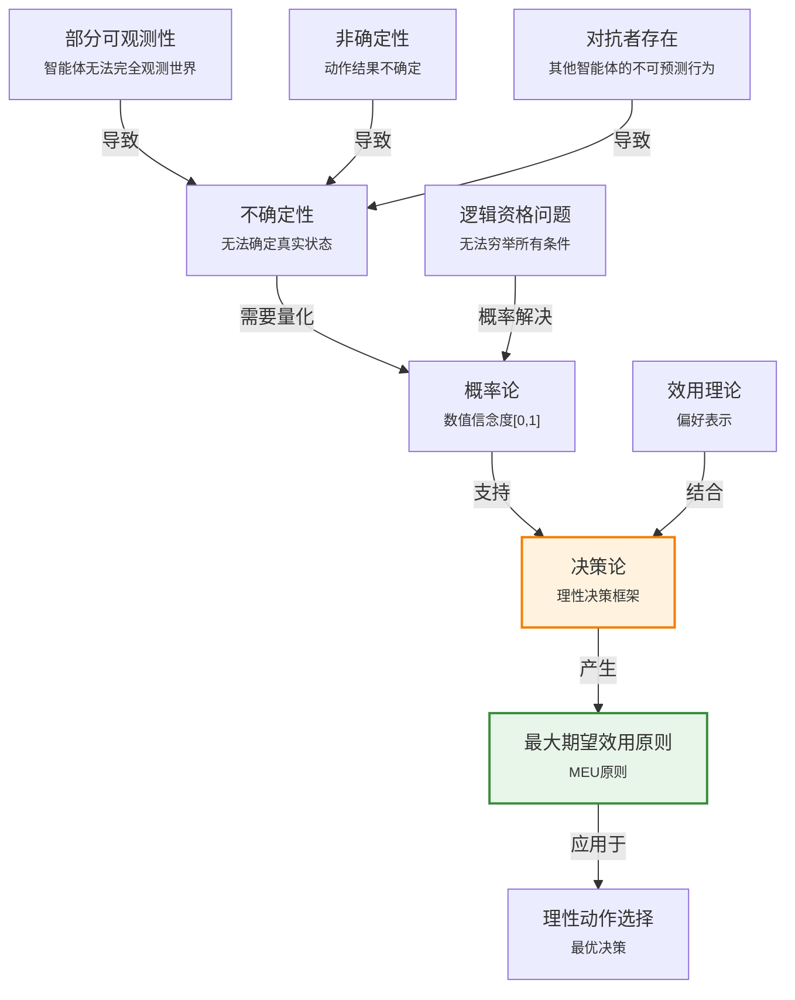

# 12.1 不确定性下的动作

> 📖 本节 Deep Dive | 预计学习时间: 45 分钟

---

## 1. 背景与动机

### 1.1 历史背景

**学科演进脉络**

不确定性推理在人工智能发展史上经历了从逻辑主义到概率主义的重大范式转变。早期AI研究者（1950s-1970s）深受逻辑学影响，试图用经典逻辑（命题逻辑和一阶逻辑）来处理智能体推理。然而，现实世界中的推理往往面临信息不完全、观测噪声和随机性等挑战，纯粹的逻辑方法难以应对。

概率论在AI中的应用可以追溯到20世纪60年代的医疗诊断系统（如MYCIN），但这些早期系统使用的是启发式确定性因子而非严格概率。直到20世纪80年代，贝叶斯网络的发明和计算能力的提升，才使得概率方法在AI中真正普及。

**里程碑事件**:

| 年份 | 人物/事件 | 贡献 | 影响 |
|------|-----------|------|------|
| 1654 | 帕斯卡与费马 | 创立概率论数学基础 | 为不确定性量化奠定数学工具 |
| 1763 | 托马斯·贝叶斯 | 发表贝叶斯定理（遗作） | 提供了从证据更新信念的框架 |
| 1812 | 拉普拉斯 | 《概率分析理论》 | 将概率论系统化 |
| 1933 | 柯尔莫哥洛夫 | 概率论公理化 | 建立现代概率论严格基础 |
| 1960s | 医疗诊断系统 | 早期不确定性推理应用 | 证明概率推理的实用价值 |
| 1980s | 贝叶斯网络 | 结构化概率表示 | 使复杂域的概率推理可行 |

**演进动机**:
- 早期方法: 使用逻辑推理和信念状态集合处理不确定性
- 局限性: 逻辑方法面临"资格问题"——无法穷举所有可能条件；信念状态爆炸；无法比较不同规划的优劣
- 突破: 引入数值信念度，用概率论量化不确定性，结合效用理论进行理性决策

### 1.2 研究动机

**为什么研究者关注这个主题？**

1. **理论意义**: 不确定性处理是智能的核心能力之一。人类在信息不完全时仍能做出合理决策，AI系统必须具备同样能力。概率论为这种能力提供了数学基础。

2. **方法创新**: 相对于纯逻辑方法，概率方法能够：
   - 处理部分可观测性
   - 表示信念的程度而非仅仅是真/假/未知
   - 根据证据动态更新信念
   - 在多个可能动作中选择最优的

3. **问题解决**: 解决了逻辑方法的核心困境——资格问题（qualification problem）。逻辑智能体无法确定规划能否成功，因为无法穷举所有可能阻碍成功的条件。

**与其他领域的关系**:
- 与统计学的关系: 概率论是统计推断的基础，AI中的学习方法大量借用统计技术
- 与决策科学的关系: 效用理论和决策论是经济学和运筹学的核心，AI将其与概率结合
- 与认知科学的关系: 概率模型被用来模拟人类推理和决策过程

### 1.3 实际应用场景

| 应用领域 | 具体问题 | 本节理论的作用 | 预期效果 |
|----------|----------|----------------|----------|
| 自动驾驶 | 无法确定其他车辆行为 | 用概率预测其他车辆动作，计算期望效用 | 安全且高效的驾驶决策 |
| 医疗诊断 | 症状与疾病关系不确定 | 计算P(疾病\|症状)，量化诊断不确定性 | 更准确的诊断和个性化治疗 |
| 金融投资 | 市场走势不确定 | 用概率分布建模收益，计算期望回报 | 风险调整后的最优投资组合 |
| 自然语言处理 | 词义消歧、语音识别 | 计算P(含义\|上下文)，选择最可能解释 | 更准确的语义理解 |
| 机器人导航 | 传感器噪声、环境变化 | 概率定位（如粒子滤波） | 鲁棒的自主导航 |

**典型案例预览**:
> 一辆自动驾驶出租车需要在飞机起飞前90分钟出发（规划$A_{90}$）还是提前180分钟出发（规划$A_{180}$）。逻辑智能体无法确定哪个规划能成功，因为需要考虑交通、事故、道路封闭等无数不确定因素。概率智能体可以计算每个规划的期望效用，选择最优动作。

### 1.4 先决条件

**学习本节需要的前置知识**:

| 知识项 | 来源 | 掌握程度要求 | 关键概念 |
|--------|------|:------------:|----------|
| 命题逻辑 | 第7章 | 必须熟练掌握 | 命题、合取、析取、蕴含 |
| 智能体架构 | 第2章 | 理解即可 | 理性智能体、性能度量 |
| 搜索与规划 | 第3-4章 | 了解 | 状态空间、规划、信念状态 |
| 基础概率 | 数学基础 | 了解 | 概率、条件概率的基本概念 |

**前置检查清单**:
- [ ] 能够解释为什么纯逻辑智能体难以处理不确定性
- [ ] 理解信念状态的概念及其局限性
- [ ] 了解概率的基本性质（取值范围[0,1]）

---

## 2. 知识逻辑图谱

### 2.1 概念关系图



### 2.2 知识发展依赖链

```
【问题层】           【理论层】              【方法层】             【应用层】
    ↓                   ↓                     ↓                   ↓
┌─────────┐      ┌─────────────┐       ┌───────────┐      ┌──────────┐
│ 现实世界的│  ──→ │ 概率论       │  ──→  │ 贝叶斯推理│ ──→  │ 智能决策  │
│ 不确定性 │      │ 效用理论     │       │ 期望效用  │      │ 系统      │
│         │      │             │       │ 计算      │      │          │
│ 部分可观测│      │ 决策论       │       │           │      │          │
│ 非确定性 │      │ =概率+效用   │       │           │      │          │
└─────────┘      └─────────────┘       └───────────┘      └──────────┘
     │                   │                   │                │
     └───────────────────┴───────────────────┴────────────────┘
                         不确定性处理演进脉络
```

**依赖链详解**:
1. **问题**: 现实世界中智能体面临部分可观测性、非确定性和对抗者带来的不确定性
2. **理论**: 概率论提供量化不确定性的数学工具；效用理论表示偏好；决策论将二者结合
3. **方法**: 使用概率推断更新信念，计算各动作的期望效用
4. **应用**: 根据MEU原则选择理性动作

### 2.3 本节在章节中的位置

```
第 12 章: 不确定性的量化
├── 12.1 不确定性下的动作 ← ⭐ 当前位置
│   ├── [核心概念: 决策论、MEU原则]
│   ├── [核心方法: 概率+效用=理性决策]
│   └── [应用: 自动驾驶出租车例子]
│
├── 12.2 基本概率记号 ← 后续发展
│   └── [将引入: 概率公理、条件概率]
│
├── 12.3-12.7 ← 深入技术
│   └── [将扩展: 推断方法、贝叶斯法则等]
```

**衔接说明**:
- **为本章铺垫**: 本节建立概率推理和决策论的框架，后续各节深入技术细节
- **从前继承**: 第7章的逻辑智能体概念；第2章的理性智能体框架

---

## 3. 核心概念与数学分析

### 3.1 核心术语定义

**定义 12.1.1** (不确定性 / Uncertainty):

> **正式定义**: 智能体由于部分可观测性、非确定性和对抗者存在而无法确切知道世界真实状态的情形。

**定义详解**:
- **直观解释**: 不确定性意味着智能体对世界状态的知识是不完全的，无法确定哪个状态为真
- **数学表述**: 设$\Omega$为所有可能世界（状态）的集合，不确定性表现为智能体无法确定哪个$\omega \in \Omega$是真实世界
- **为什么这样定义**: 这一定义涵盖了不确定性的三个主要来源，为后续概率建模奠定基础

**定义中的关键要素**:
| 要素 | 符号 | 含义 | 约束条件 |
|------|------|------|----------|
| 部分可观测性 | - | 传感器无法观测世界的全部方面 | 观测函数非单射 |
| 非确定性 | - | 相同动作在不同执行中可能产生不同结果 | 动作结果是随机变量 |
| 对抗者 | - | 其他智能体的行为不可完全预测 | 多智能体环境 |

---

**定义 12.1.2** (信念度 / Degree of Belief):

> **正式定义**: 智能体基于当前知识对某命题为真的确信程度的数值度量，取值范围为$[0, 1]$。

**定义详解**:
- **直观解释**: 0表示"必定为假"，1表示"必定为真"，中间值表示不同程度的信念
- **数学表述**: 对命题$a$，信念度记为$P(a) \in [0, 1]$
- **与逻辑的区别**: 逻辑智能体相信每个命题或对或假或不做评价；概率智能体有数值信念度

**重要说明**: 概率陈述是根据知识状态而非真实世界做出的。例如，$P(\text{cavity}) = 0.2$表示基于当前知识的信念度，而非客观上20%的病人有蛀牙。

---

**定义 12.1.3** (效用 / Utility):

> **正式定义**: 状态（或状态序列）对智能体的有用性的数值度量，表示智能体的偏好。

**定义详解**:
- **直观解释**: 效用越高，智能体越偏好该状态
- **数学表述**: $U: \mathcal{S} \to \mathbb{R}$，其中$\mathcal{S}$是状态空间
- **主观性**: 效用是相对于智能体的，不同智能体对同一状态可能有不同效用评估

**示例**: 在国际象棋中，白棋将死黑棋的状态对执白智能体效用高，对执黑智能体效用低。

---

**定义 12.1.4** (决策论 / Decision Theory):

> **正式定义**: 理性决策的通用理论，将概率表示的信念与效用表示的偏好相结合。

**核心公式**:
$$\text{决策论} = \text{概率论} + \text{效用理论}$$

---

**定义 12.1.5** (最大期望效用原则 / Maximum Expected Utility, MEU):

> **正式定义**: 理性智能体选择使期望效用最大化的动作的原则。

**数学表述**:
$$\text{动作}^* = \arg\max_a \mathbb{E}[U | a] = \arg\max_a \sum_s P(s | a) \cdot U(s)$$

其中：
- $a$是动作
- $s$是可能的结果状态
- $P(s | a)$是在执行动作$a$后到达状态$s$的概率
- $U(s)$是状态$s$的效用

### 3.2 符号系统与约定

**本节符号总表**:

| 符号 | 含义 | 数学表达 | 备注 |
|:----:|------|----------|------|
| $P(a)$ | 命题$a$的概率 | $P(a) \in [0, 1]$ | 信念度 |
| $A_{90}$ | 提前90分钟出发的规划 | - | 自动驾驶例子 |
| $U(s)$ | 状态$s$的效用 | $U: \mathcal{S} \to \mathbb{R}$ | 主观度量 |
| $\mathbb{E}[U \| a]$ | 动作$a$的期望效用 | $\sum_s P(s \| a)U(s)$ | 决策依据 |
| MEU | 最大期望效用 | $\arg\max_a \mathbb{E}[U \| a]$ | 理性决策原则 |

### 3.3 关键公式与性质

#### 公式 1: 期望效用公式

**数学表述**:
$$\mathbb{E}[U | a] = \sum_{s} P(s | a) \cdot U(s)$$

**公式要素解析**:

| 维度 | 内容 |
|------|------|
| **直观解释** | 动作的期望效用是所有可能结果的效用加权平均，权重是各结果发生的概率 |
| **几何意义** | 可以视为效用分布的"重心"或平均值 |
| **领域背景** | 这是决策论的核心公式，由冯·诺依曼和摩根斯坦在博弈论中形式化 |

**使用条件**: 
- 已知各结果状态的概率分布$P(s | a)$
- 已知各状态的效用值$U(s)$
- 智能体是风险中性的（效用函数已反映风险态度）

**代数推导**：
期望的定义是随机变量的加权平均：
$$\mathbb{E}[X] = \sum_{x} x \cdot P(X = x)$$
将效用视为随机变量即得期望效用公式。

---

#### 公式 2: 决策论基本等式

**数学表述**:
$$\text{决策论} = \text{概率论} + \text{效用理论}$$

**公式要素解析**:

| 维度 | 内容 |
|------|------|
| **直观解释** | 理性决策需要同时考虑"世界是什么样的"（概率）和"我想要什么"（效用） |
| **领域背景** | 这一框架由拉姆齐、德菲内蒂、萨维奇等人在20世纪上半叶发展 |

### 3.4 重要性质与推论

**性质 12.1.1** (概率解决资格问题):

> **陈述**: 概率论通过概括因惰性与无知产生的不确定性，解决了逻辑资格问题。

**证明概要**: 逻辑方法需要穷举所有可能条件，概率方法用数值信念度概括不确定性，无需完整枚举。

**直观理解**: 我们不需要知道所有可能导致牙痛的原因，只需要知道"牙痛患者有蛀牙的概率是0.8"即可进行推理。

**重要性**: 这是概率方法相对于逻辑方法的核心优势，使实际推理成为可能。

---

**性质 12.1.2** (知识状态依赖性):

> **陈述**: 概率陈述$P(a) = p$是相对于知识状态的断言，不同知识导致不同概率。

**示例**:
- $P(\text{cavity} | \text{toothache}) = 0.6$
- $P(\text{cavity} | \text{toothache} \land \text{gum disease history}) = 0.4$
- $P(\text{cavity} | \neg \text{cavity observed}) = 0$

这些陈述不矛盾，因为它们基于不同知识状态。

---

## 4. 定理与证明

### 4.1 理性决策定理

**定理 12.1.1** (理性决策定理 / Rational Decision Theorem):

> **正式陈述**: 在满足一致性公理的条件下，智能体的偏好可以由一个效用函数表示，且理性智能体应选择使期望效用最大化的动作。

**定理解读**:
- **条件（前提）**:
  1. **完备性**: 对任意两个状态，智能体能够比较偏好
  2. **传递性**: 偏好关系满足传递律
  3. **连续性**: 偏好可以连续变化
  4. **独立性**: 偏好不受无关选项影响

- **结论**: 存在效用函数$U$，使得智能体的偏好与期望效用最大化一致

- **定理意义**: 为MEU原则提供了理论基础，说明在满足理性条件下，期望效用最大化是"正确"的决策方式

### 4.2 证明详解

**证明策略概览**:

本定理的证明基于表示定理（Representation Theorem），核心思路是：如果偏好满足一定公理，则存在效用函数表示这些偏好。

**核心思路**: 构造性证明——从偏好关系构造效用函数

**关键步骤预览**:
1. 从偏好关系定义"无差异"和"偏好于"
2. 构造标准赌局（standard lottery）作为参照
3. 证明存在效用值使偏好与期望效用一致
4. 证明效用函数在正线性变换下唯一

---

**正式证明**:

**步骤 1**: 定义偏好关系

设$\succcurlyeq$为偏好关系，$s_1 \succcurlyeq s_2$表示"$s_1$至少与$s_2$一样好"。

定义：
- $s_1 \sim s_2$（无差异）当且仅当$s_1 \succcurlyeq s_2$且$s_2 \succcurlyeq s_1$
- $s_1 \succ s_2$（严格偏好）当且仅当$s_1 \succcurlyeq s_2$且非$s_2 \succcurlyeq s_1$

> 💡 **技术注释**: 这些定义将偏好关系分解为可操作的组成部分

---

**步骤 2**: 构造参照赌局

选取两个参考状态$s_{best}$和$s_{worst}$，分别代表最好和最差结果。

对任意状态$s$，考虑赌局：以概率$p$获得$s_{best}$，以概率$1-p$获得$s_{worst}$。

由连续性公理，存在唯一的$p^*$使得：
$$s \sim p^* \cdot s_{best} + (1-p^*) \cdot s_{worst}$$

> 💡 **技术注释**: 这个$p^*$就是状态$s$的效用值

---

**步骤 3**: 定义效用函数

定义$U(s) = p^*$，即状态$s$的效用等于使其与参照赌局无差异的概率。

**验证期望效用表示**:

对任意两个赌局$L_1 = (p_1, s_1; p_2, s_2; ...)$和$L_2 = (q_1, t_1; q_2, t_2; ...)$，需要证明：
$$L_1 \succcurlyeq L_2 \iff \mathbb{E}[U | L_1] \geq \mathbb{E}[U | L_2]$$

由独立性公理和构造方式，这一等式成立。

---

**步骤 4**: 唯一性证明

设$U'$是另一个表示相同偏好的效用函数，则存在$a > 0$和$b$使得：
$$U'(s) = a \cdot U(s) + b$$

这说明效用函数在正线性变换下唯一（基数效用）。

因此，定理得证。

$$\blacksquare \text{ (证毕)}$$

### 4.3 证明分析与提炼

**核心洞见**: 理性偏好的结构（完备性、传递性等）必然导致可用数值效用表示，且最优决策是期望效用最大化。

**证明技巧总结**:

| 技巧 | 在本证明中的应用 | 可迁移性 | 其他应用场景 |
|------|------------------|----------|--------------|
| 参照构造 | 用标准赌局定义效用 | ⭐⭐⭐⭐⭐ | 任何表示定理证明 |
| 公理化方法 | 从公理推导表示 | ⭐⭐⭐⭐⭐ | 经济学、博弈论 |
| 唯一性证明 | 正线性变换 | ⭐⭐⭐⭐ | 度量理论 |

**证明中的关键难点**: 连续性公理保证了效用值的存在性，这是证明的核心。

---

## 5. 具体示例与详解

### 5.1 自动驾驶出租车决策示例

**示例 12.1.1**: 机场接送规划选择

**📋 问题陈述**:

一辆自动驾驶出租车需要将乘客按时送到机场。有两个可选规划：
- $A_{90}$: 提前90分钟出发
- $A_{180}$: 提前180分钟出发

可能的结果：
1. 准时到达，无等待（效用：100）
2. 准时到达，长时间等待（效用：60）
3. 迟到，错过飞机（效用：0）

**已知**:
- $P(\text{准时} | A_{90}) = 0.97$，等待时间适中
- $P(\text{准时} | A_{180}) = 0.999$，但等待时间长
- $P(\text{迟到} | A_{90}) = 0.03$
- $P(\text{迟到} | A_{180}) = 0.001$

**求解**: 哪个规划具有更高的期望效用？

---

**🔍 解答过程**:

**步骤 1: 分析问题**

这是一个典型的不确定性下的决策问题。需要计算每个规划的期望效用并比较。

**步骤 2: 计算期望效用**

对于$A_{90}$：
- 准时到达（概率0.97）：效用设为100
- 迟到（概率0.03）：效用设为0

$$\mathbb{E}[U | A_{90}] = 0.97 \times 100 + 0.03 \times 0 = 97$$

对于$A_{180}$：
- 准时到达（概率0.999）：但长时间等待，效用设为60
- 迟到（概率0.001）：效用设为0

$$\mathbb{E}[U | A_{180}] = 0.999 \times 60 + 0.001 \times 0 = 59.94$$

**步骤 3: 结果解释**

$$\mathbb{E}[U | A_{90}] = 97 > 59.94 = \mathbb{E}[U | A_{180}]$$

因此，$A_{90}$是更优选择，尽管它有更高的迟到风险。

---

**✅ 验证与检验**:

**正确性检查**:
- [x] 结果满足概率和为1（0.97+0.03=1，0.999+0.001=1）
- [x] 效用值合理（准时>等待>迟到）
- [x] 与直觉一致（适度风险换取舒适）

**结果的意义**: 
如果乘客认为准时到达远比避免等待更重要，可能会选择$A_{180}$。这体现了效用的主观性——最优决策取决于个人偏好。

---

### 5.2 牙科诊断示例

**示例 12.1.2**: 牙痛病因推理

**场景**: 患者牙痛，医生需要判断病因。

**逻辑方法的问题**:
- 规则$\text{Toothache} \Rightarrow \text{Cavity}$是错误的（不是所有牙痛都是蛀牙）
- 规则$\text{Cavity} \Rightarrow \text{Toothache}$也是错误的（不是所有蛀牙都痛）

**概率方法**:
- $P(\text{cavity} | \text{toothache}) = 0.6$
- $P(\text{gum problem} | \text{toothache}) = 0.3$
- $P(\text{other} | \text{toothache}) = 0.1$

**分析**: 概率方法承认不确定性，提供信念度而非绝对结论。这更诚实地反映了医学诊断的现实。

**教训**: 概率方法解决了逻辑方法的"资格问题"——无需穷举所有可能病因。

---

### 5.3 类比与可视化

**直觉类比**:

| 抽象概念 | 日常类比 | 对应关系 |
|----------|----------|----------|
| 概率 | 天气预报的降雨概率 | 60%降雨概率≠一定会下雨 |
| 效用 | 购物时的性价比权衡 | 价格高但质量好vs便宜但质量差 |
| 期望效用 | 投资的期望收益 | 高风险高回报vs低风险低回报 |
| MEU原则 | 选择性价比最高的商品 | 综合考虑价格和效用 |

**局限性**: 这个类比假设智能体是理性的，现实中人类决策常受认知偏差影响。

---

## 6. 深入理解与拓展

### 6.1 一句话本质

> 🎯 **核心要点**: 不确定性下的理性决策需要同时量化"世界可能是什么样的"（概率）和"我想要什么"（效用），并选择使期望效用最大化的动作。

### 6.2 深入思考问题

1. **概念层面**: 为什么概率是信念度的合适表示？其他表示方式（如模糊逻辑、Dempster-Shafer理论）有什么优缺点？
   <!-- 思考方向: 考虑概率公理（特别是可加性）的合理性，以及概率在更新和学习方面的优势 -->

2. **方法层面**: MEU原则假设智能体是风险中性的。如何扩展以处理风险厌恶或风险追求？
   <!-- 思考方向: 考虑效用函数的形状（凹函数表示风险厌恶，凸函数表示风险追求） -->

3. **应用层面**: 在实际系统中，如何估计概率和效用值？
   <!-- 思考方向: 考虑从数据学习概率、从人类反馈学习效用、或从偏好推断效用 -->

4. **拓展层面**: 多智能体环境下的决策如何处理？
   <!-- 思考方向: 考虑博弈论框架，其中智能体需要考虑其他智能体的策略 -->

### 6.3 与其他节的关系

**本节输出**:
- 建立了不确定性处理的框架（概率+效用=决策论）
- 为后续各节的技术内容提供了动机和应用场景
- 引入了关键概念：信念度、效用、MEU原则

**后续发展预告**:
- 12.2节将详细介绍概率论的数学基础
- 12.3-12.7节将介绍各种概率推断方法
- 第16章将更深入探讨效用理论

---

## 7. 总结与反思

### 7.1 关键要点总结

本节必须掌握的 **5** 个核心要点:

1. **不确定性的三大来源**: 部分可观测性、非确定性和对抗者存在导致智能体无法确定世界状态
   
   💡 *记忆技巧*: 记住"观、定、抗"三个字

2. **概率作为信念度**: 概率$P(a) \in [0,1]$表示智能体对命题$a$的信念程度，区别于逻辑的{真,假,未知}
   
   💡 *记忆技巧*: 概率是"知识状态"的函数，不是"真实世界"的函数

3. **决策论框架**: $\text{决策论} = \text{概率论} + \text{效用理论}$
   
   💡 *记忆技巧*: 决策需要知道"是什么"和"要什么"

4. **MEU原则**: 理性智能体选择使期望效用最大化的动作
   $$\text{动作}^* = \arg\max_a \sum_s P(s | a) \cdot U(s)$$
   
   💡 *记忆技巧*: "期望"=概率加权平均，"最大"=选择最优

5. **概率解决资格问题**: 无需穷举所有条件，用数值信念度概括不确定性
   
   💡 *记忆技巧*: 概率是"懒惰但聪明"的解决方案

### 7.2 本节知识框架

```
┌─────────────────────────────────────────────────────────────┐
│  第12.1节: 不确定性下的动作                                 │
├─────────────────────────────────────────────────────────────┤
│  输入/前置                                                   │
│  • 部分可观测的世界                                          │
│  • 非确定性的动作结果                                         │
│  • 智能体的偏好（效用）                                       │
│                                                             │
│  处理/核心                                                   │
│  • 用概率量化信念                                            │
│  • 用效用表示偏好                                            │
│  • 计算期望效用                                              │
│  ↓                                                          │
│  输出/结果                                                   │
│  • 最优动作选择（MEU）                                       │
│  • 理性决策框架                                              │
│                                                             │
│  应用/价值                                                   │
│  • 自动驾驶决策                                              │
│  • 医疗诊断                                                  │
│  • 任何不确定性下的决策                                       │
└─────────────────────────────────────────────────────────────┘
```

### 7.3 常见误解与纠正

| 常见误解 ❌ | 正确理解 ✅ | 为什么容易错 | 如何避免 |
|-------------|-------------|--------------|----------|
| ❌ 概率是世界的客观属性 | ✅ 概率是知识状态的函数，反映信念度 | 混淆频率主义与贝叶斯观点 | 记住"概率相对于知识" |
| ❌ 高概率意味着一定会发生 | ✅ 概率0.8意味着80%的可能性，仍有20%不发生 | 直觉上的确定性偏见 | 理解概率的随机性本质 |
| ❌ MEU原则适用于所有决策 | ✅ MEU假设风险中性，实际中可能需要调整 | 忽略效用函数的形状 | 考虑风险态度 |
| ❌ 概率和逻辑是互斥的 | ✅ 概率扩展了逻辑，逻辑是概率的特例 | 二元对立思维 | 理解概率是逻辑的推广 |

### 7.4 反思问题

**连接性问题**:
1. 本节与第7章逻辑智能体的主要区别是什么？
2. 12.2节将介绍的"条件概率"如何扩展本节框架？

**应用性问题**:
1. 如何在自动驾驶系统中实际估计$P(\text{准时} | A_{90})$？
2. 如果乘客的风险态度不同，如何调整决策？

**批判性问题**:
1. MEU原则的主要局限性是什么？
2. 在什么情况下应该使用其他决策准则（如最大最小准则）？

### 7.5 学习检查清单

- [ ] 能够解释不确定性的三个来源
- [ ] 能够区分概率信念与逻辑真值
- [ ] 能够复述决策论的基本框架
- [ ] 能够计算简单问题的期望效用
- [ ] 能够解释MEU原则的含义
- [ ] 理解概率如何解决资格问题

---

## 附录

### A. 公式速查表

| 公式 | 名称 | 使用条件 | 备注 |
|:----:|------|----------|------|
| $\mathbb{E}[U \| a] = \sum_s P(s \| a)U(s)$ | 期望效用 | 已知概率分布和效用 | 决策依据 |
| $\text{动作}^* = \arg\max_a \mathbb{E}[U \| a]$ | MEU原则 | 理性决策 | 最优动作选择 |
| $\text{决策论} = \text{概率} + \text{效用}$ | 决策论框架 | 不确定性决策 | 理论基础 |

### B. 术语索引

| 术语 | 英文 | 定义 | 位置 |
|------|------|------|:----:|
| 不确定性 | Uncertainty | 无法确定世界真实状态的情形 | 12.1 |
| 信念度 | Degree of Belief | 对命题为真的确信程度的数值度量 | 12.1 |
| 效用 | Utility | 状态对智能体的有用性的数值度量 | 12.1 |
| 决策论 | Decision Theory | 理性决策的通用理论 | 12.1 |
| MEU原则 | Maximum Expected Utility | 选择使期望效用最大化的动作 | 12.1 |

### C. 延伸阅读

**理论深化**:
- 《决策与理性》：深入探讨决策论的理论基础
- 《概率的哲学理论》：概率解释的各种观点

**应用拓展**:
- 自动驾驶中的不确定性处理
- 医疗决策支持系统

---

> 📌 **下一节**: [12.2 基本概率记号](12.2_基本概率记号.md)
> 
> 📚 **返回概览**: [第12章概览](00_概览.md)
