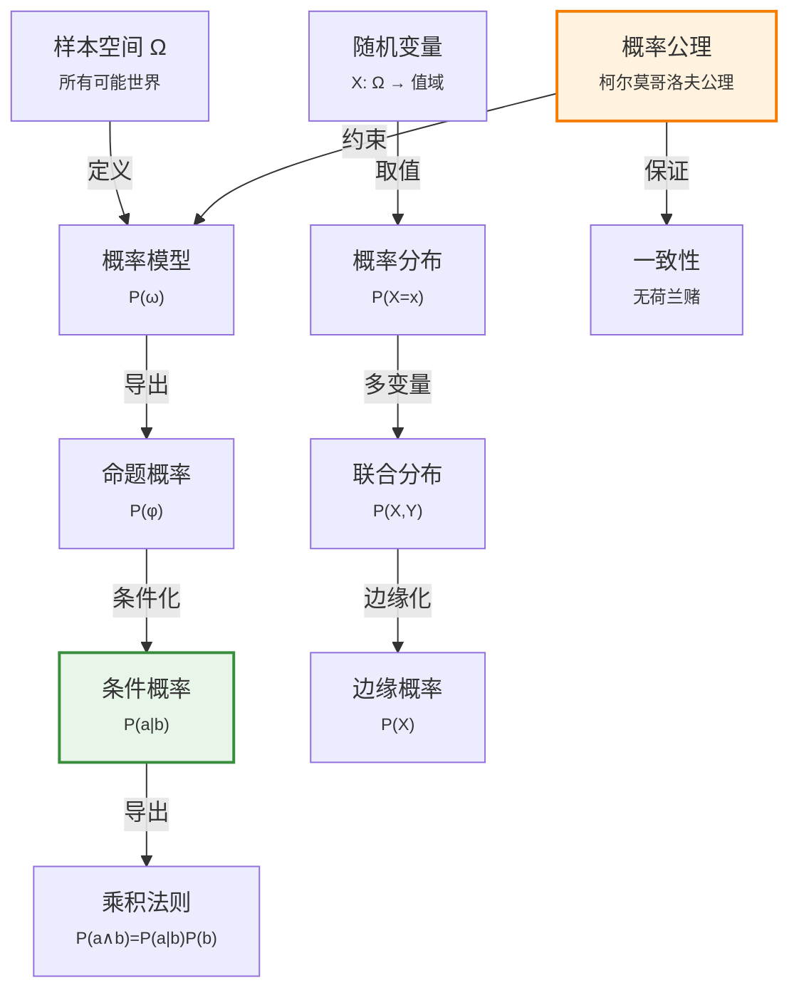

# 12.2 基本概率记号

> 📖 本节 Deep Dive | 预计学习时间: 60 分钟

---

## 1. 背景与动机

### 1.1 历史背景

**学科演进脉络**

概率论的数学基础在20世纪30年代由柯尔莫哥洛夫奠定，但其哲学解释和应用方式经历了长期争论。频率主义者将概率视为长期频率的极限；主观贝叶斯学派将概率视为理性信念度；逻辑学派则试图将概率视为命题间的逻辑关系。

在人工智能领域，概率方法的采用经历了起伏。20世纪60-70年代的早期专家系统（如MYCIN）使用启发式确定性因子处理不确定性。80年代，贝叶斯网络的提出使得复杂域的概率推理变得可行。90年代后，概率图模型成为AI不确定性处理的主流方法。

**里程碑事件**:

| 年份 | 人物/事件 | 贡献 | 影响 |
|------|-----------|------|------|
| 1654 | 帕斯卡与费马 | 概率论数学基础 | 解决赌博问题 |
| 1763 | 贝叶斯 | 贝叶斯定理 | 逆概率推理 |
| 1933 | 柯尔莫哥洛夫 | 概率论公理化 | 现代概率论基础 |
| 1937 | 德菲内蒂 | 主观概率理论 | 荷兰赌论证 |
| 1946 | 考克斯 | 概率唯一性定理 | 证明概率是信念度的唯一一致表示 |
| 1980s | 贝叶斯网络 | 结构化概率表示 | 使复杂推理可行 |

**演进动机**:
- 早期方法: 使用确定性因子或模糊逻辑处理不确定性
- 局限性: 缺乏数学基础，难以保证一致性
- 突破: 采用严格概率论，提供公理化基础和一致性保证

### 1.2 研究动机

**为什么研究者关注这个主题？**

1. **理论基础**: 概率论为不确定性推理提供了严格的数学基础，确保推理的一致性和合理性。

2. **计算框架**: 概率公理和规则（如乘积法则、边缘化）为概率计算提供了系统方法。

3. **哲学辩护**: 德菲内蒂、考克斯等人的工作证明了概率是信念度的唯一合理表示。

**与其他领域的关系**:
- 与统计学的关系: 概率论是统计推断的基础
- 与信息论的关系: 熵、互信息等概念基于概率
- 与物理学的关系: 量子力学本质上是概率性的

### 1.3 实际应用场景

| 应用领域 | 具体问题 | 本节理论的作用 | 预期效果 |
|----------|----------|----------------|----------|
| 机器学习 | 概率模型构建 | 定义概率分布、条件概率 | 可解释的预测和不确定性估计 |
| 自然语言处理 | 语言模型 | 定义词序列的概率 | 流畅的文本生成 |
| 计算机视觉 | 目标检测 | 定义检测结果的概率 | 可靠的识别系统 |
| 机器人学 | 定位与建图 | 定义位姿的概率分布 | 鲁棒的自主导航 |
| 金融工程 | 风险建模 | 定义资产收益的分布 | 有效的风险管理 |

**典型案例预览**:
> 一个牙科诊断系统需要表示"患者有蛀牙的概率"、"给定牙痛时蛀牙的条件概率"等。本节介绍的记号系统使这些概率的精确表示和计算成为可能。

### 1.4 先决条件

**学习本节需要的前置知识**:

| 知识项 | 来源 | 掌握程度要求 | 关键概念 |
|--------|------|:------------:|----------|
| 集合论 | 数学基础 | 必须熟练掌握 | 集合运算、笛卡尔积 |
| 命题逻辑 | 第7章 | 熟练掌握 | 命题、逻辑联结词 |
| 实分析基础 | 数学基础 | 了解 | 极限、积分 |
| 概率直观 | 12.1节 | 理解 | 信念度、不确定性 |

**前置检查清单**:
- [ ] 理解集合的并、交、补运算
- [ ] 理解命题逻辑的真值计算
- [ ] 了解概率的直观含义（12.1节）

---

## 2. 知识逻辑图谱

### 2.1 概念关系图



### 2.2 知识发展依赖链

```
【基础层】           【表示层】              【计算层】             【应用层】
    ↓                   ↓                     ↓                   ↓
┌─────────┐      ┌─────────────┐       ┌───────────┐      ┌──────────┐
│ 样本空间│  ──→ │ 概率模型     │  ──→  │ 条件概率  │ ──→  │ 概率推断  │
│ 随机变量│      │ 概率分布     │       │ 边缘化    │      │ 贝叶斯推理│
│         │      │ 联合分布     │       │ 乘积法则  │      │          │
│ 概率公理│      │             │       │           │      │          │
└─────────┘      └─────────────┘       └───────────┘      └──────────┘
     │                   │                   │                │
     └───────────────────┴───────────────────┴────────────────┘
                         概率记号系统演进
```

**依赖链详解**:
1. **基础**: 样本空间、随机变量、概率公理
2. **表示**: 概率模型、概率分布、联合分布
3. **计算**: 条件概率、边缘化、乘积法则
4. **应用**: 概率推断、贝叶斯推理

### 2.3 本节在章节中的位置

```
第 12 章: 不确定性的量化
├── 12.1 不确定性下的动作 ← 前置知识
│   └── [引入: 概率作为信念度]
│
├── 12.2 基本概率记号 ← ⭐ 当前位置
│   ├── [核心概念: 概率公理、条件概率]
│   ├── [核心方法: 边缘化、条件化]
│   └── [理论基础: 柯尔莫哥洛夫公理]
│
├── 12.3 使用完全联合分布进行推断 ← 后续发展
│   └── [将应用: 边缘化、条件化计算]
```

**衔接说明**:
- **从前继承**: 12.1节引入的概率直观概念
- **为后铺垫**: 本节记号是后续推断方法的基础

---

## 3. 核心概念与数学分析

### 3.1 核心术语定义

**定义 12.2.1** (样本空间 / Sample Space):

> **正式定义**: 所有可能世界的集合，记为$\Omega$（大写omega）。可能世界是互斥且穷举的。

**定义详解**:
- **直观解释**: 样本空间包含随机实验所有可能的结果
- **数学表述**: $\Omega = \{\omega_1, \omega_2, ..., \omega_n\}$，其中$\omega_i$是特定的可能世界
- **示例**: 掷两个骰子，$\Omega = \{(1,1), (1,2), ..., (6,6)\}$，共36个元素

**定义中的关键要素**:
| 要素 | 符号 | 含义 | 约束条件 |
|------|------|------|----------|
| 可能世界 | $\omega$ | 样本空间的元素 | 互斥且穷举 |
| 样本空间 | $\Omega$ | 所有可能世界的集合 | $P(\Omega) = 1$ |

---

**定义 12.2.2** (概率模型 / Probability Model):

> **正式定义**: 为每个可能世界赋予数值概率$P(\omega)$的完全指定，满足概率公理。

**概率公理（柯尔莫哥洛夫公理）**:
$$\text{对任一}\omega, \quad 0 \leq P(\omega) \leq 1 \quad \text{且} \quad \sum_{\omega \in \Omega} P(\omega) = 1 \tag{12-1}$$

**定义详解**:
- **非负性**: 所有概率非负
- **归一性**: 所有可能世界的概率之和为1
- **有界性**: 单个概率不超过1

---

**定义 12.2.3** (命题概率 / Probability of Proposition):

> **正式定义**: 使命题成立的所有可能世界的概率之和。

**数学表述**:
$$\text{对任意命题}\phi, \quad P(\phi) = \sum_{\omega \in \phi} P(\omega) \tag{12-2}$$

其中$\omega \in \phi$表示在可能世界$\omega$中命题$\phi$为真。

**示例**: 掷两个公平骰子，$P(\text{Total}=11) = P((5,6)) + P((6,5)) = \frac{1}{36} + \frac{1}{36} = \frac{1}{18}$

---

**定义 12.2.4** (随机变量 / Random Variable):

> **正式定义**: 从样本空间$\Omega$到值域（可能值的集合）的函数。

**数学表述**: $X: \Omega \to \mathcal{X}$，其中$\mathcal{X}$是$X$的值域。

**类型**:
- **布尔随机变量**: 值域为$\{\text{true}, \text{false}\}$或$\{0, 1\}$
- **离散随机变量**: 值域为有限或可数无限集合
- **连续随机变量**: 值域为实数区间

**示例**: 
- $Die_1$的值域为$\{1, 2, 3, 4, 5, 6\}$
- $Total$（两个骰子点数之和）的值域为$\{2, 3, ..., 12\}$

---

**定义 12.2.5** (条件概率 / Conditional Probability):

> **正式定义**: 给定证据$b$时命题$a$的概率，表示在$b$为真的世界中$a$成立的比例。

**数学表述**:
$$P(a | b) = \frac{P(a \wedge b)}{P(b)} \quad \text{当} \quad P(b) > 0 \tag{12-3}$$

**直观理解**: 观测到$b$排除了所有$b$为假的可能世界，只留下总概率为$P(b)$的集合。在这个集合中，$a$为真的世界所占比例为$P(a \wedge b)/P(b)$。

---

**定义 12.2.6** (乘积法则 / Product Rule):

> **正式定义**: 两个命题联合概率的分解公式。

**数学表述**:
$$P(a \wedge b) = P(a | b) P(b) = P(b | a) P(a) \tag{12-4}$$

**直观理解**: 为了$a$和$b$都为真，需要$b$为真，且在给定$b$的前提下$a$也为真。

---

**定义 12.2.7** (概率分布 / Probability Distribution):

> **正式定义**: 为随机变量的每个可能值分配概率的函数。

**数学表述**: 对离散变量$X$，分布为$\mathbf{P}(X) = \langle P(X=x_1), P(X=x_2), ..., P(X=x_n) \rangle$

**示例**:
$$\mathbf{P}(\text{Weather}) = \langle 0.6, 0.1, 0.29, 0.01 \rangle$$
对应值域$\langle\text{sun}, \text{rain}, \text{cloud}, \text{snow}\rangle$。

---

**定义 12.2.8** (联合概率分布 / Joint Probability Distribution):

> **正式定义**: 多个随机变量所有组合值的概率分布。

**数学表述**: $\mathbf{P}(X, Y)$给出所有$P(X=x_i, Y=y_j)$的值。

**示例**: $\mathbf{P}(\text{Weather}, \text{Cavity})$是一个$4 \times 2$的概率表。

---

**定义 12.2.9** (概率密度函数 / Probability Density Function, PDF):

> **正式定义**: 连续随机变量取值的概率密度函数。

**数学表述**:
$$P(x) = \lim_{dx \to 0} \frac{P(x \leq X \leq x + dx)}{dx}$$

**示例**: 均匀分布
$$P(\text{NoonTemp} = x) = \text{Uniform}(x; 18°C, 26°C) = \begin{cases} \frac{1}{8°C}, & 18°C \leq x \leq 26°C \\ 0, & \text{其他} \end{cases}$$

**重要注意**: $P(X = x)$对于连续变量是概率密度而非概率，$X$恰好等于某值的概率为0。

### 3.2 符号系统与约定

**本节符号总表**:

| 符号 | 含义 | 数学表达 | 备注 |
|:----:|------|----------|------|
| $\Omega$ | 样本空间 | 所有可能世界的集合 | 大写Omega |
| $\omega$ | 可能世界 | $\omega \in \Omega$ | 小写omega |
| $P(\omega)$ | 可能世界的概率 | $[0, 1]$ | 满足公理 |
| $P(\phi)$ | 命题概率 | $\sum_{\omega \in \phi} P(\omega)$ | 式(12-2) |
| $X, Y, Z$ | 随机变量 | $X: \Omega \to \mathcal{X}$ | 首字母大写 |
| $x, y, z$ | 变量取值 | $x \in \mathcal{X}$ | 小写 |
| $P(a \| b)$ | 条件概率 | $P(a \wedge b)/P(b)$ | 式(12-3) |
| $\mathbf{P}(X)$ | 概率分布 | 向量形式 | 粗体P |
| $\mathbf{P}(X, Y)$ | 联合分布 | 矩阵形式 | 粗体P |
| $\alpha$ | 归一化常数 | 使概率和为1 | 希腊字母alpha |

**符号使用约定**:
- 大写字母表示随机变量，小写字母表示具体取值
- 粗体$\mathbf{P}$表示概率分布（向量或矩阵）
- 布尔变量$A = \text{true}$简写为$a$，$A = \text{false}$简写为$\neg a$
- 逗号表示合取：$P(a, b) = P(a \wedge b)$

### 3.3 关键公式与性质

#### 公式 1: 概率基本公理

**数学表述**:
$$0 \leq P(\omega) \leq 1 \quad \text{且} \quad \sum_{\omega \in \Omega} P(\omega) = 1$$

**公式要素解析**:

| 维度 | 内容 |
|------|------|
| **直观解释** | 概率是0到1之间的数，所有可能性的总和为1（必然性） |
| **领域背景** | 柯尔莫哥洛夫于1933年提出的公理化体系，统一了概率论 |

---

#### 公式 2: 条件概率定义

**数学表述**:
$$P(a | b) = \frac{P(a \wedge b)}{P(b)}$$

**公式要素解析**:

| 维度 | 内容 |
|------|------|
| **直观解释** | 在$b$发生的前提下$a$发生的概率，等于两者同时发生的概率除以$b$发生的概率 |
| **几何意义** | 在$b$的"世界"中，$a$所占的比例 |
| **使用条件** | $P(b) > 0$，即$b$必须有可能发生 |

---

#### 公式 3: 乘积法则

**数学表述**:
$$P(a \wedge b) = P(a | b) P(b)$$

**公式要素解析**:

| 维度 | 内容 |
|------|------|
| **直观解释** | $a$和$b$同时发生的概率，等于$b$发生的概率乘以在$b$发生条件下$a$发生的概率 |
| **对称形式** | $P(a \wedge b) = P(b | a) P(a)$ |

---

#### 公式 4: 否命题概率

**数学表述**:
$$P(\neg a) = 1 - P(a)$$

**推导**:
$$\begin{aligned} P(\neg a) &= \sum_{\omega \in \neg a} P(\omega) \\ &= \sum_{\omega \in \Omega} P(\omega) - \sum_{\omega \in a} P(\omega) \\ &= 1 - P(a) \end{aligned}$$

---

#### 公式 5: 容斥原理

**数学表述**:
$$P(a \vee b) = P(a) + P(b) - P(a \wedge b) \tag{12-5}$$

**直观理解**: $a$成立的情况和$b$成立的情况相加，但交集被计算了两次，需要减去一次。

### 3.4 重要性质与推论

**性质 12.2.1** (条件概率的链式法则):

> **陈述**: 多个命题的联合概率可以分解为条件概率的乘积。

**数学表述**:
$$P(a_1 \wedge a_2 \wedge ... \wedge a_n) = P(a_1) P(a_2 | a_1) P(a_3 | a_1 \wedge a_2) ... P(a_n | a_1 \wedge ... \wedge a_{n-1})$$

**证明**: 反复应用乘积法则即可。

---

**性质 12.2.2** (全概率公式):

> **陈述**: 如果$B_1, B_2, ..., B_n$构成样本空间的一个划分，则：

$$P(A) = \sum_{i=1}^n P(A | B_i) P(B_i)$$

**应用**: 当直接计算$P(A)$困难时，可以通过条件化简化计算。

---

## 4. 定理与证明

### 4.1 德菲内蒂定理（荷兰赌定理）

**定理 12.2.1** (德菲内蒂定理 / de Finetti's Theorem):

> **正式陈述**: 如果智能体的信念度集合违反概率论公理，则存在一组赌注（荷兰赌）保证该智能体无论结果如何都会输钱。

**定理解读**:
- **条件**: 智能体的信念度$P(a), P(b), P(a \wedge b), P(a \vee b)$等
- **结论**: 若违反公理（如$P(a \vee b) \neq P(a) + P(b) - P(a \wedge b)$），则存在套利机会
- **定理意义**: 为概率公理提供了行为主义辩护——违反公理是不理性的，会导致必然损失

### 4.2 证明详解

**证明策略概览**:

构造一组赌局，利用信念度之间的不一致性，使得无论结果如何，智能体都亏损。

**核心思路**: 构造荷兰赌（Dutch Book）

**关键步骤预览**:
1. 定义赌局和赌注
2. 假设信念度违反公理
3. 构造具体的赌局组合
4. 证明无论结果如何，智能体都亏损

---

**正式证明**:

**步骤 1**: 赌局定义

设智能体对命题$a$的信念度为$P(a) = p$。智能体1说："我对$a$的信念度是$p$。"

智能体2可以选择：
- **支持$a$**: 下注$pS$美元赌$a$发生，若$a$发生赢得$(1-p)S$，否则输掉$pS$
- **反对$a$**: 下注$(1-p)S$美元赌$a$不发生，若$a$不发生赢得$pS$，否则输掉$(1-p)S$

期望收益为0时，智能体对两种选择无差异。

---

**步骤 2**: 假设违反公理

假设智能体的信念度如下（违反容斥原理）：
$$P(a) = 0.4, \quad P(b) = 0.3, \quad P(a \wedge b) = 0.0, \quad P(a \vee b) = 0.8$$

验证：$P(a) + P(b) - P(a \wedge b) = 0.4 + 0.3 - 0 = 0.7 \neq 0.8 = P(a \vee b)$

---

**步骤 3**: 构造荷兰赌

智能体2设计以下三个赌局：

| 命题 | 智能体1的信念 | 智能体2赌注 | 智能体1赌注 | 收益($a,b$) | 收益($a,\neg b$) | 收益($\neg a,b$) | 收益($\neg a,\neg b$) |
|------|---------------|-------------|-------------|-------------|------------------|------------------|----------------------|
| $a$ | 0.4 | 支持$a$，4美元 | 反对$a$，6美元 | -6 | -6 | +4 | +4 |
| $b$ | 0.3 | 支持$b$，3美元 | 反对$b$，7美元 | -7 | +3 | -7 | +3 |
| $a \vee b$ | 0.8 | 反对$a \vee b$，2美元 | 支持$a \vee b$，8美元 | +2 | +2 | +2 | -8 |

---

**步骤 4**: 计算各结果的总收益

- **$a$真，$b$真**: $-6 + (-7) + 2 = -11$
- **$a$真，$\neg b$真**: $-6 + 3 + 2 = -1$
- **$\neg a$真，$b$真**: $4 + (-7) + 2 = -1$
- **$\neg a$真，$\neg b$真**: $4 + 3 + (-8) = -1$

无论结果如何，智能体1都亏损！

因此，定理得证。

$$\blacksquare \text{ (证毕)}$$

### 4.3 证明分析与提炼

**核心洞见**: 概率公理不仅是数学上的便利选择，更是理性信念的必要条件；违反公理会导致可被利用的不一致性。

**证明技巧总结**:

| 技巧 | 在本证明中的应用 | 可迁移性 | 其他应用场景 |
|------|------------------|----------|--------------|
| 构造性证明 | 构造具体的荷兰赌 | ⭐⭐⭐⭐⭐ | 博弈论、经济学 |
| 分类讨论 | 枚举所有可能结果 | ⭐⭐⭐⭐⭐ | 逻辑证明 |
| 套利论证 | 利用价格不一致 | ⭐⭐⭐⭐⭐ | 金融学 |

**证明中的关键难点**: 设计赌局组合使得所有结果的收益都为负。

---

## 5. 具体示例与详解

### 5.1 牙科诊断概率示例

**示例 12.2.1**: 条件概率计算

**📋 问题陈述**:

在牙科诊断中，已知：
- $P(\text{cavity}) = 0.2$（先验概率）
- $P(\text{toothache} | \text{cavity}) = 0.6$
- $P(\text{toothache} | \neg \text{cavity}) = 0.1$

**求解**: 
1. 计算$P(\text{toothache})$
2. 计算$P(\text{cavity} | \text{toothache})$

---

**🔍 解答过程**:

**步骤 1: 计算$P(\text{toothache})$**

使用全概率公式：
$$\begin{aligned} P(\text{toothache}) &= P(\text{toothache} | \text{cavity})P(\text{cavity}) + P(\text{toothache} | \neg \text{cavity})P(\neg \text{cavity}) \\ &= 0.6 \times 0.2 + 0.1 \times 0.8 \\ &= 0.12 + 0.08 \\ &= 0.20 \end{aligned}$$

**步骤 2: 计算$P(\text{cavity} | \text{toothache})$**

使用条件概率定义：
$$\begin{aligned} P(\text{cavity} | \text{toothache}) &= \frac{P(\text{toothache} | \text{cavity})P(\text{cavity})}{P(\text{toothache})} \\ &= \frac{0.6 \times 0.2}{0.20} \\ &= \frac{0.12}{0.20} \\ &= 0.6 \end{aligned}$$

---

**✅ 验证与检验**:

**正确性检查**:
- [x] $P(\text{cavity} | \text{toothache}) = 0.6 > P(\text{cavity}) = 0.2$，符合直觉（牙痛增加蛀牙概率）
- [x] 使用贝叶斯定理验证结果一致

**结果的意义**: 观察到牙痛后，患者有蛀牙的概率从20%上升到60%。

---

### 5.2 掷骰子示例

**示例 12.2.2**: 联合概率与条件概率

**场景**: 掷两个公平的骰子。

**定义随机变量**:
- $Die_1$: 第一个骰子的点数
- $Die_2$: 第二个骰子的点数
- $Total = Die_1 + Die_2$: 点数之和

**计算**:

1. **无条件概率**:
   $$P(Total = 7) = \frac{6}{36} = \frac{1}{6}$$
   （因为有6种组合：(1,6), (2,5), (3,4), (4,3), (5,2), (6,1)）

2. **条件概率**:
   $$P(Total = 7 | Die_1 = 4) = \frac{P(Total = 7 \wedge Die_1 = 4)}{P(Die_1 = 4)} = \frac{P(Die_1 = 4, Die_2 = 3)}{P(Die_1 = 4)} = \frac{1/36}{1/6} = \frac{1}{6}$$

3. **联合概率**:
   $$P(Die_1 = 4, Die_2 = 3) = \frac{1}{36}$$

---

### 5.3 连续变量示例

**示例 12.2.3**: 温度概率密度

**场景**: 中午温度$T$服从$[18°C, 26°C]$上的均匀分布。

**概率密度函数**:
$$P(T = x) = \begin{cases} \frac{1}{8}, & 18 \leq x \leq 26 \\ 0, & \text{其他} \end{cases}$$

**计算**:

1. **温度在$[20, 22]$之间的概率**:
   $$P(20 \leq T \leq 22) = \int_{20}^{22} \frac{1}{8} dx = \frac{2}{8} = 0.25$$

2. **温度恰好为20°C的概率**:
   $$P(T = 20) = 0$$
   （单点的概率为0，因为积分区间宽度为0）

---

## 6. 深入理解与拓展

### 6.1 一句话本质

> 🎯 **核心要点**: 概率论通过样本空间、概率公理、随机变量和条件概率的严格定义，为不确定性提供了数学上严谨且行为上理性的量化框架。

### 6.2 深入思考问题

1. **概念层面**: 为什么概率公理选择这三条（非负性、归一性、可加性）？其他选择是否可能？
   <!-- 思考方向: 考虑这三条公理如何保证概率的解释和计算的一致性 -->

2. **方法层面**: 条件概率$P(a|b)$和逻辑蕴含$b \Rightarrow a$有什么区别？
   <!-- 思考方向: 条件概率是数值度量，逻辑蕴含是真值关系；$P(a|b)=0.9$不意味着$b$为真时$a$几乎为真 -->

3. **应用层面**: 在实际系统中，如何估计概率值？
   <!-- 思考方向: 频率估计、主观判断、机器学习、贝叶斯更新等方法 -->

4. **拓展层面**: 概率论与模糊逻辑、Dempster-Shafer理论等其他不确定性处理方法有何区别？
   <!-- 思考方向: 概率满足可加性，模糊逻辑处理模糊性而非随机性，D-S理论处理证据组合 -->

### 6.3 与其他节的关系

**本节输出**:
- 建立了概率论的数学基础
- 定义了后续推断所需的基本概念和记号
- 证明了概率公理的合理性（荷兰赌定理）

**后续发展预告**:
- 12.3节将使用本节记号进行概率推断
- 12.4-12.5节将介绍独立性和贝叶斯法则
- 第13章将介绍更高效的推断方法

---

## 7. 总结与反思

### 7.1 关键要点总结

本节必须掌握的 **6** 个核心要点:

1. **样本空间**: 所有可能世界的集合$\Omega$，元素$\omega$是可能世界
   
   💡 *记忆技巧*: $\Omega$像一个大容器，装着所有可能的结果

2. **概率公理**: 非负性、归一性、可加性（柯尔莫哥洛夫公理）
   $$0 \leq P(\omega) \leq 1, \quad \sum_{\omega} P(\omega) = 1$$
   
   💡 *记忆技巧*: "非负归一"四个字

3. **条件概率**: $P(a|b) = \frac{P(a \wedge b)}{P(b)}$，表示在$b$发生时$a$的概率
   
   💡 *记忆技巧*: "条件=联合/边缘"

4. **乘积法则**: $P(a \wedge b) = P(a|b)P(b)$，联合概率的分解
   
   💡 *记忆技巧*: "联合=条件×边缘"

5. **随机变量**: $X: \Omega \to \mathcal{X}$，从样本空间到值域的函数
   
   💡 *记忆技巧*: 随机变量是"世界的属性"

6. **荷兰赌定理**: 违反概率公理会导致必然损失
   
   💡 *记忆技巧*: "不遵守规则就会输"

### 7.2 本节知识框架

```
┌─────────────────────────────────────────────────────────────┐
│  第12.2节: 基本概率记号                                     │
├─────────────────────────────────────────────────────────────┤
│  输入/前置                                                   │
│  • 概率的直观概念（12.1节）                                   │
│  • 集合论和逻辑基础                                           │
│                                                             │
│  处理/核心                                                   │
│  • 样本空间和概率公理                                         │
│  • 随机变量和概率分布                                         │
│  • 条件概率和乘积法则                                         │
│  ↓                                                          │
│  输出/结果                                                   │
│  • 严格的概率记号系统                                         │
│  • 概率计算的基本工具                                         │
│  • 公理合理性的证明                                           │
│                                                             │
│  应用/价值                                                   │
│  • 为概率推断提供基础                                         │
│  • 保证推理的一致性                                           │
└─────────────────────────────────────────────────────────────┘
```

### 7.3 常见误解与纠正

| 常见误解 ❌ | 正确理解 ✅ | 为什么容易错 | 如何避免 |
|-------------|-------------|--------------|----------|
| ❌ $P(a)=0$意味着$a$不可能 | ✅ $P(a)=0$对连续变量只是测度为0 | 混淆离散和连续 | 理解连续变量的特殊性 |
| ❌ $P(a\|b)$是$b$发生时$a$为真的概率 | ✅ $P(a\|b)$是基于知识$b$对$a$的信念度 | 频率主义偏见 | 理解贝叶斯观点 |
| ❌ 概率密度就是概率 | ✅ 密度是概率的变化率，积分才是概率 | 术语混淆 | 记住"密度≠概率" |
| ❌ 条件概率$P(a\|b)$要求$b$为真 | ✅ $P(a\|b)$是假设$b$为真时的信念度 | 字面理解 | 理解"给定"的含义 |

### 7.4 反思问题

**连接性问题**:
1. 本节定义的记号如何支持12.1节的决策论框架？
2. 乘积法则在贝叶斯定理（12.5节）中起什么作用？

**应用性问题**:
1. 在实际系统中，如何处理连续变量的概率计算？
2. 当概率值未知时，如何学习或估计它们？

**批判性问题**:
1. 概率公理的局限性是什么？
2. 在什么情况下应该考虑其他不确定性表示方法？

### 7.5 学习检查清单

- [ ] 能够解释概率的三条公理
- [ ] 能够计算简单的条件概率
- [ ] 能够应用乘积法则分解联合概率
- [ ] 能够区分概率和概率密度
- [ ] 能够解释荷兰赌定理的含义
- [ ] 能够使用概率分布记号$\mathbf{P}(X)$

---

## 附录

### A. 公式速查表

| 公式 | 名称 | 使用条件 | 备注 |
|:----:|------|----------|------|
| $\sum_{\omega} P(\omega) = 1$ | 归一性 | 所有概率模型 | 公理 |
| $P(a) = \sum_{\omega \in a} P(\omega)$ | 命题概率 | 离散空间 | 式(12-2) |
| $P(a\|b) = P(a \wedge b)/P(b)$ | 条件概率 | $P(b) > 0$ | 式(12-3) |
| $P(a \wedge b) = P(a\|b)P(b)$ | 乘积法则 | 通用 | 式(12-4) |
| $P(a \vee b) = P(a) + P(b) - P(a \wedge b)$ | 容斥原理 | 通用 | 式(12-5) |
| $P(\neg a) = 1 - P(a)$ | 否命题 | 通用 | 推论 |

### B. 术语索引

| 术语 | 英文 | 定义 | 位置 |
|------|------|------|:----:|
| 样本空间 | Sample Space | 所有可能世界的集合 | 12.2 |
| 概率模型 | Probability Model | 为可能世界赋概率 | 12.2 |
| 随机变量 | Random Variable | 样本空间到值域的函数 | 12.2 |
| 条件概率 | Conditional Probability | 给定证据时的概率 | 12.2 |
| 联合分布 | Joint Distribution | 多变量组合的概率 | 12.2 |
| 概率密度 | Probability Density | 连续变量的概率密度函数 | 12.2 |

### C. 延伸阅读

**理论深化**:
- 《概率论基础》（柯尔莫哥洛夫）：概率论的经典教材
- 《概率的哲学理论》：概率解释的各种观点

**应用拓展**:
- 贝叶斯统计：概率在统计推断中的应用
- 信息论：熵和互信息的概念

---

> 📌 **下一节**: [12.3 使用完全联合分布进行推断](12.3_使用完全联合分布进行推断.md)
> 
> 📚 **返回概览**: [第12章概览](00_概览.md)
