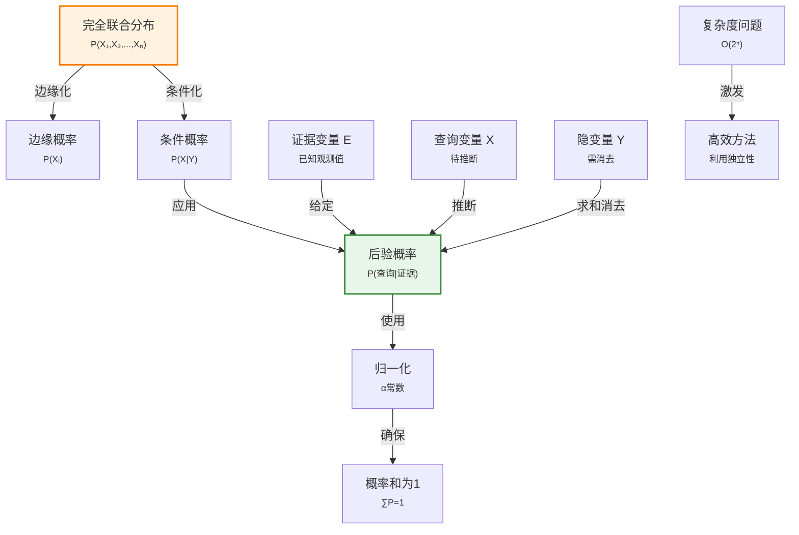

# 12.3 使用完全联合分布进行推断

> 📖 本节 Deep Dive | 预计学习时间: 50 分钟

---

## 1. 背景与动机

### 1.1 历史背景

**学科演进脉络**

概率推断的历史可以追溯到18世纪贝叶斯的工作，但系统的推断方法是在20世纪随着计算能力的发展而逐步完善的。早期统计学家主要关注参数估计和假设检验，而人工智能领域更关注如何在复杂域中进行概率推理。

完全联合分布作为"知识库"的概念是概率专家系统的基础。20世纪70-80年代的早期系统（如PROSPECTOR）使用完全联合分布进行推断，但受限于计算复杂度。90年代后，利用条件独立性进行分解的方法（如贝叶斯网络）使得大规模概率推断变得可行。

**里程碑事件**:

| 年份 | 人物/事件 | 贡献 | 影响 |
|------|-----------|------|------|
| 1763 | 贝叶斯 | 贝叶斯定理 | 逆概率推理的基础 |
| 19世纪 | 拉普拉斯 | 概率分析 | 将概率应用于科学推断 |
| 1970s | 专家系统 | 概率知识库 | 实际应用中的概率推断 |
| 1980s | 贝叶斯网络 | 结构化表示 | 解决规模问题 |
| 1990s | 变分推断、采样方法 | 近似推断 | 处理复杂分布 |

**演进动机**:
- 早期方法: 使用简单规则或确定性因子进行推断
- 局限性: 缺乏严格的概率基础，难以处理复杂依赖关系
- 突破: 使用完全联合分布作为知识库，基于概率公理进行严格推断

### 1.2 研究动机

**为什么研究者关注这个主题？**

1. **理论基础**: 完全联合分布提供了概率推断的完备基础——原则上可以回答任何概率查询。

2. **方法框架**: 边缘化和条件化是概率推断的两个基本操作，所有推断方法都基于它们。

3. **复杂度意识**: 理解完全联合分布的指数复杂度，激发了对更高效方法（如利用独立性）的研究。

**与其他领域的关系**:
- 与统计学的关系: 边缘化对应于统计中的求和/积分，条件化对应于条件分布
- 与数据库的关系: 联合分布可以看作概率数据库，查询对应于概率计算
- 与物理学的关系: 统计力学中的配分函数计算类似于边缘化

### 1.3 实际应用场景

| 应用领域 | 具体问题 | 本节理论的作用 | 预期效果 |
|----------|----------|----------------|----------|
| 医疗诊断 | 根据症状推断疾病 | 计算P(疾病\|症状) | 准确的诊断概率 |
| 故障诊断 | 根据观测推断故障原因 | 计算P(故障\|观测) | 快速定位问题 |
| 自然语言理解 | 词义消歧 | 计算P(含义\|上下文) | 正确的语义理解 |
| 计算机视觉 | 场景理解 | 计算P(场景\|图像) | 准确的环境感知 |
| 推荐系统 | 用户偏好推断 | 计算P(喜欢\|历史) | 个性化推荐 |

**典型案例预览**:
> 一个牙科诊断系统需要根据患者是否牙痛(Toothache)、探针是否卡住(Catch)来推断是否有蛀牙(Cavity)。完全联合分布提供了计算P(Cavity | Toothache, Catch)的系统方法。

### 1.4 先决条件

**学习本节需要的前置知识**:

| 知识项 | 来源 | 掌握程度要求 | 关键概念 |
|--------|------|:------------:|----------|
| 概率基本记号 | 12.2节 | 必须熟练掌握 | 条件概率、联合分布 |
| 边缘化概念 | 12.2节 | 理解 | 求和消元 |
| 条件概率定义 | 12.2节 | 熟练掌握 | P(a\|b) = P(a∧b)/P(b) |
| 求和运算 | 数学基础 | 熟练掌握 | 多重求和 |

**前置检查清单**:
- [ ] 能够解释条件概率的定义
- [ ] 能够解释联合分布的含义
- [ ] 理解边缘化的直观意义

---

## 2. 知识逻辑图谱

### 2.1 概念关系图



### 2.2 知识发展依赖链

```
【表示层】           【操作层】              【推断层】             【应用层】
    ↓                   ↓                     ↓                   ↓
┌─────────┐      ┌─────────────┐       ┌───────────┐      ┌──────────┐
│ 完全联合│  ──→ │ 边缘化       │  ──→  │ 概率查询  │ ──→  │ 诊断系统  │
│ 分布    │      │ 条件化       │       │ 后验计算  │      │ 预测系统  │
│         │      │ 归一化       │       │           │      │          │
│ P(X,Y,Z)│      │ ∑, P(·|·), α │       │ P(X|e)    │      │          │
└─────────┘      └─────────────┘       └───────────┘      └──────────┘
     │                   │                   │                │
     └───────────────────┴───────────────────┴────────────────┘
                         概率推断方法演进
```

**依赖链详解**:
1. **表示**: 完全联合分布存储所有概率信息
2. **操作**: 边缘化（求和消元）、条件化（除法）、归一化
3. **推断**: 组合基本操作回答概率查询
4. **应用**: 诊断、预测等实际任务

### 2.3 本节在章节中的位置

```
第 12 章: 不确定性的量化
├── 12.2 基本概率记号 ← 前置知识
│   └── [引入: 联合分布、条件概率]
│
├── 12.3 使用完全联合分布进行推断 ← ⭐ 当前位置
│   ├── [核心概念: 边缘化、条件化]
│   ├── [核心方法: 求和消元、归一化]
│   └── [限制: 指数复杂度]
│
├── 12.4 独立性 ← 后续发展
│   └── [将解决: 复杂度问题]
```

**衔接说明**:
- **从前继承**: 12.2节的联合分布和条件概率概念
- **为后铺垫**: 本节揭示的复杂度问题激发了对独立性（12.4节）和贝叶斯法则（12.5节）的研究

---

## 3. 核心概念与数学分析

### 3.1 核心术语定义

**定义 12.3.1** (完全联合分布 / Full Joint Probability Distribution):

> **正式定义**: 为域中所有随机变量的每种完整赋值指定概率的分布。

**数学表述**: 对变量$X_1, X_2, ..., X_n$，完全联合分布为$\mathbf{P}(X_1, X_2, ..., X_n)$。

**示例**: 对变量Cavity、Toothache、Catch，完全联合分布是一个$2 \times 2 \times 2$的表，共8个条目。

**重要性**: 原则上，完全联合分布足够计算任何命题的概率。

---

**定义 12.3.2** (边缘化 / Marginalization):

> **正式定义**: 通过对其他变量的所有可能值求和，消去这些变量，得到某个变量子集的概率分布。

**数学表述**:
$$\mathbf{P}(\mathbf{Y}) = \sum_{\mathbf{z}} \mathbf{P}(\mathbf{Y}, \mathbf{Z}=\mathbf{z}) \tag{12-7}$$

其中$\sum_{\mathbf{z}}$对变量集合$\mathbf{Z}$的所有可能值组合求和。

**别名**: 求和消元（summing out）

**示例**:
$$P(\text{cavity}) = \sum_{t \in \{t, \neg t\}} \sum_{c \in \{c, \neg c\}} P(\text{cavity}, t, c)$$

---

**定义 12.3.3** (条件化 / Conditioning):

> **正式定义**: 使用条件概率和边缘概率计算边缘分布的规则。

**数学表述**:
$$\mathbf{P}(\mathbf{Y}) = \sum_{\mathbf{z}} \mathbf{P}(\mathbf{Y} | \mathbf{z}) P(\mathbf{z}) \tag{12-8}$$

**直观理解**: $Y$的概率是$Y$在给定各$z$时的条件概率的加权平均，权重是$z$的概率。

---

**定义 12.3.4** (归一化 / Normalization):

> **正式定义**: 将一组数值缩放，使其和为1，从而成为有效概率分布的过程。

**数学表述**: 若$\mathbf{v} = \langle v_1, v_2, ..., v_n \rangle$，则归一化分布为：
$$\mathbf{P} = \alpha \mathbf{v} = \frac{\mathbf{v}}{\sum_i v_i}$$

其中$\alpha = 1/\sum_i v_i$是归一化常数。

**作用**: 在不知道分母$P(\mathbf{e})$时，可以先计算未归一化的值，然后归一化得到正确概率。

---

**定义 12.3.5** (概率推断 / Probabilistic Inference):

> **正式定义**: 给定观测证据，计算查询命题的后验概率的过程。

**通用公式**:
$$\mathbf{P}(X | \mathbf{e}) = \alpha \mathbf{P}(X, \mathbf{e}) = \alpha \sum_{\mathbf{y}} \mathbf{P}(X, \mathbf{e}, \mathbf{y}) \tag{12-9}$$

其中：
- $X$是查询变量
- $\mathbf{e}$是证据（观测值）
- $\mathbf{y}$是隐变量（未观测变量$Y$的值）
- $\alpha$是归一化常数

### 3.2 符号系统与约定

**本节符号总表**:

| 符号 | 含义 | 数学表达 | 备注 |
|:----:|------|----------|------|
| $\mathbf{P}(X_1,...,X_n)$ | 完全联合分布 | 所有变量组合的联合概率 | 知识库 |
| $\mathbf{P}(\mathbf{Y})$ | 边缘分布 | $\sum_{\mathbf{z}} \mathbf{P}(\mathbf{Y}, \mathbf{z})$ | 式(12-7) |
| $\mathbf{P}(X \| \mathbf{e})$ | 后验分布 | 给定证据的查询分布 | 推断目标 |
| $\alpha$ | 归一化常数 | $1/P(\mathbf{e})$ | 使概率和为1 |
| $X$ | 查询变量 | 待推断的变量 | 单变量或多变量 |
| $\mathbf{E}$ | 证据变量 | 已观测的变量 | 已知值$\mathbf{e}$ |
| $\mathbf{Y}$ | 隐变量 | 未观测的变量 | 需消去 |

### 3.3 关键公式与性质

#### 公式 1: 边缘化规则

**数学表述**:
$$\mathbf{P}(\mathbf{Y}) = \sum_{\mathbf{z}} \mathbf{P}(\mathbf{Y}, \mathbf{Z}=\mathbf{z})$$

**公式要素解析**:

| 维度 | 内容 |
|------|------|
| **直观解释** | 要得到$Y$的概率，需要对所有$Z$的可能值求和，把$Z$"消去" |
| **几何意义** | 在联合分布表中，对$Z$维度"压缩"，得到$Y$的边缘分布 |
| **使用条件** | 已知联合分布$\mathbf{P}(\mathbf{Y}, \mathbf{Z})$ |

---

#### 公式 2: 条件化规则

**数学表述**:
$$\mathbf{P}(\mathbf{Y}) = \sum_{\mathbf{z}} \mathbf{P}(\mathbf{Y} | \mathbf{z}) P(\mathbf{z})$$

**公式要素解析**:

| 维度 | 内容 |
|------|------|
| **直观解释** | $Y$的概率是各条件下$Y$概率的加权平均 |
| **与边缘化的关系** | 由乘积法则$\mathbf{P}(\mathbf{Y}, \mathbf{z}) = \mathbf{P}(\mathbf{Y} | \mathbf{z})P(\mathbf{z})$导出 |

---

#### 公式 3: 通用推断公式

**数学表述**:
$$\mathbf{P}(X | \mathbf{e}) = \alpha \sum_{\mathbf{y}} \mathbf{P}(X, \mathbf{e}, \mathbf{y})$$

**公式要素解析**:

| 维度 | 内容 |
|------|------|
| **直观解释** | 后验概率正比于联合概率对隐变量的求和 |
| **计算步骤** | 1. 从联合分布中提取$P(X, \mathbf{e}, \mathbf{y})$；2. 对$\mathbf{y}$求和；3. 归一化 |
| **复杂度** | $O(2^n)$，其中$n$是变量数 |

### 3.4 重要性质与推论

**性质 12.3.1** (归一化技巧):

> **陈述**: 在计算条件概率时，可以暂时忽略归一化常数，最后通过使概率和为1来确定。

**数学表述**:
$$\mathbf{P}(X | \mathbf{e}) = \alpha \mathbf{P}(X, \mathbf{e})$$

其中$\mathbf{P}(X, \mathbf{e})$是未归一化的值。

**优点**: 
- 避免计算$P(\mathbf{e})$（可能很困难）
- 简化计算过程

---

**性质 12.3.2** (完全联合分布的完备性):

> **陈述**: 完全联合分布原则上可以回答域中的任何概率查询。

**证明**: 任何查询都可以表示为$\mathbf{P}(X | \mathbf{e})$，而式(12-9)表明这可以从完全联合分布计算得到。

**重要性**: 完全联合分布是概率推断的"通用"知识表示。

---

**性质 12.3.3** (指数复杂度):

> **陈述**: 对$n$个布尔变量，完全联合分布有$2^n$个条目，推断需要$O(2^n)$时间。

**分析**: 
- 存储：需要$O(2^n)$空间
- 计算：边缘化需要$O(2^n)$时间
- 学习：从数据估计$O(2^n)$个参数需要指数级样本

**示例**: $n=100$时，$2^{100} \approx 10^{30}$，完全不切实际。

---

## 4. 定理与证明

### 4.1 推断正确性定理

**定理 12.3.1** (推断正确性定理 / Inference Correctness Theorem):

> **正式陈述**: 使用式(12-9)从完全联合分布计算的后验概率$\mathbf{P}(X | \mathbf{e})$满足概率公理，且与条件概率定义一致。

**定理解读**:
- **条件**: 完全联合分布满足概率公理
- **结论**: 推断结果$\mathbf{P}(X | \mathbf{e})$是有效的概率分布
- **定理意义**: 保证推断方法的数学正确性

### 4.2 证明详解

**证明策略概览**:

验证式(12-9)的结果满足概率公理，特别是非负性和归一性。

**核心思路**: 直接验证公理

---

**正式证明**:

**步骤 1**: 非负性验证

对任意$x$，
$$P(x | \mathbf{e}) = \alpha \sum_{\mathbf{y}} P(x, \mathbf{e}, \mathbf{y})$$

由于$P(x, \mathbf{e}, \mathbf{y}) \geq 0$（联合分布满足公理）且$\alpha > 0$，有$P(x | \mathbf{e}) \geq 0$。

---

**步骤 2**: 归一性验证

$$\begin{aligned} \sum_x P(x | \mathbf{e}) &= \sum_x \alpha \sum_{\mathbf{y}} P(x, \mathbf{e}, \mathbf{y}) \\ &= \alpha \sum_x \sum_{\mathbf{y}} P(x, \mathbf{e}, \mathbf{y}) \\ &= \alpha P(\mathbf{e}) \quad \text{（边缘化）} \\ &= \frac{1}{P(\mathbf{e})} \cdot P(\mathbf{e}) \\ &= 1 \end{aligned}$$

因此，$\mathbf{P}(X | \mathbf{e})$是有效的概率分布。

---

**步骤 3**: 与条件概率定义的一致性

由条件概率定义：
$$P(x | \mathbf{e}) = \frac{P(x, \mathbf{e})}{P(\mathbf{e})}$$

由边缘化：
$$P(x, \mathbf{e}) = \sum_{\mathbf{y}} P(x, \mathbf{e}, \mathbf{y})$$

因此：
$$P(x | \mathbf{e}) = \frac{\sum_{\mathbf{y}} P(x, \mathbf{e}, \mathbf{y})}{P(\mathbf{e})} = \alpha \sum_{\mathbf{y}} P(x, \mathbf{e}, \mathbf{y})$$

与式(12-9)一致。

因此，定理得证。

$$\blacksquare \text{ (证毕)}$$

### 4.3 证明分析与提炼

**核心洞见**: 推断公式的正确性完全依赖于概率公理和边缘化的数学性质。

**证明技巧总结**:

| 技巧 | 在本证明中的应用 | 可迁移性 | 其他应用场景 |
|------|------------------|----------|--------------|
| 公理验证 | 验证非负性和归一性 | ⭐⭐⭐⭐⭐ | 任何概率方法的正确性证明 |
| 代数推导 | 使用边缘化性质 | ⭐⭐⭐⭐⭐ | 概率计算 |

---

## 5. 具体示例与详解

### 5.1 牙科诊断推断示例

**示例 12.3.1**: 从完全联合分布推断

**📋 问题陈述**:

考虑三个布尔变量：Cavity（蛀牙）、Toothache（牙痛）、Catch（探针卡住）。完全联合分布如下表：

| | toothache, catch | toothache, ¬catch | ¬toothache, catch | ¬toothache, ¬catch |
|---|---|---|---|---|
| cavity | 0.108 | 0.012 | 0.072 | 0.008 |
| ¬cavity | 0.016 | 0.064 | 0.144 | 0.576 |

**求解**:
1. 计算$P(\text{cavity} \vee \text{toothache})$
2. 计算$P(\text{cavity})$
3. 计算$P(\text{cavity} | \text{toothache})$
4. 计算$\mathbf{P}(\text{Cavity} | \text{toothache})$

---

**🔍 解答过程**:

**步骤 1: 计算$P(\text{cavity} \vee \text{toothache})$**

$cavity \vee toothache$在以下世界为真：
- (cavity, toothache, catch): 0.108
- (cavity, toothache, ¬catch): 0.012
- (cavity, ¬toothache, catch): 0.072
- (cavity, ¬toothache, ¬catch): 0.008
- (¬cavity, toothache, catch): 0.016
- (¬cavity, toothache, ¬catch): 0.064

$$P(\text{cavity} \vee \text{toothache}) = 0.108 + 0.012 + 0.072 + 0.008 + 0.016 + 0.064 = 0.28$$

**步骤 2: 计算$P(\text{cavity})$（边缘化）**

$$\begin{aligned} P(\text{cavity}) &= 0.108 + 0.012 + 0.072 + 0.008 \\ &= 0.2 \end{aligned}$$

**步骤 3: 计算$P(\text{cavity} | \text{toothache})$**

首先计算$P(\text{toothache})$：
$$\begin{aligned} P(\text{toothache}) &= 0.108 + 0.012 + 0.016 + 0.064 \\ &= 0.2 \end{aligned}$$

然后计算$P(\text{cavity} \wedge \text{toothache})$：
$$P(\text{cavity} \wedge \text{toothache}) = 0.108 + 0.012 = 0.12$$

因此：
$$P(\text{cavity} | \text{toothache}) = \frac{0.12}{0.2} = 0.6$$

**步骤 4: 使用归一化计算$\mathbf{P}(\text{Cavity} | \text{toothache})$**

$$\begin{aligned} \mathbf{P}(\text{Cavity} | \text{toothache}) &= \alpha \mathbf{P}(\text{Cavity}, \text{toothache}) \\ &= \alpha [\mathbf{P}(\text{Cavity}, \text{toothache}, \text{catch}) + \mathbf{P}(\text{Cavity}, \text{toothache}, \neg \text{catch})] \\ &= \alpha [\langle 0.108, 0.016 \rangle + \langle 0.012, 0.064 \rangle] \\ &= \alpha \langle 0.12, 0.08 \rangle \\ &= \langle 0.6, 0.4 \rangle \end{aligned}$$

其中$\alpha = 1/(0.12 + 0.08) = 5$。

---

**✅ 验证与检验**:

**正确性检查**:
- [x] 所有概率在[0,1]范围内
- [x] 条件概率结果和为1（0.6 + 0.4 = 1）
- [x] 与步骤3的结果一致

**结果的意义**: 观察到牙痛后，患者有蛀牙的概率从20%上升到60%。

---

### 5.2 复杂度分析示例

**示例 12.3.2**: 完全联合分布的规模

**场景**: 考虑一个医疗诊断域，有：
- 20种疾病
- 50种症状

**计算**:

假设所有变量都是二值的（有/无）。

完全联合分布的条目数：
$$2^{20 + 50} = 2^{70} \approx 1.18 \times 10^{21}$$

如果每个概率用8字节存储，总存储需求：
$$1.18 \times 10^{21} \times 8 \text{字节} \approx 9.4 \times 10^{21} \text{字节} \approx 9.4 \text{ZB}$$

（ZB = Zettabyte，目前全球数据总量约为几十ZB）

**教训**: 完全联合分布在实际中不可行，需要利用结构（如条件独立性）进行分解。

---

### 5.3 类比与可视化

**直觉类比**:

| 抽象概念 | 日常类比 | 对应关系 |
|----------|----------|----------|
| 完全联合分布 | 完整的地图 | 包含所有信息，但太大难以使用 |
| 边缘化 | 从地图提取某条路线 | 压缩信息，关注特定方面 |
| 条件化 | 给定起点，规划路线 | 基于已知信息更新 |
| 归一化 | 调整比例尺 | 确保比例正确 |

**可视化**:

```
完全联合分布 P(Cavity, Toothache, Catch):
                    Toothache
                 T          ¬T
              ┌─────────┬─────────┐
         T    │  0.108  │  0.072  │
    C   Catch │  0.016  │  0.144  │
    a   ──────┼─────────┼─────────┤
    v   ¬Catch│  0.012  │  0.008  │
    i         │  0.064  │  0.576  │
    t         └─────────┴─────────┘
    y
    
边缘化 P(Cavity):
    P(cavity) = 0.108 + 0.012 + 0.072 + 0.008 = 0.2
    P(¬cavity) = 0.016 + 0.064 + 0.144 + 0.576 = 0.8
```

---

## 6. 深入理解与拓展

### 6.1 一句话本质

> 🎯 **核心要点**: 完全联合分布是概率推断的完备知识库，通过边缘化（求和消元）和条件化（除法归一化）可以回答任何概率查询，但其指数复杂度促使我们寻找更高效的方法。

### 6.2 深入思考问题

1. **概念层面**: 为什么完全联合分布是"完备"的？是否存在它无法回答的查询？
   <!-- 思考方向: 考虑任何概率查询都可以表示为P(X|e)，而式(12-9)可以从联合分布计算它 -->

2. **方法层面**: 归一化技巧为什么有效？它在什么情况下特别有用？
   <!-- 思考方向: 当P(e)难以直接计算时，归一化避免了显式计算它 -->

3. **应用层面**: 在实际系统中，如何估计完全联合分布的参数？
   <!-- 思考方向: 从数据频率估计、专家知识、或结合两者 -->

4. **拓展层面**: 除了利用独立性，还有哪些方法可以处理指数复杂度？
   <!-- 思考方向: 近似推断（采样、变分）、参数化分布、神经网络等 -->

### 6.3 与其他节的关系

**本节输出**:
- 建立了概率推断的基本方法（边缘化、条件化）
- 揭示了完全联合分布的指数复杂度问题
- 为后续寻找高效方法提供了动机

**后续发展预告**:
- 12.4节将介绍独立性来降低复杂度
- 12.5节将介绍贝叶斯法则，提供更灵活的推断方式
- 第13章将介绍贝叶斯网络等结构化表示

---

## 7. 总结与反思

### 7.1 关键要点总结

本节必须掌握的 **5** 个核心要点:

1. **完全联合分布**: 为所有变量的每种赋值指定概率，是概率推断的完备知识库
   
   💡 *记忆技巧*: "完全"意味着包含所有信息

2. **边缘化**: 通过对其他变量求和消元，得到边缘分布
   $$\mathbf{P}(\mathbf{Y}) = \sum_{\mathbf{z}} \mathbf{P}(\mathbf{Y}, \mathbf{z})$$
   
   💡 *记忆技巧*: "边缘"=从联合表的边缘看

3. **条件化**: 使用条件概率计算边缘分布
   $$\mathbf{P}(\mathbf{Y}) = \sum_{\mathbf{z}} \mathbf{P}(\mathbf{Y} | \mathbf{z})P(\mathbf{z})$$
   
   💡 *记忆技巧*: 条件化=加权平均

4. **通用推断公式**: 后验概率可以通过边缘化和归一化计算
   $$\mathbf{P}(X | \mathbf{e}) = \alpha \sum_{\mathbf{y}} \mathbf{P}(X, \mathbf{e}, \mathbf{y})$$
   
   💡 *记忆技巧*: "后验=归一化的联合边缘"

5. **指数复杂度**: 对$n$个布尔变量，完全联合分布需要$O(2^n)$空间和时间
   
   💡 *记忆技巧*: "完全=复杂"

### 7.2 本节知识框架

```
┌─────────────────────────────────────────────────────────────┐
│  第12.3节: 使用完全联合分布进行推断                         │
├─────────────────────────────────────────────────────────────┤
│  输入/前置                                                   │
│  • 完全联合分布                                              │
│  • 证据（观测值）                                             │
│  • 查询变量                                                   │
│                                                             │
│  处理/核心                                                   │
│  • 边缘化（求和消元）                                         │
│  • 条件化（除法）                                             │
│  • 归一化                                                     │
│  ↓                                                          │
│  输出/结果                                                   │
│  • 后验概率分布                                               │
│  • 查询答案                                                   │
│                                                             │
│  应用/价值                                                   │
│  • 诊断系统                                                   │
│  • 预测系统                                                   │
│  • 理论基础（但实用性受限）                                    │
└─────────────────────────────────────────────────────────────┘
```

### 7.3 常见误解与纠正

| 常见误解 ❌ | 正确理解 ✅ | 为什么容易错 | 如何避免 |
|-------------|-------------|--------------|----------|
| ❌ 完全联合分布是实用的 | ✅ 完全联合分布理论完备但实践中不可行 | 忽略指数复杂度 | 理解$2^n$的增长速度 |
| ❌ 边缘化就是取边缘的值 | ✅ 边缘化是对其他变量求和 | 字面理解"边缘" | 理解数学定义 |
| ❌ 归一化是可选的 | ✅ 归一化确保结果是有效概率分布 | 忽略概率公理 | 记住概率和必须为1 |
| ❌ 推断总是需要计算P(e) | ✅ 可以使用归一化常数避免显式计算 | 机械套用公式 | 理解归一化技巧 |

### 7.4 反思问题

**连接性问题**:
1. 本节方法与12.2节的条件概率定义有什么关系？
2. 12.4节的独立性如何帮助解决本节的复杂度问题？

**应用性问题**:
1. 在牙科诊断例子中，如果增加更多变量（如X光结果），如何扩展推断？
2. 如果某些联合概率未知，如何进行推断？

**批判性问题**:
1. 完全联合分布方法的优点和缺点分别是什么？
2. 在什么情况下应该使用完全联合分布，什么情况下应该寻找替代方法？

### 7.5 学习检查清单

- [ ] 能够解释完全联合分布的含义
- [ ] 能够执行边缘化计算
- [ ] 能够使用通用推断公式计算后验概率
- [ ] 能够应用归一化技巧
- [ ] 理解完全联合分布的指数复杂度问题
- [ ] 能够计算简单问题的概率推断

---

## 附录

### A. 公式速查表

| 公式 | 名称 | 使用条件 | 备注 |
|:----:|------|----------|------|
| $\mathbf{P}(\mathbf{Y}) = \sum_{\mathbf{z}} \mathbf{P}(\mathbf{Y}, \mathbf{z})$ | 边缘化 | 已知联合分布 | 式(12-7) |
| $\mathbf{P}(\mathbf{Y}) = \sum_{\mathbf{z}} \mathbf{P}(\mathbf{Y} \| \mathbf{z})P(\mathbf{z})$ | 条件化 | 已知条件分布 | 式(12-8) |
| $\mathbf{P}(X \| \mathbf{e}) = \alpha \sum_{\mathbf{y}} \mathbf{P}(X, \mathbf{e}, \mathbf{y})$ | 通用推断 | 通用 | 式(12-9) |
| $\mathbf{P} = \alpha \mathbf{v}$ | 归一化 | 未归一化值 | $\alpha = 1/\sum v_i$ |

### B. 术语索引

| 术语 | 英文 | 定义 | 位置 |
|------|------|------|:----:|
| 完全联合分布 | Full Joint Distribution | 所有变量组合的联合概率 | 12.3 |
| 边缘化 | Marginalization | 求和消元得到边缘分布 | 12.3 |
| 条件化 | Conditioning | 使用条件概率计算边缘分布 | 12.3 |
| 归一化 | Normalization | 使概率和为1 | 12.3 |
| 概率推断 | Probabilistic Inference | 计算后验概率 | 12.3 |

### C. 延伸阅读

**理论深化**:
- 《概率图模型》：介绍结构化概率表示
- 《统计推断》：经典统计推断方法

**应用拓展**:
- 贝叶斯网络：利用条件独立性进行高效推断
- 马尔可夫链蒙特卡洛（MCMC）：近似推断方法

---

> 📌 **下一节**: [12.4 独立性](12.4_独立性.md)
> 
> 📚 **返回概览**: [第12章概览](00_概览.md)
