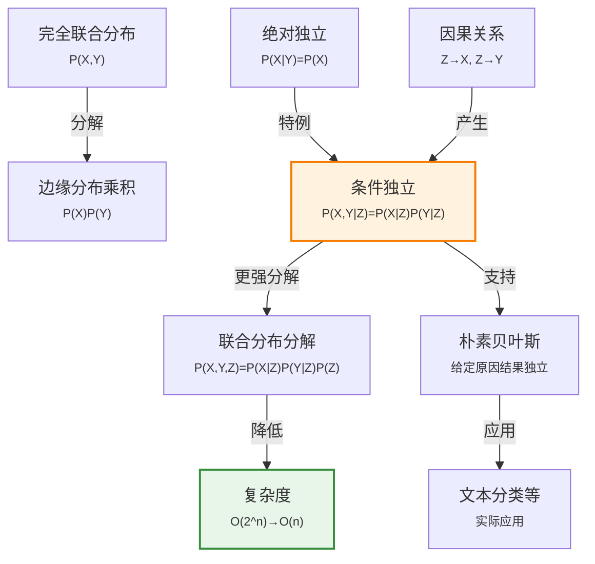

# 12.4 独立性

> 📖 本节 Deep Dive | 预计学习时间: 45 分钟

---

## 1. 背景与动机

### 1.1 历史背景

**学科演进脉络**

独立性概念是概率论的核心概念之一，其历史可以追溯到概率论的早期发展。在20世纪，随着统计学和人工智能的发展，独立性的重要性愈发凸显。特别是在概率图模型（如贝叶斯网络）的发展中，条件独立性成为表示和推理复杂概率分布的关键工具。

20世纪80年代，Judea Pearl等人发现，通过利用变量间的条件独立性，可以将指数级的联合分布分解为多项式级的局部分布，从而使大规模概率推理成为可能。这一发现催生了概率图模型领域，彻底改变了AI中不确定性处理的方式。

**里程碑事件**:

| 年份 | 人物/事件 | 贡献 | 影响 |
|------|-----------|------|------|
| 18世纪 | 早期概率论 | 独立性的直观概念 | 赌博和机会游戏分析 |
| 1933 | 柯尔莫哥洛夫 | 独立性的形式化定义 | 现代概率论基础 |
| 1980s | Judea Pearl | 贝叶斯网络 | 利用条件独立性进行高效推理 |
| 1988 | Pearl《智能系统中的概率推理》 | 系统阐述条件独立性 | 概率图模型领域的奠基之作 |
| 1990s | 变分推断、采样方法 | 近似推理 | 处理更复杂的独立性结构 |

**演进动机**:
- 早期方法: 使用完全联合分布，面临指数复杂度
- 局限性: 实际域中变量众多，完全联合分布不可行
- 突破: 发现独立性（特别是条件独立性）可以指数级降低表示和计算复杂度

### 1.2 研究动机

**为什么研究者关注这个主题？**

1. **复杂度降低**: 独立性允许将大型联合分布分解为小型局部分布，从指数级降到多项式级。

2. **模块化表示**: 独立性关系反映了域的结构，使得知识表示更加模块化和可理解。

3. **可扩展推理**: 利用独立性，概率推理可以扩展到包含数百甚至数千个变量的实际域。

**与其他领域的关系**:
- 与统计学的关系: 独立性检验是统计分析的基础
- 与因果推断的关系: 条件独立性与因果关系密切相关（d-分离等概念）
- 与机器学习的关系: 朴素贝叶斯等算法基于独立性假设

### 1.3 实际应用场景

| 应用领域 | 具体问题 | 本节理论的作用 | 预期效果 |
|----------|----------|----------------|----------|
| 医疗诊断 | 多症状、多疾病 | 症状在给定疾病下条件独立 | 可扩展的诊断系统 |
| 自然语言处理 | 语言模型 | 词语在给定主题下条件独立 | 高效的文本分类 |
| 计算机视觉 | 图像理解 | 像素在给定物体下条件独立 | 可处理的图像模型 |
| 推荐系统 | 用户行为建模 | 购买行为在给定偏好下条件独立 | 个性化推荐 |
| 金融风控 | 风险因素分析 | 风险指标在给定经济状态下条件独立 | 准确的风险评估 |

**典型案例预览**:
> 牙科诊断中，牙痛(Toothache)和探针卡住(Catch)似乎相关，但如果已知是否有蛀牙(Cavity)，这两个症状就变得独立。这种条件独立性使得联合分布可以从8个参数减少到5个参数。

### 1.4 先决条件

**学习本节需要的前置知识**:

| 知识项 | 来源 | 掌握程度要求 | 关键概念 |
|--------|------|:------------:|----------|
| 联合分布 | 12.2节 | 必须熟练掌握 | P(X,Y) |
| 条件概率 | 12.2节 | 熟练掌握 | P(X\|Y) |
| 边缘化 | 12.3节 | 理解 | 求和消元 |
| 完全联合分布的复杂度 | 12.3节 | 理解 | O(2^n) |

**前置检查清单**:
- [ ] 理解联合分布和边缘分布的关系
- [ ] 理解条件概率的定义
- [ ] 了解完全联合分布的指数复杂度问题

---

## 2. 知识逻辑图谱

### 2.1 概念关系图



### 2.2 知识发展依赖链

```
【问题层】           【概念层】              【方法层】             【应用层】
    ↓                   ↓                     ↓                   ↓
┌─────────┐      ┌─────────────┐       ┌───────────┐      ┌──────────┐
│ 指数复杂度│  ──→ │ 绝对独立性   │  ──→  │ 分布分解  │ ──→  │ 朴素贝叶斯│
│ 问题    │      │ 条件独立性   │       │ 链式法则  │      │ 贝叶斯网络│
│         │      │             │       │           │      │          │
│ O(2^n)  │      │ P(X|Y)=P(X) │       │ P(X,Y,Z)= │      │ 实际应用  │
│         │      │ P(X,Y|Z)=   │       │ P(X|Z)P(Y|│      │          │
│         │      │ P(X|Z)P(Y|Z)│       │ Z)P(Z)    │      │          │
└─────────┘      └─────────────┘       └───────────┘      └──────────┘
     │                   │                   │                │
     └───────────────────┴───────────────────┴────────────────┘
                         独立性概念演进
```

**依赖链详解**:
1. **问题**: 完全联合分布的指数复杂度
2. **概念**: 绝对独立性和条件独立性
3. **方法**: 利用独立性进行分布分解
4. **应用**: 朴素贝叶斯、贝叶斯网络等实际系统

### 2.3 本节在章节中的位置

```
第 12 章: 不确定性的量化
├── 12.3 使用完全联合分布进行推断 ← 前置知识
│   └── [揭示: 指数复杂度问题]
│
├── 12.4 独立性 ← ⭐ 当前位置
│   ├── [核心概念: 绝对独立、条件独立]
│   ├── [核心方法: 分布分解]
│   └── [价值: 降低复杂度]
│
├── 12.5 贝叶斯法则 ← 后续发展
│   └── [将应用: 条件独立性]
```

**衔接说明**:
- **从前继承**: 12.3节揭示的复杂度问题
- **为后铺垫**: 条件独立性是12.5节贝叶斯法则应用的基础

---

## 3. 核心概念与数学分析

### 3.1 核心术语定义

**定义 12.4.1** (绝对独立性 / Absolute Independence):

> **正式定义**: 两个命题（或随机变量）相互独立，意味着知道其中一个不会改变对另一个的信念。

**数学表述**:
$$P(a | b) = P(a) \quad \text{或} \quad P(b | a) = P(b) \quad \text{或} \quad P(a \wedge b) = P(a)P(b) \tag{12-11}$$

这些形式是等价的（习题12.INDI）。

**定义详解**:
- **直观解释**: $a$和$b$"无关"，知道$b$为真不会改变$a$的概率
- **对称性**: 独立性是对称的——如果$a$独立于$b$，则$b$独立于$a$
- **与互斥的区别**: 独立≠互斥！互斥事件（$P(a \wedge b) = 0$）通常是高度依赖的

---

**定义 12.4.2** (变量独立性 / Variable Independence):

> **正式定义**: 两个随机变量$X$和$Y$独立，如果对所有取值都满足独立性。

**数学表述**:
$$\mathbf{P}(X | Y) = \mathbf{P}(X) \quad \text{或} \quad \mathbf{P}(Y | X) = \mathbf{P}(Y) \quad \text{或} \quad \mathbf{P}(X, Y) = \mathbf{P}(X)\mathbf{P}(Y)$$

**示例**: 天气(Weather)和牙齿问题(Toothache)是独立的——知道天气不会改变对牙痛的信念。

---

**定义 12.4.3** (条件独立性 / Conditional Independence):

> **正式定义**: 给定第三个变量$Z$，两个变量$X$和$Y$条件独立，如果在给定$Z$时，知道$Y$不会改变对$X$的信念。

**数学表述**:
$$\mathbf{P}(X, Y | Z) = \mathbf{P}(X | Z)\mathbf{P}(Y | Z) \tag{12-19}$$

**等价形式**:
$$\mathbf{P}(X | Y, Z) = \mathbf{P}(X | Z) \quad \text{和} \quad \mathbf{P}(Y | X, Z) = \mathbf{P}(Y | Z)$$

**直观理解**: 给定$Z$后，$X$和$Y$之间的"通路"被阻断，它们不再相互影响。

---

**定义 12.4.4** (边缘独立性 / Marginal Independence):

> **正式定义**: 绝对独立性的另一种称呼，强调与条件独立性的区别。

**说明**: 边缘独立性（无条件独立性）和条件独立性是不同的概念。$X$和$Y$可能不独立，但在给定$Z$时条件独立；反之亦然。

### 3.2 符号系统与约定

**本节符号总表**:

| 符号 | 含义 | 数学表达 | 备注 |
|:----:|------|----------|------|
| $X \perp Y$ | $X$与$Y$独立 | $P(X,Y)=P(X)P(Y)$ | 常见记号 |
| $X \perp Y \| Z$ | 给定$Z$时$X$与$Y$条件独立 | $P(X,Y\|Z)=P(X\|Z)P(Y\|Z)$ | 常见记号 |
| $\mathbf{P}(X, Y)$ | 联合分布 | 矩阵形式 | 可分解时简化 |
| $\mathbf{P}(X)\mathbf{P}(Y)$ | 边缘分布乘积 | 分解形式 | 独立时成立 |

### 3.3 关键公式与性质

#### 公式 1: 独立性的联合分布分解

**数学表述**:
$$P(a \wedge b) = P(a)P(b)$$

**公式要素解析**:

| 维度 | 内容 |
|------|------|
| **直观解释** | 两个独立事件同时发生的概率等于各自概率的乘积 |
| **与互斥的区别** | 互斥：$P(a \wedge b) = 0$；独立：$P(a \wedge b) = P(a)P(b)$ |
| **使用条件** | $a$和$b$独立（知道一个不影响另一个的信念） |

---

#### 公式 2: 条件独立性的联合分布分解

**数学表述**:
$$\mathbf{P}(X, Y | Z) = \mathbf{P}(X | Z)\mathbf{P}(Y | Z)$$

**公式要素解析**:

| 维度 | 内容 |
|------|------|
| **直观解释** | 给定$Z$后，$X$和$Y$的联合条件概率等于各自条件概率的乘积 |
| **重要性** | 这是概率图模型和高效推理的基础 |

---

#### 公式 3: 利用条件独立性的完全联合分布分解

**数学表述**:
$$\mathbf{P}(\text{Toothache}, \text{Catch}, \text{Cavity}) = \mathbf{P}(\text{Toothache} | \text{Cavity})\mathbf{P}(\text{Catch} | \text{Cavity})\mathbf{P}(\text{Cavity})$$

**推导**:
$$\begin{aligned} \mathbf{P}(T, C, Cavity) &= \mathbf{P}(T, C | Cavity)\mathbf{P}(Cavity) \quad \text{（乘积法则）} \\ &= \mathbf{P}(T | Cavity)\mathbf{P}(C | Cavity)\mathbf{P}(Cavity) \quad \text{（条件独立性）} \end{aligned}$$

**复杂度降低**:
- 原始联合分布：$2 \times 2 \times 2 = 8$个条目，7个独立参数
- 分解后：$(2+2+1) = 5$个独立参数
- 对于$n$个症状，从$O(2^n)$降到$O(n)$

### 3.4 重要性质与推论

**性质 12.4.1** (独立性的对称性):

> **陈述**: 如果$X$独立于$Y$，则$Y$独立于$X$。

**证明**: 由$P(X, Y) = P(X)P(Y)$的对称性直接可得。

---

**性质 12.4.2** (条件独立性的对称性):

> **陈述**: 给定$Z$时，如果$X$条件独立于$Y$，则$Y$条件独立于$X$。

**证明**: 由$P(X, Y | Z) = P(X | Z)P(Y | Z)$的对称性直接可得。

---

**性质 12.4.3** (独立性与边缘化的关系):

> **陈述**: 如果$X$和$Y$独立，则$P(X) = \sum_y P(X | y)P(y) = P(X)\sum_y P(y) = P(X)$，一致性成立。

---

**性质 12.4.4** (条件独立性的链式结构):

> **陈述**: 如果$Z$是$X$和$Y$的共同原因，则给定$Z$时，$X$和$Y$条件独立。

**直观**: $Z$"解释"了$X$和$Y$之间的相关性。知道$Z$后，$X$和$Y$之间没有直接联系。

**示例**: 蛀牙($Z$)导致牙痛($X$)和探针卡住($Y$)。给定蛀牙状态，牙痛和探针卡住独立。

---

## 4. 定理与证明

### 4.1 独立性等价定理

**定理 12.4.1** (独立性等价定理 / Independence Equivalence Theorem):

> **正式陈述**: 对任意两个命题$a$和$b$，以下条件等价：
> 1. $P(a | b) = P(a)$
> 2. $P(b | a) = P(b)$
> 3. $P(a \wedge b) = P(a)P(b)$

**定理解读**:
- **条件**: 命题$a$和$b$
- **结论**: 三个条件是等价的，任何一个都意味着独立性
- **定理意义**: 提供独立性的多种等价表述，便于不同场景使用

### 4.2 证明详解

**证明策略概览**:

证明(1)⇒(3)⇒(2)⇒(1)，形成循环，从而证明等价性。

**核心思路**: 利用条件概率定义和乘积法则

---

**正式证明**:

**步骤 1**: (1) ⇒ (3)

假设$P(a | b) = P(a)$。

由乘积法则：
$$P(a \wedge b) = P(a | b)P(b) = P(a)P(b)$$

因此(3)成立。

---

**步骤 2**: (3) ⇒ (2)

假设$P(a \wedge b) = P(a)P(b)$。

由条件概率定义（假设$P(a) > 0$）：
$$P(b | a) = \frac{P(a \wedge b)}{P(a)} = \frac{P(a)P(b)}{P(a)} = P(b)$$

因此(2)成立。

---

**步骤 3**: (2) ⇒ (1)

假设$P(b | a) = P(b)$。

由乘积法则：
$$P(a \wedge b) = P(b | a)P(a) = P(b)P(a)$$

再由条件概率定义（假设$P(b) > 0$）：
$$P(a | b) = \frac{P(a \wedge b)}{P(b)} = \frac{P(a)P(b)}{P(b)} = P(a)$$

因此(1)成立。

因此，三个条件等价。

$$\blacksquare \text{ (证毕)}$$

### 4.3 证明分析与提炼

**核心洞见**: 独立性的不同表述本质上是同一概念的不同视角——条件概率视角、联合概率视角、对称视角。

**证明技巧总结**:

| 技巧 | 在本证明中的应用 | 可迁移性 | 其他应用场景 |
|------|------------------|----------|--------------|
| 循环证明 | (1)⇒(3)⇒(2)⇒(1) | ⭐⭐⭐⭐⭐ | 等价关系证明 |
| 条件概率定义 | 核心工具 | ⭐⭐⭐⭐⭐ | 所有概率证明 |
| 乘积法则 | 核心工具 | ⭐⭐⭐⭐⭐ | 联合概率计算 |

---

## 5. 具体示例与详解

### 5.1 天气与牙科问题示例

**示例 12.4.1**: 绝对独立性的应用

**📋 问题陈述**:

考虑四个变量：
- Weather: {sun, rain, cloud, snow}
- Toothache: {true, false}
- Catch: {true, false}
- Cavity: {true, false}

假设Weather与牙科变量(Toothache, Catch, Cavity)独立。

**已知**:
- $\mathbf{P}(\text{Toothache}, \text{Catch}, \text{Cavity})$（8个条目）
- $\mathbf{P}(\text{Weather})$（4个条目）

**求解**: 完全联合分布$\mathbf{P}(\text{Weather}, \text{Toothache}, \text{Catch}, \text{Cavity})$需要多少参数？

---

**🔍 解答过程**:

**步骤 1: 利用独立性**

由于Weather与牙科变量独立：
$$\mathbf{P}(\text{Weather}, \text{Toothache}, \text{Catch}, \text{Cavity}) = \mathbf{P}(\text{Weather})\mathbf{P}(\text{Toothache}, \text{Catch}, \text{Cavity})$$

**步骤 2: 计算参数数量**

- 原始联合分布：$4 \times 2 \times 2 \times 2 = 32$个条目，31个独立参数
- 分解后：
  - $\mathbf{P}(\text{Weather})$: 4个条目，3个独立参数
  - $\mathbf{P}(\text{Toothache}, \text{Catch}, \text{Cavity})$: 8个条目，7个独立参数
  - 总计：$3 + 7 = 10$个独立参数

**步骤 3: 复杂度降低**

从31个参数降到10个参数，降低了约68%。

---

**✅ 验证与检验**:

**正确性检查**:
- [x] 独立性假设合理（天气不影响牙科问题）
- [x] 参数计算正确（每个分布的条目数减1）

**结果的意义**: 独立性显著降低了表示复杂度。

---

### 5.2 牙科症状条件独立示例

**示例 12.4.2**: 条件独立性的应用

**📋 问题陈述**:

在牙科诊断中，考虑：
- Cavity（蛀牙）：原因变量
- Toothache（牙痛）：症状1
- Catch（探针卡住）：症状2

假设给定Cavity时，Toothache和Catch条件独立。

**已知**:
- $P(\text{cavity}) = 0.2$
- $\mathbf{P}(\text{Toothache} | \text{Cavity})$: 2×2表
- $\mathbf{P}(\text{Catch} | \text{Cavity})$: 2×2表

**求解**: 
1. 写出联合分布的分解形式
2. 计算参数数量
3. 计算$P(\text{toothache}, \text{catch}, \text{cavity})$

---

**🔍 解答过程**:

**步骤 1: 联合分布分解**

由条件独立性：
$$\mathbf{P}(\text{Toothache}, \text{Catch}, \text{Cavity}) = \mathbf{P}(\text{Toothache} | \text{Cavity})\mathbf{P}(\text{Catch} | \text{Cavity})\mathbf{P}(\text{Cavity})$$

**步骤 2: 参数数量**

- 原始联合分布：$2 \times 2 \times 2 = 8$个条目，7个独立参数
- 分解后：
  - $\mathbf{P}(\text{Toothache} | \text{Cavity})$: 2行，每行和为1，2个独立参数
  - $\mathbf{P}(\text{Catch} | \text{Cavity})$: 2行，每行和为1，2个独立参数
  - $\mathbf{P}(\text{Cavity})$: 1个独立参数
  - 总计：$2 + 2 + 1 = 5$个独立参数

**步骤 3: 计算具体概率**

假设：
- $P(\text{toothache} | \text{cavity}) = 0.6$，$P(\text{toothache} | \neg \text{cavity}) = 0.1$
- $P(\text{catch} | \text{cavity}) = 0.9$，$P(\text{catch} | \neg \text{cavity}) = 0.2$

则：
$$\begin{aligned} P(\text{toothache}, \text{catch}, \text{cavity}) &= P(\text{toothache} | \text{cavity})P(\text{catch} | \text{cavity})P(\text{cavity}) \\ &= 0.6 \times 0.9 \times 0.2 \\ &= 0.108 \end{aligned}$$

---

**✅ 验证与检验**:

**正确性检查**:
- [x] 分解形式正确（应用条件独立性）
- [x] 参数计算正确
- [x] 具体计算正确

**结果的意义**: 条件独立性使得联合分布可以从7个参数降到5个参数。对于$n$个症状，复杂度从$O(2^n)$降到$O(n)$。

---

### 5.3 类比与可视化

**直觉类比**:

| 抽象概念 | 日常类比 | 对应关系 |
|----------|----------|----------|
| 独立性 | 两个陌生人 | 知道一个人的信息不影响对另一个人的了解 |
| 条件独立性 | 共同朋友介绍的两个陌生人 | 知道共同朋友后，两人不再相关 |
| 联合分布分解 | 分别打包行李 | 总空间=各自空间之和（而非乘积） |
| 复杂度降低 | 压缩文件 | 利用结构减少存储需求 |

**可视化**:

```
条件独立性的因果结构：

    Cavity (Z)
      /    \
     /      \
    ↓        ↓
Toothache  Catch
   (X)       (Y)

解释：
- Z是X和Y的共同原因
- 给定Z，X和Y之间的通路被阻断
- P(X,Y|Z) = P(X|Z)P(Y|Z)
```

---

## 6. 深入理解与拓展

### 6.1 一句话本质

> 🎯 **核心要点**: 独立性（特别是条件独立性）通过将大型联合分布分解为小型局部分布，将概率表示和推理的复杂度从指数级降低到多项式级，是概率AI可扩展性的关键。

### 6.2 深入思考问题

1. **概念层面**: 为什么条件独立性比绝对独立性更常见、更有用？
   
   <!-- 思考方向: 现实世界中变量通常通过中间变量间接相关，条件独立性反映了这种结构 -->

2. **方法层面**: 如何发现或验证变量间的独立性关系？
   
   <!-- 思考方向: 领域知识、统计检验、因果发现算法等方法 -->

3. **应用层面**: 朴素贝叶斯假设"给定原因时所有结果独立"，这个假设在实际中是否合理？
   
   <!-- 思考方向: 通常是简化假设，但实践中往往工作良好（见12.6节） -->

4. **拓展层面**: 条件独立性与因果关系有什么关系？
   
   <!-- 思考方向: d-分离、因果图、do-演算等概念 -->

### 6.3 与其他节的关系

**本节输出**:
- 介绍了独立性和条件独立性的概念
- 展示了如何利用独立性降低复杂度
- 为朴素贝叶斯模型（12.6节）奠定基础

**后续发展预告**:
- 12.5节将结合贝叶斯法则和条件独立性进行推理
- 12.6节将介绍朴素贝叶斯模型，应用条件独立性
- 第13章将介绍贝叶斯网络，系统利用条件独立性

---

## 7. 总结与反思

### 7.1 关键要点总结

本节必须掌握的 **5** 个核心要点:

1. **绝对独立性**: $P(a | b) = P(a)$，知道$b$不改变对$a$的信念
   
   💡 *记忆技巧*: "独立=无关"

2. **条件独立性**: $P(X, Y | Z) = P(X | Z)P(Y | Z)$，给定$Z$后$X$和$Y$无关
   
   💡 *记忆技巧*: "给定Z，X和Y的通路被阻断"

3. **联合分布分解**: 独立性允许将联合分布分解为边缘分布的乘积
   $$P(X, Y) = P(X)P(Y)$$
   
   💡 *记忆技巧*: "独立=乘积"

4. **复杂度降低**: 从$O(2^n)$降到$O(n)$（朴素贝叶斯情形）
   
   💡 *记忆技巧*: "独立=可扩展"

5. **因果结构**: 共同原因结构（Z→X, Z→Y）产生条件独立性
   
   💡 *记忆技巧*: "共同原因解释相关性"

### 7.2 本节知识框架

```
┌─────────────────────────────────────────────────────────────┐
│  第12.4节: 独立性                                           │
├─────────────────────────────────────────────────────────────┤
│  输入/前置                                                   │
│  • 完全联合分布的指数复杂度问题                               │
│  • 联合分布和条件概率概念                                     │
│                                                             │
│  处理/核心                                                   │
│  • 识别独立性关系                                             │
│  • 应用分布分解                                               │
│  • 降低表示复杂度                                             │
│  ↓                                                          │
│  输出/结果                                                   │
│  • 分解后的分布表示                                           │
│  • 多项式级复杂度                                             │
│                                                             │
│  应用/价值                                                   │
│  • 朴素贝叶斯模型                                             │
│  • 贝叶斯网络                                                 │
│  • 可扩展的概率推理                                           │
└─────────────────────────────────────────────────────────────┘
```

### 7.3 常见误解与纠正

| 常见误解 ❌ | 正确理解 ✅ | 为什么容易错 | 如何避免 |
|-------------|-------------|--------------|----------|
| ❌ 独立=互斥 | ✅ 独立：P(a∧b)=P(a)P(b)；互斥：P(a∧b)=0 | 日常语言混淆 | 记住数学定义 |
| ❌ 条件独立意味着边缘独立 | ✅ 两者是不同的概念 | 名称相似 | 理解条件的作用 |
| ❌ 独立性总是成立 | ✅ 独立性是特殊结构，需要验证 | 过度简化 | 检验或假设 |
| ❌ 条件独立性只适用于因果结构 | ✅ 条件独立性是统计性质，不限于因果 | 混淆统计和因果 | 区分概念 |

### 7.4 反思问题

**连接性问题**:
1. 本节的独立性概念如何帮助解决12.3节的复杂度问题？
2. 12.5节的贝叶斯法则如何与条件独立性结合？

**应用性问题**:
1. 在实际域中，如何确定变量间的独立性关系？
2. 如果独立性假设不完全成立，对推理有什么影响？

**批判性问题**:
1. 独立性假设的优缺点分别是什么？
2. 在什么情况下应该放松独立性假设？

### 7.5 学习检查清单

- [ ] 能够解释绝对独立性的含义
- [ ] 能够解释条件独立性的含义
- [ ] 能够利用独立性分解联合分布
- [ ] 能够计算独立性带来的复杂度降低
- [ ] 理解独立性和互斥的区别
- [ ] 能够识别产生条件独立性的因果结构

---

## 附录

### A. 公式速查表

| 公式 | 名称 | 使用条件 | 备注 |
|:----:|------|----------|------|
| $P(a \wedge b) = P(a)P(b)$ | 独立性 | $a \perp b$ | 式(12-11) |
| $\mathbf{P}(X, Y \| Z) = \mathbf{P}(X \| Z)\mathbf{P}(Y \| Z)$ | 条件独立性 | $X \perp Y \| Z$ | 式(12-19) |
| $\mathbf{P}(X, Y, Z) = \mathbf{P}(X \| Z)\mathbf{P}(Y \| Z)\mathbf{P}(Z)$ | 分解形式 | $X \perp Y \| Z$ | 应用形式 |

### B. 术语索引

| 术语 | 英文 | 定义 | 位置 |
|------|------|------|:----:|
| 绝对独立性 | Absolute Independence | 无条件下的独立性 | 12.4 |
| 边缘独立性 | Marginal Independence | 绝对独立性的别名 | 12.4 |
| 条件独立性 | Conditional Independence | 给定条件下的独立性 | 12.4 |
| 联合分布分解 | Joint Distribution Factorization | 利用独立性分解联合分布 | 12.4 |

### C. 延伸阅读

**理论深化**:
- 《概率图模型：原理与技术》：深入介绍条件独立性
- 《因果推断》：条件独立性与因果关系

**应用拓展**:
- 贝叶斯网络：利用条件独立性进行高效推理
- 结构学习：从数据中发现独立性关系

---

> 📌 **下一节**: [12.5 贝叶斯法则及其应用](12.5_贝叶斯法则及其应用.md)
> 
> 📚 **返回概览**: [第12章概览](00_概览.md)
