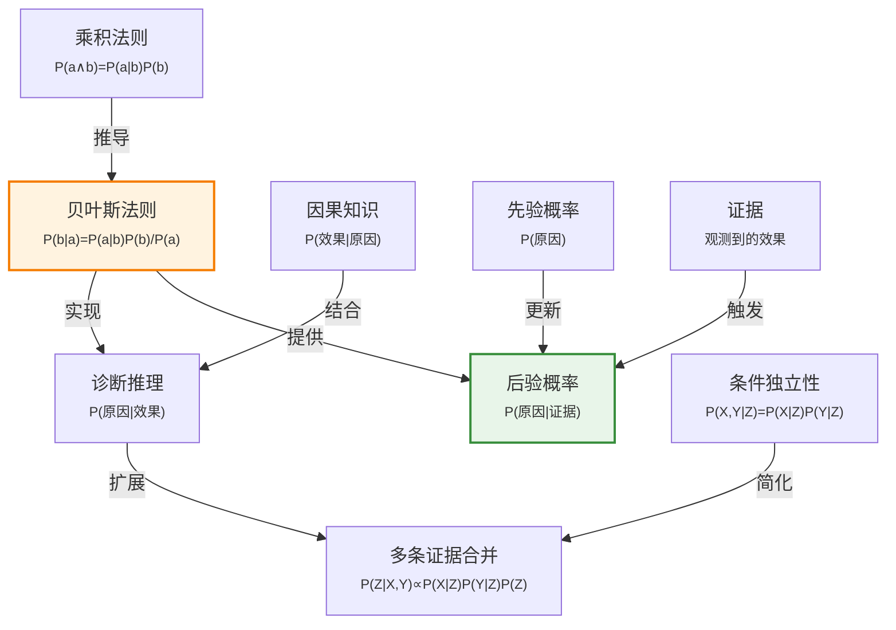

# 12.5 贝叶斯法则及其应用

> 📖 本节 Deep Dive | 预计学习时间: 55 分钟

---

## 1. 背景与动机

### 1.1 历史背景

**学科演进脉络**

贝叶斯法则以18世纪英国数学家托马斯·贝叶斯（Thomas Bayes）的名字命名，他在1763年发表的论文中首次提出了这一规则（遗作）。然而，贝叶斯只考虑了均匀先验的特殊情况。法国数学家皮埃尔-西蒙·拉普拉斯（Pierre-Simon Laplace）在1812年独立发展了贝叶斯法则的一般形式，并将其广泛应用于科学推断。

贝叶斯方法在20世纪经历了起伏。频率主义统计学在20世纪上半叶占据主导地位，贝叶斯方法被视为"主观"而受到质疑。然而，随着计算能力的提升和MCMC等采样方法的发展，贝叶斯方法在20世纪末重新兴起，并在21世纪成为机器学习和人工智能的核心方法之一。

**里程碑事件**:

| 年份 | 人物/事件 | 贡献 | 影响 |
|------|-----------|------|------|
| 1763 | 托马斯·贝叶斯 | 发表贝叶斯定理（遗作） | 逆概率推理的基础 |
| 1812 | 拉普拉斯 | 独立发展一般形式 | 将贝叶斯方法应用于科学 |
| 1950s | 萨维奇、德菲内蒂 | 主观贝叶斯理论 | 为贝叶斯方法提供哲学基础 |
| 1980s | 贝叶斯网络 | 结构化概率模型 | 使复杂域的贝叶斯推理可行 |
| 1990s | MCMC方法 | 近似推理算法 | 处理复杂后验分布 |
| 2000s | 变分推断 | 快速近似方法 | 大规模贝叶斯学习 |

**演进动机**:
- 早期方法: 直接从数据统计诊断概率
- 局限性: 诊断知识脆弱，难以适应环境变化
- 突破: 贝叶斯法则允许从因果知识（P(症状|疾病)）推导诊断概率（P(疾病|症状)），更具鲁棒性

### 1.2 研究动机

**为什么研究者关注这个主题？**

1. **逆概率推理**: 贝叶斯法则提供了从结果推断原因的数学框架，这是诊断、学习等任务的核心。

2. **知识鲁棒性**: 因果知识P(效果|原因)比诊断知识P(原因|效果)更稳定，不易受环境变化影响。

3. **证据整合**: 贝叶斯法则提供了系统整合多条证据的框架，是概率AI的核心工具。

**与其他领域的关系**:
- 与统计学的关系: 贝叶斯统计推断的基础
- 与机器学习的关系: 贝叶斯学习、贝叶斯优化等方法的核心
- 与认知科学的关系: 贝叶斯模型被用来解释人类认知

### 1.3 实际应用场景

| 应用领域 | 具体问题 | 本节理论的作用 | 预期效果 |
|----------|----------|----------------|----------|
| 医疗诊断 | 从症状推断疾病 | P(疾病\|症状) = P(症状\|疾病)P(疾病)/P(症状) | 准确诊断概率 |
| 垃圾邮件过滤 | 从邮件内容推断类别 | P(垃圾\|内容) ∝ P(内容\|垃圾)P(垃圾) | 高准确率分类 |
| 语音识别 | 从声学信号推断文字 | P(文字\|语音) ∝ P(语音\|文字)P(文字) | 准确转录 |
| 机器人定位 | 从传感器数据推断位置 | P(位置\|观测) ∝ P(观测\|位置)P(位置) | 精确定位 |
| 金融预测 | 从市场数据推断趋势 | 贝叶斯更新信念 | 准确预测 |

**典型案例预览**:
> 医生知道脑膜炎在70%的情况下会导致颈部僵硬（P(僵硬|脑膜炎)=0.7），也知道脑膜炎的先验概率是1/50000。当患者出现颈部僵硬时，贝叶斯法则可以计算出患者患有脑膜炎的概率仅为0.14%，尽管脑膜炎几乎必然导致颈部僵硬。

### 1.4 先决条件

**学习本节需要的前置知识**:

| 知识项 | 来源 | 掌握程度要求 | 关键概念 |
|--------|------|:------------:|----------|
| 条件概率 | 12.2节 | 必须熟练掌握 | P(a\|b) = P(a∧b)/P(b) |
| 乘积法则 | 12.2节 | 熟练掌握 | P(a∧b) = P(a\|b)P(b) |
| 条件独立性 | 12.4节 | 理解 | P(X,Y\|Z) = P(X\|Z)P(Y\|Z) |
| 先验/后验概念 | 12.2节 | 理解 | 证据前后的概率 |

**前置检查清单**:
- [ ] 能够解释条件概率的定义
- [ ] 能够应用乘积法则
- [ ] 理解条件独立性的含义

---

## 2. 知识逻辑图谱

### 2.1 概念关系图



### 2.2 知识发展依赖链

```
【基础层】           【核心层】              【应用层】             【扩展层】
    ↓                   ↓                     ↓                   ↓
┌─────────┐      ┌─────────────┐       ┌───────────┐      ┌──────────┐
│ 条件概率│  ──→ │ 贝叶斯法则   │  ──→  │ 诊断推理  │ ──→  │ 朴素贝叶斯│
│ 乘积法则│      │ P(原因|效果) │       │ 证据整合  │      │ 贝叶斯网络│
│         │      │ =P(效果|原因)│       │           │      │ 机器学习  │
│         │      │ P(原因)/P(效果)│      │           │      │          │
└─────────┘      └─────────────┘       └───────────┘      └──────────┘
     │                   │                   │                │
     └───────────────────┴───────────────────┴────────────────┘
                         贝叶斯推理演进
```

**依赖链详解**:
1. **基础**: 条件概率和乘积法则
2. **核心**: 贝叶斯法则，实现逆概率推理
3. **应用**: 诊断推理、证据整合
4. **扩展**: 朴素贝叶斯、贝叶斯网络、贝叶斯机器学习

### 2.3 本节在章节中的位置

```
第 12 章: 不确定性的量化
├── 12.4 独立性 ← 前置知识
│   └── [引入: 条件独立性]
│
├── 12.5 贝叶斯法则及其应用 ← ⭐ 当前位置
│   ├── [核心概念: 贝叶斯法则]
│   ├── [核心方法: 逆概率推理]
│   └── [应用: 诊断、证据合并]
│
├── 12.6 朴素贝叶斯模型 ← 后续发展
│   └── [将应用: 贝叶斯法则+条件独立性]
```

**衔接说明**:
- **从前继承**: 12.4节的条件独立性概念
- **为后铺垫**: 贝叶斯法则是朴素贝叶斯模型（12.6节）的基础

---

## 3. 核心概念与数学分析

### 3.1 核心术语定义

**定义 12.5.1** (贝叶斯法则 / Bayes' Rule):

> **正式定义**: 给定两个命题$a$和$b$，贝叶斯法则描述了从$P(a|b)$计算$P(b|a)$的方法。

**数学表述**:
$$P(b | a) = \frac{P(a | b)P(b)}{P(a)} \tag{12-12}$$

**推导**: 由乘积法则$P(a \wedge b) = P(a | b)P(b) = P(b | a)P(a)$，联立得证。

**多变量形式**:
$$\mathbf{P}(Y | X) = \frac{\mathbf{P}(X | Y)\mathbf{P}(Y)}{\mathbf{P}(X)}$$

**条件形式**（以背景证据$\mathbf{e}$为条件）:
$$\mathbf{P}(Y | X, \mathbf{e}) = \frac{\mathbf{P}(X | Y, \mathbf{e})\mathbf{P}(Y | \mathbf{e})}{\mathbf{P}(X | \mathbf{e})} \tag{12-13}$$

---

**定义 12.5.2** (先验概率 / Prior Probability):

> **正式定义**: 在获得任何证据之前，对某命题的信念度，记为$P(H)$（$H$为假设）。

**直观解释**: 看到数据之前的"初始"信念。

**示例**: $P(\text{脑膜炎}) = 1/50000$是脑膜炎的先验概率。

---

**定义 12.5.3** (似然 / Likelihood):

> **正式定义**: 给定假设时观测到证据的概率，记为$P(E | H)$。

**直观解释**: 如果假设为真，观察到当前证据的可能性有多大。

**示例**: $P(\text{颈部僵硬} | \text{脑膜炎}) = 0.7$是脑膜炎导致颈部僵硬的似然。

---

**定义 12.5.4** (后验概率 / Posterior Probability):

> **正式定义**: 在获得证据之后，对假设的更新信念度，记为$P(H | E)$。

**直观解释**: 看到数据之后的"更新后"信念。

**示例**: $P(\text{脑膜炎} | \text{颈部僵硬}) = 0.0014$是观察到颈部僵硬后脑膜炎的后验概率。

---

**定义 12.5.5** (证据概率 / Evidence Probability):

> **正式定义**: 观测到证据的无条件概率，记为$P(E)$。

**作用**: 作为归一化常数，确保后验概率和为1。

**计算**: $P(E) = \sum_H P(E | H)P(H)$（全概率公式）

---

**定义 12.5.6** (归一化贝叶斯法则):

> **正式定义**: 避免显式计算$P(E)$，使用归一化常数$\alpha$的贝叶斯法则形式。

**数学表述**:
$$\mathbf{P}(Y | X) = \alpha \mathbf{P}(X | Y)\mathbf{P}(Y) \tag{12-15}$$

其中$\alpha = 1/P(X)$是归一化常数。

**优点**: 避免计算$P(X)$，简化计算。

### 3.2 符号系统与约定

**本节符号总表**:

| 符号 | 含义 | 数学表达 | 备注 |
|:----:|------|----------|------|
| $P(H)$ | 先验概率 | - | 证据前的信念 |
| $P(E \| H)$ | 似然 | - | 给定假设的证据概率 |
| $P(H \| E)$ | 后验概率 | $\frac{P(E \| H)P(H)}{P(E)}$ | 证据后的信念 |
| $P(E)$ | 证据概率 | $\sum_H P(E \| H)P(H)$ | 归一化常数 |
| $\alpha$ | 归一化常数 | $1/P(E)$ | 简化计算 |
| $H$ | 假设/原因 | - | 查询变量 |
| $E$ | 证据/效果 | - | 观测变量 |

**术语对照**:
- **因果方向**: $P(E | H)$，从原因到效果
- **诊断方向**: $P(H | E)$，从效果到原因
- **贝叶斯法则**: 从因果知识推导诊断概率

### 3.3 关键公式与性质

#### 公式 1: 贝叶斯法则（基本形式）

**数学表述**:
$$P(b | a) = \frac{P(a | b)P(b)}{P(a)}$$

**公式要素解析**:

| 维度 | 内容 |
|------|------|
| **直观解释** | 后验概率正比于似然乘以先验，除以证据概率 |
| **几何意义** | 在$a$为真的"世界"中，$b$所占的比例 |
| **领域背景** | 贝叶斯统计、诊断推理、机器学习的基础 |

**使用条件**:
- 已知$P(a | b)$（因果方向）
- 已知$P(b)$（先验）
- $P(a) > 0$

---

#### 公式 2: 贝叶斯法则（归一化形式）

**数学表述**:
$$\mathbf{P}(Y | X) = \alpha \mathbf{P}(X | Y)\mathbf{P}(Y)$$

**公式要素解析**:

| 维度 | 内容 |
|------|------|
| **直观解释** | 后验正比于似然乘以先验，归一化确保和为1 |
| **优点** | 避免计算$P(X)$，简化计算 |

---

#### 公式 3: 贝叶斯法则（多条证据）

**数学表述**（给定条件独立性）:
$$\mathbf{P}(\text{Cavity} | \text{toothache} \wedge \text{catch}) = \alpha \mathbf{P}(\text{toothache} | \text{Cavity})\mathbf{P}(\text{catch} | \text{Cavity})\mathbf{P}(\text{Cavity})$$

**推导**:
由贝叶斯法则：
$$\mathbf{P}(C | t \wedge c) = \alpha \mathbf{P}(t \wedge c | C)\mathbf{P}(C)$$

由条件独立性（给定Cavity时toothache和catch独立）：
$$\mathbf{P}(t \wedge c | C) = \mathbf{P}(t | C)\mathbf{P}(c | C)$$

因此：
$$\mathbf{P}(C | t \wedge c) = \alpha \mathbf{P}(t | C)\mathbf{P}(c | C)\mathbf{P}(C)$$

### 3.4 重要性质与推论

**性质 12.5.1** (贝叶斯更新):

> **陈述**: 贝叶斯法则提供了系统更新信念的框架：后验 $\propto$ 似然 $\times$ 先验。

**直观**: 新证据通过似然调整先验信念，得到更新后的后验信念。

---

**性质 12.5.2** (证据的累积):

> **陈述**: 多条独立证据的后验可以通过顺序应用贝叶斯法则或一次性计算得到。

**顺序更新**:
$$P(H | E_1, E_2) = \frac{P(E_2 | H, E_1)P(H | E_1)}{P(E_2 | E_1)}$$

如果$E_2$在给定$H$时与$E_1$条件独立：
$$P(H | E_1, E_2) \propto P(E_2 | H)P(E_1 | H)P(H)$$

---

**性质 12.5.3** (稀有疾病问题):

> **陈述**: 即使症状对疾病非常敏感（高似然），如果疾病本身很稀有（低先验），后验概率仍然可能很低。

**数学分析**:
$$P(H | E) = \frac{P(E | H)P(H)}{P(E)}$$

如果$P(H)$很小，即使$P(E | H)$接近1，$P(H | E)$也可能很小（除非$P(E)$更小）。

**示例**: 脑膜炎例子中，$P(\text{僵硬} | \text{脑膜炎}) = 0.7$很高，但$P(\text{脑膜炎}) = 1/50000$很低，导致$P(\text{脑膜炎} | \text{僵硬}) = 0.0014$很低。

---

## 4. 定理与证明

### 4.1 贝叶斯法则定理

**定理 12.5.1** (贝叶斯法则 / Bayes' Theorem):

> **正式陈述**: 对任意两个命题$a$和$b$，若$P(a) > 0$，则：
> $$P(b | a) = \frac{P(a | b)P(b)}{P(a)}$$

**定理解读**:
- **条件**: $P(a) > 0$（$a$必须有可能发生）
- **结论**: 后验概率可以用似然、先验和证据概率表示
- **定理意义**: 提供了逆概率推理的数学基础

### 4.2 证明详解

**证明策略概览**:

直接由乘积法则推导。

**核心思路**: 联立两个方向的乘积法则

---

**正式证明**:

**步骤 1**: 写出两个方向的乘积法则

由乘积法则：
$$P(a \wedge b) = P(a | b)P(b)$$

同样：
$$P(a \wedge b) = P(b | a)P(a)$$

---

**步骤 2**: 联立等式

$$P(b | a)P(a) = P(a | b)P(b)$$

---

**步骤 3**: 解出$P(b | a)$

假设$P(a) > 0$，两边除以$P(a)$：

$$P(b | a) = \frac{P(a | b)P(b)}{P(a)}$$

因此，定理得证。

$$\blacksquare \text{ (证毕)}$$

### 4.3 证明分析与提炼

**核心洞见**: 贝叶斯法则是乘积法则的直接推论，其力量在于提供了从因果知识到诊断知识的转换方法。

**证明技巧总结**:

| 技巧 | 在本证明中的应用 | 可迁移性 | 其他应用场景 |
|------|------------------|----------|--------------|
| 对称性利用 | 乘积法则的两个方向 | ⭐⭐⭐⭐⭐ | 任何涉及联合概率的问题 |
| 代数变换 | 联立等式求解 | ⭐⭐⭐⭐⭐ | 方程求解 |

**证明中的关键难点**: 理解为什么$P(a) > 0$是必要条件（避免除以零）。

---

## 5. 具体示例与详解

### 5.1 脑膜炎诊断示例

**示例 12.5.1**: 稀有疾病的贝叶斯推理

**📋 问题陈述**:

医生需要诊断患者是否患有脑膜炎。已知：
- $P(s | m) = 0.7$（脑膜炎导致颈部僵硬的概率）
- $P(m) = 1/50000$（脑膜炎的先验概率）
- $P(s) = 0.01$（颈部僵硬的总体概率）

其中$m$表示"患有脑膜炎"，$s$表示"颈部僵硬"。

**求解**: 计算$P(m | s)$（患者出现颈部僵硬时患有脑膜炎的概率）。

---

**🔍 解答过程**:

**步骤 1: 应用贝叶斯法则**

$$P(m | s) = \frac{P(s | m)P(m)}{P(s)}$$

**步骤 2: 代入数值**

$$P(m | s) = \frac{0.7 \times (1/50000)}{0.01}$$

**步骤 3: 计算**

$$P(m | s) = \frac{0.7}{50000 \times 0.01} = \frac{0.7}{500} = 0.0014$$

---

**✅ 验证与检验**:

**正确性检查**:
- [x] 结果在[0,1]范围内
- [x] 单位一致（无量纲概率）
- [x] 与直觉一致（尽管症状敏感，但疾病稀有）

**结果的意义**: 
即使脑膜炎几乎必然导致颈部僵硬（70%），但由于脑膜炎本身非常稀有（1/50000），而颈部僵硬相对常见（1%），因此颈部僵硬患者实际患有脑膜炎的概率仅为0.14%。

**教训**: 在解释诊断测试结果时，必须考虑疾病的先验概率。

---

### 5.2 牙科诊断多条证据示例

**示例 12.5.2**: 合并多条证据

**📋 问题陈述**:

在牙科诊断中，已知：
- $P(\text{cavity}) = 0.2$
- $\mathbf{P}(\text{Toothache} | \text{Cavity}) = \langle 0.6, 0.4 \rangle$（有蛀牙时牙痛概率0.6）
- $\mathbf{P}(\text{Catch} | \text{Cavity}) = \langle 0.9, 0.1 \rangle$（有蛀牙时探针卡住概率0.9）

假设给定Cavity时，Toothache和Catch条件独立。

患者牙痛且探针卡住，求$\mathbf{P}(\text{Cavity} | \text{toothache} \wedge \text{catch})$。

---

**🔍 解答过程**:

**步骤 1: 应用贝叶斯法则和条件独立性**

$$\mathbf{P}(C | t \wedge c) = \alpha \mathbf{P}(t | C)\mathbf{P}(c | C)\mathbf{P}(C)$$

**步骤 2: 计算未归一化的值**

对于cavity：
$$P(t | c)P(c | c)P(c) = 0.6 \times 0.9 \times 0.2 = 0.108$$

对于$\neg$cavity：
$$P(t | \neg c)P(c | \neg c)P(\neg c) = 0.1 \times 0.2 \times 0.8 = 0.016$$

**步骤 3: 归一化**

$$\alpha = \frac{1}{0.108 + 0.016} = \frac{1}{0.124} \approx 8.06$$

因此：
$$\mathbf{P}(C | t \wedge c) = \alpha \langle 0.108, 0.016 \rangle \approx \langle 0.871, 0.129 \rangle$$

---

**✅ 验证与检验**:

**正确性检查**:
- [x] 概率和为1（0.871 + 0.129 ≈ 1）
- [x] 结果合理（两条症状都支持蛀牙诊断）
- [x] 比单条证据的后验更高（$P(cavity | toothache) = 0.6$）

**结果的意义**: 
两条一致的症状显著提高了蛀牙的概率（从先验20%到后验87%）。

---

### 5.3 类比与可视化

**直觉类比**:

| 抽象概念 | 日常类比 | 对应关系 |
|----------|----------|----------|
| 先验概率 | 对某人的初始印象 | 看到任何证据前的信念 |
| 似然 | 如果某人是罪犯，留下指纹的可能性 | 假设下的证据概率 |
| 后验概率 | 发现指纹后认为此人是罪犯的概率 | 看到证据后的更新信念 |
| 贝叶斯更新 | 根据新信息调整看法 | 证据→更新信念 |

**可视化**:

```
贝叶斯推理流程：

先验知识          新证据            后验知识
   ↓                ↓                ↓
┌──────┐      ┌──────────┐      ┌──────┐
│ P(H) │  ×   │ P(E|H)   │  =   │P(H|E)│
│ 20%  │      │ 似然     │      │ 87%  │
│ 蛀牙 │      │ 症状证据 │      │ 蛀牙 │
│ 概率 │      │          │      │ 概率 │
└──────┘      └──────────┘      └──────┘
   ↓                ↓                ↓
 初始信念      证据支持度       更新后信念
```

---

## 6. 深入理解与拓展

### 6.1 一句话本质

> 🎯 **核心要点**: 贝叶斯法则通过将诊断概率表示为似然、先验和证据概率的函数，实现了从因果知识到诊断知识的转换，为不确定推理和证据整合提供了严格的数学框架。

### 6.2 深入思考问题

1. **概念层面**: 为什么因果知识$P(E|H)$比诊断知识$P(H|E)$更稳定？
   
   <!-- 思考方向: 因果知识反映的是疾病如何运作（生物学机制），不受疾病流行率影响 -->

2. **方法层面**: 贝叶斯法则中的分母$P(E)$有什么作用？为什么可以使用归一化常数代替？
   
   <!-- 思考方向: $P(E)$确保后验是有效概率分布（和为1）；归一化常数在计算相对比例时不需要显式计算 -->

3. **应用层面**: 在实际系统中，如何获得准确的先验概率和似然值？
   
   <!-- 思考方向: 从历史数据统计、专家知识、或从数据中机器学习 -->

4. **拓展层面**: 贝叶斯方法与频率主义方法的根本区别是什么？
   
   <!-- 思考方向: 贝叶斯方法将概率视为信念度，允许先验知识；频率主义将概率视为长期频率 -->

### 6.3 与其他节的关系

**本节输出**:
- 建立了贝叶斯推理的数学框架
- 展示了如何利用条件独立性合并多条证据
- 为朴素贝叶斯模型（12.6节）奠定基础

**后续发展预告**:
- 12.6节将介绍朴素贝叶斯模型，应用贝叶斯法则和条件独立性
- 第13章将介绍贝叶斯网络，系统利用贝叶斯推理

---

## 7. 总结与反思

### 7.1 关键要点总结

本节必须掌握的 **5** 个核心要点:

1. **贝叶斯法则**: $P(b|a) = \frac{P(a|b)P(b)}{P(a)}$，从因果知识推导诊断概率
   
   💡 *记忆技巧*: "后验 = 似然 × 先验 / 证据"

2. **先验、似然、后验**: 
   - 先验$P(H)$：证据前的信念
   - 似然$P(E|H)$：假设下的证据概率
   - 后验$P(H|E)$：证据后的更新信念
   
   💡 *记忆技巧*: "先→似→后"

3. **归一化形式**: $\mathbf{P}(Y|X) = \alpha \mathbf{P}(X|Y)\mathbf{P}(Y)$，避免计算$P(X)$
   
   💡 *记忆技巧*: "后验正比于似然乘以先验"

4. **多条证据合并**: 给定条件独立性，$\mathbf{P}(C|t \wedge c) = \alpha \mathbf{P}(t|C)\mathbf{P}(c|C)\mathbf{P}(C)$
   
   💡 *记忆技巧*: "独立证据的似然相乘"

5. **稀有疾病问题**: 高似然+低先验可能产生低后验
   
   💡 *记忆技巧*: "稀有疾病需要更多证据"

### 7.2 本节知识框架

```
┌─────────────────────────────────────────────────────────────┐
│  第12.5节: 贝叶斯法则及其应用                               │
├─────────────────────────────────────────────────────────────┤
│  输入/前置                                                   │
│  • 条件概率和乘积法则                                         │
│  • 条件独立性概念                                             │
│  • 因果知识（P(效果|原因)）                                   │
│                                                             │
│  处理/核心                                                   │
│  • 应用贝叶斯法则                                             │
│  • 计算后验概率                                               │
│  • 合并多条证据                                               │
│  ↓                                                          │
│  输出/结果                                                   │
│  • 诊断概率                                                   │
│  • 更新后的信念                                               │
│                                                             │
│  应用/价值                                                   │
│  • 医疗诊断                                                   │
│  • 文本分类                                                   │
│  • 任何逆概率推理任务                                         │
└─────────────────────────────────────────────────────────────┘
```

### 7.3 常见误解与纠正

| 常见误解 ❌ | 正确理解 ✅ | 为什么容易错 | 如何避免 |
|-------------|-------------|--------------|----------|
| ❌ 高似然意味着高后验 | ✅ 后验取决于似然、先验和证据概率 | 忽略先验和证据概率 | 完整应用贝叶斯法则 |
| ❌ 贝叶斯法则只适用于二值变量 | ✅ 贝叶斯法则适用于任意变量 | 简单例子的误导 | 理解一般形式 |
| ❌ 归一化常数可以忽略 | ✅ 归一化确保后验是有效概率分布 | 简化过度 | 理解归一化的作用 |
| ❌ 贝叶斯方法是"主观的" | ✅ 贝叶斯方法可以结合先验知识和数据 | 频率主义偏见 | 理解贝叶斯框架的严谨性 |

### 7.4 反思问题

**连接性问题**:
1. 贝叶斯法则与12.2节的乘积法则有什么关系？
2. 12.4节的条件独立性如何简化贝叶斯推理？

**应用性问题**:
1. 在医疗诊断中，如何获得准确的先验概率？
2. 如果两条证据不一致，贝叶斯推理如何处理？

**批判性问题**:
1. 贝叶斯方法的主要优点和局限性是什么？
2. 在什么情况下应该使用频率主义方法而非贝叶斯方法？

### 7.5 学习检查清单

- [ ] 能够复述贝叶斯法则
- [ ] 能够区分先验、似然、后验和证据概率
- [ ] 能够应用贝叶斯法则计算后验概率
- [ ] 能够使用归一化形式简化计算
- [ ] 能够合并多条证据进行推理
- [ ] 理解稀有疾病问题的含义

---

## 附录

### A. 公式速查表

| 公式 | 名称 | 使用条件 | 备注 |
|:----:|------|----------|------|
| $P(b\|a) = \frac{P(a\|b)P(b)}{P(a)}$ | 贝叶斯法则 | $P(a) > 0$ | 式(12-12) |
| $\mathbf{P}(Y\|X) = \alpha \mathbf{P}(X\|Y)\mathbf{P}(Y)$ | 归一化形式 | 通用 | 式(12-15) |
| $P(E) = \sum_H P(E\|H)P(H)$ | 证据概率 | 离散假设 | 全概率公式 |

### B. 术语索引

| 术语 | 英文 | 定义 | 位置 |
|------|------|------|:----:|
| 贝叶斯法则 | Bayes' Rule | 逆概率推理公式 | 12.5 |
| 先验概率 | Prior Probability | 证据前的信念 | 12.5 |
| 似然 | Likelihood | 给定假设的证据概率 | 12.5 |
| 后验概率 | Posterior Probability | 证据后的信念 | 12.5 |
| 证据概率 | Evidence Probability | 观测到证据的概率 | 12.5 |

### C. 延伸阅读

**理论深化**:
- 《贝叶斯数据分析》：贝叶斯统计的权威教材
- 《概率图模型》：贝叶斯网络的理论基础

**应用拓展**:
- 贝叶斯机器学习：贝叶斯方法在ML中的应用
- 贝叶斯优化：高效的全局优化方法

---

> 📌 **下一节**: [12.6 朴素贝叶斯模型](12.6_朴素贝叶斯模型.md)
> 
> 📚 **返回概览**: [第12章概览](00_概览.md)
