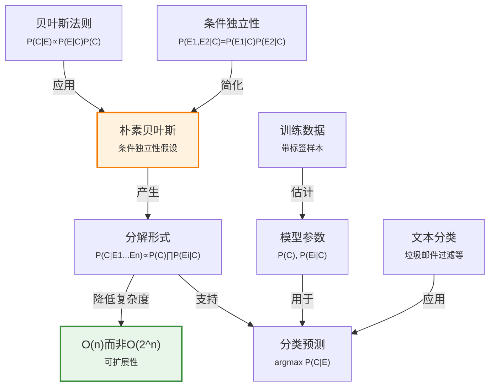

# 12.6 朴素贝叶斯模型

> 📖 本节 Deep Dive | 预计学习时间: 50 分钟

---

## 1. 背景与动机

### 1.1 历史背景

**学科演进脉络**

朴素贝叶斯模型（Naive Bayes Model）是概率分类器中最简单也是最有效的方法之一。其历史可以追溯到20世纪50年代的模式识别研究，但直到20世纪90年代互联网兴起和文本分类需求激增，朴素贝叶斯才真正受到广泛关注。

"朴素"（naive）一词源于模型做出的强独立性假设——给定类别时，所有特征条件独立。这一假设在现实中几乎从不成立，但令人惊讶的是，朴素贝叶斯在许多实际任务中表现优异。这一现象在2000年后得到了理论解释（Domingos和Pazzani, 1997），进一步巩固了朴素贝叶斯在机器学习工具箱中的地位。

**里程碑事件**:

| 年份 | 人物/事件 | 贡献 | 影响 |
|------|-----------|------|------|
| 1950s | 模式识别研究 | 早期朴素贝叶斯形式 | 统计分类基础 |
| 1961 | Maron | 信息检索中的概率方法 | 文本分类的先驱 |
| 1973 | Duda和Hart | 模式分类教材 | 系统化朴素贝叶斯方法 |
| 1990s | 互联网兴起 | 垃圾邮件过滤需求 | 朴素贝叶斯广泛应用 |
| 1997 | Domingos和Pazzani | 解释朴素贝叶斯的成功 | 理论理解 |
| 2000s | 机器学习应用 | 文本分类、情感分析 | 工业级应用 |

**演进动机**:
- 早期方法: 复杂的概率模型，计算困难
- 局限性: 实际应用中需要快速、可扩展的分类器
- 突破: 发现简单的朴素贝叶斯模型在实践中往往工作良好

### 1.2 研究动机

**为什么研究者关注这个主题？**

1. **简单高效**: 朴素贝叶斯训练速度快，预测速度快，易于实现。

2. **可解释性**: 模型输出是概率，可以解释分类决策的置信度。

3. **小样本表现**: 即使训练数据有限，朴素贝叶斯也能给出合理结果。

4. **理论基础**: 尽管假设"朴素"，但有坚实的概率理论基础。

**与其他领域的关系**:
- 与机器学习的关系: 基础分类算法，许多复杂模型的起点
- 与自然语言处理的关系: 文本分类、情感分析的核心方法
- 与信息检索的关系: 概率检索模型的基础

### 1.3 实际应用场景

| 应用领域 | 具体问题 | 本节理论的作用 | 预期效果 |
|----------|----------|----------------|----------|
| 垃圾邮件过滤 | 判断邮件是否为垃圾邮件 | P(垃圾\|词1,词2,...) ∝ P(词i\|垃圾)P(垃圾) | 高准确率过滤 |
| 文本分类 | 新闻文章分类 | 基于词频计算类别概率 | 快速准确分类 |
| 情感分析 | 判断评论情感倾向 | 计算正面/负面概率 | 情感倾向判断 |
| 医疗诊断 | 基于症状诊断疾病 | 症状在给定疾病下独立 | 辅助诊断 |
| 语言识别 | 识别文本语言 | 字符/词频统计 | 语言自动识别 |

**典型案例预览**:
> 一个文本分类系统需要将新闻文章分类到不同板块（商业、体育、天气等）。朴素贝叶斯模型假设给定类别时，文章中各词的出现相互独立。尽管这一假设明显不成立（例如"first"和"quarter"在商业文章中经常一起出现），模型仍然能够给出准确的分类结果。

### 1.4 先决条件

**学习本节需要的前置知识**:

| 知识项 | 来源 | 掌握程度要求 | 关键概念 |
|--------|------|:------------:|----------|
| 贝叶斯法则 | 12.5节 | 必须熟练掌握 | P(H\|E) ∝ P(E\|H)P(H) |
| 条件独立性 | 12.4节 | 熟练掌握 | P(X,Y\|Z) = P(X\|Z)P(Y\|Z) |
| 概率分布 | 12.2节 | 理解 | 离散分布、参数估计 |
| 文本处理基础 | - | 了解 | 词袋模型、词频 |

**前置检查清单**:
- [ ] 能够应用贝叶斯法则
- [ ] 理解条件独立性的含义
- [ ] 了解如何从数据估计概率

---

## 2. 知识逻辑图谱

### 2.1 概念关系图



### 2.2 知识发展依赖链

```
【理论基础】         【模型构建】            【参数学习】           【预测应用】
    ↓                   ↓                     ↓                   ↓
┌─────────┐      ┌─────────────┐       ┌───────────┐      ┌──────────┐
│ 贝叶斯  │  ──→ │ 朴素贝叶斯  │  ──→  │ 频率估计  │ ──→  │ 文本分类  │
│ 法则    │      │ 模型        │       │ 平滑处理  │      │ 垃圾过滤  │
│ 条件独立│      │ P(C|E)∝    │       │           │      │ 情感分析  │
│         │      │ P(C)∏P(Ei|C)│      │           │      │          │
└─────────┘      └─────────────┘       └───────────┘      └──────────┘
     │                   │                   │                │
     └───────────────────┴───────────────────┴────────────────┘
                         朴素贝叶斯方法演进
```

**依赖链详解**:
1. **理论基础**: 贝叶斯法则和条件独立性
2. **模型构建**: 朴素贝叶斯模型及其分解形式
3. **参数学习**: 从数据估计概率参数
4. **预测应用**: 文本分类、垃圾邮件过滤等

### 2.3 本节在章节中的位置

```
第 12 章: 不确定性的量化
├── 12.5 贝叶斯法则及其应用 ← 前置知识
│   └── [引入: 贝叶斯推理]
│
├── 12.6 朴素贝叶斯模型 ← ⭐ 当前位置
│   ├── [核心概念: 条件独立性假设]
│   ├── [核心方法: 分解形式]
│   └── [应用: 文本分类]
│
├── 12.7 重游wumpus世界 ← 后续发展
│   └── [将应用: 概率推理]
```

**衔接说明**:
- **从前继承**: 12.5节的贝叶斯法则和12.4节的条件独立性
- **为后铺垫**: 朴素贝叶斯是概率推理在实际问题中的成功应用

---

## 3. 核心概念与数学分析

### 3.1 核心术语定义

**定义 12.6.1** (朴素贝叶斯模型 / Naive Bayes Model):

> **正式定义**: 一种概率分类模型，假设给定类别变量时，所有特征变量条件独立。

**数学表述**:
$$\mathbf{P}\left(\text{Cause}, \text{Effect}_1, \dots, \text{Effect}_n\right) = \mathbf{P}\left(\text{Cause}\right) \prod_{i} \mathbf{P}\left(\text{Effect}_i | \text{Cause}\right) \tag{12-20}$$

**别名**: 贝叶斯分类器（Bayesian Classifier）、傻瓜贝叶斯（Idiot Bayes）

**"朴素"的含义**: 模型假设给定原因时，所有结果变量独立，这一假设在现实中几乎从不成立，因此被称为"朴素"。

---

**定义 12.6.2** (朴素贝叶斯分类器 / Naive Bayes Classifier):

> **正式定义**: 基于朴素贝叶斯模型的分类器，选择使后验概率最大的类别。

**数学表述**:
对于观测到的结果$\mathbf{e} = (e_1, e_2, ..., e_n)$，预测类别为：
$$\hat{c} = \arg\max_c P(c | \mathbf{e}) = \arg\max_c P(c) \prod_{i} P(e_i | c)$$

**对数形式**（数值稳定性）:
$$\hat{c} = \arg\max_c \left[ \log P(c) + \sum_{i} \log P(e_i | c) \right]$$

---

**定义 12.6.3** (词袋模型 / Bag of Words Model):

> **正式定义**: 文本表示方法，忽略词序，仅考虑词频。

**特点**:
- 简单高效
- 丢失语法和词序信息
- 与朴素贝叶斯假设兼容

---

**定义 12.6.4** (拉普拉斯平滑 / Laplace Smoothing):

> **正式定义**: 处理零概率问题的技术，为所有可能事件添加伪计数。

**数学表述**:
$$P(w | c) = \frac{\text{count}(w, c) + 1}{\text{count}(c) + |V|}$$

其中$|V|$是词汇表大小。

**作用**: 避免未在训练数据中出现的词导致零概率。

### 3.2 符号系统与约定

**本节符号总表**:

| 符号 | 含义 | 数学表达 | 备注 |
|:----:|------|----------|------|
| $C$ | 类别变量（原因） | - | 如：垃圾/正常邮件 |
| $E_i$ | 第$i$个特征（结果） | - | 如：第$i$个词 |
| $P(C)$ | 类别先验概率 | - | 从数据估计 |
| $P(E_i\|C)$ | 条件概率 | - | 从数据估计 |
| $\mathbf{e}$ | 观测到的特征向量 | $(e_1, ..., e_n)$ | 分类输入 |
| $\hat{c}$ | 预测的类别 | $\arg\max_c P(c\|\mathbf{e})$ | 分类输出 |
| $|V|$ | 词汇表大小 | - | 平滑参数 |

### 3.3 关键公式与性质

#### 公式 1: 朴素贝叶斯联合分布

**数学表述**:
$$\mathbf{P}(C, E_1, ..., E_n) = \mathbf{P}(C) \prod_{i=1}^{n} \mathbf{P}(E_i | C)$$

**公式要素解析**:

| 维度 | 内容 |
|------|------|
| **直观解释** | 联合概率等于类别先验乘以各特征在给定类别下的条件概率的乘积 |
| **复杂度** | 从$O(2^n)$降到$O(n)$ |
| **假设** | 给定$C$时，所有$E_i$条件独立 |

---

#### 公式 2: 朴素贝叶斯分类规则

**数学表述**:
$$\mathbf{P}(C | \mathbf{e}) = \alpha \mathbf{P}(C) \prod_{j} \mathbf{P}(e_j | C) \tag{12-21}$$

其中$\alpha$是归一化常数。

**推导**:
$$\begin{aligned} \mathbf{P}(C | \mathbf{e}) &= \alpha \sum_{\mathbf{y}} \mathbf{P}(C, \mathbf{e}, \mathbf{y}) \\ &= \alpha \mathbf{P}(C) \left(\prod_{j} \mathbf{P}(e_j | C)\right) \sum_{\mathbf{y}} \mathbf{P}(\mathbf{y} | C) \\ &= \alpha \mathbf{P}(C) \prod_{j} \mathbf{P}(e_j | C) \end{aligned}$$

最后一行成立是因为$\sum_{\mathbf{y}} \mathbf{P}(\mathbf{y} | C) = 1$。

---

#### 公式 3: 文本分类的朴素贝叶斯

**数学表述**:
$$P(\text{Category} | \text{words}) \propto P(\text{Category}) \prod_{i} P(\text{word}_i | \text{Category})$$

**参数估计**:
- $P(\text{Category} = c) = \frac{N_c}{N}$（$c$类文章数/总文章数）
- $P(\text{word}_i | \text{Category} = c) = \frac{\text{count}(word_i, c)}{\sum_{w} \text{count}(w, c)}$

### 3.4 重要性质与推论

**性质 12.6.1** (朴素贝叶斯的计算效率):

> **陈述**: 朴素贝叶斯的训练和预测时间都与特征数量呈线性关系。

**训练**: 只需统计各类别下的特征频率，时间复杂度$O(Nd)$，其中$N$是样本数，$d$是特征数。

**预测**: 计算各类别的后验概率，时间复杂度$O(Kd)$，其中$K$是类别数。

---

**性质 12.6.2** (朴素贝叶斯的概率校准):

> **陈述**: 朴素贝叶斯的后验概率通常过于极端（接近0或1），但类别排序往往准确。

**原因**: 独立性假设导致证据被重复计算。

**影响**: 对于只需要类别标签的任务（如分类），这不是问题；对于需要准确概率的任务（如医疗诊断），可能需要调整。

---

**性质 12.6.3** (朴素贝叶斯的最优性):

> **陈述**: 即使独立性假设不成立，朴素贝叶斯在某些条件下仍然是最优的（Domingos和Pazzani, 1997）。

**条件**: 当类别之间的决策边界与特征相关性无关时，朴素贝叶斯可以取得最优或接近最优的性能。

---

## 4. 定理与证明

### 4.1 朴素贝叶斯分解定理

**定理 12.6.1** (朴素贝叶斯分解定理 / Naive Bayes Factorization Theorem):

> **正式陈述**: 在条件独立性假设$\mathbf{P}(E_i, E_j | C) = \mathbf{P}(E_i | C)\mathbf{P}(E_j | C)$下，联合分布可以分解为：
> $$\mathbf{P}(C, E_1, ..., E_n) = \mathbf{P}(C) \prod_{i=1}^{n} \mathbf{P}(E_i | C)$$

**定理解读**:
- **条件**: 给定$C$时，所有$E_i$两两条件独立
- **结论**: 联合分布可以分解为类别先验和条件概率的乘积
- **定理意义**: 为朴素贝叶斯模型提供理论基础

### 4.2 证明详解

**证明策略概览**:

反复应用乘积法则和条件独立性。

**核心思路**: 链式分解

---

**正式证明**:

**步骤 1**: 应用乘积法则

$$\mathbf{P}(C, E_1, ..., E_n) = \mathbf{P}(E_1, ..., E_n | C)\mathbf{P}(C)$$

---

**步骤 2**: 分解条件联合概率

由条件独立性，给定$C$时，$E_1, ..., E_n$相互独立：
$$\mathbf{P}(E_1, ..., E_n | C) = \prod_{i=1}^{n} \mathbf{P}(E_i | C)$$

---

**步骤 3**: 组合结果

$$\mathbf{P}(C, E_1, ..., E_n) = \mathbf{P}(C) \prod_{i=1}^{n} \mathbf{P}(E_i | C)$$

因此，定理得证。

$$\blacksquare \text{ (证毕)}$$

### 4.3 证明分析与提炼

**核心洞见**: 条件独立性假设使得联合分布的表示从指数级降到线性级，这是朴素贝叶斯可扩展性的关键。

**证明技巧总结**:

| 技巧 | 在本证明中的应用 | 可迁移性 | 其他应用场景 |
|------|------------------|----------|--------------|
| 乘积法则 | 核心工具 | ⭐⭐⭐⭐⭐ | 所有概率分解 |
| 条件独立性 | 简化假设 | ⭐⭐⭐⭐⭐ | 概率图模型 |

---

## 5. 具体示例与详解

### 5.1 文本分类示例

**示例 12.6.1**: 新闻文章分类

**📋 问题陈述**:

构建一个朴素贝叶斯分类器，将新闻文章分类到以下类别：
- business（商业）
- sports（体育）
- weather（天气）
- entertainment（娱乐）

**训练数据**:
- 总文章数：1000篇
- business: 300篇
- sports: 250篇
- weather: 200篇
- entertainment: 250篇

**词汇统计**（简化示例）:
- "stocks"在business文章中出现180次，其他类别共20次
- "rain"在weather文章中出现150次，其他类别共10次

**新文章**: "Stocks rallied on Monday..."

**求解**: 预测该文章的类别。

---

**🔍 解答过程**:

**步骤 1: 估计先验概率**

$$\begin{aligned} P(\text{business}) &= 300/1000 = 0.3 \\ P(\text{sports}) &= 250/1000 = 0.25 \\ P(\text{weather}) &= 200/1000 = 0.2 \\ P(\text{entertainment}) &= 250/1000 = 0.25 \end{aligned}$$

**步骤 2: 估计条件概率**（简化，假设词汇表大小为1000）

对于"stocks":
$$\begin{aligned} P(\text{stocks} | \text{business}) &= 180/300 = 0.6 \\ P(\text{stocks} | \text{sports}) &= 20/250 = 0.08 \\ P(\text{stocks} | \text{weather}) &= 0/200 = 0 \quad \text{（需要平滑）} \\ P(\text{stocks} | \text{entertainment}) &= 0/250 = 0 \quad \text{（需要平滑）} \end{aligned}$$

使用拉普拉斯平滑：
$$P(\text{stocks} | \text{weather}) = (0 + 1)/(200 + 1000) = 1/1200 \approx 0.00083$$

**步骤 3: 计算后验概率**（简化，只考虑"stocks"一词）

$$\begin{aligned} P(\text{business} | \text{stocks}) &\propto 0.3 \times 0.6 = 0.18 \\ P(\text{sports} | \text{stocks}) &\propto 0.25 \times 0.08 = 0.02 \\ P(\text{weather} | \text{stocks}) &\propto 0.2 \times 0.00083 \approx 0.00017 \\ P(\text{entertainment} | \text{stocks}) &\propto 0.25 \times 0.00083 \approx 0.00021 \end{aligned}$$

**步骤 4: 归一化和预测**

归一化常数$\alpha = 1/(0.18 + 0.02 + 0.00017 + 0.00021) \approx 5$

$$P(\text{business} | \text{stocks}) \approx 0.18 \times 5 = 0.9$$

预测类别：business

---

**✅ 验证与检验**:

**正确性检查**:
- [x] 概率计算正确
- [x] 平滑处理零概率
- [x] 结果合理（"stocks"强烈暗示商业类）

**结果的意义**: 
朴素贝叶斯成功地识别出文章属于商业类别，即使只使用了一个词。

---

### 5.2 垃圾邮件过滤示例

**示例 12.6.2**: 简单垃圾邮件分类器

**📋 问题陈述**:

构建一个朴素贝叶斯垃圾邮件过滤器。

**训练数据**:
- 垃圾邮件：100封
- 正常邮件：400封

**词频统计**:
- "free"在垃圾邮件中出现80次，在正常邮件中出现20次
- "meeting"在垃圾邮件中出现10次，在正常邮件中出现100次

**新邮件**: "Get free meeting now"

**求解**: 判断该邮件是否为垃圾邮件。

---

**🔍 解答过程**:

**步骤 1: 先验概率**

$$P(\text{spam}) = 100/500 = 0.2, \quad P(\text{ham}) = 400/500 = 0.8$$

**步骤 2: 条件概率**（假设词汇表大小为1000，使用拉普拉斯平滑）

$$\begin{aligned} P(\text{free} | \text{spam}) &= (80 + 1)/(100 + 1000) = 81/1100 \approx 0.0736 \\ P(\text{free} | \text{ham}) &= (20 + 1)/(400 + 1000) = 21/1400 = 0.015 \\ P(\text{meeting} | \text{spam}) &= (10 + 1)/1100 = 0.01 \\ P(\text{meeting} | \text{ham}) &= (100 + 1)/1400 \approx 0.072 \\ P(\text{get} | \text{spam}) &= P(\text{get} | \text{ham}) = 1/1100 \approx 0.0009 \quad \text{（假设未出现）} \\ P(\text{now} | \text{spam}) &= P(\text{now} | \text{ham}) = 1/1100 \approx 0.0009 \end{aligned}$$

**步骤 3: 计算后验**（使用对数避免下溢）

$$\begin{aligned} \log P(\text{spam} | \text{email}) &\propto \log(0.2) + \log(0.0736) + \log(0.01) + 2\log(0.0009) \\ &\approx -1.61 - 2.61 - 4.61 - 14.92 = -23.75 \end{aligned}$$

$$\begin{aligned} \log P(\text{ham} | \text{email}) &\propto \log(0.8) + \log(0.015) + \log(0.072) + 2\log(0.0009) \\ &\approx -0.22 - 4.20 - 2.63 - 14.92 = -21.97 \end{aligned}$$

**步骤 4: 预测**

由于$-21.97 > -23.75$，预测为正常邮件（ham）。

---

**✅ 验证与检验**:

**正确性检查**:
- [x] 对数计算避免数值问题
- [x] 平滑处理未出现词
- [x] 结果合理（"meeting"是正常邮件的强指示词）

**结果的意义**: 
尽管"free"是垃圾邮件的强指示词，但"meeting"是正常邮件的更强指示词，综合判断为正常邮件。

---

### 5.3 类比与可视化

**直觉类比**:

| 抽象概念 | 日常类比 | 对应关系 |
|----------|----------|----------|
| 类别先验 | 某类邮件在收件箱中的比例 | 无内容时的初始判断 |
| 条件概率 | 某类邮件中出现某词的频率 | 词对类别的指示强度 |
| 后验概率 | 看到内容后的判断 | 综合所有词的指示 |
| 朴素假设 | 假设每个词独立提供信息 | 简化但有效的近似 |

**可视化**:

```
朴素贝叶斯分类流程：

输入文本
   ↓
┌─────────────────────────────────────┐
│ 特征提取（词袋）                      │
│ "Stocks rallied on Monday"           │
│ → {stocks: 1, rallied: 1, on: 1,     │
│    monday: 1}                        │
└─────────────────────────────────────┘
   ↓
┌─────────────────────────────────────┐
│ 计算各类别得分                        │
│                                      │
│ business: log(0.3) + log(P(stocks|b))│
│          + log(P(rallied|b)) + ...   │
│                                      │
│ sports:   log(0.25) + log(P(stocks|s))│
│          + log(P(rallied|s)) + ...   │
│                                      │
│ ...                                  │
└─────────────────────────────────────┘
   ↓
选择得分最高的类别 → business
```

---

## 6. 深入理解与拓展

### 6.1 一句话本质

> 🎯 **核心要点**: 朴素贝叶斯模型通过强条件独立性假设将联合分布分解为可管理的因子的乘积，实现了线性复杂度的概率分类，在实践中往往表现出乎意料的好。

### 6.2 深入思考问题

1. **概念层面**: 为什么朴素贝叶斯在独立性假设明显不成立的情况下仍然有效？
   
   <!-- 思考方向: 即使概率估计不准确，类别排序可能仍然正确；决策边界可能不需要精确的概率 -->

2. **方法层面**: 如何处理连续特征？如何处理缺失值？
   
   <!-- 思考方向: 连续特征可以用高斯分布建模；缺失值可以忽略或边际化 -->

3. **应用层面**: 在什么情况下朴素贝叶斯会失败？如何改进？
   <!-- 思考方向: 特征高度相关时可能失败；可以使用半朴素贝叶斯或贝叶斯网络 -->

4. **拓展层面**: 朴素贝叶斯与逻辑回归、神经网络等方法相比有什么优缺点？
   <!-- 思考方向: 朴素贝叶斯简单、快速、可解释，但表达能力有限；复杂模型更准确但计算成本高 -->

### 6.3 与其他节的关系

**本节输出**:
- 展示了贝叶斯法则和条件独立性的实际应用
- 提供了简单高效的分类方法
- 为更复杂的概率模型奠定基础

**后续发展预告**:
- 第13章将介绍贝叶斯网络，放松朴素贝叶斯的独立性假设
- 朴素贝叶斯是更复杂模型的基线

---

## 7. 总结与反思

### 7.1 关键要点总结

本节必须掌握的 **5** 个核心要点:

1. **朴素贝叶斯假设**: 给定类别时，所有特征条件独立
   
   💡 *记忆技巧*: "给定原因，结果相互独立"

2. **联合分布分解**: $\mathbf{P}(C, E_1, ..., E_n) = \mathbf{P}(C) \prod_{i} \mathbf{P}(E_i | C)$
   
   💡 *记忆技巧*: "联合=先验×条件概率的乘积"

3. **分类规则**: $\hat{c} = \arg\max_c P(c) \prod_{i} P(e_i | c)$
   
   💡 *记忆技巧*: "选择后验概率最大的类别"

4. **计算效率**: 训练和预测都是$O(n)$复杂度
   
   💡 *记忆技巧*: "朴素=简单=快速"

5. **拉普拉斯平滑**: 处理零概率问题
   
   💡 *记忆技巧*: "平滑=添加伪计数"

### 7.2 本节知识框架

```
┌─────────────────────────────────────────────────────────────┐
│  第12.6节: 朴素贝叶斯模型                                   │
├─────────────────────────────────────────────────────────────┤
│  输入/前置                                                   │
│  • 贝叶斯法则                                                │
│  • 条件独立性                                                │
│  • 带标签的训练数据                                           │
│                                                             │
│  处理/核心                                                   │
│  • 估计先验和条件概率                                         │
│  • 应用朴素贝叶斯公式                                         │
│  • 选择最优类别                                               │
│  ↓                                                          │
│  输出/结果                                                   │
│  • 类别概率分布                                               │
│  • 分类预测                                                   │
│                                                             │
│  应用/价值                                                   │
│  • 文本分类                                                   │
│  • 垃圾邮件过滤                                               │
│  • 情感分析                                                   │
└─────────────────────────────────────────────────────────────┘
```

### 7.3 常见误解与纠正

| 常见误解 ❌ | 正确理解 ✅ | 为什么容易错 | 如何处理 |
|-------------|-------------|--------------|----------|
| ❌ 朴素贝叶斯假设总是成立 | ✅ 假设几乎从不成立，但模型仍然有效 | 字面理解"朴素" | 理解近似的作用 |
| ❌ 朴素贝叶斯输出准确概率 | ✅ 概率通常过于极端，但排序准确 | 过度信任输出 | 仅用于排序或校准 |
| ❌ 朴素贝叶斯只能处理离散特征 | ✅ 连续特征可以用分布建模（如高斯） | 文本分类的刻板印象 | 使用适当分布 |
| ❌ 朴素贝叶斯已经过时 | ✅ 朴素贝叶斯仍是强基线，特别是在小数据上 | 深度学习热潮 | 选择合适工具 |

### 7.4 反思问题

**连接性问题**:
1. 朴素贝叶斯如何利用12.5节的贝叶斯法则？
2. 12.4节的条件独立性在朴素贝叶斯中起什么作用？

**应用性问题**:
1. 在实际文本分类任务中，如何处理高频词（如"the"、"a"）？
2. 如何评估朴素贝叶斯分类器的性能？

**批判性问题**:
1. 朴素贝叶斯的主要局限性是什么？
2. 在什么情况下应该选择更复杂的模型？

### 7.5 学习检查清单

- [ ] 能够解释朴素贝叶斯的独立性假设
- [ ] 能够写出朴素贝叶斯的联合分布分解
- [ ] 能够应用朴素贝叶斯进行分类
- [ ] 理解拉普拉斯平滑的作用
- [ ] 了解朴素贝叶斯的优缺点
- [ ] 能够计算简单问题的朴素贝叶斯分类

---

## 附录

### A. 公式速查表

| 公式 | 名称 | 使用条件 | 备注 |
|:----:|------|----------|------|
| $\mathbf{P}(C, E_1, ..., E_n) = \mathbf{P}(C) \prod_{i} \mathbf{P}(E_i \| C)$ | 联合分布分解 | 条件独立性 | 式(12-20) |
| $\mathbf{P}(C \| \mathbf{e}) = \alpha \mathbf{P}(C) \prod_{j} \mathbf{P}(e_j \| C)$ | 分类公式 | 通用 | 式(12-21) |
| $\hat{c} = \arg\max_c P(c) \prod_{i} P(e_i \| c)$ | 决策规则 | 通用 | 分类器输出 |
| $P(w \| c) = \frac{\text{count}(w, c) + 1}{\text{count}(c) + \|V\|}$ | 拉普拉斯平滑 | 零概率问题 | 平滑处理 |

### B. 术语索引

| 术语 | 英文 | 定义 | 位置 |
|------|------|------|:----:|
| 朴素贝叶斯模型 | Naive Bayes Model | 条件独立性假设的概率模型 | 12.6 |
| 朴素贝叶斯分类器 | Naive Bayes Classifier | 基于朴素贝叶斯的分类器 | 12.6 |
| 词袋模型 | Bag of Words | 忽略词序的文本表示 | 12.6 |
| 拉普拉斯平滑 | Laplace Smoothing | 处理零概率的技术 | 12.6 |

### C. 延伸阅读

**理论深化**:
- Domingos和Pazzani (1997): "On the Optimality of the Simple Bayesian Classifier under Zero-One Loss"
- 《机器学习》：Tom Mitchell的教材

**应用拓展**:
- 自然语言处理中的文本分类
- 垃圾邮件过滤系统（如SpamAssassin）

---

> 📌 **下一节**: [12.7 重游wumpus世界](12.7_重游wumpus世界.md)
> 
> 📚 **返回概览**: [第12章概览](00_概览.md)
