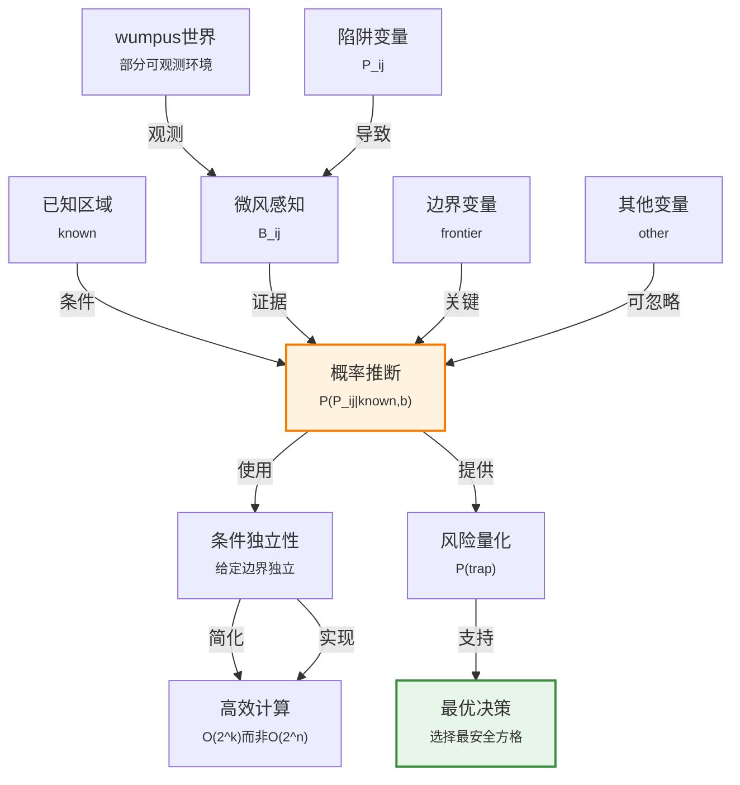

# 12.7 重游wumpus世界

> 📖 本节 Deep Dive | 预计学习时间: 50 分钟

---

## 1. 背景与动机

### 1.1 历史背景

**学科演进脉络**

Wumpus世界是由Gregory Yob于1972年发明的一个经典AI测试环境，用于研究智能体在部分可观测环境中的推理和决策问题。在第7章中，我们使用逻辑推理来处理wumpus世界；本节展示了如何使用概率推理来改进决策。

概率方法在wumpus世界中的应用展示了概率推理相对于纯逻辑推理的优势：
- 逻辑智能体只能得出"安全"或"不安全"的二元结论
- 概率智能体可以量化风险，做出更精细的决策

**里程碑事件**:

| 年份 | 人物/事件 | 贡献 | 影响 |
|------|-----------|------|------|
| 1972 | Gregory Yob | 发明Hunt the Wumpus游戏 | 经典AI测试环境 |
| 1980s | AI教材 | 将wumpus世界引入AI教学 | 教学标准案例 |
| 1990s | 概率wumpus | 概率推理的应用 | 展示概率方法优势 |
| 2000s | 现代实现 | 各种AI技术的测试平台 | 持续研究价值 |

**演进动机**:
- 早期方法: 纯逻辑推理，二元结论
- 局限性: 无法量化风险，决策不够精细
- 突破: 概率推理提供风险量化，支持更优决策

### 1.2 研究动机

**为什么研究者关注这个主题？**

1. **综合应用**: wumpus世界综合展示了本章的概率推理技术。

2. **对比展示**: 通过对比逻辑和概率方法，展示概率推理的优势。

3. **实践验证**: 证明概率方法可以处理看似复杂的问题。

**与其他领域的关系**:
- 与游戏AI的关系: 部分可观测游戏（如扑克）的概率推理
- 与机器人学的关系: 概率定位与建图（SLAM）
- 与探索-利用权衡的关系: 强化学习中的核心问题

### 1.3 实际应用场景

| 应用领域 | 具体问题 | 本节理论的作用 | 预期效果 |
|----------|----------|----------------|----------|
| 机器人探索 | 未知环境探索 | 量化位置风险 | 安全高效的探索 |
| 游戏AI | 不完全信息游戏 | 推断隐藏状态 | 最优策略 |
| 搜索救援 | 危险区域搜索 | 评估区域安全性 | 安全的救援路径 |
| 自动驾驶 | 不确定性导航 | 量化风险 | 安全驾驶决策 |

**典型案例预览**:
> 在wumpus世界中，智能体在[1,2]和[2,1]发现微风后，需要判断[1,3]、[2,2]、[3,1]哪个方格最可能有陷阱。概率智能体可以计算出[2,2]有86%的概率有陷阱，而[1,3]只有31%，因此应该选择[1,3]。

### 1.4 先决条件

**学习本节需要的前置知识**:

| 知识项 | 来源 | 掌握程度要求 | 关键概念 |
|--------|------|:------------:|----------|
| wumpus世界规则 | 第7章 | 理解 | 陷阱、微风、智能体感知 |
| 贝叶斯法则 | 12.5节 | 熟练掌握 | P(H\|E) ∝ P(E\|H)P(H) |
| 条件独立性 | 12.4节 | 理解 | 给定条件时的独立性 |
| 边缘化 | 12.3节 | 理解 | 求和消元 |

**前置检查清单**:
- [ ] 了解wumpus世界的基本规则
- [ ] 能够应用贝叶斯法则
- [ ] 理解条件独立性的概念

---

## 2. 知识逻辑图谱

### 2.1 概念关系图



### 2.2 知识发展依赖链

```
【环境层】           【模型层】              【推理层】             【决策层】
    ↓                   ↓                     ↓                   ↓
┌─────────┐      ┌─────────────┐       ┌───────────┐      ┌──────────┐
│ wumpus │  ──→ │ 概率模型     │  ──→  │ 贝叶斯推断│ ──→  │ 风险决策  │
│ 世界   │      │ P(P_ij),    │       │ 条件独立  │      │ 最优探索  │
│        │      │ P(B|P)      │       │ 简化      │      │          │
│ 陷阱   │      │ 联合分布     │       │           │      │          │
│ 微风   │      │             │       │           │      │          │
└─────────┘      └─────────────┘       └───────────┘      └──────────┘
     │                   │                   │                │
     └───────────────────┴───────────────────┴────────────────┘
                         wumpus世界概率推理演进
```

**依赖链详解**:
1. **环境**: wumpus世界的物理结构
2. **模型**: 陷阱和微风的概率模型
3. **推理**: 利用条件独立性简化贝叶斯推断
4. **决策**: 基于风险量化的最优决策

### 2.3 本节在章节中的位置

```
第 12 章: 不确定性的量化
├── 12.6 朴素贝叶斯模型 ← 前置知识
│   └── [引入: 概率推理应用]
│
├── 12.7 重游wumpus世界 ← ⭐ 当前位置
│   ├── [核心概念: 条件独立性简化]
│   ├── [核心方法: 贝叶斯推断]
│   └── [应用: 风险量化决策]
│
└── 小结 ← 章节总结
```

**衔接说明**:
- **从前继承**: 本章所有概率推理技术
- **综合应用**: 本节是本章概念的综合应用

---

## 3. 核心概念与数学分析

### 3.1 核心术语定义

**定义 12.7.1** (陷阱变量 / Pit Variable):

> **正式定义**: 布尔随机变量$P_{i,j}$，当且仅当方格$[i,j]$含有陷阱时为真。

**先验概率**:
- $P(P_{1,1} = \text{false}) = 1$（起始方格安全）
- $P(P_{i,j} = \text{true}) = 0.2$（其他方格有20%概率有陷阱）

---

**定义 12.7.2** (微风变量 / Breeze Variable):

> **正式定义**: 布尔随机变量$B_{i,j}$，当且仅当方格$[i,j]$有微风时为真。

**物理规则**: 当且仅当相邻方格（北、南、东、西）有陷阱时，该方格有微风。

**数学表述**:
$$B_{i,j} \Leftrightarrow (P_{i+1,j} \vee P_{i-1,j} \vee P_{i,j+1} \vee P_{i,j-1})$$

---

**定义 12.7.3** (已知区域 / Known):

> **正式定义**: 智能体已经访问过的方格集合，其陷阱状态已知（无陷阱）。

**作用**: 作为概率推断的条件。

---

**定义 12.7.4** (边界区域 / Frontier):

> **正式定义**: 与已知区域相邻但尚未访问的方格集合。

**作用**: 边界变量是影响微风观测的关键变量。

---

**定义 12.7.5** (其他区域 / Other):

> **正式定义**: 除已知区域、边界区域和查询方格外，其他所有未知方格的集合。

**作用**: 利用条件独立性，其他变量可以从推断中消去。

---

**定义 12.7.6** (条件独立性在wumpus世界):

> **正式定义**: 给定known、frontier和query变量，观测到的微风b条件独立于other变量。

**直观解释**: 如果知道与查询方格相邻的所有陷阱状态，远处方格是否有陷阱不会影响对微风的信念。

### 3.2 符号系统与约定

**本节符号总表**:

| 符号 | 含义 | 数学表达 | 备注 |
|:----:|------|----------|------|
| $P_{i,j}$ | 陷阱变量 | 布尔变量 | 方格[i,j]有陷阱 |
| $B_{i,j}$ | 微风变量 | 布尔变量 | 方格[i,j]有微风 |
| $known$ | 已知事实 | - | 已访问方格无陷阱 |
| $b$ | 微风证据 | - | 观测到的微风模式 |
| $frontier$ | 边界变量 | - | 与已知区域相邻 |
| $other$ | 其他变量 | - | 远处未知方格 |
| $\alpha$ | 归一化常数 | - | 使概率和为1 |

### 3.3 关键公式与性质

#### 公式 1: 完全联合分布分解

**数学表述**:
$$\mathbf{P}(P_{1,1}, ..., P_{4,4}, B_{1,1}, B_{1,2}, B_{2,1}) = \mathbf{P}(B_{1,1}, B_{1,2}, B_{2,1} | P_{1,1}, ..., P_{4,4}) \mathbf{P}(P_{1,1}, ..., P_{4,4})$$

**简化**:
- 第一项：给定陷阱配置时微风的条件概率（确定性：相邻有陷阱则有微风）
- 第二项：陷阱配置的先验概率

**陷阱先验**:
$$\mathbf{P}(P_{1,1}, ..., P_{4,4}) = \prod_{i,j=1,1}^{4,4} \mathbf{P}(P_{i,j})$$

对于恰好有$n$个陷阱的配置，概率为$0.2^n \times 0.8^{16-n}$。

---

#### 公式 2: 查询公式

**数学表述**:
$$\mathbf{P}(P_{1,3} | known, b) = \alpha \sum_{unknown} \mathbf{P}(P_{1,3}, known, b, unknown) \tag{12-23}$$

其中$unknown$是除已知方格和查询方格外所有其他陷阱变量。

---

#### 公式 3: 利用条件独立性的简化

**数学表述**:
$$\mathbf{P}(P_{1,3} | known, b) = \alpha' \mathbf{P}(P_{1,3}) \sum_{frontier} \mathbf{P}(b | known, P_{1,3}, frontier) P(frontier)$$

**推导要点**:
1. 将$unknown$分解为$frontier$和$other$
2. 利用条件独立性：给定$known$、$P_{1,3}$和$frontier$，$b$独立于$other$
3. $\sum_{other} P(other) = 1$，消去$other$

**复杂度降低**:
- 原始：$2^{12} = 4096$项（12个未知方格）
- 简化后：$2^2 = 4$项（2个边界方格）

### 3.4 重要性质与推论

**性质 12.7.1** (边界变量的关键性):

> **陈述**: 只有边界变量影响对查询方格的推断，远处变量可以被忽略。

**直观**: 微风只与相邻方格有关，远处陷阱不会直接影响当前观测。

---

**性质 12.7.2** (一致模型的枚举):

> **陈述**: 推断可以通过枚举与观测一致的所有边界变量配置来完成。

**方法**:
1. 列出所有边界变量配置（$2^k$，$k$是边界方格数）
2. 筛选与微风观测一致的配置
3. 对每个配置计算先验概率
4. 归一化得到后验概率

---

**性质 12.7.3** (概率vs逻辑的优势):

> **陈述**: 概率智能体可以量化风险，而逻辑智能体只能得出"安全"或"未知"的结论。

**示例**:
- 逻辑智能体："[2,2]可能有陷阱，也可能没有"
- 概率智能体："[2,2]有86%的概率有陷阱，[1,3]只有31%"

---

## 4. 定理与证明

### 4.1 条件独立性简化定理

**定理 12.7.1** (wumpus世界条件独立性定理 / Wumpus Conditional Independence Theorem):

> **正式陈述**: 在wumpus世界中，给定$known$、$frontier$和$query$变量，观测到的微风$b$条件独立于$other$变量。

**定理解读**:
- **条件**: 已知$known$、$frontier$、$query$
- **结论**: $P(b | known, frontier, query, other) = P(b | known, frontier, query)$
- **定理意义**: 允许将推断复杂度从$O(2^n)$降到$O(2^k)$，其中$k$是边界方格数

### 4.2 证明详解

**证明策略概览**:

基于wumpus世界的物理规则：微风只与相邻方格有关。

**核心思路**: 物理隔离导致条件独立

---

**正式证明**:

**步骤 1**: 分析微风的依赖关系

根据wumpus世界规则，方格$[i,j]$的微风$B_{i,j}$仅依赖于其相邻方格的陷阱状态：
$$B_{i,j} \Leftrightarrow (P_{i+1,j} \vee P_{i-1,j} \vee P_{i,j+1} \vee P_{i,j-1})$$

---

**步骤 2**: 分析查询结构

考虑查询$P(P_{1,3} | known, b)$：
- $known$：已访问方格（无陷阱）
- $b$：在$[1,1]$、$[1,2]$、$[2,1]$观测到的微风
- $frontier$：$[2,2]$、$[3,1]$（与已知区域相邻的未知方格）
- $other$：其他未知方格

---

**步骤 3**: 验证条件独立性

观测到的微风$b$涉及方格$[1,1]$、$[1,2]$、$[2,1]$。

这些方格的相邻方格包括：
- $[1,1]$的相邻：$[1,2]$、$[2,1]$（已知无陷阱）
- $[1,2]$的相邻：$[1,1]$、$[1,3]$、$[2,2]$
- $[2,1]$的相邻：$[1,1]$、$[2,2]$、$[3,1]$

因此，$b$只依赖于：
- $known$（$[1,1]$、$[1,2]$、$[2,1]$无陷阱）
- $query$（$P_{1,3}$）
- $frontier$（$P_{2,2}$、$P_{3,1}$）

不依赖于$other$（其他远处方格）。

因此，给定$known$、$query$、$frontier$，$b$独立于$other$。

$$\blacksquare \text{ (证毕)}$$

### 4.3 证明分析与提炼

**核心洞见**: wumpus世界的局部性（微风只与相邻方格有关）导致了条件独立性，这是高效推断的关键。

**证明技巧总结**:

| 技巧 | 在本证明中的应用 | 可迁移性 | 其他应用场景 |
|------|------------------|----------|--------------|
| 物理分析 | 分析微风的依赖关系 | ⭐⭐⭐⭐⭐ | 任何物理系统的概率建模 |
| 条件独立性验证 | 验证给定条件下的独立性 | ⭐⭐⭐⭐⭐ | 概率图模型 |

---

## 5. 具体示例与详解

### 5.1 wumpus世界概率推断示例

**示例 12.7.1**: 计算陷阱概率

**📋 问题陈述**:

智能体在wumpus世界中，已知：
- 已访问方格$[1,1]$、$[1,2]$、$[2,1]$，均无陷阱
- 在$[1,2]$和$[2,1]$观测到微风
- 未访问方格：$[1,3]$、$[2,2]$、$[3,1]$等

**求解**: 计算$P(P_{1,3} | known, b)$和$P(P_{2,2} | known, b)$。

---

**🔍 解答过程**:

**步骤 1: 确定变量集合**

- $known$：$P_{1,1}=\text{false}$、$P_{1,2}=\text{false}$、$P_{2,1}=\text{false}$
- $query$：$P_{1,3}$
- $frontier$：$P_{2,2}$、$P_{3,1}$
- $other$：其他方格（可被忽略）

**步骤 2: 列出边界变量的配置**

| $P_{2,2}$ | $P_{3,1}$ | 与微风一致？ | P(frontier) |
|-----------|-----------|--------------|-------------|
| false | false | 否 | $0.8 \times 0.8 = 0.64$ |
| false | true | 是 | $0.8 \times 0.2 = 0.16$ |
| true | false | 是 | $0.2 \times 0.8 = 0.16$ |
| true | true | 是 | $0.2 \times 0.2 = 0.04$ |

**步骤 3: 分析$P_{1,3}$的情况**

对于$P_{1,3} = \text{true}$：
- 配置1：$P_{2,2}=\text{true}$、$P_{3,1}=\text{true}$（微风一致）
- 配置2：$P_{2,2}=\text{true}$、$P_{3,1}=\text{false}$（微风一致）
- 配置3：$P_{2,2}=\text{false}$、$P_{3,1}=\text{true}$（微风一致）

对于$P_{1,3} = \text{false}$：
- 配置1：$P_{2,2}=\text{true}$、$P_{3,1}=\text{true}$（微风一致）
- 配置2：$P_{2,2}=\text{true}$、$P_{3,1}=\text{false}$（微风一致）

**步骤 4: 计算概率**

$$\begin{aligned} \mathbf{P}(P_{1,3} | known, b) &= \alpha' \langle 0.2(0.04 + 0.16 + 0.16), 0.8(0.04 + 0.16) \rangle \\ &= \alpha' \langle 0.2 \times 0.36, 0.8 \times 0.20 \rangle \\ &= \alpha' \langle 0.072, 0.16 \rangle \\ &\approx \langle 0.31, 0.69 \rangle \end{aligned}$$

其中$\alpha' = 1/(0.072 + 0.16) \approx 4.31$。

因此，$P(P_{1,3} = \text{true} | known, b) \approx 0.31$。

**步骤 5: 计算$P(P_{2,2} | known, b)$**

类似计算可得$P(P_{2,2} = \text{true} | known, b) \approx 0.86$。

---

**✅ 验证与检验**:

**正确性检查**:
- [x] 概率和为1
- [x] $P_{2,2}$的概率高于$P_{1,3}$，符合直觉（$[2,2]$与两个微风方格相邻）
- [x] 计算过程符合贝叶斯推断

**结果的意义**: 
- $[1,3]$有约31%的概率有陷阱
- $[2,2]$有约86%的概率有陷阱
- 智能体应该避开$[2,2]$，选择$[1,3]$或$[3,1]$（对称，同样31%）

---

### 5.2 逻辑vs概率对比

**示例 12.7.2**: 决策对比

**场景**: 智能体需要选择下一个探索的方格。

**逻辑智能体**:
- 结论："[2,2]可能有陷阱，也可能没有"
- 决策：无法区分$[1,3]$、$[2,2]$、$[3,1]$的风险
- 结果：可能随机选择或陷入困境

**概率智能体**:
- 结论："[2,2]有86%陷阱概率，[1,3]和[3,1]只有31%"
- 决策：明确避开$[2,2]$，选择$[1,3]$或$[3,1]$
- 结果：更安全的探索策略

**教训**: 概率推理提供了风险量化，支持更精细的决策。

---

### 5.3 类比与可视化

**直觉类比**:

| 抽象概念 | 日常类比 | 对应关系 |
|----------|----------|----------|
| 已知区域 | 已经探索过的安全区域 | 确定信息 |
| 边界区域 | 与已知区域相邻的未知区域 | 关键风险区 |
| 其他区域 | 远处的未知区域 | 可暂时忽略 |
| 微风证据 | 危险信号 | 提示相邻可能有陷阱 |
| 条件独立性 | "远处的事情与我无关" | 简化推理 |

**可视化**:

```
wumpus世界方格状态（示例）：

    1      2      3      4
   ┌──────┬──────┬──────┬──────┐
 1 │  A   │  B   │  ?   │      │
   │known │known │query │      │
   ├──────┼──────┼──────┼──────┤
 2 │  B   │  ?   │      │      │
   │known │front │      │      │
   ├──────┼──────┼──────┼──────┤
 3 │  ?   │      │      │      │
   │front │      │      │      │
   └──────┴──────┴──────┴──────┘

图例：
- A: 智能体位置
- B: 微风观测
- known: 已访问（无陷阱）
- query: 查询方格[1,3]
- front: 边界方格[2,2]、[3,1]

推断结果：
- P(trap at [1,3]) ≈ 31%
- P(trap at [2,2]) ≈ 86%
- 建议：选择[1,3]，避开[2,2]
```

---

## 6. 深入理解与拓展

### 6.1 一句话本质

> 🎯 **核心要点**: wumpus世界展示了如何利用条件独立性将复杂的概率推断问题简化为可处理的计算，从而量化风险并做出优于纯逻辑方法的决策。

### 6.2 深入思考问题

1. **概念层面**: 为什么条件独立性在wumpus世界中成立？这与物理结构有什么关系？
   
   <!-- 思考方向: 微风的局部性（只与相邻方格有关）导致了条件独立性 -->

2. **方法层面**: 如果wumpus世界更复杂（如微风可以传播更远），推断会如何变化？
   
   <!-- 思考方向: 条件独立性可能不再成立，需要更复杂的推断方法 -->

3. **应用层面**: 如何将wumpus世界的概率推理方法应用到实际机器人探索中？
   
   <!-- 思考方向: 概率定位与建图（SLAM）、主动探索策略 -->

4. **拓展层面**: 除了贝叶斯推断，还有哪些方法可以处理wumpus世界的不确定性？
   
   <!-- 思考方向: 蒙特卡洛方法、粒子滤波、部分可观测马尔可夫决策过程（POMDP） -->

### 6.3 与其他节的关系

**本节输出**:
- 综合应用了本章所有概率推理技术
- 展示了概率方法相对于逻辑方法的优势
- 为更复杂的概率推理问题提供范例

**后续发展预告**:
- 第13章将介绍更高效的推断方法（变量消去、信念传播）
- 第14章将介绍时序概率推理（滤波、预测、平滑）
- 第17章将介绍不确定环境下的规划

---

## 7. 总结与反思

### 7.1 关键要点总结

本节必须掌握的 **5** 个核心要点:

1. **wumpus世界模型**: 陷阱变量$P_{i,j}$和微风变量$B_{i,j}$，微风与相邻陷阱相关
   
   💡 *记忆技巧*: "相邻有陷阱→有微风"

2. **完全联合分布**: $P(B|P)P(P)$，陷阱独立，微风确定性
   
   💡 *记忆技巧*: "微风由陷阱决定"

3. **条件独立性**: 给定边界变量，微风独立于远处变量
   
   💡 *记忆技巧*: "远处不影响当前"

4. **推断简化**: 从$O(2^n)$降到$O(2^k)$，只考虑边界变量
   
   💡 *记忆技巧*: "边界是关键"

5. **概率vs逻辑**: 概率提供风险量化，支持更优决策
   
   💡 *记忆技巧*: "概率=量化风险"

### 7.2 本节知识框架

```
┌─────────────────────────────────────────────────────────────┐
│  第12.7节: 重游wumpus世界                                   │
├─────────────────────────────────────────────────────────────┤
│  输入/前置                                                   │
│  • wumpus世界物理规则                                         │
│  • 微风观测证据                                               │
│  • 已知安全区域                                               │
│                                                             │
│  处理/核心                                                   │
│  • 建立概率模型                                               │
│  • 利用条件独立性简化                                         │
│  • 贝叶斯推断计算陷阱概率                                     │
│  ↓                                                          │
│  输出/结果                                                   │
│  • 各方格的陷阱概率                                           │
│  • 风险量化                                                   │
│                                                             │
│  应用/价值                                                   │
│  • 最优探索决策                                               │
│  • 展示概率方法优势                                           │
│  • 综合应用本章技术                                           │
└─────────────────────────────────────────────────────────────┘
```

### 7.3 常见误解与纠正

| 常见误解 ❌ | 正确理解 ✅ | 为什么容易错 | 如何避免 |
|-------------|-------------|--------------|----------|
| ❌ 微风只与一个陷阱相关 | ✅ 微风与所有相邻陷阱相关 | 简化过度 | 理解物理规则 |
| ❌ 所有未知方格都需要考虑 | ✅ 只有边界变量关键 | 忽略条件独立性 | 应用独立性简化 |
| ❌ 概率推断比逻辑更复杂 | ✅ 概率推断可以更简单（利用独立性） | 直觉偏见 | 理解概率的优势 |
| ❌ 概率方法总是更好 | ✅ 选择取决于任务需求 | 绝对化 | 理解不同方法的适用场景 |

### 7.4 反思问题

**连接性问题**:
1. 本节如何综合应用了本章的所有概念？
2. wumpus世界的概率推理与12.6节的朴素贝叶斯有什么相似之处？

**应用性问题**:
1. 如果智能体可以发射箭探测远处方格，推断会如何变化？
2. 如何设计一个主动探索策略，最大化安全探索的效率？

**批判性问题**:
1. 概率方法在wumpus世界中的局限性是什么？
2. 在什么情况下逻辑方法可能更合适？

### 7.5 学习检查清单

- [ ] 理解wumpus世界的概率模型
- [ ] 能够解释条件独立性在wumpus世界中的应用
- [ ] 能够计算简单场景的陷阱概率
- [ ] 理解概率方法相对于逻辑方法的优势
- [ ] 能够应用条件独立性简化推断
- [ ] 理解边界变量的关键作用

---

## 附录

### A. 公式速查表

| 公式 | 名称 | 使用条件 | 备注 |
|:----:|------|----------|------|
| $B_{i,j} \Leftrightarrow \bigvee_{adj} P_{adj}$ | 微风规则 | wumpus世界 | 物理规则 |
| $\mathbf{P}(P_{query} \| known, b) = \alpha \sum_{frontier} \mathbf{P}(b \| known, P_{query}, frontier)P(frontier)$ | 简化推断 | 条件独立性 | 高效计算 |
| $P(P_{i,j}) = 0.2$ | 陷阱先验 | 非起始方格 | 模型假设 |

### B. 术语索引

| 术语 | 英文 | 定义 | 位置 |
|------|------|------|:----:|
| 陷阱变量 | Pit Variable | 方格是否有陷阱 | 12.7 |
| 微风变量 | Breeze Variable | 方格是否有微风 | 12.7 |
| 边界区域 | Frontier | 与已知区域相邻的未知方格 | 12.7 |
| 条件独立性 | Conditional Independence | 给定条件下的独立性 | 12.7 |

### C. 延伸阅读

**理论深化**:
- 部分可观测马尔可夫决策过程（POMDP）
- 概率定位与建图（SLAM）

**应用拓展**:
- 游戏AI中的概率推理
- 机器人探索策略

---

> 📌 **返回**: [第12章概览](00_概览.md)
