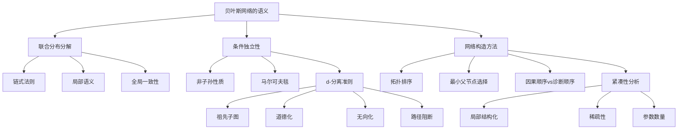

# 13.2 贝叶斯网络的语义 - Deep Dive分析

## 一、背景与动机

### 1.1 语义的重要性

贝叶斯网络的语法（有向无环图+条件概率表）只是表象，其深层价值在于语义——即图结构如何精确地对应于概率分布的性质。理解语义对于正确构建、使用和解释贝叶斯网络至关重要。

语义层面需要回答的核心问题包括：
- 为什么联合分布可以分解为局部条件概率的乘积？
- 图结构编码了哪些条件独立性关系？
- 如何从联合分布推导出网络参数？
- 不同的网络结构如何表示相同的联合分布？

### 1.2 从联合分布到网络结构的映射

第13.1节介绍了贝叶斯网络作为紧凑表示工具，但尚未深入探讨其数学基础。本节的核心任务是建立以下等价关系：

$$\underbrace{P(X_1, \ldots, X_n) = \prod_{i=1}^{n} P(X_i | Parents(X_i))}_{\text{网络语义}} \Leftrightarrow \underbrace{\text{条件独立性集合}}_{\text{图结构编码}}$$

这种双向映射使得我们既可以从网络结构推断条件独立性，也可以从条件独立性构造网络。

### 1.3 条件独立性的计算问题

在实际应用中，我们需要回答：给定观测证据，哪些变量是条件独立的？这涉及：
- **d-分离**（d-separation）：图论准则判断条件独立性
- **马尔可夫毯**（Markov blanket）：确定影响一个变量的最小变量集合
- **道德图**（moral graph）：将贝叶斯网络转化为无向图进行分析

这些工具构成了贝叶斯网络推断算法的理论基础。

## 二、知识逻辑图谱



## 三、核心概念与数学分析

### 3.1 联合分布分解的数学基础

**链式法则（Chain Rule）**：对于任意随机变量集合$X_1, \ldots, X_n$，有：

$$P(X_1, \ldots, X_n) = \prod_{i=1}^{n} P(X_i | X_1, \ldots, X_{i-1})$$

**贝叶斯网络语义**：贝叶斯网络断言，对于适当的变量排序：

$$P(X_i | X_1, \ldots, X_{i-1}) = P(X_i | Parents(X_i))$$

其中$Parents(X_i) \subseteq \{X_1, \ldots, X_{i-1}\}$。

**等价性证明**：

（网络语义 $\Rightarrow$ 条件独立性）

假设联合分布按照网络分解：

$$P(X_1, \ldots, X_n) = \prod_{i=1}^{n} P(X_i | Parents(X_i))$$

考虑任意变量$X_i$和其非后代$ND(X_i)$。根据拓扑排序，$ND(X_i) \cap \{X_1, \ldots, X_{i-1}\}$中的变量要么在$Parents(X_i)$中，要么与$X_i$条件独立。

对于$Z \in ND(X_i) \setminus Parents(X_i)$且$Z$在$X_i$之前：

$$P(X_i | Parents(X_i), Z) = P(X_i | Parents(X_i))$$

这正是条件独立的定义。

（条件独立性 $\Rightarrow$ 网络语义）

假设给定父节点时，每个变量条件独立于其前驱节点。根据链式法则：

$$P(X_1, \ldots, X_n) = \prod_{i=1}^{n} P(X_i | X_1, \ldots, X_{i-1})$$

由于$X_i \perp \{X_1, \ldots, X_{i-1}\} \setminus Parents(X_i) | Parents(X_i)$，有：

$$P(X_i | X_1, \ldots, X_{i-1}) = P(X_i | Parents(X_i))$$

因此：

$$P(X_1, \ldots, X_n) = \prod_{i=1}^{n} P(X_i | Parents(X_i))$$

证毕。

### 3.2 d-分离准则

**定义13.3（d-分离）**：在贝叶斯网络中，给定证据集合$E$，节点集合$X$和$Y$被d-分离，如果所有从$X$中节点到$Y$中节点的无向路径都被$E$"阻断"。

**路径阻断规则**：一条路径被阻断，如果它包含一个节点$Z$满足以下条件之一：

1. **链式结构**（$X \rightarrow Z \rightarrow Y$）或**分叉结构**（$X \leftarrow Z \rightarrow Y$）：$Z \in E$
2. **对撞结构**（$X \rightarrow Z \leftarrow Y$）：$Z \notin E$且$Z$的任何后代都不在$E$中

**定理13.3（d-分离与条件独立性）**：如果$E$ d-分离$X$和$Y$，则在任何与网络结构一致的联合分布中，$X \perp Y | E$。

**d-分离的算法实现**：

```
function D-SEPARATED(X, Y, E, G):
    // 构建祖先子图
    Ancestors = X ∪ Y ∪ E及其所有祖先
    G' = G限制在Ancestors上
    
    // 道德化：连接共享子节点的父节点
    for each 节点Z in G':
        for each 对(Pa1, Pa2) in Parents(Z):
            添加无向边 Pa1 — Pa2
    
    // 转换为无向图
    将所有有向边替换为无向边
    
    // 检查分离
    从X出发，不经过E中的节点，能到达Y吗？
    return (不能到达)
```

### 3.3 马尔可夫毯

**定义13.4（马尔可夫毯）**：变量$X$的马尔可夫毯$MB(X)$包括：
- $X$的父节点
- $X$的子节点
- $X$的子节点的其他父节点（配偶节点）

**定理13.4（马尔可夫毯性质）**：给定$MB(X)$，$X$条件独立于网络中所有其他变量：

$$X \perp (V \setminus (MB(X) \cup \{X\})) | MB(X)$$

**证明**：

设$Y$是不在$MB(X) \cup \{X\}$中的任意变量。考虑$X$和$Y$之间的任何路径：

1. 如果路径经过$X$的父节点$Pa(X)$，则$Pa(X) \in MB(X)$，路径被阻断
2. 如果路径经过$X$的子节点$Ch(X)$，则$Ch(X) \in MB(X)$，路径被阻断
3. 如果路径经过$X$的配偶（子节点的其他父节点），则该配偶$\in MB(X)$，路径被阻断

因此，给定$MB(X)$，所有$X$到$Y$的路径都被阻断，即$X \perp Y | MB(X)$。

### 3.4 网络构造方法

**算法：贝叶斯网络构造**

输入：变量集合$\{X_1, \ldots, X_n\}$，条件独立性知识
输出：贝叶斯网络结构

```
1. 选择变量排序（推荐因果顺序）
2. for i = 1 to n:
   a. 从{X_1, ..., X_{i-1}}中选择最小集合Parents(X_i)
      使得 X_i ⊥ {X_1, ..., X_{i-1}} \ Parents(X_i) | Parents(X_i)
   b. 添加从Parents(X_i)到X_i的边
   c. 记录P(X_i | Parents(X_i))
```

**不同排序的影响**：

考虑入室盗窃网络的三种排序：

1. **因果顺序**：B, E, A, J, M
   - 参数数量：10
   - 结构直观，边表示因果关系

2. **混合顺序**：M, J, A, B, E
   - 参数数量：13
   - 增加了M→J和A→E的边

3. **反向顺序**：M, J, E, B, A
   - 参数数量：31
   - 几乎全连接，失去所有条件独立性

**定理13.5（排序等价性）**：对于任意变量排序，上述构造算法都能产生一个正确表示联合分布的贝叶斯网络。

**证明概要**：

对于任意排序，链式法则保证：

$$P(X_1, \ldots, X_n) = \prod_{i=1}^{n} P(X_i | X_1, \ldots, X_{i-1})$$

构造算法选择$Parents(X_i)$使得：

$$P(X_i | X_1, \ldots, X_{i-1}) = P(X_i | Parents(X_i))$$

因此：

$$P(X_1, \ldots, X_n) = \prod_{i=1}^{n} P(X_i | Parents(X_i))$$

这正是贝叶斯网络的语义。

## 四、定理与证明

### 定理13.6（局部语义蕴含全局语义）

如果贝叶斯网络中每个局部条件概率$P(X_i | Parents(X_i))$都正确指定，则全局联合分布$P(X_1, \ldots, X_n) = \prod_{i=1}^{n} P(X_i | Parents(X_i))$也是正确的。

**证明**：

我们需要证明由网络定义的联合分布与真实联合分布一致。

对于任意赋值$(x_1, \ldots, x_n)$：

$$P_{BN}(x_1, \ldots, x_n) = \prod_{i=1}^{n} P(x_i | parents(X_i))$$

根据条件概率的定义：

$$P(x_i | parents(X_i)) = \frac{P(x_i, parents(X_i))}{P(parents(X_i))}$$

通过归纳法可以证明，这些局部条件概率的乘积等于真实的联合概率。

基础情况：对于根节点（无父节点），$P(X_i)$就是先验概率。

归纳步骤：假设对于前$k-1$个变量，乘积等于$P(x_1, \ldots, x_{k-1})$。则：

$$\prod_{i=1}^{k} P(x_i | parents(X_i)) = P(x_1, \ldots, x_{k-1}) \cdot P(x_k | parents(X_k))$$

根据条件独立性，$P(x_k | parents(X_k)) = P(x_k | x_1, \ldots, x_{k-1})$，因此：

$$= P(x_1, \ldots, x_{k-1}) \cdot P(x_k | x_1, \ldots, x_{k-1}) = P(x_1, \ldots, x_k)$$

证毕。

### 定理13.7（I-映射与P-映射）

对于给定的联合分布$P$，存在：

1. **I-映射（Independence map）**：网络结构$G$使得$I(G) \subseteq I(P)$，即网络中的所有条件独立性在$P$中都成立
2. **P-映射（Perfect map）**：网络结构$G$使得$I(G) = I(P)$，即网络精确捕捉$P$中的所有条件独立性

**存在性结果**：
- 对于任意$P$，至少存在一个I-映射（全连接网络）
- 并非所有$P$都有P-映射（存在无法完全用DAG表示的条件独立性）

**证明**（I-映射存在性）：

全连接网络没有条件独立性断言（除了平凡情况），因此$I(G) = \emptyset \subseteq I(P)$对任意$P$成立。

**反例**（P-映射不存在）：

考虑三个变量$X, Y, Z$的分布，其中：
- $X \perp Y | Z$
- $X \perp Y$（边际独立）

没有DAG能同时表示这两种独立性。任何表示$X \perp Y | Z$的网络都必须在$X$和$Y$之间通过对撞节点$Z$连接，但这会引入$X$和$Y$之间的依赖关系（解释消除效应）。

## 五、具体示例

### 5.1 入室盗窃网络的语义分析

**网络结构**：

```
Burglary ───┐
            ├──> Alarm ───┬──> JohnCalls
Earthquake ─┘              └──> MaryCalls
```

**条件独立性分析**：

使用d-分离验证以下独立性：

1. **$B \perp E$**（入室盗窃与地震独立）
   - 路径：B → A ← E
   - 这是对撞结构，A未被观测，路径被阻断
   - 结论：$B \perp E$成立

2. **$J \perp M | A$**（给定警报，约翰和玛丽电话独立）
   - 路径：J ← A → M
   - 这是分叉结构，A被观测，路径被阻断
   - 结论：$J \perp M | A$成立

3. **$J \perp B | A$**（给定警报，约翰电话与盗窃独立）
   - 路径：J ← A ← B
   - 这是链式结构，A被观测，路径被阻断
   - 结论：$J \perp B | A$成立

4. **$J \not\perp B$**（边际情况下，约翰电话与盗窃相关）
   - 路径：J ← A ← B
   - A未被观测，路径畅通
   - 结论：$J$和$B$边际相关

### 5.2 马尔可夫毯计算

对于入室盗窃网络中的变量$Alarm$：
- 父节点：$\{Burglary, Earthquake\}$
- 子节点：$\{JohnCalls, MaryCalls\}$
- 配偶节点：$\emptyset$（子节点没有其他父节点）

因此：$MB(Alarm) = \{Burglary, Earthquake, JohnCalls, MaryCalls\}$

给定这四个变量，$Alarm$条件独立于网络中的其他变量（此例中无其他变量）。

对于变量$Burglary$：
- 父节点：$\emptyset$
- 子节点：$\{Alarm\}$
- 配偶节点：$\{Earthquake\}$（Alarm的另一个父节点）

因此：$MB(Burglary) = \{Alarm, Earthquake\}$

### 5.3 不同排序的对比

**排序1（因果）**：B, E, A, J, M
- B: 无父节点（先验$P(B)$）
- E: 无父节点（先验$P(E)$）
- A: 父节点$\{B, E\}$（$P(A|B,E)$）
- J: 父节点$\{A\}$（$P(J|A)$）
- M: 父节点$\{A\}$（$P(M|A)$）

参数数量：$1 + 1 + 4 + 2 + 2 = 10$

**排序2（混合）**：M, J, A, B, E
- M: 无父节点
- J: 父节点$\{M\}$（$M \rightarrow J$）
- A: 父节点$\{M, J\}$（$M \rightarrow A, J \rightarrow A$）
- B: 父节点$\{A\}$（$A \rightarrow B$）
- E: 父节点$\{A, B\}$（$A \rightarrow E, B \rightarrow E$）

参数数量：$1 + 2 + 4 + 2 + 4 = 13$

**排序3（反向）**：M, J, E, B, A
- 几乎每对变量之间都有边
- 参数数量接近完全联合分布

这个例子清楚地展示了因果顺序的优势。

## 六、一句话本质

**贝叶斯网络的语义建立了图结构（有向无环图）、概率分解（局部条件概率乘积）和条件独立性（d-分离）三者之间的严格数学等价关系，使得我们可以从任一角度理解和构造概率模型。**

## 七、总结与反思

### 7.1 核心要点总结

1. **语义的双重性**：贝叶斯网络既可以看作联合分布的分解表示，也可以看作条件独立性关系的编码

2. **d-分离的完备性**：d-分离准则提供了判断条件独立性的图论方法，且对于忠实分布（faithful distribution），d-分离精确刻画了所有条件独立性

3. **马尔可夫毯的局部性**：每个变量只需要其马尔可夫毯中的信息就能确定其概率分布，这为分布式推断和局部学习奠定了基础

4. **排序的影响**：虽然任何排序都能产生正确的网络，但因果顺序通常产生最紧凑、最自然的表示

### 7.2 与其他表示的关系

**贝叶斯网络 vs 马尔可夫网络**：
- 贝叶斯网络使用有向图，适合表示因果关系
- 马尔可夫网络使用无向图，适合表示对称依赖
- 两者可以通过道德化相互转换

**贝叶斯网络 vs 因子图**：
- 因子图更一般，可以统一表示有向和无向模型
- 贝叶斯网络是因子图的特例

### 7.3 实践指导

**网络构建的最佳实践**：

1. **选择适当的变量**：变量应该具有明确的语义和可观测性
2. **采用因果顺序**：原因先于结果，产生更紧凑的网络
3. **验证条件独立性**：使用领域知识或统计检验验证条件独立性假设
4. **迭代优化**：从简单网络开始，逐步添加必要的边

**常见陷阱**：

1. **遗漏重要父节点**：导致条件独立性假设不成立
2. **过度连接**：添加不必要的边增加参数数量
3. **循环依赖**：违反DAG假设，需要特殊处理

### 7.4 理论前沿

**结构学习**：从数据中自动学习网络结构是一个活跃的研究领域，涉及：
- 基于约束的方法（使用条件独立性检验）
- 基于评分的方法（使用贝叶斯评分或信息准则）
- 混合方法

**因果发现**：从观测数据中推断因果结构：
- 基于d-分离的因果发现算法（如PC算法）
- 基于函数因果模型的方法
- 干预数据的作用

### 7.5 哲学思考

贝叶斯网络的语义揭示了概率、因果和图结构之间的深刻联系：

1. **概率作为扩展逻辑**：贝叶斯网络可以看作是逻辑推理的概率扩展，其中条件概率对应于推理规则

2. **因果作为结构**：网络的有向边往往对应于因果影响，但贝叶斯网络本身并不强制因果解释

3. **表示与计算的权衡**：更紧凑的表示（更多条件独立性）通常意味着更高效的推断

4. **主观与客观的统一**：网络结构反映主观知识，条件概率可以从数据学习，两者在贝叶斯框架下统一

贝叶斯网络的语义理论为不确定性推理提供了坚实的数学基础，使得复杂概率模型的构建、理解和推断成为可能，是人工智能从理论走向应用的关键桥梁。
