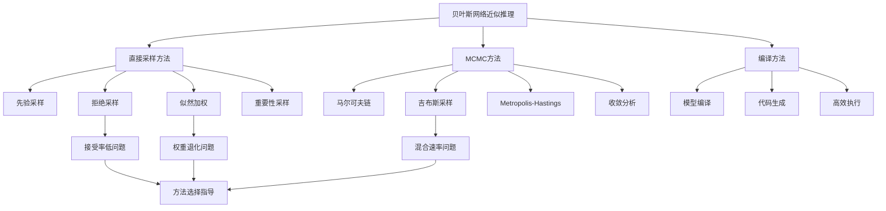

# 13.4 贝叶斯网络中的近似推理 - Deep Dive分析

## 一、背景与动机

### 1.1 精确推断的局限性

第13.3节讨论了贝叶斯网络中的精确推断方法，但我们已经证明：

1. **NP困难性**：贝叶斯网络中的精确推断是NP困难的
2. **#P困难性**：计算证据概率是#P困难的，严格难于NP完全问题

这意味着，对于大规模、高度连接的网络，精确推断在计算上是不可行的。例如，在汽车保险网络（448个节点，906条边）中，精确推断可能需要处理数十亿个状态。

### 1.2 近似推断的必要性

实际应用中，我们通常：
- 不需要精确到小数点后十位的概率值
- 可以接受有一定误差但计算快速的近似结果
- 需要在精度和计算资源之间权衡

近似推断方法提供了这种权衡的可能性，使得大规模概率模型的推理成为现实。

### 1.3 蒙特卡罗方法

蒙特卡罗方法是一类基于随机采样的近似算法，其核心思想是：

> 通过从概率分布中生成大量随机样本，用样本统计量近似理论概率。

大数定律保证了当样本数量趋于无穷时，样本均值收敛于期望值：

$$\lim_{N \to \infty} \frac{1}{N} \sum_{i=1}^{N} X_i = E[X]$$

### 1.4 近似推断方法的分类

| 方法类别 | 代表算法 | 特点 |
|----------|----------|------|
| 直接采样 | 拒绝采样、似然加权 | 简单直观，可能效率低 |
| MCMC | 吉布斯采样、Metropolis-Hastings | 适用于复杂网络，收敛有保证 |
| 变分推断 | 均值场、变分贝叶斯 | 确定性近似，收敛快 |
| 编译方法 | 模型特定代码生成 | 极高效率，需预处理 |

本节主要讨论采样方法。

## 二、知识逻辑图谱



## 三、核心概念与数学分析

### 3.1 采样基础

**一致估计（Consistent Estimator）**：

估计量$\hat{\theta}_N$是参数$\theta$的一致估计，如果：

$$\lim_{N \to \infty} P(|\hat{\theta}_N - \theta| > \epsilon) = 0, \quad \forall \epsilon > 0$$

**收敛速率**：

根据中心极限定理，样本均值的误差以$O(1/\sqrt{N})$速率收敛：

$$\hat{P}(X = x) = \frac{N_x}{N} \approx P(X = x) \pm O\left(\frac{1}{\sqrt{N}}\right)$$

这意味着要将误差减半，需要将样本数量增加4倍。

### 3.2 先验采样

**算法**：按照拓扑顺序，从每个变量的条件分布中采样。

**正确性**：

设$S_{PS}(x_1, \ldots, x_n)$为Prior-Sample生成特定事件的概率：

$$S_{PS}(x_1, \ldots, x_n) = \prod_{i=1}^{n} P(x_i | parents(X_i)) = P(x_1, \ldots, x_n)$$

因此，Prior-Sample从正确的先验分布中采样。

**估计概率**：

$$\hat{P}(x_1, \ldots, x_m) = \frac{N_{PS}(x_1, \ldots, x_m)}{N} \approx P(x_1, \ldots, x_m)$$

### 3.3 拒绝采样

**算法**：
1. 使用Prior-Sample生成样本
2. 拒绝与证据不匹配的样本
3. 在剩余样本中计数查询变量

**数学分析**：

接受率 = $P(e)$（证据的先验概率）

对于复杂证据，$P(e)$可能极小，导致：
- 大量样本被拒绝
- 有效样本数量少
- 收敛速度慢

**方差分析**：

接受样本数量$N_{acc} \sim \text{Binomial}(N, P(e))$

期望：$E[N_{acc}] = N \cdot P(e)$

方差：$\text{Var}[N_{acc}] = N \cdot P(e) \cdot (1 - P(e))$

当$P(e)$很小时，相对标准差很大：

$$\frac{\sqrt{\text{Var}[N_{acc}]}}{E[N_{acc}]} = \sqrt{\frac{1 - P(e)}{N \cdot P(e)}} \approx \frac{1}{\sqrt{N \cdot P(e)}}$$

### 3.4 似然加权

**算法**：
1. 固定证据变量为观测值
2. 按拓扑顺序采样非证据变量
3. 为每个样本赋予权重（证据的似然）

**权重计算**：

$$w(z) = \prod_{i=1}^{m} P(e_i | parents(E_i))$$

其中$e_i$是第$i$个证据变量的值。

**正确性证明**：

我们需要证明加权样本给出正确的后验估计。

设$Q_{WS}(z)$是Weighted-Sample的采样分布：

$$Q_{WS}(z) = \prod_{i=1}^{l} P(z_i | parents(Z_i))$$

真实后验：

$$P(z | e) = \frac{P(z, e)}{P(e)} = \frac{\prod_{i=1}^{l} P(z_i | parents(Z_i)) \prod_{i=1}^{m} P(e_i | parents(E_i))}{P(e)}$$

权重为：

$$w(z) = \prod_{i=1}^{m} P(e_i | parents(E_i))$$

因此：

$$\frac{w(z) \cdot Q_{WS}(z)}{\sum_{z'} w(z') \cdot Q_{WS}(z')} = \frac{P(z, e)}{P(e)} = P(z | e)$$

**问题分析**：

似然加权的问题在于权重退化（weight degeneracy）：

- 随着证据变量增加，大多数样本的权重趋近于0
- 估计由少数高权重样本主导
- 方差增大，收敛变慢

### 3.5 马尔可夫链蒙特卡罗（MCMC）

**基本思想**：

构造一个马尔可夫链，使其平稳分布等于目标后验分布$P(x | e)$。通过在链上随机游走生成样本。

**马尔可夫链基础**：

马尔可夫链由转移核$k(x \to x')$定义，表示从状态$x$转移到$x'$的概率。

**平稳分布**：

分布$\pi$是平稳分布，如果：

$$\pi(x') = \sum_{x} \pi(x) \cdot k(x \to x'), \quad \forall x'$$

**细致平衡**：

更强的条件是细致平衡：

$$\pi(x) \cdot k(x \to x') = \pi(x') \cdot k(x' \to x), \quad \forall x, x'$$

细致平衡蕴含平稳性。

### 3.6 吉布斯采样

**算法**：

1. 初始化：随机设置非证据变量，固定证据变量
2. 迭代：
   - 随机选择一个非证据变量$X_i$
   - 从$P(X_i | MB(X_i))$中采样新值
   - 更新状态

**马尔可夫毯采样**：

$$P(x_i | mb(X_i)) = \alpha \cdot P(x_i | parents(X_i)) \prod_{Y_j \in Children(X_i)} P(y_j | parents(Y_j))$$

**正确性证明**：

我们需要证明吉布斯采样的平稳分布是$P(x | e)$。

**引理**：吉布斯采样满足细致平衡条件。

**证明**：

考虑两个只在$X_i$上不同的状态$x = (x_i, \bar{x}_i)$和$x' = (x_i', \bar{x}_i)$。

吉布斯采样的转移概率：

$$k(x \to x') = \rho(i) \cdot P(x_i' | \bar{x}_i, e)$$

其中$\rho(i)$是选择变量$X_i$的概率。

我们需要证明：

$$P(x | e) \cdot k(x \to x') = P(x' | e) \cdot k(x' \to x)$$

左边：

$$P(x | e) \cdot \rho(i) \cdot P(x_i' | \bar{x}_i, e) = P(x_i, \bar{x}_i | e) \cdot \rho(i) \cdot P(x_i' | \bar{x}_i, e)$$

根据链式法则：

$$= P(x_i | \bar{x}_i, e) \cdot P(\bar{x}_i | e) \cdot \rho(i) \cdot P(x_i' | \bar{x}_i, e)$$

右边：

$$P(x' | e) \cdot k(x' \to x) = P(x_i', \bar{x}_i | e) \cdot \rho(i) \cdot P(x_i | \bar{x}_i, e)$$

$$= P(x_i' | \bar{x}_i, e) \cdot P(\bar{x}_i | e) \cdot \rho(i) \cdot P(x_i | \bar{x}_i, e)$$

左右两边相等，细致平衡成立。

**收敛性**：

如果马尔可夫链是遍历的（ergodic，即不可约且非周期），则：

$$\lim_{t \to \infty} P(X_t = x) = P(x | e)$$

### 3.7 Metropolis-Hastings采样

**算法**：

1. 从提议分布$q(x' | x)$采样候选状态$x'$
2. 以概率$a(x' | x) = \min\left(1, \frac{\pi(x') q(x | x')}{\pi(x) q(x' | x)}\right)$接受$x'$
3. 如果被拒绝，保持当前状态$x$

**接受概率的设计**：

接受概率确保细致平衡成立：

$$\pi(x) \cdot k(x \to x') = \pi(x') \cdot k(x' \to x)$$

**与吉布斯采样的关系**：

吉布斯采样是MH采样的特例，其中：

$$q(x' | x) = P(x_i' | \bar{x}_i) \text{ if } x' \text{ differs from } x \text{ only in } X_i$$

此时接受概率恒为1。

## 四、定理与证明

### 定理14.1（拒绝采样的一致性）

拒绝采样给出后验概率的一致估计。

**证明**：

设$\hat{P}(X | e)$为拒绝采样的估计。

根据算法：

$$\hat{P}(X | e) = \frac{N_{PS}(X, e)}{N_{PS}(e)}$$

根据大数定律：

$$\frac{N_{PS}(X, e)}{N} \to P(X, e)$$

$$\frac{N_{PS}(e)}{N} \to P(e)$$

因此：

$$\hat{P}(X | e) \to \frac{P(X, e)}{P(e)} = P(X | e)$$

证毕。

### 定理14.2（似然加权的一致性）

似然加权给出后验概率的一致估计。

**证明**：

设$w_j$是第$j$个样本的权重，$x_j$是第$j$个样本中$X$的值。

估计量为：

$$\hat{P}(X = x | e) = \frac{\sum_{j=1}^{N} w_j \cdot \mathbb{1}[x_j = x]}{\sum_{j=1}^{N} w_j}$$

根据大数定律：

$$\frac{1}{N} \sum_{j=1}^{N} w_j \cdot \mathbb{1}[x_j = x] \to E_{Q_{WS}}[w \cdot \mathbb{1}[X = x]]$$

$$= \sum_{z} Q_{WS}(z) \cdot w(z) \cdot \mathbb{1}[z_X = x]$$

$$= \sum_{z} P(z, e) \cdot \mathbb{1}[z_X = x] = P(X = x, e)$$

类似地：

$$\frac{1}{N} \sum_{j=1}^{N} w_j \to P(e)$$

因此：

$$\hat{P}(X = x | e) \to \frac{P(X = x, e)}{P(e)} = P(X = x | e)$$

证毕。

### 定理14.3（MCMC的收敛性）

如果马尔可夫链是遍历的，则MCMC样本的经验分布收敛于平稳分布。

**证明概要**：

遍历马尔可夫链满足：

1. **不可约性**：从任意状态可以到达任意其他状态
2. **非周期性**：返回某状态的步数没有固定周期

对于遍历链，存在唯一的平稳分布$\pi$，且：

$$\lim_{t \to \infty} P(X_t = x | X_0) = \pi(x), \quad \forall x, X_0$$

进一步，根据遍历定理：

$$\frac{1}{N} \sum_{t=1}^{N} f(X_t) \to E_{\pi}[f(X)], \quad \text{as } N \to \infty$$

对于指示函数$f(X) = \mathbb{1}[X = x]$，这给出了概率估计的收敛性。

### 定理14.4（吉布斯采样的收敛条件）

如果贝叶斯网络的条件概率表不包含0或1，则吉布斯采样的马尔可夫链是遍历的。

**证明**：

**不可约性**：

由于所有条件概率都在$(0, 1)$内，任意状态可以从任意其他状态通过依次改变每个变量到达。每步有正概率，因此整体转移概率为正。

**非周期性**：

每个状态都有自环（重新采样到相同值），因此周期为1（非周期）。

因此，链是遍历的，收敛到唯一平稳分布$P(x | e)$。

## 五、具体示例

### 5.1 洒水器网络的拒绝采样

**网络**：Cloudy → Sprinkler → WetGrass ← Rain ← Cloudy

**查询**：$P(Rain | Sprinkler = true)$

**采样过程**：

生成100个样本：
- 73个样本$Sprinkler = false$（被拒绝）
- 27个样本$Sprinkler = true$（被接受）
  - 8个$Rain = true$
  - 19个$Rain = false$

**估计**：

$$\hat{P}(Rain = true | Sprinkler = true) = \frac{8}{27} \approx 0.296$$

真实值：0.3

**效率分析**：

接受率 = $P(Sprinkler = true) \approx 0.27$

如果证据更复杂（如$Sprinkler = true, WetGrass = true$），接受率可能降至0.01或更低。

### 5.2 洒水器网络的似然加权

**查询**：$P(Rain | Cloudy = true, WetGrass = true)$

**采样过程**：

1. $Cloudy = true$（证据），权重$w = P(Cloudy = true) = 0.5$
2. 采样$Sprinkler$：从$P(Sprinkler | Cloudy = true)$采样，假设得$false$
3. 采样$Rain$：从$P(Rain | Cloudy = true)$采样，假设得$true$
4. $WetGrass = true$（证据），权重更新：
   
   $$w = 0.5 \times P(WetGrass = true | Sprinkler = false, Rain = true) = 0.5 \times 0.9 = 0.45$$

**样本**：[true, false, true, true]，权重0.45

重复生成多个样本，按权重平均得到估计。

### 5.3 吉布斯采样示例

**查询**：$P(Rain | Sprinkler = true, WetGrass = true)$

**初始化**：$[Cloudy = true, Sprinkler = true, Rain = false, WetGrass = true]$

**迭代1**：选择$Cloudy$

$$P(Cloudy | Sprinkler = true, Rain = false) \propto P(Cloudy) \cdot P(Sprinkler = true | Cloudy) \cdot P(Rain = false | Cloudy)$$

$$P(c | s, \neg r) \propto 0.5 \times 0.1 \times 0.2 = 0.01$$

$$P(\neg c | s, \neg r) \propto 0.5 \times 0.5 \times 0.8 = 0.20$$

归一化：$P(c | s, \neg r) \approx 0.048$，$P(\neg c | s, \neg r) \approx 0.952$

假设采样得$Cloudy = false$，新状态：$[false, true, false, true]$

**迭代2**：选择$Rain$

$$P(Rain | Cloudy = false, Sprinkler = true, WetGrass = true)$$

类似计算后采样，假设得$Rain = true$，新状态：$[false, true, true, true]$

**估计**：

经过足够多的迭代（如1000步），统计$Rain = true$的比例作为估计。

### 5.4 编译方法示例

对于入室盗窃网络中的$Earthquake$变量，编译后的采样代码：

```python
def sample_earthquake(alarm, burglary):
    r = random.uniform(0, 1)
    if alarm == true:
        if burglary == true:
            return r < 0.0020212
        else:
            return r < 0.36755
    else:
        if burglary == true:
            return r < 0.0016672
        else:
            return r < 0.0014222
```

这些阈值是预计算的吉布斯分布，运行时只需简单的比较操作。

## 六、一句话本质

**贝叶斯网络近似推理通过随机采样（直接采样、MCMC等）或模型编译，以可控的误差换取多项式时间的计算效率，使大规模概率模型的实用推理成为可能。**

## 七、总结与反思

### 7.1 核心要点总结

1. **近似推断的必要性**：精确推断的NP困难性使得近似方法成为处理大规模网络的必然选择

2. **直接采样方法**：
   - 拒绝采样：简单但接受率低
   - 似然加权：利用所有样本但存在权重退化

3. **MCMC方法**：
   - 吉布斯采样：局部更新，适合贝叶斯网络
   - Metropolis-Hastings：通用框架，灵活设计提议分布
   - 收敛保证：遍历链收敛到正确后验

4. **编译方法**：预处理生成高效代码，运行时性能提升2-3个数量级

### 7.2 方法选择指南

| 场景 | 推荐方法 | 理由 |
|------|----------|------|
| 证据变量少 | 拒绝采样 | 简单实现，足够有效 |
| 证据在"上游" | 似然加权 | 证据指导采样方向 |
| 证据在"下游" | 吉布斯采样 | 信息双向传播 |
| 需要多次查询 | 编译方法 | 预处理摊销成本 |
| 复杂多峰分布 | MH采样 | 灵活提议分布 |

### 7.3 收敛诊断

MCMC方法的实际挑战是确定何时收敛：

1. **目视检查**：观察迹线图是否稳定
2. **Gelman-Rubin统计量**：多链比较
3. **自相关分析**：评估样本独立性
4. **有效样本量**：考虑自相关后的等效独立样本数

**预热（Burn-in）**：丢弃初始样本，只使用收敛后的样本进行估计。

### 7.4 高级主题

**自适应MCMC**：
- 根据已收集样本调整提议分布
- 提高混合速率
- 需要小心保持正确性

**变分推断**：
- 确定性近似方法
- 优化变分分布逼近后验
- 通常比MCMC更快但可能有偏

**粒子滤波**：
- 用于时序模型（动态贝叶斯网络）
- 序贯重要性采样
- 重采样避免权重退化

### 7.5 与其他章节的联系

- **第14章**：MCMC方法在隐马尔可夫模型和动态贝叶斯网络中的应用
- **第15章**：概率编程语言中的近似推断
- **第20章**：从数据中学习贝叶斯网络时需要的推断

### 7.6 实践建议

1. **从简单开始**：先尝试似然加权，如果不收敛再尝试MCMC
2. **多链验证**：运行多个独立链验证收敛
3. **监控诊断**：使用统计量监控混合质量
4. **适当预热**：丢弃足够的初始样本
5. **考虑编译**：对于生产环境，编译方法提供最佳性能

### 7.7 哲学思考

近似推断的发展体现了人工智能中的实用主义哲学：

1. **足够好即可**：在许多应用中，近似答案比没有答案更有价值
2. **计算作为资源**：将计算时间视为与精度同等重要的资源
3. **随机性的力量**：随机采样可以解决确定性方法难以处理的问题
4. **渐近与有限样本**：理论上的渐近保证与有限样本实践之间的差距

蒙特卡罗方法的成功也反映了概率论与计算的深刻联系：通过随机性来驾驭复杂性，这是现代人工智能的核心技术之一。
