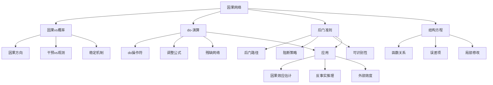

# 13.5 因果网络 - Deep Dive分析

## 一、背景与动机

### 1.1 相关性与因果性的区别

统计学长期以来强调"相关性不等于因果性"，但在实际应用中，我们往往真正关心的是因果关系：
- 医学：吸烟是否导致肺癌？
- 经济学：提高最低工资是否增加失业？
- 教育：小班教学是否提高学生成绩？

贝叶斯网络可以表示任意概率依赖关系，但普通贝叶斯网络中的边不一定表示因果关系。例如，$Fire \rightarrow Smoke$和$Smoke \rightarrow Fire$可以表示相同的联合分布，但前者符合因果直觉，后者不符合。

### 1.2 因果推断的挑战

从观测数据推断因果关系的根本困难在于：

1. **混杂因素**（Confounding）：未观测的变量同时影响原因和结果
2. **选择偏差**（Selection Bias）：样本选择过程引入的虚假关联
3. **反事实**（Counterfactual）：无法同时观测同一单元在两种处理下的结果

传统统计方法主要关注相关性，而因果推断需要额外的假设和方法。

### 1.3 从贝叶斯网络到因果网络

因果网络是贝叶斯网络的受限形式，其中：
- 边的方向表示因果关系
- 网络结构编码了干预（intervention）的预测
- 允许回答反事实问题

朱迪亚·珀尔（Judea Pearl）发展的因果推断框架为这些问题提供了系统的数学工具。

## 二、知识逻辑图谱



## 三、核心概念与数学分析

### 3.1 因果网络的定义

**定义15.1（因果贝叶斯网络）**：因果贝叶斯网络是一个贝叶斯网络，其中：
- 父节点是直接原因
- 子节点是直接结果
- 结构方程描述变量间的函数关系

**结构方程模型（SEM）**：

对于变量集合$\{X_1, \ldots, X_n\}$，每个变量由结构方程定义：

$$X_i = f_i(Parents(X_i), U_i)$$

其中：
- $f_i$是确定性函数
- $U_i$是外生误差项（未建模因素）
- $Parents(X_i)$是$X_i$的直接原因

**与贝叶斯网络的关系**：

如果所有$U_i$相互独立，则结构方程模型定义了一个唯一的联合分布，可以用贝叶斯网络表示。

### 3.2 干预与do-演算

**观测vs干预**：

- **观测**$X = x$：看到$X$的值为$x$
- **干预**$do(X = x)$：强制将$X$设为$x$，不考虑其正常原因

**关键区别**：

$$P(Y | X = x) \neq P(Y | do(X = x))$$

前者是条件概率，后者是因果效应。

**do-操作的语义**：

干预$do(X_j = x_{jk})$对应于：
1. 从结构方程系统中删除$X_j$的方程
2. 用$X_j = x_{jk}$替代
3. 保持其他方程不变

**调整公式（Adjustment Formula）**：

$$P(Y = y | do(X = x)) = \sum_{z} P(Y = y | X = x, Z = z) \cdot P(Z = z)$$

其中$Z$是满足后门准则的变量集合。

**证明**：

在干预$do(X = x)$下，新的联合分布为：

$$P_{do(X=x)}(y, z) = P(Y = y | X = x, Z = z) \cdot P(Z = z)$$

这是因为：
- $Z$不受干预影响，保持其先验$P(Z)$
- $Y$的条件分布给定$X$和$Z$保持不变

边缘化$Z$：

$$P(Y = y | do(X = x)) = \sum_{z} P_{do(X=x)}(y, z) = \sum_{z} P(Y = y | X = x, Z = z) \cdot P(Z = z)$$

证毕。

### 3.3 后门准则

**定义15.2（后门路径）**：从$X$到$Y$的后门路径是指：
- 以指向$X$的箭头开始的路径
- 即路径形式为$X \leftarrow \ldots \rightarrow Y$

**定义15.3（后门准则）**：

变量集合$Z$满足关于$(X, Y)$的后门准则，如果：
1. $Z$阻塞所有从$X$到$Y$的后门路径
2. $Z$不包含$X$的后代

**定理15.1（后门准则的可识别性）**：

如果$Z$满足关于$(X, Y)$的后门准则，则因果效应可识别：

$$P(Y | do(X)) = \sum_{z} P(Y | X, Z) \cdot P(Z)$$

**证明**：

后门路径代表了$X$和$Y$之间的非因果关联（混杂）。

条件1确保$Z$阻塞所有混杂路径。

条件2确保$Z$不阻塞因果路径或引入新的混杂（通过$X$的后代）。

因此，给定$Z$时，$X$和$Y$之间的剩余关联纯粹是因果的。

### 3.4 因果效应的可识别性

**定义15.4（可识别性）**：

因果效应$P(Y | do(X))$是可识别的，如果它可以从观测分布$P(V)$唯一确定。

**可识别性条件**：

1. **无混杂**：$X$和$Y$之间没有后门路径
   
   $$P(Y | do(X)) = P(Y | X)$$

2. **可观测混杂**：存在满足后门准则的观测变量集合$Z$
   
   $$P(Y | do(X)) = \sum_{z} P(Y | X, z) \cdot P(z)$$

3. **工具变量**：存在工具变量$Z$满足特定条件

4. **前门准则**：当存在未观测混杂时，前门准则提供另一种识别策略

### 3.5 反事实推理

**反事实问题**：

"如果$X$被设为$x$，$Y$会是什么值？"（当实际上$X$被设为$x'$）

形式化：$Y_{X=x}(u)$，表示在单元$u$（背景因素）下，如果$X$被设为$x$，$Y$的值。

**三步反事实算法**（珀尔）：

1. **溯因**（Abduction）：根据观测证据更新外生变量$U$的分布
2. **行动**（Action）：修改模型，设置$X = x$
3. **预测**（Prediction）：在新模型中计算$Y$的分布

**数学表达**：

$$P(Y_x = y | e) = \sum_{u} P(Y = y | do(X = x), U = u) \cdot P(U = u | e)$$

## 四、定理与证明

### 定理15.2（干预的图操作）

在因果网络中，干预$do(X = x)$对应于：
1. 从图中删除指向$X$的所有边
2. 设置$X = x$
3. 保持其余网络结构不变

**证明**：

结构方程视角：

原始方程：$X = f_X(Parents(X), U_X)$

干预后：$X = x$（常数）

这意味着$X$不再依赖于其父母，对应于删除指向$X$的边。

概率分布视角：

原始分布：$P(V) = P(X | Parents(X)) \cdot \prod_{i \neq X} P(V_i | Parents(V_i))$

干预后分布：

$$P_{do(X=x)}(V) = \begin{cases} \prod_{i \neq X} P(V_i | Parents(V_i)) & \text{if } X = x \\ 0 & \text{otherwise} \end{cases}$$

这对应于删除$P(X | Parents(X))$因子。

### 定理15.3（前门准则）

假设变量$M$满足：
1. $M$阻断所有从$X$到$Y$的直接路径
2. 从$X$到$M$没有后门路径
3. 所有从$M$到$Y$的后门路径都被$X$阻断

则因果效应可识别：

$$P(Y | do(X)) = \sum_{m} P(M = m | X) \sum_{x'} P(Y | X = x', M = m) \cdot P(X = x')$$

**证明概要**：

条件1确保$M$是$X$到$Y$因果路径上的中介。

条件2和3确保$P(M | do(X))$和$P(Y | do(M))$都可识别。

通过链式法则：

$$P(Y | do(X)) = \sum_{m} P(Y | do(M = m)) \cdot P(M = m | do(X))$$

两项都可从观测数据识别，因此$P(Y | do(X))$可识别。

### 定理15.4（因果发现的不可能性）

仅从观测数据（不借助干预或先验知识），无法唯一确定因果结构。

**证明**：

考虑两个因果网络：
- $G_1: X \rightarrow Y$
- $G_2: X \leftarrow Y$

两者都可以表示相同的联合分布$P(X, Y)$（通过适当选择条件概率）。

因此，仅从$P(X, Y)$无法区分$G_1$和$G_2$。

更一般地，对于任意贝叶斯网络，存在多个因果网络（不同边方向）表示相同的联合分布。

## 五、具体示例

### 5.1 洒水器网络中的干预

**原始网络**（图13-23a）：

```
Cloudy --> Sprinkler --> WetGrass
    |                    ^
    |                    |
    --------> Rain --------
```

**结构方程**：

$$C = U_C$$
$$R = f_R(C, U_R)$$
$$S = f_S(C, U_S)$$
$$W = f_W(R, S, U_W)$$

**干预**：$do(Sprinkler = true)$

**修改后的方程**：

$$C = U_C$$
$$R = f_R(C, U_R)$$
$$S = true$$
$$W = f_W(R, S, U_W)$$

**修改后的网络**（图13-23b）：

```
Cloudy          Sprinkler = true
    |                    |
    |                    v
    --------> Rain --> WetGrass
```

注意：$Cloudy \rightarrow Sprinkler$的边被删除。

**概率计算**：

$$P(WetGrass | do(Sprinkler = true)) = \sum_{r} P(WetGrass | Sprinkler = true, Rain = r) \cdot P(Rain = r)$$

注意$P(Rain)$是$Rain$的先验（不是给定$Cloudy$的条件概率），因为干预破坏了$Cloudy$和$Sprinkler$之间的关联。

### 5.2 后门准则应用

**场景**：研究教育（$E$）对收入（$I$）的因果效应。

**混杂因素**：能力（$A$）同时影响教育和收入。

**网络**：

```
A --> E --> I
|         ^
|         |
-----------
```

**后门路径**：$E \leftarrow A \rightarrow I$

**策略**：以$A$为条件阻断后门路径。

**调整公式**：

$$P(I | do(E = e)) = \sum_{a} P(I | E = e, A = a) \cdot P(A = a)$$

**实施**：

如果我们可以测量能力（如通过IQ测试），就可以使用上述公式从观测数据估计因果效应。

### 5.3 前门准则应用

**场景**：吸烟（$S$）对肺癌（$L$）的效应，存在未观测的混杂因素（基因$G$）。

**网络**：

```
G --> S --> Tar --> L
|                 ^
|                 |
------------------
```

**问题**：无法使用后门准则，因为$G$未观测。

**前门变量**：$Tar$（焦油沉积）

**验证前门准则**：
1. $Tar$阻断所有从$S$到$L$的直接路径？是（唯一路径经过$Tar$）
2. 从$S$到$Tar$没有后门路径？是（$S \rightarrow Tar$是直接边）
3. 所有从$Tar$到$L$的后门路径都被$S$阻断？是（所有后门路径经过$S$）

**前门公式**：

$$P(L | do(S = s)) = \sum_{t} P(Tar = t | S = s) \sum_{s'} P(L | S = s', Tar = t) \cdot P(S = s')$$

这个公式允许我们从观测数据估计因果效应，即使存在未观测混杂。

## 六、一句话本质

**因果网络通过结构方程和do-演算将概率推理扩展到因果领域，使得从观测数据识别因果效应、预测干预结果和进行反事实推理成为可能，弥合了统计相关性与因果关系之间的根本鸿沟。**

## 七、总结与反思

### 7.1 核心要点总结

1. **因果vs概率**：因果网络是贝叶斯网络的因果解释，边表示因果关系而非仅仅是概率依赖

2. **do-演算**：干预$do(X = x)$不同于观测$X = x$，对应于修改结构方程或删除网络中的边

3. **可识别性**：在满足后门准则或前门准则的条件下，因果效应可以从观测数据中识别

4. **反事实**：三步算法（溯因-行动-预测）支持反事实推理

5. **结构方程**：提供了因果机制的函数表示，支持局部修改和干预预测

### 7.2 因果推断的层次

珀尔提出了因果推断的三个层次：

| 层次 | 问题类型 | 示例 | 所需信息 |
|------|----------|------|----------|
| 1. 关联 | $P(Y | X)$是什么？ | 吸烟者与肺癌的关联 | 观测数据 |
| 2. 干预 | $P(Y | do(X))$是什么？ | 强制吸烟对肺癌的影响 | 因果模型+数据 |
| 3. 反事实 | $P(Y_x | X = x')$是什么？ | 如果吸烟者没吸烟会怎样 | 完整因果模型+数据 |

### 7.3 实践指导

**建立因果网络的步骤**：

1. **变量识别**：确定相关变量及其取值范围
2. **因果排序**：根据领域知识确定因果顺序
3. **结构学习**：识别直接因果关系（可能需要干预数据）
4. **参数估计**：从数据估计条件概率
5. **验证**：通过预测干预结果验证模型

**常见陷阱**：

1. **混杂因素遗漏**：未考虑重要的混杂变量
2. **选择偏差**：样本选择过程引入的偏差
3. **过度控制**：控制中介变量导致因果效应被阻断
4. **循环因果**：实际存在的反馈循环被忽略

### 7.4 与其他领域的联系

**计量经济学**：
- 工具变量方法
- 断点回归
- 双重差分

**流行病学**：
- 随机对照试验（RCT）
- 观察性研究设计
- 倾向得分匹配

**机器学习**：
- 因果发现算法
- 因果表示学习
- 因果强化学习

### 7.5 前沿研究

**因果发现**：
- 基于约束的方法（PC算法）
- 基于评分的方法
- 基于函数因果模型（LiNGAM）

**因果机器学习**：
- 因果特征学习
- 领域自适应的因果视角
- 因果公平性

**因果强化学习**：
- 利用因果结构提高样本效率
- 因果模型用于迁移学习
- 反事实策略评估

### 7.6 哲学思考

因果网络的发展引发了一系列深刻的哲学问题：

1. **因果的本质**：因果是客观存在的物理关系，还是我们认知结构的产物？

2. **因果与概率**：因果能否完全约化为概率关系，还是需要独立的本体论地位？

3. **反事实的基础**：反事实陈述的真值条件是什么？如何验证？

4. **自由意志与决定论**：干预概念预设了某种自由意志，这与决定论相容吗？

5. **因果推断的局限**：在什么条件下因果效应是不可识别的？这对科学实践有何启示？

因果网络框架提供了一种形式化的语言来讨论这些问题，使得哲学问题可以用数学工具进行分析，同时也为实践中的因果推断提供了可操作的方法。

### 7.7 本章总结

第13章从贝叶斯网络的基础表示出发，经过语义分析、精确和近似推断算法，最终到达因果网络，构建了一个完整的不确定性推理理论体系：

- **表示**：贝叶斯网络提供紧凑的概率表示
- **推理**：精确和近似算法支持各种规模的推断
- **因果**：因果网络扩展了推理能力到因果领域

这一理论体系是人工智能处理不确定性和因果性的基础，在医学诊断、金融风控、科学研究等众多领域都有广泛应用。
