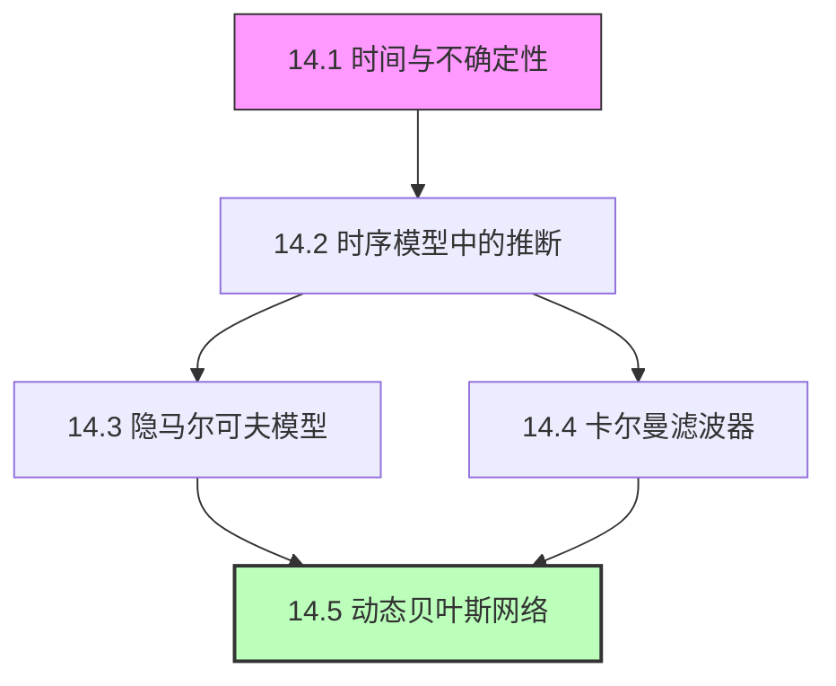
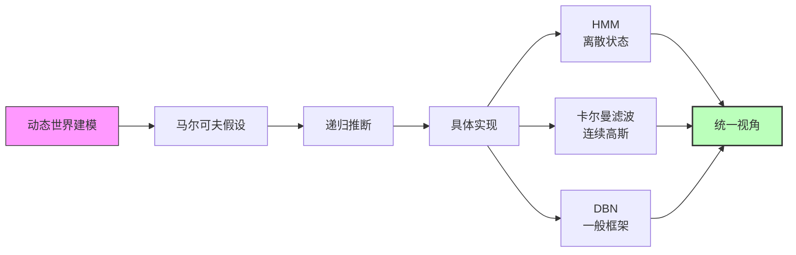

# 第14章 时间上的概率推理 - 概览与总结

## 学习目标

完成本章学习后，你应该能够：

1. **理解时序概率建模的基本框架**：掌握状态变量、证据变量、转移模型和传感器模型的概念
2. **应用马尔可夫假设简化模型**：理解一阶马尔可夫过程及其在模型压缩中的作用
3. **执行基本的时序推断任务**：滤波、预测、平滑和最可能解释
4. **实现隐马尔可夫模型的推断算法**：前向-后向算法、维特比算法
5. **理解卡尔曼滤波器的原理**：线性高斯假设下的最优估计
6. **应用动态贝叶斯网络建模复杂系统**：因子化表示、精确和近似推断

## 本章速览

本章将概率推理从静态世界扩展到动态世界，解决智能体如何在不确定性下追踪、预测和理解随时间演化的系统状态。

### 核心主题

| 小节 | 主题 | 核心内容 |
|------|------|---------|
| 14.1 | 时间与不确定性 | 离散时间模型、状态与观测、马尔可夫假设、联合分布分解 |
| 14.2 | 时序模型中的推断 | 滤波、预测、平滑、最可能解释、递归算法 |
| 14.3 | 隐马尔可夫模型 | 矩阵表示、前向-后向算法、维特比算法、机器人定位 |
| 14.4 | 卡尔曼滤波器 | 线性高斯模型、高斯封闭性、预测-更新循环 |
| 14.5 | 动态贝叶斯网络 | 因子化表示、与HMM/KF的关系、粒子滤波 |

## 难度预警

- **数学复杂度**：★★★★☆（概率论、线性代数、矩阵运算）
- **概念抽象度**：★★★★☆（需要理解条件独立性、递归推断）
- **计算复杂度**：★★★☆☆（算法复杂度分析）
- **实践应用**：★★★★★（语音识别、机器人定位、目标跟踪等广泛应用）

## 前置知识

### 必需的先修知识
- 第12章：概率基础（联合分布、条件概率、贝叶斯法则）
- 第13章：概率图模型（贝叶斯网络、条件独立性）
- 线性代数：矩阵乘法、转置、逆矩阵

### 有帮助的背景
- 第4章：搜索算法（信念状态概念）
- 信号处理基础（滤波、噪声模型）
- 随机过程基础（马尔可夫链）

## 节依赖图



**学习路径建议**：
1. 必须按顺序学习14.1和14.2（基础框架）
2. 14.3和14.4可以并行学习（离散vs连续）
3. 14.5综合前面所有内容（建议最后学习）

## 定理清单

| 定理 | 内容 | 位置 |
|------|------|------|
| 定理14.1 | 时序模型的联合分布分解 | 14.1节 |
| 定理14.2 | 马尔可夫性质蕴含的条件独立性 | 14.1节 |
| 定理14.4 | 递归滤波的可能性 | 14.2节 |
| 定理14.5 | 平滑分解（前向-后向） | 14.2节 |
| 定理14.6 | 前向滤波的正确性 | 14.2节 |
| 定理14.7 | 前向-后向算法的正确性 | 14.2节 |
| 定理14.8 | 维特比算法的正确性 | 14.2节 |
| 定理14.9 | 前向算法的矩阵形式 | 14.3节 |
| 定理14.12 | 前向-后向算法复杂度 | 14.3节 |
| 定理14.15 | 高斯分布的封闭性 | 14.4节 |
| 定理14.16 | 卡尔曼滤波更新方程 | 14.4节 |
| 定理14.19 | DBN的联合分布 | 14.5节 |
| 定理14.22 | DBN的表示效率 | 14.5节 |

## 核心逻辑线索



**核心洞察**：马尔可夫假设将无限历史压缩为有限状态表示，使递归推断成为可能。

## 核心要点速查

### 关键概念

**马尔可夫假设**：当前状态只依赖于有限历史（通常是一阶），使得模型可计算。

**滤波**：根据历史观测估计当前状态，是智能体实时决策的基础。

**平滑**：利用全部观测（包括未来）估计过去状态，提供更准确的回顾性分析。

**预测**：基于当前信念预测未来状态，用于评估动作方案。

**最可能解释**：寻找最可能产生观测序列的状态序列，应用于语音识别等任务。

### 算法对比

| 算法 | 适用模型 | 时间复杂度 | 空间复杂度 | 输出 |
|------|---------|-----------|-----------|------|
| 前向滤波 | 任意 | O(\|S\|²t) | O(\|S\|) | P(X_t \| e_{1:t}) |
| 前向-后向 | 任意 | O(\|S\|²t) | O(\|S\|t) | P(X_k \| e_{1:t}) |
| 维特比 | 任意 | O(\|S\|²t) | O(\|S\|t) | argmax P(x_{1:t} \| e_{1:t}) |
| 卡尔曼滤波 | 线性高斯 | O(d³) | O(d²) | 高斯分布参数 |
| 粒子滤波 | 任意 | O(Nt) | O(N) | 粒子近似 |

### 模型层次结构

```
动态贝叶斯网络（最一般）
    ├── 隐马尔可夫模型（单离散状态）
    └── 卡尔曼滤波器（线性高斯）
```

## 概念对比表

| 概念 | 静态贝叶斯网络 | 动态贝叶斯网络 |
|------|---------------|---------------|
| 变量集 | 有限固定 | 无限（时间展开） |
| 时间维度 | 无 | 核心维度 |
| 推断目标 | P(X \| E) | P(X_t \| e_{1:t})等 |
| 算法类型 | 变量消元、采样 | 递归消息传递 |
| 复杂度来源 | 图结构（树宽） | 时间长度+图结构 |

| 概念 | HMM | 卡尔曼滤波器 |
|------|-----|-------------|
| 状态空间 | 离散 | 连续 |
| 分布类型 | 任意离散 | 高斯 |
| 表示方式 | 概率向量 | 均值+协方差 |
| 转移模型 | 转移矩阵 | 线性变换+噪声 |
| 典型应用 | 语音识别、生物序列 | 目标跟踪、导航 |

## 常见误解澄清

**误解1**：马尔可夫假设意味着状态与过去完全无关。
**澄清**：马尔可夫假设是条件独立——给定当前状态，未来与过去独立。状态本身编码了历史信息。

**误解2**：平滑比滤波"更好"。
**澄清**：平滑利用更多信息，因此更准确，但需要等待未来观测，不能用于实时决策。

**误解3**：卡尔曼滤波器只能用于线性系统。
**澄清**：扩展卡尔曼滤波器（EKF）通过局部线性化可处理弱非线性系统。

**误解4**：DBN比HMM慢。
**澄清**：DBN利用因子化表示，通常比膨胀为HMM的等价表示快得多。

**误解5**：粒子滤波总是近似且不准确。
**澄清**：粒子滤波在粒子数足够大时收敛到真实分布，且能处理非高斯分布。

## 本章测验

### 选择题

1. 一阶马尔可夫假设的含义是：
   - A. 当前状态与所有历史状态独立
   - B. 给定前一状态，当前状态与更早状态独立
   - C. 状态之间完全独立
   - D. 状态转移是确定性的

2. 滤波与平滑的主要区别是：
   - A. 滤波更精确
   - B. 平滑利用未来证据
   - C. 滤波计算更快
   - D. 以上都是

3. 卡尔曼滤波器的核心假设是：
   - A. 状态是离散的
   - B. 转移和观测模型是线性高斯的
   - C. 观测是完美的
   - D. 系统是确定性的

### 计算题

4. 给定雨伞世界的转移矩阵 $T = \begin{pmatrix} 0.7 & 0.3 \\ 0.3 & 0.7 \end{pmatrix}$ 和初始信念 $P(R_0) = \langle 0.5, 0.5 \rangle$，计算一天后的预测分布 $P(R_1)$。

5. 解释为什么DBN的表示效率高于等价的HMM。

### 答案

1. B
2. B（虽然C也正确，但B是本质区别）
3. B
4. $P(R_1) = \langle 0.5, 0.5 \rangle$（对称转移矩阵保持均匀分布）
5. DBN利用条件独立性进行因子化表示，参数数量从 $O(d^{2n})$ 减少到 $O(nd^k)$。

## 快速复习卡

### 公式速记

**滤波更新**：
$$P(X_{t+1} | e_{1:t+1}) = \alpha P(e_{t+1} | X_{t+1}) \sum_{x_t} P(X_{t+1} | x_t) P(x_t | e_{1:t})$$

**平滑分解**：
$$P(X_k | e_{1:t}) = \alpha f_{1:k} \times b_{k+1:t}$$

**卡尔曼预测**：
$$\mu_{t+1|t} = F\mu_t, \quad \Sigma_{t+1|t} = F\Sigma_t F^T + \Sigma_x$$

**卡尔曼更新**：
$$\mu_{t+1} = \mu_{t+1|t} + K(z_{t+1} - H\mu_{t+1|t})$$

### 关键词

- 马尔可夫假设、时间齐次性
- 滤波、平滑、预测、最可能解释
- 前向-后向算法、维特比算法
- 卡尔曼增益、高斯封闭性
- 因子化表示、粒子滤波

## 扩展阅读

### 经典文献

1. **Rabiner, L. R. (1989)**. "A tutorial on hidden Markov models and selected applications in speech recognition." *Proceedings of the IEEE*.
   - HMM的经典教程，语音识别应用

2. **Kalman, R. E. (1960)**. "A new approach to linear filtering and prediction problems." *Journal of Basic Engineering*.
   - 卡尔曼滤波的原始论文

3. **Murphy, K. (2002)**. "Dynamic Bayesian Networks: Representation, Inference and Learning." *PhD Thesis*.
   - DBN的综合参考

### 进阶主题

- **变分推断**：用于大规模DBN的可扩展近似推断
- **Rao-Blackwellised粒子滤波**：结合精确和采样推断
- **非参数方法**：无限HMM、Dirichlet过程

### 实践资源

- Python: `hmmlearn` 库（HMM）、`filterpy` 库（卡尔曼滤波）
- MATLAB: 信号处理工具箱
- R: `depmixS4` 包

---

**学习建议**：本章内容环环相扣，建议按顺序学习。14.1-14.2建立基础框架，14.3-14.4展示两种重要特例，14.5综合提升到一般框架。练习实现这些算法（尤其是HMM的前向-后向算法）将大大加深理解。
