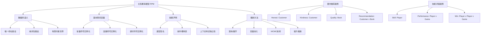

# 15.1 关系概率模型 Deep Dive

## 一、背景与动机

### 1.1 从贝叶斯网络到关系概率模型

概率知识表示的发展历程反映了人工智能领域对表达能力与计算效率之间平衡的不断探索。在第13章和第14章中，贝叶斯网络作为一种因子化表示方法，为处理不确定性提供了强大的框架。然而，贝叶斯网络存在一个根本性的限制：随机变量的集合是固定且有限的，每个随机变量都有一个固定的可能取值范围。这一限制使得贝叶斯网络在表示复杂领域时面临严峻挑战——网络规模会随着领域复杂度呈爆炸性增长，导致手工构造不可行，且无法从合理数量的数据中学习到有效的模型。

关系概率模型（Relational Probability Model, RPM）的提出正是为了突破这一瓶颈。RPM的核心思想是将一阶逻辑的表达能力引入概率表示，使得模型能够描述对象之间的关系，而非仅仅是命题级的变量赋值。这种结构化表示方法使得模型能够以简洁的方式表达复杂的概率依赖关系，极大地提升了概率模型的可扩展性和实用性。

### 1.2 数据库语义的引入

一阶模型的集合在标准语义下是无限的，这给概率建模带来了两个关键问题：一是概率求和可能不可行，二是在无限世界集合中指定完整且一致的分布极其困难。为解决这些问题，RPM采用了数据库语义（Database Semantics），该语义做出了两个关键假设：

1. **唯一命名假设（Unique Names Assumption）**：每个常量符号对应唯一的对象
2. **域闭包假设（Domain Closure Assumption）**：除命名的对象之外没有其他对象

在这些假设下，每个世界中的对象集合恰好是所使用的常量符号集合，从而确保可能世界的集合是有限的。这使得概率计算成为可能，同时保留了足够的表达能力来建模复杂的现实世界问题。

### 1.3 实际应用场景

RPM的应用场景极为广泛，包括但不限于：
- **推荐系统**：建模用户偏好、物品属性及其交互关系
- **社交网络分析**：描述用户之间的关系和属性传播
- **医疗诊断**：表示症状、疾病和患者特征之间的复杂关联
- **游戏评级系统**：评估玩家技能等级和比赛结果预测

## 二、知识逻辑图谱



## 三、核心概念与数学分析

### 3.1 形式化定义

**定义 15.1（关系概率模型）**：一个关系概率模型 $\mathcal{M}$ 是一个五元组 $(\mathcal{T}, \mathcal{C}, \mathcal{F}, \mathcal{P}, \mathcal{D})$，其中：
- $\mathcal{T}$ 是类型集合
- $\mathcal{C}$ 是常量符号集合，每个常量具有特定类型
- $\mathcal{F}$ 是函数符号集合，每个函数具有类型签名
- $\mathcal{P}$ 是谓词符号集合
- $\mathcal{D}$ 是依赖声明集合

**定义 15.2（基本随机变量）**：给定常量及其类型、函数及其类型签名，通过使用对象的每种可能组合实例化每个函数，获得的基本随机变量集合为：

$$\mathcal{V} = \{f(c_1, c_2, \ldots, c_n) \mid f \in \mathcal{F}, c_i \in \mathcal{C}_{type(f_i)}\}$$

其中 $\mathcal{C}_{type(f_i)}$ 表示类型与函数第 $i$ 个参数类型匹配的常量集合。

### 3.2 概率语义

RPM定义了一个可能世界的集合 $\Omega$，其中每个世界 $\omega$ 的概率为 $P(\omega)$。对于一阶概率语句 $\phi$，其概率定义为：

$$P(\phi) = \sum_{\omega: \phi \text{ 在 } \omega \text{ 中为真}} P(\omega)$$

条件概率的计算遵循标准的贝叶斯规则：

$$P(\phi \mid e) = \frac{P(\phi \land e)}{P(e)}$$

**定理 15.1（RPM概率一致性）**：在数据库语义下，良构的RPM定义了唯一的、一致的概率分布。

*证明概要*：
1. 数据库语义确保可能世界集合有限
2. 依赖声明定义了有向无环图结构
3. 根据贝叶斯网络的链式法则，每个世界的概率可分解为条件概率的乘积
4. 所有世界概率之和为1，满足概率公理

### 3.3 图书推荐模型的数学分析

考虑图书推荐场景，定义以下随机变量：

- $\text{Honest}(c) \in \{\text{true}, \text{false}\}$：顾客 $c$ 的诚实度
- $\text{Kindness}(c) \in \{1,2,3,4,5\}$：顾客 $c$ 的友善度
- $\text{Quality}(b) \in \{1,2,3,4,5\}$：书籍 $b$ 的质量
- $\text{Recommendation}(c,b) \in \{1,2,3,4,5\}$：顾客 $c$ 对书籍 $b$ 的推荐评分

先验分布定义为：

$$\text{Honest}(c) \sim \langle 0.99, 0.01 \rangle$$

$$\text{Kindness}(c) \sim \langle 0.1, 0.1, 0.2, 0.3, 0.3 \rangle$$

$$\text{Quality}(b) \sim \langle 0.05, 0.2, 0.4, 0.2, 0.15 \rangle$$

条件依赖关系：

$$\text{Recommendation}(c,b) \sim \text{RecCPT}(\text{Honest}(c), \text{Kindness}(c), \text{Quality}(b))$$

其中RecCPT是一个 $2 \times 5 \times 5 \times 5$ 的条件概率表。

**参数效率分析**：

对于 $C$ 个顾客和 $B$ 本书：
- 可能世界数量：$2^C \cdot 5^{C+B+BC}$
- 当 $C = 10^9, B = 10^7$ 时，可能世界数约为 $10^{7 \times 10^{15}}$
- RPM参数总数：约300个（主要来自RecCPT）

这种指数级的压缩比展示了RPM表达能力的强大。

### 3.4 上下文特定独立性

RPM支持上下文特定独立性（Context-Specific Independence, CSI），允许依赖关系根据特定条件变化：

$$\text{Recommendation}(c,b) \sim \text{if } \text{Honest}(c) \text{ then } \text{HonestRecCPT}(\text{Kindness}(c), \text{Quality}(b)) \text{ else } \langle 0.4, 0.1, 0.0, 0.1, 0.4 \rangle$$

当 $\text{Honest}(c) = \text{false}$ 时，$\text{Recommendation}(c,b)$ 独立于 $\text{Kindness}(c)$ 和 $\text{Quality}(b)$。

## 四、定理与证明

### 定理 15.2（RPM展开等价性）

给定一个RPM $\mathcal{M}$ 和常量集合 $\mathcal{C}$，通过落地（grounding）构造的贝叶斯网络 $BN_{\mathcal{M},\mathcal{C}}$ 与RPM定义的概率分布等价。

**证明**：

设 $\mathcal{M}$ 的基本随机变量集合为 $\mathcal{V}$，落地后的贝叶斯网络节点对应于 $\mathcal{V}$ 中的每个实例化变量。

1. **结构等价性**：RPM的依赖声明直接映射为贝叶斯网络的有向边
2. **参数等价性**：每个节点的条件概率表由RPM的依赖声明确定
3. **分布等价性**：对于任意可能世界 $\omega$：
   $$P_{\mathcal{M}}(\omega) = \prod_{v \in \mathcal{V}} P(v \mid \text{Pa}(v)) = P_{BN}(\omega)$$

因此，两种表示定义相同的概率分布。$\square$

### 定理 15.3（关系不确定性的概率传播）

在存在关系不确定性（如未知的作者身份）时，后验概率可以通过对所有可能的关系配置求和计算：

$$P(\text{Query} \mid \text{Evidence}) = \sum_{r \in \mathcal{R}} P(\text{Query} \mid r, \text{Evidence}) \cdot P(r \mid \text{Evidence})$$

其中 $\mathcal{R}$ 是所有可能的关系配置集合。

**证明**：

根据全概率公式：

$$P(Q \mid E) = \sum_{r} P(Q, r \mid E) = \sum_{r} P(Q \mid r, E) \cdot P(r \mid E)$$

在RPM框架下，关系变量（如Author）与其他随机变量一样参与概率推理，因此上述公式成立。$\square$

## 五、具体示例

### 5.1 图书推荐系统详解

**场景描述**：一个网上图书零售商希望根据顾客的推荐对商品进行整体评估。评估需要考虑到有些顾客比其他人更友善，有些顾客可能不诚实。

**模型构建**：

```
类型：Customer, Book

函数签名：
- Honest: Customer → {true, false}
- Kindness: Customer → {1,2,3,4,5}
- Quality: Book → {1,2,3,4,5}
- Recommendation: Customer × Book → {1,2,3,4,5}

依赖声明：
Honest(c) ~ <0.99, 0.01>
Kindness(c) ~ <0.1, 0.1, 0.2, 0.3, 0.3>
Quality(b) ~ <0.05, 0.2, 0.4, 0.2, 0.15>
Recommendation(c,b) ~ RecCPT(Honest(c), Kindness(c), Quality(b))
```

**推理示例**：

假设观察到顾客 $C_1$ 对书籍 $B_1$ 给出了5分推荐，但其他顾客对 $B_1$ 的评价普遍较低。同时，$C_1$ 对某位作者的所有书籍都给出5分。

计算：

$$P(\text{Fan}(C_1, \text{Author}(B_1)) \mid \text{Recommendation}(C_1, B_1) = 5, \text{其他证据})$$

通过贝叶斯推理，系统可以推断出 $C_1$ 很可能是 $B_1$ 作者的粉丝，从而在评估 $B_1$ 质量时降低该推荐的权重。

### 5.2 玩家技能评级系统

**场景描述**：为竞技游戏玩家建立技能等级评估系统，类似于国际象棋的Elo等级分。

**模型定义**：

$$\text{Skill}(i) \sim \mathcal{N}(\mu, \sigma^2)$$

$$\text{Performance}(i, g) \sim \mathcal{N}(\text{Skill}(i), \beta^2)$$

$$\text{Win}(i, j, g) = \mathbb{1}[\text{Performance}(i, g) > \text{Performance}(j, g)] \text{ if } \text{Game}(g, i, j)$$

其中：
- $\mu$ 是技能均值的先验
- $\sigma^2$ 是技能方差的先验
- $\beta^2$ 是表现相对于技能的方差

**团队游戏扩展**：

$$\text{TeamPerformance}(t, g) = \sum_{i \in t} \text{Performance}(i, g)$$

微软的TrueSkill系统基于此模型，每天为数亿用户提供服务。

## 六、一句话本质

**关系概率模型通过将一阶逻辑的表达能力与概率论的不确定性处理相结合，在有限对象假设下实现了对复杂关系领域的高效概率建模。**

## 七、总结与反思

### 7.1 核心贡献

1. **表达能力**：RPM将概率表示从一阶逻辑提升到关系层面，能够自然地描述对象及其关系
2. **参数效率**：通过模板化的依赖声明，实现了对大规模领域的高效建模
3. **推理灵活性**：支持多种推理方法，从精确推断到近似算法

### 7.2 局限性

1. **闭世界假设**：数据库语义要求预先知道所有对象，无法处理存在不确定性
2. **身份确定性**：假设能够唯一识别每个对象，无法处理身份不确定性
3. **有限域限制**：对象数量必须是有限的，限制了某些应用场景

### 7.3 与后续内容的联系

RPM为开宇宙概率模型（OUPM）奠定了基础。OUPM通过移除数据库语义的限制，扩展了RPM以处理存在不确定性和身份不确定性，这在15.2节中有详细讨论。

### 7.4 实践启示

在实际应用中，RPM特别适合以下场景：
- 对象集合明确且有限的领域
- 关系结构相对稳定的系统
- 需要高效推理的大规模应用

理解RPM的原理和限制，有助于在实际问题中选择合适的概率建模工具，并为更复杂的建模需求（如OUPM）提供理论基础。
