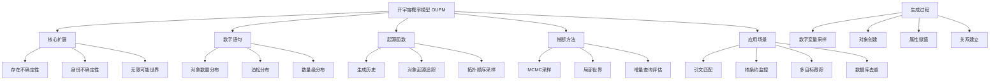

# 15.2 开宇宙概率模型 Deep Dive

## 一、背景与动机

### 1.1 从闭宇宙到开宇宙的必然演进

关系概率模型（RPM）虽然在表达能力上较贝叶斯网络有了质的飞跃，但其数据库语义所依赖的两个核心假设——唯一命名假设和域闭包假设——在真实世界的许多应用场景中显得过于严格。这些假设要求：

1. 所有相关对象的集合必须预先确切知道
2. 每个对象能够被无歧义地识别
3. 观测数据能正确与命名对象的常量符号关联

然而，现实世界充满了不确定性。图书零售商使用ISBN标识书籍，但同一本书可能有多个ISBN（精装版、平装版、大字体版等）；顾客可能拥有多个登录ID（"女巫攻击"）；视觉系统不知道下一个角落有什么物体；文本理解系统无法预先知道文本中将出现哪些实体；情报分析系统永远不知道到底有多少间谍存在。

这些场景共同指向了两个核心问题：
- **存在不确定性（Existence Uncertainty）**：观测到的数据没有明确指示真实对象的存在
- **身份不确定性（Identity Uncertainty）**：不清楚哪些逻辑术语实际上指代同一个对象

### 1.2 人类认知的启示

人类认知的一个主要部分似乎要求我们认识到存在什么物体，并能够将观测结果（这种观测几乎从不附带唯一的ID）与世界上的假想对象联系起来。这种能力是人类智能的基础，也是开宇宙概率模型试图形式化的核心能力。

### 1.3 应用驱动的需求

开宇宙概率模型的需求不仅来自理论上的完整性追求，更来自实际应用的迫切需求：
- **引文匹配**：识别不同格式的引用是否指向同一篇论文
- **核条约监控**：从地震数据中检测和定位核试验
- **多目标跟踪**：在雷达数据中跟踪多个移动对象
- **自然语言理解**：解析指代消解和实体链接

## 二、知识逻辑图谱



## 三、核心概念与数学分析

### 3.1 形式化定义

**定义 15.4（开宇宙概率模型）**：一个开宇宙概率模型 $\mathcal{O}$ 是一个七元组 $(\mathcal{T}, \mathcal{O}_g, \mathcal{F}, \mathcal{P}, \mathcal{N}, \mathcal{D}, \mathcal{O}_o)$，其中：
- $\mathcal{T}$ 是类型集合
- $\mathcal{O}_g$ 是保证对象集合（必须存在的对象）
- $\mathcal{F}$ 是函数符号集合
- $\mathcal{P}$ 是谓词符号集合
- $\mathcal{N}$ 是数字语句集合
- $\mathcal{D}$ 是依赖声明集合
- $\mathcal{O}_o$ 是起源函数集合

**定义 15.5（数字变量）**：对于每个类型 $\tau \in \mathcal{T}$ 和起源 $o$，数字变量 $\#\tau_o(\omega)$ 表示在世界 $\omega$ 中具有起源 $o$ 的类型 $\tau$ 对象的数量。

### 3.2 数字语句与分布

数字语句指定对象数量的条件分布。常用分布包括：

**均匀整数分布**：

$$\#\text{Customer} \sim \text{UniformInt}(1, 3)$$

**泊松分布**：

$$P(X = k) = \frac{\lambda^k e^{-\lambda}}{k!}$$

泊松分布的参数 $\lambda$ 既是期望也是方差，标准差为 $\sqrt{\lambda}$。

**数量级分布（Order-of-Magnitude Distribution）**：

使用以10为底的对数正态分布，OM(3,1) 表示均值为 $10^3$，标准差为一个数量级。

**条件数字语句**：

$$\#\text{LoginID}(\text{Owner} = c) \sim \text{if } \text{Honest}(c) \text{ then } \text{Exactly}(1) \text{ else } \text{UniformInt}(2, 5)$$

### 3.3 对象身份与生成历史

在OUPM中，每个对象都是一个**生成历史**（generating history）：

$$\langle \text{Type}, \text{Origin}, \text{Index} \rangle$$

例如：
- 无起源对象：$\langle \text{Customer}, \emptyset, 2 \rangle$ 表示第二个顾客
- 有起源对象：$\langle \text{LoginID}, \langle \text{Owner}, \langle \text{Customer}, 2 \rangle \rangle, 3 \rangle$ 表示属于第二个顾客的第三个登录ID

**定理 15.4（生成历史的唯一性）**：每个可能世界可以由唯一的生成序列构建。

*证明*：假设存在两个不同的生成序列 $S_1$ 和 $S_2$ 产生相同的世界 $\omega$。由于生成顺序是拓扑排序，且每个对象的创建都依赖于其起源对象的先前创建，两个不同的序列必然在某个步骤产生不同的对象集合或属性赋值，导致不同的世界。矛盾。$\square$

### 3.4 世界概率计算

通过拓扑顺序采样生成世界，世界的概率是所有采样值概率的乘积：

$$P(\omega) = \prod_{i} P(X_i = x_i \mid X_1 = x_1, \ldots, X_{i-1} = x_{i-1})$$

其中 $X_i$ 可以是数字变量或基本随机变量。

**示例计算**：

考虑一个简化的图书推荐OUPM世界：

| 变量 | 值 | 概率 |
|------|-----|------|
| #Customer | 2 | 0.3333 |
| #Book | 3 | 0.3333 |
| Honest⟨Customer,1⟩ | true | 0.99 |
| Honest⟨Customer,2⟩ | false | 0.01 |
| ... | ... | ... |

$$P(\omega) = 0.3333 \times 0.3333 \times 0.99 \times 0.01 \times \cdots = 1.2672 \times 10^{-11}$$

### 3.5 无限世界的测度论处理

OUPM可能具有无限多个随机变量（当对象数量无界时），这要求非平凡的测度论处理：

**良构条件**：
1. 不允许循环依赖
2. 不允许无限后退的祖先链

这些条件一般来说是不可判定的，但某些语法上的充分条件可以被验证。

## 四、定理与证明

### 定理 15.5（OUPM概率分布的存在性与唯一性）

在满足良构条件的OUPM中，存在唯一的概率分布与模型定义一致。

**证明概要**：

1. **构造性存在证明**：
   - 按拓扑顺序定义生成过程
   - 每个步骤的条件概率明确定义
   - 由科尔莫戈罗夫扩张定理，存在唯一的概率测度

2. **唯一性证明**：
   - 生成历史的唯一性确保每个世界有唯一的生成路径
   - 概率的乘积形式确保一致性
   - 测度论条件保证可扩展性

### 定理 15.6（MCMC收敛性）

在满足特定条件下，OUPM的MCMC算法收敛到真实的后验分布。

**条件**：
1. 提议分布满足细致平衡条件
2. 马尔可夫链是不可约的
3. 马尔可夫链是非周期的

**证明**：

根据Metropolis-Hastings算法的标准收敛定理，当提议分布满足上述条件时，马尔可夫链的平稳分布就是目标后验分布。对于OUPM，状态空间包括对象数量和关系配置，需要证明在这些扩展状态空间上的遍历性。$\square$

## 五、具体示例

### 5.1 引文匹配系统

**问题描述**：从PDF文件中提取的引用字符串需要与实际的论文建立关联。由于字符串不包含对象标识符，且存在语法、拼写、标点和内容错误，这是一个典型的身份不确定性问题。

**OUPM模型**：

```
type Researcher, Paper, Citation

random String Name(Researcher)
random String Title(Paper)
random Paper PubCited(Citation)
random String Text(Citation)
random Boolean Professor(Researcher)

origin Researcher Author(Paper)

#Researcher ~ OM(3,1)
Name(r) ~ NamePrior()
Professor(r) ~ Boolean(0.2)
#Paper(Author = r) ~ if Professor(r) then OM(1.5, 0.5) else OM(1, 0.5)
Title(p) ~ PaperTitlePrior()
CitedPaper(c) ~ UniformChoice({Paper p})
Text(c) ~ HMMGrammar(Name(Author(CitedPaper(c))), Title(CitedPaper(c)))
```

**推理结果**：

仅将引用字符串作为证据进行概率推断，错误率是CiteSeer的1/2~1/3。系统表现出集体消歧能力：对一篇论文的引用越多，引用被解析得越准确。

### 5.2 核条约监控（NET-VISA）

**系统目标**：核查《全面禁止核试验条约》，检测地球上所有震级高于最低限度的地震事件。

**模型要素**：

1. **事件生成**：
   $$\text{SeismicEvents} \sim \text{Poisson}(T \cdot \lambda_e)$$
   $$\text{Time}(e) \sim \text{UniformReal}(0, T)$$

2. **事件分类**：
   $$\text{Earthquake}(e) \sim \text{Boolean}(0.999)$$
   $$\text{Location}(e) \sim \text{if Earthquake}(e) \text{ then SpatialPrior() else UniformEarth()}$$

3. **检测模型**：
   $$\text{Detected}(e, p, s) \sim \text{Logistic}(\text{weights}(s, p), \text{Magnitude}(e), \text{Depth}(e), \text{Dist}(e, s))$$

4. **虚假警报**：
   $$\#\text{Detections}(\text{site} = s) \sim \text{Poisson}(T \cdot \lambda_f(s))$$

**性能结果**：

在2009年的测试中：
- 联合国SEL3自动公告遗漏：27.4%
- NET-VISA遗漏：11.1%
- 与密集区域网络相比，NET-VISA发现的真实事件比专家公告多50%

### 5.3 图书推荐系统的OUPM扩展

将15.1节的RPM图书推荐模型扩展为OUPM：

```
#Customer ~ UniformInt(1, 3)
#Book ~ UniformInt(2, 4)

#LoginID(Owner = c) ~ if Honest(c) then Exactly(1) else UniformInt(2, 5)

Honest(c) ~ <0.99, 0.01>
Kindness(c) ~ <0.1, 0.1, 0.2, 0.3, 0.3>
Quality(b) ~ <0.05, 0.2, 0.4, 0.2, 0.15>

Recommendation(l, b) ~ RecCPT(Honest(Owner(l)), Kindness(Owner(l)), Quality(b))
```

这个模型可以处理：
- 不诚实顾客的多个登录ID（女巫攻击）
- 同一本书的多个ISBN
- 顾客和书籍数量的不确定性

## 六、一句话本质

**开宇宙概率模型通过引入数字语句和起源函数，将概率推理扩展到对象存在性和身份不确定的无限世界空间，实现了对真实世界复杂不确定性的统一建模。**

## 七、总结与反思

### 7.1 理论突破

1. **无限世界建模**：OUPM首次提供了在无限可能世界空间上定义一致概率分布的严格框架
2. **生成历史**：通过将对象表示为生成历史，解决了对象身份和概率计算的关键问题
3. **拓扑采样**：基于拓扑顺序的采样算法确保了概率计算的可行性

### 7.2 实践价值

1. **统一框架**：OUPM为存在不确定性和身份不确定性提供了统一的数学框架
2. **实际应用**：在引文匹配、核监控、多目标跟踪等领域取得了显著成果
3. **可扩展性**：MCMC等近似算法使得大规模问题的推理成为可能

### 7.3 技术挑战

1. **计算复杂性**：精确推断在OUPM中通常是不可行的
2. **收敛诊断**：MCMC方法的收敛性检验仍然是一个开放问题
3. **模型设计**：设计有效的OUPM需要领域专业知识和概率建模经验

### 7.4 与RPM的关系

| 特性 | RPM | OUPM |
|------|-----|------|
| 对象数量 | 固定且已知 | 随机且未知 |
| 对象身份 | 确定 | 不确定 |
| 可能世界 | 有限 | 可能无限 |
| 表达能力 | 闭宇宙 | 开宇宙 |
| 计算复杂性 | 较低 | 较高 |

### 7.5 未来展望

OUPM为概率编程语言的发展奠定了理论基础。15.4节介绍的基于程序的概率模型可以看作是OUPM的进一步扩展，将生成过程表示为可执行的程序代码。这种趋势表明，概率建模正朝着更加灵活、通用的方向发展，能够处理越来越复杂的现实世界问题。

理解OUPM的原理对于掌握现代概率推理技术至关重要，它不仅是一个理论工具，更是解决实际问题的强大武器。
