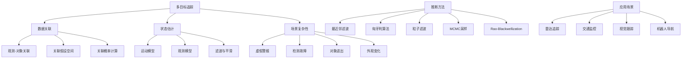

# 15.3 追踪复杂世界 Deep Dive

## 一、背景与动机

### 1.1 从单目标到多目标追踪的跨越

第14章讨论的状态估计问题主要集中在单对象场景：重症监护病房里的病人、飞过森林的鸟。然而，现实世界中的追踪问题往往涉及多个同时存在的对象，这些对象产生观测，但观测与对象之间的对应关系是未知的。这种**数据关联（Data Association）**问题将状态估计的复杂性提升到了一个全新的层次。

数据关联问题的核心挑战在于：**当两个或多个对象产生观测时，存在关于哪个对象产生了哪个观测结果的不确定性**。这种不确定性在控制理论文献中被称为数据关联问题，在开宇宙概率模型（OUPM）框架下则体现为身份不确定性在时间维度上的延伸。

### 1.2 实际应用的复杂性

多目标追踪的实际应用远比理论模型复杂：

1. **虚假警报（False Alarms/Clutter）**：观测中存在不是由真实对象引起的信号
2. **检测故障（Detection Failure）**：真实对象产生的观测未被报告
3. **对象出现与消失**：新的对象可能随时进入场景，旧的对象可能离开
4. **外观变化**：同一对象在不同观测条件下可能呈现截然不同的特征
5. **密集场景**：对象之间的相互作用和遮挡增加了关联难度

### 1.3 历史发展脉络

多目标追踪的研究可以追溯到雷达技术的早期发展：
- 1964年：Sittler首次在概率框架下描述数据关联问题
- 1979年：Reid提出多重假设追踪器（MHT）算法
- 1990年代：MCMC方法被引入数据关联
- 2000年代：粒子滤波和Rao-Blackwellization技术的应用
- 2010年代：深度学习方法与传统概率方法的结合

## 二、知识逻辑图谱



## 三、核心概念与数学分析

### 3.1 问题形式化

**定义 15.6（多目标追踪问题）**：给定：
- 对象集合 $\mathcal{A} = \{a_1, a_2, \ldots, a_n\}$
- 时间步 $t = 0, 1, 2, \ldots, T$
- 观测集合 $\mathcal{Z}_t = \{z_{t,1}, z_{t,2}, \ldots, z_{t,m_t}\}$ 在每个时间步

目标：估计对象状态序列 $\{X(a, t)\}_{a \in \mathcal{A}, t \in [0,T]}$ 和观测-对象关联。

### 3.2 基础模型（已知对象数量）

对于已知对象数量 $n$ 的场景，基本OUPM模型为：

**状态转移**：

$$X(a, t) \sim \text{if } t = 0 \text{ then } \text{InitX}() \text{ else } \mathcal{N}(FX(a, t-1), \Sigma_x)$$

其中 $F$ 是状态转移矩阵，$\Sigma_x$ 是过程噪声协方差。

**观测生成**：

$$\#\text{Blip}(\text{Source} = a, \text{Time} = t) = 1$$

$$Z(b) \sim \mathcal{N}(HX(\text{Source}(b), \text{Time}(b)), \Sigma_z)$$

其中 $H$ 是观测矩阵，$\Sigma_z$ 是观测噪声协方差。

**关联假设空间**：

对于 $n$ 个对象和 $T$ 个时间步，关联假设的数量为 $(n!)^T$。例如，对于5个对象和10个时间步，关联假设数约为 $10^{32}$。

### 3.3 完整模型（含所有复杂性）

考虑虚假警报、检测故障和对象进出的完整模型：

**对象进出**：

$$\#\text{Aircraft}(\text{EntryTime} = t) \sim \text{Poisson}(\lambda_a)$$

$$\text{Exits}(a, t) \sim \text{if } \text{InFlight}(a, t) \text{ then } \text{Boolean}(\alpha_e)$$

$$\text{InFlight}(a, t) = (t = \text{EntryTime}(a)) \lor (\text{InFlight}(a, t-1) \land \neg \text{Exits}(a, t-1))$$

**检测模型**：

$$\#\text{Blip}(\text{Source} = a, \text{Time} = t) \sim \text{if } \text{InFlight}(a, t) \text{ then } \text{Bernoulli}(\text{DetectionProb}(X(a, t)))$$

**虚假警报**：

$$\#\text{Blip}(\text{Time} = t) \sim \text{Poisson}(\lambda_f)$$

$$Z(b) \sim \text{if } \text{Source}(b) = \text{null} \text{ then } \text{UniformZ}(R) \text{ else } \mathcal{N}(HX(\text{Source}(b), \text{Time}(b)), \Sigma_z)$$

### 3.4 后验分布的复杂性

**定理 15.7（滤波分布的混合性）**：在多目标追踪中，滤波分布是指数级数量分布的混合，每个分布对应一种观测序列到对象的赋值方式。

**证明**：

在时间步 $t$，滤波分布为：

$$P(X_t \mid Z_{1:t}) = \sum_{\gamma_{1:t}} P(X_t \mid \gamma_{1:t}, Z_{1:t}) P(\gamma_{1:t} \mid Z_{1:t})$$

其中 $\gamma_{1:t}$ 表示从时间1到 $t$ 的关联序列。由于每个时间步有 $n!$ 种可能的关联（对于 $n$ 个对象和 $n$ 个观测），$t$ 个时间步的关联序列数为 $(n!)^t$。因此，滤波分布是 $(n!)^t$ 个高斯分布的混合。$\square$

这个定理解释了为什么多目标追踪没有已知的高效精确算法——后验分布的表示本身就是指数级复杂的。

## 四、定理与证明

### 定理 15.8（数据关联的NP难性）

在一般情况下，找到最优的数据关联是NP难问题。

**证明**：

通过将分配问题（Assignment Problem）归约到数据关联问题。考虑一个简化场景：
- 每个时间步有 $n$ 个预测位置和 $n$ 个观测
- 目标是找到最小化总距离的关联

这正是经典的线性分配问题，已知是NP难问题。当考虑多个时间步和概率模型时，问题的复杂性进一步增加。$\square$

### 定理 15.9（Rao-Blackwellized粒子滤波的收敛性）

在使用Rao-Blackwellization的粒子滤波中，如果关联假设的采样满足重要性采样条件，则状态估计以概率1收敛到真实后验。

**证明**：

Rao-Blackwellization将状态空间分解为：
- 关联变量 $\gamma$（采样）
- 连续状态 $X$（解析积分，使用卡尔曼滤波）

对于每个粒子 $i$，关联假设 $\gamma^{(i)}$ 确定了哪些观测分配给哪个对象。给定 $\gamma^{(i)}$，每个对象的状态可以独立地使用卡尔曼滤波更新。

根据粒子滤波的收敛理论和卡尔曼滤波的最优性，当粒子数 $N \to \infty$ 时，粒子分布收敛到真实的后验分布。$\square$

## 五、具体示例

### 5.1 雷达多目标追踪示例

**场景设置**：
- 二维空间，5个时间步
- 每个时间步出现2个光点（观测）
- 光点标记有时间步，但无身份标识

**可能假设**：

图15-8展示了两种可能的轨迹假设：
- 假设(b)：两条清晰分离的轨迹
- 假设(c)：轨迹交叉，关联存在歧义

**关联数量分析**：

对于2个对象和5个时间步，关联假设数为 $(2!)^5 = 32$。对于更多对象和时间步，这个数字呈指数增长：

| 对象数 | 时间步 | 关联假设数 |
|--------|--------|------------|
| 2 | 5 | 32 |
| 3 | 5 | 7,776 |
| 5 | 10 | $\approx 10^{32}$ |
| 10 | 20 | 超大规模 |

### 5.2 交通监控系统

**应用场景**：加利福尼亚州高速公路监控

**挑战因素**：
1. **虚假警报**：移动阴影、铰接车辆、水面反射
2. **检测故障**：遮挡、雾、黑暗、缺乏对比度
3. **外观变化**：同一车辆在不同摄像头间外观差异巨大
4. **动态环境**：交通堵塞导致转移模型变化
5. **长距离追踪**：摄像头间距大导致预测误差大

**系统架构**：

```
输入：摄像头网络图像流
      ↓
目标检测：提取车辆特征
      ↓
数据关联：跨摄像头匹配
      ↓
状态估计：轨迹跟踪与预测
      ↓
输出：行程时间估计、交通需求分析
```

**性能指标**：
- 车辆重识别准确率
- 行程时间估计误差
- 交通流量统计精度

### 5.3 推断方法对比

#### 5.3.1 最近邻滤波

**算法**：在每个时间步，将每个观测与最近的预测位置关联。

**适用条件**：
- 对象在状态空间中良好分离
- 预测不确定性小
- 观测误差小

**局限性**：当对象接近或交叉时，容易产生错误关联，导致后续预测严重偏离。

#### 5.3.2 匈牙利算法

**算法**：在每个时间步，求解最优分配问题，最大化联合概率。

**复杂度**：$O(n^3)$，其中 $n$ 是对象/观测数。

**优势**：能够找到全局最优的单步关联。

**局限**：仍然只使用单步最优，不考虑多步关联的不确定性。

#### 5.3.3 粒子滤波

**算法**：维持大量可能的当前关联假设（粒子）。

**公式**：

$$P(X_t, \gamma_t \mid Z_{1:t}) \approx \sum_{i=1}^N w_t^{(i)} \delta(X_t - X_t^{(i)}, \gamma_t - \gamma_t^{(i)})$$

**优势**：能够表示多模态分布，处理关联不确定性。

**局限**：需要大量粒子，计算成本高。

#### 5.3.4 MCMC方法

**算法**：探索历史关联假设的空间，可以改变对以前关联决策的判断。

**转移操作**：
1. 交换两个观测的关联
2. 改变单个观测的关联
3. 添加/删除虚假警报标记

**优势**：能够修正早期的错误关联决策。

**性能**：目前的MCMC数据关联方法可以实时处理数百个对象。

#### 5.3.5 Rao-Blackwellization

**核心思想**：给定特定关联假设，每个对象的状态滤波可以精确高效地完成（使用卡尔曼滤波）。

**算法流程**：

```
对于每个粒子i：
  1. 采样关联假设 γ^(i)
  2. 对于每个对象a：
     - 提取分配给a的观测序列
     - 运行卡尔曼滤波更新状态
  3. 计算粒子权重
```

**效率提升**：
- 避免了对连续状态采样
- 关联变化时只需重新计算受影响的对象
- 通常比标准粒子滤波高效数个数量级

## 六、一句话本质

**多目标追踪通过数据关联解决观测与对象对应的不确定性，将状态估计扩展到复杂场景，是开宇宙概率模型在时序推理中的重要应用。**

## 七、总结与反思

### 7.1 核心挑战与解决方案

| 挑战 | 解决方案 | 权衡 |
|------|----------|------|
| 关联假设空间爆炸 | 近似算法（MCMC、粒子滤波） | 精度 vs 效率 |
| 虚假警报 | 概率模型中的虚警过程 | 模型复杂性 |
| 检测故障 | 概率检测模型 | 参数估计 |
| 对象进出 | 生灭过程建模 | 计算开销 |
| 错误关联传播 | 多假设跟踪、MCMC修正 | 延迟决策 |

### 7.2 方法选择指南

**选择最近邻滤波**：
- 对象分离良好
- 实时性要求高
- 计算资源有限

**选择匈牙利算法**：
- 需要单步最优
- 对象数适中
- 关联相对明确

**选择粒子滤波/MCMC**：
- 关联存在显著不确定性
- 可以容忍一定延迟
- 需要概率分布而非点估计

**选择Rao-Blackwellization**：
- 对象动态可以用线性高斯模型近似
- 需要处理大量对象
- 追求计算效率

### 7.3 与OUPM的深层联系

多目标追踪是OUPM在时序场景下的具体应用：
- **对象存在不确定性**：通过生灭过程建模
- **身份不确定性**：通过数据关联解决
- **关系不确定性**：通过观测-对象关系建模

这种联系表明，OUPM提供了一个统一的理论框架，可以涵盖从静态关系到动态追踪的广泛问题。

### 7.4 前沿发展方向

1. **深度学习方法**：使用神经网络进行特征提取和关联学习
2. **端到端学习**：直接从原始数据学习追踪模型
3. **多模态融合**：整合视觉、雷达、激光雷达等多种传感器
4. **分布式追踪**：多传感器网络中的协作追踪
5. **可解释性**：提供关联决策的可解释理由

### 7.5 实践启示

在实际应用中，设计多目标追踪系统需要考虑：
1. **问题特性分析**：对象密度、运动模式、观测质量
2. **算法选择**：根据精度-效率权衡选择合适方法
3. **参数调优**：检测概率、虚警率、过程噪声等
4. **评估方法**：使用真实数据或高保真仿真验证

理解数据关联的理论基础对于构建可靠的追踪系统至关重要，特别是在安全关键应用中，如自动驾驶、空中交通管制等领域。
