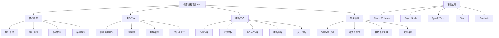

# 15.4 作为概率模型的程序 Deep Dive

## 一、背景与动机

### 1.1 概率表示的演进路径

概率模型表示方法经历了从简单到复杂、从受限到通用的演进：

1. **贝叶斯网络**：因子化表示，变量集合固定
2. **关系概率模型（RPM）**：一阶逻辑表示，对象集合固定但可参数化
3. **开宇宙概率模型（OUPM）**：支持对象存在性和身份不确定性
4. **概率编程语言（PPL）**：通用编程语言中的概率模型

概率编程语言代表了这一演进的最新阶段，它将概率建模与通用计算相结合，提供了前所未有的表达能力。

### 1.2 核心洞察

概率编程语言建立在这样一个深刻的洞察之上：**概率模型可以使用包含随机源的任何编程语言中的可执行代码来定义**。

在这种视角下：
- **可能世界** = 程序的执行轨迹
- **轨迹概率** = 产生该轨迹所需的随机选择的概率乘积
- **查询** = 对执行轨迹的属性提问
- **证据** = 对执行轨迹的约束条件

### 1.3 计算通用性

许多PPL在计算上是通用的：它们能表示可由停机的概率图灵机采样的任何概率分布。这意味着PPL的表达能力等同于概率图灵机，涵盖了所有可计算的概率模型。

这种通用性带来了巨大优势：
- 复用现有编程语言的抽象机制
- 支持复杂数据结构（列表、树、图）
- 支持递归和高阶函数
- 模块化建模和代码复用

## 二、知识逻辑图谱



## 三、核心概念与数学分析

### 3.1 生成程序的形式化

**定义 15.7（生成程序）**：一个生成程序 $\mathcal{P}$ 是一个可执行程序，其中每个随机选择都对应概率模型中的一个随机变量。

设程序执行过程中的第 $i$ 次随机选择为 $X_i$，其取值 $x_i$ 服从分布：

$$X_i \sim P_i(\cdot \mid x_1, \ldots, x_{i-1})$$

**定义 15.8（执行轨迹）**：执行轨迹 $\omega = (x_1, x_2, \ldots, x_n)$ 是随机选择值的序列，其中 $n$ 可能是随机的。

**轨迹概率**：

$$P(\omega) = \prod_{i=1}^{n} P(x_i \mid x_1, \ldots, x_{i-1})$$

### 3.2 从OUPM到生成程序

**定理 15.10（OUPM到生成程序的转换）**：任何OUPM都可以转换为等价的生成程序。

**构造性证明**：

给定OUPM $\mathcal{O}$，构造生成程序 $\mathcal{P}_{\mathcal{O}}$：

1. 对于每个数字语句，生成随机数确定对象数量
2. 创建表示对象的数据结构
3. 按照拓扑顺序为基本随机变量赋值
4. 建立对象间的关系

程序的执行轨迹与OUPM的可能世界一一对应，且概率相等。$\square$

### 3.3 条件概率与推断

给定证据 $E$（对轨迹的约束），条件概率为：

$$P(Q \mid E) = \frac{P(Q \land E)}{P(E)} = \frac{\sum_{\omega \models Q \land E} P(\omega)}{\sum_{\omega \models E} P(\omega)}$$

**挑战**：
- 证据空间可能极其稀疏
- 直接采样几乎不可能命中满足证据的轨迹
- 需要专门的推断算法

### 3.4 计算复杂性分析

**定理 15.11（PPL推断的不可判定性）**：在具有无限精度连续随机变量的计算模型中，PPL推断是不可判定的。

**证明概要**：

通过将停机问题编码为概率推断问题。构造一个程序，其随机选择模拟图灵机的状态转移，证据对应于停机状态。如果推断可判定，则停机问题可判定，矛盾。$\square$

**实际缓解**：
- 使用有限精度数字
- 使用平滑概率分布
- 在这些条件下，推断是可判定的

## 四、定理与证明

### 定理 15.12（拒绝采样的正确性）

对于生成程序 $\mathcal{P}$ 和证据 $E$，拒绝采样算法产生的样本服从 $P(\cdot \mid E)$。

**证明**：

拒绝采样算法：
1. 重复运行程序生成轨迹 $\omega$
2. 如果 $\omega \models E$，接受；否则拒绝
3. 返回接受的轨迹

接受概率为 $P(E)$。在接受条件下，轨迹 $\omega$ 的概率为：

$$P(\omega \mid \text{accept}) = \frac{P(\omega)}{P(E)} = P(\omega \mid E)$$

因此，接受的样本服从正确的条件分布。$\square$

### 定理 15.13（似然加权的无偏性）

似然加权估计器是条件期望的无偏估计。

**证明**：

似然加权算法：
1. 从先验采样轨迹 $\omega$
2. 计算权重 $w(\omega) = P(E \mid \omega)$
3. 估计 $E[f(Q) \mid E] \approx \frac{\sum_i w(\omega_i) f(Q(\omega_i))}{\sum_i w(\omega_i)}$

无偏性：

$$E_{\omega \sim P}[w(\omega) f(Q(\omega))] = E_{\omega \sim P}[P(E \mid \omega) f(Q(\omega))]$$

$$= \sum_{\omega} P(\omega) P(E \mid \omega) f(Q(\omega)) = \sum_{\omega} P(\omega, E) f(Q(\omega))$$

$$= P(E) \sum_{\omega} P(\omega \mid E) f(Q(\omega)) = P(E) E[f(Q) \mid E]$$

因此，加权平均收敛到正确的条件期望。$\square$

### 定理 15.14（MCMC的细致平衡）

如果提议分布满足细致平衡条件，则MCMC算法收敛到目标后验分布。

**证明**：

Metropolis-Hastings接受概率：

$$A(\omega' \mid \omega) = \min\left(1, \frac{P(\omega' \mid E) Q(\omega \mid \omega')}{P(\omega \mid E) Q(\omega' \mid \omega)}\right)$$

细致平衡：

$$P(\omega \mid E) T(\omega' \mid \omega) = P(\omega' \mid E) T(\omega \mid \omega')$$

其中 $T$ 是转移核。这保证了 $P(\cdot \mid E)$ 是平稳分布。$\square$

## 五、具体示例

### 5.1 光学字符识别（OCR）生成程序

**问题**：识别经过噪声退化的文本图像。

**生成程序**（简化版）：

```
function GENERATE-IMAGE()
    letters ← GENERATE-LETTERS(10)
    return RENDER-NOISY-IMAGE(letters, 32, 128)

function GENERATE-LETTERS(λ)
    n ~ Poisson(λ)
    letters[]
    for i = 1 to n do
        letters[i] ~ UniformChoice({a,b,c,...,z})
    return letters

function RENDER-NOISY-IMAGE(letters, width, height)
    clean_image ← RENDER(letters, width, height)
    noise_variance ~ UniformReal(0.1, 1)
    noisy_image[]
    for row = 1 to width do
        for col = 1 to height do
            noisy_image[row,col] ~ N(clean_image[row,col], noise_variance)
    return noisy_image
```

**模型特性**：
- 字母数量随机（泊松分布）
- 每个字母独立均匀选择
- 渲染后添加高斯噪声
- 噪声方差随机

**轨迹复杂度**：

对于图像尺寸 $32 \times 128 = 4096$ 像素，6个字母的轨迹包含：
- 1个节点（$n$）
- 6个节点（letters[i]）
- 1个节点（noise_variance）
- 4096个节点（像素值）

总计：4104个随机变量

### 5.2 改进的马尔可夫模型

**问题**：独立字母模型生成的文本不像真实英语。

**改进方案**：使用字母二元模型（Bigram Model）

```
function GENERATE-MARKOV-LETTERS(λ)
    n ~ Poisson(λ)
    letters ← []
    letter_probs ← MARKOV-INITIAL()
    for i = 1 to n do
        letters[i] ~ Categorical(letter_probs)
        letter_probs ← MARKOV-TRANSITION(letters[i])
    return letters
```

**转移概率**：

从英语单词列表估计 $P(\text{letter}_i \mid \text{letter}_{i-1})$。

**效果对比**：

| 模型 | 生成文本特征 | 高噪声识别准确率 |
|------|-------------|-----------------|
| 独立模型 | 随机字母序列 | 较低 |
| 马尔可夫模型 | 类似英语序列 | 较高 |

### 5.3 推断结果分析

**实验设置**：
- 输入：带噪声的退化图像
- 任务：识别字母序列
- 方法：MCMC推断

**结果1（中等噪声）**：

输入图像显示单词"uncertainty"，经过3轮独立MCMC运行（每轮25次迭代），所有运行都正确识别了该单词。这表明后验分布高度集中在正确解释上。

**结果2（高噪声）**：

对于更模糊的输入：
- 第一个字母被错误识别为"q"而非"u"
- 10个字母中有5个存在不确定性

**可能原因分析**：
1. **模型限制**：给定模型和图像，不确定性可能是不可避免的
2. **推断不足**：MCMC可能没有充分混合，更多迭代可能改善结果
3. **噪声水平**：可能需要改进文本模型或降低噪声

**改进效果**：

使用马尔可夫模型后，高噪声图像的识别结果明显改善，解释更接近真实轨迹。

## 六、一句话本质

**概率编程语言通过将概率模型表示为包含随机选择的可执行程序，实现了概率建模与通用计算的统一，为复杂领域的不确定性推理提供了终极表达工具。**

## 七、总结与反思

### 7.1 PPL的核心优势

| 优势 | 说明 |
|------|------|
| 表达能力 | 可表示任何可计算的概率分布 |
| 模块化 | 支持函数抽象和代码复用 |
| 灵活性 | 易于探索模型变体和改进 |
| 与编程集成 | 可直接利用现有软件生态 |
| 直观性 | 生成过程通常更符合人类思维 |

### 7.2 主要挑战与解决方案

| 挑战 | 当前解决方案 | 研究方向 |
|------|-------------|----------|
| 推断效率低 | MCMC、变分推断、推断编译 | 专用硬件、自适应提议 |
| 收敛诊断困难 | 多链诊断、收敛统计 | 自动收敛检测 |
| 调试困难 | 可视化工具、逐步执行 | 概率程序调试器 |
| 可扩展性 | 分布式采样、GPU加速 | 更高效的算法 |

### 7.3 主要PPL实现对比

| 语言 | 基础语言 | 特点 | 应用场景 |
|------|----------|------|----------|
| Church | Scheme | 首个高阶函数PPL | 认知科学 |
| Figaro | Scala | 面向对象，工业级 | 通用建模 |
| Stan | C++ | 哈密顿蒙特卡罗 | 统计建模 |
| Pyro | PyTorch | 深度学习集成 | 神经概率模型 |
| Gen | Julia | 可编程推断 | 机器人、视觉 |
| Edward | TensorFlow | 大规模推断 | 深度学习 |

### 7.4 推断技术前沿

1. **推断编译**：将概率程序编译为高效的推断代码
2. **变分推断**：用优化替代采样，提高速度
3. **神经提议**：使用神经网络学习高效的MCMC提议
4. **硬件加速**：专用概率计算硬件（如蒙特卡罗芯片）
5. **组合推断**：在同一模型中混合多种推断策略

### 7.5 与其他章节的关系

| 章节 | 关系 |
|------|------|
| 第13章（贝叶斯网络） | PPL是贝叶斯网络的推广 |
| 第14章（时序概率推理） | PPL可表示HMM、DBN等时序模型 |
| 第15.1节（RPM） | RPM可编译为PPL程序 |
| 第15.2节（OUPM） | OUPM是PPL的声明式变体 |
| 第15.3节（多目标追踪） | PPL可简洁表示复杂追踪模型 |
| 第21章（深度学习） | 神经网络的概率扩展（如VAE）可用PPL表示 |

### 7.6 实践建议

**何时使用PPL**：
- 模型结构复杂，传统工具难以表达
- 需要快速迭代和探索不同模型变体
- 问题涉及复杂的数据结构和控制流
- 需要结合深度学习和概率建模

**何时不使用PPL**：
- 简单模型（直接使用贝叶斯网络更高效）
- 对推断速度有极高要求
- 问题已存在高度优化的专用算法

**最佳实践**：
1. 从简单模型开始，逐步增加复杂性
2. 利用模块化设计复用组件
3. 使用可视化工具理解模型行为
4. 仔细验证推断结果（收敛诊断）
5. 考虑使用推断编译加速

### 7.7 未来展望

概率编程代表了人工智能和机器学习的未来方向：

1. ** democratization**：让非专家也能使用复杂的概率建模
2. **自动化**：自动模型选择、自动推断策略选择
3. **可解释性**：提供模型决策的概率解释
4. **与深度学习融合**：神经概率模型、概率神经网络
5. **应用领域扩展**：科学计算、因果推断、决策制定

理解概率编程的原理和方法，对于掌握现代人工智能技术的核心至关重要。它不仅是一种工具，更是一种思维方式——将不确定性显式地纳入计算过程，从而在复杂世界中做出更智能的决策。
