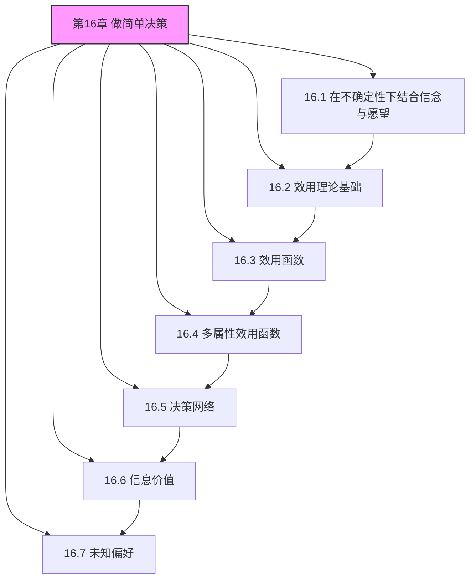
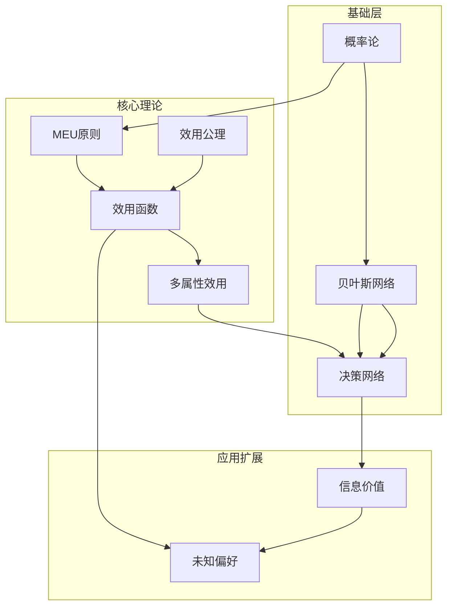

# 第16章 做简单决策 - 概览与总结

## 一、学习目标

完成本章学习后，你应该能够：

1. **理解决策论的基本框架**：掌握如何将概率论与效用理论结合，形成理性决策的数学基础
2. **应用最大期望效用原则**：计算各种决策问题的期望效用，并选择最优动作
3. **分析效用函数的性质**：理解风险态度、金钱效用、生命价值等核心概念
4. **解决多属性决策问题**：运用占优分析、偏好独立性等工具处理复杂决策
5. **构建和评估决策网络**：使用图形化工具表示和求解决策问题
6. **计算信息价值**：评估额外信息对决策的潜在改进，指导信息收集
7. **处理偏好不确定性**：理解顺从的价值和开关游戏的理论意义

## 二、本章速览

### 2.1 章节结构



### 2.2 核心公式速查

| 概念 | 公式 | 说明 |
|------|------|------|
| 期望效用 | $EU(a) = \sum_{s'} P(\text{RESULT}(a) = s') U(s')$ | MEU原则的基础 |
| 最优动作 | $a^* = \arg\max_a EU(a)$ | 理性决策的选择 |
| 彩票效用 | $U([p_1,S_1;...;p_n,S_n]) = \sum_i p_i U(S_i)$ | 期望效用性质 |
| VPI | $VPI(E_j) = E[EU|e_j] - EU(\alpha)$ | 完美信息价值 |
| 加性价值 | $V(x_1,...,x_n) = \sum_i V_i(x_i)$ | MPI条件下的分解 |
| 顺从条件 | $EU(\text{defer}) \geq EU(\text{act})$ | 开关游戏的核心结果 |

## 三、难度预警

### 3.1 难度分级

| 小节 | 难度 | 关键挑战 |
|------|------|----------|
| 16.1 | ⭐⭐ | 理解期望效用的计算 |
| 16.2 | ⭐⭐⭐ | 六大公理的直觉和证明 |
| 16.3 | ⭐⭐⭐ | 风险态度、乐观者诅咒 |
| 16.4 | ⭐⭐⭐⭐ | 偏好独立性、效用分解 |
| 16.5 | ⭐⭐⭐ | 决策网络的结构和评估 |
| 16.6 | ⭐⭐⭐ | VPI的计算和性质 |
| 16.7 | ⭐⭐⭐⭐ | 顺从定理的理解和应用 |

### 3.2 学习建议

1. **先掌握基础**：确保理解16.1和16.2的核心概念，再学习后续内容
2. **多做练习**：期望效用的计算需要通过练习来熟练掌握
3. **关注直觉**：不要只记公式，要理解公式背后的直觉
4. **联系实际**：尝试将理论应用到日常生活中的决策问题

## 四、前置知识

### 4.1 必备知识

- **概率论**：条件概率、贝叶斯定理、期望计算
- **贝叶斯网络**：第12章的内容，特别是推理算法
- **优化基础**：argmax、约束优化

### 4.2 有帮助的知识

- **微观经济学**：效用理论、风险偏好
- **博弈论基础**：策略、均衡概念
- **统计学**：估计、假设检验

## 五、节依赖图



## 六、定理清单

### 6.1 主要定理

| 定理 | 内容 | 重要性 |
|------|------|--------|
| 冯·诺依曼-摩根斯坦定理 | 满足六大公理的偏好可用期望效用表示 | ⭐⭐⭐⭐⭐ |
| 效用函数唯一性 | 正仿射变换下的唯一性 | ⭐⭐⭐⭐ |
| 随机占优定理 | 占优蕴含更高期望效用 | ⭐⭐⭐⭐ |
| Debreu定理 | MPI蕴含加性价值函数 | ⭐⭐⭐⭐ |
| Keeney定理 | MUI蕴含乘性效用函数 | ⭐⭐⭐⭐ |
| VPI非负性 | 信息价值总是非负 | ⭐⭐⭐⭐⭐ |
| 顺从定理 | 不确定时顺从是理性的 | ⭐⭐⭐⭐⭐ |

### 6.2 关键引理和性质

- 期望效用的线性性质
- VPI的次序独立性
- 寻宝问题的最优排序
- 正仿射变换保持偏好

## 七、核心逻辑线索

### 7.1 从信念到决策

```
概率模型 → 效用函数 → 期望效用 → 最优决策
    ↓           ↓           ↓           ↓
  贝叶斯网络  偏好启发    MEU原则    决策网络
```

### 7.2 从简单到复杂

```
单属性效用 → 多属性效用 → 信息价值 → 偏好学习
    ↓              ↓            ↓           ↓
  风险态度     占优分析      VPI计算     顺从行为
```

### 7.3 理论到应用

```
公理化基础 → 计算方法 → 实际应用 → AI安全
    ↓            ↓           ↓          ↓
  六大公理   决策网络    医疗/金融   开关游戏
```

## 八、核心要点速查

### 8.1 决策论基础

- **MEU原则**：理性智能体最大化期望效用
- **期望效用公式**：$EU(a) = \sum P(s')U(s')$
- **效用函数存在性**：满足公理的偏好可用效用表示

### 8.2 风险与不确定性

- **风险厌恶**：凹效用函数
- **风险中性**：线性效用函数
- **风险寻求**：凸效用函数
- **确定性等价值**：彩票的确定等价物

### 8.3 多属性决策

- **严格占优**：所有属性都更好
- **随机占优**：累积分布更优
- **偏好独立性**：权衡不依赖其他属性
- **加性分解**：$U = \sum U_i$

### 8.4 信息价值

- **VPI定义**：信息后期望效用的提升
- **VPI非负**：信息不会有害（期望意义上）
- **短视策略**：贪心选择VPI/Cost最高的信息

### 8.5 偏好不确定性

- **顺从价值**：不确定时顺从是理性的
- **开关游戏**：AI安全的理论基础
- **信息动机**：顺从的价值来自信息价值

## 九、概念对比表

### 9.1 效用理论

| 概念 | 定义 | 特征 |
|------|------|------|
| 序数效用 | 保持偏好顺序 | 只能比较，不能计算期望 |
| 基数效用 | 满足期望效用公式 | 可以进行期望计算 |
| 价值函数 | 确定性环境下的效用 | 只需保持顺序 |

### 9.2 风险态度

| 类型 | 效用函数形状 | 行为特征 |
|------|-------------|----------|
| 风险厌恶 | 凹函数 ($U'' < 0$) | 偏好确定性 |
| 风险中性 | 线性 ($U'' = 0$) | 只关心期望值 |
| 风险寻求 | 凸函数 ($U'' > 0$) | 偏好赌博 |

### 9.3 占优类型

| 类型 | 条件 | 适用场景 |
|------|------|----------|
| 严格占优 | 所有属性更好 | 确定性环境 |
| 随机占优 | 累积分布更优 | 不确定性环境 |
| 一阶随机占优 | 对所有单调效用更优 | 只需知道单调性 |

## 十、常见误解澄清

### 误解1：MEU原则假设人们总是理性的

**澄清**：MEU是规范性理论，描述理性智能体"应该"如何行动，而非描述性理论。人类实际行为可能偏离MEU（见16.3.4节）。

### 误解2：效用函数可以任意选择

**澄清**：效用函数必须满足公理，且只在正仿射变换下唯一。不能随意指定效用值。

### 误解3：VPI总是正值

**澄清**：VPI的期望值为非负，但实际值可能为负（如果信息具有误导性）。

### 误解4：顺从意味着AI应该总是服从人类

**澄清**：顺从定理假设人类是理性的。对于非理性的人类（如小孩），顺从可能不是最优的。

### 误解5：多属性效用总是可加的

**澄清**：加性分解需要偏好独立性假设。如果属性之间存在交互作用，需要更复杂的效用形式。

## 十一、本章测验

### 问题1：基础计算

某决策问题有两个动作：
- 动作A：50%概率获得100，50%概率获得0
- 动作B：确定获得40

设效用函数 $U(x) = x$（风险中性）。哪个动作最优？

<details>
<summary>提示</summary>
计算两个动作的期望效用并比较。
</details>

<details>
<summary>答案</summary>
$EU(A) = 0.5 \times 100 + 0.5 \times 0 = 50$
$EU(B) = 40$
因此动作A最优。
</details>

### 问题2：风险态度

如果效用函数为 $U(x) = \sqrt{x}$，重新计算问题1。哪个动作最优？

<details>
<summary>提示</summary>
注意效用函数现在是凹函数，表示风险厌恶。
</details>

<details>
<summary>答案</summary>
$EU(A) = 0.5 \times \sqrt{100} + 0.5 \times \sqrt{0} = 0.5 \times 10 + 0 = 5$
$EU(B) = \sqrt{40} \approx 6.32$
因此动作B最优。风险厌恶者偏好确定性。
</details>

### 问题3：VPI计算

某决策问题中：
- 无信息时的最优动作期望效用 = 50
- 获得信息E后，期望效用 = 70

VPI(E) = ?

<details>
<summary>答案</summary>
$VPI(E) = 70 - 50 = 20$
</details>

### 问题4：概念理解

为什么顺从定理表明AI应该允许自己被关闭？

<details>
<summary>答案</summary>
当AI对人类偏好不确定时，顺从（允许人类干预）提供了关于人类偏好的信息。由于信息的期望价值非负，顺从的期望效用不低于立即行动。这给了AI一个积极的动机去顺从人类。
</details>

## 十二、快速复习卡

### 卡片1：MEU原则
- **正面**：什么是最大期望效用原则？
- **背面**：理性智能体选择使期望效用最大化的动作。$a^* = \arg\max_a EU(a)$

### 卡片2：效用公理
- **正面**：列举三大核心效用公理
- **背面**：有序性、传递性、连续性。违反这些公理会导致非理性行为。

### 卡片3：风险态度
- **正面**：如何用效用函数形状判断风险态度？
- **背面**：凹函数→风险厌恶，线性→风险中性，凸函数→风险寻求

### 卡片4：VPI
- **正面**：完美信息价值的定义？
- **背面**：$VPI(E) = E[EU|e] - EU(\alpha)$，总是非负

### 卡片5：顺从
- **正面**：为什么AI应该顺从人类？
- **背面**：顺从提供了关于人类偏好的信息，信息的期望价值非负

## 十三、扩展阅读

### 13.1 经典文献

1. **von Neumann, J., & Morgenstern, O. (1944)**. Theory of Games and Economic Behavior. 效用理论的奠基之作。

2. **Savage, L. J. (1954)**. The Foundations of Statistics. 从偏好推导主观概率和效用。

3. **Kahneman, D., & Tversky, A. (1979)**. Prospect Theory. 描述人类实际决策行为的经典论文。

### 13.2 现代教材

1. **Keeney, R. L., & Raiffa, H. (1976)**. Decisions with Multiple Objectives. 多属性效用理论的权威参考。

2. **Russell, S. (2019)**. Human Compatible: AI and the Problem of Control. 讨论价值对齐和AI安全。

### 13.3 相关章节

- **第12章**：概率推理基础
- **第17章**：复杂决策（MDP）
- **第18章**：多智能体决策
- **第22章**：强化学习（与动作效用函数相关）

## 十四、总结

第16章"做简单决策"为不确定性下的理性决策建立了完整的理论框架。从MEU原则的基础，到效用函数的公理化，再到多属性决策、信息价值和偏好不确定性，本章涵盖了决策论的核心内容。

关键要点：
1. **决策论 = 概率论 + 效用理论**
2. **理性 = 遵循MEU原则**
3. **结构 = 简化复杂决策的关键**
4. **信息 = 期望价值非负**
5. **不确定性 = 顺从的动机**

这些理论不仅是人工智能的基础，也对经济学、运筹学、医学决策等领域产生了深远影响。
