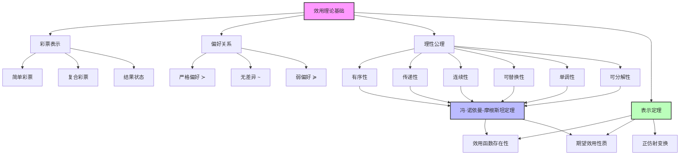
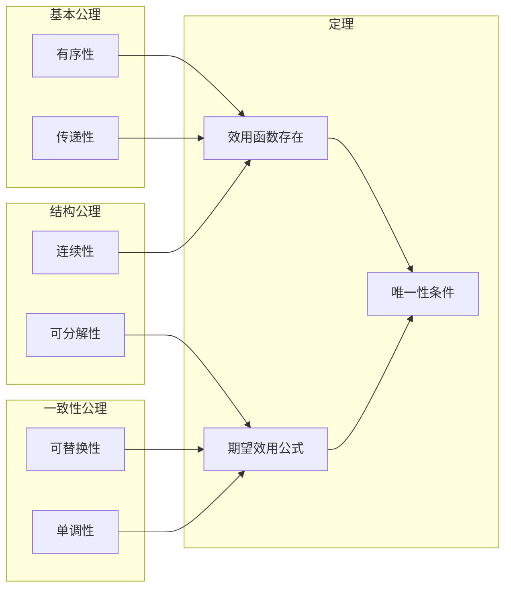

# 16.2 效用理论基础

## 一、背景与动机

### 1.1 从直觉到公理

最大期望效用（MEU）原则在直觉上似乎是合理的决策方式：面对不确定性时，考虑各种可能结果的加权平均效用，选择期望效用最高的动作。然而，直觉的合理性并不等同于理论的严谨性。我们需要回答一系列根本性问题：

- 为什么一定要最大化期望效用，而不是效用的其他函数形式？
- 最大化效用的加权立方和，或最小化最坏情况损失，是否也是理性的？
- 智能体能否仅通过表达状态间的偏好（而不进行数值赋值）来理性行动？
- 具有所需特征的效用函数是否一定存在？

这些问题的答案需要通过公理化方法来建立。公理化的目标是：从关于理性偏好的一组基本约束出发，推导出MEU原则的必然性。

### 1.2 彩票的概念

在不确定性环境下，每个动作的结果都不是确定的状态，而是一个概率分布。我们将这种概率分布称为**彩票（lottery）**。

**定义（彩票）**：一个彩票 $L$ 是一个概率分布，表示为：

$$
L = [p_1, S_1; p_2, S_2; ...; p_n, S_n]
$$

其中 $S_i$ 是可能的结果状态，$p_i$ 是对应的概率，满足 $\sum_{i=1}^n p_i = 1$。

彩票的概念是效用理论的核心抽象。它允许我们将任何不确定性决策问题转化为在彩票之间的选择问题。重要的是，彩票的结果本身也可以是彩票，形成复合彩票（compound lottery）。

### 1.3 公理化方法的意义

公理化方法在数学和哲学中具有悠久传统。欧几里得几何从五条公理出发构建整个几何体系；概率论的柯尔莫哥洛夫公理奠定了现代概率论的数学基础。

对于效用理论，公理化的意义在于：

1. **规范性基础**：证明MEU原则是理性偏好的必然结果
2. **可检验性**：通过检验公理的有效性来评估理论的适用性
3. **可扩展性**：通过修改公理来发展替代理论
4. **清晰性**：明确理性决策所依赖的基本假设

## 二、知识逻辑图谱

### 2.1 公理体系结构

## 三、核心概念与数学分析

### 3.1 偏好关系的定义

在彩票集合 $\mathcal{L}$ 上，我们定义三种基本的偏好关系：

**定义 16.3（严格偏好）**：$A \succ B$ 表示智能体偏好彩票 $A$ 甚于彩票 $B$。

**定义 16.4（无差异）**：$A \sim B$ 表示智能体对彩票 $A$ 和 $B$ 偏好相同。

**定义 16.5（弱偏好）**：$A \succcurlyeq B$ 表示智能体偏好 $A$ 甚于 $B$ 或对两者无差异。

这三种关系满足以下基本性质：
- $A \succ B \Leftrightarrow \neg(B \succcurlyeq A)$
- $A \sim B \Leftrightarrow (A \succcurlyeq B) \land (B \succcurlyeq A)$
- $A \succcurlyeq B \Leftrightarrow (A \succ B) \lor (A \sim B)$

### 3.2 六大理性公理

#### 公理 1：有序性（Orderability）

**陈述**：对于任意两种彩票 $A$ 和 $B$，以下三种情况有且仅有一种成立：

$$
(A \succ B) \lor (B \succ A) \lor (A \sim B)
$$

**解释**：理性智能体必须能够比较任意两个彩票，不能回避决策。这与概率论中的完备性公理类似。

**违反后果**：如果智能体无法比较某些彩票，在面对这些选择时将无法做出决策，这在实际中是不理性的。

#### 公理 2：传递性（Transitivity）

**陈述**：对于任意三种彩票 $A$、$B$、$C$：

$$
(A \succ B) \land (B \succ C) \Rightarrow (A \succ C)
$$

**解释**：偏好关系必须具有传递性，不能出现循环偏好。

**违反后果**：非传递性偏好可能导致"金钱泵"（money pump）现象。假设智能体具有偏好 $A \succ B \succ C \succ A$，我们可以进行如下套利：

1. 智能体拥有 $A$，我们用 $C$ 交换 $A$，智能体支付 1 美分（因为 $A \succ C$）
2. 用 $B$ 交换 $C$，智能体支付 1 美分（因为 $C \succ B$）
3. 用 $A$ 交换 $B$，智能体支付 1 美分（因为 $B \succ A$）

循环结束后，智能体回到初始状态但损失了 3 美分。这个过程可以无限重复，直到智能体破产。

#### 公理 3：连续性（Continuity）

**陈述**：如果 $A \succ B \succ C$，则存在概率 $p \in (0,1)$ 使得：

$$
[p, A; 1-p, C] \sim B
$$

**解释**：如果 $B$ 在偏好上位于 $A$ 和 $C$ 之间，那么存在一个介于 $A$ 和 $C$ 之间的彩票，使得智能体对其与 $B$ 无差异。

**数学意义**：这个公理保证了效用函数的连续性，排除了 lexicographic 偏好（字典序偏好）等不连续情况。

#### 公理 4：可替换性（Substitutability）

**陈述**：如果 $A \sim B$，则对于任意彩票 $C$ 和概率 $p$：

$$
[p, A; 1-p, C] \sim [p, B; 1-p, C]
$$

如果用 $\succ$ 替换 $\sim$，结论仍然成立。

**解释**：无差异的彩票在复合彩票中可以相互替换，而不改变整体偏好。

**重要性**：这个公理允许我们简化复合彩票的计算，是期望效用公式的关键基础。

#### 公理 5：单调性（Monotonicity）

**陈述**：假设两种彩票都有相同的可能结果 $A$ 和 $B$，且 $A \succ B$。则：

$$
p > q \Leftrightarrow [p, A; 1-p, B] \succ [q, A; 1-q, B]
$$

**解释**：当两个彩票只在概率分布上不同时，偏好更高概率获得更好结果的彩票。

**直观理解**：如果 $A$ 比 $B$ 好，那么获得 $A$ 的概率越高，彩票就越好。

#### 公理 6：可分解性（Decomposability）

**陈述**：复合彩票可以简化为等价的简单彩票：

$$
[p, A; 1-p, [q, B; 1-q, C]] \sim [p, A; (1-p)q, B; (1-p)(1-q), C]
$$

**解释**：连续的彩票可以被压缩成一个等价的单次彩票。这被称为"无趣赌博"规则。

**数学含义**：这个公理保证了概率论的基本法则在偏好推理中成立。

### 3.3 公理的合理性论证

每个公理都可以通过证明违反它的智能体会表现出明显的非理性行为来论证其合理性：

| 公理 | 违反后果 | 非理性表现 |
|------|----------|------------|
| 有序性 | 无法决策 | 面对选择时陷入瘫痪 |
| 传递性 | 金钱泵 | 可以被无限套利 |
| 连续性 | 偏好跳跃 | 对微小概率变化反应过度 |
| 可替换性 | 偏好不一致 | 同一彩票的不同表示导致不同选择 |
| 单调性 | 概率混淆 | 偏好更低概率获得更好结果 |
| 可分解性 | 复合偏好异常 | 对多阶段彩票评估错误 |

## 四、定理与证明

### 4.1 冯·诺依曼-摩根斯坦效用定理

**定理 16.5（冯·诺依曼-摩根斯坦，1944）**：如果一个智能体的偏好关系满足上述六条公理，则：

**（1）效用函数存在性**：存在一个函数 $U: \mathcal{L} \rightarrow \mathbb{R}$，使得：

$$
U(A) > U(B) \Leftrightarrow A \succ B \quad \text{且} \quad U(A) = U(B) \Leftrightarrow A \sim B
$$

**（2）期望效用性质**：对于任何彩票 $L = [p_1, S_1; ...; p_n, S_n]$：

$$
U(L) = \sum_{i=1}^n p_i U(S_i)
$$

**证明概要**：

**步骤 1：构造标准彩票**

设 $S^*$ 是最佳结果，$S_*$ 是最差结果。对于任意结果 $S$，由连续性公理，存在唯一的 $p$ 使得：

$$
S \sim [p, S^*; 1-p, S_*]
$$

定义 $U(S) = p$。

**步骤 2：证明效用表示偏好**

由单调性公理，$U(A) > U(B) \Leftrightarrow A \succ B$。

**步骤 3：证明期望效用公式**

对于彩票 $L = [p_1, S_1; ...; p_n, S_n]$，反复应用可替换性公理：

$$
\begin{aligned}
L &= [p_1, S_1; 1-p_1, [p_2/(1-p_1), S_2; ...]] \\
&\sim [p_1, [U(S_1), S^*; 1-U(S_1), S_*]; 1-p_1, [...]] \\
&= [\sum p_i U(S_i), S^*; 1-\sum p_i U(S_i), S_*]
\end{aligned}
$$

因此 $U(L) = \sum p_i U(S_i)$。

### 4.2 效用函数的唯一性

**定理 16.6（正仿射变换唯一性）**：如果 $U$ 是表示某偏好的效用函数，则 $U' = aU + b$（其中 $a > 0$）也是表示同一偏好的效用函数，且只有这种形式的变换保持偏好不变。

**证明**：

**充分性**：设 $U' = aU + b$，$a > 0$。

$$
U'(A) > U'(B) \Leftrightarrow aU(A) + b > aU(B) + b \Leftrightarrow U(A) > U(B) \Leftrightarrow A \succ B
$$

**必要性**：假设 $U$ 和 $V$ 都表示同一偏好。对于任意 $A, B$：

$$
U(A) > U(B) \Leftrightarrow V(A) > V(B)
$$

这意味着 $U$ 和 $V$ 保持相同的顺序关系，因此存在严格单调函数 $f$ 使得 $V = f(U)$。

由期望效用性质，对于彩票 $[p, A; 1-p, B]$：

$$
V([p, A; 1-p, B]) = pV(A) + (1-p)V(B)
$$

$$
f(pU(A) + (1-p)U(B)) = pf(U(A)) + (1-p)f(U(B))
$$

这表明 $f$ 是仿射函数：$f(x) = ax + b$。

### 4.3 序数效用与基数效用

**定义 16.6（序数效用）**：只要求保持偏好顺序的效用函数，即 $U(A) > U(B) \Leftrightarrow A \succ B$。

**定义 16.7（基数效用）**：不仅保持顺序，还要求满足期望效用公式的效用函数。

**定理 16.7**：在确定性环境中，序数效用足以支持决策；在不确定性环境中，需要基数效用才能计算期望效用。

**说明**：在确定性环境中，智能体只需要对状态进行偏好排序，任何保持顺序的数值赋值都等价。但在不确定性环境中，效用值的相对大小影响期望效用计算，因此需要基数效用。

## 五、具体示例

### 5.1 彩票偏好的公理检验

**场景**：考虑以下三种彩票：
- $A$：确定获得 100 美元
- $B$：50% 概率获得 200 美元，50% 概率获得 0 美元
- $C$：确定获得 50 美元

**检验有序性**：智能体应该能够比较任意两个彩票。例如，大多数人会偏好 $A \succ C$。

**检验传递性**：假设 $A \succ B$（风险厌恶）且 $B \succ C$，则必须有 $A \succ C$。

**检验连续性**：找到 $p$ 使得 $[p, A; 1-p, C] \sim B$。对于风险厌恶者，$p < 0.5$。

### 5.2 复合彩票的简化

**场景**：考虑一个两阶段彩票：
- 第一阶段：60% 概率进入第二阶段，40% 概率获得 100 美元
- 第二阶段：30% 概率获得 500 美元，70% 概率获得 0 美元

**复合形式**：$L = [0.4, 100; 0.6, [0.3, 500; 0.7, 0]]$

**简化计算**：

由可分解性公理：

$$
L \sim [0.4, 100; 0.6 \times 0.3, 500; 0.6 \times 0.7, 0]
$$

$$
= [0.4, 100; 0.18, 500; 0.42, 0]
$$

**期望效用计算**：

假设 $U(0) = 0$，$U(100) = 10$，$U(500) = 40$：

$$
U(L) = 0.4 \times 10 + 0.18 \times 40 + 0.42 \times 0 = 4 + 7.2 = 11.2
$$

### 5.3 效用函数的构造

**场景**：确定对三种度假选择的偏好：
- $S_1$：海滩度假
- $S_2$：山地徒步
- $S_3$：城市观光

假设偏好：$S_1 \succ S_2 \succ S_3$

**构造步骤**：

1. 设 $U(S_1) = 1$，$U(S_3) = 0$
2. 通过连续性公理，找到 $p$ 使得 $S_2 \sim [p, S_1; 1-p, S_3]$
3. 假设 $p = 0.6$，则 $U(S_2) = 0.6$

**验证单调性**：

考虑彩票 $L_1 = [0.7, S_1; 0.3, S_3]$ 和 $L_2 = [0.5, S_1; 0.5, S_3]$。

由于 $0.7 > 0.5$，单调性要求 $L_1 \succ L_2$。

计算期望效用：
- $U(L_1) = 0.7 \times 1 + 0.3 \times 0 = 0.7$
- $U(L_2) = 0.5 \times 1 + 0.5 \times 0 = 0.5$

确实 $U(L_1) > U(L_2)$，验证了单调性。

### 5.4 正仿射变换示例

**原始效用函数**：

| 结果 | $U$ |
|------|-----|
| $S_1$ | 100 |
| $S_2$ | 50  |
| $S_3$ | 0   |

**变换 1**：$U' = 0.01U$（缩放）

| 结果 | $U'$ |
|------|------|
| $S_1$ | 1.0  |
| $S_2$ | 0.5  |
| $S_3$ | 0    |

**变换 2**：$U'' = 2U + 10$（缩放+平移）

| 结果 | $U''$ |
|------|-------|
| $S_1$ | 210   |
| $S_2$ | 110   |
| $S_3$ | 10    |

**验证等价性**：

对于彩票 $L = [0.5, S_1; 0.5, S_3]$：

$$
U(L) = 0.5 \times 100 + 0.5 \times 0 = 50
$$

$$
U'(L) = 0.5 \times 1 + 0.5 \times 0 = 0.5 = 0.01 \times 50
$$

$$
U''(L) = 0.5 \times 210 + 0.5 \times 10 = 110 = 2 \times 50 + 10
$$

所有变换都保持偏好顺序：$S_1 \succ S_2 \succ S_3$。

## 六、一句话本质

**冯·诺依曼-摩根斯坦效用定理证明了：任何满足六大理性公理的偏好关系，都可以被表示为期望效用最大化；反之，遵循期望效用最大化的智能体必然满足这些理性公理。**

## 七、总结与反思

### 7.1 核心要点回顾

1. **六大公理**：有序性、传递性、连续性、可替换性、单调性、可分解性构成了理性偏好的完整刻画
2. **表示定理**：满足公理的偏好可以用效用函数表示，且彩票效用等于期望效用
3. **唯一性**：效用函数在正仿射变换下唯一
4. **规范性基础**：MEU原则不是随意的选择，而是理性决策的必然结果

### 7.2 公理的实证检验

尽管理论上公理定义了理性偏好，但实证研究发现人类决策常常违反这些公理：

- **传递性违反**：Allais悖论、Ellsberg悖论
- **连续性违反**：对确定性结果的过度偏好
- **可分解性违反**：框架效应、心理账户

这些发现引发了关于规范性理论与描述性理论的深刻讨论。

### 7.3 理论的扩展与替代

基于对公理的反思，研究者发展了多种替代理论：

1. **前景理论（Prospect Theory）**：放松传递性和线性概率权重
2. **遗憾理论（Regret Theory）**：考虑反事实结果的影响
3. **秩依效用（Rank-Dependent Utility）**：对概率进行非线性变换

这些理论在描述人类行为方面更准确，但牺牲了理论的简洁性和规范性力量。

### 7.4 对AI设计的启示

1. **理性设计**：如果AI系统需要做出符合人类期望的决策，应该遵循MEU原则
2. **偏好获取**：通过检验公理来验证人类偏好的理性程度
3. **不确定性处理**：在概率模型基础上构建效用模型
4. **可解释性**：基于公理的决策更容易向人类解释

### 7.5 与其他章节的关系

- **16.1节**：为MEU原则提供了公理化基础
- **16.3节**：探讨如何实际确定效用函数
- **16.7节**：讨论当偏好不确定时的处理方式
- **第18章**：扩展到多智能体博弈场景

### 7.6 深入思考

1. **公理的规范性力量**：公理是理性的定义，还是理性的约束？如果人类系统性地违反某些公理，我们应该修改公理还是认为人类非理性？

2. **复合彩票的评估**：可分解性公理假设智能体能正确计算复合概率，但认知心理学研究表明人类在这方面表现不佳。这对AI设计有何启示？

3. **效用的人际比较**：正仿射变换的唯一性意味着效用的人际比较存在问题。如何在社会选择中进行公平决策？

这些问题挑战着决策论的基础，也是当前研究的前沿领域。
