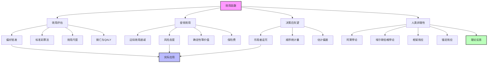
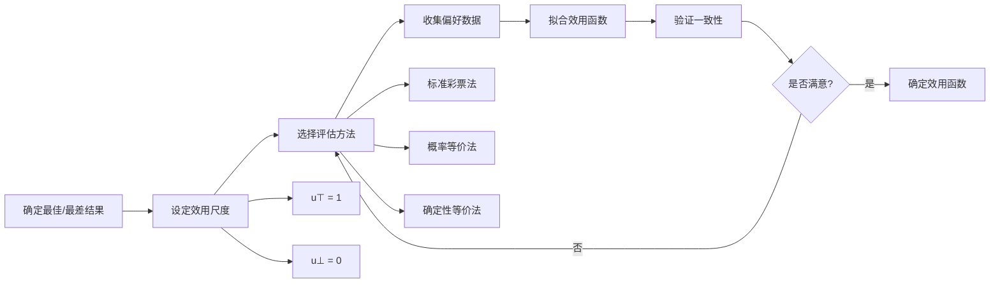

# 16.3 效用函数

## 一、背景与动机

### 1.1 从公理到实践

冯·诺依曼-摩根斯坦定理确立了效用函数的存在性，但存在性本身并不告诉我们如何构造或估计效用函数。在实际应用中，我们需要面对一系列具体问题：

- 如何确定特定结果的效用值？
- 效用函数应该采用什么形式？
- 如何处理效用的人际比较？
- 人类真实的效用函数是什么样的？

这些问题构成了效用评估（utility assessment）领域的核心内容。

### 1.2 效用的尺度问题

效用函数在正仿射变换下唯一，这意味着效用没有绝对的零点或单位。这种"区间尺度"（interval scale）性质类似于温度：摄氏度和华氏度表示相同的物理状态，只是零点和平移不同。

这种尺度特性带来两个重要问题：
1. **效用比较**：不同个体的效用函数是否可以比较？
2. **效用聚合**：如何在群体决策中综合多个个体的效用？

### 1.3 金钱与效用的关系

经济学中一个核心问题是金钱与效用的关系。虽然货币提供了商品和服务的普遍交换媒介，但金钱本身并不是效用。关键问题在于：

- 金钱的边际效用是否递减？
- 风险态度如何体现在效用函数中？
- 如何量化生命、健康等非市场商品的效用？

这些问题的答案对公共政策、医疗决策、风险管理等领域具有深远影响。

## 二、知识逻辑图谱

### 2.1 效用评估流程

## 三、核心概念与数学分析

### 3.1 效用尺度与标准化

**定义 16.8（效用尺度）**：效用尺度通过指定两个参考点的效用来确定。通常设：
- $u_{\top} = U(S_{\text{best}})$：最佳可能结果的效用
- $u_{\perp} = U(S_{\text{worst}})$：最坏可能结果的效用

**标准化效用**：当 $u_{\perp} = 0$ 且 $u_{\top} = 1$ 时，称为归一化效用。

**定理 16.8（效用尺度变换）**：设 $U$ 是一个效用函数，$u_{\top}$ 和 $u_{\perp}$ 是任意两个参考点。则标准化效用为：

$$
U_{\text{norm}}(S) = \frac{U(S) - u_{\perp}}{u_{\top} - u_{\perp}}
$$

**证明**：

对于 $S = S_{\text{best}}$：

$$
U_{\text{norm}}(S_{\text{best}}) = \frac{u_{\top} - u_{\perp}}{u_{\top} - u_{\perp}} = 1
$$

对于 $S = S_{\text{worst}}$：

$$
U_{\text{norm}}(S_{\text{worst}}) = \frac{u_{\perp} - u_{\perp}}{u_{\top} - u_{\perp}} = 0
$$

### 3.2 标准彩票评估法

**方法描述**：要评估结果 $S$ 的效用，找到概率 $p$ 使得：

$$
S \sim [p, S_{\text{best}}; 1-p, S_{\text{worst}}]
$$

则 $U(S) = p$（在归一化尺度下）。

**数学原理**：由期望效用公式：

$$
U(S) = p \cdot U(S_{\text{best}}) + (1-p) \cdot U(S_{\text{worst}}) = p \cdot 1 + (1-p) \cdot 0 = p
$$

**实施步骤**：

1. 确定最佳和最差参考结果
2. 对于待评估结果 $S$，构造标准彩票 $[p, S_{\text{best}}; 1-p, S_{\text{worst}}]$
3. 调整 $p$ 直到决策者对 $S$ 和标准彩票无差异
4. 记录此时的 $p$ 值作为 $U(S)$

### 3.3 金钱的效用函数

#### 3.3.1 对数效用模型

**伯努利假设**：格雷森（Grayson, 1960）的研究发现，金钱的效用近似与金额的对数成正比。

$$
U(S_{k+n}) = a \log(n + c) + b
$$

其中 $k$ 是当前财富，$n$ 是收益/损失，$c$ 是调整常数。

**具体示例**：Beard先生的效用曲线（财富范围 $n \in [-150000, 800000]$）：

$$
U(S_{k+n}) = -263.31 + 22.09 \log(n + 150000)
$$

#### 3.3.2 风险态度的数学刻画

**定义 16.9（风险态度）**：设 $L$ 是一个彩票，$EMV(L)$ 是其期望货币价值。

- **风险厌恶**：$U(L) < U(S_{EMV(L)})$，即偏好确定性等价物甚于彩票
- **风险中性**：$U(L) = U(S_{EMV(L)})$，即只关心期望货币价值
- **风险寻求**：$U(L) > U(S_{EMV(L)})$，即偏好彩票甚于确定性等价物

**定理 16.9（风险态度与效用函数形状）**：

- 风险厌恶 $\Leftrightarrow$ 效用函数是凹函数（$U''(x) < 0$）
- 风险中性 $\Leftrightarrow$ 效用函数是线性函数（$U''(x) = 0$）
- 风险寻求 $\Leftrightarrow$ 效用函数是凸函数（$U''(x) > 0$）

**证明（风险厌恶 $\Rightarrow$ 凹函数）**：

由Jensen不等式，对于凹函数 $U$：

$$
U(E[X]) \geq E[U(X)]
$$

即 $U(S_{EMV}) \geq U(L)$，这正是风险厌恶的定义。

#### 3.3.3 确定性等价值与保险费

**定义 16.10（确定性等价值，CE）**：彩票 $L$ 的确定性等价值是满足以下条件的金额：

$$
U(S_{CE}) = U(L)
$$

即 $CE = U^{-1}(E[U(X)])$。

**定义 16.11（保险费）**：彩票的保险费是其期望货币价值与确定性等价值之差：

$$
\pi = EMV(L) - CE
$$

对于风险厌恶者，$\pi > 0$。

**示例**：考虑彩票 $L = [0.5, 1000; 0.5, 0]$。

- $EMV(L) = 0.5 \times 1000 + 0.5 \times 0 = 500$
- 研究表明，大多数人愿意接受约 $400 而非参与赌博
- 因此 $CE \approx 400$
- 保险费 $\pi = 500 - 400 = 100$

### 3.4 生命的价值量化

#### 3.4.1 微亡（Micromort）

**定义**：1微亡 = 百万分之一的死亡概率。

**价值估计**：

- 英国汽车行驶数据：每370公里产生1微亡风险
- 汽车寿命148,060公里 $\Rightarrow$ 总风险400微亡
- 人们愿意为安全性提高一倍多支付12,000美元
- 因此每微亡价值约 $60

**政府估值**：美国交通部在道路维修上每挽救一个生命花费约6美元/微亡。

#### 3.4.2 QALY（质量调整寿命年）

**定义**：QALY是将生命长度与生命质量结合的度量。

**计算方法**：

$$
\text{QALY} = \text{寿命年} \times \text{生活质量权重}
$$

生活质量权重通常在0（死亡）到1（完全健康）之间。

**示例**：肾脏病患者在以下两者间无差异：
- 2年透析（生活质量权重0.5）
- 1年完全健康（生活质量权重1.0）

两者都产生1个QALY。

## 四、定理与证明

### 4.1 期望效用的顺序统计量分析

**问题设置**：假设有 $k$ 个选项，每个选项的真实效用为0，但效用估计有独立误差，服从标准正态分布 $N(0, 1)$。

**定理 16.10（最大值的分布）**：设 $X_1, ..., X_k \sim N(0, 1)$ 独立同分布，$X^* = \max\{X_1, ..., X_k\}$。则 $X^*$ 的累积分布函数为：

$$
F_{X^*}(x) = [\Phi(x)]^k
$$

其中 $\Phi$ 是标准正态分布的CDF。

**证明**：

$$
\begin{aligned}
P(X^* \leq x) &= P(\max\{X_1, ..., X_k\} \leq x) \\
&= P(X_1 \leq x, ..., X_k \leq x) \\
&= P(X_1 \leq x) \cdots P(X_k \leq x) \\
&= [\Phi(x)]^k
\end{aligned}
$$

**概率密度函数**：

$$
f_{X^*}(x) = \frac{d}{dx}[\Phi(x)]^k = k \phi(x) [\Phi(x)]^{k-1}
$$

其中 $\phi$ 是标准正态分布的PDF。

**期望偏差**：

对于 $k = 3$，$E[X^*] \approx 0.85$
对于 $k = 10$，$E[X^*] \approx 1.54$
对于 $k = 30$，$E[X^*] \approx 2.04$

这表明随着选项数量增加，选择最优选项时的期望效用估计偏差越来越大。

### 4.2 乐观者诅咒的数学形式化

**定理 16.11（乐观者诅咒）**：设 $\widehat{EU}(a)$ 是对动作 $a$ 真实期望效用 $EU(a)$ 的无偏估计，即 $E[\widehat{EU}(a) - EU(a)] = 0$。则：

$$
E\left[\widehat{EU}(a^*) - EU(a^*)\right] > 0
$$

其中 $a^* = \arg\max_a \widehat{EU}(a)$。

**证明概要**：

$$
\begin{aligned}
E[\widehat{EU}(a^*)] &= E\left[\max_a \widehat{EU}(a)\right] \\
&\geq \max_a E[\widehat{EU}(a)] \\
&= \max_a EU(a) \\
&= EU(a^{\text{true}})
\end{aligned}
$$

其中 $a^{\text{true}} = \arg\max_a EU(a)$ 是真实最优动作。

由于 $a^*$ 可能不等于 $a^{\text{true}}$，且 $E[\widehat{EU}(a^*)] \geq EU(a^{\text{true}}) \geq EU(a^*)$，我们有：

$$
E[\widehat{EU}(a^*) - EU(a^*)] \geq 0
$$

严格不等式在估计误差独立且分布连续时成立。

### 4.3 贝叶斯校正

**定理 16.12（贝叶斯校正）**：设先验分布为 $P(EU)$，似然为 $P(\widehat{EU} | EU)$。则给定观测 $\widehat{EU}$ 后，后验期望为：

$$
E[EU | \widehat{EU}] = \frac{\int EU \cdot P(\widehat{EU} | EU) \cdot P(EU) \, dEU}{\int P(\widehat{EU} | EU) \cdot P(EU) \, dEU}
$$

**性质**：如果先验 $P(EU)$ 是真实效用的合理分布，贝叶斯估计可以消除乐观者诅咒。

## 五、具体示例

### 5.1 游戏节目决策

**场景**：你在游戏节目中赢得100万美元，主持人提供以下选择：
- 确定获得100万美元
- 抛硬币：正面获得0，反面获得250万美元

**分析**：

设当前财富为 $k$，效用函数为 $U$。

$$
EU(\text{接受}) = \frac{1}{2}U(S_k) + \frac{1}{2}U(S_{k+2500000})
$$

$$
EU(\text{拒绝}) = U(S_{k+1000000})
$$

**数值示例**：

假设效用值：
- $U(S_k) = 5$
- $U(S_{k+1000000}) = 8$
- $U(S_{k+2500000}) = 9$

则：

$$
EU(\text{接受}) = \frac{1}{2} \times 5 + \frac{1}{2} \times 9 = 7
$$

$$
EU(\text{拒绝}) = 8
$$

由于 $8 > 7$，理性选择是拒绝赌博。

**风险态度分析**：

期望货币价值：$EMV = 0.5 \times 0 + 0.5 \times 2500000 = 1250000 > 1000000$

但确定性等价值 $CE < 1000000$，表明风险厌恶。

### 5.2 保险决策

**场景**：房屋价值20万美元，火灾概率1%。保险公司提供全额保险，保费3000美元。

**分析**：

设房主财富为 $W$，效用函数为 $U$。

**不投保的期望效用**：

$$
EU(\text{不投保}) = 0.99 \cdot U(W) + 0.01 \cdot U(W - 200000)
$$

**投保的效用**：

$$
U(\text{投保}) = U(W - 3000)
$$

**数值示例**：

设 $W = 500000$，对数效用 $U(x) = \ln(x)$。

$$
EU(\text{不投保}) = 0.99 \cdot \ln(500000) + 0.01 \cdot \ln(300000) \approx 13.119
$$

$$
U(\text{投保}) = \ln(497000) \approx 13.116
$$

在这种情况下，不投保的期望效用略高。但如果风险厌恶程度更高，或火灾损失更大，投保可能更优。

### 5.3 阿莱悖论分析

**场景**：在以下彩票对中选择：

**选择1**：
- $A$：80%概率获得4000美元
- $B$：100%概率获得3000美元

**选择2**：
- $C$：20%概率获得4000美元
- $D$：25%概率获得3000美元

**实证发现**：大多数人偏好 $B \succ A$ 且 $C \succ D$。

**规范性分析**：

设 $U(0) = 0$。

$B \succ A$ 意味着：

$$
U(3000) > 0.8 \cdot U(4000)
$$

$C \succ D$ 意味着：

$$
0.2 \cdot U(4000) > 0.25 \cdot U(3000)
$$

$$
U(4000) > 1.25 \cdot U(3000)
$$

结合两个不等式：

$$
U(3000) > 0.8 \cdot U(4000) > 0.8 \cdot 1.25 \cdot U(3000) = U(3000)
$$

矛盾！因此不存在与这些选择一致的效用函数。

**解释**：确定性效应（Certainty Effect）——人们对确定性收益有过度偏好。

### 5.4 埃尔斯伯格悖论

**场景**：瓮中有1/3红球，2/3黑球或黄球（比例未知）。

**选择1**：
- $A$：选中红球获得100
- $B$：选中黑球获得100

**选择2**：
- $C$：选中红球或黄球获得100
- $D$：选中黑球或黄球获得100

**实证发现**：大多数人偏好 $A \succ B$ 且 $D \succ C$。

**分析**：

设 $P(\text{红}) = 1/3$，$P(\text{黑}) = p$，$P(\text{黄}) = 2/3 - p$，其中 $p \in [0, 2/3]$。

$A \succ B$ 暗示 $P(\text{红}) > P(\text{黑})$，即 $1/3 > p$。

$D \succ C$ 暗示 $P(\text{黑}) + P(\text{黄}) > P(\text{红}) + P(\text{黄})$，即 $p > 1/3$。

矛盾！这反映了模糊厌恶（Ambiguity Aversion）——人们偏好已知概率而非未知概率。

## 六、一句话本质

**效用函数将主观偏好转化为可计算的数值，其形状刻画了风险态度，而其评估和应用揭示了人类决策中理性与偏差的复杂交织。**

## 七、总结与反思

### 7.1 核心要点回顾

1. **效用评估**：标准彩票法、概率等价法、确定性等价法提供了系统的效用测量方法
2. **金钱效用**：对数效用模型解释了边际效用递减和风险厌恶
3. **生命价值**：微亡和QALY提供了量化生命和健康效用的实用工具
4. **乐观者诅咒**：选择最优选项时的估计偏差及其贝叶斯校正
5. **人类非理性**：阿莱悖论、埃尔斯伯格悖论等挑战期望效用理论

### 7.2 理论争议

**规范性 vs 描述性**：
- 规范性理论：描述理性智能体"应该"如何决策
- 描述性理论：描述人类实际如何决策

期望效用理论在规范性上优雅，但在描述性上存在缺陷。这种张力引发了两种回应：
1. 坚持规范性，认为人类偏差是认知局限
2. 发展替代理论（如前景理论）来更好地描述人类行为

### 7.3 实践应用

**决策分析**：
- 医疗：治疗方案选择、药物评估
- 环境：政策成本效益分析
- 安全：风险管理和保险定价

**AI设计**：
- 偏好学习：从人类行为推断效用函数
- 对齐问题：确保AI系统优化正确的目标
- 可解释性：基于效用的决策更容易解释

### 7.4 与其他章节的关系

- **16.2节**：为效用函数提供了公理化基础
- **16.4节**：扩展到多属性效用
- **16.6节**：信息价值理论帮助确定需要评估哪些效用参数
- **16.7节**：处理效用函数本身的不确定性

### 7.5 深入思考

1. **效用的可测量性**：效用函数是否真实存在，还是仅仅是描述偏好的数学工具？这种本体论问题对AI设计有何影响？

2. **人际效用比较**：如果效用只在正仿射变换下唯一，如何在社会决策中比较不同个体的效用？这是福利经济学的核心难题。

3. **动态一致性**：人类的时间偏好往往表现出动态不一致性（如贴现率随时间变化）。如何设计具有时间一致性的AI系统？

4. **框架效应的应对**：如果同一决策问题的不同表述导致不同选择，AI系统应该如何呈现决策信息？

这些问题挑战着决策论的基础，也是当前AI伦理和安全研究的前沿领域。
