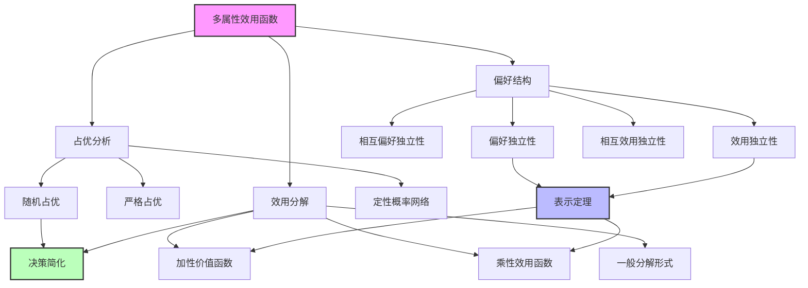
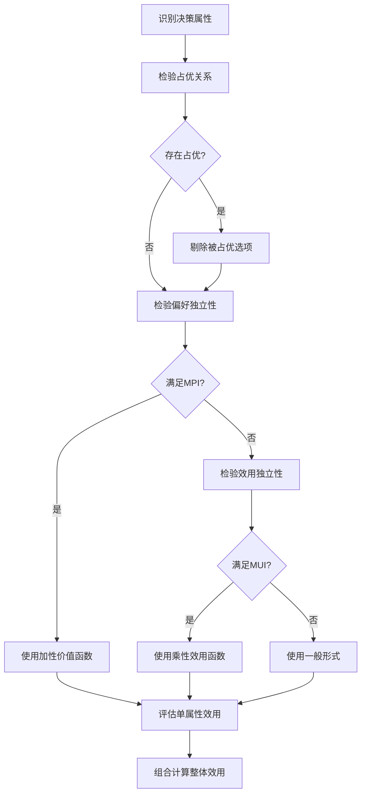

# 16.4 多属性效用函数

## 一、背景与动机

### 1.1 多属性决策的普遍性

现实世界中的决策很少只涉及单一维度。考虑以下场景：

- **医疗决策**：治疗方案的选择需要权衡疗效、副作用、成本、生活质量等多个属性
- **公共政策**：环境法规的制定需要平衡经济效益、公共健康、生态影响、社会公平等
- **工程设计**：产品设计的优化需要考虑性能、成本、可靠性、可维护性等
- **个人选择**：职业选择涉及薪酬、工作满意度、地理位置、发展前景等

这些决策的共同特点是：结果由多个属性共同刻画，而决策者需要在这些属性之间进行权衡。

### 1.2 比较苹果与桔子的困境

多属性决策面临的核心挑战是"比较苹果与桔子"的问题：

- 如何比较"节省1000美元"与"减少10%的死亡风险"？
- 如何权衡"增加航班频次"与"降低噪音污染"？
- 如何在"高薪但高压"与"低薪但轻松"的工作之间选择？

传统的单属性效用理论无法直接处理这些问题。多属性效用理论（Multiattribute Utility Theory, MAUT）正是为解决这类问题而发展的。

### 1.3 维度灾难与结构化方法

假设一个决策问题有 $n$ 个属性，每个属性有 $d$ 个可能取值。完整的效用函数需要指定 $d^n$ 个值，这在实际中是不可行的。

多属性效用理论通过识别偏好中的结构来降低复杂度：
- 偏好独立性：某些属性之间的权衡不依赖于其他属性
- 效用独立性：彩票偏好独立于其他属性的取值
- 加性分解：整体效用可以表示为单属性效用的简单函数

这些结构使得我们可以用 $O(nd)$ 个参数而非 $O(d^n)$ 个参数来刻画效用函数。

## 二、知识逻辑图谱

### 2.1 多属性决策流程

## 三、核心概念与数学分析

### 3.1 多属性决策的形式化

**定义 16.12（多属性决策问题）**：一个多属性决策问题是一个五元组 $\langle X, A, P, U, n \rangle$，其中：
- $X = \{X_1, ..., X_n\}$ 是属性集合
- $A$ 是可用动作的集合
- $P$ 是结果的概率分布
- $U: X_1 \times ... \times X_n \rightarrow \mathbb{R}$ 是多属性效用函数
- $n$ 是属性数量

**属性向量**：一个完整的赋值向量表示为 $\mathbf{x} = \langle x_1, ..., x_n \rangle$，其中 $x_i$ 是属性 $X_i$ 的取值。

**单调性假设**：为使分析简化，我们通常假设效用关于每个属性单调递增。这意味着：
- 对于"成本"类属性，使用负值（如 $-成本$）
- 对于"死亡"类属性，使用负值（如 $-死亡人数$）
- 对于"温度"等非单调属性，分解为两个单调属性（如"温暖度"和"凉爽度"）

### 3.2 占优分析

#### 3.2.1 严格占优

**定义 16.13（严格占优）**：选项 $A_1$ 在确定性情况下严格占优于选项 $A_2$，如果：

$$
\forall i: x_i^{(1)} \geq x_i^{(2)} \quad \text{且} \quad \exists j: x_j^{(1)} > x_j^{(2)}
$$

其中 $\mathbf{x}^{(1)}$ 和 $\mathbf{x}^{(2)}$ 分别是 $A_1$ 和 $A_2$ 的属性向量。

**性质**：被严格占优的选项可以被安全剔除，无需知道具体的效用函数。

#### 3.2.2 随机占优

**定义 16.14（一阶随机占优）**：设 $A_1$ 和 $A_2$ 导致属性 $X$ 的累积分布分别为 $F_1(x)$ 和 $F_2(x)$。称 $A_1$ 在 $X$ 上一阶随机占优于 $A_2$，如果：

$$
\forall x: F_1(x) \leq F_2(x) \quad \text{且} \quad \exists x_0: F_1(x_0) < F_2(x_0)
$$

**定理 16.13（随机占优与期望效用）**：如果 $A_1$ 在 $X$ 上一阶随机占优于 $A_2$，则对于任意单调不减的效用函数 $U(x)$：

$$
E[U(X) | A_1] \geq E[U(X) | A_2]
$$

**证明**：

对于连续情况：

$$
E[U(X)] = \int_{-\infty}^{+\infty} U(x) f(x) dx
$$

通过分部积分：

$$
E[U(X)] = U(x)F(x)\big|_{-\infty}^{+\infty} - \int_{-\infty}^{+\infty} F(x) U'(x) dx
$$

假设 $U$ 有界且 $F(\pm\infty)$ 适当，第一项为0。因此：

$$
E[U(X)] = -\int_{-\infty}^{+\infty} F(x) U'(x) dx
$$

由于 $U'(x) \geq 0$（单调不减）且 $F_1(x) \leq F_2(x)$：

$$
-\int F_1(x) U'(x) dx \geq -\int F_2(x) U'(x) dx
$$

即 $E[U(X) | A_1] \geq E[U(X) | A_2]$。

**几何解释**：随机占优意味着 $A_1$ 的累积分布曲线始终在 $A_2$ 的右侧，表明 $A_1$ 产生更好结果的概率更高。

### 3.3 偏好独立性

#### 3.3.1 基本定义

**定义 16.15（偏好独立性）**：属性子集 $Y \subset X$ 偏好独立于其补集 $Z = X \setminus Y$，如果对于任意 $y_1, y_2 \in Y$ 和 $z, z' \in Z$：

$$
(y_1, z) \succ (y_2, z) \Leftrightarrow (y_1, z') \succ (y_2, z')
$$

**解释**：$Y$ 中属性之间的权衡不依赖于 $Z$ 中属性的取值。

**定义 16.16（相互偏好独立性，MPI）**：属性集合 $X$ 满足相互偏好独立性，如果 $X$ 的每个子集都偏好独立于其补集。

#### 3.3.2 加性价值函数

**定理 16.14（Debreu, 1960）**：如果属性 $X_1, ..., X_n$ 满足相互偏好独立性，则存在价值函数：

$$
V(x_1, ..., x_n) = \sum_{i=1}^n V_i(x_i)
$$

其中每个 $V_i$ 只依赖于 $X_i$。

**意义**：MPI允许我们将 $n$ 维价值评估分解为 $n$ 个一维评估，极大地简化了偏好获取。

**示例**：机场选址问题

属性：Quietness（安静度）、Frugality（节俭度）、Safety（安全性）

假设MPI成立，价值函数可以表示为：

$$
V(\text{quietness}, \text{frugality}, \text{safety}) = \text{quietness} \times 10^4 + \text{frugality} + \text{safety} \times 10^{12}
$$

这里权重反映了各属性的相对重要性。

### 3.4 效用独立性

#### 3.4.1 从确定性到不确定性

偏好独立性适用于确定性情况。当存在不确定性时，需要更强的条件。

**定义 16.17（效用独立性）**：属性子集 $Y$ 效用独立于其补集 $Z$，如果对于任意 $y_1, y_2$ 表示的 $Y$ 上的彩票，偏好关系不依赖于 $Z$ 的特定取值：

$$
[y_1, p; y_2, 1-p] \succ [y_3, q; y_4, 1-q] \text{ 对 } z \Leftrightarrow \text{ 对 } z'
$$

**定义 16.18（相互效用独立性，MUI）**：属性集合 $X$ 满足相互效用独立性，如果 $X$ 的每个子集都效用独立于其补集。

#### 3.4.2 乘性效用函数

**定理 16.15（Keeney, 1974）**：如果属性满足相互效用独立性，则效用函数可以表示为乘性形式。

对于3个属性，乘性效用函数为：

$$
\begin{aligned}
U = & k_1 U_1 + k_2 U_2 + k_3 U_3 + k_1 k_2 U_1 U_2 + k_2 k_3 U_2 U_3 + k_3 k_1 U_3 U_1 \\
& + k_1 k_2 k_3 U_1 U_2 U_3
\end{aligned}
$$

其中 $U_i = U_i(x_i)$ 是归一化的单属性效用函数，$k_i$ 是缩放常数。

**一般形式**：对于 $n$ 个属性：

$$
1 + kU = \prod_{i=1}^n (1 + k k_i U_i)
$$

其中 $k$ 是满足 $\prod(1 + k k_i) = 1 + k$ 的常数。

**特殊情况**：
- 当 $k = 0$ 时，乘性形式退化为加性形式
- 当 $k > 0$ 时，属性之间是互补的
- 当 $k < 0$ 时，属性之间是可替代的

### 3.5 一般表示定理

**定理 16.16（多属性效用表示）**：设 $X = \{X_1, ..., X_n\}$ 是属性集合。如果偏好关系满足适当的独立性条件，则存在表示定理：

$$
U(x_1, ..., x_n) = F[f_1(x_1), ..., f_n(x_n)]
$$

其中 $F$ 是组合函数，$f_i$ 是单属性函数。

**不同独立性条件对应的 $F$ 形式**：

| 独立性条件 | $F$ 的形式 | 参数数量 |
|-----------|-----------|---------|
| 偏好独立性 | 加性：$\sum f_i$ | $n$ |
| 效用独立性 | 乘性：$\prod (1 + k k_i f_i)$ | $2n$ |
| 一般情况 | 任意函数 | $d^n$ |

## 四、定理与证明

### 4.1 随机占优的期望效用不等式

**定理 16.17（随机占优的充分性）**：设 $F_1$ 和 $F_2$ 是两个累积分布函数。如果 $F_1$ 一阶随机占优于 $F_2$，则对于任意单调不减的效用函数 $U$：

$$
\int U(x) dF_1(x) \geq \int U(x) dF_2(x)
$$

**详细证明**：

使用变量替换 $y = F(x)$，则 $dy = f(x)dx$。

对于 $F_1$：

$$
\int_{-\infty}^{+\infty} U(x) f_1(x) dx = \int_0^1 U(F_1^{-1}(y)) dy
$$

对于 $F_2$：

$$
\int_{-\infty}^{+\infty} U(x) f_2(x) dx = \int_0^1 U(F_2^{-1}(y)) dy
$$

由于 $F_1(x) \leq F_2(x)$ 对所有 $x$ 成立，我们有 $F_1^{-1}(y) \geq F_2^{-1}(y)$ 对所有 $y \in [0,1]$ 成立。

由于 $U$ 单调不减，$U(F_1^{-1}(y)) \geq U(F_2^{-1}(y))$。

因此：

$$
\int_0^1 U(F_1^{-1}(y)) dy \geq \int_0^1 U(F_2^{-1}(y)) dy
$$

### 4.2 加性价值函数的存在性

**定理 16.18（加性分解的充分必要条件）**：价值函数 $V$ 可以表示为加性形式 $V = \sum V_i$ 当且仅当偏好满足相互偏好独立性。

**证明概要**：

**必要性**：假设 $V = \sum V_i$。对于任意子集 $Y \subset X$：

$$
V(y_1, z) - V(y_2, z) = \sum_{i \in Y} [V_i(y_{1i}) - V_i(y_{2i})]
$$

这与 $z$ 无关，因此 $Y$ 偏好独立于 $Z$。

**充分性**：假设MPI成立。构造辅助函数：

固定参考点 $\mathbf{x}^0 = (x_1^0, ..., x_n^0)$。定义：

$$
V_i(x_i) = V(x_i, x_{-i}^0) - V(x_i^0, x_{-i}^0)
$$

其中 $x_{-i}^0$ 表示除 $X_i$ 外所有属性取参考值。

通过反复应用偏好独立性，可以证明：

$$
V(x_1, ..., x_n) - V(x_1^0, ..., x_n^0) = \sum_{i=1}^n V_i(x_i)
$$

### 4.3 乘性效用函数的推导

**定理 16.19（乘性形式的存在性）**：如果属性满足相互效用独立性，则效用函数具有乘性形式。

**关键步骤**：

1. 由MUI，对于任意两个属性 $X_i$ 和 $X_j$，存在函数 $f_{ij}$ 使得：

$$
U(x_i, x_j, x_{-ij}) = f_{ij}[U_i(x_i, x_{-ij}), U_j(x_j, x_{-ij}), x_{-ij}]
$$

2. 由于MUI要求这种表示对所有 $x_{-ij}$ 成立，$f_{ij}$ 必须与 $x_{-ij}$ 无关。

3. 通过函数方程理论，满足这种一致性条件的唯一解是乘性形式。

## 五、具体示例

### 5.1 机场选址问题

**场景**：政府需要为新机场选择地址，考虑以下属性：
- Throughput（吞吐量）：每天航班次数
- Safety（安全性）：负的每年期望死亡人数
- Quietness（安静度）：负的居住在飞行路径下的人数
- Frugality（节俭度）：负的建筑成本

**严格占优分析**：

假设有两个候选地址 $S_1$ 和 $S_2$：

| 属性 | $S_1$ | $S_2$ |
|------|-------|-------|
| Throughput | 500 | 500 |
| Safety | -2 | -5 |
| Quietness | -10000 | -20000 |
| Frugality | -3.5B | -4.0B |

$S_1$ 在所有属性上都优于或等于 $S_2$，因此 $S_1$ 严格占优于 $S_2$。

**随机占优分析**：

假设建筑成本不确定：
- $S_1$：均匀分布在2.8B到4.8B之间
- $S_2$：均匀分布在3.0B到5.2B之间

$S_1$ 的累积分布始终在 $S_2$ 右侧，因此 $S_1$ 随机占优于 $S_2$。

### 5.2 加性价值函数评估

**场景**：评估笔记本电脑的价值，属性包括：
- Performance（性能）：处理器速度（GHz）
- Battery（电池）：续航时间（小时）
- Weight（重量）：负的重量（kg）
- Price（价格）：负的价格（美元）

假设MPI成立，价值函数为：

$$
V = w_1 \cdot \text{Performance} + w_2 \cdot \text{Battery} + w_3 \cdot (-\text{Weight}) + w_4 \cdot (-\text{Price})
$$

**权重确定**：

通过偏好启发确定相对权重：
- $w_1 = 100$（每GHz）
- $w_2 = 50$（每小时）
- $w_3 = 200$（每kg）
- $w_4 = 0.001$（每美元）

**选项比较**：

| 型号 | 性能 | 电池 | 重量 | 价格 | 价值 |
|------|------|------|------|------|------|
| A | 3.0 | 8 | 1.5 | 1500 | 300+400-300-1.5=398.5 |
| B | 2.5 | 12 | 1.2 | 1800 | 250+600-240-1.8=608.2 |
| C | 3.5 | 6 | 2.0 | 1200 | 350+300-400-1.2=248.8 |

选择B（价值最高）。

### 5.3 乘性效用函数示例

**场景**：医疗治疗方案选择，属性包括：
- Survival（生存率）
- Quality of Life（生活质量）
- Cost（负的成本）

假设MUI成立，效用函数为：

$$
1 + kU = (1 + k k_1 U_1)(1 + k k_2 U_2)(1 + k k_3 U_3)
$$

**参数设置**：
- $k_1 = 0.6$，$k_2 = 0.3$，$k_3 = 0.1$
- $k = 0.5$（由归一化条件确定）

**单属性效用**：

方案A：$U_1 = 0.8$，$U_2 = 0.7$，$U_3 = 0.5$

$$
1 + 0.5U = (1 + 0.3)(1 + 0.15)(1 + 0.025) = 1.3 \times 1.15 \times 1.025 = 1.532
$$

$$U = \frac{0.532}{0.5} = 1.064
$$

方案B：$U_1 = 0.9$，$U_2 = 0.5$，$U_3 = 0.3$

$$
1 + 0.5U = (1 + 0.27)(1 + 0.075)(1 + 0.015) = 1.27 \times 1.075 \times 1.015 = 1.386
$$

$$U = \frac{0.386}{0.5} = 0.772
$$

选择方案A。

### 5.4 随机占优的实际应用

**场景**：选择从多高的地方头朝下摔在混凝土上。

- 选项A：3毫米
- 选项B：3米

**分析**：

对于任何损伤级别 $x$，从3米落下至少达到该损伤的概率大于从3毫米落下：

$$
P(\text{损伤} \geq x | 3\text{米}) \geq P(\text{损伤} \geq x | 3\text{毫米})
$$

因此，3毫米在安全性上随机占优于3米。

**结论**：无需知道具体的效用函数或精确的概率分布，就可以做出理性决策。

## 六、一句话本质

**多属性效用理论通过识别偏好中的结构（如偏好独立性和效用独立性），将高维效用评估问题分解为可管理的低维子问题，使"比较苹果与桔子"的复杂决策成为可能。**

## 七、总结与反思

### 7.1 核心要点回顾

1. **占优分析**：严格占优和随机占优提供了无需完整效用信息的决策方法
2. **偏好独立性**：MPI允许使用加性价值函数，将 $n$ 维问题分解为 $n$ 个一维问题
3. **效用独立性**：MUI允许使用乘性效用函数，处理不确定性下的多属性决策
4. **表示定理**：不同的独立性条件对应不同的效用函数形式

### 7.2 方法的优势与局限

**优势**：
- 大幅降低偏好获取的复杂度
- 提供结构化的决策分析框架
- 允许部分信息下的决策（占优分析）

**局限**：
- 独立性假设在实际中可能不成立
- 权重和参数的确定仍然困难
- 属性之间的交互作用可能被简化

### 7.3 实践应用

**决策分析软件**：
- 多属性效用理论是决策分析软件（如Logical Decisions、DPL）的核心
- 广泛应用于政策分析、投资决策、风险评估

**AI系统**：
- 推荐系统：多目标优化
- 自动驾驶：安全性、效率、舒适性的权衡
- 医疗AI：疗效、副作用、成本的综合评估

### 7.4 与其他章节的关系

- **16.3节**：单属性效用评估是多属性分析的基础
- **16.5节**：决策网络提供了多属性决策的图形化表示
- **16.6节**：信息价值帮助确定需要评估哪些属性

### 7.5 深入思考

1. **属性选择的伦理问题**：哪些属性应该被纳入决策？如何确保公平性和包容性？

2. **权重的人际差异**：不同个体对同一属性的权重可能差异巨大。如何在群体决策中协调？

3. **动态属性**：某些属性（如"声誉"）随时间变化。如何处理动态多属性决策？

4. **认知负担**：即使使用分解方法，多属性评估对人类来说仍然困难。AI如何辅助而非替代人类决策？

这些问题反映了多属性效用理论从理论到实践的鸿沟，也是当前研究的重要方向。
