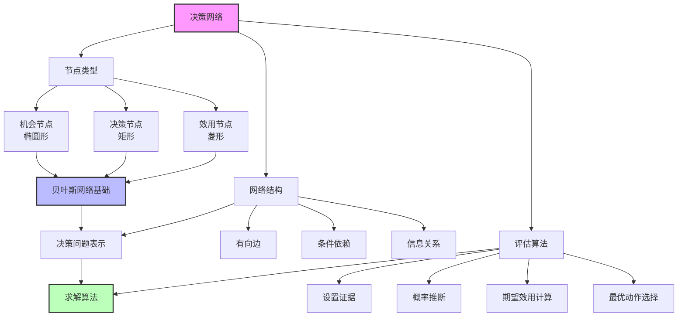
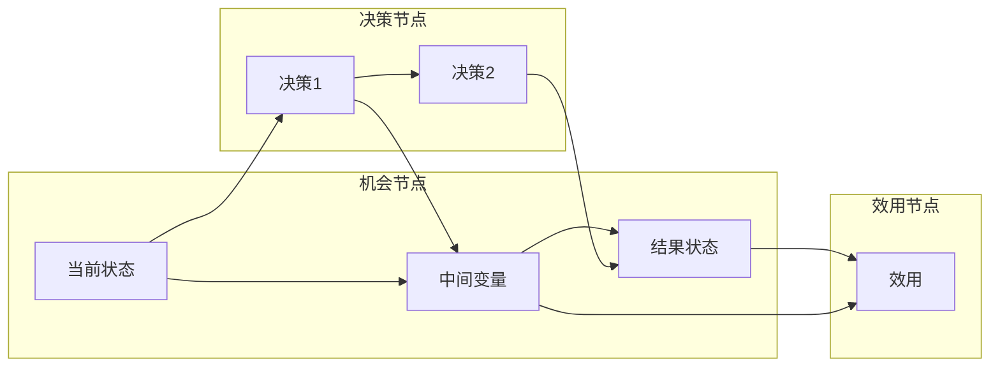

# 16.5 决策网络

## 一、背景与动机

### 1.1 决策表示的挑战

在前面的章节中，我们学习了决策论的基本原理：如何计算期望效用，如何评估效用函数，以及如何处理多属性决策。然而，将这些理论应用到实际问题时，我们面临一个关键挑战：**如何有效地表示复杂的决策问题**？

考虑一个实际的医疗决策场景：
- 患者可能患有多种疾病，症状与疾病之间存在复杂的概率关系
- 医生可以选择多种诊断测试，每种测试有不同的成本和准确性
- 治疗方案的选择取决于诊断结果
- 治疗结果受多种因素影响，包括患者的年龄、并发症等
- 最终目标是最大化患者的预期生活质量

用简单的公式来表示这样的决策问题是不现实的。我们需要一种结构化的表示方法，能够：
- 清晰地表达变量之间的依赖关系
- 支持高效的概率推理
- 整合决策点和效用评估
- 便于计算最优决策

### 1.2 从贝叶斯网络到决策网络

贝叶斯网络（Bayesian Networks）为不确定性推理提供了强大的图形化工具。它们通过有向无环图表示变量之间的条件依赖关系，并利用条件概率表（CPT）量化这些关系。

决策网络（Decision Networks），也称为影响图（Influence Diagrams），是贝叶斯网络的自然扩展。它们增加了两种新的节点类型：
- **决策节点**：表示决策者可以控制的选择
- **效用节点**：表示决策者的偏好和目标

这种扩展使得决策网络成为表示和求解复杂决策问题的统一框架。

### 1.3 历史发展

决策网络的概念最早由斯坦福研究所（SRI）的研究人员在1970年代提出。霍华德和马西森（Howard and Matheson, 1984）正式引入了影响图的概念，并开发了相应的求解算法。

关键里程碑：
- 1976年：SRI的Miller等人开发了早期原型
- 1984年：Howard和Matheson发表影响图的开创性论文
- 1986年：Shachter提出了直接在影响图上进行推理的算法
- 1990年代：决策网络被广泛应用于医疗诊断、金融风险分析等领域
- 2000年代：与贝叶斯网络算法的深度整合

## 二、知识逻辑图谱



### 2.1 决策网络结构



### 2.2 与贝叶斯网络的关系

```mermaid
graph TB
    subgraph 贝叶斯网络
        BN1[变量集合]
        BN2[概率依赖]
        BN3[推理: P(X|E)]
    end
    
    subgraph 决策网络
        DN1[BN + 决策节点]
        DN2[BN + 效用节点]
        DN3[求解: argmax EU]
    end
    
    BN1 --> DN1
    BN2 --> DN2
    BN3 --> DN3
    
    DN1 --> DN3
    DN2 --> DN3
```

## 三、核心概念与数学分析

### 3.1 节点类型的形式化定义

**定义 16.19（决策网络）**：一个决策网络是一个五元组 $\langle V, E, P, D, U \rangle$，其中：
- $V$ 是节点集合
- $E$ 是有向边集合
- $P$ 是条件概率分布集合（与机会节点关联）
- $D$ 是决策节点集合
- $U$ 是效用函数（与效用节点关联）

#### 3.1.1 机会节点（Chance Nodes）

**表示**：椭圆形节点

**语义**：表示随机变量，其取值由概率分布决定。

**条件概率**：每个机会节点 $X$ 有一个条件概率表 $P(X | \text{Parents}(X))$。

**示例**：在机场选址问题中，机会节点可能包括：
- Construction（建筑成本）：取决于选址决策
- Air Traffic（空运水平）：受经济状况影响
- Litigation（潜在诉讼）：取决于选址和噪音水平

#### 3.1.2 决策节点（Decision Nodes）

**表示**：矩形节点

**语义**：表示决策者可以控制的选择点。

**信息基础**：决策节点的父节点表示做出该决策时可获得的信息。

**示例**：
- Airport Site（机场选址）：可能的值包括候选地址 $S_1, S_2, S_3, ...$
- 决策时已知的信息可能包括：地质调查结果、环境影响评估等

#### 3.1.3 效用节点（Utility Nodes）

**表示**：菱形节点

**语义**：表示决策者的偏好，通常是父节点属性的函数。

**效用函数**：$U = f(\text{Parents}(U))$。

**示例**：
- 总效用可能取决于：Safety（安全性）、Quietness（安静度）、Frugality（节俭度）

### 3.2 网络结构的语义

#### 3.2.1 边的类型与含义

**机会节点 → 机会节点**：概率依赖关系
- 表示一个随机变量影响另一个随机变量的分布

**机会节点 → 决策节点**：信息关系
- 表示决策时可以观测到的信息

**决策节点 → 机会节点**：因果关系
- 表示决策影响结果变量的分布

**机会节点/决策节点 → 效用节点**：价值贡献
- 表示该变量影响效用

#### 3.2.2 无遗忘性（No-Forgetting）假设

**定义**：决策网络满足无遗忘性，如果决策节点的父节点包含所有先前的决策节点和已观测的机会节点。

**意义**：决策者不会忘记之前做出的决策或获得的信息。

**示例**：

```
观测1 → 决策1 → 观测2 → 决策2 → 结果 → 效用
```

决策2的父节点包括：观测1、决策1、观测2

### 3.3 决策网络的评估

#### 3.3.1 评估算法

**算法 16.1（决策网络评估）**：

输入：决策网络 $N$，证据 $E$
输出：最优动作 $a^*$

```
1. 将证据 E 设置到网络中
2. 对于每个决策节点 D 的每个可能值 d：
   a. 将 D 设置为 d
   b. 计算效用节点父节点的后验概率
   c. 计算期望效用 EU(d)
3. 返回具有最大 EU 的动作
```

#### 3.3.2 期望效用计算

对于单决策节点的情况：

$$
EU(d) = \sum_{\mathbf{s}} P(\mathbf{s} | d, E) \cdot U(\mathbf{s})
$$

其中 $\mathbf{s}$ 是效用节点父节点的取值组合。

利用贝叶斯网络推理算法，可以高效计算 $P(\mathbf{s} | d, E)$。

### 3.4 简化形式：动作效用函数

#### 3.4.1 两种表示形式的比较

**完整形式**：
- 包含结果状态的机会节点
- 效用节点连接到结果节点
- 更灵活，可以独立修改概率模型和效用函数

**简化形式**：
- 省略结果状态的机会节点
- 效用节点直接连接到当前状态和决策节点
- 效用节点表示动作效用函数（Q函数）

#### 3.4.2 动作效用函数

**定义 16.20（动作效用函数）**：

$$
Q(a) = \sum_{s'} P(\text{RESULT}(a) = s' | E) \cdot U(s')
$$

这正是我们在16.1节中定义的期望效用。

**关系**：

简化形式是完整形式通过对结果状态变量进行求和消元得到的。

## 四、定理与证明

### 4.1 决策网络评估的正确性

**定理 16.20（评估正确性）**：算法16.1返回的决策使期望效用最大化。

**证明**：

设 $D$ 是决策节点，$\mathbf{X}$ 是效用节点的父节点集合。

对于每个可能的决策值 $d$：

$$
EU(d) = \sum_{\mathbf{x}} P(\mathbf{x} | d, E) \cdot U(\mathbf{x})
$$

这是正确的期望效用公式。

算法选择：

$$
d^* = \arg\max_d EU(d)
$$

这正是MEU原则的定义。

### 4.2 完整形式与简化形式的等价性

**定理 16.21（形式等价性）**：对于相同的决策问题，完整形式和简化形式产生相同的决策。

**证明**：

设完整形式中，效用节点的父节点包括结果状态变量 $\mathbf{S}$。

完整形式的期望效用：

$$
EU_{\text{full}}(d) = \sum_{\mathbf{s}} P(\mathbf{s} | d, E) \cdot U(\mathbf{s})
$$

简化形式中，动作效用函数已经整合了结果状态的不确定性：

$$
Q(d) = \sum_{\mathbf{s}} P(\mathbf{s} | d, E) \cdot U(\mathbf{s})
$$

因此：

$$
EU_{\text{reduced}}(d) = Q(d) = EU_{\text{full}}(d)
$$

两种形式计算相同的期望效用，因此产生相同的决策。

### 4.3 计算复杂性

**定理 16.22（决策网络评估的复杂性）**：

- 对于单决策节点的决策网络，评估可以在多项式时间内完成（相对于网络规模）
- 对于多决策节点的决策网络，评估是NP-hard的

**说明**：

单决策节点的情况可以通过枚举所有可能的动作来求解。对于每个动作，使用贝叶斯网络推理算法计算期望效用。

多决策节点的情况需要同时优化多个决策，这导致组合爆炸。

## 五、具体示例

### 5.1 机场选址问题

**场景**：政府需要在三个候选地址中选择一个建设新机场。

**机会节点**：
- Construction（建筑成本）：取决于选址
- Air Traffic（空运水平）：受经济状况影响
- Litigation（潜在诉讼）：取决于选址和噪音
- Safety（安全性）：取决于选址
- Quietness（安静度）：取决于选址
- Frugality（节俭度）：取决于成本

**决策节点**：
- Airport Site：$\{S_1, S_2, S_3\}$

**效用节点**：
- Total Utility：取决于 Safety、Quietness、Frugality

**网络结构**：

```
Airport Site → Construction → Frugality → Utility
Airport Site → Safety → Utility
Airport Site → Quietness → Utility
Economic Climate → Air Traffic
Airport Site, Air Traffic → Litigation
```

**评估过程**：

对于每个选址 $S_i$：

1. 设置 Airport Site = $S_i$
2. 计算 $P(\text{Safety} | S_i)$、$P(\text{Quietness} | S_i)$、$P(\text{Frugality} | S_i)$
3. 计算期望效用：

$$
EU(S_i) = \sum_{s,q,f} P(s,q,f | S_i) \cdot U(s,q,f)
$$

4. 选择具有最大 EU 的选址

### 5.2 医疗诊断决策

**场景**：医生需要决定是否进行某种诊断测试，然后根据结果选择治疗方案。

**机会节点**：
- Disease（疾病）：患者是否患有目标疾病
- Symptom（症状）：观察到的症状
- Test Result（测试结果）：如果进行测试
- Treatment Outcome（治疗结果）：取决于疾病和治疗

**决策节点**：
- Do Test？：是否进行诊断测试
- Treatment：选择治疗方案

**效用节点**：
- Total Utility：取决于治疗结果和测试成本

**评估过程**：

这是一个两阶段决策问题（将在第17章详细讨论）。简化版本：

对于"进行测试"分支：
1. 计算 $P(\text{Disease} | \text{Symptom})$
2. 对于每个可能的测试结果：
   - 更新 $P(\text{Disease} | \text{Symptom}, \text{Test Result})$
   - 选择最优治疗
3. 计算期望效用（考虑测试成本）

对于"不进行测试"分支：
1. 基于 $P(\text{Disease} | \text{Symptom})$ 选择治疗
2. 计算期望效用

比较两个分支的期望效用，选择最优策略。

### 5.3 投资决策

**场景**：投资者需要在股票、债券和现金之间分配资产，考虑市场状况和个人风险承受能力。

**机会节点**：
- Market State（市场状况）：牛市、熊市、震荡
- Stock Return（股票收益）
- Bond Return（债券收益）

**决策节点**：
- Asset Allocation：资产配置比例

**效用节点**：
- Investment Utility：取决于收益和风险

**评估示例**：

假设三种市场状况的先验概率：
- $P(\text{牛市}) = 0.4$
- $P(\text{熊市}) = 0.3$
- $P(\text{震荡}) = 0.3$

对于资产配置"60%股票，40%债券"：

$$
\begin{aligned}
EU &= 0.4 \times U(\text{牛市下的收益}) \\
   &+ 0.3 \times U(\text{熊市下的收益}) \\
   &+ 0.3 \times U(\text{震荡下的收益})
\end{aligned}
$$

比较不同资产配置的期望效用，选择最优配置。

### 5.4 简化形式示例

**场景**：机器人路径规划

**完整形式**：
- 机会节点：Path Condition（路径状况）
- 决策节点：Path Choice（路径选择）
- 效用节点：取决于 Path Condition

**简化形式**：
- 决策节点：Path Choice
- 效用节点：直接表示为 $Q(\text{Path Choice})$

**转换**：

假设：
- 路径A：90%概率畅通（效用10），10%概率阻塞（效用2）
- 路径B：70%概率畅通（效用12），30%概率阻塞（效用0）

则：

$$
Q(A) = 0.9 \times 10 + 0.1 \times 2 = 9.2
$$

$$
Q(B) = 0.7 \times 12 + 0.3 \times 0 = 8.4
$$

简化形式直接存储 $Q(A) = 9.2$ 和 $Q(B) = 8.4$。

## 六、一句话本质

**决策网络将贝叶斯网络的概率推理能力与决策论的效用最大化原则统一在一个图形化框架中，为复杂不确定性决策问题提供了结构化的表示和求解方法。**

## 七、总结与反思

### 7.1 核心要点回顾

1. **节点类型**：机会节点（概率）、决策节点（选择）、效用节点（偏好）
2. **网络结构**：有向边表示依赖、因果和信息关系
3. **评估算法**：枚举决策值，计算期望效用，选择最优动作
4. **两种形式**：完整形式（更灵活）和简化形式（更紧凑）

### 7.2 决策网络的优势

1. **模块化**：概率模型和效用函数可以独立修改
2. **透明性**：图形化表示便于理解和沟通
3. **效率**：利用条件独立性进行高效推理
4. **扩展性**：可以整合信息价值分析（16.6节）

### 7.3 局限性与挑战

1. **结构获取**：确定正确的网络结构需要领域知识
2. **参数估计**：条件概率表和效用函数的获取困难
3. **计算复杂性**：多决策节点的情况难以求解
4. **动态决策**：单步决策假设限制了应用范围

### 7.4 与其他章节的关系

- **第12章**：贝叶斯网络是决策网络的基础
- **16.1-16.4节**：提供了决策网络的理论基础
- **16.6节**：信息价值理论扩展了决策网络
- **第17章**：将决策网络扩展到序列决策（MDP）
- **第22章**：动作效用函数与强化学习的Q函数相关

### 7.5 深入思考

1. **因果与概率**：决策网络中的边应该表示因果关系还是仅仅是统计依赖？这对决策干预有何影响？

2. **效用获取的自动化**：如何自动从数据中学习效用函数？这是逆强化学习（Inverse RL）的核心问题。

3. **对抗性环境**：决策网络假设环境是随机的。如何处理对抗性环境（如博弈场景）？

4. **认知限制**：人类难以构建和评估复杂的决策网络。如何设计辅助工具？

这些问题反映了决策网络从理论到实践的鸿沟，也是当前AI研究的前沿领域。
