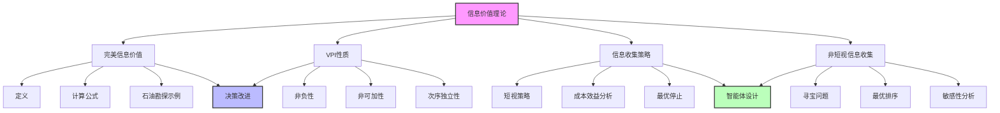
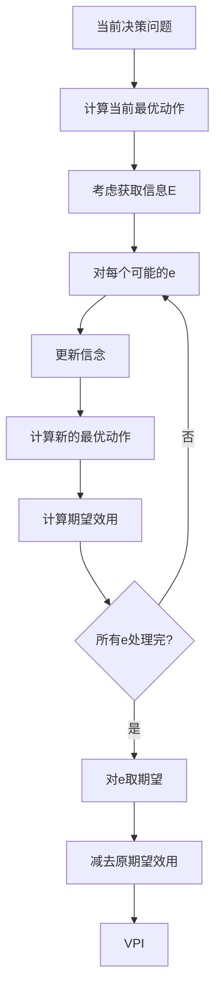
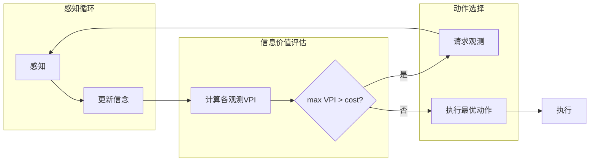

# 16.6 信息价值

## 一、背景与动机

### 1.1 决策时的信息困境

在前面的分析中，我们假设智能体在做出决策之前已经获得了所有相关信息。然而，在现实生活中，这几乎是不可能的。决策者面临的核心问题是：**在有限的时间和资源约束下，应该获取哪些信息？**

考虑以下场景：
- **医疗诊断**：医生不能要求患者进行所有可能的检查。哪些检查最有价值？
- **投资决策**：投资者无法分析所有可能影响市场的因素。哪些信息最值得研究？
- **产品设计**：工程师不能测试所有可能的设计方案。哪些实验最关键？

这些场景的共同特点是：信息获取是有成本的（时间、金钱、风险），而信息的价值取决于它能否改善决策。

### 1.2 信息价值的直觉

信息只有在以下两个条件同时满足时才有价值：
1. **改变决策的潜力**：信息可能导致不同的决策选择
2. **显著改善的潜力**：新决策比原决策显著更好

如果信息不会改变决策，或者改变后的决策并不比原决策好多少，那么该信息就没有价值（或价值很小）。

### 1.3 信息价值理论的意义

信息价值理论（Value of Information Theory）提供了一种系统性的方法来量化信息的期望价值。它的核心贡献包括：

- **量化信息价值**：将信息的价值定义为期望效用的提升
- **指导信息收集**：帮助决策者确定应该获取哪些信息
- **成本效益分析**：比较信息价值与获取成本
- **最优停止**：确定何时应该停止收集信息并做出决策

## 二、知识逻辑图谱



### 2.1 信息价值计算流程



### 2.2 信息收集智能体架构



## 三、核心概念与数学分析

### 3.1 完美信息价值（VPI）

#### 3.1.1 基本定义

**定义 16.21（完美信息价值）**：设 $E_j$ 是一个可以观测的随机变量。完美信息价值 $VPI(E_j)$ 定义为：

$$
VPI(E_j) = \left(\sum_{e_j} P(E_j = e_j) \cdot EU(\alpha_{e_j} | E_j = e_j)\right) - EU(\alpha)
$$

其中：
- $\alpha$ 是在没有 $E_j$ 信息时的最优动作
- $\alpha_{e_j}$ 是在观测到 $E_j = e_j$ 后的最优动作
- $EU(\alpha)$ 是原最优动作的期望效用

**解释**：VPI是获取信息后期望效用的提升。

#### 3.1.2 计算公式推导

**步骤1：无信息时的最优动作**

$$
\alpha = \arg\max_a \sum_{s'} P(\text{RESULT}(a) = s') \cdot U(s')
$$

**步骤2：有信息时的最优动作**

对于每个可能的观测值 $e_j$：

$$
\alpha_{e_j} = \arg\max_a \sum_{s'} P(\text{RESULT}(a) = s' | e_j) \cdot U(s')
$$

**步骤3：对观测值取期望**

$$
EU_{\text{with info}} = \sum_{e_j} P(e_j) \cdot EU(\alpha_{e_j} | e_j)
$$

**步骤4：计算VPI**

$$
VPI(E_j) = EU_{\text{with info}} - EU(\alpha)
$$

### 3.2 VPI的性质

#### 3.2.1 非负性

**定理 16.23（VPI非负性）**：对于任何随机变量 $E_j$：

$$
VPI(E_j) \geq 0
$$

**证明**：

$$
\begin{aligned}
EU_{\text{with info}} &= \sum_{e_j} P(e_j) \cdot \max_a EU(a | e_j) \\
&\geq \max_a \sum_{e_j} P(e_j) \cdot EU(a | e_j) \\
&= \max_a EU(a) \\
&= EU(\alpha)
\end{aligned}
$$

第一个不等式成立是因为期望的最大值大于等于最大值的期望。

因此 $VPI(E_j) = EU_{\text{with info}} - EU(\alpha) \geq 0$。

**直观理解**：在最坏情况下，智能体可以忽略信息，保持原决策。因此信息不会降低期望效用。

#### 3.2.2 非可加性

**定理 16.24（VPI非可加性）**：一般情况下：

$$
VPI(E_j, E_k) \neq VPI(E_j) + VPI(E_k)
$$

**解释**：两个变量的联合信息价值不等于各自信息价值之和。这是因为：
- 变量之间可能存在相关性
- 一个变量的信息可能降低另一个变量的信息价值

**示例**：

如果 $E_k$ 完全由 $E_j$ 决定，则：

$$
VPI(E_j, E_k) = VPI(E_j) = VPI(E_j) + 0 = VPI(E_j) + VPI(E_k | E_j)
$$

#### 3.2.3 次序独立性

**定理 16.25（VPI次序独立性）**：

$$
VPI(E_j, E_k) = VPI(E_j) + VPI(E_k | E_j) = VPI(E_k) + VPI(E_j | E_k) = VPI(E_k, E_j)
$$

**证明**：

$$
\begin{aligned}
VPI(E_j, E_k) &= EU_{\text{with } E_j, E_k} - EU_{\text{without info}} \\
&= [EU_{\text{with } E_j} - EU_{\text{without info}}] + [EU_{\text{with } E_j, E_k} - EU_{\text{with } E_j}] \\
&= VPI(E_j) + VPI(E_k | E_j)
\end{aligned}
$$

同理可证 $VPI(E_j, E_k) = VPI(E_k) + VPI(E_j | E_k)$。

**意义**：观测的顺序不影响最终的信息价值，这简化了多步信息收集的规划。

### 3.3 信息价值的三种情况

根据信息对决策的影响，可以分为三种情况：

#### 3.3.1 情况A：信息无关紧要

**特征**：一个动作几乎肯定优于其他动作。

**数学表达**：对于最优动作 $\alpha$ 和次优动作 $\beta$：

$$
EU(\alpha) \gg EU(\beta)
$$

且对于所有可能的观测 $e_j$：

$$
\alpha_{e_j} = \alpha
$$

**VPI**：$VPI(E_j) \approx 0$

**示例**：在一条高速公路和一条危险的土路之间选择。无论卫星报告说什么，高速公路几乎总是更好的选择。

#### 3.3.2 情况B：信息至关重要

**特征**：选择不明确，信息会显著改变决策。

**数学表达**：

$$
EU(\alpha) \approx EU(\beta)
$$

但存在观测 $e_j$ 使得：

$$
\alpha_{e_j} = \beta \neq \alpha
$$

且 $EU(\beta | e_j) \gg EU(\alpha | e_j)$。

**VPI**：$VPI(E_j)$ 很大

**示例**：在两条相似的土路之间选择，载着重伤患者。知道哪条路畅通可以显著改变决策并挽救生命。

#### 3.3.3 情况C：信息改变决策但价值不大

**特征**：选择不明确，信息可能改变决策，但差异很小。

**数学表达**：

$$
EU(\alpha) \approx EU(\beta)
$$

且对于某些 $e_j$，$\alpha_{e_j} \neq \alpha$，但：

$$
EU(\alpha_{e_j} | e_j) \approx EU(\alpha | e_j)
**

**VPI**：$VPI(E_j)$ 很小

**示例**：在夏季选择两条风景路线。卫星报告可能显示一条路线更美丽，但两条路线的价值差异很小。

## 四、定理与证明

### 4.1 VPI上界定理

**定理 16.26（VPI上界）**：设 $U_{\max}$ 和 $U_{\min}$ 分别是最大和最小可能效用值。则：

$$
VPI(E_j) \leq U_{\max} - EU(\alpha)
$$

**证明**：

$$
\begin{aligned}
EU_{\text{with info}} &= \sum_{e_j} P(e_j) \cdot \max_a EU(a | e_j) \\
&\leq \sum_{e_j} P(e_j) \cdot U_{\max} \\
&= U_{\max}
\end{aligned}
$$

因此：

$$
VPI(E_j) = EU_{\text{with info}} - EU(\alpha) \leq U_{\max} - EU(\alpha)
$$

**意义**：VPI不能超过当前决策的潜在改进空间。

### 4.2 独立观测的最优排序

**定理 16.27（寻宝问题最优排序）**：设有 $n$ 个独立的位置，位置 $i$ 包含宝藏的概率为 $P(i)$，检查成本为 $C(i)$。最优检查顺序按照以下比率降序排列：

$$
\frac{P(i)}{C(i)}
$$

**证明概要**：

设检查序列 $\mathbf{x}$ 的期望成本为 $C(\mathbf{x})$，成功概率为 $P(\mathbf{x})$，失败概率为 $F(\mathbf{x}) = 1 - P(\mathbf{x})$。

对于两个相邻的检查 $i$ 和 $j$，交换它们的顺序产生的成本变化为：

$$
\Delta = C(\mathbf{x}ij\mathbf{y}) - C(\mathbf{x}ji\mathbf{y})
$$

通过展开计算：

$$
\Delta = F(\mathbf{x})[C(i)P(j) - C(j)P(i)]
$$

最优排序要求对于所有相邻的 $i, j$，$\Delta \leq 0$，即：

$$
\frac{P(i)}{C(i)} \geq \frac{P(j)}{C(j)}
$$

### 4.3 短视策略的最优性条件

**定理 16.28（短视策略最优性）**：在以下条件下，短视（贪心）信息收集策略是最优的：

1. 观测之间相互独立
2. 效用函数是加性的
3. 信息成本是固定的

**说明**：

短视策略在每一步选择VPI/Cost比率最高的观测。虽然这种策略在一般情况下不是全局最优的，但在上述条件下可以证明其最优性。

## 五、具体示例

### 5.1 石油勘探问题

**场景**：石油公司需要在 $n$ 块不可区分的海洋开采权中选择一块购买。其中恰好有一块含有价值 $C$ 的石油，其他 worthless。每块要价 $C/n$。

**无信息时的决策**：

购买任意一块的期望利润：

$$
E[\text{profit}] = \frac{1}{n} \cdot C - \frac{C}{n} = 0
$$

不购买的利润也是0。因此无差异。

**信息的价值**：

地震学家提供对3号区域的调查结果，明确表明是否含有石油。

**分析**：

- 概率 $1/n$：调查显示3号区域有石油
  - 购买3号区域，利润 = $C - C/n = (n-1)C/n$
  
- 概率 $(n-1)/n$：调查显示3号区域无石油
  - 购买其他区域，在其他区域发现石油的概率变为 $1/(n-1)$
  - 期望利润 = $C/(n-1) - C/n = C/[n(n-1)]$

**期望利润（有信息）**：

$$
\begin{aligned}
E[\text{profit} | \text{info}] &= \frac{1}{n} \cdot \frac{(n-1)C}{n} + \frac{n-1}{n} \cdot \frac{C}{n(n-1)} \\
&= \frac{(n-1)C}{n^2} + \frac{C}{n^2} \\
&= \frac{C}{n}
\end{aligned}
$$

**VPI**：

$$
VPI = E[\text{profit} | \text{info}] - E[\text{profit}] = \frac{C}{n} - 0 = \frac{C}{n}
$$

公司应该愿意支付接近 $C/n$ 的金额来获取这个信息。

### 5.2 医疗诊断测试选择

**场景**：患者可能患有疾病D（先验概率0.3）。医生可以选择进行测试T（成本$100），测试结果可能是阳性或阴性。

**治疗方案**：
- 如果确诊D：治疗A（成本$500，效用100）
- 如果不治疗：效用50
- 如果误诊（治疗非D患者）：成本$500，效用30

**无测试时的决策**：

治疗期望效用：$0.3 \times 100 + 0.7 \times 30 = 51$

不治疗期望效用：$0.3 \times 50 + 0.7 \times 50 = 50$

最优决策：治疗，期望效用 = 51

**有测试时的决策**：

假设测试准确性：$P(+|D) = 0.9$，$P(-|\neg D) = 0.8$

如果测试阳性：
- $P(D|+) = \frac{0.9 \times 0.3}{0.9 \times 0.3 + 0.2 \times 0.7} = \frac{0.27}{0.41} \approx 0.66$
- 治疗期望效用：$0.66 \times 100 + 0.34 \times 30 = 76.2$
- 不治疗期望效用：50
- 最优：治疗

如果测试阴性：
- $P(D|-) = \frac{0.1 \times 0.3}{0.1 \times 0.3 + 0.8 \times 0.7} = \frac{0.03}{0.59} \approx 0.05$
- 治疗期望效用：$0.05 \times 100 + 0.95 \times 30 = 33.5$
- 不治疗期望效用：50
- 最优：不治疗

**有信息时的期望效用**：

$$
\begin{aligned}
EU_{\text{with test}} &= P(+) \times 76.2 + P(-) \times 50 \\
&= 0.41 \times 76.2 + 0.59 \times 50 \\
&= 31.24 + 29.5 = 60.74
\end{aligned}
$$

**VPI**：

$$
VPI = 60.74 - 51 = 9.74
$$

由于 $VPI = 9.74 < \text{cost} = 100$，不应该进行测试。

### 5.3 寻宝问题

**场景**：有3个位置可能藏有宝藏：
- 位置1：$P(1) = 0.5$，$C(1) = 10$
- 位置2：$P(2) = 0.3$，$C(2) = 5$
- 位置3：$P(3) = 0.2$，$C(3) = 4$

**计算效率比率**：

$$
\frac{P(1)}{C(1)} = 0.05, \quad \frac{P(2)}{C(2)} = 0.06, \quad \frac{P(3)}{C(3)} = 0.05
$$

**最优顺序**：位置2 → 位置1 → 位置3（或位置2 → 位置3 → 位置1）

**期望成本计算**（顺序2→1→3）：

$$
\begin{aligned}
C(	ext{顺序}) &= C(2) + F(2) \cdot C(1) + F(2)F(1) \cdot C(3) \\
&= 5 + 0.7 \times 10 + 0.7 \times 0.5 \times 4 \\
&= 5 + 7 + 1.4 = 13.4
\end{aligned}
$$

### 5.4 信息收集智能体

**算法**：

```
function INFORMATION-GATHERING-AGENT(percept):
    将percept整合进决策网络D
    
    j ← argmax_j VPI(E_j) / C(E_j)
    
    if VPI(E_j) > C(E_j):
        return Request(E_j)
    else:
        return D的最佳动作
```

**示例执行**：

假设决策网络有3个可观测变量：
- $E_1$：VPI = 50，Cost = 20，比率 = 2.5
- $E_2$：VPI = 30，Cost = 10，比率 = 3.0
- $E_3$：VPI = 100，Cost = 50，比率 = 2.0

智能体选择请求 $E_2$（最高比率）。

观测 $E_2$ 后，更新VPI：
- $E_1$：VPI更新为40（可能降低，因为 $E_2$ 提供了相关信息）
- $E_3$：VPI更新为80

新的比率：
- $E_1$：40/20 = 2.0
- $E_3$：80/50 = 1.6

如果两者都小于1，智能体停止收集信息并做出决策。

## 六、一句话本质

**信息价值理论通过量化信息对期望效用的潜在提升，为智能体提供了在信息成本与决策改进之间进行理性权衡的数学框架。**

## 七、总结与反思

### 7.1 核心要点回顾

1. **VPI定义**：信息价值 = 有信息后期望效用 - 无信息时期望效用
2. **VPI性质**：非负性、非可加性、次序独立性
3. **三种情况**：信息无关紧要、信息至关重要、信息改变决策但价值不大
4. **信息收集策略**：短视（贪心）策略在实践中表现良好

### 7.2 理论洞察

**信息何时有价值**：
- 当决策选择不明确时
- 当信息可能导致不同的决策时
- 当新决策显著优于原决策时

**信息何时无价值**：
- 当最优动作已经明确时
- 当信息不会改变决策时
- 当所有可能决策的效用相近时

### 7.3 实践应用

**医疗诊断**：
- 确定哪些检查最值得进行
- 优化诊断测试的顺序
- 避免不必要的医疗支出

**实验设计**：
- 科学实验的最优设计
- A/B测试的样本量确定
- 工程原型测试规划

**信息检索**：
- 搜索引擎的查询优化
- 推荐系统的探索-利用权衡
- 问答系统的追问策略

### 7.4 与其他章节的关系

- **16.5节**：决策网络提供了计算VPI的框架
- **16.7节**：信息价值与偏好学习相关
- **第17章**：扩展到序列决策中的信息收集
- **第20章**：与主动学习（Active Learning）相关

### 7.5 深入思考

1. **不完美信息**：VPI假设信息是完美的（观测值等于真实值）。如何处理噪声观测？

2. **对抗性信息**：在博弈场景中，对手可能提供误导性信息。如何评估这种信息的价值？

3. **信息的社会价值**：个体信息价值与社会信息价值可能不同。如何协调？

4. **认知成本**：信息处理本身有认知成本。如何将这种成本纳入VPI计算？

这些问题反映了信息价值理论从理论到实践的鸿沟，也是当前研究的前沿领域。
