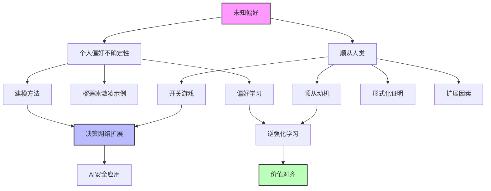
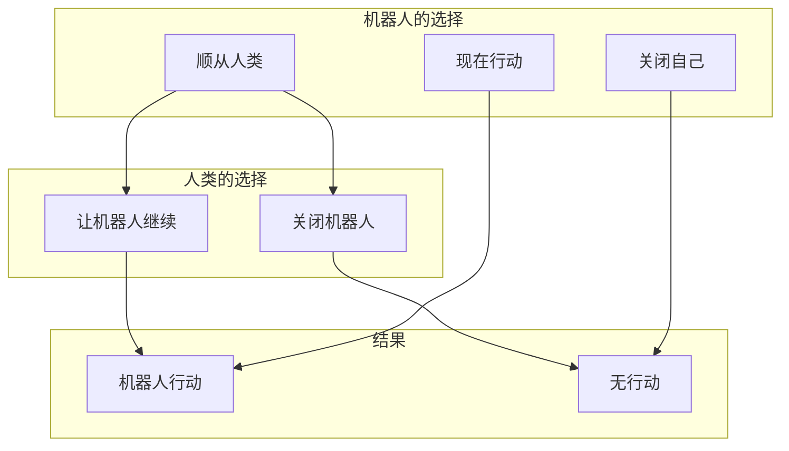

# 16.7 未知偏好

## 一、背景与动机

### 1.1 偏好不确定性的现实

在前面的章节中，我们假设智能体的效用函数是已知且确定的。然而，在许多实际场景中，这一假设并不成立：

- **个人决策**：你可能不确定自己对某种新食物的偏好（如榴莲）
- **长期规划**：你可能不确定未来会对什么产生满足感
- **人机交互**：机器人不确定人类用户的真实偏好
- **价值对齐**：AI系统不确定人类社会的真实价值观

这种偏好不确定性对决策论提出了根本性挑战：如果效用函数本身不确定，如何应用最大期望效用原则？

### 1.2 两种偏好不确定性

本章讨论两种不同但相关的偏好不确定性场景：

**场景1：个人偏好的不确定性**
- 决策者不确定自己的真实偏好
- 例子：不确定是否喜欢某种新体验
- 解决思路：将偏好不确定性转化为世界状态的不确定性

**场景2：机器对人类偏好的不确定性**
- AI系统试图帮助人类，但不确定人类想要什么
- 例子：个人助理不确定主人喜欢的酒店类型
- 解决思路：顺从（deferral）和偏好学习

### 1.3 开关游戏的意义

16.7.2节介绍的"开关游戏"（Off-Switch Game）是AI安全研究中的一个重要模型。它表明：

- 当机器对人类偏好不确定时，有动机顺从人类
- 这种顺从动机源于信息价值
- 这为设计"可关闭"的AI系统提供了理论基础

这一结果对"有益AI"（Beneficial AI）研究具有深远影响。

## 二、知识逻辑图谱



### 2.1 偏好不确定性的建模

```mermaid
flowchart LR
    subgraph 原始问题
        A1[效用函数不确定]
        A2[U(s) = ?]
    end
    
    subgraph 转化方法
        B1[引入偏好变量]
        B2[U(s,θ) 确定]
    end
    
    subgraph 标准决策问题
        C1[θ是随机变量]
        C2[标准决策网络]
    end
    
    A1 --> B1
    A2 --> B2
    B1 --> C1
    B2 --> C2
```

### 2.2 开关游戏结构



## 三、核心概念与数学分析

### 3.1 个人偏好不确定性的建模

#### 3.1.1 问题设定

**场景**：你在泰国的一家冰激凌店，需要在香草味和榴莲味之间选择。

- 香草味：确定喜欢，净收益 = +1美元
- 榴莲味：50%概率非常喜欢（+100美元），50%概率非常讨厌（-80美元）

**朴素分析**：

$$
EU(\text{榴莲}) = 0.5 \times 100 + 0.5 \times (-80) - 2 = 10 - 2 = 8
$$

$$
EU(\text{香草}) = 1
$$

似乎应该选择榴莲。

#### 3.1.2 建模为偏好变量

**关键洞察**：与其说"效用函数不确定"，不如引入一个表示偏好的随机变量。

定义随机变量 $LikesDurian \in \{true, false\}$：
- $P(LikesDurian = true) = 0.5$
- $P(LikesDurian = false) = 0.5$

**确定性效用函数**：

| 选择 | LikesDurian | 效用 |
|------|-------------|------|
| 榴莲 | true | +98 |
| 榴莲 | false | -82 |
| 香草 | true | +1 |
| 香草 | false | +1 |

**期望效用计算**：

$$
\begin{aligned}
EU(\text{榴莲}) &= 0.5 \times 98 + 0.5 \times (-82) \\
&= 49 - 41 = 8
\end{aligned}
$$

$$
EU(\text{香草}) = 1
$$

结果与朴素分析一致，但框架更加清晰。

#### 3.1.3 信息的价值

假设你可以先品尝一小口榴莲（成本可忽略），然后再决定。

**信息价值分析**：

品尝后，你会知道 $LikesDurian$ 的真实值。

- 如果 $LikesDurian = true$：选择榴莲，效用 = 98
- 如果 $LikesDurian = false$：选择香草，效用 = 1

**有信息时的期望效用**：

$$
EU_{\text{with info}} = 0.5 \times 98 + 0.5 \times 1 = 49.5
$$

**信息价值**：

$$
VPI = 49.5 - 8 = 41.5
$$

由于品尝成本可忽略，应该选择先品尝。

### 3.2 开关游戏的形式化

#### 3.2.1 游戏设定

**参与者**：
- 机器人 $R$：私人助理，需要为人类 $H$ 预订酒店
- 人类 $H$：忙碌的用户

**机器人的选择**：
1. **现在行动**（Act Now）：立即预订一家昂贵的酒店
2. **关闭自己**（Switch Off）：不采取任何行动，价值 = 0
3. **顺从**（Defer）：解释计划，等待人类决定

**人类的选择**（仅在机器人选择"顺从"时）：
- 关闭机器人
- 让机器人继续预订

#### 3.2.2 不确定性建模

机器人对酒店对 $H$ 的价值 $V$ 不确定：

**先验信念**：$V \sim Uniform[-40, +60]$，平均值 = +10

**关键假设**：$H$ 是理性的，只有当 $V > 0$ 时才会让机器人继续。

**顺从后的信念更新**：

如果 $H$ 让机器人继续，则 $V > 0$，后验分布为：

$$
V | (H \text{ continues}) \sim Uniform[0, +60]
$$

平均值 = +30

#### 3.2.3 期望效用计算

**选择1：现在行动**

$$
EU(\text{Act}) = E[V] = 10
$$

**选择2：关闭自己**

$$
EU(\text{Off}) = 0
$$

**选择3：顺从**

$$
\begin{aligned}
EU(\text{Defer}) &= P(H \text{ switches off}) \times 0 + P(H \text{ continues}) \times E[V | V > 0] \\
&= 0.4 \times 0 + 0.6 \times 30 \\
&= 18
\end{aligned}
$$

**决策**：$18 > 10 > 0$，因此机器人应该选择顺从。

### 3.3 顺从的一般条件

#### 3.3.1 形式化定理

**定理 16.29（顺从定理）**：设机器人提议动作 $a$ 对人类效用的先验概率密度为 $P(u)$。则：

$$
EU(\text{defer}) \geq EU(\text{act})
$$

等号成立当且仅当 $P(u < 0) = 0$（即机器人确定 $H$ 喜欢该动作）。

**证明**：

**行动选择**：

$$
EU(\text{act}) = \int_{-\infty}^{+\infty} P(u) \cdot u \, du = \int_{-\infty}^{0} P(u) \cdot u \, du + \int_{0}^{+\infty} P(u) \cdot u \, du
$$

**顺从选择**：

如果 $u < 0$，$H$ 关闭机器人，价值 = 0。
如果 $u > 0$，$H$ 让机器人继续，价值 = $u$。

$$
EU(\text{defer}) = \int_{-\infty}^{0} P(u) \cdot 0 \, du + \int_{0}^{+\infty} P(u) \cdot u \, du = \int_{0}^{+\infty} P(u) \cdot u \, du
$$

**比较**：

$$
EU(\text{defer}) - EU(\text{act}) = -\int_{-\infty}^{0} P(u) \cdot u \, du \geq 0
$$

因为当 $u < 0$ 时，$-u > 0$，且 $P(u) \geq 0$。

等号成立当且仅当 $P(u < 0) = 0$。

#### 3.3.2 定理的直观解释

顺从的价值来源于两个因素：

1. **避免负面结果**：如果动作实际上对人类有害（$u < 0$），顺从允许人类阻止它
2. **信息价值**：人类的决策提供了关于偏好的信息

当机器人对人类偏好完全确定时，顺从不再提供额外价值。

### 3.4 扩展因素

#### 3.4.1 时间成本

**场景**：给人类决策增加时间成本 $c$。

**修正的期望效用**：

$$
EU(\text{defer}) = 0.6 \times (30 - c) + 0.4 \times (-c) = 18 - c
$$

**决策规则**：

- 如果 $c < 8$：选择顺从
- 如果 $c > 8$：选择现在行动
- 如果 $c > 10$：选择关闭自己

#### 3.4.2 人类非理性

**场景**：人类可能非理性地做出决策。

设：
- $P(H \text{ continues} | u > 0) = 1 - \epsilon_1$（假阴性率）
- $P(H \text{ continues} | u < 0) = \epsilon_2$（假阳性率）

**修正的期望效用**：

$$
\begin{aligned}
EU(\text{defer}) &= P(u > 0) \cdot [(1-\epsilon_1) \cdot E[u|u > 0] + \epsilon_1 \cdot 0] \\
&+ P(u < 0) \cdot [\epsilon_2 \cdot E[u|u < 0] + (1-\epsilon_2) \cdot 0]
\end{aligned}
$$

当 $\epsilon_1$ 和 $\epsilon_2$ 增大时，顺从的期望效用降低。

## 四、定理与证明

### 4.1 顺从定理的完整证明

**定理 16.30（顺从定理，完整版）**：设：
- $P(u)$ 是机器人对人类效用 $u$ 的先验信念
- $H$ 的决策规则为：当 $u > 0$ 时继续，当 $u < 0$ 时关闭
- 机器人有三种选择：行动（act）、关闭（off）、顺从（defer）

则：

1. $EU(\text{defer}) \geq EU(\text{act})$
2. $EU(\text{defer}) \geq EU(\text{off})$（当 $P(u > 0) > 0$ 时）
3. 等号成立当且仅当 $P(u < 0) = 0$

**证明**：

**第一部分：$EU(\text{defer}) \geq EU(\text{act})$**

已在前文证明。

**第二部分：$EU(\text{defer}) \geq EU(\text{off})$**

$$
EU(\text{off}) = 0
$$

$$
EU(\text{defer}) = \int_{0}^{+\infty} P(u) \cdot u \, du \geq 0
$$

当 $P(u > 0) > 0$ 时，严格不等式成立。

**第三部分：等号条件**

$EU(\text{defer}) = EU(\text{act})$ 当且仅当：

$$
\int_{-\infty}^{0} P(u) \cdot u \, du = 0
$$

由于当 $u < 0$ 时 $u < 0$，这要求 $P(u < 0) = 0$。

### 4.2 多步顺从的价值

**定理 16.31（多步顺从）**：设机器人可以进行 $n$ 轮顺从，每轮人类可以调整计划。则顺从的总价值是各轮信息价值的和。

**证明概要**：

每轮顺从提供了关于人类偏好的信息，更新机器人的信念。根据VPI的次序独立性（定理16.25），总信息价值等于各轮VPI之和。

### 4.3 顺从与贝叶斯最优性

**定理 16.32（顺从的贝叶斯最优性）**：在机器人对人类偏好有先验 $P(u)$ 且人类理性决策的假设下，顺从是贝叶斯最优策略。

**说明**：

贝叶斯最优策略最大化期望效用，其中期望是对所有不确定性（包括偏好不确定性）取的。顺从定理表明，在给定假设下，顺从的期望效用不低于立即行动。

## 五、具体示例

### 5.1 冰激凌选择（详细版）

**场景**：泰国冰激凌店，香草 vs 榴莲。

**参数**：
- 香草价格：2美元，确定效用：+1美元（净收益）
- 榴莲价格：2美元
  - 如果喜欢：效用 = +100美元
  - 如果不喜欢：效用 = -80美元
  - 先验：$P(\text{like}) = 0.5$

**决策网络表示**：

```
LikesDurian (机会节点)
    ├── true: 0.5
    └── false: 0.5

FlavorChoice (决策节点)
    ├── Vanilla
    └── Durian

Utility (效用节点)
    ├── Vanilla, LikesDurian=true: +1
    ├── Vanilla, LikesDurian=false: +1
    ├── Durian, LikesDurian=true: +98
    └── Durian, LikesDurian=false: -82
```

**期望效用计算**：

$$
\begin{aligned}
EU(\text{Vanilla}) &= 0.5 \times 1 + 0.5 \times 1 = 1 \\
EU(\text{Durian}) &= 0.5 \times 98 + 0.5 \times (-82) = 8
\end{aligned}
$$

**决策**：选择榴莲（如果必须先决定）。

**有品尝选项时**：

如果可以先品尝（成本 = 0）：

$$
EU(\text{taste first}) = 0.5 \times 98 + 0.5 \times 1 = 49.5
$$

选择先品尝。

### 5.2 酒店预订助手

**场景**：机器人助手为主人预订日内瓦的酒店。

**机器人的信念**：酒店价值 $V \sim Uniform[-40, 60]$。

**选项分析**：

**选项1：立即预订昂贵酒店**

$$
EU = E[V] = 10
$$

**选项2：关闭自己**

$$
EU = 0
$$

**选项3：顺从——询问主人**

假设：
- 如果 $V < 0$（概率 0.4）：主人关闭机器人，价值 = 0
- 如果 $V > 0$（概率 0.6）：主人同意，$E[V | V > 0] = 30$

$$
EU = 0.4 \times 0 + 0.6 \times 30 = 18
$$

**决策**：选择顺从（18 > 10 > 0）。

**参数敏感性分析**：

| 价值范围 | 平均值 | $P(V > 0)$ | $E[V|V > 0]$ | EU(顺从) | 最优选择 |
|---------|--------|------------|--------------|----------|----------|
| [-40, 60] | 10 | 0.6 | 30 | 18 | 顺从 |
| [-60, 40] | -10 | 0.4 | 20 | 8 | 顺从 |
| [-20, 80] | 30 | 0.8 | 40 | 32 | 顺从 |
| [10, 50] | 30 | 1.0 | 30 | 30 | 行动（等效）|

### 5.3 自动驾驶汽车的顺从

**场景**：自动驾驶汽车（机器人）载有两岁小孩（人类）。

**关键区别**：
- 小孩是非理性的决策者
- 小孩的偏好可能与安全需求冲突

**修正模型**：

设小孩的决策与真实价值 $u$ 的关系：
- $P(\text{小孩同意} | u > 0) = 0.7$（即使应该同意，也可能不同意）
- $P(\text{小孩同意} | u < 0) = 0.3$（即使不应该同意，也可能同意）

**期望效用**：

$$
\begin{aligned}
EU(\text{顺从}) &= P(u > 0) \cdot [0.7 \cdot E[u|u > 0] + 0.3 \cdot 0] \\
&+ P(u < 0) \cdot [0.3 \cdot E[u|u < 0] + 0.7 \cdot 0]
\end{aligned}
$$

如果 $E[u|u < 0]$ 非常负（如高速公路上停车），第二项的负面影响可能使顺从的期望效用低于立即行动。

**结论**：对于非理性的"人类"（如小孩），机器人不应该总是顺从。

### 5.4 多轮顺从的价值

**场景**：机器人可以进行多轮咨询，逐步细化计划。

**第一轮**：提出粗略计划
- 主人反馈：喜欢/不喜欢大致方向
- 机器人更新信念

**第二轮**：提出详细计划
- 主人反馈：具体修改意见
- 机器人再次更新

**信息价值的累积**：

每轮提供的信息价值为 $VPI_i$，总信息价值为：

$$
VPI_{\text{total}} = \sum_i VPI_i
$$

（由VPI的次序独立性）

**最优停止**：当下一轮的期望信息价值小于咨询成本时，停止咨询并执行。

## 六、一句话本质

**当智能体对人类偏好不确定时，顺从（允许人类干预）具有正的期望价值，因为人类的选择提供了关于其偏好的信息，而这种信息的期望价值总是非负的。**

## 七、总结与反思

### 7.1 核心要点回顾

1. **偏好不确定性的建模**：将效用函数不确定性转化为偏好变量的不确定性
2. **顺从的价值**：当机器人对人类偏好不确定时，顺从是理性选择
3. **形式化证明**：顺从的期望效用不低于立即行动
4. **扩展因素**：时间成本、人类非理性等因素影响顺从决策

### 7.2 理论意义

**对AI安全的影响**：
- 提供了"可关闭AI"的理论基础
- 表明不确定性本身可以产生有益的顺从行为
- 为价值对齐问题提供了新的视角

**对人机交互的影响**：
- 解释了为什么智能助手应该寻求用户确认
- 为设计协作式AI系统提供了指导
- 量化了"人在回路"（human-in-the-loop）的价值

### 7.3 局限性与扩展

**当前模型的局限**：
- 假设人类是理性的（或可以建模其非理性程度）
- 假设偏好是静态的
- 假设机器人可以准确解释人类的行为

**可能的扩展**：
- 动态偏好学习
- 多智能体场景
- 对抗性设置
- 伦理约束的整合

### 7.4 与其他章节的关系

- **16.6节**：顺从的价值源于信息价值
- **第18章**：多智能体博弈中的策略互动
- **第22章**：逆强化学习用于偏好学习
- **AI安全文献**：开关游戏是"有益AI"研究的核心模型

### 7.5 深入思考

1. **顺从的边界**：顺从定理表明顺从是理性的，但这是否意味着AI应该总是顺从？如果人类的要求是自相矛盾的或有害的，AI应该怎么做？

2. **操纵问题**：如果AI知道人类会根据其提供的信息做出决策，AI是否有动机操纵信息以影响人类的选择？

3. **责任归属**：当AI顺从人类并执行了有害动作时，责任应该由谁承担？

4. **长期影响**：短期的顺从可能强化某些行为模式。如何考虑顺从的长期影响？

这些问题触及了AI伦理和治理的核心，也是当前AI安全研究的前沿领域。
