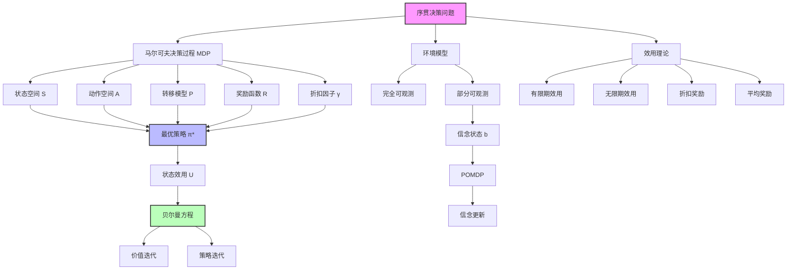

# 17.1 序贯决策问题

## 一、背景与动机

### 1.1 从确定性搜索到随机性决策

在人工智能的发展历程中，决策问题始终是核心研究主题之一。第3章介绍的搜索算法和第4章的规划方法都假设环境是确定性的——智能体执行一个动作后，能够准确预测将达到的状态。然而，现实世界充满了不确定性：机器人执行移动指令时可能因地面摩擦变化而偏离预期路径；自动驾驶汽车在复杂路况下的传感器读数可能存在噪声；医疗诊断中的检验结果也可能出现假阳性或假阴性。

序贯决策问题（Sequential Decision Problem）正是在这样的背景下提出的。与一次性决策不同，序贯决策要求智能体在不确定环境中做出一系列相互关联的决策，每个决策不仅影响当前状态，还会影响未来的决策空间和可能获得的奖励。这种决策模式涵盖了从棋类游戏到金融投资，从机器人导航到医疗资源分配的广泛应用场景。

### 1.2 马尔可夫决策过程的历史渊源

序贯决策问题的形式化框架——马尔可夫决策过程（Markov Decision Process, MDP）——源于20世纪50年代理查德·贝尔曼（Richard Bellman）在兰德公司的开创性工作。贝尔曼面临的核心挑战是如何在随机环境中做出最优决策。他提出的"动态规划"方法不仅解决了序贯决策问题，更为整个运筹学和人工智能领域奠定了基础。

贝尔曼在其自传《Eye of the Hurricane》中回忆，他创造"动态规划"（Dynamic Programming）这个术语是为了向患有数学恐惧症的国防部长查尔斯·威尔逊（Charles Wilson）隐瞒团队实际上在研究数学的事实。尽管这个轶事的真实性存疑（贝尔曼1952年的论文早于威尔逊1953年就任国防部长），但它生动地反映了当时学术界与军事工业复合体之间的复杂关系。

### 1.3 实际应用需求

序贯决策框架在现代社会有着广泛的应用：

**机器人导航**：自主移动机器人需要在不确定的环境中规划路径。传感器噪声、执行器误差、环境动态变化都使得确定性规划方法不再适用。MDP框架允许机器人考虑这些不确定性，制定鲁棒性更强的导航策略。

**金融投资组合管理**：投资者需要在不同资产之间分配资金，考虑市场波动、利率变化等随机因素。序贯决策框架能够捕捉投资决策的动态性和长期影响。

**医疗治疗规划**：医生需要为患者制定治疗方案，考虑疾病进展的不确定性、治疗效果的个体差异、以及不同治疗阶段之间的依赖关系。

**推荐系统**：在线平台需要为用户推荐内容或商品，考虑用户偏好的不确定性、探索新内容与利用已知偏好的权衡、以及长期用户满意度的优化。

## 二、知识逻辑图谱

### 2.1 概念层次结构

**第一层：问题定义层**
- 序贯决策问题的数学抽象
- 环境特性的分类（确定性/随机性、完全可观测/部分可观测）
- 任务环境的形式化描述

**第二层：模型构建层**
- 状态空间的定义与表示
- 动作空间的确定
- 转移概率模型的建立
- 奖励函数的设计

**第三层：求解方法层**
- 贝尔曼方程的理论基础
- 价值迭代算法
- 策略迭代算法
- 线性规划方法

**第四层：扩展应用层**
- 部分可观测MDP（POMDP）
- 多智能体决策
- 连续状态/动作空间
- 大规模问题的近似方法

## 三、核心概念与数学分析

### 3.1 马尔可夫决策过程的正式定义

一个马尔可夫决策过程（MDP）由以下五元组定义：

$$\mathcal{M} = (S, A, P, R, \gamma)$$

其中各元素的含义如下：

**状态空间 $S$**：智能体可能处于的所有状态的集合。状态应该包含做出最优决策所需的全部信息。在$4 \times 3$网格世界中，$S = \{(i, j) : i \in \{1,2,3,4\}, j \in \{1,2,3\}\} \setminus \{\text{障碍物}\}$。

**动作空间 $A$**：在每个状态下可执行的动作集合。通常记为$A(s)$表示在状态$s$下的可用动作。在网格世界中，$A(s) = \{Up, Down, Left, Right\}$。

**转移模型 $P(s'|s, a)$**：在状态$s$执行动作$a$后转移到状态$s'$的概率。这是MDP的核心，捕捉了环境的不确定性。

$$P(s'|s, a) = \Pr(S_{t+1} = s' | S_t = s, A_t = a)$$

**奖励函数 $R(s, a, s')$**：执行动作$a$从状态$s$转移到$s'$时获得的即时奖励。通常有界：$|R(s, a, s')| \leq R_{\max}$。

**折扣因子 $\gamma \in [0, 1]$**：未来奖励的折现率，反映智能体对即时奖励与远期奖励的偏好。

### 3.2 马尔可夫性质

马尔可夫性质是MDP的核心假设：

$$\Pr(S_{t+1} = s' | S_t = s, A_t = a, S_{t-1}, A_{t-1}, \ldots, S_0, A_0) = P(s'|s, a)$$

这意味着，给定当前状态和动作，下一状态的概率分布与历史无关。这一性质极大地简化了决策问题，使得智能体无需记忆完整的历史轨迹。

**马尔可夫性质的直观理解**：
- 状态$s$应该是"充分统计量"，包含所有与决策相关的信息
- 如果环境具有隐藏的动态，可以通过扩展状态空间使其满足马尔可夫性质
- 实际应用中，精确满足马尔可夫性质的情况较少，但近似满足即可

### 3.3 策略与效用函数

**策略（Policy）** $\pi$：从状态到动作的映射。可以是确定性的$\pi(s) = a$，也可以是随机性的$\pi(a|s) = \Pr(A = a | S = s)$。

**状态效用（State Utility）**：从状态$s$开始，遵循策略$\pi$的期望累积奖励：

$$U^\pi(s) = \mathbb{E}\left[\sum_{t=0}^{\infty} \gamma^t R(S_t, A_t, S_{t+1}) \Big| S_0 = s, \pi\right]$$

**最优效用**：

$$U^*(s) = \max_\pi U^\pi(s)$$

**最优策略**：

$$\pi^*(s) = \arg\max_a \sum_{s'} P(s'|s, a)[R(s, a, s') + \gamma U^*(s')]$$

### 3.4 贝尔曼方程

贝尔曼方程描述了最优效用的递归关系：

$$U^*(s) = \max_a \sum_{s'} P(s'|s, a)[R(s, a, s') + \gamma U^*(s')]$$

这可以分解为：
- **即时奖励**：$R(s, a, s')$
- **未来效用**：$\gamma U^*(s')$
- **期望**：对可能的下一状态$s'$加权平均
- **最大化**：选择最优动作

**贝尔曼方程的直观解释**：
最优效用等于选择能够最大化"即时奖励期望 + 折现后未来效用期望"的动作。

### 3.5 Q-函数

Q-函数（动作价值函数）定义为：

$$Q^\pi(s, a) = \sum_{s'} P(s'|s, a)[R(s, a, s') + \gamma U^\pi(s')]$$

最优Q-函数：

$$Q^*(s, a) = \sum_{s'} P(s'|s, a)[R(s, a, s') + \gamma \max_{a'} Q^*(s', a')]$$

Q-函数的优势在于可以直接比较不同动作的价值，无需知道转移概率。

### 3.6 有限期与无限期问题

**有限期（Finite Horizon）**：决策在固定时间步$H$后终止。效用为：

$$U = \sum_{t=0}^{H} R(S_t, A_t, S_{t+1})$$

特点：
- 最优策略可能是非平稳的（随时间变化）
- 需要逆向归纳求解
- 适用于有明确终止条件的任务

**无限期（Infinite Horizon）**：决策无限进行下去。效用为折扣累积奖励：

$$U = \sum_{t=0}^{\infty} \gamma^t R(S_t, A_t, S_{t+1})$$

特点：
- 当$\gamma < 1$且奖励有界时，效用收敛
- 最优策略是平稳的（不随时间变化）
- 更适用于长期运行的系统

**折扣因子的作用**：
- 数学上确保效用收敛
- 经济学上反映时间偏好（现在的钱比未来的钱更有价值）
- 概率上对应于任务以概率$1-\gamma$终止的期望奖励

### 3.7 动态决策网络（DDN）

对于大规模MDP，显式表示转移矩阵$P(s'|s,a)$可能不可行。动态决策网络使用贝叶斯网络紧凑地表示转移模型。

**DDN的组成**：
- 状态变量$X_t = (X_t^1, X_t^2, \ldots, X_t^n)$
- 动作变量$A_t$
- 条件概率分布：$P(X_{t+1}^i | Parents(X_{t+1}^i))$

**优势**：
- 利用条件独立性减少参数数量
- 支持结构化表示（如关系型MDP）
- 便于与传感器模型结合（POMDP）

## 四、定理与证明

### 4.1 贝尔曼最优性定理

**定理**：对于折扣因子$\gamma \in [0, 1)$的无限期MDP，最优效用函数$U^*$是贝尔曼方程的唯一解。

**证明**：

定义贝尔曼算子$\mathcal{B}$：

$$(\mathcal{B}U)(s) = \max_a \sum_{s'} P(s'|s, a)[R(s, a, s') + \gamma U(s')]$$

我们需要证明$\mathcal{B}$是压缩映射（contraction mapping）。

**引理**：$\mathcal{B}$是$\gamma$-压缩的，即对于任意$U, U'$：

$$\|\mathcal{B}U - \mathcal{B}U'\|_\infty \leq \gamma \|U - U'\|_\infty$$

**引理证明**：

对于任意状态$s$：

$$\begin{aligned}
&|(\mathcal{B}U)(s) - (\mathcal{B}U')(s)| \\
&= \left|\max_a \sum_{s'} P(s'|s, a)[R(s, a, s') + \gamma U(s')] - \max_{a'} \sum_{s'} P(s'|s, a')[R(s, a', s') + \gamma U'(s')]\right| \\
&\leq \max_a \left|\sum_{s'} P(s'|s, a)[R(s, a, s') + \gamma U(s')] - \sum_{s'} P(s'|s, a)[R(s, a, s') + \gamma U'(s')]\right| \\
&= \max_a \left|\gamma \sum_{s'} P(s'|s, a)[U(s') - U'(s')]\right| \\
&\leq \gamma \max_a \sum_{s'} P(s'|s, a)|U(s') - U'(s')| \\
&\leq \gamma \max_{s'} |U(s') - U'(s')| \\
&= \gamma \|U - U'\|_\infty
\end{aligned}$$

由Banach不动点定理，压缩映射在完备度量空间上有唯一不动点。因此$U^*$是唯一的。

### 4.2 策略存在性定理

**定理**：对于有限状态、有限动作的折扣MDP，存在确定性平稳最优策略。

**证明**：

由贝尔曼最优性定理，$U^*$存在且唯一。定义：

$$\pi^*(s) = \arg\max_a \sum_{s'} P(s'|s, a)[R(s, a, s') + \gamma U^*(s')]$$

由于状态和动作空间有限，最大值可达。$\pi^*$是确定性的（每个状态选择一个动作）且平稳的（不随时间变化）。

### 4.3 效用有界性定理

**定理**：若$|R(s, a, s')| \leq R_{\max}$，则$|U^*(s)| \leq \frac{R_{\max}}{1-\gamma}$。

**证明**：

$$\begin{aligned}
|U^*(s)| &= \left|\mathbb{E}\left[\sum_{t=0}^{\infty} \gamma^t R_t\right]\right| \\
&\leq \mathbb{E}\left[\sum_{t=0}^{\infty} \gamma^t |R_t|\right] \\
&\leq \sum_{t=0}^{\infty} \gamma^t R_{\max} \\
&= \frac{R_{\max}}{1-\gamma}
\end{aligned}$$

## 五、具体示例

### 5.1 $4 \times 3$ 网格世界

考虑教材中的$4 \times 3$网格世界示例：

**环境设置**：
- 网格大小：4列×3行
- 起始位置：(1, 1)
- 目标状态：(4, 3)奖励+1，(4, 2)奖励-1
- 其他转移奖励：-0.04
- 折扣因子：$\gamma = 0.9$

**转移模型**：
- 预期动作成功概率：0.8
- 垂直滑动概率：各0.1
- 撞墙保持原地

**状态空间**：$S = \{(1,1), (1,2), (1,3), (2,1), (2,3), (3,1), (3,2), (3,3), (4,1), (4,2), (4,3)\}$
（注意：(2,2)是障碍物）

**计算示例**：计算状态(1,1)的效用

假设已知相邻状态的效用值，考虑动作"Up"：

$$\begin{aligned}
Q((1,1), Up) &= 0.8 \times [-0.04 + \gamma U(1,2)] \\
&\quad + 0.1 \times [-0.04 + \gamma U(2,1)] \\
&\quad + 0.1 \times [-0.04 + \gamma U(1,1)]
\end{aligned}$$

类似计算其他动作的Q值，选择最大值作为$U(1,1)$。

### 5.2 机器人导航

**问题描述**：移动机器人需要在办公室环境中从当前位置导航到目标位置。

**状态**：机器人的离散位置$(x, y)$和朝向$\theta$

**动作**：前进、后退、左转、右转

**转移不确定性**：
- 轮子打滑导致位置偏差
- 电机控制误差导致转向不准
- 行人等动态障碍物

**奖励设计**：
- 到达目标：+100
- 碰撞：-50
- 每步时间成本：-1

### 5.3 医疗治疗决策

**问题描述**：为糖尿病患者制定胰岛素注射方案。

**状态**：血糖水平（离散化为低、正常、高、极高）

**动作**：不注射、小剂量、中剂量、大剂量

**转移模型**：基于生理模型和患者历史数据

**奖励**：
- 血糖正常：+10
- 低血糖：-100（危险）
- 高血糖：-5
- 注射成本：-1

## 六、一句话本质

**序贯决策问题是在不确定环境中通过最大化期望累积奖励来寻找最优行动序列的数学框架，其核心是马尔可夫决策过程将未来效用递归地表示为即时奖励与折现后最优未来效用之和。**

## 七、总结与反思

### 7.1 核心要点回顾

1. **问题形式化**：MDP提供了一个统一的数学框架，将状态、动作、转移概率和奖励整合在一起。

2. **马尔可夫性质**：当前状态包含所有历史信息，使得决策可以基于当前状态而非完整历史。

3. **贝尔曼原理**：最优策略具有递归结构——最优动作的效用等于即时奖励期望加上折现后的最优未来效用。

4. **折扣因子**：不仅保证数学上的收敛性，也反映了实际决策中的时间偏好。

5. **策略与价值**：策略定义了行为方式，价值函数评估了状态或状态-动作对的好坏。

### 7.2 与其他章节的联系

- **第3章（搜索）**：MDP是随机环境下的搜索问题推广
- **第4章（规划）**：MDP处理不确定性规划
- **第13-14章（概率推理）**：转移模型和信念更新基于概率论
- **第16章（简单决策）**：MDP将一次性决策扩展到序贯决策
- **第22章（强化学习）**：MDP是强化学习的理论基础

### 7.3 常见误区与注意事项

1. **状态设计**：状态必须满足马尔可夫性质。如果遗漏关键信息，MDP的解可能不是最优的。

2. **奖励设计**：奖励函数需要仔细设计。稀疏奖励（只有终止状态有奖励）会增加学习难度；不当的奖励可能导致非预期行为。

3. **折扣因子选择**：$\gamma$接近1时考虑长期影响，但会增加计算难度；$\gamma$过小则过于短视。

4. **模型准确性**：MDP的解质量依赖于转移模型的准确性。模型误差可能导致次优甚至危险的行为。

### 7.4 未来发展方向

1. **大规模MDP**：状态空间爆炸问题需要函数近似和分层方法
2. **多智能体MDP**：多个智能体交互的博弈论扩展
3. **鲁棒MDP**：考虑模型不确定性的保守决策
4. **安全MDP**：在探索与利用的同时保证安全性

### 7.5 哲学思考

序贯决策理论体现了理性决策的理想模型：在不确定性面前，通过概率推理和效用最大化来做出最优选择。然而，人类决策往往偏离这一模型——我们表现出损失厌恶、时间不一致偏好、框架效应等"非理性"特征。这引发了一个深刻的问题：人工智能应该模仿人类的决策偏差，还是坚持理性原则？或许，正如赫伯特·西蒙（Herbert Simon）提出的"有限理性"概念，真正的智能在于在计算资源受限的情况下做出"足够好"的决策。
