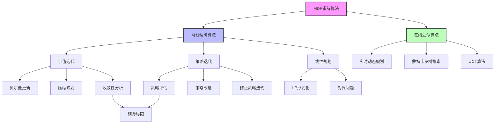

# 17.2 MDP 的算法

## 一、背景与动机

### 1.1 算法需求的产生

在17.1节中，我们建立了马尔可夫决策过程（MDP）的数学框架，定义了最优效用函数和最优策略的概念。然而，理论定义与实际计算之间存在巨大鸿沟。贝尔曼方程虽然优美地刻画了最优性的条件，但它是一组非线性方程（由于max算子的存在），无法直接用线性代数方法求解。这促使研究者们开发出各种算法来实际求解MDP。

### 1.2 计算复杂性的挑战

MDP求解面临的核心挑战包括：

**维度灾难**：对于具有$n$个布尔状态变量的MDP，状态空间大小为$2^n$。即使是中等规模的问题，状态空间也可能达到天文数字。

**非线性问题**：贝尔曼方程中的max算子使得方程组非线性，增加了求解难度。

**精度与效率的权衡**：精确解可能需要大量计算，而近似解的精度保证也是理论研究的焦点。

### 1.3 算法发展的历史脉络

MDP算法的发展经历了几个重要阶段：

**1950年代**：贝尔曼提出价值迭代（Value Iteration），奠定了动态规划的基础。

**1960年代**：霍华德（Ron Howard）提出策略迭代（Policy Iteration），提供了另一种求解思路。

**1970-80年代**：线性规划方法被引入，建立了MDP与优化理论的联系。

**1990年代至今**：随着计算能力的提升，大规模MDP的近似算法、在线算法、以及强化学习方法得到广泛研究。

## 二、知识逻辑图谱

### 2.1 算法分类体系

**按求解精度**：
- 精确算法：价值迭代、策略迭代、线性规划
- 近似算法：实时动态规划、蒙特卡罗方法

**按计算模式**：
- 离线算法：预先计算所有状态的策略
- 在线算法：根据当前状态实时计算动作

**按更新方式**：
- 同步更新：每次迭代更新所有状态
- 异步更新：选择性更新部分状态

## 三、核心概念与数学分析

### 3.1 价值迭代算法

价值迭代（Value Iteration）是最基本也是最广泛使用的MDP求解算法。它基于贝尔曼方程的迭代形式：

$$U_{i+1}(s) = \max_a \sum_{s'} P(s'|s, a)[R(s, a, s') + \gamma U_i(s')]$$

**算法流程**：

1. 初始化：对所有状态$s$，设$U_0(s) = 0$
2. 迭代更新：重复执行贝尔曼更新直到收敛
3. 提取策略：$\pi(s) = \arg\max_a Q(s, a)$

**Q-值计算**：

$$Q(s, a) = \sum_{s'} P(s'|s, a)[R(s, a, s') + \gamma U(s')]$$

### 3.2 压缩映射与收敛性

**贝尔曼算子**：

定义算子$\mathcal{B}$：$(\mathcal{B}U)(s) = \max_a \sum_{s'} P(s'|s, a)[R(s, a, s') + \gamma U(s')]$

**压缩性质**：

对于任意效用函数$U$和$U'$，有：

$$\|\mathcal{B}U - \mathcal{B}U'\|_\infty \leq \gamma \|U - U'\|_\infty$$

这意味着每次迭代，效用估计的误差至少以因子$\gamma$减小。

**收敛速率**：

要达到误差$\varepsilon$，需要的迭代次数为：

$$N = \left\lceil \frac{\log(2R_{\max}/\varepsilon(1-\gamma))}{\log(1/\gamma)} \right\rceil$$

### 3.3 终止条件与误差界限

**实用终止条件**：

当$\|U_{i+1} - U_i\|_\infty < \varepsilon(1-\gamma)/\gamma$时停止，可以保证：

$$\|U_{i+1} - U^*\|_\infty < \varepsilon$$

**策略损失界限**：

如果$\|U_i - U^*\|_\infty < \varepsilon$，则基于$U_i$的贪婪策略$\pi_i$满足：

$$\|U^{\pi_i} - U^*\|_\infty < 2\varepsilon$$

这意味着即使效用估计不完全准确，提取的策略也可能接近最优。

### 3.4 策略迭代算法

策略迭代（Policy Iteration）交替进行策略评估和策略改进：

**算法流程**：

1. 初始化：随机选择策略$\pi_0$
2. 策略评估：计算$U^{\pi_i}$
3. 策略改进：$\pi_{i+1}(s) = \arg\max_a Q^{\pi_i}(s, a)$
4. 重复直到策略不再改变

**策略评估**：

对于固定策略$\pi$，效用函数满足线性方程组：

$$U^{\pi}(s) = \sum_{s'} P(s'|s, \pi(s))[R(s, \pi(s), s') + \gamma U^{\pi}(s')]$$

这可以写成矩阵形式：$U^{\pi} = R^{\pi} + \gamma P^{\pi}U^{\pi}$

解得：$U^{\pi} = (I - \gamma P^{\pi})^{-1}R^{\pi}$

**修正策略迭代**：

精确策略评估需要$O(n^3)$时间。修正策略迭代只进行有限次简化价值迭代：

$$U_{k+1}(s) = \sum_{s'} P(s'|s, \pi(s))[R(s, \pi(s), s') + \gamma U_k(s')]$$

### 3.5 异步策略迭代

异步策略迭代允许在每次迭代中只更新部分状态：

- 选择任意状态子集进行策略评估或改进
- 不需要同步更新所有状态
- 在温和条件下仍保证收敛

优势：
- 可以优先更新重要状态
- 适应分布式计算
- 支持实时应用

### 3.6 线性规划方法

MDP可以表述为线性规划问题：

**原始问题**：

最小化：$\sum_s U(s)$

约束：$U(s) \geq \sum_{s'} P(s'|s, a)[R(s, a, s') + \gamma U(s')]$，对所有$s, a$

**理论意义**：
- 证明了MDP可以在多项式时间内求解
- 建立了与优化理论的联系
- 支持对偶分析

**实际局限**：
- 通常比动态规划方法慢
- 对于大规模问题，变量和约束数量巨大
- 稀疏结构难以充分利用

### 3.7 在线算法

对于状态空间巨大的MDP（如俄罗斯方块有$10^{62}$个状态），离线算法不可行。

**实时动态规划（RTDP）**：

1. 从当前状态出发，构建有限深度的期望最大树
2. 使用启发式评估叶节点
3. 回溯计算当前状态的最优动作
4. 执行动作，观察结果，重复

**$\varepsilon$-期限**：

深度$H$满足：$\frac{\gamma^H R_{\max}}{1-\gamma} < \varepsilon$

超过$H$步的奖励对当前决策影响小于$\varepsilon$。

**蒙特卡罗树搜索（MCTS）**：

- 结合随机采样与树搜索
- UCT算法：使用UCB1公式平衡探索与利用
- 适用于状态空间巨大但可模拟的问题

## 四、定理与证明

### 4.1 价值迭代收敛定理

**定理**：对于折扣因子$\gamma \in [0, 1)$的MDP，价值迭代收敛到唯一的最优效用函数$U^*$。

**证明**：

由压缩映射定理，只需证明$\mathcal{B}$是$\gamma$-压缩。

对于任意$U, U'$和状态$s$：

$$\begin{aligned}
&|\mathcal{B}U(s) - \mathcal{B}U'(s)| \\
&= \left|\max_a \sum_{s'} P(s'|s,a)[R(s,a,s') + \gamma U(s')] - \max_{a'} \sum_{s'} P(s'|s,a')[R(s,a',s') + \gamma U'(s')]\right| \\
&\leq \max_a \left|\sum_{s'} P(s'|s,a)[R(s,a,s') + \gamma U(s')] - \sum_{s'} P(s'|s,a)[R(s,a,s') + \gamma U'(s')]\right| \\
&= \gamma \max_a \left|\sum_{s'} P(s'|s,a)[U(s') - U'(s')]\right| \\
&\leq \gamma \max_a \sum_{s'} P(s'|s,a)|U(s') - U'(s')| \\
&\leq \gamma \max_{s'} |U(s') - U'(s')| \\
&= \gamma \|U - U'\|_\infty
\end{aligned}$$

由Banach不动点定理，迭代收敛到唯一不动点$U^*$。

### 4.2 策略迭代收敛定理

**定理**：策略迭代在有限步内收敛到最优策略。

**证明**：

**策略改进性质**：每次策略改进严格改善效用，除非策略已最优。

设$\pi$为当前策略，$\pi'$为改进后的策略。

对于所有状态$s$：

$$Q^{\pi}(s, \pi'(s)) = \max_a Q^{\pi}(s, a) \geq Q^{\pi}(s, \pi(s)) = U^{\pi}(s)$$

严格不等式至少对一个状态成立（除非$\pi$已最优）。

**有限收敛**：由于策略空间有限（最多$|A|^{|S|}$个），且每次迭代严格改进，算法必在有限步内收敛。

### 4.3 线性规划正确性定理

**定理**：线性规划问题的最优解对应于MDP的最优效用函数。

**证明概要**：

1. 可行性：$U^*$满足所有约束（由贝尔曼方程）
2. 最优性：任何可行解$U$满足$U \geq U^*$（分量-wise）
3. 因此最小化$\sum_s U(s)$得到$U^*$

## 五、具体示例

### 5.1 $4 \times 3$世界的价值迭代

**参数设置**：
- $\gamma = 0.9$
- $R_{\max} = 1$
- 终止状态：(4,3)奖励+1，(4,2)奖励-1
- 其他奖励：-0.04

**迭代过程**：

| 迭代 | U(1,1) | U(1,2) | U(1,3) | U(2,1) | U(2,3) |
|------|--------|--------|--------|--------|--------|
| 0 | 0 | 0 | 0 | 0 | 0 |
| 1 | -0.04 | -0.04 | -0.04 | -0.04 | +0.76 |
| 2 | -0.08 | -0.08 | +0.64 | -0.08 | +0.82 |
| 5 | -0.35 | +0.42 | +0.76 | -0.35 | +0.88 |
| 10 | +0.28 | +0.63 | +0.85 | +0.28 | +0.91 |
| 20 | +0.47 | +0.71 | +0.88 | +0.47 | +0.92 |
| 收敛 | +0.51 | +0.73 | +0.89 | +0.51 | +0.93 |

**观察**：
- 远离目标的状态效用增长较慢
- 正奖励状态(4,3)的效用传播到整个网格
- 负奖励状态(4,2)降低了附近状态的效用

### 5.2 策略迭代示例

**初始策略**：所有状态选择"Up"

**第一次策略评估**：

解线性方程组得到各状态效用。

**第一次策略改进**：

对于状态(1,1)：
- Q(Up) = 0.8×(-0.04 + 0.9×U(1,2)) + 0.1×(-0.04 + 0.9×U(2,1)) + 0.1×(-0.04 + 0.9×U(1,1))
- Q(Right) = ...
- 选择使Q值最大的动作

**收敛**：通常在几次迭代后策略不再改变。

### 5.3 算法效率比较

对于$n$个状态，$m$个动作的MDP：

| 算法 | 每次迭代复杂度 | 迭代次数 | 总复杂度 |
|------|---------------|----------|----------|
| 价值迭代 | $O(nm^2)$ | $O(\frac{1}{1-\gamma}\log\frac{1}{\varepsilon})$ | $O(\frac{nm^2}{1-\gamma}\log\frac{1}{\varepsilon})$ |
| 策略迭代 | $O(n^3)$ | $O(n)$ (最坏情况) | $O(n^4)$ (最坏情况) |
| 修正策略迭代 | $O(knm)$ | $O(n)$ | $O(kn^2m)$ |

实践中，策略迭代通常比价值迭代收敛更快（迭代次数更少），但每次迭代代价更高。

## 六、一句话本质

**MDP求解算法的核心是通过价值迭代或策略迭代的压缩映射原理，将贝尔曼方程的非线性优化问题转化为可计算的迭代过程，在多项式时间内收敛到最优效用函数和策略。**

## 七、总结与反思

### 7.1 算法选择指南

**选择价值迭代当**：
- 需要近似解即可
- 状态空间中等规模
- 实现简单性优先

**选择策略迭代当**：
- 需要精确解
- 策略空间较小
- 每次策略评估代价可接受

**选择在线算法当**：
- 状态空间巨大
- 只有部分状态可达
- 需要实时决策

### 7.2 实现注意事项

1. **数值稳定性**：折扣因子接近1时，数值误差可能累积
2. **稀疏性利用**：转移矩阵通常稀疏，应使用稀疏矩阵运算
3. **并行化**：价值迭代的每次更新可并行
4. ** warm-starting**：相似问题的解可作为初始值

### 7.3 扩展方向

1. **大规模MDP**：函数近似、状态聚合、分层方法
2. **连续MDP**：离散化、策略梯度、 actor-critic方法
3. **鲁棒MDP**：考虑模型不确定性
4. **多目标MDP**：权衡多个奖励函数

### 7.4 与强化学习的联系

本章的离线算法假设已知转移模型$P$和奖励函数$R$。第22章的强化学习处理模型未知的情况：

- 模型-based RL：学习$P$和$R$，然后使用本章算法
- 模型-free RL：直接学习价值函数或策略（如Q-learning）

### 7.5 哲学思考

MDP算法体现了计算理性（computational rationality）——在计算资源约束下做出最优决策。价值迭代和策略迭代代表了两种不同的计算策略：

- 价值迭代：先理解世界（学习效用），再决定行动
- 策略迭代：边行动边理解（交替评估和改进）

这与人类认知的"系统1/系统2"理论有有趣的对照：系统1快速、直觉（类似策略执行）；系统2缓慢、理性（类似策略评估和改进）。
