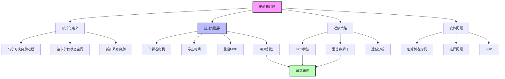

# 17.3 老虎机问题

## 一、背景与动机

### 1.1 探索与利用的经典困境

老虎机问题（Multi-Armed Bandit Problem）是序贯决策中最优雅、最深刻的理论模型之一。它捕捉了决策者在面对不确定性时的核心困境：是选择当前看来最好的选项（利用，exploitation），还是尝试其他可能更好的选项（探索，exploration）？

这个困境在日常生活中无处不在：
- 选择餐厅：去熟悉的好餐厅，还是尝试新开的餐厅？
- 投资决策：继续持有表现良好的股票，还是投资新兴行业？
- 药物试验：使用已知有效的药物，还是测试新疗法？
- 推荐系统：推荐用户喜欢的内容类型，还是尝试新类型的内容？

### 1.2 历史起源

老虎机问题的研究始于第二次世界大战期间。据彼得·惠特尔（Peter Whittle）回忆，这个问题如此困难，以至于盟军科学家建议"把这个问题抛给德国，作为迫害知识分子的终极工具"。

战后，赫伯特·罗宾斯（Herbert Robbins）在1952年的开创性工作使这一问题重新受到关注。然而，研究者们很快发现，许多关于老虎机问题的"明显正确"的直觉实际上是错误的。例如，人们通常认为最优策略最终会确定性地选择最佳臂，但事实上最优策略以正概率持续选择次优臂。

### 1.3 基廷斯的突破

1974年，约翰·基廷斯（John Gittins）和戴维·琼斯（David Jones）取得了突破性进展，证明了基廷斯指数（Gittins Index）策略的最优性。这一结果令人惊讶，因为它表明复杂的多臂老虎机问题可以分解为独立的单臂问题。

基廷斯指数理论的优雅之处在于：它将一个看似需要同时考虑所有臂的全局优化问题，转化为每个臂独立计算的局部问题，然后简单地选择指数最高的臂。

### 1.4 现代应用

老虎机框架在现代社会有广泛应用：

**在线广告**：决定展示哪个广告以最大化点击率
**临床试验**：在多个治疗方案中选择最优方案
**推荐系统**：平衡用户已知偏好与潜在兴趣
**网络路由**：在多条路径中选择最优传输路径
**资源分配**：在多个项目间分配有限资源

## 二、知识逻辑图谱



### 2.1 概念层次结构

**第一层：问题定义**
- 多臂老虎机的数学形式化
- 马尔可夫奖励过程（MRP）
- 折扣累积奖励框架

**第二层：最优解理论**
- 基廷斯指数的定义与计算
- 可索引性条件
- 最优策略的结构

**第三层：实用算法**
- UCB（上置信界）启发式
- 汤普森采样
- 遗憾分析与理论保证

**第四层：扩展变体**
- 伯努利老虎机
- 选择问题
- 老虎机超过程（BSP）

## 三、核心概念与数学分析

### 3.1 老虎机问题的形式化定义

**标准定义**：

一个$n$臂老虎机由以下要素组成：

1. **臂的集合**：$\{M_1, M_2, \ldots, M_n\}$

2. **每个臂$M_i$是一个马尔可夫奖励过程（MRP）**：
   - 状态空间：$S_i$
   - 单一动作：$a_i$
   - 转移模型：$P_i(s'|s, a_i)$
   - 奖励函数：$R_i(s, a_i, s')$

3. **整体问题是一个MDP**：
   - 状态空间：$S = S_1 \times S_2 \times \cdots \times S_n$（笛卡尔积）
   - 动作：选择拉动哪个臂
   - 转移：只有被选中的臂状态更新
   - 折扣因子：$\gamma$

**关键约束**：
- 臂之间相互独立
- 同一时间只能使用一个臂
- 目标是最大化期望折扣累积奖励

### 3.2 马尔可夫奖励过程（MRP）

MRP是只有一个动作的MDP。它产生奖励序列$R_0, R_1, R_2, \ldots$，其中每个$R_t$是随机变量。

**效用计算**：

$$U(M) = \mathbb{E}\left[\sum_{t=0}^{\infty} \gamma^t R_t\right]$$

**确定性奖励序列示例**：

考虑两个臂：
- $M$：奖励序列$0, 2, 0, 7.2, 0, 0, \ldots$
- $M_\lambda$：固定奖励$\lambda, \lambda, \lambda, \ldots$

设$\gamma = 0.5$，计算各臂效用：

$$U(M) = 0 + 0.5 \times 2 + 0 + 0.5^3 \times 7.2 = 1.9$$

$$U(M_\lambda) = \sum_{t=0}^{\infty} 0.5^t \lambda = 2\lambda$$

**最优策略**：

最优策略可能涉及在臂之间切换。例如，从$M$开始，在第4步后切换到$M_\lambda$：

$$U(S) = 0 + 0.5 \times 2 + 0 + 0.5^3 \times 7.2 + \sum_{t=4}^{\infty} 0.5^t \lambda$$

当$\lambda = 1$时，$U(S) = 2.025 > U(M) = 1.9$且$U(S) > U(M_1) = 2.0$。

### 3.3 单臂老虎机与停止时间

**单臂老虎机**：

形式上等价于只有一个臂$M$和固定臂$M_\lambda$的问题。决策是：何时停止拉动$M$并永久切换到$M_\lambda$？

**停止时间$T$**：

停止规则决定的随机时间。在确定性情况下，$T$是简单整数。

**最优停止问题**：

$$\max_T \mathbb{E}\left[\sum_{t=0}^{T-1} \gamma^t R_t + \sum_{t=T}^{\infty} \gamma^t \lambda\right]$$

**转折点分析**：

在最优策略对$M$和$M_\lambda$中立时：

$$\lambda = \max_{T > 0} \frac{\mathbb{E}\left[\sum_{t=0}^{T-1} \gamma^t R_t\right]}{\mathbb{E}\left[\sum_{t=0}^{T-1} \gamma^t\right]}$$

### 3.4 基廷斯指数

**定义**：

臂$M$在状态$s$的基廷斯指数为：

$$\nu(M, s) = (1-\gamma) \cdot V(M^s)$$

其中$V(M^s)$是重启MDP $M^s$的最优价值。

**重启MDP $M^s$**：

在$M$的每个状态添加一个"重启"动作，返回到初始状态$s$，获得奖励和转移与原动作相同。

**计算示例**：

对于确定性序列$0, 2, 0, 7.2, 0, 0, \ldots$：

| $T$ | 1 | 2 | 3 | 4 | 5 | 6 |
|-----|---|---|---|---|---|---|
| $\sum \gamma^t R_t$ | 0 | 1.0 | 1.0 | 1.9 | 1.9 | 1.9 |
| $\sum \gamma^t$ | 1.0 | 1.5 | 1.75 | 1.875 | 1.9375 | 1.9687 |
| 比值 | 0 | 0.667 | 0.571 | **1.013** | 0.981 | 0.965 |

基廷斯指数为$1.013$（最大比值）。

**最优策略**：

始终选择基廷斯指数最高的臂，然后更新该臂的指数。

**可索引性**：

老虎机问题具有可索引性（indexability）：最优策略可以用每个臂的独立指数表示。这一性质大大简化了问题求解。

### 3.5 伯努利老虎机

**定义**：

每个臂$M_i$以未知概率$\mu_i$产生奖励1，以概率$1-\mu_i$产生奖励0。

**状态表示**：

状态由$(s_i, f_i)$表示，即成功和失败的次数。初始化为$(1, 1)$使先验概率为$1/2$。

**转移概率**：

$$P(\text{success}) = \frac{s_i}{s_i + f_i}$$

**基廷斯指数表**：

对于$\gamma = 0.9$，可以计算不同$(s, f)$状态的指数：

| 状态 | $(3,2)$ | $(7,4)$ | $(5,5)$ |
|------|---------|---------|---------|
| 估计值 | 0.6 | 0.636 | 0.5 |
| 基廷斯指数 | 0.706 | 0.692 | 0.609 |

注意：$(3,2)$的指数高于$(7,4)$，尽管估计值较低，因为不确定性提供了探索价值。

### 3.6 UCB算法

**上置信界（Upper Confidence Bound）**：

$$UCB(M_i) = \hat{\mu}_i + g(N) / \sqrt{N_i}$$

其中：
- $\hat{\mu}_i$：臂$i$的样本均值
- $N_i$：臂$i$被拉动的次数
- $N$：总拉动次数
- $g(N)$：适当选择的函数

**理论保证**：

黎子良（Tze Leung Lai）和罗宾斯（Herbert Robbins）证明，任何算法的遗憾（regret）增长速度至少为$O(\log N)$。

使用$g(N) = \sqrt{2 \log N}$的UCB算法达到这一下界。

**UCB1算法**：

$$UCB1(M_i) = \hat{\mu}_i + \sqrt{\frac{2 \ln N}{N_i}}$$

### 3.7 汤普森采样

**基本思想**：

根据臂是实际最优的概率随机选择臂。

**实现**：

1. 为每个臂维护后验分布$P_i(\mu_i)$
2. 从每个分布采样一个值
3. 选择采样值最大的臂
4. 观察结果，更新后验

**贝叶斯更新**：

对于伯努利老虎机，使用Beta分布作为共轭先验：

$$\mu_i \sim \text{Beta}(s_i, f_i)$$

观察到成功：$s_i \leftarrow s_i + 1$
观察到失败：$f_i \leftarrow f_i + 1$

**遗憾界**：

汤普森采样的遗憾也是$O(\log N)$。

### 3.8 选择问题

**与老虎机的区别**：

选择问题（Selection Problem）的目标是尽快确定最佳选项，而非最大化累积奖励。

**应用场景**：

- 药物筛选：确定最有效药物后停止测试
- 供应商选择：找到最佳供应商后开始大规模采购
- 招聘：确定最佳候选人后停止面试

**不可索引性**：

选择问题不具有可索引性。添加第三个臂可能改变对前两个臂的偏好顺序。

### 3.9 老虎机超过程（BSP）

**定义**：

每个臂是一个完整的MDP（而非MRP），有多个可能动作。

**关键洞察**：

全局最优策略可能涉及在每个MDP中采取局部次优的动作。这是因为：

- 机会成本：在一个MDP中追求长期奖励会延迟其他MDP中的奖励
- 折扣效应：早期奖励比晚期奖励更有价值

**示例**：

假设有4个购物中心建设项目：
- 局部最优计划：第15周完成第一个商店
- 局部次优计划：第5周完成第一个商店

全局最优策略是在每个项目中使用次优计划，使租金收入从第5、10、15、20周开始，而非第15、30、45、60周。

**求解方法**：

1. 计算每个臂的上界（使用松弛MDP）
2. 计算每个臂的下界（使用局部最优策略）
3. 如果某臂的下界高于所有其他臂的上界，则选择该臂
4. 否则，使用前瞻搜索重新计算边界

## 四、定理与证明

### 4.1 基廷斯指数最优性定理

**定理**：对于折扣老虎机问题，始终选择基廷斯指数最高的臂的策略是最优的。

**证明概要**：

1. **交换论证**：证明如果最优策略在某步不选择最高指数臂，可以通过交换动作顺序获得不更差的效用。

2. **独立性**：证明每个臂的基廷斯指数仅依赖于该臂的状态，与其他臂无关。

3. **归纳**：通过归纳法证明指数策略的最优性。

### 4.2 UCB遗憾界定理

**定理**：使用$g(N) = \sqrt{2 \ln N}$的UCB算法的累积遗憾为$O(\sqrt{nN \ln N})$，其中$n$是臂数。

**证明概要**：

1. 使用Hoeffding不等式界定估计误差
2. 证明次优臂被拉动的次数有对数界
3. 对所有次优臂求和得到总遗憾界

### 4.3 选择问题不可索引性定理

**定理**：选择问题不具有可索引性。

**证明概要**：

构造反例：
- 臂$M_1$和$M_2$：在两个臂问题中$M_1$优于$M_2$
- 添加臂$M_3$后，最优策略可能改为先测试$M_2$

这表明选择问题不能分解为独立的单臂问题。

## 五、具体示例

### 5.1 两臂老虎机数值示例

**臂A**：确定性奖励序列$0, 2, 0, 7.2, 0, 0, \ldots$
**臂B**：固定奖励$\lambda = 1$
**折扣因子**：$\gamma = 0.5$

**计算过程**：

臂A的基廷斯指数计算：

$$\nu(A) = \max_T \frac{\sum_{t=0}^{T-1} \gamma^t R_t}{\sum_{t=0}^{T-1} \gamma^t}$$

- $T=1$：$0/1 = 0$
- $T=2$：$1/1.5 = 0.667$
- $T=3$：$1/1.75 = 0.571$
- $T=4$：$1.9/1.875 = 1.013$（最大）

臂B的基廷斯指数：$\nu(B) = 1$

**最优策略**：

由于$\nu(A) = 1.013 > \nu(B) = 1$，先拉动臂A。

在观察到前4个奖励后，臂A的指数下降，切换到臂B。

### 5.2 临床试验应用

**场景**：测试3种新疗法治疗某种疾病

**模型**：伯努利老虎机
- 成功 = 患者康复
- 失败 = 治疗无效

**策略比较**：

1. **均匀随机**：每种疗法随机选择
2. **贪婪**：选择当前成功率最高的疗法
3. **UCB**：平衡成功率与不确定性
4. **汤普森采样**：基于贝叶斯后验

**模拟结果**（1000次试验，每种疗法真实成功率：0.6, 0.5, 0.4）：

| 策略 | 平均成功次数 | 识别最佳疗法概率 |
|------|-------------|-----------------|
| 均匀随机 | 500 | 0.33 |
| 贪婪 | 580 | 0.70 |
| UCB | 620 | 0.85 |
| 汤普森采样 | 625 | 0.87 |

### 5.3 在线广告优化

**场景**：网站有5个广告位，需要决定展示哪个广告

**目标**：最大化点击率（CTR）

**老虎机建模**：
- 每个广告是一个臂
- 奖励 = 1（点击）或0（未点击）
- 需要在线学习各广告的CTR

**UCB实现**：

```python
# 伪代码
for t in range(T):
    for ad in ads:
        if n[ad] == 0:
            ucb[ad] = infinity
        else:
            ucb[ad] = clicks[ad]/n[ad] + sqrt(2*log(t)/n[ad])
    
    chosen_ad = argmax(ucb)
    show(chosen_ad)
    observe_click_or_not()
    update_statistics()
```

## 六、一句话本质

**老虎机问题的本质是在探索与利用的永恒张力中，通过基廷斯指数或UCB等策略量化信息价值，将多臂选择的复杂序贯决策分解为可计算的最优停止问题，从而在不确定性下实现累积奖励的最大化。**

## 七、总结与反思

### 7.1 核心要点回顾

1. **探索-利用权衡**：老虎机问题形式化了决策中的核心困境
2. **基廷斯指数**：提供了最优策略的可计算表征
3. **可索引性**：使复杂问题分解为独立子问题成为可能
4. **近似算法**：UCB和汤普森采样提供了实用的次优解
5. **变体问题**：选择问题和BSP扩展了基本框架

### 7.2 理论洞察

**信息的价值**：

老虎机问题量化了信息的经济价值。探索的动机在于获取信息，而信息的价值取决于它可能带来的未来决策改进。

**可索引性的稀缺性**：

基廷斯指数的可索引性是一个特殊性质。许多看似相似的问题（如选择问题、BSP）不具有这一性质，使得最优求解更加困难。

**遗憾最小化**：

从累积奖励最大化转向遗憾最小化，提供了分析算法性能的新视角。$O(\log N)$的下界表明，一定的探索成本是不可避免的。

### 7.3 实践指导

**算法选择**：

- 小规模、已知模型：使用基廷斯指数
- 大规模、在线学习：使用UCB或汤普森采样
- 需要快速实现：UCB更简单
- 需要利用先验知识：汤普森采样更灵活

**超参数调优**：

- UCB中的探索参数需要根据问题调整
- 汤普森采样的先验分布影响早期表现
- 折扣因子的选择反映时间偏好

### 7.4 与其他章节的联系

- **第16章**：老虎机是简单决策（一次性）到序贯决策的桥梁
- **第17.1-17.2节**：老虎机是MDP的特殊结构（独立臂）
- **第22章**：强化学习中的探索-利用平衡直接源于老虎机理论
- **第5章**：蒙特卡罗树搜索中的UCB公式来自老虎机研究

### 7.5 开放问题与未来方向

1. **上下文老虎机**：臂的奖励依赖于上下文特征（特征向量）
2. **对抗性老虎机**：奖励由对手而非随机过程产生
3. **组合老虎机**：同时选择多个臂，有组合约束
4. **连续臂空间**：臂来自连续集合
5. **非平稳环境**：奖励分布随时间变化

### 7.6 哲学思考

老虎机问题揭示了理性决策的本质困境：在信息不完全的情况下，我们无法同时做到最优地利用已知信息和探索未知可能性。基廷斯指数和UCB等策略提供了一种"计算理性"——在计算资源有限的情况下做出近似最优的决策。

这与人类的实际决策行为形成有趣对比。人类往往表现出过度自信（探索不足）或损失厌恶（利用过度）等偏差。理解这些偏差何时是适应性的，何时是认知局限，是行为经济学和人工智能交叉领域的重要课题。

老虎机理论也为"学习即决策"提供了形式化框架。每一次探索都是一次实验，每一次利用都是对已有知识的应用。在这个意义上，老虎机问题是科学方法的数学抽象：通过有控制的实验（探索）来积累知识，然后应用知识来改善世界（利用）。
