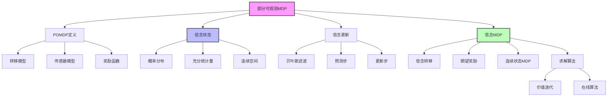

# 17.4 部分可观测 MDP

## 一、背景与动机

### 1.1 从完全可观测到部分可观测

在17.1节和17.2节中，我们假设智能体能够完全观测环境的状态。然而，这一假设在现实世界中很少成立。自动驾驶汽车无法直接观测其他司机的意图；机器人无法精确知道自身位置；医生无法完全了解患者的内部生理状态。在这些场景中，智能体必须基于不完整的观测做出决策。

部分可观测马尔可夫决策过程（Partially Observable MDP, POMDP）是MDP的自然扩展，它允许状态不能直接观测，而是通过带有噪声的传感器间接感知。POMDP为真实世界中的不确定性决策提供了更准确的建模框架。

### 1.2 实际应用场景

**机器人导航**：
- 机器人在室内环境中移动
- 通过激光雷达、摄像头等传感器感知环境
- 传感器读数有噪声，无法精确定位
- 需要同时考虑导航和信息收集

**医疗诊断**：
- 医生根据症状、检查结果诊断疾病
- 检查结果可能有假阳性/假阴性
- 需要决定做哪些检查（信息收集）和治疗方案（行动）

**对话系统**：
- 系统无法直接知道用户的真实意图
- 通过对话历史推断用户状态
- 需要平衡信息询问和提供帮助

**金融欺诈检测**：
- 无法直接观测交易者的真实意图
- 基于交易模式推断欺诈概率
- 需要平衡误报和漏报

### 1.3 计算复杂性的挑战

POMDP比MDP更加困难：

**状态空间爆炸**：信念状态是连续的高维空间（概率分布），即使原始状态空间有限。

**信息价值量化**：智能体需要主动收集信息，这要求评估信息的价值。

**双重不确定性**：转移不确定性和观测不确定性同时存在。

**PSPACE完全性**：一般POMDP的精确求解是PSPACE完全的，意味着计算复杂度极高。

## 二、知识逻辑图谱

### 2.1 概念层次结构

**第一层：问题定义**
- POMDP的数学形式化
- 与MDP的区别（传感器模型）
- 动态决策网络表示

**第二层：信念状态理论**
- 信念状态的定义与性质
- 信念更新的贝叶斯公式
- 信念空间的几何结构

**第三层：转化与求解**
- POMDP到信念MDP的转化
- 连续状态MDP的求解挑战
- 精确与近似算法

**第四层：实际应用**
- 机器人导航
- 对话系统
- 医疗决策
- 自动驾驶

## 三、核心概念与数学分析

### 3.1 POMDP的正式定义

一个POMDP由以下七元组定义：

$$\mathcal{P} = (S, A, P, R, \Omega, O, \gamma)$$

其中：

**$S$：状态空间**
- 与MDP相同，但智能体不能直接观测

**$A$：动作空间**
- 可用的动作集合

**$P(s'|s, a)$：转移模型**
- 与MDP相同，描述状态转移概率

**$R(s, a, s')$：奖励函数**
- 与MDP相同，描述即时奖励

**$\Omega$：观测空间**
- 所有可能的观测值集合

**$O(e|s)$：传感器模型**
- 在状态$s$下观测到$e$的概率

**$\gamma$：折扣因子**
- 与MDP相同

### 3.2 信念状态

**定义**：

信念状态$b$是状态空间上的概率分布：

$$b(s) = \Pr(\text{真实状态} = s | \text{历史观测和动作})$$

**性质**：
- $b(s) \geq 0$ 对所有$s \in S$
- $\sum_{s \in S} b(s) = 1$

**信念空间**：

对于$|S| = n$个状态，信念空间是$n-1$维单纯形：

$$\Delta(S) = \{b \in \mathbb{R}^n : b(s) \geq 0, \sum_s b(s) = 1\}$$

**示例**：

在$4 \times 3$世界的POMDP中，有11个非终止状态，信念空间是10维连续空间。

### 3.3 信念更新

**贝叶斯滤波**：

给定当前信念$b$，执行动作$a$，观测到$e$，新信念$b'$为：

$$b'(s') = \alpha \cdot O(e|s') \sum_s P(s'|s, a) b(s)$$

其中$\alpha$是归一化常数：

$$\alpha = \frac{1}{\sum_{s'} O(e|s') \sum_s P(s'|s, a) b(s)}$$

**Forward算子**：

$$b' = \alpha \cdot \text{Forward}(b, a, e)$$

**两步分解**：

1. **预测步**：基于动作预测新状态分布
   $$\tilde{b}(s') = \sum_s P(s'|s, a) b(s)$$

2. **更新步**：基于观测修正预测
   $$b'(s') = \alpha \cdot O(e|s') \cdot \tilde{b}(s')$$

### 3.4 观测概率

**给定动作和信念的观测概率**：

$$P(e|a, b) = \sum_{s'} O(e|s') \sum_s P(s'|s, a) b(s)$$

这表示在执行动作$a$后，从信念$b$出发观测到$e$的概率。

### 3.5 POMDP到信念MDP的转化

**核心洞察**：

在POMDP中，最优动作只依赖于当前信念状态，而不依赖于真实状态（因为智能体不知道真实状态）。

**信念MDP的定义**：

将POMDP转化为在信念空间上的MDP：

- **状态**：信念$b \in \Delta(S)$
- **动作**：原POMDP的动作$A$
- **转移模型**：
  $$P(b'|b, a) = \sum_e P(b'|e, a, b) \cdot P(e|a, b)$$
  其中$P(b'|e, a, b) = 1$如果$b' = \text{Forward}(b, a, e)$，否则为0。

- **奖励函数**：
  $$\rho(b, a) = \sum_s b(s) \sum_{s'} P(s'|s, a) R(s, a, s')$$

**最优性保持**：

信念MDP的最优策略$\pi^*(b)$也是原POMDP的最优策略。

### 3.6 信念空间的几何性质

**维度**：

对于$n$个状态的POMDP，信念空间是$n-1$维的（因为$\sum_s b(s) = 1$）。

**凸性**：

信念空间是凸集：如果$b_1$和$b_2$是有效信念，则$\lambda b_1 + (1-\lambda) b_2$也是有效信念（对于$\lambda \in [0,1]$）。

**效用函数的形状**：

POMDP的最优效用函数$U(b)$在信念空间上是分段线性和凸的。

**直观解释**：
- 确定性信念（某个$b(s) = 1$）的效用最高
- 不确定性（均匀分布）降低效用
- 信息的价值体现在从不确定到确定的效用提升

### 3.7 信息价值

**定义**：

信息价值 = 有信息时的最优效用 - 无信息时的最优效用

**在POMDP中的体现**：

最优策略通常包括信息收集动作：
- 主动移动到信息丰富的位置
- 执行测试动作以观测环境
- 平衡信息收集与任务完成

**中间信念状态的低效用**：

在$4 \times 3$ POMDP中，当智能体不确定自己在(3,3)还是(1,3)时，效用低于确定在任一状态的情况。这是因为：
- 如果确定在(3,3)，应该选择"Right"
- 如果确定在(1,3)，应该选择"Right"
- 但如果不确定，可能需要先执行信息收集动作

## 四、定理与证明

### 4.1 信念充分性定理

**定理**：对于POMDP，信念状态是充分统计量，即最优策略可以表示为$\pi^*(b)$。

**证明**：

我们需要证明给定信念$b$，历史信息（过去的动作和观测）对最优决策是冗余的。

由贝叶斯更新：
$$b'(s') = \alpha \cdot O(e|s') \sum_s P(s'|s, a) b(s)$$

新信念$b'$只依赖于旧信念$b$、动作$a$和观测$e$，与更早的历史无关。

因此，决策过程具有马尔可夫性：$(b_t, a_t, e_t) \rightarrow b_{t+1}$

最优策略只需要当前信念：$\pi^*(b)$。

### 4.2 信念MDP最优性定理

**定理**：POMDP的最优策略等于其信念MDP的最优策略。

**证明**：

**步骤1**：证明信念MDP的奖励函数正确

$$\rho(b, a) = \mathbb{E}[R | b, a] = \sum_s b(s) \sum_{s'} P(s'|s, a) R(s, a, s')$$

这是给定信念$b$和动作$a$的期望奖励。

**步骤2**：证明信念MDP的转移模型正确

$$P(b'|b, a) = \sum_e P(b'|e, a, b) P(e|a, b)$$

这正确地描述了信念的随机演化。

**步骤3**：由MDP理论，信念MDP的最优策略最大化期望累积奖励

由于信念MDP的奖励和转移与POMDP等价，其最优策略也是POMDP的最优策略。

### 4.3 效用函数凸性定理

**定理**：POMDP的最优效用函数$U^*(b)$在信念空间上是凸的。

**证明概要**：

考虑两个信念$b_1$和$b_2$，以及混合信念$b = \lambda b_1 + (1-\lambda) b_2$。

智能体在$b$可以采取：
1. 执行最优策略，获得$U^*(b)$
2. 以概率$\lambda$假装在$b_1$，以概率$1-\lambda$假装在$b_2$

第二种方式的效用为$\lambda U^*(b_1) + (1-\lambda) U^*(b_2)$。

由于第一种方式是最优的：
$$U^*(b) \leq \lambda U^*(b_1) + (1-\lambda) U^*(b_2)$$

这表明$U^*$是凸函数（注意不等式方向，实际上效用是凹的，价值是凸的）。

## 五、具体示例

### 5.1 $4 \times 3$ POMDP

**设置**：
- 与$4 \times 3$ MDP相同的环境
- 添加噪声传感器：以概率$1-\epsilon$正确报告每个方向是否有墙

**初始信念**：

$$b_0 = (1/9, 1/9, \ldots, 1/9, 0, 0)$$

在9个非终止状态上均匀分布，终止状态概率为0。

**信念更新示例**：

假设智能体在(1,1)执行"Up"，传感器报告"上方有墙，右方无墙"。

可能的状态：
- (1,1)：上方无墙（实际）→ 传感器错误
- (2,1)：上方有墙 → 传感器正确

根据传感器模型和转移模型更新信念。

**决策示例**：

当智能体不确定在(3,3)还是(1,3)时：
- 两个状态下"Right"都是好动作
- 可以直接执行"Right"
- 如果(3,3)和(1,2)不确定，可能需要先执行信息收集动作

### 5.2 两状态POMDP

**简化示例**：

- 两个状态：$S = \{A, B\}$
- 两个动作：Stay（以0.9概率停留），Go（以0.9概率转移）
- 奖励：$R(\cdot, \cdot, A) = 0$，$R(\cdot, \cdot, B) = 1$
- 传感器：以0.6概率正确报告状态
- 折扣因子：$\gamma = 1$

**信念空间**：

可以用一维变量$b(B) \in [0, 1]$表示信念（$b(A) = 1 - b(B)$）。

**一步规划分析**：

- [Stay]的效用：$\alpha_{[Stay]}(A) = 0.1$，$\alpha_{[Stay]}(B) = 0.9$
- [Go]的效用：$\alpha_{[Go]}(A) = 0.9$，$\alpha_{[Go]}(B) = 0.1$

信念$b$下各规划的期望效用：
- $b \cdot \alpha_{[Stay]} = 0.1(1-b(B)) + 0.9b(B) = 0.1 + 0.8b(B)$
- $b \cdot \alpha_{[Go]} = 0.9(1-b(B)) + 0.1b(B) = 0.9 - 0.8b(B)$

**最优策略**：

- 当$b(B) > 0.5$时，选择Stay
- 当$b(B) < 0.5$时，选择Go
- 当$b(B) = 0.5$时，两者等价

### 5.3 机器人定位

**场景**：机器人在走廊中移动，需要确定自身位置

**状态**：离散位置

**动作**：前进、后退、左转、右转

**观测**：墙壁检测（前方、后方、左方、右方是否有墙）

**信念更新**：

1. 初始信念：在所有可能位置均匀分布
2. 执行动作，预测新位置分布
3. 观测墙壁配置，根据传感器模型更新信念
4. 信念逐渐集中在真实位置附近

**信息收集策略**：

- 移动到特征明显的位置（如T字路口）
- 执行旋转动作以获取更多观测
- 在定位准确后再向目标移动

## 六、一句话本质

**部分可观测MDP的本质是通过贝叶斯滤波将状态不确定性量化为信念分布，将原问题转化为连续信念空间上的MDP，使信息收集成为决策的固有组成部分，从而在感知不确定性下实现最优的序贯决策。**

## 七、总结与反思

### 7.1 核心要点回顾

1. **信念状态**：POMDP的核心概念，将状态不确定性表示为概率分布
2. **贝叶斯更新**：信念的递归更新公式，结合预测和观测
3. **信念MDP转化**：POMDP可以转化为连续状态MDP，保持最优性
4. **信息价值**：最优策略主动收集信息，减少不确定性
5. **计算复杂性**：精确求解是PSPACE完全的，需要近似算法

### 7.2 与MDP的关系

| 特性 | MDP | POMDP |
|------|-----|-------|
| 状态可观测性 | 完全可观测 | 部分可观测 |
| 状态空间 | 有限离散 | 信念空间连续 |
| 最优策略 | $\pi^*(s)$ | $\pi^*(b)$ |
| 计算复杂度 | P完全 | PSPACE完全 |
| 信息收集 | 不需要 | 核心组成部分 |

### 7.3 实际应用指导

**建模建议**：
1. 仔细设计状态空间，包含所有决策相关信息
2. 传感器模型应准确反映观测不确定性
3. 奖励函数应平衡任务完成和信息收集

**算法选择**：
1. 小规模问题：使用精确的价值迭代
2. 中等规模：使用基于点的近似方法
3. 大规模：使用在线算法（如POMCP）

### 7.4 与概率推理的联系

POMDP与第14章的概率推理紧密相关：
- 信念更新 = 贝叶斯滤波
- 传感器模型 = 观测模型
- 转移模型 = 动态模型

动态决策网络（DDN）提供了统一的表示框架。

### 7.5 开放问题与未来方向

1. **可扩展性**：如何求解具有数百万状态的POMDP？
2. **学习**：如何从数据中学习POMDP模型？
3. **多智能体**：多个部分可观测智能体的协调
4. **连续状态/观测**：扩展到连续域
5. **安全约束**：如何在部分可观测下保证安全性？

### 7.6 哲学思考

POMDP框架揭示了认知与行动的深刻联系：

**知识即力量**：在POMDP中，信息有直接的经济价值（通过效用提升体现）。这形式化了"知识就是力量"的古老智慧。

**怀疑的价值**：保持适当的不确定性（不急于下结论）可以导致更好的长期决策。这与人类认知中的确认偏误形成对比。

**观察的主动性**：POMDP中的最优策略主动寻求信息，而非被动等待。这体现了科学方法中的主动实验精神。

**认知的代价**：信息收集有代价（时间、资源），最优策略平衡了信息价值与获取成本。这解释了为什么"足够好"的决策往往优于"最优"决策——因为寻找最优解本身有成本。

POMDP理论为人工智能系统提供了一种"谦逊的理性"：承认自身认知的局限（部分可观测），在不确定性中做出最优决策，并主动寻求减少不确定性的机会。这种理性不仅适用于人工系统，也为人类决策提供了规范性指导。
