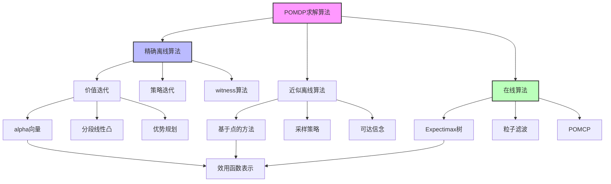

# 17.5 求解 POMDP 的算法

## 一、背景与动机

### 1.1 从理论到算法的挑战

17.4节展示了如何将POMDP转化为信念空间上的MDP，但这一转化本身并不直接提供可计算的求解方法。信念空间是连续的（概率单纯形），维度等于状态数减一，这使得传统的MDP算法（如价值迭代和策略迭代）面临严峻挑战。

对于具有$n$个状态的POMDP，信念空间是$n-1$维连续空间。即使原始状态空间很小（如$4 \times 3$世界的11个状态），信念空间也是10维的。这种"维度灾难"使得离散化方法很快变得不可行。

### 1.2 精确算法的局限

POMDP精确求解的困难性有理论保证：

**PSPACE完全性**：一般POMDP的精确求解是PSPACE完全的。这意味着：
- 算法可能需要指数级空间
- 问题比NP完全问题更难
- 精确解只在非常小规模问题上可行

**历史发展**：
- 1971年：桑迪克（Sondik）提出第一个精确算法
- 1990年代：见证算法（Witness Algorithm）等改进
- 2000年代：基于点的近似方法
- 2010年代：在线算法和蒙特卡罗方法

### 1.3 算法策略的转变

面对计算复杂性，研究者们发展了多种策略：

**精确算法（小规模）**：
- 价值迭代（分段线性凸函数）
- 策略迭代
- 适用于状态数<20的问题

**近似离线算法（中等规模）**：
- 基于点的价值迭代
- 在信念空间采样有限点集
- 适用于状态数<1000的问题

**在线算法（大规模）**：
- 实时计算当前信念的最优动作
- 使用前瞻搜索
- 适用于实际问题（如机器人导航）

## 二、知识逻辑图谱



### 2.1 算法分类体系

**按精度**：
- 精确算法：保证找到最优解
- 近似算法：提供近似保证或启发式解

**按计算模式**：
- 离线算法：预先计算所有信念的策略
- 在线算法：实时计算当前信念的动作

**按表示方法**：
- Alpha向量：分段线性表示
- 有限状态自动机：策略表示
- 粒子集合：近似信念表示

## 三、核心概念与数学分析

### 3.1 价值函数的表示

**分段线性凸性**：

POMDP的最优效用函数$U(b)$在信念空间上是分段线性和凸的（PWLC）。

**Alpha向量表示**：

效用函数可以表示为一组alpha向量的最大值：

$$U(b) = \max_{\alpha \in \Gamma} b \cdot \alpha$$

其中$\Gamma$是alpha向量集合，每个$\alpha$是$|S|$维向量。

**几何解释**：
- 每个alpha向量定义信念空间上的一个超平面
- 效用函数是这些超平面的上包络
- 每个alpha向量对应一个条件规划

### 3.2 条件规划

**定义**：

条件规划$p$是一个树结构，指定：
- 根节点：第一个动作$a$
- 分支：对每个可能观测$e$，指定子规划$p.e$

**效用计算**：

从状态$s$开始执行规划$p$的效用：

$$\alpha_p(s) = \sum_{s'} P(s'|s, a)[R(s, a, s') + \gamma \sum_e O(e|s') \alpha_{p.e}(s')]$$

在信念$b$下的期望效用：

$$U_p(b) = \sum_s b(s) \alpha_p(s) = b \cdot \alpha_p$$

### 3.3 POMDP价值迭代

**算法思想**：

从深度为1的规划开始，逐步构建更深层的规划，同时剔除劣势规划。

**递归公式**：

$$\alpha_p(s) = \sum_{s'} P(s'|s, a)[R(s, a, s') + \gamma \sum_e O(e|s') \alpha_{p.e}(s')]$$

**算法流程**：

1. 初始化：所有一步规划$[a]$，计算$\alpha_{[a]}(s) = \sum_{s'} P(s'|s, a)R(s, a, s')$

2. 迭代：
   - 对每个动作$a$和每个可能的子规划组合，构造新规划
   - 计算新规划的alpha向量
   - 剔除劣势规划（被其他规划在所有信念上支配）

3. 终止：当alpha向量变化小于阈值

**劣势规划剔除**：

规划$p_1$劣势于$p_2$如果：

$$b \cdot \alpha_{p_1} \leq b \cdot \alpha_{p_2}, \quad \forall b \in \Delta(S)$$

这可以通过线性规划检验。

### 3.4 复杂度分析

**规划数量爆炸**：

- 深度$d$的规划数量：$|A|^{|E|^{d-1}}$
- 对于$|A|=2, |E|=4, d=8$：$2^{2^{14}} = 2^{16384}$个规划

**非劣势规划**：

虽然总规划数量双指数增长，但非劣势规划数量增长较慢：
- 上述例子中，非劣势规划约144个

**计算瓶颈**：

- 构造所有可能规划
- 优势检验（线性规划）
- 存储alpha向量

### 3.5 基于点的价值迭代

**核心思想**：

不在整个信念空间上计算价值函数，而是只在采样的信念点集$B = \{b_1, b_2, \ldots, b_m\}$上计算。

**算法流程**：

1. 采样信念点集$B$（通过模拟或启发式）
2. 对每个$b \in B$，计算最优价值
3. 使用这些点近似整个价值函数

**采样策略**：

- 固定网格：在信念空间均匀采样
- 随机采样：从可达信念分布采样
- 贪婪采样：选择能最大化改进的点
- 轨迹采样：模拟执行策略，收集访问的信念

**优势**：
- 避免在不可达信念上浪费计算
- 可以处理更大规模问题
- 提供可调整的精度-效率权衡

### 3.6 在线算法框架

**基本设计**：

在线POMDP智能体的决策循环：

1. **信念更新**：给定当前信念$b$，使用滤波算法更新
2. **动作选择**：以$b$为中心，使用前瞻搜索选择动作
3. **执行与观测**：执行动作，接收观测
4. **重复**：更新信念，继续

**Expectimax树**：

在信念空间构建的决策树：
- 决策节点（Max节点）：选择动作
- 机会节点：观测结果，转移到新信念

**信念转移概率**：

$$P(b'|b, a) = \sum_e P(b'|e, a, b) P(e|a, b)$$

其中$P(b'|e, a, b) = 1$如果$b' = \text{Forward}(b, a, e)$。

### 3.7 蒙特卡罗采样

**动机**：

Expectimax树的分支因子可能巨大（观测空间大小）。蒙特卡罗采样通过随机采样减少分支。

**采样方法**：

在机会节点，不枚举所有可能观测，而是：
1. 从$P(e|a, b)$采样观测
2. 只扩展采样的分支
3. 使用样本均值估计期望价值

**复杂度**：

深度$d$的穷举搜索：$O(|A|^d \cdot |E|^d)$

使用$N$个样本：$O(|A|^d \cdot N^d)$

### 3.8 POMCP算法

**全称**：Partially Observable Monte Carlo Planning

**核心思想**：

结合粒子滤波和UCT（Upper Confidence Tree）算法。

**算法组件**：

1. **粒子滤波**：用粒子集合表示信念
   - 避免精确的信念更新计算
   - 适用于连续或大规模状态空间

2. **UCT算法**：
   - 在搜索树中平衡探索与利用
   - 使用UCB1公式选择节点

**算法流程**：

```
POMCP(信念b, 模型M, 模拟次数N):
  for i = 1 to N:
    从b采样一个状态s
    Simulate(s, 空历史, M)
  return argmax_a Q(空历史, a)

Simulate(s, 历史h, M):
  if h是叶节点:
    扩展节点
    return 启发式估计
  
  a = SelectAction(h)  // UCB1
  (s', e, r) = 从M采样转移和观测
  R = r + γ * Simulate(s', h + (a,e), M)
  
  更新Q(h, a)和访问计数
  return R
```

**优势**：
- 不需要显式的信念更新
- 适用于非常大的状态空间
- 可以处理动态贝叶斯网络模型

## 四、定理与证明

### 4.1 Alpha向量表示定理

**定理**：POMDP的最优效用函数可以表示为有限alpha向量集合的最大值：

$$U^*(b) = \max_{\alpha \in \Gamma^*} b \cdot \alpha$$

**证明概要**：

**归纳基础**：

对于一步规划，效用是线性的：

$$U_{[a]}(b) = \sum_s b(s) \sum_{s'} P(s'|s, a) R(s, a, s') = b \cdot \alpha_{[a]}$$

**归纳步骤**：

假设深度$d-1$规划的效用是分段线性的。深度$d$规划的效用：

$$\alpha_p(s) = \sum_{s'} P(s'|s, a)[R(s, a, s') + \gamma \sum_e O(e|s') \alpha_{p.e}(s')]$$

这是$\alpha_{p.e}$的线性组合，因此也是线性的。

有限个线性函数的最大值是分段线性的。

### 4.2 价值迭代收敛定理

**定理**：POMDP价值迭代收敛到最优效用函数。

**证明**：

定义备份算子$\mathcal{H}$：

$$(\mathcal{H}U)(b) = \max_a [\rho(b, a) + \gamma \sum_e P(e|b, a) U(\text{Forward}(b, a, e))]$$

证明$\mathcal{H}$是压缩映射：

$$\|\mathcal{H}U - \mathcal{H}U'\|_\infty \leq \gamma \|U - U'\|_\infty$$

由Banach不动点定理，迭代收敛到唯一不动点$U^*$。

### 4.3 POMCP收敛定理

**定理**：当模拟次数$N \rightarrow \infty$时，POMCP选择的动作收敛到最优动作。

**证明概要**：

基于UCT算法的收敛性：

1. 在MDP中，UCT的遗憾界为$O(\log N)$
2. POMCP将POMDP转化为信念MDP
3. 粒子滤波提供一致的状态估计
4. 因此POMCP收敛到最优

## 五、具体示例

### 5.1 两状态POMDP的价值迭代

**问题设置**：
- 状态：$S = \{A, B\}$
- 动作：Stay（0.9概率停留），Go（0.9概率转移）
- 奖励：$R(\cdot, \cdot, A) = 0$，$R(\cdot, \cdot, B) = 1$
- 传感器：以0.6概率正确报告
- $\gamma = 1$

**一步规划**：

$$\alpha_{[Stay]}(A) = 0.1, \quad \alpha_{[Stay]}(B) = 0.9$$

$$\alpha_{[Go]}(A) = 0.9, \quad \alpha_{[Go]}(B) = 0.1$$

**效用函数**：

$$U_1(b) = \max\{0.1 + 0.8b(B), 0.9 - 0.8b(B)\}$$

**两步规划**：

对于每个动作和每个可能观测，选择一个子规划。

总共$2 \times 2^2 = 8$个两步规划。

计算每个规划的alpha向量，剔除劣势规划。

**结果**：

- 4个非劣势规划
- 效用函数有4个线性分段
- 最优策略区域划分

### 5.2 $4 \times 3$ POMDP的在线求解

**使用POMCP**：

1. **初始化**：均匀信念，1000个粒子

2. **决策过程**：
   - 当前信念：集中在几个可能位置
   - 构建搜索树，深度=5
   - 每次决策10000次模拟
   - 选择访问次数最多的动作

3. **信念更新**：
   - 执行动作，接收观测
   - 粒子滤波更新
   - 重采样避免退化

**行为示例**：

- 初始：不确定位置，执行信息收集动作
- 中期：信念集中在几个位置，向目标移动
- 后期：精确定位，直接走向目标

### 5.3 算法性能比较

| 算法 | 状态数 | 计算时间 | 解质量 |
|------|--------|----------|--------|
| 精确VI | 5 | 1秒 | 最优 |
| 精确VI | 20 | 1小时 | 最优 |
| 基于点VI | 100 | 10分钟 | 近似 |
| POMCP | 1000+ | 1秒/步 | 启发式 |

## 六、一句话本质

**求解POMDP的算法通过alpha向量表示分段线性凸效用函数，利用基于点的近似和在线蒙特卡罗规划克服连续信念空间的维度灾难，在精确性、计算效率和可扩展性之间寻求最优平衡。**

## 七、总结与反思

### 7.1 核心要点回顾

1. **Alpha向量**：POMDP效用函数的紧凑表示
2. **价值迭代**：通过构建条件规划逐步逼近最优解
3. **基于点的方法**：在采样信念点上近似求解
4. **在线算法**：实时计算当前信念的最优动作
5. **POMCP**：结合粒子滤波和UCT的实用算法

### 7.2 算法选择指南

**小规模（<20状态）**：
- 使用精确价值迭代
- 可以获得最优解和最优策略的精确表示

**中等规模（20-1000状态）**：
- 使用基于点的价值迭代
- 选择适当的采样策略
- 权衡精度与计算时间

**大规模（>1000状态）**：
- 使用POMCP等在线算法
- 设计好的模拟策略
- 接受近似解

### 7.3 与相关领域的联系

**强化学习**：
- 模型未知时的POMDP学习
- 基于模型的方法学习转移和观测模型
- 无模型方法直接学习策略

**控制理论**：
- 部分可观测随机控制
- 分离原理（估计与控制分离）
- 卡尔曼滤波与LQG控制

**认知科学**：
- 人类决策中的信息收集
- 探索-利用权衡
- 元认知（对不确定性的认知）

### 7.4 实际应用建议

**建模阶段**：
1. 仔细定义状态空间，包含所有相关信息
2. 设计准确的传感器模型
3. 平衡奖励函数中的任务完成和信息收集

**求解阶段**：
1. 从简单算法开始，逐步增加复杂度
2. 使用领域知识设计启发式
3. 离线预计算与在线调整结合

**部署阶段**：
1. 监控实际性能与理论预期的差距
2. 设计安全机制处理模型误差
3. 持续学习改进模型

### 7.5 开放问题与未来方向

1. **可扩展性**：如何求解具有数百万状态的POMDP？
2. **结构化表示**：利用问题结构（如因子化、对称性）
3. **分层POMDP**：抽象层次上的决策
4. **多智能体POMDP**：多个部分可观测智能体的协调
5. **安全POMDP**：在部分可观测下保证安全性
6. **终身学习**：持续改进模型和策略

### 7.6 哲学思考

POMDP求解算法体现了在不确定性下理性决策的计算极限：

**理性的代价**：

精确理性（最优解）在复杂环境中计算上不可行。实用理性需要接受近似和启发式。

**知识表示的困境**：

Alpha向量表示虽然优雅，但规模随问题复杂度指数增长。这反映了知识表示的根本困境：表达力与可处理性的权衡。

**在线与离线的哲学**：

离线算法追求"一劳永逸"的解决方案，在线算法接受"边走边看"。这对应于两种不同的世界观：决定论vs.开放未来。

**近似的智慧**：

POMCP等算法表明，在复杂问题中，好的近似往往优于差的精确解。这与"足够好"（satisficing）的决策理论相呼应。

POMDP算法的发展史是人工智能追求"理性智能体"的缩影：从精确但不可扩展的理论，到实用但近似的算法，再到结合学习和推理的自适应系统。这一演进反映了AI领域对"智能"理解的深化——智能不仅是计算最优解的能力，更是在资源约束下做出适应性决策的能力。
