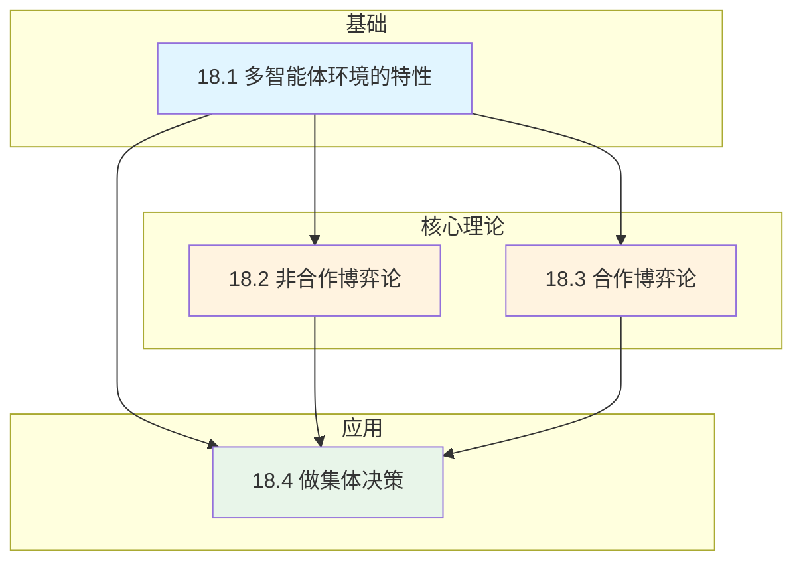
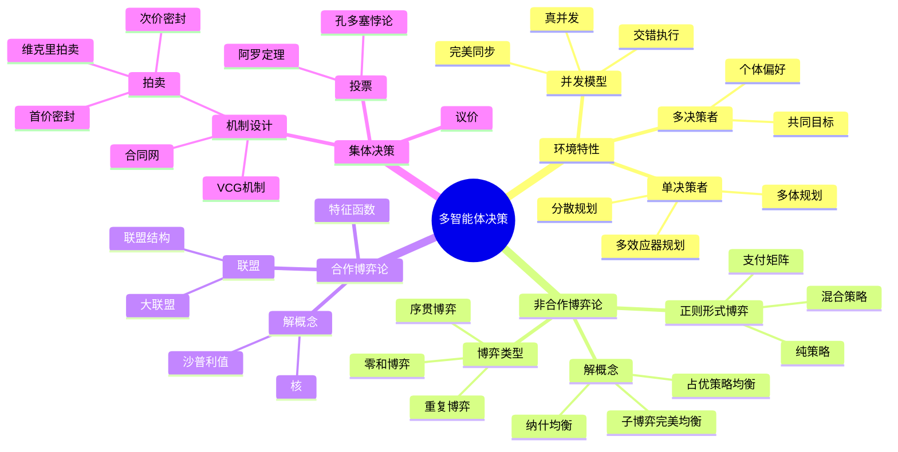

# 第18章 多智能体决策 - 概览

## 📚 本章速览

多智能体决策研究当环境中存在多个智能体时如何进行决策的问题。本章从多智能体环境的特性出发，深入探讨非合作博弈论、合作博弈论以及集体决策机制三大核心主题。

### 本章定位
```
┌─────────────────────────────────────────────────────────┐
│  人工智能                                                │
│  ├── 单智能体决策 (第16-17章)                            │
│  │   ├── 不确定性下的决策                                 │
│  │   └── 序贯决策 (MDP/POMDP)                            │
│  └── 多智能体决策 ← 本章                                  │
│      ├── 18.1 多智能体环境的特性                          │
│      ├── 18.2 非合作博弈论                                │
│      ├── 18.3 合作博弈论                                  │
│      └── 18.4 做集体决策                                  │
└─────────────────────────────────────────────────────────┘
```

---

## 🎯 学习目标

完成本章学习后，你将能够：

### 知识目标
1. **理解**多智能体环境的分类（单决策者、多决策者、合作/非合作）
2. **掌握**非合作博弈论的核心概念：纳什均衡、占优策略、混合策略
3. **掌握**合作博弈论的解概念：核（Core）、沙普利值（Shapley Value）
4. **理解**集体决策机制：拍卖、投票、议价

### 技能目标
1. **能够**为给定的博弈找出纳什均衡（包括混合策略均衡）
2. **能够**计算合作博弈的核和沙普利值
3. **能够**分析不同拍卖机制的性质（效率、激励相容性）
4. **能够**应用博弈论分析现实世界中的多智能体场景

### 思维目标
1. **建立**战略思维——理解"他考虑我考虑他的考虑..."的递归推理
2. **培养**机制设计思维——理解规则如何影响行为
3. **掌握**均衡分析——从个体理性推导集体结果

---

## ⚠️ 难度预警

### 难度等级：⭐⭐⭐⭐☆ (4/5)

| 难点 | 说明 | 建议 |
|------|------|------|
| **递归推理** | "我认为他认为我认为..."的无限递归 | 画图辅助，从简单例子入手 |
| **数学符号** | 大量数学表示和证明 | 逐步推导，验证每一步 |
| **多重均衡** | 一个博弈可能有多个均衡 | 关注均衡精炼概念 |
| **计算复杂性** | 均衡计算可能是指数级 | 理解近似算法和启发式 |

### 关键挑战
1. **均衡选择问题**：多个纳什均衡时如何选择？
2. **社会困境**：个体理性导致集体次优结果（囚徒困境）
3. **策略性操纵**：智能体可能歪曲偏好以获得更好结果

---

## 📋 前置知识

### 必需前置知识
- **第2章**：智能体的基本概念、环境属性
- **第5章**：对抗搜索和博弈、极小化极大算法
- **第16章**：效用理论、决策网络
- **第17章**：MDP基础、序贯决策

### 有助理解的知识
- **概率论基础**：期望值计算、条件概率
- **线性代数**：矩阵运算、线性规划基础
- **经济学基础**：供需关系、边际效用

### 数学基础要求
| 概念 | 重要性 | 应用场景 |
|------|--------|----------|
| 概率论 | ⭐⭐⭐⭐⭐ | 混合策略、期望效用 |
| 线性规划 | ⭐⭐⭐⭐ | 零和博弈求解 |
| 组合数学 | ⭐⭐⭐ | 联盟结构分析 |
| 博弈树 | ⭐⭐⭐⭐⭐ | 扩展形式博弈 |

---

## 🔗 节依赖图



### 学习路径建议
1. **标准路径**：18.1 → 18.2 → 18.3 → 18.4（推荐）
2. **应用导向**：18.1 → 18.4（拍卖/投票）→ 回顾18.2-18.3
3. **理论深入**：18.1 → 18.2 → 18.3 → 深入研究均衡概念

---

## 🧩 核心概念图谱



---

## 📖 概念对比表

### 合作 vs 非合作博弈

| 特性 | 非合作博弈 | 合作博弈 |
|------|------------|----------|
| **核心假设** | 无法达成约束性协约 | 可以达成约束性协约 |
| **决策单元** | 个体智能体 | 联盟/群体 |
| **主要问题** | 个体如何选择最优策略 | 如何形成联盟并分配收益 |
| **解概念** | 纳什均衡、占优策略 | 核、沙普利值 |
| **典型应用** | 竞争市场、扑克 | 合作任务分配、成本分摊 |

### 博弈形式的比较

| 博弈形式 | 时序 | 信息 | 典型例子 | 求解方法 |
|----------|------|------|----------|----------|
| 正则形式 | 同时 | 完全 | 囚徒困境、猜拳 | 寻找纳什均衡 |
| 扩展形式 | 序贯 | 完全/不完全 | 象棋、扑克 | 逆向归纳 |
| 重复博弈 | 多轮 | 完全 | 重复囚徒困境 | 无名氏定理 |
| 合作博弈 | - | - | 联盟形成 | 核、沙普利值 |

### 拍卖机制对比

| 机制 | 投标方式 | 支付方式 | 占优策略 | 效率 |
|------|----------|----------|----------|------|
| 英式拍卖 | 公开递增 | 最后出价 | 当价格<估值时出价 | 是 |
| 首价密封 | 密封投标 | 自己的出价 | 无 | 否 |
| 次价密封 | 密封投标 | 第二高价 | 出价=真实估值 | 是 |
| VCG | 密封投标 | 外部性价格 | 报告真实估值 | 是 |

---

## ⚡ 核心要点速查

### 关键定理与结果

1. **纳什定理**：每个有限博弈至少存在一个纳什均衡（可能包含混合策略）

2. **极小化极大定理**：二人零和博弈存在最优混合策略，且博弈值为
   $$U_{E,O} = U_{O,E} = U^*$$

3. **无名氏定理**：在无限重复博弈中，任何使所有参与者至少获得安全值的结果都可以作为纳什均衡维持

4. **阿罗定理**：对于≥3个结果的投票，不存在同时满足帕累托、IIA和非独裁的社会福利函数

5. **Gibbard-Satterthwaite定理**：对于≥2个结果，任何满足帕累托的社会选择函数要么可操纵，要么是独裁

### 重要公式

**混合策略纳什均衡条件**：
$$U_i(s_i^*, s_{-i}^*) \geq U_i(s_i, s_{-i}^*), \quad \forall s_i, \forall i$$

**沙普利值**：
$$\phi_i(G) = \frac{1}{n!} \sum_{p \in \mathcal{P}} mc_i(p_i)$$

**VCG支付**：
$$tax_i = \sum_{j \notin W} v_j - \sum_{j \in W \setminus \{i\}} v_j$$

---

## 🔍 常见误解澄清

### 误解1："非合作博弈意味着参与者不能合作"
**纠正**：非合作仅指没有约束性协约，智能体仍可能自发合作（如囚徒困境中的相互选择"拒绝指证"）。

### 误解2："纳什均衡一定是对参与者最好的结果"
**纠正**：纳什均衡是稳定点，不一定是帕累托最优。囚徒困境的(testify, testify)就是典型例子。

### 误解3："博弈论只适用于零和博弈"
**纠正**：博弈论研究一般和博弈，包括合作博弈、非零和博弈等。

### 误解4："沙普利值总是存在于核中"
**纠正**：沙普利值可能不在核中。核可能为空，而沙普利值总是存在。

### 误解5："真值暴露机制总能防止操纵"
**纠正**：真值暴露是指如实报告是占优策略，但仍可能存在多个占优策略。

---

## 📝 本章测验

### 快速自测（5分钟）

**问题1**：囚徒困境中，如果双方都选择"拒绝指证"，结果是？
- A. 纳什均衡
- B. 帕累托最优
- C. 占优策略均衡
- D. 子博弈完美均衡
<details>
<summary>答案</summary>
B. 帕累托最优 (但不是纳什均衡)
</details>

**问题2**：在二人零和博弈中，混合策略纳什均衡的值等于？
- A. 极大化极小值
- B. 极小化极大值
- C. A和B
- D. 都不是
<details>
<summary>答案</summary>
C. A和B（根据极小化极大定理）
</details>

**问题3**：沙普利值的核心思想是？
- A. 平均分配
- B. 按边际贡献分配
- C. 按协商能力分配
- D. 按投入成本分配
<details>
<summary>答案</summary>
B. 按边际贡献分配
</details>

**问题4**：VCG机制的特点不包括？
- A. 真值暴露
- B. 效用最大化
- C. 计算效率高
- D. 激励相容
<details>
<summary>答案</summary>
C. VCG在最坏情况下需要指数时间计算最优分配
</details>

**问题5**：以下哪个不是阿罗定理的条件？
- A. 帕累托条件
- B. 无关选项的独立性
- C. 传递性
- D. 非独裁
<details>
<summary>答案</summary>
C. 传递性（虽然期望社会福利函数具有传递性，但这不是阿罗定理的条件之一）
</details>

---

## 📚 快速复习卡

### 核心术语（一页纸总结）

| 术语 | 一句话定义 | 关键公式/特点 |
|------|------------|---------------|
| **纳什均衡** | 给定他人策略，无人愿意单方面偏离 | $U_i(s_i^*, s_{-i}) \geq U_i(s_i, s_{-i})$ |
| **占优策略** | 无论对手如何行动都是最优的策略 | 对所有$s_{-i}$，$U_i(s_i^*, s_{-i}) \geq U_i(s_i, s_{-i})$ |
| **混合策略** | 按概率分布随机选择纯策略 | $[p:a; (1-p):b]$ |
| **核** | 不被任何联盟阻止的分配集合 | $\forall C, x(C) \geq v(C)$ |
| **沙普利值** | 基于边际贡献的公平分配 | 平均所有排列下的边际贡献 |
| **VCG机制** | 激励相容的机制设计 | 支付=对他人造成的损失 |

### 关键博弈示例

| 博弈 | 类型 | 关键特征 | 启示 |
|------|------|----------|------|
| 囚徒困境 | 非合作/同时 | 个体理性≠集体最优 | 需要协调机制 |
| 猜硬币 | 零和/同时 | 无纯策略均衡 | 需要随机化 |
| 重复囚徒困境 | 重复博弈 | 合作可能通过惩罚威胁维持 | 长期互动改变激励 |
| 最后通牒博弈 | 序贯/完全信息 | 先动优势 | 耐心与权力 |

---

## 🔗 扩展阅读

### 必读经典
1. **Nash, J. (1950)**. Equilibrium points in n-person games. *PNAS*.
   - 纳什均衡的原始论文

2. **von Neumann & Morgenstern (1944)**. *Theory of Games and Economic Behavior*.
   - 博弈论奠基之作

3. **Shapley, L.S. (1953)**. A value for n-person games. 
   - 沙普利值的原始论文

### 教材推荐
- **Osborne & Rubinstein (1994)**. *A Course in Game Theory* - 理论深入
- **Nisan et al. (2007)**. *Algorithmic Game Theory* - 计算视角
- **Leyton-Brown & Shoham (2008)**. *Essentials of Game Theory* - 简明入门

### 在线资源
- [Game Theory .net](http://www.gametheory.net) - 教学资源
- [Stanford Encyclopedia of Philosophy: Game Theory](https://plato.stanford.edu/entries/game-theory/)

---

## 💡 学习建议

### 理论学习
1. **画图辅助**：博弈论中许多概念（如支付矩阵、博弈树）可视化后更易理解
2. **从简单开始**：先掌握2×2博弈，再扩展到一般情况
3. **多做练习**：计算纳什均衡、沙普利值等需要熟练的数学技巧

### 应用实践
1. **寻找现实例子**：拍卖、投票、议价在现实生活中的实例
2. **编程实现**：尝试实现简单的均衡求解算法
3. **案例分析**：分析真实的多智能体系统（如Uber调度、电力市场）

### 常见学习路径
```
第1周：18.1-18.2 非合作博弈基础
  - 完成所有例题计算
  - 练习囚徒困境、猜拳等经典博弈

第2周：18.2-18.3 博弈类型与合作博弈
  - 理解重复博弈和序贯博弈
  - 掌握核和沙普利值计算

第3周：18.4 机制设计
  - 分析不同拍卖机制
  - 理解阿罗定理的含义

第4周：综合复习
  - 完成习题
  - 尝试综合案例分析
```

---

*本章概览生成时间：2026年4月10日*
*适用教材：《人工智能：现代方法》第4版 第18章*
