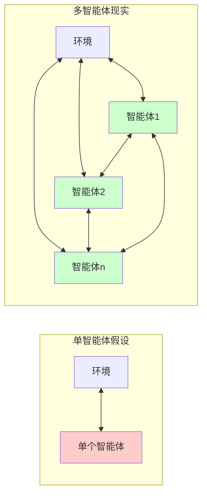
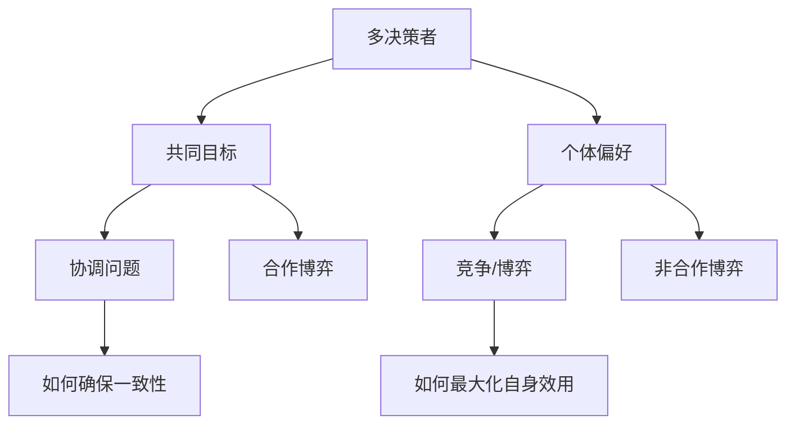
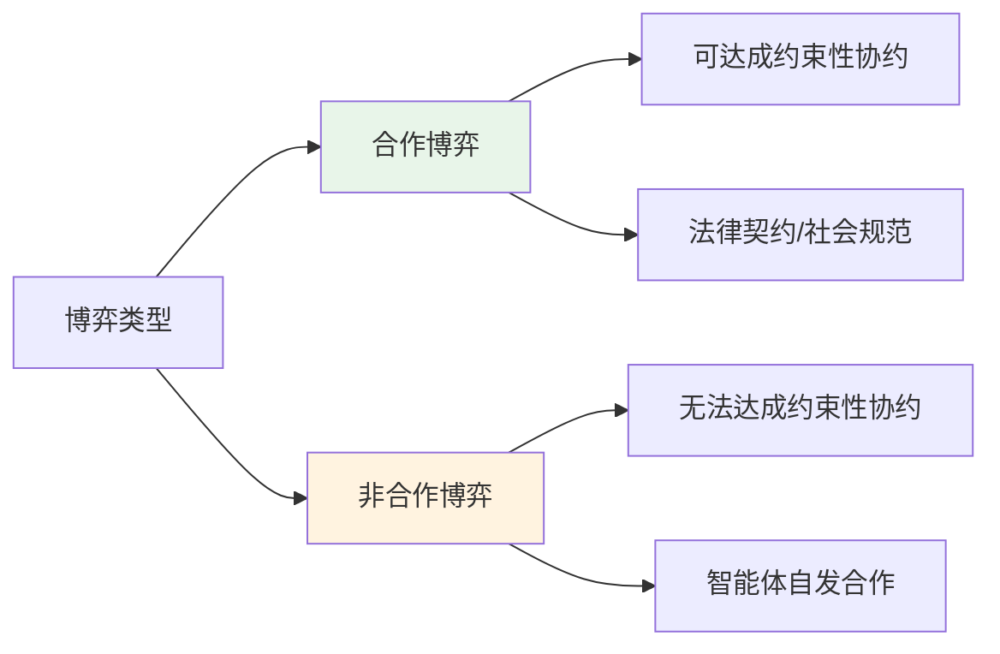
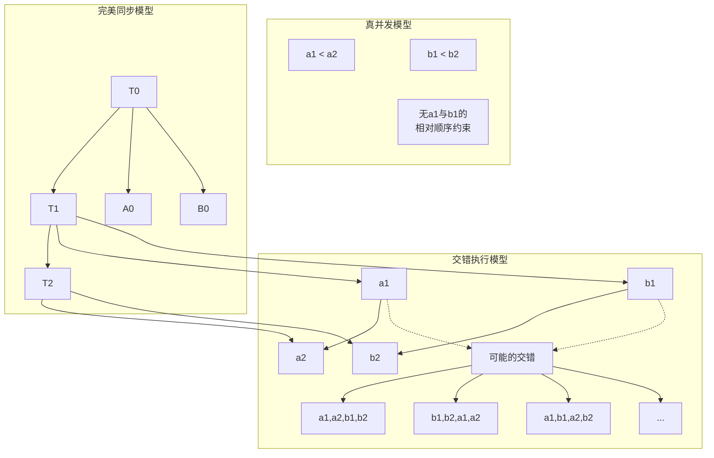
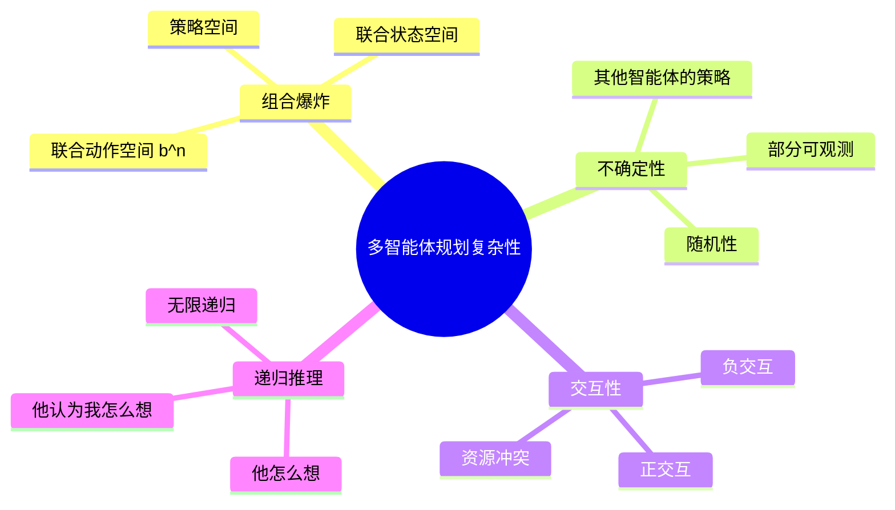
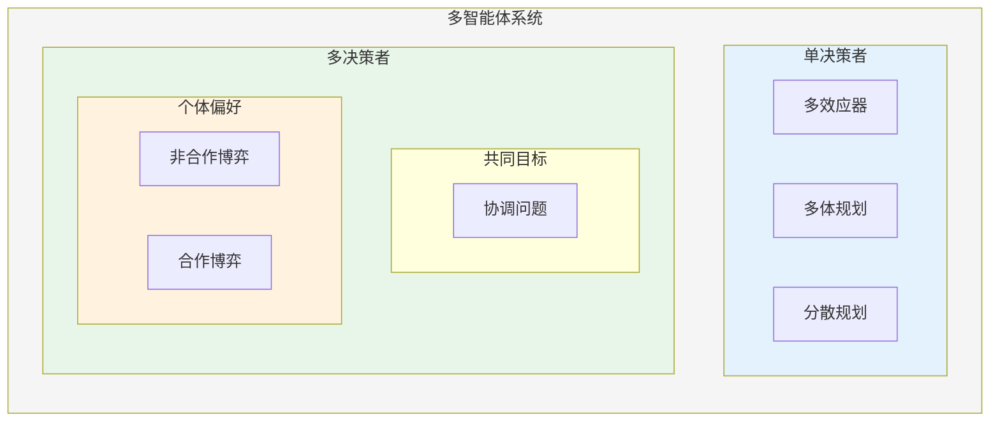
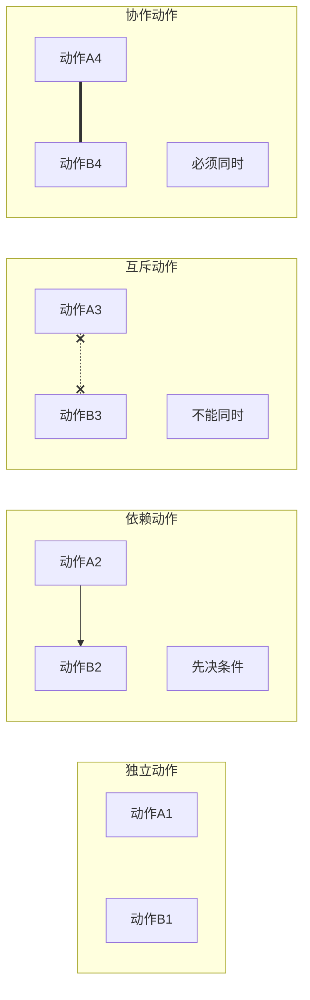
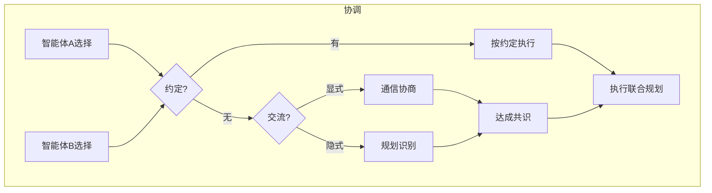

# 18.1 多智能体环境的特性

## 背景动机

### 为什么要研究多智能体系统？

在之前的章节中，我们假设环境中**只有一个**智能体在进行感知、规划和行动。然而，这种假设极大地简化了现实世界的复杂性。

**现实世界的多智能体场景**：
- 🚗 **自动驾驶**：道路上多辆自动驾驶汽车需要协调避碰
- 🤖 **机器人团队**：仓库中多个机器人协作搬运货物
- 📊 **金融市场**：多个交易算法相互竞争
- 🎮 **电子竞技**：AI玩家与人类玩家的对抗与合作
- 🌐 **互联网协议**：路由器之间的流量调度



**多智能体系统的核心挑战**：
1. **协调问题**：多个智能体如何同步行动？
2. **竞争问题**：利益冲突时如何决策？
3. **通信问题**：如何有效交换信息？
4. **推理递归**："他考虑我考虑他的考虑..."

---

## 核心概念

### 18.1.1 单个决策者

#### 仁者假设（Benevolent Agent Assumption）

即使环境中有多个行动者，如果只有一个决策者，且其他智能体**完全服从**指令，这就是**单决策者**场景。

**关键特征**：
- 决策者为所有智能体制定规划
- 智能体简单地执行被告知的事情
- 主要问题是**动作同步**而非策略选择

#### 动作类型

| 动作类型 | 描述 | 例子 |
|----------|------|------|
| **联合动作** | 多个行动者同时执行 | 二重唱、协作搬运 |
| **互斥动作** | 行动者在不同时间执行 | 轮流充电 |
| **序贯动作** | 一个动作为另一个建立先决条件 | A洗碗，B烘干 |

#### 从多效应器到多智能体

```
┌─────────────────────────────────────────────────────┐
│                    演变路径                           │
├─────────────────────────────────────────────────────┤
│  多效应器规划 → 多体规划 → 分散规划 → 多智能体规划      │
├─────────────────────────────────────────────────────┤
│  • 单个智能体的多个效应器                             │
│  • 多个物理上解耦的主体                               │
│  • 规划集中，执行解耦                                 │
│  • 多个自主决策者                                     │
└─────────────────────────────────────────────────────┘
```

**集中 vs 分散规划**：

| 特征 | 集中规划 | 分散规划 |
|------|----------|----------|
| **规划阶段** | 集中进行 | 集中进行 |
| **执行阶段** | 集中控制 | 部分解耦 |
| **通信需求** | 高（实时控制） | 中等（信息共享） |
| **容错性** | 低（单点故障） | 高（局部自治） |

---

### 18.1.2 多决策者

当环境中存在多个决策者，每个都有自己的偏好时，我们进入**博弈论**的领域。

#### 两种多决策者场景



**场景1：共同目标**
- 同一家公司的员工
- 共同目标：公司利益最大化
- 主要挑战：**协调问题**（Coordination Problem）

**场景2：个体偏好**
- 各自追求自身利益
- 可能一致、冲突或混合
- 需要**博弈论**分析

#### 博弈论的应用方式

| 应用方式 | 描述 | 例子 |
|----------|------|------|
| **智能体设计** | 分析决策，计算期望效用 | 对抗性游戏中的策略选择 |
| **机制设计** | 设计规则使个体理性=集体最优 | 拍卖协议设计、路由协议 |

#### 合作博弈 vs 非合作博弈



**关键区别**：
- **合作博弈**：智能体可以签订具有约束力的协议
- **非合作博弈**：没有中心协约保证合作，但智能体可能自发合作

---

### 18.1.3 多智能体规划

#### 并发模型

多智能体规划的核心挑战是处理**并发**（concurrency）。

**三种并发模型**：



| 模型 | 特点 | 优点 | 缺点 |
|------|------|------|------|
| **交错执行** | 保持各自动作顺序 | 易于实现 | 动作数量指数增长 |
| **真并发** | 偏序关系 | 理论精确 | 实践中使用较少 |
| **完美同步** | 全局时钟同步 | 语义简单 | 现实性有限 |

#### 联合动作与转移模型

**单智能体**：
- 动作空间：$|A| = b$ 种选择
- 转移模型：$Result(s, a) \rightarrow s'$

**多智能体（n个智能体）**：
- 联合动作空间：$|\langle a_1, \cdots, a_n \rangle| = b^n$
- **指数级爆炸问题！**

**解决方案**：
1. **解耦假设**：智能体间无交互 → 分别求解n个单智能体问题
2. **松散耦合**：智能体间交互有限 → 约束满足技术

#### 网球双打示例

```
┌─────────────────────────────────────────┐
│           网球双打问题                   │
├─────────────────────────────────────────┤
│  智能体：A, B（双打队友）                │
│  位置：左/右底线、左/右网前              │
│  动作：Go(to)、Hit(Ball)、NoOp          │
│  目标：Returned(Ball) ∧ 网前有人覆盖     │
└─────────────────────────────────────────┘
```

**规划1**：
- A: Go(RightBaseline), Hit(Ball)
- B: Go(RightNet), NoOp

**问题**：当两个智能体同时击球时怎么办？

**解决方案——并发动作约束**：

```
Action(Hit(actor, Ball),
  CONCURRENT: ∀b b≠actor ⇒ ¬Hit(b, Ball)
  PRECOND: Approaching(Ball, loc) ∧ At(actor, loc)
  EFFECT: Returned(Ball))
```

**需要同时发生的动作**（如协作搬运）：
```
Action(Carry(actor, cooler, here, there),
  CONCURRENT: ∃b b≠actor ∧ Carry(b, cooler, here, there)
  PRECOND: At(actor, here) ∧ At(cooler, here)
  EFFECT: At(actor, there) ∧ At(cooler, there))
```

---

### 18.1.4 多智能体规划：合作与协调

#### 多重规划问题

当每个智能体制定自己的规划时，即使目标和知识共享，也存在**多个**可以实现目标的联合规划。

**网球双打例子**：

| 规划 | 智能体A的动作 | 智能体B的动作 |
|------|--------------|--------------|
| **规划1** | Go(RightBaseline), Hit(Ball) | Go(RightNet), NoOp |
| **规划2** | Go(LeftNet), NoOp | Go(RightBaseline), Hit(Ball) |

**问题**：如果A选择规划1，B选择规划2，结果如何？
- 没有人击球！目标失败。

如果A选择规划2，B选择规划1：
- 两人都尝试击球！可能失败。

#### 协调机制

**机制1：约定（Convention）**

约定是对联合规划选择的任意约束。

```
例子：
• "一直保持在你负责的半场"
• "靠右行驶"（社会准则）
• 共同语言的发展
```

**机制2：交流（Communication）**

```
┌─────────────────────────────────────────┐
│            协调交流机制                  │
├─────────────────────────────────────────┤
│  显式交流：                               │
│    • 口头："我的！" / "你的！"           │
│    • 信号：手势、灯光                     │
│                                          │
│  隐式交流（规划识别）：                    │
│    • 通过执行动作传达偏好                │
│    • A冲到网前 → B推断B应回底线          │
└─────────────────────────────────────────┘
```

---

## 详细解释

### 为什么多智能体规划如此困难？

#### 复杂性来源



#### 解耦策略详解

**核心思想**：如果智能体间交互很少，可以分别规划再处理冲突。

**形式化**：
- 设智能体$i$的动作只影响状态变量子集$V_i$
- 如果$V_i \cap V_j = \emptyset$对所有$i \neq j$，则完全解耦
- 如果$|V_i \cap V_j|$很小，则松散耦合

**CSP类比**：
- 第6章的约束满足问题中，树状约束图可高效求解
- 类似地，稀疏交互的多智能体系统也可高效求解

### 并发执行模型深入

#### 交错执行模型的数学描述

给定两个规划：
- A: $[a_1, a_2, \ldots, a_m]$
- B: $[b_1, b_2, \ldots, b_n]$

可能的交错数：$\binom{m+n}{m} = \frac{(m+n)!}{m!n!}$

**示例**：
- A: $[a_1, a_2]$（2个动作）
- B: $[b_1, b_2]$（2个动作）

可能的交错：$\binom{4}{2} = 6$ 种
```
[a1, a2, b1, b2]
[a1, b1, a2, b2]
[a1, b1, b2, a2]
[b1, a1, a2, b2]
[b1, a1, b2, a2]
[b1, b2, a1, a2]
```

**问题**：当n个智能体，每个有m个动作时，交错数为$\binom{nm}{m, m, \ldots, m}$（多项式系数），随n指数增长！

#### 真并发的偏序表示

**偏序关系** $\prec$ 满足：
- $a_1 \prec a_2$（A规划内的顺序）
- $b_1 \prec b_2$（B规划内的顺序）
- 无$a_i$与$b_j$之间的顺序约束

**线性扩展**：每个交错执行都是偏序的一个线性扩展。

**偏序的优势**：
1. 更紧凑的表示
2. 更自然的并行语义
3. 但实践中实现复杂

---

## 示例详解

### 示例1：工厂配送机器人

**场景**：
- 两个配送机器人R1和R2
- 初始：都在仓库
- 任务：R1配送货物到A区，R2配送货物到B区

**分析**：
- 如果A区和B区路径不重叠：**完全解耦**
  - 分别规划即可
- 如果路径有交叉口：**松散耦合**
  - 需要协调通过交叉口的顺序

**并发约束**：
```
CONCURRENT: ¬(At(R1, Intersection) ∧ At(R2, Intersection))
```

### 示例2：协作搬运

**场景**：两个机器人需要协作搬运一个重物。

**问题**：
- 单个机器人无法搬运
- 需要同时执行Carry动作

**动作定义**：
```
Action(Carry(robot, object, from, to),
  CONCURRENT: ∃r r≠robot ∧ Carry(r, object, from, to)
  PRECOND: At(robot, from) ∧ At(object, from) ∧ Heavy(object)
  EFFECT: At(robot, to) ∧ At(object, to))
```

**正确规划**：
- R1: Carry(Box, RoomA, RoomB)
- R2: Carry(Box, RoomA, RoomB)

**两个动作必须同时发生**，否则都失败。

### 示例3：交通规则中的约定

**场景**：两车相向而行，需要同时通过狭窄桥梁。

**可能的约定**：
1. **靠右行驶约定**：双方都靠右，安全通过
2. **信号灯约定**：约定一方等待
3. **优先级约定**：大车优先/先到先行

**分析**：
- 约定可以是任意的，但必须**共同知识**
- 在AI系统中，约定可以预先编程
- 在社会系统中，约定通过法律或习俗建立

---

## 可视化

### 多智能体系统分类图



### 动作关系图



### 协调机制比较



---

## 常见陷阱

### 陷阱1：忽视并发约束

**错误假设**：只要每个智能体的子规划正确，联合规划就正确。

**反例**：网球双打中两个智能体同时击球。

**解决方案**：
- 显式建模并发约束
- 使用动作排除公理

### 陷阱2：混淆单决策者与多决策者

**常见错误**：将多决策者问题当作单决策者问题处理。

**后果**：
- 假设智能体会服从指令（实际上可能不会）
- 忽略其他智能体的策略性推理

**判断标准**：
- 是否有约束性协约？
- 其他智能体是否有自主决策权？

### 陷阱3：低估组合复杂性

**直觉**：两个智能体各10个动作，似乎"只是"20个动作。

**现实**：可能的交错执行有$\binom{20}{10} = 184,756$种！

**应对策略**：
1. 寻找松散耦合结构
2. 使用启发式搜索
3. 考虑分层规划

### 陷阱4：忽视共同知识问题

**场景**：A知道B会靠右行驶，B也知道A会靠右行驶...

**问题**：但这是否足够？需要**共同知识**（我知道你知道我知道...）。

**实践启示**：
- 在AI系统中，可以通过共享代码确保
- 在人类社会中，通过文化/教育建立

### 陷阱5：过度简化交流

**错误假设**：交流总能解决协调问题。

**现实问题**：
- 通信延迟和失败
- 信息过载
- 策略性误报（欺骗）

---

## 与其他节的联系

### 与第5章的联系

| 第5章（对抗搜索） | 第18章（多智能体） |
|-------------------|-------------------|
| 两个玩家，零和 | n个玩家，一般和 |
| 完美信息 | 可能不完全信息 |
| 纯策略 | 混合策略更普遍 |
| 极小化极大 | 纳什均衡 |

### 与第11章的联系

多智能体规划扩展了经典规划：
- **经典规划**：$Result(s, a) \rightarrow s'$
- **多智能体规划**：$Result(s, \langle a_1, \ldots, a_n \rangle) \rightarrow s'$
- 需要并发动作约束

### 与第17章的联系

| 第17章（MDP） | 第18章（博弈论） |
|---------------|------------------|
| 单智能体决策 | 多智能体决策 |
| 环境随机 | 环境+其他智能体 |
| 最优策略 | 均衡策略 |

**马尔可夫博弈**（随机博弈）是两者的结合。

---

## 知识点总结

### 核心概念清单

1. **多智能体环境分类**
   - [ ] 单决策者 vs 多决策者
   - [ ] 合作博弈 vs 非合作博弈
   - [ ] 共同目标 vs 个体偏好

2. **并发模型**
   - [ ] 交错执行
   - [ ] 真并发（偏序）
   - [ ] 完美同步

3. **协调机制**
   - [ ] 约定（社会准则）
   - [ ] 显式交流
   - [ ] 隐式交流（规划识别）

4. **博弈论应用**
   - [ ] 智能体设计
   - [ ] 机制设计

### 关键公式

**联合动作数量**：$b^n$（n个智能体，每个有b个动作）

**交错执行数**：$\binom{n \cdot m}{m, m, \ldots, m}$（多项式系数）

### 重要定理

**解耦原理**：如果智能体间无交互，可分别求解n个单智能体问题。

---

## 延伸阅读

- **Durfee, E.H. (1999)**. Distributed problem solving and planning. *Multiagent Systems*.
- **Boutilier & Brafman (2001)**. Partial-order planning with concurrent interacting actions.
- **Grosz & Kraus (1996)**. Collaborative plans for complex group action.
