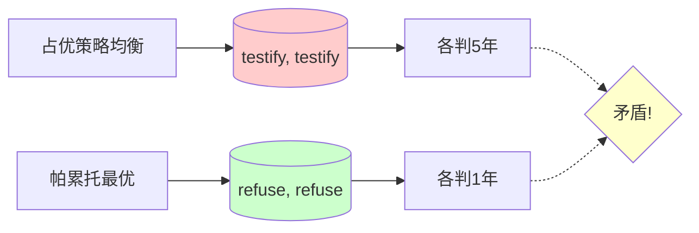
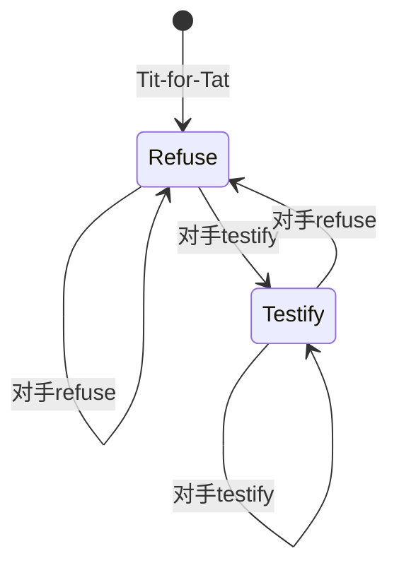
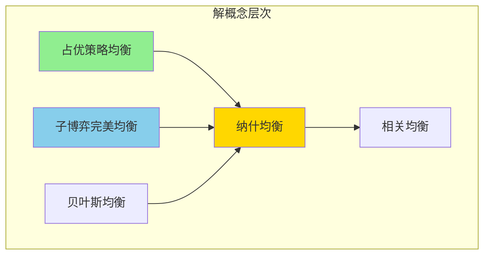
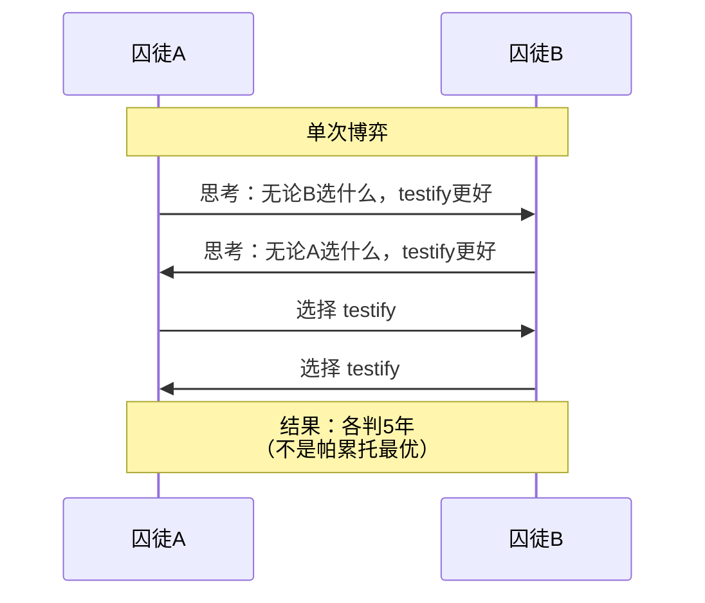
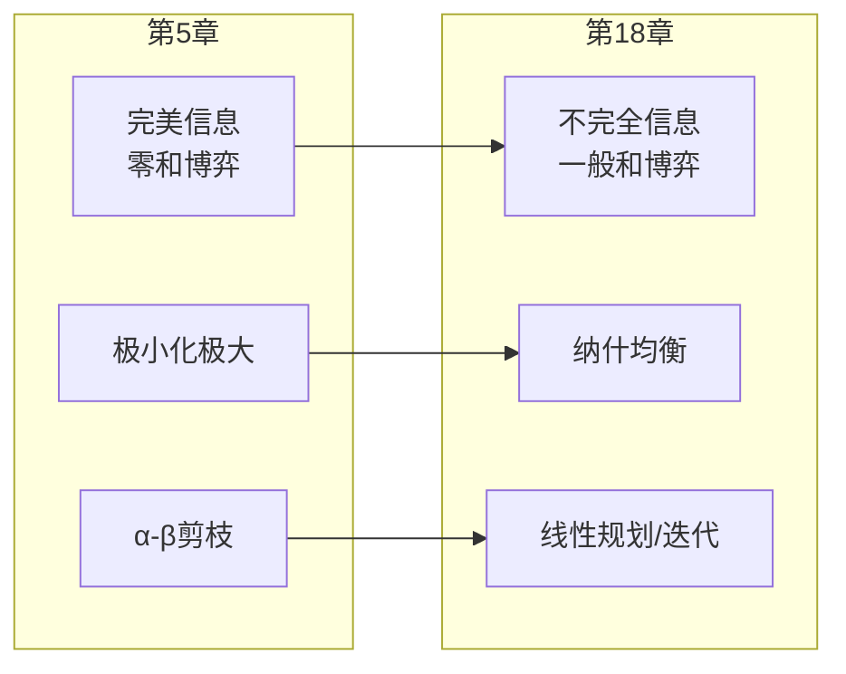

# 18.2 非合作博弈论

## 背景动机

### 为什么需要博弈论？

当多个智能体各自追求自己的偏好时，简单的效用最大化不再适用。**为什么？**

```
问题：智能体E应该选择什么动作？
┌─────────────────┬─────────────────┐
│                 │    O: one       │    O: two      │
├─────────────────┼─────────────────┼────────────────┤
│    E: one       │   E=+2, O=-2    │   E=-3, O=+3   │
├─────────────────┼─────────────────┼────────────────┤
│    E: two       │   E=-3, O=+3    │   E=+4, O=-4   │
└─────────────────┴─────────────────┴─────────────────┘

• 如果E选one：收益可能是+2或-3
• 如果E选two：收益可能是-3或+4

E的实际收益取决于O的选择！
```

**关键洞察**：在多智能体环境中，智能体必须考虑其他智能体的行为，而其他智能体也在考虑你的行为——这就形成了**递归推理**。

### 博弈论 vs 决策论

| 特征 | 决策论（第16章） | 博弈论（本章） |
|------|-----------------|----------------|
| **参与者** | 单个决策者 | 多个决策者 |
| **环境** | 随机（自然） | 策略性（其他智能体） |
| **最优性** | 期望效用最大化 | 均衡策略 |
| **不确定性** | 概率分布 | 其他智能体的策略 |

**博弈论的广泛应用**：
- 💰 拍卖设计（频谱拍卖、在线广告）
- 🏢 企业竞争策略
- 🌍 国际谈判与军备竞赛
- 🤖 多智能体AI系统

---

## 核心概念

### 18.2.1 单步博弈：正则形式博弈

#### 正则形式博弈的三要素

```mermaid
flowchart TB
    A[正则形式博弈<br/>G = (N, A, U)] --> B[参与者<br/>N = {1, 2, ..., n}]
    A --> C[动作集合<br/>A = A₁ × A₂ × ... × Aₙ]
    A --> D[支付函数<br/>U = (U₁, U₂, ..., Uₙ)]
    
    B --> E[玩家1]
    B --> F[玩家2]
    B --> G[...]
    
    C --> H[动作one]
    C --> I[动作two]
    
    D --> J[每个结果<br/>的效用值]
```

#### 支付矩阵表示

**两指猜拳**（Two-finger Morra）：

```
        O: one    O: two
      ┌─────────┬─────────┐
E:one │ E=+2    │ E=-3    │
      │ O=-2    │ O=+3    │
      ├─────────┼─────────┤
E:two │ E=-3    │ E=+4    │
      │ O=+3    │ O=-4    │
      └─────────┴─────────┘
```

**规则**：两人同时出1或2个手指，令$f$为总手指数
- $f$为奇数：O向E收取$f$美元
- $f$为偶数：E向O收取$f$美元

#### 策略类型

| 策略类型 | 定义 | 表示 |
|----------|------|------|
| **纯策略** | 确定性地选择单个动作 | "one" 或 "two" |
| **混合策略** | 按概率分布随机选择 | $[p:one; (1-p):two]$ |

**混合策略示例**：
- $[0.5:one; 0.5:two]$：以50%概率选择one，50%选择two
- $[0.7:one; 0.3:two]$：以70%概率选择one，30%选择two

#### 囚徒困境

```
        A:testify    A:refuse
      ┌────────────┬────────────┐
B:test│ A=-5, B=-5 │ A=-10,B=0  │
ify   │            │            │
      ├────────────┼────────────┤
B:ref │ A=0, B=-10 │ A=-1, B=-1 │
use   │            │            │
      └────────────┴────────────┘
```

**故事背景**：
- 两个嫌疑犯A和B被捕，被单独审讯
- 如果一方指证另一方：指证者获释(0)，被指证者判10年(-10)
- 如果相互指证：各判5年(-5)
- 如果都拒绝指证：各判1年(-1)

---

### 解概念

#### 占优策略均衡

**定义**：策略$s$**强占优**于$s'$，如果对于其他参与者的**所有**策略选择，$s$的结果都严格优于$s'$。

**囚徒困境分析**（从A的角度）：

```
情况1：假设B选择testify
  • A选testify：-5年
  • A选refuse：-10年
  → testify更好 ✓

情况2：假设B选择refuse
  • A选testify：0年（获释）
  • A选refuse：-1年
  → testify更好 ✓

结论：testify是A的占优策略！
```

B的推理相同，因此(testify, testify)是**占优策略均衡**。

**占优策略均衡的性质**：
- 每个参与者都没有动机偏离
- 偏离不会带来更好结果，只会更糟
- 是一个非常强的解概念

#### 囚徒困境的"困境"



**困境核心**：个体理性导致集体次优结果。

**如何解决？**
1. **合作博弈**：允许具有约束力的协约
2. **重复博弈**：参与者知道会再次相遇
3. **道德信念**：效用函数不同（不同的博弈）

#### 纳什均衡

**定义**：在其他参与者保持策略不变的前提下，没有一个参与者能够单方面改变自己的策略而获得更高收益。

**形式化**：
$$U_i(s_i^*, s_{-i}^*) \geq U_i(s_i, s_{-i}^*), \quad \forall s_i, \forall i$$

**纳什均衡 vs 占优策略均衡**：
- 占优策略均衡一定是纳什均衡
- 纳什均衡不一定是占优策略均衡
- 不是所有博弈都有占优策略均衡，但**每个有限博弈至少有一个纳什均衡**（可能包含混合策略）

**示例：协调博弈**

```
        A:l      A:r
      ┌────────┬────────┐
B:t   │A=10    │A=0     │
      │B=10    │B=0     │
      ├────────┼────────┤
B:b   │A=0     │A=1     │
      │B=0     │B=1     │
      └────────┴────────┘
```

**分析**：
- 无占优策略
- 两个纳什均衡：(t, l) 和 (b, r)
- (t, l) 帕累托优于 (b, r)

**协调问题**：
- 两个均衡都稳定
- 但参与者希望协调到同一个均衡
- 需要额外机制（如焦点）

#### 混合策略纳什均衡

**猜硬币游戏**：

```
        A:heads    A:tails
      ┌──────────┬──────────┐
B:head│ A=+1     │ A=-1     │
s     │ B=-1     │ B=+1     │
      ├──────────┼──────────┤
B:tail│ A=-1     │ A=+1     │
s     │ B=+1     │ B=-1     │
      └──────────┴──────────┘
```

**特点**：
- 无纯策略纳什均衡
- 存在混合策略纳什均衡：双方以50%概率选择heads/tails

**为什么50%是最优的？**

假设B选择heads的概率为0.6，tails为0.4：
- A选择heads的期望收益：$0.6 \times 1 + 0.4 \times (-1) = 0.2$
- A选择tails的期望收益：$0.6 \times (-1) + 0.4 \times 1 = -0.2$

A会确定性地选择heads。但此时B应该调整策略以应对...

**均衡条件**：
在混合策略均衡中，每个纯策略的期望收益必须**相等**（否则玩家会偏向收益更高的那个）。

---

### 18.2.2 社会福利与帕累托最优

#### 帕累托最优

**定义**：如果没有其他结果可以在**不损害他人利益**的情况下使一个参与者变得更好，那么这个结果就是帕累托最优。

**图示**：

```mermaid
xychart-beta
    title "帕累托最优前沿"
    x-axis [0, 1, 2, 3, 4, 5]
    y-axis [0, 1, 2, 3, 4, 5]
    
    line "可行集边界" { x: [0, 1, 2, 3, 4, 5], y: [5, 4, 3, 2, 1, 0] }
    scatter "帕累托最优点" { x: [1, 2, 3, 4], y: [4, 3, 2, 1] }
    scatter "非帕累托点" { x: [2], y: [2] }
```

#### 功利主义社会福利

$$SW_{utilitarian} = \sum_{i} U_i$$

**问题**：
1. 不关心效用的分配公平性
2. 假设效用的可比较性（共同尺度）

#### 平等主义社会福利

$$SW_{egalitarian} = \min_i U_i$$

**最大化最小值原则**：最大化社会中最贫困成员的效用。

#### 囚徒困境的社会福利分析

| 结果 | A的效用 | B的效用 | 功利主义 | 平等主义 |
|------|---------|---------|----------|----------|
| (testify, testify) | -5 | -5 | -10 | -5 |
| (refuse, refuse) | -1 | -1 | -2 | -1 |

**结论**：(refuse, refuse)同时最大化两种社会福利，但不是纳什均衡！

---

### 18.2.3 计算均衡

#### 纯策略均衡计算

**穷举搜索**：
1. 遍历所有可能的策略组合
2. 检查每个参与者是否有偏离的动机
3. 如果没有，则为纳什均衡

**复杂度**：$O(m^n)$，其中$m$是每个参与者的动作数，$n$是参与者数

**短视最佳反应（迭代最佳反应）**：
1. 随机选择初始策略组合
2. 如果某参与者在他人选择下非最优，切换到最优策略
3. 重复直到收敛

**收敛性**：对某些博弈类型保证收敛，对一般博弈可能不收敛。

#### 零和博弈的求解

**冯·诺依曼的极小化极大定理**：

对于二人零和博弈：
$$U_{E,O} \leq U \leq U_{O,E}$$

其中：
- $U_{E,O}$：E先展示策略，O后响应的博弈值
- $U_{O,E}$：O先展示策略，E后响应的博弈值

**两指猜拳的求解**：

```
E先选择混合策略[p:one; (1-p):two]

如果O选择one：期望支付 = 2p - 3(1-p) = 5p - 3
如果O选择two：期望支付 = -3p + 4(1-p) = 4 - 7p

O会选择较低的那个（最小化E的收益）
E会在交点处最大化：5p - 3 = 4 - 7p
解得：p = 7/12

同理，q = 7/12

博弈值：U = -1/12
```

**结论**：
- 最优混合策略：[7/12:one; 5/12:two]
- E的期望收益：-1/12（负值意味着O有优势）
- 这既是极大化极小均衡，也是纳什均衡

#### 线性规划求解

寻找混合策略均衡可以表述为**线性规划**问题：

**变量**：$p_1, p_2, \ldots, p_m$（E的混合策略概率）

**目标**：最大化$v$（博弈值）

**约束**：
- $\sum_i p_i = 1$（概率归一化）
- $\sum_i p_i \cdot U_E(i, j) \geq v$，对所有$j$（对O的所有纯策略）
- $p_i \geq 0$

**复杂度**：可在多项式时间内求解。

---

### 18.2.4 重复博弈

#### 有限重复囚徒困境

**设定**：囚徒困境重复进行100轮，双方都知道轮数。

**逆向归纳分析**：

```
第100轮：
  • 实际上是单次囚徒困境
  • 结果：(testify, testify)

第99轮：
  • 第100轮的结果已确定
  • 不影响当前决策
  • 结果：(testify, testify)

...

第1轮：
  • 结果：(testify, testify)
```

**结论**：在有限重复且轮数已知的情况下，每轮都是(testify, testify)。

#### 无限重复博弈

**表示**：使用**有限状态机（FSM）**表示策略。

**常见FSM策略**（见图18-3）：



| 策略 | 描述 |
|------|------|
| **Dove** | 总是refuse |
| **Hawk** | 总是testify |
| **Tit-for-Tat** | 以refuse开始，然后复制对手上一轮的动作 |
| **Grim** | 以refuse开始，一旦对手testify，永远testify |

#### 无名氏定理（Folk Theorem）

**基本形式**：在无限重复博弈中，使所有参与者至少获得其**安全值**的每一个结果都可以作为一个纳什均衡维持。

**安全值**：参与者能够保证获得的最佳收益（无论对手如何行动）。

**Grim策略的关键作用**：
- 合作奖励：继续选择(refuse, refuse)
- 背叛惩罚：一旦背叛，永远(testify, testify)
- 惩罚威胁使参与者保持一致

---

### 18.2.5 序贯博弈：扩展形式

#### 扩展形式 vs 正则形式

| 特征 | 正则形式 | 扩展形式 |
|------|----------|----------|
| **时序** | 同时移动 | 序贯移动 |
| **表示** | 支付矩阵 | 博弈树 |
| **信息** | 所有参与者同时决策 | 可能有信息集 |
| **求解** | 寻找纳什均衡 | 逆向归纳 |

#### 完美信息博弈

**定义**：参与者做出决策时，准确知道自己在博弈树中的位置（对之前发生的一切完全了解）。

**求解方法——逆向归纳**：

```
从终止节点开始回溯：
  1. 对每个决策节点，选择使当前参与者收益最大的动作
  2. 用该收益标注节点
  3. 回溯到根节点
```

**性质**：
- 保证终止
- 多项式时间复杂度
- 结果是**子博弈完美纳什均衡**

#### 子博弈完美纳什均衡

**反直觉的例子**：

```
        [1]
       /   \
   above   below
     /        \
   [2]        (0,0)
  /   \
up    down
|      |
(1,1) (0,0)
```

**纳什均衡**：
1. (above, up) → 收益(1,1) ✓
2. (below, down) → 收益(0,0) ✓（但down不是可信威胁！）

**子博弈完美**：只有(above, up)

**定义**：策略组合是子博弈完美的，如果它是**每个子博弈**的纳什均衡。

#### 不完美信息

**信息集**：参与者无法区分的状态集合。

**简化扑克示例**（见图18-5）：

```
Chance发牌后：
  玩家1知道自己有A，但不知道玩家2的牌
  → 信息集I₁,₁（持有A的所有情况）
  
  玩家2知道自己有A且看到玩家1加码
  但不知道玩家1的具体牌
  → 信息集I₂,₁
```

**求解方法**：
1. 转换为正则形式（指数级）
2. 使用序列形式（线性于博弈树规模）
3. 使用抽象技术处理大规模博弈

---

## 详细解释

### 纳什均衡的数学推导

#### 双人博弈的混合策略均衡

设：
- 玩家E的混合策略：$p$ = 选择one的概率
- 玩家O的混合策略：$q$ = 选择one的概率

**两指猜拳**：

E的期望收益：
$$U_E = pq(2) + p(1-q)(-3) + (1-p)q(-3) + (1-p)(1-q)(4)$$

简化：
$$U_E = 2pq - 3p + 3pq - 3q + 3pq + 4 - 4p - 4q + 4pq$$
$$U_E = 12pq - 7p - 7q + 4$$

**均衡条件**：
在均衡中，O的选择应使E无法通过改变$p$来提高收益。

这意味着$U_E$不应依赖于$p$，即$p$的系数为0：
$$12q - 7 = 0 \Rightarrow q = 7/12$$

同理：$p = 7/12$

**博弈值**：
$$U_E = 12 \times \frac{7}{12} \times \frac{7}{12} - 7 \times \frac{7}{12} - 7 \times \frac{7}{12} + 4 = -\frac{1}{12}$$

### 重复博弈的数学分析

#### 均值极限

对于无限支付序列$(U_0, U_1, U_2, \ldots)$，效用定义为：

$$\lim_{T \rightarrow \infty} \frac{1}{T} \sum_{t=0}^{T} U_t$$

对于FSM策略，这个极限总是存在（因为FSM最终会进入循环）。

#### Grim策略的纳什均衡证明

**命题**：在无限重复囚徒困境中，(Grim, Grim)是纳什均衡。

**证明**：

假设A偏离Grim策略。设A在第$t$轮首次选择testify。

- 前$t-1$轮：双方都选择refuse，每轮收益-1
- 第$t$轮：A得0，B得-10
- 第$t+1$轮起：B转为Grim的惩罚模式，永远testify
  - A的最佳应对也是testify
  - 每轮收益-5

A的总效用：
$$U_A^{deviate} = \frac{-(t-1) + 0 - 5\infty}{\infty} = -5$$

A坚持Grim的效用：
$$U_A^{Grim} = -1$$

因为$-5 < -1$，偏离无利可图。

**结论**：(Grim, Grim)是纳什均衡。

---

## 示例详解

### 示例1：两指猜拳分析

**支付矩阵**：
```
        O:one    O:two
E:one   (2,-2)   (-3,3)
E:two   (-3,3)   (4,-4)
```

**纯策略分析**：
- E无占优策略
- O无占优策略
- 无纯策略纳什均衡

**混合策略求解**：
- E的最优：$p = 7/12$
- O的最优：$q = 7/12$
- 博弈值：$-1/12$

**实际含义**：
- 充当O角色更有利（期望收益+1/12）
- 如果E采用$p \neq 7/12$，O可以获利
- 随机化是理性的必要手段

### 示例2：协调博弈的焦点

**支付矩阵**：
```
        A:l      A:r
B:t     (10,10) (0,0)
B:b     (0,0)   (1,1)
```

**均衡**：(t,l) 和 (b,r)

**焦点效应**：
- (t,l)帕累托优于(b,r)
- 理性的参与者会协调到(t,l)
- 焦点是指"显而易见"的结果

**现实世界**：
- "靠右行驶"约定
- 标准时间（格林威治时间）
- 键盘布局（QWERTY）

### 示例3：最后通牒博弈

**规则**：
1. A提出分配方案$(x, 1-x)$
2. B接受：按方案分配
3. B拒绝：双方都得到0

**逆向归纳**：
- B应该接受任何$x > 0$（因为0 < 任何正数）
- A知道这一点，提出$(1, 0)$
- B接受

**现实偏离**：
- 实验中，人们通常拒绝"不公平"的分配
- 说明人类有效用函数中的"公平"成分
- 或考虑声誉效应（重复博弈）

---

## 可视化

### 纳什均衡概念图



### 囚徒困境动态



### 混合策略的几何解释

```
期望收益
  │
4 ┤    \   /
  │     \ /
3 ┤      X ← O的最佳响应
  │     / \
2 ┤    /   \
1 ┤   /     \
0 ┤──/───────\───
  │  0   7/12  1   p
-1┤           E的最优在交点
  │
  └────────────────
    
两条线分别代表O选择one/two时E的收益
```

---

## 常见陷阱

### 陷阱1：混淆博弈值与均衡策略

**错误**：认为知道博弈值就等于知道如何玩。

**纠正**：
- 博弈值是期望收益
- 达到该值需要正确的混合策略
- 偏离混合策略可能导致损失

### 陷阱2：忽视混合策略的必要性

**错误**：认为随机化是非理性的。

**纠正**：
- 在猜硬币等博弈中，纯策略会被预测和利用
- 混合策略是纳什均衡的一部分
- 需要物理随机源（骰子、量子随机）

### 陷阱3：误判重复博弈的影响

**错误**：认为有限重复会改变单次博弈的均衡。

**纠正**：
- 有限且轮数已知：逆向归纳导致每次(testify, testify)
- 无限或轮数不确定：可能维持合作

### 陷阱4：混淆不同类型的均衡

| 均衡类型 | 适用场景 | 强度 |
|----------|----------|------|
| 占优策略均衡 | 所有博弈 | 最强 |
| 纳什均衡 | 所有有限博弈 | 中 |
| 子博弈完美 | 扩展形式 | 精炼 |
| 贝叶斯均衡 | 不完全信息 | 扩展 |

### 陷阱5：忽视计算复杂性

**现实**：
- 寻找纳什均衡是PPAD完全的
- 两人零和博弈可用线性规划求解
- 大规模博弈需要近似算法

---

## 与其他节的联系

### 与第5章的对比



### 与第17章的结合

**马尔可夫博弈**（随机博弈）：
- 结合MDP的序贯决策
- 结合博弈论的多智能体
- 状态转移同时受随机性和智能体策略影响

---

## 知识点总结

### 核心公式

**纳什均衡条件**：
$$U_i(s_i^*, s_{-i}^*) \geq U_i(s_i, s_{-i}^*), \quad \forall s_i$$

**零和博弈值**：
$$U_{E,O} = U_{O,E} = U^*$$

**混合策略均衡求解**：
所有纯策略的期望收益相等

### 关键定理

1. **纳什存在性定理**：每个有限博弈至少有一个纳什均衡
2. **极小化极大定理**：二人零和博弈存在最优混合策略
3. **无名氏定理**：无限重复博弈可以维持合作

### 算法复杂度

| 问题 | 复杂度 | 方法 |
|------|--------|------|
| 纯策略均衡 | $O(m^n)$ | 穷举搜索 |
| 两人零和博弈 | 多项式 | 线性规划 |
| 一般两人博弈 | PPAD完全 | 支持枚举+线性规划 |
| 三人及以上 | 困难 | 非线性方程 |

---

## 延伸阅读

- **Nash, J. (1950)**. Equilibrium points in n-person games. *PNAS*.
- **von Neumann & Morgenstern (1944)**. *Theory of Games and Economic Behavior*.
- **Axelrod, R. (1984)**. *The Evolution of Cooperation*.
- **Koller et al. (1996)**. Efficient computation of equilibria for extensive two-person games.
