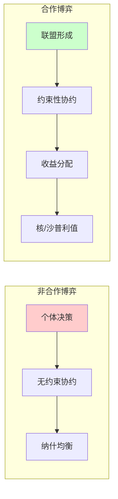
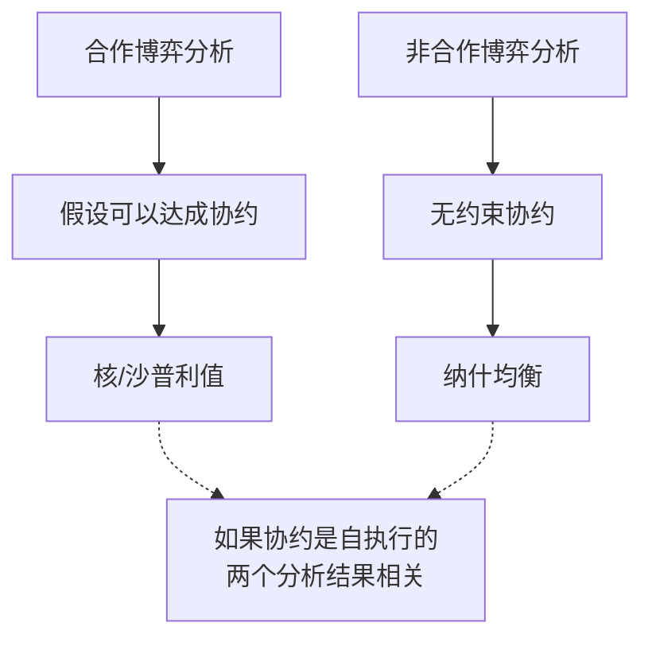

# 18.3 合作博弈论

## 背景动机

### 为什么要研究合作博弈？

当智能体能够达成**具有约束力的协约**时，它们可以形成联盟，实现单独行动无法达到的目标。

**现实世界中的合作场景**：
- 🏢 企业联合投标大型项目
- 🚛 物流公司共享配送网络
- 💡 专利池（patent pools）中的技术共享
- 🎮 多智能体系统中的任务分配



### 合作博弈的核心问题

1. **联盟形成**：哪些智能体应该合作？
2. **收益分配**：合作产生的价值如何公平分配？

**与非合作博弈的关键区别**：

| 特征 | 非合作博弈 | 合作博弈 |
|------|------------|----------|
| **决策重点** | 个体策略选择 | 联盟形成与收益分配 |
| **约束力** | 无约束性协约 | 可达成约束性协约 |
| **解概念** | 纳什均衡 | 核、沙普利值 |
| **主要问题** | "我应该怎么做？" | "我们应该如何分配？" |

---

## 核心概念

### 18.3.1 联盟结构与结果

#### 合作博弈的形式化定义

**合作博弈**（特征函数形式）：
$$G = (N, v)$$

其中：
- $N = \{1, 2, \ldots, n\}$：参与者集合
- $v: 2^N \rightarrow \mathbb{R}$：特征函数

**特征函数** $v(C)$：联盟$C \subseteq N$如果选择一起工作所能获得的收益值。

**基本假设**：
- $v(\emptyset) = 0$（空联盟无价值）
- $v(C) \geq 0$（非负性）
- 有时：$v(\{i\}) = 0$（单个参与者无价值）

#### 联盟与联盟结构

**联盟**：参与者的任何子集$C \subseteq N$

**大联盟**：所有参与者的集合$N$

**联盟结构**：将$N$划分为不相交联盟
$$CS = \{C_1, C_2, \ldots, C_k\}$$

满足：
- $C_i \neq \emptyset$
- $C_i \cap C_j = \emptyset$（$i \neq j$）
- $\bigcup_{i=1}^k C_i = N$

**示例**（3个参与者）：

```
参与者：N = {1, 2, 3}

可能的联盟：
  • 单元素：{1}, {2}, {3}
  • 双元素：{1,2}, {2,3}, {3,1}
  • 三元素：{1,2,3}

可能的联盟结构（共5种）：
  1. {{1}, {2}, {3}}          - 完全分散
  2. {{1}, {2,3}}             - 1独立，2和3合作
  3. {{2}, {1,3}}             - 2独立，1和3合作
  4. {{3}, {1,2}}             - 3独立，1和2合作
  5. {{1,2,3}}                - 大联盟
```

#### 博弈结果

**结果** = (联盟结构, 支付向量)

$$(CS, \mathbf{x})$$

其中：
- $CS$：联盟结构
- $\mathbf{x} = (x_1, x_2, \ldots, x_n)$：支付向量，$x_i$是参与者$i$的收益

**可行性约束**：
$$\sum_{i \in C} x_i = v(C), \quad \forall C \in CS$$

每个联盟必须将其产生的价值全部分配给成员。

#### 超可加性

**定义**：如果对所有$C, D \subseteq N$，$C \cap D = \emptyset$：
$$v(C \cup D) \geq v(C) + v(D)$$

则称博弈是**超可加**的。

**直观**：合并联盟不会变差。

**推论**：超可加博弈中，大联盟至少与其他任何联盟结构一样好。

**注意**：超可加性不保证大联盟一定形成（囚徒困境的类比）。

---

### 18.3.2 合作博弈中的策略

#### 归责（Imputation）

**定义**：满足以下条件的支付向量：

1. **效率**：$\sum_{i=1}^n x_i = v(N)$（分配大联盟的全部价值）
2. **个体理性**：$x_i \geq v(\{i\})$，对所有$i \in N$（参与者至少获得单独行动的价值）

**意义**：归责是"合理"的分配方案。

#### 核（Core）

**核心问题**：什么阻止了大联盟的形成？

**答案**：如果某些参与者发现离开大联盟组成小联盟可以获得更高收益，他们就会离开。

**核的定义**：

核是所有满足以下条件的归责的集合：
$$\sum_{i \in C} x_i \geq v(C), \quad \forall C \subseteq N$$

**直观**：没有联盟能从偏离大联盟中获益。

**核的计算**：

求解以下线性不等式系统：

$$
\begin{cases}
x_i \geq v(\{i\}), & \forall i \in N \\
\sum_{i \in N} x_i = v(N) \\
\sum_{i \in C} x_i \geq v(C), & \forall C \subseteq N
\end{cases}
$$

**约束数量**：$2^n$个（所有子集）

**计算复杂性**：
- 求解：关于约束数多项式时间
- 约束数：指数级（$2^n$）
- 核非空性检查：对许多博弈是co-NP完全的

#### 核可能为空

**示例**（3人多数博弈）：

```
N = {1, 2, 3}

特征函数：
  v(C) = 1, 如果|C| ≥ 2
  v(C) = 0, 其他

分析：
  • v({1,2,3}) = 1
  • 任何归责(x₁, x₂, x₃)满足x₁+x₂+x₃=1
  • 至少有一个xᵢ > 0，设x₁ > 0
  • 则x₂ + x₃ < 1 = v({2,3})
  • 联盟{2,3}会离开大联盟！
```

**结论**：此博弈的核为空。

#### 沙普利值（Shapley Value）

**核心问题**：即使大联盟形成，如何"公平"分配收益？

**沙普利的公平原则**：按贡献分配。

**边际贡献**：

参与者$i$对联盟$C$的边际贡献：
$$mc_i(C) = v(C \cup \{i\}) - v(C)$$

**沙普利值公式**：

$$\phi_i(G) = \frac{1}{n!} \sum_{p \in \mathcal{P}} mc_i(p_i)$$

其中：
- $\mathcal{P}$：所有参与者排列的集合
- $p_i$：排列$p$中在$i$之前的参与者集合

**直观**：$i$在所有可能加入顺序下的平均边际贡献。

#### 沙普利值的公理化刻画

沙普利值是满足以下公理的唯一分配方案：

| 公理 | 内容 |
|------|------|
| **效率** | $\sum_i \phi_i(G) = v(N)$ |
| **虚拟参与者** | 如果$i$从不贡献，则$\phi_i(G) = 0$ |
| **对称性** | 对称参与者获得相同收益 |
| **可加性** | $\phi(G_1 + G_2) = \phi(G_1) + \phi(G_2)$ |

**示例计算**（3人博弈）：

```
N = {1, 2, 3}

v({1}) = 0,    v({2}) = 0,    v({3}) = 0
v({1,2}) = 90, v({2,3}) = 80, v({1,3}) = 70
v({1,2,3}) = 120

排列数：3! = 6

排列    加入顺序    mc₁     mc₂     mc₃
────────────────────────────────────────
(1,2,3)  1加入∅      0       90      30
(1,3,2)  1加入∅      0       50      70
(2,1,3)  2加入∅      90      0       30
(2,3,1)  2加入∅      40      0       80
(3,1,2)  3加入∅      70      50      0
(3,2,1)  3加入∅      40      80      0
────────────────────────────────────────
平均：            40      45      35

验证：40 + 45 + 35 = 120 = v(N) ✓
```

---

### 18.3.3 合作博弈中的计算

#### 边际贡献网络（MC网络）

**表示问题**：特征函数需要$2^n$个值，如何简洁表示？

**MC网络**：用规则集表示特征函数

$$R = \{(C_1, x_1), (C_2, x_2), \ldots, (C_k, x_k)\}$$

其中$(C_i, x_i)$表示联盟$C_i$贡献价值$x_i$。

**价值计算**：
$$v(C) = \sum\{x_i \mid (C_i, x_i) \in R, C_i \subseteq C\}$$

**示例**：

```
规则集：
  R = {({1,2}, 5), ({2}, 2), ({3}, 4)}

计算：
  v({1}) = 0
  v({2}) = 2
  v({3}) = 4
  v({1,2}) = 5 + 2 = 7
  v({2,3}) = 2 + 4 = 6
  v({1,2,3}) = 5 + 2 + 4 = 11
```

**沙普利值计算**（MC网络）：

$$\phi_i(R) = \sum_{(C,x) \in R} \begin{cases} \frac{x}{|C|} & \text{if } i \in C \\ 0 & \text{otherwise} \end{cases}$$

**复杂度**：多项式时间（与规则数线性）。

#### 最大化社会福利的联盟结构

**社会福利**：
$$sw(CS) = \sum_{C \in CS} v(C)$$

**社会最优联盟结构**：
$$CS^* = \arg\max_{CS} sw(CS)$$

**问题**：寻找$CS^*$是NP困难的（集合划分问题）。

**近似算法**：

搜索联盟结构图的前两层：
- 包含所有单元素联盟
- 包含所有双元素联盟

**保证**：找到的联盟结构价值至少是最优的$1/n$。

---

## 详细解释

### 核的几何解释

考虑一个3人博弈，支付空间是三维的$(x_1, x_2, x_3)$。

**约束**：
1. $x_1 + x_2 + x_3 = v(N)$（效率平面）
2. $x_i \geq v(\{i\})$（个体理性半空间）
3. $x_i + x_j \geq v(\{i,j\})$（两两联盟约束）

**几何**：
- 效率平面是2维的（三角形）
- 个体理性约束形成边界
- 两两约束进一步切割可行区域

**结果**：
- 如果可行区域非空 → 核非空
- 如果所有约束不相交 → 核为空

### 沙普利值的公平性论证

**为什么按边际贡献分配是公平的？**

1. **效率**：所有价值都被分配，无浪费
2. **对称性**：同等贡献者获得同等报酬
3. **虚拟参与者**：无贡献者不应获得报酬
4. **可加性**：独立博弈的收益可加

**沙普利值的局限**：
- 可能不在核中（大联盟不稳定）
- 需要计算所有排列
- 假设所有联盟形成的可能性相等

### 核与沙普利值的比较

| 特性 | 核 | 沙普利值 |
|------|-----|----------|
| **存在性** | 可能为空 | 总是存在 |
| **唯一性** | 可能不唯一 | 总是唯一 |
| **计算** | 困难（指数约束） | 困难（排列数） |
| **解释** | 稳定性 | 公平性 |
| **满足个体理性** | 是 | 是（通常） |
| **满足群体理性** | 是（由定义） | 是 |

**关键区别**：
- 核关注"什么分配是稳定的"
- 沙普利值关注"什么分配是公平的"

---

## 示例详解

### 示例1：简单成本分摊

**场景**：3个城市需要建设供水系统

```
单独建设成本：
  v({A}) = -10, v({B}) = -10, v({C}) = -10

联合建设成本：
  v({A,B}) = -16, v({B,C}) = -16, v({A,C}) = -16
  v({A,B,C}) = -21

（负值表示成本，数值越大越好）
```

**沙普利值计算**：

```
排列    加入顺序    mc_A    mc_B    mc_C
────────────────────────────────────────
(A,B,C)  A加入∅      -10     -6      -5
(A,C,B)  A加入∅      -10     -5      -6
(B,A,C)  B加入∅      -6      -10     -5
(B,C,A)  B加入∅      -5      -10     -6
(C,A,B)  C加入∅      -6      -5      -10
(C,B,A)  C加入∅      -5      -6      -10
────────────────────────────────────────
平均：           -7     -7     -7

验证：-7 × 3 = -21 ✓
```

**结果**：每个城市支付7，比单独建设（10）节省3。

**核分析**：
- 需要满足：$x_A + x_B \geq -16$，等等
- 沙普利值$(-7, -7, -7)$满足所有约束 ✓

### 示例2：投票博弈

**场景**：股东投票决策

```
股东：{1, 2, 3}
股份：50%, 30%, 20%

决策规则：超过50%股份通过

特征函数（胜利=1，失败=0）：
  v({1}) = 1  (50% > 50%? No, but wait...)
  
  更正：需要 >50%，所以
  v({1}) = 0  (50% ≯ 50%)
  v({2}) = 0
  v({3}) = 0
  v({1,2}) = 1 (80% > 50%)
  v({1,3}) = 1 (70% > 50%)
  v({2,3}) = 0 (50% ≯ 50%)
  v({1,2,3}) = 1
```

**沙普利值**：

```
关键观察：谁是关键投票者？

排列    加入顺序    关键者
────────────────────────
(1,2,3)  3加入{1,2}   无（已通过）
         2加入{1}     2（1单独不够）
         1加入∅        1（开始）
         
分析：1在2或3之前加入时是关键者
      2在1之后但在3之前加入时是关键者
      3在1和2之后加入时是关键者

详细计算略...结果：
  φ₁ = 2/3, φ₂ = 1/6, φ₃ = 1/6
```

**班扎夫权力指数**（另一种度量）：
- 计算每个参与者作为"关键投票者"的次数
- 结果：1: 0.6, 2: 0.2, 3: 0.2

### 示例3：空核博弈

**场景**：机场跑道成本分摊

```
飞机类型：{1,2,3}（小、中、大）
需要跑道长度：1, 2, 3

建设成本（长度l）：c(l) = l²

特征函数：
  v(C) = -max_{i∈C} c(i)  
         （负值表示成本）

计算：
  v({1}) = -1
  v({2}) = -4
  v({3}) = -9
  v({1,2}) = -4
  v({1,3}) = -9
  v({2,3}) = -9
  v({1,2,3}) = -9
```

**核分析**：

需要满足：
- $x_1 + x_2 + x_3 = -9$
- $x_1 \geq -1, x_2 \geq -4, x_3 \geq -9$
- $x_1 + x_2 \geq -4$（但大飞机3也必须支付...）

考虑{2,3}的约束：
- $x_2 + x_3 \geq -9$
- 由$x_1 + x_2 + x_3 = -9$，得$x_1 \leq 0$
- 但$x_1 \geq -1$，这不矛盾

实际上，这个博弈的核非空（例如：$(-1, -4, -4)$）。

**修正示例**（真正的空核）：

```
3人博弈：
  v({1,2}) = 100
  v({1,3}) = 100
  v({2,3}) = 100
  v({1,2,3}) = 100
  v({i}) = 0

核分析：
  x₁ + x₂ ≥ 100
  x₁ + x₃ ≥ 100
  x₂ + x₃ ≥ 100
  x₁ + x₂ + x₃ = 100

前两式相加：2x₁ + x₂ + x₃ ≥ 200
代入第三式：x₁ + 100 ≥ 200 → x₁ ≥ 100
同理：x₂ ≥ 100, x₃ ≥ 100
但总和应为100，矛盾！
```

---

## 可视化

### 核的几何表示

```mermaid
xychart-beta
    title "3人博弈的支付空间（x₃ = v(N) - x₁ - x₂）"
    x-axis "x₁"
    y-axis "x₂"
    
    line "效率边界" { x: [0, 10, 20], y: [20, 10, 0] }
    line "个体理性x₁≥0" { x: [0, 0], y: [0, 20] }
    line "个体理性x₂≥0" { x: [0, 20], y: [0, 0] }
    line "v({1,2})约束" { x: [5, 20], y: [20, 5] }
    
    scatter "核" { x: [8, 9, 10], y: [10, 9, 8] }
```

### 沙普利值计算可视化

```mermaid
flowchart LR
    subgraph 排列1["排列 (1,2,3)"]
    A1[∅] --mc₁=0--> B1[{1}]
    B1 --mc₂=5--> C1[{1,2}]
    C1 --mc₃=3--> D1[{1,2,3}]
    end
    
    subgraph 排列2["排列 (2,1,3)"]
    A2[∅] --mc₂=0--> B2[{2}]
    B2 --mc₁=4--> C2[{1,2}]
    C2 --mc₃=3--> D2[{1,2,3}]
    end
    
    subgraph 平均["平均"]
    E["φ₁ = (0+4+...)/6"]
    F["φ₂ = (5+0+...)/6"]
    G["φ₃ = (3+3+...)/6"]
    end
    
    D1 --> E
    D2 --> E
    D1 --> F
    D2 --> F
    D1 --> G
    D2 --> G
```

### 联盟结构图

```
                    {1,2,3,4}
                   /    |    \
            {1},{2,3,4} {1,2},{3,4} ...
           /    |    \
    {1},{2},{3,4} {1},{2,3},{4} ...
           ...
    {1},{2},{3},{4}
    
第1层：1个联盟（大联盟）
第2层：2个联盟
第3层：3个联盟
第4层：4个联盟（完全分散）
```

---

## 常见陷阱

### 陷阱1：混淆合作博弈与非合作博弈

**错误**：认为合作博弈不允许竞争。

**纠正**：
- 合作博弈关注"如何分配合作收益"
- 非合作博弈关注"个体如何选择策略"
- 一个博弈可以同时从两个角度分析

### 陷阱2：假设核总是存在

**错误**：认为总有稳定的分配方案。

**纠正**：
- 核可能为空（如示例3）
- 空核意味着大联盟不稳定
- 需要考虑其他解概念或联盟结构

### 陷阱3：混淆核与沙普利值

**错误**：认为沙普利值总是在核中。

**纠正**：
- 沙普利值可能违反某些联盟的约束
- 当核非空时，沙普利值可能在核外
- 两者是不同的公平性/稳定性概念

### 陷阱4：忽视计算复杂性

**错误**：认为可以轻易计算核或沙普利值。

**纠正**：
- 核：$2^n$个约束
- 沙普利值：$n!$个排列
- 需要简洁表示（如MC网络）

### 陷阱5：误用超可加性

**错误**：认为超可加性保证大联盟形成。

**纠正**：
- 超可加性只保证$v(N) \geq \sum v(C_i)$
- 分配问题可能阻碍大联盟
- 类似于囚徒困境

---

## 与其他节的联系

### 与非合作博弈的联系



### 与机制设计的联系

合作博弈的结果（如沙普利值）可以指导机制设计：
- VCG机制中的支付与边际贡献相关
- 公平分配方案可以作为协议的基础

---

## 知识点总结

### 核心公式

**特征函数形式**：
$$G = (N, v)$$

**核的约束**：
$$\sum_{i \in C} x_i \geq v(C), \quad \forall C \subseteq N$$

**沙普利值**：
$$\phi_i(G) = \frac{1}{n!} \sum_{p \in \mathcal{P}} [v(p_i \cup \{i\}) - v(p_i)]$$

**MC网络沙普利值**：
$$\phi_i(R) = \sum_{(C,x) \in R, i \in C} \frac{x}{|C|}$$

### 关键定理

1. **Bondareva-Shapley定理**：博弈有非空核当且仅当它是平衡的
2. **沙普利值唯一性**：满足效率、对称性、虚拟参与者、可加性的唯一分配方案

### 计算复杂性

| 问题 | 复杂度 | 备注 |
|------|--------|------|
| 核非空性 | co-NP完全 | 一般博弈 |
| 沙普利值 | #P困难 | 一般博弈 |
| MC网络沙普利值 | P | 多项式时间 |
| 最优联盟结构 | NP困难 | 集合划分 |

---

## 延伸阅读

- **Shapley, L.S. (1953)**. A value for n-person games. *Contributions to the Theory of Games*.
- **Gillies, D.B. (1959)**. Solutions to general non-zero-sum games. *Contributions to the Theory of Games*.
- **Ieong & Shoham (2005)**. Marginal contribution nets: a compact representation scheme for coalitional games.
- **Chalkiadakis et al. (2011)**. Computational aspects of cooperative game theory.
