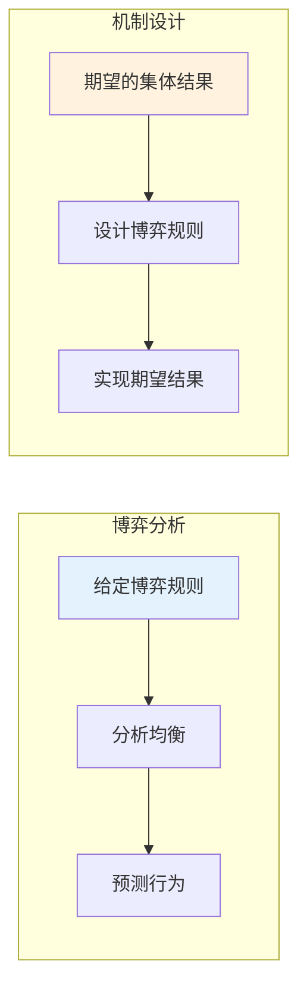
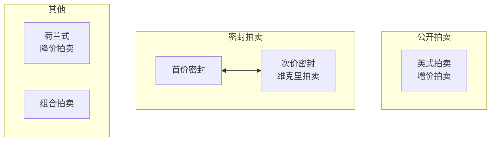
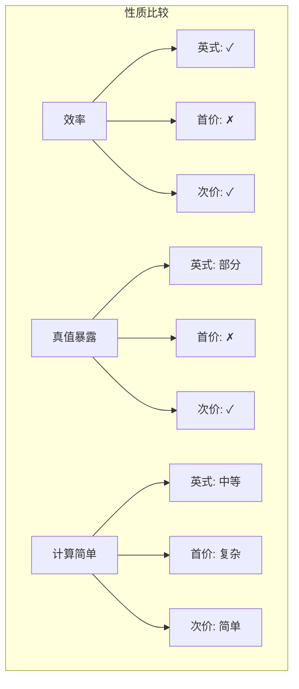
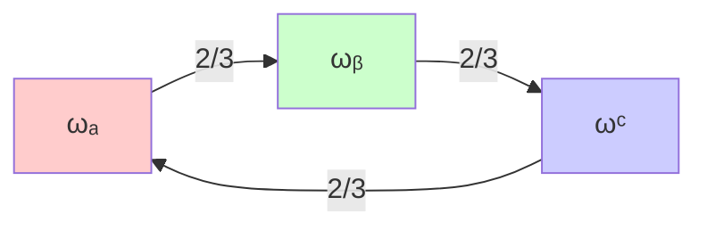
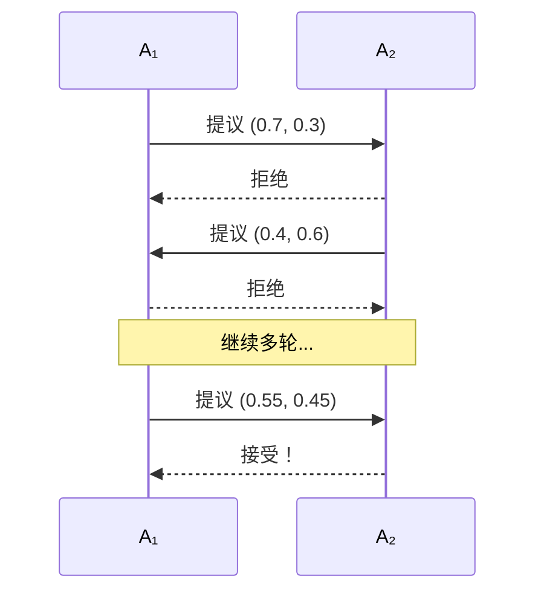

# 18.4 做集体决策

## 背景动机

### 从博弈分析到机制设计

前两节研究了**给定博弈**中的理性行为，本节转向**设计博弈**——如何设置规则使得个体理性行为导致集体最优结果。



### 机制设计的核心问题

**设计者视角**：
- 希望实现某种社会目标（效率、公平）
- 智能体是理性的，会最大化自身效用
- 如何设计规则使两者一致？

**机制设计三要素**：
1. **语言**：智能体允许的策略集合
2. **中心**：收集策略选择的实体
3. **结果规则**：根据策略选择确定收益

### 应用领域

| 应用领域 | 机制 | 设计目标 |
|----------|------|----------|
| 🌐 互联网广告 | 拍卖 | 效率、收入最大化 |
| 📡 频谱分配 | 拍卖 | 社会福利最大化 |
| 🏛️ 公共决策 | 投票 | 反映民意 |
| 🤖 多智能体系统 | 合同网 | 任务高效分配 |
| 💼 商业谈判 | 议价协议 | 达成协议 |

---

## 核心概念

### 18.4.1 合同网中的任务分配

#### 合同网协议（Contract Net Protocol）

**灵感来源**：公司间使用合同的方式

**四个阶段**：


| 阶段 | 角色 | 活动 |
|------|------|------|
| **任务公告** | 管理器 | 广播任务需求 |
| **投标** | 潜在承包商 | 评估并提交投标 |
| **授标** | 管理器 | 选择最佳承包商 |
| **执行** | 承包商 | 完成任务 |

#### 主要计算任务

**任务公告处理**：
- 智能体决定是否投标
- 评估自身能力和意愿

**投标处理**：
- 管理器评估多个投标
- 选择最合适的承包商

**授标处理**：
- 承包商执行任务
- 可能生成子任务并发布公告

#### 合同网的特点

**优点**：
- 简单直观
- 广泛适用
- 分布式决策

**局限性**：
- 可能产生大量通信
- 投标评估成本
- 合谋风险

---

### 18.4.2 通过拍卖分配稀缺资源

#### 拍卖的基本设置

```
┌─────────────────────────────────────────┐
│              拍卖基本模型                │
├─────────────────────────────────────────┤
│  • 单一资源 + 多个投标人                 │
│  • 每个投标人i对资源估值vᵢ               │
│  • 投标bᵢ（可能不等于vᵢ）                │
│  • 最高出价b_max中标                     │
│  • 支付金额取决于机制设计                │
└─────────────────────────────────────────┘
```

**估值类型**：
- **私有价值**：价值因人而异（如艺术品）
- **共有价值**：价值相同但信息不同（如石油区块）

#### 主要拍卖机制



| 机制 | 投标方式 | 支付 | 特点 |
|------|----------|------|------|
| **英式拍卖** | 公开递增 | 最后出价 | 透明、激励揭示 |
| **首价密封** | 密封投标 | 自己出价 | 需要策略思考 |
| **次价密封** | 密封投标 | 第二高价 | 真值暴露 |

#### 英式拍卖（增价拍卖）

**流程**：
1. 拍卖师报初始价格
2. 投标人公开出价
3. 价格递增直到无人出价
4. 最后出价者获胜，支付该价格

**占优策略**：
- 只要当前价格 < 估值，继续出价
- 当价格 ≥ 估值时退出

**不完全真值暴露**：
- 获胜者只揭示$v_i \geq b_{second} + d$
- 得到下界而非精确值

**问题**：
- 合谋风险（德国频谱拍卖案例）
- 优势投标者可能吓退竞争者

#### 首价密封拍卖

**流程**：
1. 各投标人私下提交出价
2. 最高出价者获胜
3. 支付自己的出价

**策略性投标**：
- 如果认为最高对手出价是$b_o$
- 最优策略：出价$b_o + \epsilon$（刚好超过）

**问题**：
- 需要猜测对手出价
- 估值最高者可能不获胜
- 计算成本高

#### 次价密封拍卖（维克里拍卖）

**流程**：
1. 各投标人私下提交出价
2. 最高出价者获胜
3. 支付**第二高**的价格

**占优策略证明**：

投标人$i$的效用：
$$U_i = \begin{cases} v_i - b_o & \text{if } b_i > b_o \\ 0 & \text{otherwise} \end{cases}$$

其中$b_o$是其他投标人的最高出价。

**情况分析**：

```
情况1：vᵢ > bₒ
  • 如果bᵢ > bₒ：赢得拍卖，效用vᵢ - bₒ > 0 ✓
  • 如果bᵢ < bₒ：输掉拍卖，效用0 ✗
  → 应该出价bᵢ > bₒ，特别地，bᵢ = vᵢ

情况2：vᵢ < bₒ
  • 如果bᵢ > bₒ：赢得拍卖，效用vᵢ - bₒ < 0 ✗
  • 如果bᵢ < bₒ：输掉拍卖，效用0 ✓
  → 应该出价bᵢ < bₒ，特别地，bᵢ = vᵢ

情况3：vᵢ = bₒ
  • 平局，效用为0
  → bᵢ = vᵢ也无损失
```

**结论**：$b_i = v_i$是占优策略！

**性质**：
- **真值暴露**：如实报告估值是最优的
- **激励相容**：个体理性与社会目标一致
- **效率**：估值最高者获胜

#### 收入等价定理

**定理**：在满足以下条件的拍卖中，期望收入相同：
- 投标人估值独立同分布
- 投标人风险中性
- 相同的分配规则

**启示**：
- 拍卖设计不基于收入竞争
- 基于其他指标：计算复杂度、通信成本、抗合谋性

#### 多物品拍卖与VCG机制

**问题**：拍卖n个相同物品给m个投标人

**n+1价格拍卖的问题**：
- 非真值暴露
- 投标人可能策略性压低出价

**示例**：
```
3个投标人，估值：v₁=200, v₂=180, v₃=100
2个广告位：顶部(5%点击率)，底部(2%点击率)

如果如实出价：
  投标人1赢得顶部，支付180
  期望效用：(200-180)×0.05 = 1

如果投标人1出价120（低于真实估值）：
  赢得底部广告位，支付100
  期望效用：(200-100)×0.02 = 2 ✓
  
→ 不如实出价更好！
```

**VCG机制**：

**步骤**：
1. 每个智能体报告估值$v_i$
2. 选择赢家集合$W$最大化$\sum_{i \in W} v_i$
3. 每个获胜者支付**其存在对输家造成的损失**

**支付计算**：
$$tax_i = \sum_{j \notin W} v_j - \sum_{j \in W \setminus \{i\}} v_j$$

**真值暴露证明**：
- 智能体的支付不依赖于自己的报告
- 因此最大化效用等价于最大化社会效用
- 如实报告是最优的

**性质**：
- **效用最大化**：全局最优分配
- **真值暴露**：激励相容
- **个体理性**：获胜者支付不超过估值

**计算复杂性**：
- 最优分配可能是NP困难的
- VCG机制的计算瓶颈在优化问题

#### 公地悲剧与外部性

**场景**：各国控制空气污染

```
每个国家选择：
  • 减少污染：成本-10
  • 保持污染：自己得-5，每个其他国家得-1

如果100个国家都保持污染：
  每个国家效用 = -5 - 99×1 = -104

如果都减少污染：
  每个国家效用 = -10
```

**占优策略**：保持污染（个体角度最优）

**集体结果**：灾难性

**外部性**：个体决策对全局效用的未补偿影响

**解决方案**：
- 碳税（使外部性内部化）
- VCG机制（正确激励）

---

### 18.4.3 投票

#### 社会选择理论

**基本设定**：
- 投票者集合$N = \{1, \ldots, n\}$
- 可能结果集合$\Omega = \{\omega_1, \omega_2, \ldots\}$
- 每个投票者有偏好顺序$\succ_i$

**社会福利函数**：将个人偏好聚合成社会偏好

**社会选择函数**：直接选出获胜者集合

#### 孔多塞悖论

**设置**：3个投票者，3个选项

```
投票者1: ωₐ ≻ ωᵦ ≻ ωᶜ
投票者2: ωᶜ ≻ ωₐ ≻ ωᵦ
投票者3: ωᵦ ≻ ωᶜ ≻ ωₐ

两两比较：
  ωₐ vs ωᵦ: 2/3偏好ωₐ
  ωᵦ vs ωᶜ: 2/3偏好ωᵦ
  ωᶜ vs ωₐ: 2/3偏好ωᶜ

→ 循环！没有孔多塞赢家
```

#### 阿罗定理

**期望的性质**：

| 性质 | 描述 |
|------|------|
| **帕累托条件** | 如果所有人都偏好ωᵢ超过ωⱼ，社会也应如此 |
| **孔多塞赢家条件** | 孔多塞赢家应排在首位 |
| **IIA（无关选项独立性）** | ωᵢ与ωⱼ的相对排序不受其他选项影响 |
| **非独裁** | 不简单地复制某个投票者的偏好 |

**阿罗定理**：
> 对于至少有3个结果的投票，不存在同时满足上述4个性质的社会福利函数。

**启示**：
- 任何投票系统都有缺陷
- 民主决策在理论上不可能完美
- 实践中选择最适合具体场景的机制

#### 投票机制

| 机制 | 描述 | 优点 | 缺点 |
|------|------|------|------|
| **简单多数** | 两人时得票多者胜 | 简单、满足多数原则 | 仅适用于两人 |
| **多数投票** | 选最多首选票的候选人 | 简单 | 忽视其他偏好信息 |
| **博尔达计数** | 按排名赋分求和 | 考虑全部偏好 | 需要完整排序 |
| **认可投票** | 投票者可认可多个 | 简单 | 信息损失 |
| **排序复选** | 逐轮淘汰最少选票者 | 考虑第二选择 | 复杂 |

#### Gibbard-Satterthwaite定理

**策略性操纵**：投票者歪曲偏好以获得更好结果

**定理**：
> 对于至少有2个结果的域，任何满足帕累托条件的社会选择函数要么可操纵，要么是独裁的。

**启示**：
- 所有"合理"的投票系统都可操纵
- 但操纵可能需要复杂计算
- 实践中，计算复杂性可能阻止操纵

---

### 18.4.4 议价

#### 交替报价议价模型

**流程**：
1. $A_1$提出报价
2. $A_2$接受（交易实现）或拒绝（进入下一轮）
3. $A_2$提出报价
4. $A_1$接受或拒绝
5. 重复...

**分饼场景**：
- 资源（饼）价值为1
- 报价是$(x, 1-x)$对
- 冲突结果：双方都得到0

#### 有限轮议价

**一轮（最后通牒博弈）**：
- $A_1$提议$(1, 0)$
- $A_2$接受（因为0 > 冲突）
- 结果：$A_1$得到全部

**两轮**：
- $A_2$可以拒绝第一轮，在第二轮得全部
- 但第二轮饼的价值降低（如果不耐心）
- $A_1$提出$(1-\gamma_2, \gamma_2)$

**n轮**：
- 最后提议者优势

#### 无限轮议价与折扣因子

**折扣因子**$\gamma_i \in [0, 1)$：
- 时间$t$获得$x$的价值为$\gamma_i^t x$
- $\gamma_i$越大越耐心

**均衡结果**（Rubinstein, 1982）：

$A_1$得到：
$$x^* = \frac{1-\gamma_2}{1-\gamma_1\gamma_2}$$

$A_2$得到：$1 - x^*$

**特殊情况**：
- 如果$\gamma_1 = \gamma_2 = \gamma$：$x^* = \frac{1}{1+\gamma}$
- 如果双方同样耐心：先动者优势
- 如果$\gamma_2 \to 1$（$A_2$极耐心）：$x^* \to 0$

#### 任务导向域的谈判

**场景**：智能体通过重新分配任务获益

**设置**：
- 任务集合$T$
- 初始分配$(T_1^0, T_2^0)$
- 成本函数$c(T')$

**效用**：
$$U_i((T_1, T_2)) = c(T_i^0) - c(T_i)$$

**谈判集**：个体理性且帕累托最优的报价集

**单调让步协议**：
1. 同时提议
2. 如果一方偏好对方的提议，达成协约
3. 否则，双方做出让步（提出对方更偏好的报价）
4. 重复或终止

**Zeuthen策略**：
- 风险冲突意愿较低的让步
- 风险度量：让步损失 / 冲突损失

---

## 详细解释

### 机制设计的显示原理

**显示原理**：
> 任何机制都可以转化为等价的真值暴露机制。

**含义**：
- 寻找最优机制时，只需考虑真值暴露机制
- VCG是所有真值暴露机制的原型
- 大大简化了机制设计问题

### VCG支付的直观解释

**为什么支付 = 对他人造成的损失？**

考虑投标人$i$：
- 如果不参与，其他人获得$\sum_{j \neq i, j \in W_{-i}} v_j$
- 如果参与，其他人获得$\sum_{j \neq i, j \in W} v_j$
- 差异就是$i$的存在对其他人造成的损失

**激励相容**：
- $i$的支付不依赖于$i$的报告
- 因此$i$的最优策略是最大化社会效用
- 即如实报告

### 投票悖论的深层原因

**孔多塞悖论的根源**：
- 偏好 aggregation 的非传递性
- 社会偏好可能不满足理性公理
- 这是集体决策的根本困难

**应对策略**：
1. **限制偏好域**：如单峰偏好
2. **随机化**：彩票式选择
3. **接受不完美**：选择最可接受的机制

---

## 示例详解

### 示例1：维克里拍卖

**场景**：3个投标人，估值：$v_1 = 100, v_2 = 80, v_3 = 60$

**投标**：
- 如实投标：$b_1 = 100, b_2 = 80, b_3 = 60$

**结果**：
- 投标人1获胜
- 支付：80（第二高价）
- 效用：$100 - 80 = 20$

**验证占优策略**：
- 如果投标人1出价90：仍获胜，支付80，效用20（不变）
- 如果投标人1出价70：输掉拍卖，效用0（变差）
- 如果投标人1出价110：仍获胜，支付80，效用20（不变）

**结论**：如实投标是占优策略。

### 示例2：VCG机制

**场景**：3个物品，5个投标人

```
投标人  估值
────────────────
1       100
2       80
3       60
4       40
5       20
```

**分配**：物品给投标人1, 2, 3
**全局效用**：$100 + 80 + 60 = 240$

**VCG支付计算**：

投标人1：
- 如果不参与，赢家是2, 3, 4
- 他人获得：$80 + 60 + 40 = 180$
- 如果参与，他人获得：$80 + 60 = 140$
- 支付：$180 - 140 = 40$（即第四高的估值）

同理：
- 投标人2支付：40
- 投标人3支付：40

**验证**：所有支付都低于各自的估值 ✓

### 示例3：议价中的耐心

**场景**：分饼博弈，$\gamma_1 = 0.9, \gamma_2 = 0.8$

**均衡分配**：
$$x^* = \frac{1 - 0.8}{1 - 0.9 \times 0.8} = \frac{0.2}{1 - 0.72} = \frac{0.2}{0.28} \approx 0.714$$

$A_1$得到约71.4%，$A_2$得到约28.6%。

**如果$A_2$更耐心**（$\gamma_2 = 0.95$）：
$$x^* = \frac{1 - 0.95}{1 - 0.9 \times 0.95} = \frac{0.05}{0.145} \approx 0.345$$

耐心使议价能力提高！

---

## 可视化

### 拍卖机制比较



### 投票悖论



### 议价过程



---

## 常见陷阱

### 陷阱1：混淆不同拍卖机制

**错误**：认为所有拍卖都需要策略性投标。

**纠正**：
- 维克里拍卖是真值暴露的
- 英式拍卖近似真值暴露
- 首价密封需要复杂策略

### 陷阱2：忽视合谋风险

**错误**：设计机制时只考虑个体理性。

**纠正**：
- 投标人可能合谋压低价格
- 设计应使合谋难以执行
- 增加投标人数量降低合谋可能性

### 陷阱3：误解阿罗定理

**错误**：认为阿罗定理意味着民主不可能。

**纠正**：
- 定理针对所有可能偏好配置
- 实践中偏好多有结构（如单峰）
- 某些机制在受限域下表现良好

### 陷阱4：忽视计算复杂性

**错误**：假设最优机制总是可计算。

**纠正**：
- VCG需要求解优化问题
- 组合拍卖是NP困难的
- 需要近似机制和启发式

### 陷阱5：混淆效率和公平

**错误**：认为效率最大化自动带来公平。

**纠正**：
- VCG最大化效率但可能不公平
- 需要考虑再分配机制
- 公平性可能与效率冲突

---

## 与其他节的联系

### 与博弈论的联系

机制设计是"反向博弈论"：
- 博弈论：给定规则，预测行为
- 机制设计：给定目标，设计规则

### 与合作博弈的联系

沙普利值与VCG：
- 都基于边际贡献
- 沙普利值公平分配
- VCG提供正确激励

---

## 知识点总结

### 核心公式

**维克里拍卖支付**：
$$payment = \text{第二高价格}$$

**VCG支付**：
$$tax_i = \sum_{j \notin W} v_j - \sum_{j \in W \setminus \{i\}} v_j$$

**议价均衡**：
$$x^* = \frac{1-\gamma_2}{1-\gamma_1\gamma_2}$$

### 关键定理

1. **收入等价定理**：等价条件下期望收入相同
2. **阿罗定理**：不存在完美的社会福利函数
3. **Gibbard-Satterthwaite定理**：可操纵性或独裁性

### 机制设计目标

| 目标 | 实现机制 |
|------|----------|
| 效率 | VCG |
| 真值暴露 | VCG、维克里 |
| 个体理性 | VCG、适当保留价 |
| 预算平衡 | 通常与效率冲突 |

---

## 延伸阅读

- **Myerson (1981)**. Optimal auction design.
- **Vickrey (1961)**. Counterspeculation, auctions, and competitive sealed tenders.
- **Arrow (1951)**. *Social Choice and Individual Values*.
- **Rubinstein (1982)**. Perfect equilibrium in a bargaining model.
- **Nisan & Ronen (1999)**. Algorithmic mechanism design.
