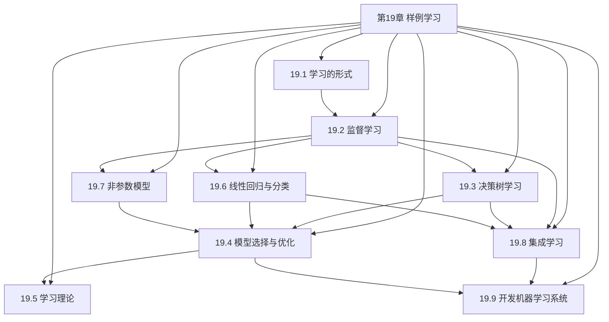
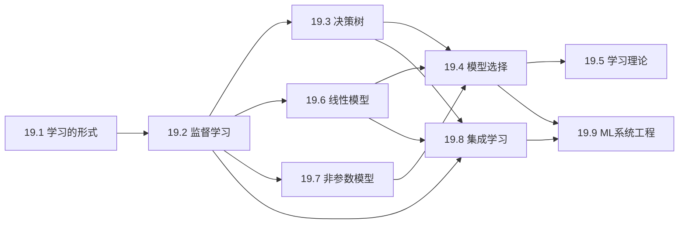

# 第19章 样例学习 - 概览与总结

## 一、学习目标

完成本章学习后，你应该能够：

1. **理解机器学习的基本范式**：监督学习、无监督学习、强化学习的区别与联系
2. **掌握核心算法原理**：决策树、线性回归/分类、k近邻、集成学习
3. **应用模型选择技术**：交叉验证、正则化、超参数优化
4. **理解学习理论基础**：PAC学习、样本复杂度、偏差-方差权衡
5. **构建完整的ML系统**：从问题定义到部署监控的全流程

## 二、本章速览

### 2.1 章节结构



### 2.2 核心内容地图

| 小节 | 核心概念 | 关键算法 | 理论工具 |
|-----|---------|---------|---------|
| 19.1 学习的形式 | 归纳vs演绎、学习类型 | - | - |
| 19.2 监督学习 | 假设空间、损失函数 | - | 偏差-方差权衡 |
| 19.3 决策树 | 信息增益、熵 | ID3/C4.5 | 剪枝理论 |
| 19.4 模型选择 | 交叉验证、正则化 | 网格搜索、贝叶斯优化 | 泛化误差界 |
| 19.5 学习理论 | PAC学习、VC维 | - | 样本复杂度 |
| 19.6 线性模型 | 梯度下降、逻辑回归 | 感知机、SGD | 收敛定理 |
| 19.7 非参数模型 | k近邻、核方法 | KDE、GP | 一致性定理 |
| 19.8 集成学习 | Bagging、Boosting | 随机森林、XGBoost | AdaBoost收敛界 |
| 19.9 ML系统工程 | MLOps、数据漂移 | 主动学习 | - |

## 三、难度预警

### 3.1 难度分级

| 小节 | 理论难度 | 实践难度 | 数学要求 |
|-----|---------|---------|---------|
| 19.1 学习的形式 | ⭐ | ⭐ | 低 |
| 19.2 监督学习 | ⭐⭐ | ⭐⭐ | 中 |
| 19.3 决策树 | ⭐⭐ | ⭐⭐ | 中 |
| 19.4 模型选择 | ⭐⭐⭐ | ⭐⭐⭐ | 中 |
| 19.5 学习理论 | ⭐⭐⭐⭐ | ⭐ | 高 |
| 19.6 线性模型 | ⭐⭐⭐ | ⭐⭐⭐ | 中 |
| 19.7 非参数模型 | ⭐⭐⭐ | ⭐⭐ | 中 |
| 19.8 集成学习 | ⭐⭐⭐ | ⭐⭐⭐ | 中 |
| 19.9 ML系统工程 | ⭐⭐ | ⭐⭐⭐⭐ | 低 |

### 3.2 学习建议

- **初学者**：重点掌握19.1-19.4和19.6，理解基本概念和算法
- **进阶学习者**：深入学习19.5学习理论，理解算法的理论保证
- **实践者**：重点关注19.9，掌握ML系统开发的工程实践

## 四、前置知识

### 4.1 数学基础

- **线性代数**：向量、矩阵、特征值
- **概率论**：条件概率、期望、方差、常见分布
- **微积分**：偏导数、梯度、链式法则
- **优化理论**：凸优化、梯度下降

### 4.2 编程技能

- Python基础
- NumPy/Pandas数据处理
- Scikit-learn库使用
- 可选：TensorFlow/PyTorch深度学习框架

### 4.3 先修章节

- 第2章：智能体概念
- 第12-14章：概率推理基础
- 第16章：简单决策（效用理论）

## 五、节依赖图



## 六、定理清单

### 6.1 核心定理

| 定理名称 | 所在小节 | 核心内容 |
|---------|---------|---------|
| 归纳不确定性定理 | 19.1 | 归纳结论不具有逻辑必然性 |
| PAC学习样本复杂度 | 19.5 | $N \geq \frac{1}{\epsilon}(\ln|\mathcal{H}| + \ln\frac{1}{\delta})$ |
| 感知机收敛定理 | 19.6 | 线性可分数据上有限步收敛 |
| k近邻一致性 | 19.7 | $k \to \infty$, $k/N \to 0$ 时收敛于贝叶斯最优 |
| AdaBoost收敛界 | 19.8 | 训练误差 $\leq \exp(-2\gamma^2 K)$ |
| 没有免费午餐 | 19.5 | 不存在普适的最优学习算法 |

### 6.2 重要公式

**信息增益**：
$$\text{Gain}(A) = B\left(\frac{p}{p+n}\right) - \sum_{k=1}^{d} \frac{p_k+n_k}{p+n} B\left(\frac{p_k}{p_k+n_k}\right)$$

**梯度下降更新**：
$$w_i \leftarrow w_i - \alpha \frac{\partial L}{\partial w_i}$$

**逻辑回归**：
$$h_w(x) = \frac{1}{1 + e^{-w^T x}}$$

**核密度估计**：
$$\hat{f}(x) = \frac{1}{Nh} \sum_{j=1}^{N} K\left(\frac{x-x_j}{h}\right)$$

## 七、核心逻辑线索

### 7.1 从问题到解决方案

```
业务问题
    ↓
问题形式化（分类/回归/聚类）
    ↓
数据收集与预处理
    ↓
特征工程
    ↓
模型选择（线性/树/非参数/集成）
    ↓
训练与验证
    ↓
部署与监控
```

### 7.2 偏差-方差权衡的主线

```
简单模型 ←————————→ 复杂模型
高偏差    权衡    高方差
欠拟合              过拟合
线性模型            高次多项式
小决策树            大决策树
少特征              多特征
```

## 八、核心要点速查

### 8.1 监督学习三要素

1. **模型**（假设空间）：$h \in \mathcal{H}$
2. **策略**（损失函数）：$L(y, h(x))$
3. **算法**（优化方法）：$\min_h \sum L(y_i, h(x_i))$

### 8.2 模型选择原则

- **奥卡姆剃刀**：选择能解释数据的最简单模型
- **交叉验证**：选择在验证集上表现最好的模型
- **正则化**：显式惩罚模型复杂度

### 8.3 集成学习策略

- **Bagging**：并行训练，减少方差
- **Boosting**：顺序训练，减少偏差
- **Stacking**：异质模型，元学习器组合

## 九、概念对比表

### 9.1 学习类型对比

| 特性 | 监督学习 | 无监督学习 | 强化学习 |
|-----|---------|-----------|---------|
| 数据 | 有标签 | 无标签 | 奖励信号 |
| 目标 | 预测标签 | 发现结构 | 最大化累积奖励 |
| 反馈 | 即时 | 无 | 延迟 |
| 示例 | 分类、回归 | 聚类、降维 | 游戏、机器人 |

### 9.2 模型对比

| 模型 | 偏差 | 方差 | 可解释性 | 训练速度 |
|-----|-----|-----|---------|---------|
| 线性回归 | 高 | 低 | 高 | 快 |
| 决策树 | 中 | 高 | 高 | 快 |
| k近邻 | 低 | 高 | 中 | 无训练 |
| 随机森林 | 低 | 低 | 中 | 中 |
| 梯度提升 | 低 | 中 | 中 | 慢 |

## 十、常见误解澄清

### 误解1：复杂模型总是更好

**澄清**：复杂模型容易过拟合。选择模型应该在偏差和方差之间权衡，使用交叉验证选择最优复杂度。

### 误解2：100%训练准确率是好事

**澄清**：100%训练准确率通常意味着过拟合。目标是泛化性能，即测试集上的表现。

### 误解3：特征越多越好

**澄清**：无关特征会增加方差，导致过拟合。特征选择是重要步骤。

### 误解4：集成学习总是比单一模型好

**澄清**：虽然通常如此，但集成增加了计算成本和系统复杂性。在资源受限的场景下，简单模型可能更合适。

## 十一、本章测验

### 11.1 选择题

1. 以下哪种方法最适合减少模型方差？
   - A. 增加模型复杂度
   - B. 使用Bagging
   - C. 减少训练数据
   - D. 移除正则化

2. 决策树中的信息增益基于什么概念？
   - A. 概率
   - B. 熵
   - C. 方差
   - D. 距离

3. PAC学习中的"P"代表什么？
   - A. Perfect（完美）
   - B. Probably（概率）
   - C. Practical（实用）
   - D. Polynomial（多项式）

### 11.2 计算题

1. 给定一个二分类问题，正样例10个，负样例10个。某属性将数据分为三组：组1（5正0负）、组2（3正3负）、组3（2正7负）。计算该属性的信息增益。

2. 对于逻辑回归模型 $h(x) = \sigma(-3 + 0.5x)$，计算 $x=6$ 时的预测概率。

### 11.3 答案

1. B
2. B
3. B

计算题1：
- 根节点熵：$B(0.5) = 1$
- 剩余熵：$\frac{5}{20} \cdot 0 + \frac{6}{20} \cdot 1 + \frac{9}{20} \cdot 0.764 = 0.644$
- 信息增益：$1 - 0.644 = 0.356$ bits

计算题2：
- $h(6) = \sigma(-3 + 3) = \sigma(0) = 0.5$

## 十二、快速复习卡

### 卡片1：决策树
- **核心**：信息增益最大化
- **公式**：$\text{Gain} = H(Y) - H(Y|A)$
- **剪枝**：$\chi^2$检验防止过拟合
- **优点**：可解释性强

### 卡片2：线性模型
- **回归**：最小化平方误差
- **分类**：逻辑回归 + sigmoid
- **优化**：梯度下降/SGD
- **正则化**：L1稀疏，L2平滑

### 卡片3：集成学习
- **Bagging**：并行，减方差
- **Boosting**：串行，减偏差
- **随机森林**：Bagging + 随机特征
- **XGBoost**：梯度提升的工业实现

### 卡片4：学习理论
- **PAC**：Probably Approximately Correct
- **样本复杂度**：$O(\frac{\ln|\mathcal{H}|}{\epsilon})$
- **VC维**：假设空间复杂度度量
- **偏差-方差**：不可兼得的权衡

## 十三、扩展阅读

### 13.1 经典论文

1. Valiant, L. G. (1984). A theory of the learnable. *Communications of the ACM*.
2. Breiman, L. (2001). Random forests. *Machine Learning*.
3. Chen, T., & Guestrin, C. (2016). XGBoost: A scalable tree boosting system. *KDD*.

### 13.2 推荐书籍

1. 《统计学习方法》- 李航
2. 《机器学习》- 周志华（西瓜书）
3. 《Pattern Recognition and Machine Learning》- Bishop
4. 《The Elements of Statistical Learning》- Hastie, Tibshirani, Friedman

### 13.3 在线资源

1. Scikit-learn文档：https://scikit-learn.org/
2. Fast.ai课程：https://www.fast.ai/
3. Google ML课程：https://developers.google.com/machine-learning

---

**本章是机器学习的核心章节，涵盖了从基础理论到工程实践的全面内容。掌握本章内容，是成为机器学习工程师的重要一步。**
